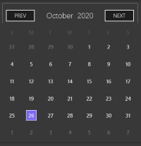

* Table of Contents
{:toc}

## Introduction
PropertyFree is adapted from AB3, which is a desktop application for managing property listing. Leveraging on Command 
Line Interface for those who are more comfortable with typing than with Graphical User Interface (GUI).

The UserGuide is still in the midst of updating. However, you can find
the commands we are aspiring toward creating for Property Agents.

--------------------------------------------------------------------------------------------------------------------

## Quick start

1. Ensure you have Java `11` or above installed in your Computer.

2. Stay tuned to our release!


   


--------------------------------------------------------------------------------------------------------------------
# CS2103-W14-1: PropertyFree User Guide

**PropertyFree is a management system for property agents to track and manage their property listing 
details.** It **a**llows users to easily take control of their bookkeeping matters inclusive of seller ask prices, 
bidder buy prices, key details of properties and record keeping of past properties. 

PropertyFree also provides a 
calendar for property agents to manage their schedule be it for property viewings or meeting with clients. 
It is optimized for CLI users so that the bookkeeping can be done faster by typing in commands.


# Features

> **Command format**
> - Words in `UPPER_CASE` are the parameters to be supplied by the user. e.g. in `add-p n/PROPERTY_NAME`, `PROPERTY_NAME` is a parameter which can be used as `add-p n/Sunrise Residences`.
> - Items in square brackets are optional. e.g. `edit-p [n/PROPERTY_NAME]` implies that `PROPERTY_NAME` is an optional parameter.
> - Parameters can be in any order. e.g. if the command specified `add-p n/PROPERTY_NAME a/ADDRESS`, `add-p a/ADDRESS n/PROPERTY_NAME` is also acceptable.

## Viewing help 

Format: `help`  
Displays a link to this User Guide.

---

# Property Features

## Adding a property: 

Adds a property and its relevant details to the property list.

- Command:  `add-p`
- Format: `add-p n/PROPERTY_NAME s/SELLER_ID ap/ASKING_PRICE t/TYPE a/ADDRESS r/IS_RENTAL`

:warning: The seller id must exist inside the seller list.

Example:

```
add-p n/Sunrise s/S1 ap/100 t/Landed a/99 Sunrise Street r/No
```

Expected Output:

```
New property added: Sunrise
Property Id: P1
Address: 99 Sunrise Street
Property type: Landed
Asking price: $100.00
Seller Id: S1
```

💡 ```IS_RENTAL``` can be the following format : Yes / yes / Y / y or No / no / N / n

## Listing all properties

Command: `list-p`  
Shows a list of all properties in the property list.  

Expected Output: `Listed all properties.`

## Editing a property

Edits an existing property in the property list.  

- Command: `edit-p`
- Format: `edit-p INDEX [n/NAME] [a/ADDRESS] [s/SELLER_ID] [ap/ASKING_PRICE] [t/PROPERTY_TYPE] [r/IS_RENTAL]`

> - Edits the property at the specified INDEX, which refers to the index shown on the displayed property list. The index must be a **positive integer** 1, 2, 3...
> - At least one optional field must be provided.
> - Existing values will be updated to the input values.
> - All other values will remain the same.

Example:

```
edit-p 1 n/Cove Residences a/23 Cove Street
```
Edits the property name and address of the first property to `Cove Residences` and `23 Cove Street` respectively.

Expected output:
```
Edited Property: Cove Residences
Property id: P4
Address: 23 Cove Street
Property type: HDB
Asking price: $99.00
Seller id: S20
```

## Finding properties

Find properties that satisfy all of the user's filters.  
Format: `find-p [p/PROPERTY_ID_KEYWORDS] [n/NAME_KEYWORDS] [a/ADDRESS_KEYWORDS] [s/SELLER_ID_KEYWORDS] [t/PROPERTY_TYPE_KEYWORDS] [ap/ASKING_PRICE_FILTER] [r/IS_RENTAL] [c/IS_CLOSED_DEAL]`

|   |**Formats**|
|---|---|
|💡|<p>Format for attributes that search by keywords (property name, address, seller id, property id, property type): keywords delimited by whitespace. <br>For example, `n/Sunrise Cove a/Street Road`<br><br> Format for asking price filter: `< / <= / == / > / >= PRICE`<br>For example, `ap/<= 100`<br><br>Format for is rental: `y / yes / n / no`<br><br>Format for is closed deal: `close` or `active`</p>|

> - The search is case insensitive for all attributes. e.g. `cove` will match `Cove`.
> - For keywords-based search, the order of keywords does not matter. e.g. `Street Main` will match with `Main Street`.
> - Only full words will be matched. e.g. `Sun` will not match `Sunrise`.
> - Properties matching at least one keyword is considered a match. e.g. `Sunrise View` will match `Sunrise Avenue`.
> - The search returns properties matching **all** options. e.g. The command `find-p n/Sunrise ap/< 100` will return the property with name `Sunrise Avenue` and asking price `99` but not the property with name `Sunrise Avenue` with asking price of `500`.

Example:

```
find-p n/Cove Sunrise ap/<= 100 r/no
```

Expected output:
```
2 properties listed!
```
Displays all properties whose names contains either `Cove` or `Sunrise`, asking price is less than or equals to `100`, **and** is not a rental property.

## Deleting a property

Deletes a property listing from the property list.

- Command: `delete-p`
- Format: `delete-p PROPERTY_ID` or `delete-p INDEX`

> - Deletes the property at the specified INDEX or with the specified PROPERTY_ID.
> - The index refers to the index shown on the displayed property list.
> - The index must be a **positive number** e.g. 1, 2, 3,...

Examples:

```
delete-p P23
```
Deletes the property whose property id is `P23`.

```
delete-p 5
```
Deletes the fifth property in the property list.

Expected Output:
```
Deleted Property: Sunrise Avenue
Property id: P23
Address: Block 123
Property type: HDB
Asking price: $100.00
Seller id: S2
```

---

# Bidder Features

## **Addition of Bidder**

Adds a bidder to the bidder list.

- Command: `add-b`
- Format: `add-b n/BIDDER_NAME p/PHONE_NUMBER`

Example:

```java
add-b n/Marcus Duigan p/12345678 
```

Expected Output:

```java
New bidder added: 
		Name: Marcus Duigan 
    Phone number: 12345678
		Id: B1
		Tags: [bidder]
```

## Searching for **Bidder**

User can search for a list of bidders based on their name. The returned list will retain names that matched with the keywords supplied.

- Command: `find-b`
- Format: **`find-b <KEYWORDS>`**

Example:

```java
find-b duigan
```

Expected Output:

```java
1 bidder(s) listed.
```

## View List **of Bidder**

Brings user to the bidder tab and shows the whole list of bidders. Can be used after filtering / searching bidders.

- Command: `list-b`
- Format: `list-b`

Example:

```java
list-b
```

Expected Output:

```java
Listed all bidders.
```

## Edit **of Bidder**

Edits the information of a bidder who is corresponding to the index in the list of bidders. Names, phone number and tags can be edited. 

- Command: `edit-b`
- Format: `edit-b <INDEX> [n/NEW_NAME] [p/NEW_PHONE_NUMER] [t/NEW_TAGS]`

Example:

```java
edit-b 1 n/Marcus Weagle Duigan p/987654321 t/Bidder
```

Expected Output:

```java
Edited Bidder:
	Name: Marcus Weagle Duigan
	Phone: 987654321
	Id: B1
	Tags: [Bidder]
```

The index will only correspond to the original list, NOT the filtered list (when used in search).

## Delete **Bidder**

Deletes the bidder that is corresponding to the index of the bidder in the list of the bidders.

- Command: `delete-b`
- Format: `delete-b <INDEX>`

Example:

```java
delete-b 1 
```

Expected Output:

```java
Deleted Bidder:
	Name: Marcus Weagle Duigan
	Phone: 987654321
	Id: B1
	Tags: [Bidder]
```

The index will only correspond to the original list, NOT the filtered list (when used in search).

# Seller Features

## **Addition of Seller**

Adds a seller to the seller list.

- Command: `add-s`
- Format: `add-s n/SELLER_NAME p/PHONE_NUMBER`

Example:

```java
add-s n/Kor Ming Soon p/12345778 
```

Expected Output:

```java
New seller added: 
		Name: Kor Ming Soon
    Phone number: 12345778 
		Id: S1
		Tags: [seller]
```

## Searching for **Seller**

User can search for a list of sellers based on their name. The returned list will retain names that matched with the keywords supplied.

- Command: `find-s`
- Format: **`find-s <KEYWORDS>`**

Example:

```java
find-s Ming
```

Expected Output:

```java
1 seller(s) listed.
```

## View List **of Seller**

Brings user to the seller tab and shows the whole list of sellers. Can be used after filtering / searching sellers.

- Command: `list-s`
- Format: `list-s`

Example:

```java
list-b
```

Expected Output:

```java
Listed all sellers.
```

## Edit **of Seller**

Edits the information of a seller who is corresponding to the index in the list of sellers. Names, phone number and tags can be edited. 

- Command: `edit-s`
- Format: `edit-s <INDEX> [n/NEW_NAME] [p/NEW_PHONE_NUMER] [t/NEW_TAGS]`

Example:

```java
edit-s 1 n/Joven Kor Ming Soon p/987654321 t/SELLER
```

Expected Output:

```java
Edited Seller:
	Name: Joven Kor Ming Soon
	Phone: 987654321
	Id: S1
	Tags: [SELLER]
```

The index will only correspond to the original list, NOT the filtered list (when used in search).

## Delete **Seller**

Deletes the seller that is corresponding to the index of the seller in the list of the sellers.

- Command: `delete-s`
- Format: `delete-s <INDEX>`

Example:

```java
delete-s 1 
```

Expected Output:

```java
Deleted Seller:
	Name: Joven Kor Ming Soon
	Phone: 987654321
	Id: B1
	Tags: [SELLER]
```

The index will only correspond to the original list, NOT the filtered list (when used in search).


# Bid Features

---

## Adding to Bid to a Property

Adds a bid to the bid list in order of property followed by bid amount

- Command: `add-bid`
- Format: `add-bid b/ PROPERTY_ID c/ BIDDER_ID m/ BID_AMOUNT`

Example:

```
add-bid b/ P1 c/ B2 m/ 150000.20
```

Expected Output:

```
New bid added: 
Bid of $150000.20
by B2
to property: P1
```

## View full List of Bids

Will display all bids in the bid list

- Command: `list-bid`
- Format: `list-bid`

Example:

```
list-bid
```

Expected Output:

```
Listed all bids
```

## Deletion of Existing Bid

Will delete a bid based on its number in the bid list

- Command: `delete-bid`
- Format: `delete-bid <INDEX_NUMBER_OF_BID_TO_DELETE>`

Example:

```
delete-bid 1
```

Expected Output:

```
Deleted Bid: 
Bid of $150000.20
by B2
to property: P1
```

## Editing Bid from a Property

Will edit a bidder’s bid value for a specific property

- Command: `edit-bid`

#### edit-bid command can edit multiple parameters at once and can be a combination of b/ c/ or m/

##### Example formats
- Format 1: `edit-bid <index number of bid to edit> b/ [NEW_PROPERTY_ID]` (edits only the propertyId)
- Format 2: `edit-bid <index number of bid to edit> c/ [NEW_BIDDER_ID]` (edits only the bidderId)
- Format 3: `edit-bid <index number of bid to edit> m/ [NEW_BID_AMOUNT]` (edits only the bidAmount)
- Format 4: `edit-bid <index number of bid to edit> b/ [NEW_PROPERTY_ID] c/ [NEW_BIDDER_ID]` (edits only the propertyId and bidderId)
- Format 5: `edit-bid <index number of bid to edit> c/ [NEW_BIDDER_ID] m/ [NEW_BID_AMOUNT]` (edits only the bidderId and bidAmount)
- Format 6: `edit-bid <index number of bid to edit> b/ [NEW_PROPERTY_ID] m/ [NEW_BID_AMOUNT]` (edits only the propertyId and bidAmount)
- Format 7: `edit-bid <index number of bid to edit> b/ [NEW_PROPERTY_ID] c/ [NEW_BIDDER_ID] m/ [NEW_BID_AMOUNT]` (edits all parameters)           
Example:

```
edit-bid 1 b/ P99 c/ B12 m/1.20
```

Expected Output:

```
Edited Bid:

FROM: 
Bid of $999999.00
by B2
to property: P3 

TO: 
Bid of $1.20
by B12
to property: P99
```

## Find a specific bid based on id

Will display all bids in the bid list that contains the id specified by the user

- Command: `find-bid`
- Format: `find-bid [KEYWORDS]`

Example:

```
find-bid P1 B2 $65000.00
```

Expected Output:

```
4 bids listed!
```

---

# Meeting Features

---

There are three types of meetings of which the agent will be able to add:

1. View - For viewing of properties
2. Admin - For general admin meetings
3. Paperwork - For signing of paperwork related to the selling and buying of the house

---

## Add a View Meeting

Creates a view meeting to be added to the schedule.

- Command: `add-m q/v`
- Format: `add-m q/v b/<BIDDER_ID> p/<PROPERTY_ID> v/<VENUE> t/<DATE>`

Example:

```java
add-m q/v b/B12 p/P12 v/2 ALBERT PARK t/11-12-2021
```
💡 p/BIDDER_ID indicates the id of the bidder.

💡 p/PROPERTY_ID indicates the id of the property listing.

💡 t/VENUE indicates the venue of the meeting.

💡 t/DATE indicates the date of the meeting.

Expected Output:

```java
New meeting added: Viewing
Bidder Id: B12
Property Id: P12
Venue: 2 ALBERT PARK
Date: 11-12-2021
```

## Add an Administrative Meeting

Creates an admin meeting to be added to the schedule.

- Command: `add-m q/a`
- Format: `add-m q/a b/<BIDDER_ID> p/<PROPERTY_ID> v/<VENUE> t/<DATE>`

Example:

```java
add-m q/a b/B12 p/P12 v/2 ALBERT PARK t/11-12-2021
```
💡 p/BIDDER_ID indicates the id of the bidder.

💡 p/PROPERTY_ID indicates the id of the property listing.

💡 t/VENUE indicates the venue of the meeting.

💡 t/DATE indicates the date of the meeting.

Expected Output:

```java
New meeting added: Admin
Bidder Id: B12
Property Id: P12
Venue: 2 ALBERT PARK
Date: 11-12-2021
```

## Add a Paperwork Meeting

Creates a paperwork meeting to be added to the schedule.

- Command: `add-m q/p`
- Format: `add-m q/p b/<BIDDER_ID> p/<PROPERTY_ID> v/<VENUE> t/<DATE>`

Example:

```java
add-m q/p b/B12 p/P12 v/2 ALBERT PARK t/11-12-2021
```
💡 p/BIDDER_ID indicates the id of the bidder.

💡 p/PROPERTY_ID indicates the id of the property listing.

💡 t/VENUE indicates the venue of the meeting.

💡 t/DATE indicates the date of the meeting.

Expected Output:

```java
New meeting added: Paperwork
Bidder Id: B12
Property Id: P12
Venue: 2 ALBERT PARK
Date: 11-12-2021
```

## Deleting an Existing Meeting


Deletes a meeting from the calendar when a meeting is cancelled

- Command: `delete-m`
- Format: `delete-m <INDEX>`

Example:

```java
delete-m 3
```

Expected Output:

```java
Deleted Meeting: Paperwork
Bidder Id: B12
Property Id: P12
Venue: eunos
Date: 12-05-2016
```

## View the list of all Meetings

Lists all the meetings in the meetingbook. Can be used after using the find meeting feature.

- Command: `list-m`
- Format: `list-m`

Example:

```java
list-m
```
Expected Output:

```java
Listed all meetings
```

## Editing an Existing Meeting

Edits an existing meeting detail that is in the list.

- Command: `edit-m`
- Format: `edit-m <INDEX> b/BIDDER_ID p/PROPERTY_ID v/VENUE t/DATE`

Example:

```java
edit-m 2 v/eunos
```

Expected Output:

```java
Edited Meeting: Admin
Bidder Id: B12
Property Id: P12
Venue: eunos
Date: 12-05-2016
```
The index will only correspond to the original list, NOT the filtered list (when used in find).


## Calendar Navigation Features

Calendar navigation features are commands which help the agent to navigate through the calendar. There are only two commands `next` and `prev` which aim to better serve agents who are more inclined with command line interface. 

## Navigate To Next Month in Calendar

Brings the next month page to view.

- Command: `next`
- Format: `next`


Example:

```java
next
```

Expected Output:

```java
Display next month of Calendar
```
Picture Example:

| Before (October)      | After (November) |
| ----------- | ----------- |
|  | |


## Navigate To Previous Month in Calendar

Brings the previous month page to view.

- Command: `prev`
- Format: `prev`

Example:

```java
prev
```

Expected Output:

```java
Display previous month of Calendar
```

Picture Example:

| Before (November)      | After (October) |
| ----------- | ----------- |
|  |  |

## FAQ

To be completed. Stay tuned!
