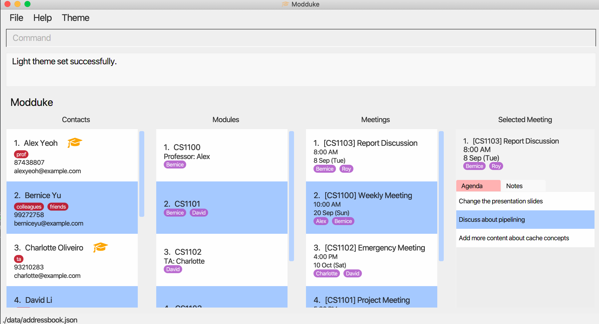
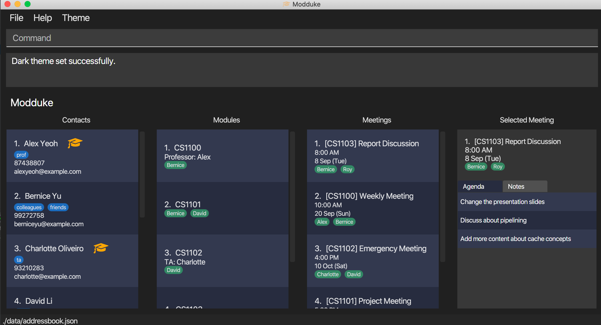
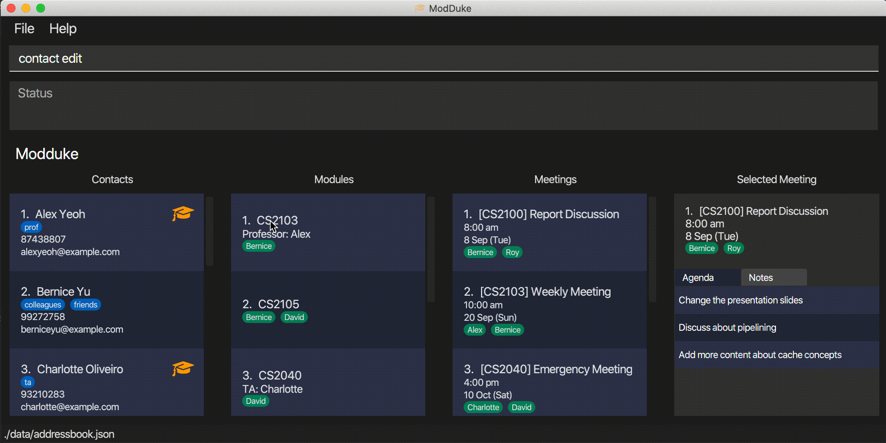
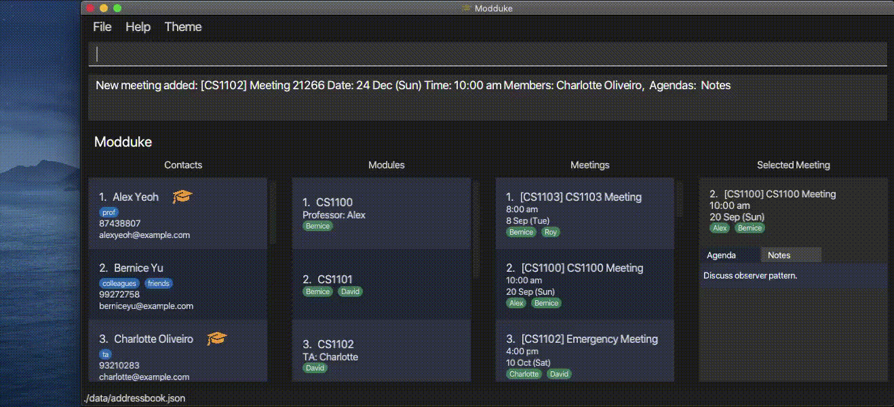

Modduke is a **desktop app targeted towards NUS students handling multiple projects. It allows them to easily manage their contacts, modules and meetings during the semester.** The user interacts with it using a CLI, and it has a GUI created with JavaFX. It is written in Java, and has about 13 kLoC.

* Table of Contents
{:toc}

--------------------------------------------------------------------------------------------------------------------

## Quick start

1. Ensure you have Java `11` or above installed in your Computer.

1. Download the latest `modduke.jar` from [here](https://github.com/AY2021S1-CS2103-F10-2/tp/releases).

1. Copy the file to the folder you want to use as the _home folder_ for your Modduke.

1. Using your terminal, navigate to folder containing `modduke.jar` and run the command `java -jar modduke.jar`. The GUI similar to the below should appear in a few seconds. Note how the app contains some sample data. 
   

1. Type the command in the command box and press Enter to execute it. e.g. typing **`help`** and pressing Enter will open the help window. 
   Some example commands you can try:

   * **`contact list`** : Lists all contacts.

   * **`contact add`** `n/John Doe p/98765432 e/johnd@example.com` : Adds a contact named `John Doe` to Modduke.

   * **`contact delete`** `n/John Doe` : Deletes `John Doe` from the Modduke.

   * **`contact clear`** : Deletes all contacts.

   * **`exit`** : Exits Modduke.

1. Refer to the [Features](#features) below for details of each command.

--------------------------------------------------------------------------------------------------------------------

## Features

**:information_source: Notes about the command format:** 

* Words in `UPPER_CASE` are the parameters to be supplied by the user. 
  e.g. in `add n/CONTACT_NAME`, `CONTACT_NAME` is a parameter which can be used as `add n/John Doe`.

* Items in square brackets are optional. 
  e.g `n/CONTACT_NAME [t/TAG]` can be used as `n/John Doe t/friend` or as `n/John Doe`.

* Items with `…`​ after them can be used multiple times including zero times. 
  e.g. `[t/TAG]…​` can be used as ` ` (i.e. 0 times), `t/friend`, `t/friend t/family` etc.

* Parameters can be in any order. 
  e.g. if the command specifies `n/CONTACT_NAME p/PHONE_NUMBER`, `p/PHONE_NUMBER n/CONTACT_NAME` is also acceptable.

* All parameters are `CASE-SENSITIVE` unless stated otherwise. 

* The `CONTACT_NAME` parameter refers to the full name of the contact.

* There are 2 special tags `prof` and `ta`. Contacts with either of these tags will be classified as professor or ta
 respectively. Users are not allowed to tag a contact as both `prof` and `ta`. Hence, if your professor is also your ta, only the
 `prof` tag should be used.

### Viewing help : `help`

Shows a message explaining how to access the help page.

Note(s):
* Can be activated by the F1 key.
* Can be activated by clicking the context menu.

### Setting light theme: `light`

Sets the application to the light theme.

Format: `light`

Note(s):
* Can be activated by the F2 key.
* Can be activated by clicking the context menu.
* If the help window or timeline window was opened and a change of theme was done, they must be closed and reopened for the change of theme to take effect.

### Setting dark theme: `dark`

Sets the application to the dark theme.

Format: `dark`

Note(s):
* Can be activated by the F3 key.
* Can be activated by clicking the context menu.
* If the help window or timeline window was opened and a change of theme was done, they must be closed and reopened for the change of theme to take effect.

### Fuzzy Find Completion (Fzf)

Currently Modduke supports Fuzzy Find Completion from v1.4 onward. You can trigger the fzf mode
using `ctrl + space`. Currently our fzf will search through all contact names, module names and meeting names and will
match entries that contain the prefix entered.

You can exit fzf mode by manually pressing `esc`. You will also be taken automatically out of fzf mode once you select one
of the fzf options by navigating to desired option using arrow keys and making the selection by pressing `enter`. Alternatively,
you can make the selection using your mouse.

Note that the intuitive `tab` and `shift-tab` navigation is currently NOT supported in v1.4 although you can use these keys to jump to the first option in the fzf menu.

### Autocompletion

Currently Modduke supports autocompletion for the following fields for v1.3 onward. Note that this is a legacy
feature and most of its functionality can be achieved using our newer Fzf completion.

* Contact Name -  Triggered using `cn/`
* Module Name -  Triggered using `mdn/`
* Meeting Name -  Triggered using `mtn/`

Typing in these trigger phrases will turn the text yellow to show that CommandBox has entered Autocompletion Mode.
Use `Tab` to scroll forward and `Shift-Tab` to iterate backwards through suggestions.

Note that this autocompletion can only be triggered at the end of input string e.g.
- `contact edit cn/` will trigger the autocomplete but
- `contact edit cn/ p/98830181` this would not as there is text after the trigger phrase.

* Note that while in Autocomplete mode you cannot edit suggestions unless you iterated back to your own input or you press `Backspace`.
* Pressing `Enter` will lock in your current selection and take you out of Autocomplete mode.

### Command History
Similar to other command lines, Modduke supports a command history function where pressing the up or down keys brings 
users back to previous successful commands.

The `Up` key brings users to previous command wheras the `Down` key brings users to the next command in the command history 
queue.

* Note that the commands must be successful to be logged into command history and that command history only tracks commands
in the current session. This means if Moduke is restarted, commands in the previous sessions won't be available.

### Adding a contact : `contact add`

Adds a contact to Modduke.

Format: `contact add n/CONTACT_NAME p/PHONE_NUMBER e/EMAIL [t/TAG]...`

Note(s):
* All fields are required except those in square brackets. No duplicate names.
* CONTACT_NAME must be alphanumeric.
* PHONE_NUMBER must be at least 3 digits but not longer than 20 digits.

Example(s):
* `contact add n/John Doe p/98765432 e/johnd@example.com`

### Deleting a contact : `contact delete`

Delete contacts with the given criteria from Modduke.

Format: `contact delete [n/CONTACT_NAME]... [m/MODULE_NAME]... [t/TAG_NAME]...`

Note(s):
* [n/CONTACT_NAME], [m/MODULE_NAME] and [t/TAG_NAME] are all optional fields.
* At least one of the optional fields must be provided.
* If there are no more members in a meeting or module after they are deleted, then the meeting or module will be deleted as well.

Example(s):
* `contact delete n/Roy Chan n/Jake Ng` delete contacts `Roy Chan` and `Jake Ng` from Modduke.
* `contact delete m/CS2103 t/classmates` deletes all contacts in `CS2103` module or have `classmates` tag

### Editing a contact : `contact edit`

Edits an existing contact in Modduke.

Format: `contact edit CONTACT_NAME [n/NEW_NAME] [p/PHONE] [e/EMAIL]`

Note(s): 
* At least one optional field must be provided

Examples:
*  `contact edit John Doe p/91234567 e/johndoe@example.com` Edits the phone number and email address of John Doe to be `91234567` and `johndoe@example.com` respectively.
*  `contact edit Roy Chan n/Betsy Crower` Edits the name of Roy Chan to be `Betsy Crower` and clears all existing tags.

### Clearing all contacts : `contact clear`

Deletes all existing contacts.

Format: `contact clear`

Note(s):
* Once cleared, contacts are permanently deleted.
* This command will also clear all meetings and modules.

### Viewing all contacts : `contact list`

Shows a list of all contacts in the address book.

Format: `contact list`

### Finding contacts: `contact find`

Shows a list of all contacts in the address book that have the given keywords in their name and/or the given tags.

Format: `contact find [n/KEYWORD]... [t/TAG_NAME]...`

Note(s):
* At least one optional field must be provided.
* KEYWORD is CASE-INSENSITIVE
* KEYWORD can be the initials of the full name (first letter of each word in their full name) of the contact

Example(s):
*   `find n/Tan` Shows all contacts with `tan` (case-insensitive) in their name or have initials `tan`.
*   `find n/jcyy t/classmates` Shows all contacts with `jcyy` in their name or have initials `jcyy` and persons with the `classmates` tag.

### Adding a tag to a user : `tag add`

Adds the given tags to a contact.

Format: `tag add CONTACT_NAME t/TAG_NAME...`

Note(s):
* Only 1 contact name can be used at a time but multiple tags can be added.

Example(s):
* `tag add Jay t/classmate t/friend`

### Deleting a tag from a user : `tag delete`

Deletes the given tags from a contact.

Format: `tag delete CONTACT_NAME t/TAG_NAMES...`

Note(s)
* Only 1 contact name can be used at a time but multiple tags can be deleted.
* The contact has to have the given tag.

Example(s):
* `tag delete Jay t/friend`

### Clear tags of a user : `tag clear`

Deletes all tags of a contact.

Format: `tag clear CONTACT_NAME`

Note(s):
* Only 1 contact name can be used at a time.

Example(s):
* `tag clear Jay`

### Creating a module : `module add`

Creates a Module with a given name and members .

Format: `module add n/MODULE_NAME p/MEMBER_NAME...`

Note(s):
* A Module can have more than 1 member but can only have one name.
* Need at least 1 member.
* Professors and TA's can also be added in the same format as other contacts.

Example(s):
* `module add n/CS2103 p/Roy p/Jerryl p/Yeeloon p/Jay p/Ekam`

### Listing a module : `module list`

Finds and displays all the contacts of the module specified.

Format: `module list m/MODULE_NAME`

Note(s):
* To reset the contacts list in the gui you can do the contact list command

Example(s):
* `module list m/CS2103`

### Editing a module : `module edit`

Edits a Module based on the inputted details.

Format: `module edit m/MODULE_NAME [n/NEW_MODULE_NAME] [p/MEMBER_NAME]...`

Note(s):
* At least one change has to be present (either the module name or the participants or both)
* Note that if you change the participants, the old participants will be overwritten and replaced by the newly
added participants.
* You can change either the module name, the participants or both.
* Changes to module will affect meetings based on that module, so if the meeting does not include any of the new module
participants, it will be deleted.

Example(s):
* `module edit m/CS2103 n/CS2103T p/Roy p/Jerryl p/Yeeloon p/Jay p/Ekam`

### Deleting a module : `module delete`

Deletes a module with a specific name.

Format: `module delete m/MODULE_NAME`

Note(s):
* All meetings based on the deleted module will also be deleted, once deleted there is no undo so delete the module
carefully.
* Note that module names are case-sensitive.

Example(s):
* `module delete m/CS2103`

### Adding a meeting: `meeting add`

Adds a meeting at a given date and time with specified participants, and a provided meeting name

Format: `meeting add m/MODULE n/MEETING_NAME d/MEETING_DATE t/MEETING_TIME p/PARTICIPANTS... [a/AGENDA]... [no/NOTES]...`

Note(s):
* All the fields must be provided except those in square brackets
* Date is in the YYYY-MM-dd format and time is in the hh:mm format
* Participants added need to be contacts that exist in the given module
* The `PARTICIPANTS` parameter refers to the full name of the contact
* The combination of module and meeting name must be unique
* Two meetings are not allowed to occur on the same date and time

Example(s):
*  `meeting add m/CS2103 n/weekly meeting d/2020-09-20 t/10:00 p/Jay p/Roy p/Jerryl p/Yeeloon p/Ekam
a/Discuss sequence diagram no/Revise page 2 of textbook beforehand`

### Deleting a meeting : `meeting delete`

Deletes the specified meeting from Modduke, indentified by the unique combination of module and meeting name.

Format: `meeting delete m/MODULE n/MEETING_NAME`

Example(s):
* `meeting delete m/CS2103 n/Weekly Meeting` deletes `Weekly Meeting` meeting from the module `CS2103`.

### Editing a meeting: `meeting edit`

Edits a given meeting. Listed below are the meeting details that can be changed:
1. Name
2. Date
3. Time
4. Contacts
5. Agenda
6. Note

Format: `meeting edit m/MODULE n/MEETING_NAME [nn/NEW_NAME] [d/NEW_DATE] [t/NEW_TIME] [p/NEW_PARTICIPANTS]...
[a/AGENDA]... [no/NOTES]...`

Note(s):
* At least one of the optional fields must be provided
* Date is in the YYYY-MM-dd format and time is in the hh:mm format
* Participants added need to be contacts that exist in the given module
* The `PARTICIPANTS` parameter refers to the full name of the contact
* The combination of module and meeting name must be unique
* Two meetings are not allowed to occur on the same date and time
* All the newly provided fields will override previous fields

Example(s):
* `meeting edit m/CS2103 n/Meeting d/2020-09-27 t/14:00` edits the date and time of Meeting in the module CS2103 to be
`2020-09-27` and `14:00` respectively
* `meeting edit m/CS2103 n/Meeting nn/Group Discussion` edits the name of Meeting to be `Group Discussion` in the
module CS2103

### Listing all meetings : `meeting list`

Views all the existing meetings.

Format: `meeting list`

### Viewing specific meeting: `meeting view`

Views selected meeting details, showing meeting agendas and meeting notes.

Format: `meeting view m/MODULE n/MEETING_NAME`

Note(s):
* Views the meeting with the specified meeting name in the given module.

Example(s):
* `meeting view m/CS2103 n/Weekly Meeting` views the `Weekly Meeting` meeting from the module `CS2103`.

### Copy email address of contacts : `copy email`

Copies email address of contacts with the given criteria to your clipboard.

Format: `copy email [n/CONTACT_NAME]... [m/MODULE_NAME]... [t/TAG_NAME]...`

Note(s):
* [n/CONTACT_NAME], [m/MODULE_NAME] and [t/TAG_NAME] are all optional fields,
* At least one of the optional fields must be provided.

Example(s):
* `copy email n/Bob Ross`
* `copy email m/CS2103 t/classmate n/Tom Tan n/Jerryl Chong`

### Copy phone numbers of contacts : `copy phone`

Copies phone numbers of contacts with the given criteria to your clipboard.

Format: `copy phone [n/CONTACT_NAME]... [m/MODULE_NAME]... [t/TAG_NAME]...`

Note(s):
* [n/CONTACT_NAME], [m/MODULE_NAME] and [t/TAG_NAME] are all optional fields,
* At least one of the optional fields must be provided.

Example(s):
* `copy phone m/CS2103`
* `copy phone m/CS1010 t/classmate n/Bob Ross n/Peter Parker`

### Viewing the timeline : `timeline`

Displays the timeline in a new window.

Format: `timeline`

Note(s):
* Meetings are displayed in chronological order, with the earliest meeting on the left side of the window
* Meetings that have passed the date and time at the point which the application was first opened are marked red

### Exiting the program : `exit`

Exits the program.

Format: `exit`

### Saving the data

Modduke's data is saved in the hard disk automatically after any command that changes the data. There is no need to save manually.

### Command Line Shortcuts

Shortcut | Action
--------|------------------
`Ctrl-U` | Clears CommandBox
`Ctrl-W` | Deletes text from the cursor position to previous word

--------------------------------------------------------------------------------------------------------------------

## FAQ

**Q**: How do I transfer my data to another Computer? 
**A**: Install the app in the other computer and overwrite the empty data file it creates with the file that contains the data of your previous Modduke home folder.

**Q**: Can I retrieve my contacts after I have delete them? 
**A**: No. Contacts are permanently deleted and cannot be retrieved after.

**Q**: If I face an error/bug, where can I seek assistance? 
**A**: You can head to the **[Modduke GitHub Issues page](https://github.com/AY2021S1-CS2103-F10-2/tp/issues)** and create or find your issue there.

**Q**: Are commands case-sensitive? 
**A**: Yes

**Q**: Can I import contacts from my existing devices e.g. Mobile Phones / Email? 
**A**: Unfortunately we currently do not support this.

--------------------------------------------------------------------------------------------------------------------

## Command summary

Action | Format, Examples
--------|------------------
**Add Contact** | `contact add n/CONTACT_NAME p/PHONE_NUMBER e/EMAIL [t/TAG]...`   e.g., `contact add n/Jay p/22224444 e/jay@example.com`
**Clear Contacts** | `contact clear`
**Delete Contacts** | `contact delete [n/CONTACT_NAME]... [m/MODULE_NAME]... [t/TAG_NAME]...`  e.g., `contact delete n/Jay t/friend m/CS2103`
**Edit Contacts** | `contact edit CONTACT_NAME [n/NEW_NAME] [p/PHONE] [e/EMAIL]`   e.g.,`contact edit Jay n/Roy e/roy@example.com`
**List Contacts** | `contact list`
**Find Contacts** | `find [n/KEYWORD]... [t/TAG_NAME]...`   e.g.,`find n/Roy t/friend`
**Add Module** | `module add [m/MODULE_NAME] p/MEMBER_NAMES...`  e.g., `module add n/CS2103 p/Jay p/Roy`
**List Modules** | `module list  [m/MODULE_NAME]`  e.g., `module list m/CS2103`
**Edit Modules** | `module edit m/MODULE_NAME [n/MODULE_NEWNAME] [p/MEMBER_NAMES]...`  e.g., `module edit m/CS2103 n/CS2103T p/Roy p/Jay`
**Delete modules** | `module delete m/MODULE_NAME`  e.g., `module delete m/CS2103`
**Add Tags** | `tag add CONTACT_NAME t/TAG_NAME...`   e.g., `tag add Jay t/acquaintance`
**Delete Tags** | `tag delete CONTACT_NAME t/TAG_NAME...`   e.g., `tag delete Jay t/friend`
**Clear Tags** | `tag clear CONTACT_NAME`   e.g., `tag clear Jay`
**Add Meeting** | `meeting add m/MODULE n/MEETING_NAME d/MEETING_DATE t/MEETING_TIME p/PARTICIPANTS... [a/AGENDA]... [no/NOTES]...`   e.g., `meeting add m/CS2103 n/Meeting d/2020:09:23 t/10:00 p/Ekam p/Jay p/Jerryl p/Roy`
**Delete Meeting** | `meeting delete m/MODULE n/MEETING_NAME`   e.g., `meeting delete m/CS2103 n/Weekly Meeting`
**Edit Meeting** |  `meeting edit m/MODULE n/MEETING_NAME [nn/NEW_NAME] [d/NEW_DATE] [t/NEW_TIME] [p/NEW_PARTICIPANTS]... [a/AGENDA]... [no/NOTES]...`   e.g., `meeting edit m/CS2103 n/Meeting d/2020-09-27 t/14:00`
**List Meetings** | `meeting list`
**View Meeting** | `meeting view m/MODULE n/MEETING_NAME`    e.g., `meeting view m/CS2100 n/Report Discussion`
**Copy Email** | `copy email [n/CONTACT_NAME]... [m/MODULE_NAME]... [t/TAG_NAME]...`   e.g.,`copy email m/CS2103 t/classmate n/Tom Tan n/Jerryl Chong`
**Copy Phone** | `copy phone [n/CONTACT_NAME]... [m/MODULE_NAME]... [t/TAG_NAME]...`   e.g.,`copy phone m/CS2103 t/classmate n/Tom Tan n/Jerryl Chong`
**Display Timeline** | `timeline`
**Display Help** | `help`
**Switch to Light Theme** | `light`
**Switch to Dark Theme** | `dark`

