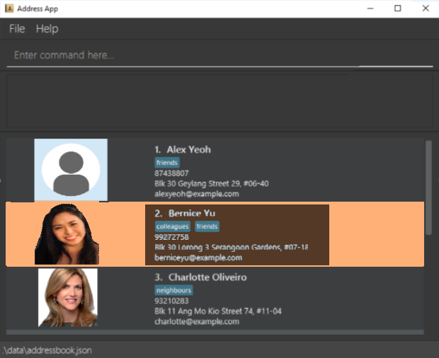

Clinic Calendar (CliniCal) is a **desktop app for managing patients and appointments, optimized for use via a Command Line Interface** (CLI) while still having the benefits of a Graphical User Interface (GUI). If you can type fast, CliniCal can get your contact management tasks done faster than traditional GUI apps.

* Table of Contents
{:toc}

--------------------------------------------------------------------------------------------------------------------

## Quick start

1. Ensure you have Java `11` or above installed in your Computer.

1. Download the latest `CliniCal.jar` from [here](https://github.com/AY2021S1-CS2103T-W11-4/tp/releases).

1. Copy the file to the folder you want to use as the _home folder_ for CliniCal.

1. Double-click the file to start the app. The GUI similar to the below should appear in a few seconds. Note how the app contains some sample data. 
   

1. Type the command in the command box and press Enter to execute it. e.g. typing **`help`** and pressing Enter will open the help window. 
   Some example commands you can try:

   * **`list`** : Lists all patients.

   * **`add`**`n/John Doe p/98765432 e/johnd@example.com a/John street, block 123, #01-01` : Adds a patient named `John Doe` to the Address Book.

   * **`delete`**`3` : Deletes the 3rd patient shown in the current list.

   * **`clear`** : Deletes all patient contacts.

   * **`exit`** : Exits the app.

1. Refer to the [Features](#features) below for details of each command.

--------------------------------------------------------------------------------------------------------------------

## Features

**:information_source: Notes about the command format:** 

* Words in `UPPER_CASE` are the parameters to be supplied by the user. 
  e.g. in `add n/NAME`, `NAME` is a parameter which can be used as `add n/John Doe`.

* Items in square brackets are optional. 
  e.g `n/NAME [t/TAG]` can be used as `n/John Doe t/friend` or as `n/John Doe`.

* Items with `…` after them can be used multiple times including zero times. 
  e.g. `[t/TAG]…` can be used as ` ` (i.e. 0 times), `t/friend`, `t/friend t/family` etc.

* Parameters can be in any order. 
  e.g. if the command specifies `n/NAME p/PHONE_NUMBER`, `p/PHONE_NUMBER n/NAME` is also acceptable.

### Commands

#### Viewing help : `help`

Shows a message explaning how to access the help page.

Format: `help`

#### Adding a patient: `add`

Adds a patient to the address book.

Format: `add n/NAME p/PHONE_NUMBER e/EMAIL a/ADDRESS [ct/COLOR_TAG] [t/TAG]…`

:bulb: **Tips:** 

* A patient can have any number of tags (including 0)

* The color tag can be any standard HTML color name, such as red, green or orange. 
  Check out [this link](https://www.w3schools.com/colors/colors_names.asp) for an extensive list.

Examples:
* `add n/John Doe p/98765432 e/johnd@example.com a/John street, block 123, #01-01`
* `add n/Betsy Crowe t/friend e/betsycrowe@example.com a/Newgate Prison p/1234567 t/criminal`

#### Adding profile picture using keyboard: `addPicture`

Adds a profile picture to the patient’s profile by specifying filepath to desired profile picture.

Format: `addPicture INDEX f/FILE_PATH`

Examples:
*  `addPicture 1 f/data/profile_picture.png` Replaces existing profile picture with 'profile_picture.png' for the 1st patient
*  `addPicture 2 f/downloads/profile_picture.png` Replaces existing profile picture with 'profile_picture.png' found in 
                                                  'downloads' folder for the 2nd patient

#### Adding profile picture using mouse:

Adds a profile picture to the patient’s profile by using drag and drop with your mouse.

1. Select the desired profile picture and drag it onto the space reserved for patient profile picture in ClinCal.
2. Release mouse button and patient's profile picture would be updated with your desired picture.

#### Listing all patients: `list`

Shows a list of all patients in the address book.

Format: `list`

#### Editing a patient: `edit`

Edits an existing patient in the address book.

Format: `edit INDEX [n/NAME] [p/PHONE] [e/EMAIL] [a/ADDRESS] [ct/COLOR_TAG] [t/TAG]…`

* Edits the patient at the specified `INDEX`. The index refers to the index number shown in the displayed patient list. The index **must be a positive integer** 1, 2, 3, …​
* At least one of the optional fields must be provided.
* Existing values will be updated to the input values.

* You can remove all the patient’s tags by typing `t/` without specifying any tags after it. The same applies for color tags of a patient.

Examples:
*  `edit 1 p/91234567 e/johndoe@example.com` Edits the phone number and email address of the 1st patient to be `91234567` and `johndoe@example.com` respectively.
*  `edit 2 n/Betsy Crower t/` Edits the name of the 2nd patient to be `Betsy Crower` and clears all existing tags.
* When editing tags (or color tag), the existing tags (or color tag) of the patient will be removed i.e adding of tags (or color tag) is not cumulative.
* You can remove all the patient’s tags by typing `t/` without specifying any tags after it.

Examples:
*  `edit 1 p/91234567 e/johndoe@example.com` Edits the phone number and email address of the 1st patient to be `91234567` and `johndoe@example.com` respectively.
*  `edit 2 n/Betsy Crower t/` Edits the name of the 2nd patient to be `Betsy Crower` and clears all existing tags.
*  `edit 3 ct/red` Clears the existing color tag dits the color tag of the 3rd patient to be `red`.

#### Locating patients by name: `find`

Finds patients whose names contain any of the given keywords.

Format: `find KEYWORD [MORE_KEYWORDS]`

* The search is case-insensitive. e.g `hans` will match `Hans`
* The order of the keywords does not matter. e.g. `Hans Bo` will match `Bo Hans`
* Only the name is searched.
* Only full words will be matched e.g. `Han` will not match `Hans`
* Patients matching at least one keyword will be returned (i.e. `OR` search).
  e.g. `Hans Bo` will return `Hans Gruber`, `Bo Yang`

Examples:
* `find John` returns `john` and `John Doe`
* `find alex david` returns `Alex Yeoh`, `David Li` 
  

#### Deleting a patient: `delete`

Deletes the specified patient from the address book.

Format: `delete INDEX`

* Deletes the patient at the specified `INDEX`.
* The index refers to the index number shown in the displayed patient list.
* The index **must be a positive integer** 1, 2, 3, …​

Examples:
* `list` followed by `delete 2` deletes the 2nd patient in the address book.
* `find Betsy` followed by `delete 1` deletes the 1st patient in the results of the `find` command.

#### Clearing all entries : `clear`

Clears all entries from the address book.

Format: `clear`

#### Clearing command history : `clearhistory`

Clears command history from the address book.

Format: `clearhistory`

#### Exiting the program : `exit`

Exits the program.

Format: `exit`

#### Undoing the previous command: `undo` 

Reverts the previous command given by the user. 

Format: `undo`

#### Redoing a command : `redo` 

Redoes the most recent command that the user has undone. 

Format: `redo` 

#### Retrieve past commands : `history`

Retrieves a list of past commands that the user had used during the session.

Format: `history`

### Saving the data

CliniCal data is saved in the hard disk automatically after any command that changes the data. There is no need to save manually.

### Color coding patients

When a patient is tagged with a color tag, the background of the patient will be styled to show that color. The color tags can be used for a variety of purposes; for example, a doctor may color code patients at risk of terminal diseases as orange, for easier reference.

--------------------------------------------------------------------------------------------------------------------

## FAQ

**Q**: How do I transfer my data to another Computer? 
**A**: Install the app in the other computer and overwrite the empty data file it creates with the file that contains the data of your previous CliniCal home folder.

--------------------------------------------------------------------------------------------------------------------

## Command summary

Action | Format, Examples
--------|------------------
**Add** | `add n/NAME p/PHONE_NUMBER e/EMAIL a/ADDRESS [ct/COLOR_TAG] [t/TAG]…​`   e.g., `add n/James Ho p/22224444 e/jamesho@example.com a/123, Clementi Rd, 1234665 t/friend t/colleague`
**Add profile picture** | `addProfilePicture 1 f/data/profile_picture.png`
**Clear** | `clear`
**Clear command history** | `clearhistory`
**Delete** | `delete INDEX`  e.g., `delete 3`
**Edit** | `edit INDEX [n/NAME] [p/PHONE_NUMBER] [e/EMAIL] [a/ADDRESS] [ct/COLOR_TAG] [t/TAG]…`  e.g.,`edit 2 n/James Lee e/jameslee@example.com`
**Find** | `find KEYWORD [MORE_KEYWORDS]`  e.g., `find James Jake`
**List** | `list`
**Help** | `help`
**Undo** | `undo`
**Redo** | `redo`
**Retrieve past commands** | `history`
