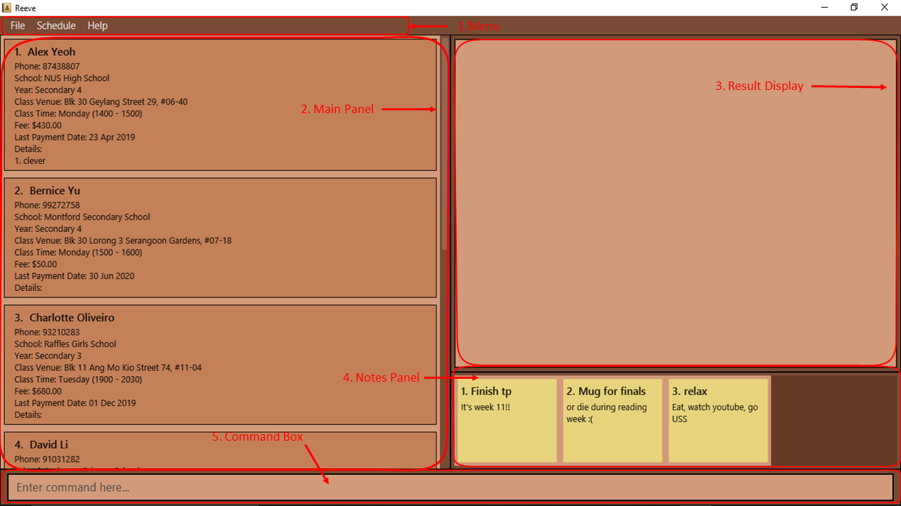
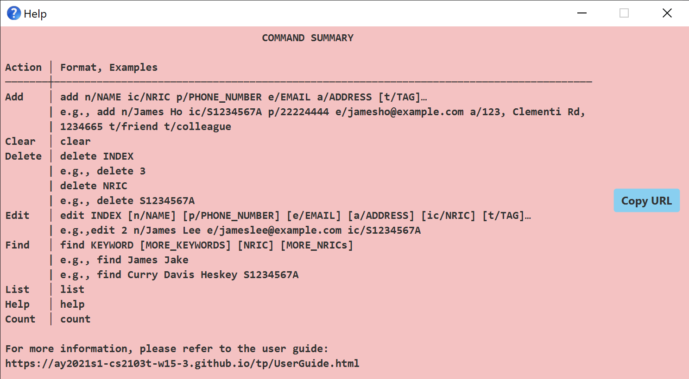

## Reeve - User Guide

**Table of Contents**
- [1. Introduction](#1-introduction)
  * [1.1 About **Reeve**](#11-about-reeve)
  * [1.2 Understanding the User Guide](#12-understanding-the-user-guide)
- [2. Quick start](#2-quick-start)
  * [2.1 Setting up **Reeve**](#21-setting-up-reeve)
  * [2.2 Making sense of **Reeve**'s layout](#22-making-sense-of-reeves-layout)
- [3. Features](#3-features)
  * [3.1 Understanding the command format](#31-understanding-the-command-format)
  * [3.2 General features](#32-general-features)
    + [3.2.1 Viewing help: `help`](#321-viewing-help-help)
    + [3.2.2 Toggling between academic and administrative details: `toggle` (By: Hogan)](#322-toggling-between-academic-and-administrative-details-toggle-by-hogan)
    + [3.2.3 Exiting the program: `exit`](#323-exiting-the-program-exit)
  * [3.3 Features for managing student administrative details](#33-features-for-managing-student-administrative-details)
    + [3.3.1 Adding a student: `add` (By: Hogan)](#331-adding-a-student-add-by-hogan)
    + [3.3.2 Listing all students: `list`](#332-listing-all-students-list)
    + [3.3.3 Editing a student: `edit` (By: Vaishak)](#333-editing-a-student-edit-by-vaishak)
    + [3.3.4 Locating students: `find` (By: Choon Siong)](#334-locating-students-find-by-choon-siong)
    + [3.3.5 Deleting a student: `delete`](#335-deleting-a-student-delete)
    + [3.3.6 Sorting the list of students: `sort` (By: Choon Siong)](#336-sorting-the-list-of-students-sort-by-choon-siong)
    + [3.3.7 Finding students with overdue fees: `overdue` (By: Ying Gao)](#337-finding-students-with-overdue-fees-overdue-by-ying-gao)
    + [3.3.8 Managing details for a student: `detail` (By: Vaishak)](#338-managing-details-for-a-student-detail-by-vaishak)
        + [3.3.8.1 Adding a detail: `detail add`](#3381-adding-a-detail-detail-add)
        + [3.3.8.2 Editing a detail: `detail edit`](#3382-editing-a-detail-detail-edit)
        + [3.3.8.3 Deleting a detail: `detail delete`](#3383-deleting-a-detail-detail-delete)
    + [3.3.9 Clearing all entries: `clear`](#339-clearing-all-entries-clear)
  * [3.4 Features for managing student academic details](#34-features-for-managing-student-academic-details)
    + [3.4.1 Recording questions from a student: `question` (By: Ying Gao)](#341-recording-questions-from-a-student-question-by-ying-gao)
        + [3.4.1.1 Adding a question: `question add`](#3411-adding-a-question-question-add)
        + [3.4.1.2 Resolving a question: `question solve`](#3412-resolving-a-question-question-solve)
        + [3.4.1.3 Deleting a question: `question delete`](#3413-deleting-a-question-question-delete)
    + [3.4.2 Recording exams of a student: `exam` (By: Hogan)](#342-recording-exams-of-a-student-exam-by-hogan)
        + [3.4.2.1 Adding an exam record to a student: `exam add`](#3421-adding-an-exam-record-to-a-student-exam-add)
        + [3.4.2.2 Deleting an exam record for a student: `exam delete`](#3422-deleting-an-exam-record-for-a-student-exam-delete)
        + [3.4.2.3 Viewing exam statistics of a student: `exam stats`](#3423-viewing-exam-statistics-of-a-student-exam-stats)
    + [3.4.3 Recording attendance of a student: `attendance` (By: Vaishak)](#343-recording-attendance-of-a-student-attendance-by-vaishak)
        + [3.4.3.1 Adding an attendance record to a student: `attendance add`](#3431-adding-an-attendance-record-to-a-student-attendance-add)
        + [3.4.3.2 Deleting an attendance record for a student: `attendance delete`](#3432-deleting-an-attendance-record-for-a-student-attendance-delete)
  * [3.5 Schedule Feature (By: Alex)](#35-schedule-feature-by-alex)
    + [3.5.1 Viewing lesson schedule: `schedule`](#351-viewing-lesson-schedule-schedule)
  * [3.6 Notes Feature (By: Choon Siong)](#36-notes-feature-by-choon-siong)
- [4. Command summary](#4-command-summary)
- [5. Glossary](#5-glossary)
- [6. FAQ](#6-faq)

## 1. Introduction
**Welcome to Reeve!**

### 1.1 About Reeve
Are you looking for a one-stop application that can handle all your private tutoring needs? Then you are in luck!

**Reeve** is a desktop application for **private tutors to better manage both administrative and academic details of their students**, optimised for use via a
**Command Line Interface (CLI)** for receiving inputs while still having the benefits of a **Graphical User Interface (GUI)** for displaying information. In addition, **Reeve** comes with a customisable personal scheduler to assist you keeping track of your classes. **Reeve** also allows you to set timely reminders for yourself.

Get to experience all the above without even having to move your mouse at all!

Also, did we mention that you are able to achieve all the above **without internet access at all**?

If you are a private tutor that wants to not only manage your students' administrative details with ease but to also better meet their needs, then **Reeve** is made for you!

Let's dive into the User Guide to find out more!

### 1.2 Understanding the User Guide
The goal of this User Guide is to provide you with the information on how to utilise **Reeve** to its fullest.

For those who are unfamiliar with what a CLI is, no worries! This User Guide will ensure that you will be able to understand how to use a CLI by the end of it.

Here is a summary (Table 1) of the symbols that are used in this User Guide:

Table 1: Summary of symbols

Symbol | Meaning
:-----:|:-------
`command` | A grey highlight indicates a command that can be executed by **Reeve**.
:information_source: | Indicates important information.
:bulb: | Indicates tips.

## 2. Quick start

This section serves to explain how to set up **Reeve** on your computer and how to make sense of the visual layout of the application.

### 2.1 Setting up Reeve
1. Ensure you have Java `11` or above installed in your Computer.

2. Download the latest `jar` file from [here](https://github.com/AY2021S1-CS2103T-W15-2/tp/releases).

3. Copy the file to the folder you want to use as the _home folder_ for **Reeve**.

4. Double-click the file to start the app. The GUI similar to the below should appear in a few seconds. Note how the app contains some sample data. 
   

5. Type the command in the command box and press Enter to execute it. e.g. typing **`help`** and pressing Enter will open the help window. 
   Some example commands you can try:

   * **`list`** : Lists all students.

   * **`add`**`add n/Alex p/93211234 s/Commonwealth Secondary School y/Primary 6 v/Blk 33 West Coast Rd #21-214
   t/1 1430-1630 f/25 d/12/12/2020` : Adds a student named `Alex` to **Reeve**.

   * **`delete`**`3` : Deletes the 3rd student shown in the current list.

   * **`clear`** : Deletes all students.

   * **`exit`** : Exits **Reeve**.

1. Refer to the [Features](#3-features) section below for details of each command.

### 2.2 Making sense of **Reeve**'s layout

1. **Menu**

    These tabs allows you to simply click on them and get what is needed.

2. **Main Panel**

    The main panel shows your list of students for easy reference. It also displays your schedule when the schedule command is called.

3. **Result Display**

    The result display is where Reeve provides responses to your commands.

4. **Notes Panel**

    The notes panel displays all your notes that you have added.

5. **Command Box**

    The command box allows you to type any commands that is accepted in Reeve.

## 3. Features

This section serves to provide you a detailed explanation of how the various features of **Reeve** work and how to use these features.

### 3.1 Understanding the command format

The following points explain how to make sense of the command format:

* Words in `UPPER_CASE` are the parameters to be supplied by the user. 
  e.g. in `add n/NAME`, `NAME` is a parameter which can be used as `add n/John Doe`.

* Items in square brackets are optional. 
  e.g `n/NAME [a/DETAIL_TEXT]` can be used as `n/John Doe a/Likes to read books` or as `n/John Doe`.

* Items with `…`​ after them can be used multiple times including zero times. 
  e.g. `[a/DETAIL_TEXT]…​` can be used as ` ` (i.e. 0 times), `a/Likes to read books`, `a/Likes sweets a/Needs help with Algebra` etc.

* Parameters can be in any order. 
  e.g. if the command specifies `n/NAME p/PHONE_NUMBER`, `p/PHONE_NUMBER n/NAME` is also acceptable.

### 3.2 General features

This section serves to provide you a detailed explanation of the general features which will help you to maximise the potential of **Reeve**.

#### 3.2.1 Viewing help: `help`

If you are unsure of any of the commands, this command will direct you to the help page.

Format: `help`

#### 3.2.2 Toggling between academic and administrative details: `toggle` (By: Hogan)

Since each student contains some administrative and academic details, this command allows you to
toggle between viewing these details to allow you to focus on the type of details that you are currently interested in.
By default, the administrative details of students are shown upon starting the application.

Format: `toggle`

#### 3.2.3 Exiting the program: `exit`

You can exit the program. Any changes you have made to **Reeve** is automatically saved to your drive, hence you do not have to worry about losing data.

Format: `exit`

### 3.3 Features for managing student administrative details

Reeve's student administrative features allows you to keep track of key administrative details of each of your students such as phone number, class venue, tuition fee, etc.
Thereafter, you will be able to view, edit find or delete these students.

#### 3.3.1 Adding a student: `add` (By: Hogan)

You can add a student together with his/her individual administrative details into **Reeve's** student list.

Format: `add n/NAME p/PHONE s/SCHOOL y/YEAR v/CLASS_VENUE t/CLASS_TIME [f/FEE] [d/LAST_PAYMENT_DATE] [a/ADDITIONAL_DETAILS]…​`

* `FEE` defaults to $0.00 if not included.
* `LAST_PAYMENT_DATE` defaults to today's date if not included.

* The format of `CLASS_TIME` is as follows:
    * `DAY_OF_WEEK START_TIME-END_TIME`
    * `DAY_OF_WEEK` is any number from 1 to 7, where 1 refers to Monday while 7 refers to Sunday.
    * `START_TIME` and `END_TIME` follows the 24-hr clock format (e.g. 1pm refers to 1300).

* The format of `LAST_PAYMENT_DATE` is as follows:
    * `d/m/yyyy or dd/mm/yyyy` (e.g. both 03/02/2020 and 3/2/2020 are acceptable).

* The format of `YEAR` is as follows:
    * `TYPE_OF_SCHOOL LEVEL` (e.g. y/primary 2 and y/p 2 are the same and both acceptable).
    * `TYPE_OF_SCHOOL` can be primary(pri, p), secondary(sec, s) or jc.
    * `LEVEL` has to correspond with the `TYPE_OF_SCHOOL` (e.g. primary 1 - primary 6, secondary 1 - secondary 5, jc 1 - jc 2)

:information_source: You **cannot** add duplicates of a student. Each student is uniquely identified by his/her `NAME`, `PHONE`, `SCHOOL` and `YEAR`.

Examples:
* `add n/Alex p/93211234 s/Commonwealth Secondary School y/pri 6 v/Blk 33 West Coast Rd #21-214
t/1 1430-1630 f/25 d/12/12/2020`
* `add n/John Doe p/98765432 s/Woodlands Secondary School y/s 2 v/347 Woodlands Ave 3, Singapore 730347
t/1 1200-1400 f/30 d/24/09/2020 a/Likes chocolates a/Needs help with Algebra`

#### 3.3.2 Listing all students: `list`

You can view the list of all students in **Reeve** sorted by name.

Format: `list`

:information_source: You will need to use this if you wish to view the full student list after using commands such as `find`, `overdue` and `schedule`.

#### 3.3.3 Editing a student: `edit` (By: Vaishak)

Edits an existing student in **Reeve**.

Format: `edit STUDENT_INDEX [n/NAME] [p/PHONE] [s/SCHOOL] [y/YEAR] [v/CLASS_VENUE] [t/CLASS_TIME] [f/FEE] [d/PAYMENT_DATE] `

* Edits the student at the specified `STUDENT_INDEX`. The index refers to the index number shown in the displayed student list. The index **must be a positive integer** 1, 2, 3, …​
* At least one of the optional fields must be provided.
* Existing values will be updated to the input values.
* Start time has to be before end time.

:information_source: The format of TIME is {int: Day_of_week} {int: Start_time}-{int: End_time} 
Day_of_week refers to an Integer value from 1 - 7, with 1, 3 and 7 representing Monday, Wednesday and Sunday respectively. 
Start_time and End_time refer to time values in 24hr format (1200-1700) 
E.g. "4 0900-1700" means a class time of Thursday, 9am to 5pm.

:information_source: If using this command after `find`, the edited student may no longer satisfy the search criteria depending on the field changed.
In that case the student will be hidden from view and can be viewed again using `list` or `find`. 
E.g. `edit 1 n/Amy Choo` after `find n/Bob` will cause the student to be hidden since her name no longer contains "Bob".
You can use `list` or `find` (e.g `find n/Amy`) to display her information again.

Examples:
*  `edit 1 n/Alex p/99999999 s/Meridian Junior College` Edits the name, phone number and school of the 1st student to be `Alex`, `99999999` and `Meridian Junior College` respectively.
*  `edit 3 v/Blk 33 West Coast Rd #21-214 t/1 1430-1630` Edits the venue and time of the third student to be `Blk 33 West Coast Rd #21-214` and `1 1430-1630` respectively.

#### 3.3.4 Locating students: `find` (By: Choon Siong)

Finds students who satisfy the given search criteria.

Format: `find [n/NAME] [s/SCHOOL] [y/YEAR]`

* At least one of the optional fields must be provided.
* The order of the optional fields do not matter. e.g `n/Hans s/River Valley` is the same as `s/River Valley n/Hans`
* For the name criteria, only students with a name that contains **any full keyword** specified will be matched.
* For the school criteria, only students with a school that contains **all keywords** specified will be matched.
* For the year criteria, only students with the **same year** will be matched. (See below for more elaboration for format of year)
* Only students matching all criteria specified will be returned (i.e `AND` search).

* The format of `YEAR` is as follows:
    * `TYPE_OF_SCHOOL LEVEL` (e.g. y/primary 2 and y/p 2 are the same and both acceptable).
    * `TYPE_OF_SCHOOL` can be primary(pri, p), secondary(sec, s) or jc. 
    * `LEVEL` has to correspond with the `TYPE_OF_SCHOOL` (e.g. primary 1 - primary 6, secondary 1 - secondary 5, jc 1 - jc 2)

Examples:
* `find n/Alex david` matches `Alex David`, `alex david` and `Alex david`.
* `find n/Alex david` does not match `Alexis Davinder`.
* `find s/yishun sec` matches `Yishun Secondary School`, `Yishun Town Secondary School` and `Yishun Sec`.
* `find s/yishun secondary` matches `Yishun Secondary School` and `Yishun Town Secondary School` but not `Yishun Sec`.
* `find n/alex s/yishun y/sec 3` searches for all students who match all of `n/alex`, `s/yishun` and `y/sec 3`.

#### 3.3.5 Deleting a student: `delete`

You can delete a specified student from **Reeve**.

Format: `delete STUDENT_INDEX`

* Deletes the student at the specified `STUDENT_INDEX`.
* The index refers to the index number shown in the displayed students list.

:information_source: `STUDENT_INDEX` **must be a positive integer** 1, 2, 3, …​

Examples:
* `list` followed by `delete 2` deletes the 2nd student in **Reeve**.
* `find n/Betsy` followed by `delete 1` deletes the 1st student in the results of the `find` command.

#### 3.3.6 Sorting the list of students: `sort` (By: Choon Siong)

Sorts the list of students by a specified comparison means. The comparison means must be their name, class time or year.

Format: `sort COMPARISON_MEANS`

* The valid options for the sorting method `COMPARISON_MEANS` are `name`, `classTime` or `year`.
* Only one option for the sorting method can be specified.
* The sorting method is case sensitive when being specified
* Sorting methods:
	* `name`: Sorts students by their name in alphabetical order. This is case insensitive.
	* `classTime`: Sorts students by the the time of their class first by the day than the time.
	* `year` Sorts students by the school year they are in with `Primary` type years coming before `Secondary` type coming before `JC` type.

Examples:
* `sort year` to sort students by their year

#### 3.3.7 Finding students with overdue fees: `overdue` (By: Ying Gao)

You can find all students whose date of last payment is more than a month ago.

Format: `overdue`

* Students tutored for free (i.e. `FEE` = $0.00) will not be displayed.
* If all students have paid their fees within the past month, no students will be displayed.

#### 3.3.8 Managing details for a student: `detail` (By: Vaishak)

You can add, edit or delete a detail for a specified student.

General Format: `detail COMMAND_WORD STUDENT_INDEX PARAMETERS`

* The `COMMAND_WORD` field accepts either `add`, `edit` or `delete`.
* The command affects the student at the specified `STUDENT_INDEX`.
* `STUDENT_INDEX` **must be a positive integer** 1, 2, 3, …​
* The format of `PARAMETERS` varies with each `COMMAND_WORD` as explained below.

#### 3.3.8.1 Adding a detail: `detail add`

You can add a detail to a specified student in **Reeve**.

Format: `detail add STUDENT_INDEX t/DETAIL_TEXT`

* Adds the detail to the student at the specified `STUDENT_INDEX`.

Examples:
* `detail add 1 t/Smart` adds the "Smart" detail to the 1st student in **Reeve**.
* `detail add 3 t/Punctual` adds the "Punctual" detail to the 3rd student in **Reeve**.

#### 3.3.8.2 Editing a detail: `detail edit`

You can edit an existing detail for a specified student in **Reeve**.

Format: `detail edit STUDENT_INDEX i/DETAIL_INDEX t/DETAIL_TEXT`

* Edits the detail at the specified `DETAIL_INDEX` for the student at the specified `STUDENT_INDEX`.
* `DETAIL_INDEX` refers to the index of the detail to edit, within the detail field of the student.
* There has to be a valid detail at the `DETAIL_INDEX` provided.

Examples:
* `detail edit 1 i/2 t/Handsome` edits the 2nd detail for the 1st student in **Reeve**, to "Handsome".
* `detail edit 5 i/8 t/Smart` edits the 8th detail for the 5th student in **Reeve**, to "Smart".

#### 3.3.8.3 Deleting a detail: `detail delete`

You can delete an existing detail to a specified student in **Reeve**.

Format: `detail delete STUDENT_INDEX i/DETAIL_INDEX`

* Deletes the detail at the specified `DETAIL_INDEX` for the student at the specified `STUDENT_INDEX`.
* `DETAIL_INDEX` refers to the index of the detail to delete, within the detail field of the student.
* There has to be a valid detail at the `DETAIL_INDEX` provided.

Examples:
* `detail delete 1 i/3` deletes the 3rd detail for the 1st student in **Reeve**.
* `detail delete 4 i/1` deletes the 1st detail for the 4th student in **Reeve**.

#### 3.3.9 Clearing all entries: `clear`

You can clear all student data from **Reeve**.

Format: `clear`

### 3.4 Features for Managing Student Academic Details

Reeve's student academics features allows you to keep track of key academic details of each of your students such as questions, exams and etc.
Thereafter, you will be able to view, edit or delete these details of each student.

#### 3.4.1 Recording questions from a student: `question` (By: Ying Gao)

You can add, resolve or remove questions to/from a specified student in **Reeve**.

General Format: `question COMMAND_WORD STUDENT_INDEX DETAILS`

* The `COMMAND_WORD` field accepts either `add`, `solve` or `delete`.
* The command affects the student at the specified `STUDENT_INDEX`, which is his/her position on the list.
* The format of `DETAILS` varies with each command word as explained below.

:information_source: `STUDENT_INDEX` **must be a positive integer** 1, 2, 3, …​

##### 3.4.1.1 Adding a question: `question add`

Adds a new question to the student.

Format: `question add STUDENT_INDEX t/QUESTION_TEXT`

* This records a new unresolved question to the student at the specified `STUDENT_INDEX`.
* The `QUESTION_TEXT` field refers to the question the student raised, and can be a full sentence.

:information_source: `QUESTION_TEXT` must not be empty.

Example:
* `question add 1 t/How do birds fly?` records "How do birds fly?" as a question from the 1st student in **Reeve**.

##### 3.4.1.2 Resolving a question: `question solve`

Marks a student's question as resolved.

Format: `question solve STUDENT_INDEX i/QUESTION_INDEX t/SOLUTION_TEXT`

* This resolves the question from the student at the specified `STUDENT_INDEX`
* This resolves the question at the `QUESTION_INDEX`. The `QUESTION_INDEX` refers to the position of the question in the student's list of questions.

:information_source: `QUESTION_INDEX` **must be a positive integer** 1, 2, 3, …​

:information_source: `SOLUTION_TEXT` must not be empty.

:information_source: You can only resolve unanswered questions (i.e. questions with a cross symbol next to it).

Example:
* `question solve 1 i/1 t/Read a book.` marks the 1st question of the 1st student in **Reeve** as answered.

##### 3.4.1.3 Deleting a question: `question delete`

Deletes a student's question.

Format: `question delete STUDENT_INDEX i/QUESTION_INDEX`

* This deletes the question at the specified `QUESTION_INDEX`.
* `QUESTION_INDEX` **must be a positive integer** 1, 2, 3, …​

Example:
* `question delete 1 i/1` deletes the 1st question of the 1st student in **Reeve**.

#### 3.4.2 Recording exams of a student: `exam` (By: Hogan)

You can add or delete an exam record to/from a specified student.

General Format: `exam COMMAND_WORD_EXAM STUDENT_INDEX PARAMETERS`

* The `COMMAND_WORD_EXAM` field accepts either `add` or `delete`.
* The command affects the student at the specified `STUDENT_INDEX`.
* The index **must be a positive integer** 1, 2, 3, …​
* The format of `PARAMETERS` varies with each command word as explained below.

##### 3.4.2.1 Adding an exam record to a student: `exam add`

You can add an exam record to a specified student in **Reeve**.

Format: `exam add STUDENT_INDEX n/EXAM_NAME d/EXAM_DATE s/EXAM_SCORE`

* Adds the given exam to the student at the specified `STUDENT_INDEX`.

* The format of EXAM_DATE is as follows:
    * dd/mm/yyyy or d/m/yyyy (e.g. 08/12/2020).

* The format of EXAM_SCORE is as follows:
    * x/y where x and y are non-negative integers.
    * x has to be less than or equal to y (e.g. 30/50).

Examples:
* `exam add 1 n/Mid Year 2020 d/08/12/2020 s/40/60` adds the "Mid Year 2020" exam with date 8 Dec 2020 and
score 40/60 to the first student in **Reeve**.

* `exam add 5 n/End of Year 2020 d/12/05/2020 s/67/100` adds the "End of Year 2020" exam with date 12 May 2020 and
score 67/100 to the fifth student in **Reeve**.

##### 3.4.2.2 Deleting an exam record for a student: `exam delete`

You can delete a specific exam record from a specified student in **Reeve**.

Format: `exam delete STUDENT_INDEX i/EXAM_INDEX`

* Deletes the exam at `EXAM_INDEX` in the specified student's exam list.
* The specified student is chosen based on `STUDENT_INDEX` of **Reeve**.
* The `STUDENT_INDEX` refers to the index number shown in the displayed students list.

Examples:
* `exam delete 1 i/1` deletes the first exam from the first student in the displayed students list.
* `exam delete 2 i/5` deletes the fifth exam from the second student in the displayed students list.

##### 3.4.2.3 Viewing exam statistics of a student: `exam stats`

To gauge how one of your students are doing with their examinations, this command allows you to view a graphical
representation of all recorded examinations.

Format: `exam stats STUDENT_INDEX`

* Views exam statistics of the student at the specified `INDEX`.
* The index refers to the index number shown in the displayed students list.
* The index **must be a positive integer** 1, 2, 3, …​

Examples:
* `list` followed by `exam stats 2` views the exam statistics of the 2nd student in **Reeve**.
* `find n/Betsy` followed by `exam stats 1` views the exam statistics the 1st student in the results of the `find` command.

:information_source: If you are editing the exams of a student, you will have to enter the `exam stats` command again to get the updated statistics.

#### 3.4.3 Recording attendance of a student: `attendance` (By: Vaishak)

You can add or delete an attendance record to/from a specified student.

General Format: `attendance COMMAND_WORD STUDENT_INDEX PARAMETERS`

* The `COMMAND_WORD` field accepts either `add` or `delete`.
* The command affects the student at the specified `STUDENT_INDEX`.
* `STUDENT_INDEX` **must be a positive integer** 1, 2, 3, …​
* The format of `PARAMETERS` varies with each command word as explained below.

##### 3.4.3.1 Adding an attendance record to a student: `attendance add`

You can add an attendance record to a specified student in **Reeve**.

Format: `attendance add STUDENT_INDEX d/LESSON_DATE a/ATTENDANCE_STATUS [f/FEEDBACK]`

* Adds the given attendance record to the student at the specified `STUDENT_INDEX`.
* There can only be one attendance record for every `LESSON_DATE`.

:information_source: The format of `LESSON_DATE` is as follows:
* dd/mm/yyyy or d/m/yyyy (e.g. 08/12/2020).

:information_source: `ATTENDANCE_STATUS` can only be either "present" or "absent".

Examples:
* `attendance add 1 d/31/10/2020 a/absent` adds to the 1st student in **Reeve** a new attendance record for a
lesson on 31 Oct 2020, where he was absent, and the tutor has no feedback for him.
* `attendance add 2 d/08/12/2020 a/present f/attentive` adds to the 2nd student in **Reeve** a new attendance record
for a lesson on 8 Dec 2020, where he was present, and the tutor noted he was attentive.

##### 3.4.3.2 Deleting an attendance record for a student: `attendance delete`

You can delete a specific attendance record from a specified student in **Reeve**.

Format: `attendance delete STUDENT_INDEX d/ATTENDANCE_DATE`

* Deletes the attendance record with the given `ATTENDANCE_DATE` in the specified student.
* The specified student is chosen based on `STUDENT_INDEX` of **Reeve**.
* The `STUDENT_INDEX` refers to the index number shown in the displayed students list.

Example:
* `attendance delete 1 d/19/04/2020` deletes the attendance with the date 19 Apr 2020 from the 1st student in the displayed students list in **Reeve**.

### 3.5 Schedule Feature (By: Alex)

#### 3.5.1 Viewing lesson schedule: `schedule`

You can view your upcoming classes on a timetable in either a daily or weekly format.

Format: `schedule m/VIEW_MODE d/DATE_TO_VIEW`

* Displays a timetable view of your classes.
* `DATE_TO_VIEW` refers to the date you wish to view the lesson schedule of.
* A weekly view gives you an overview of all classes on the week of the given `DATE_TO_VIEW`. You could thus plan your time for the week ahead.

:information_source: `VIEW_MODE` can only be either **weekly** or **daily**. The case of the letters does not matter.

:information_source: `DATE_TO_VIEW` must be in the format **dd/mm/yyyy**. For instance, 2/11/2020 refers to the date 2nd November 2020

Example:
* `schedule m/weekly d/2/11/2020` shows the schedule of classes in the week of 2nd November 2020.

### 3.6 Notes Feature (By: Choon Siong)

## 4. Command summary

This following table (Table 2) provides a summary of all the commands in **Reeve**.

Table 2: Summary of commands in **Reeve**

Action | Format, Examples
--------|------------------
**Add Student** | `add n/NAME p/PHONE s/SCHOOL y/YEAR v/CLASS_VENUE t/CLASS_TIME f/FEE d/LAST_PAYMENT_DATE [a/ADDITIONAL_DETAILS]...​`   e.g., `add n/John Doe p/98765432 s/Woodlands Secondary School y/Secondary 2 v/347 Woodlands Ave 3, Singapore 730347 t/1 1200-1400 f/30 d/24/09/2020 a/Likes chocolates a/Needs help with Algebra`
**Edit Student** | `edit STUDENT_INDEX [n/NAME] [p/PHONE] [n/NAME] [p/PHONE] [v/CLASS_VENUE] [s/SCHOOL] [sb/SUBJECT] [y/YEAR] [t/CLASS_TIME]`  e.g.,`edit 1 n/Alex p/99999999 s/Meridian Junior College`
**Find Student** | `find [n/NAME] [s/SCHOOL] [y/YEAR]`  e.g., `find n/alex s/yishun`
**List Students** | `list`
**Delete Student** | `delete STUDENT_INDEX`  e.g. `delete 3`
**Sort Students** | `sort COMPARISON_MEANS`  e.g. `sort year`
**Overdue** | `overdue unpaid`
**Add Detail** | `detail add STUDENT_INDEX t/DETAIL_TEXT`  e.g. `detail add 1 t/Smart`
**Edit Detail** | `detail edit STUDENT_INDEX i/DETAIL_INDEX t/DETAIL_TEXT`  e.g. `detail edit 1 i/2 t/Handsome`
**Delete Detail** | `detail delete STUDENT_INDEX i/DETAIL_INDEX`  e.g. `detail delete 1 i/3`
**Clear** | `clear`
**Add Question** | `question add STUDENT_INDEX t/QUESTION`  e.g. `question add 1 t/How do birds fly?`
**Resolve Question** | `question solve STUDENT_INDEX i/QUESTION_INDEX t/SOLUTION`  e.g. `question solve 1 i/1 t/Read a book.`
**Delete Question** | `question delete STUDENT_INDEX i/QUESTION_INDEX`  e.g. `question delete 1 i/1`
**Add Exam** | `exam add STUDENT_INDEX n/EXAM_NAME d/EXAM_DATE s/EXAM_SCORE`  e.g. `exam add 1 n/Mid Year 2020 d/08/12/2020 s/40/60`
**Delete Exam** | `exam delete STUDENT_INDEX i/EXAM_INDEX`  e.g. `exam delete 2 i/5`
**Exam Stats** | `exam stats STUDENT_INDEX`  e.g. `exam stats 1`
**Add Attendance** | `attendance add STUDENT_INDEX d/LESSON_DATE a/ATTENDANCE_STATUS f/FEEDBACK`  e.g. `attendance add 2 d/08/12/2020 s/present f/attentive`
**Delete Attendance** | `attendance delete STUDENT_INDEX d/ATTENDANCE_DATE`  e.g. `attendance delete 1 d/19/04/2020`
**Schedule View** | `schedule m/VIEW_MODE d/DATE_TO_VIEW`   e.g. `schedule m/weekly d/2/11/2020`
**Toggle View** | `toggle`
**Help** | `help`
**Exit** | `exit`

## 5. Glossary

The following table provides the definitions of the various terms used in this User Guide.

Term | Definition
--------|------------------
Detail | Any miscellaneous information regarding a student.
Exam Record | A record of an exam detailing its name, date and the student's score.

## 6. FAQ
This section provides the answers to Frequently Asked Questions (FAQ) by users.

1. How do I transfer my data to another Computer? 
Install the app in the other computer and overwrite the empty data file it creates with the file that contains the data of your previous **Reeve** home folder.

2. Do I have to manually save my data? 
Reeve automatically saves data in the hard disk automatically after any command that changes the data. There is no need to save manually.
