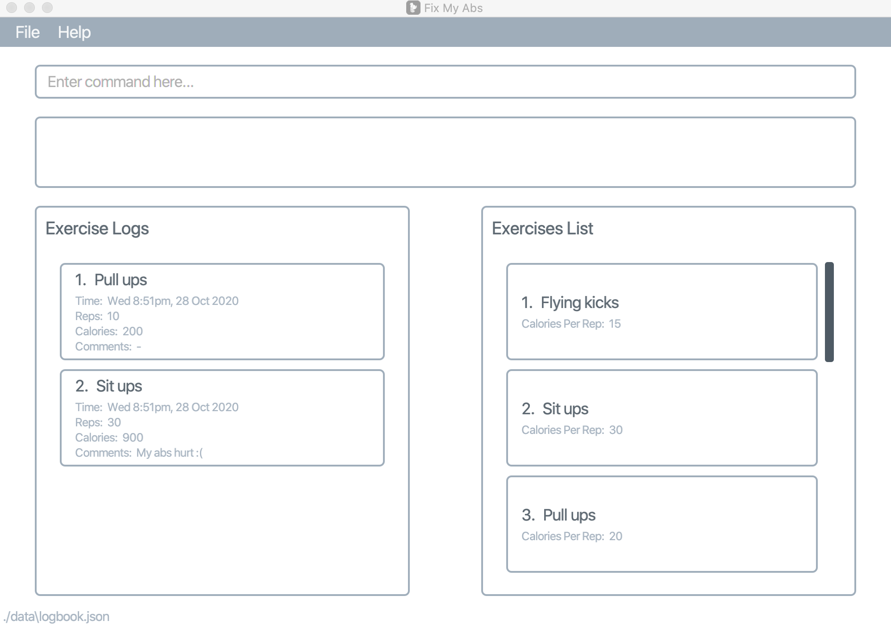
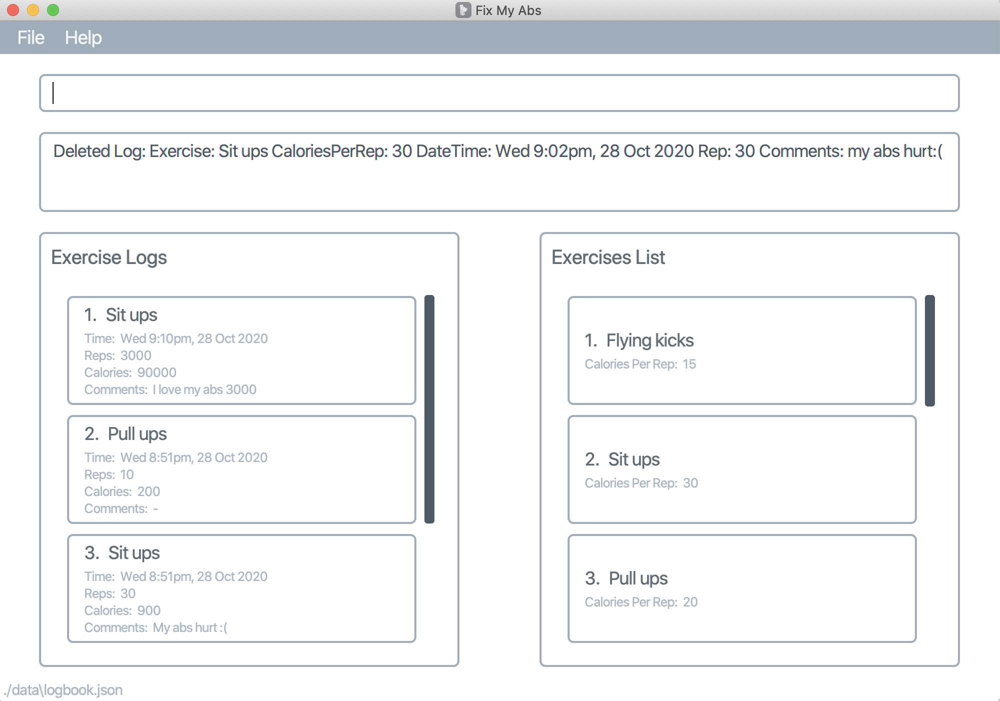
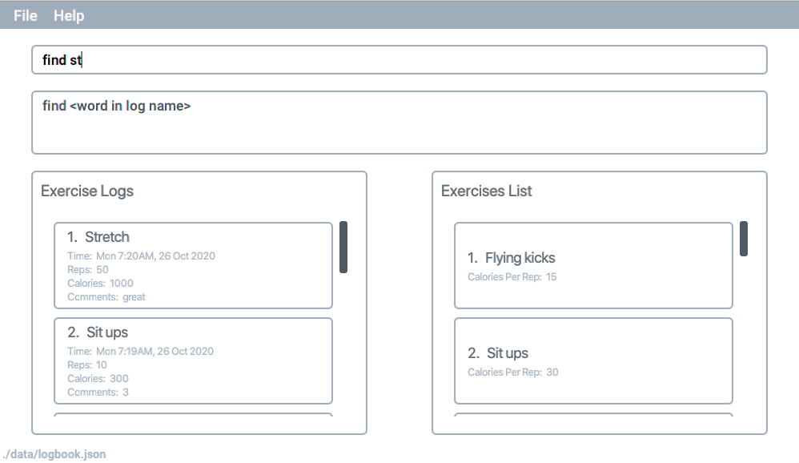
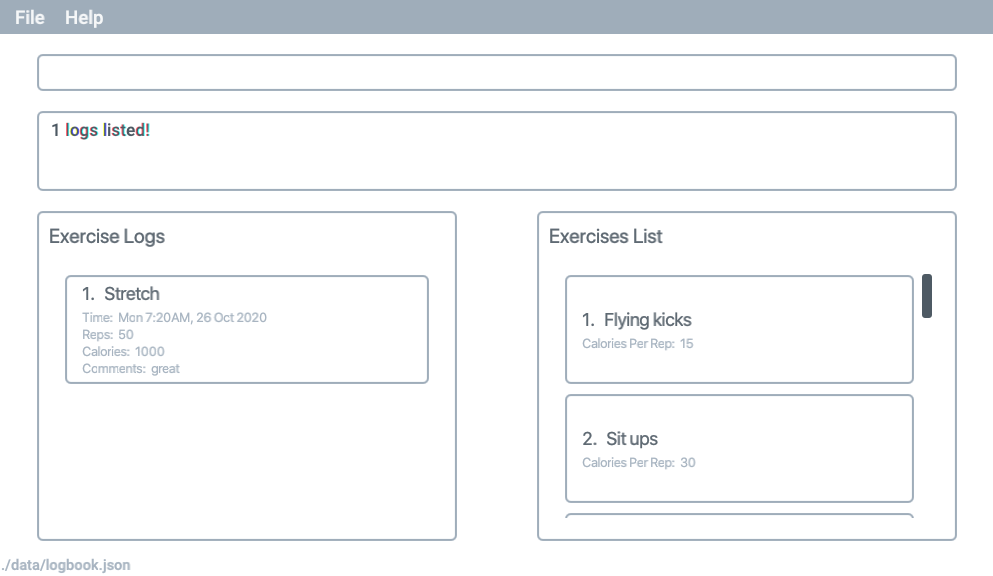

FixMyAbs is a desktop app for logging your exercises, optimized for use via a Command Line Interface (CLI) while still having the benefits of a Graphical User Interface (GUI).

Using FixMyAbs, you will be able to add your own custom exercises along with the calories burnt per rep. These exercises will be listed in the Exercise List. You will then be able to log your exercises, along with the number of reps you have done. FixMyAbs will automatically track the number of calories burnt, and provide you with a log of the exercises you have done. Tracking your progress has never been easier!

If you are unmotivated for a workout, FixMyAbs will be your partner in helping you to change your life. 😎

* Table of Contents
{:toc}

---

## Quick start

1. Ensure you have Java `11` or above installed in your Computer.

1. Download the latest `fma.jar`.

1. Copy the file to the folder you want to use as the home folder for your FixMyAbs.

1. Double-click the file to start the app. The GUI similar to the below should appear in a few seconds. Note how the app contains some sample data. 
   

1. Type the command in the command box and press Enter to execute it. e.g. typing **`help`** and pressing Enter will open the help window. 
   Some example commands you can try:

   - **`list`** : List the exercises

   - **`add e/Sit ups r/10 c/this is a comment`** : Adds a "Sit ups" exercise log of 10 reps, with a comment of "this is a comment", to the FitMyAbs record.

   - **`edit`**`4 c/no abs were hurt` : Edits the log at index 4, with a comment of "no abs were hurt".

   - **`delete 3`** : Deletes the 3rd workout.

   - **`exit`** : Exits the app.

1. Refer to the [Features](#features) below for details of each command.

---

## Features

**:information_source: Notes about the command format:** 

- Words in `<>` are the parameters to be supplied by the user. 
  e.g. in `add e/<exercise>`, `exercise` is a parameter which can be used as `add e/Sit ups`.

- Items in square brackets are optional. 
  e.g `e/<exercise> c/[comments]` can be used as `e/Sit ups c/my abs hurt` or as `e/Sit ups c/`.

- Parameters can be in any order. 
  e.g. if the command specifies `e/<exercise> r/<rep>`, `r/<rep> e/<exercise>` is also acceptable.

- Exercise names are case-insensitive and whitespace-insensitive. 
  e.g. `Sit ups`, `SITUPS`, and `S i T u P   s` are all recognised as the same exercise.

### Viewing help : `help`

Shows a message explaning how to access the help page.

Format: `help`

### Adding a log: `add`

Adds a log.

- Exercise must already be present in the Exercise list. [Exercise names are case-insensitive and whitespace-insensitive.](#command-format)
- The comment may be left blank. (`c/` is compulsory)

Format: `add e/<exercise> r/<reps> c/[comment]`

Examples:

- `add e/Sit ups r/1 c/my abs hurt :(`

Success:

### Listing logs : `list`

Shows a list of all logs logged by the user in the application.

Format: `list`

### Editing a log : `edit`

Edits an existing log in the application.

Format: `edit <index> [r/reps] [c/comment]`

- Edits the existing log at the specified `<index>`. The index refers to the index number shown in the displayed log list. The index **must be a positive integer** 1, 2, 3, …​
- At least one of the optional fields must be provided.
- Existing values will be updated to the input values.

Examples:

- `edit 1 c/no abs were hurt` Edits the log at index 1, with a comment of `no abs were hurt`.
- `edit 1 r/20 c/no abs were hurt` Edits the log at index 1, with reps of `20` and a comment of `no abs were hurt`.

Success:

### Deleting a log : `delete`

Deletes the specified log.

Format: `delete <index>`

- Deletes the log at the specified `<index>`.
- The index refers to the index number shown in the list of logs.
- The index **must be a positive integer** 1, 2, 3, …

Examples:

- `list` followed by `delete 2`deletes the 2nd log.

Success:

### Finding a log : `find`

Finds all logs that contain ALL keywords (case-insensitive) anywhere in the log.

Format: `find <keywords>`

Success:

### Adding an exercise: `addex`

Adds an exercise.

Format: `addex e/<exercise> c/<calories per rep>`

- The exercise must not already exist. [Exercise names are case-insensitive and whitespace-insensitive.](#command-format)
- Calories per rep would be used to calculate the calories burnt for each log.

Success:

### Editing an exercise: `editex`

Edits an existing exercise in the application, either with a new name, or new calories per rep.

Format: `editex <index> [e/exercise] [c/calories]`

* Edits the existing exercise at the specified `index`. The index refers to the index number shown in the displayed exercise list. The index **must be a positive integer** 1, 2, 3, …
* At least one of the optional fields must be provided.
* The new exercise must not already exist. [Exercise names are case-insensitive and whitespace-insensitive.](#command-format)
* Existing values will be updated to the input values.

Success:

### Deleting an exercise : `deleteex`

Deletes the specified exercise.

Format: `deleteex <index>`

- Deletes the log at the specified `<index>`.
- The index refers to the index number shown in the list of exercises.
- The index **must be a positive integer** 1, 2, 3, …

Examples:

- `list` followed by `deleteex 1`deletes the 1st exercise.

Success:

### Exiting the program : `exit`

Exits the program.

Format: `exit`

### Saving the data

Exercise log data are saved in the hard disk automatically after any command that changes the data. There is no need to save manually.

---

## FAQ

**Q**: How do I transfer my data to another Computer? 
**A**: Install the app in the other computer and overwrite the empty data file it creates with the file that contains the data of your previous FixMyAbs home folder.

---

## Command summary

| Action     | Format                                    | Examples                                  |
| ---------- | ----------------------------------------- | ----------------------------------------- |
| **Add**    | `add e/<exercise> r/<reps> c/[comments]`  | e.g. `add e/Sit ups r/30 c/Send help`       |
| **Delete** | `delete <index>`                          | e.g. `delete 3`                      |
| **Edit**   | `edit <index> [r/reps] [c/comment]`       | e.g.`edit 1 r/20 c/no abs were hurt` |
| **List**   | `list`                                    |
| **Add exercise**   | `addex e/<exercise name> c/<calories per rep>` | e.g. `addex e/Lunges c/5` |
| **Edit exercise**   | `editex <index> [e/exercise name] [c/calories per rep]` | e.g. `editex 1 e/One-legged Lunges c/6` |
| **Delete exercise**   | `deleteex <index>` | e.g. `deleteex 1` |
| **Find**   | `find <keywords>`                         | e.g.`find pushups`                   |
| **Exit**   | `exit`                                    |
