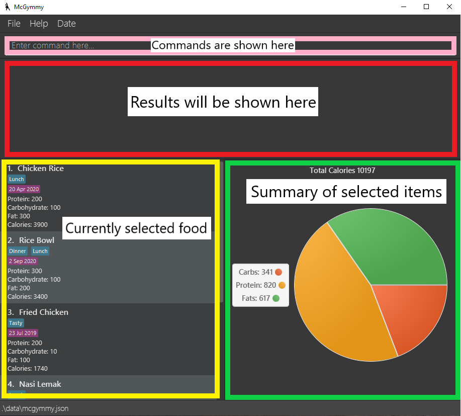
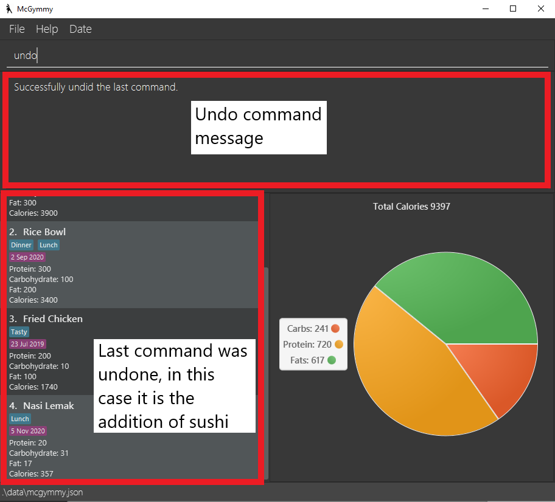
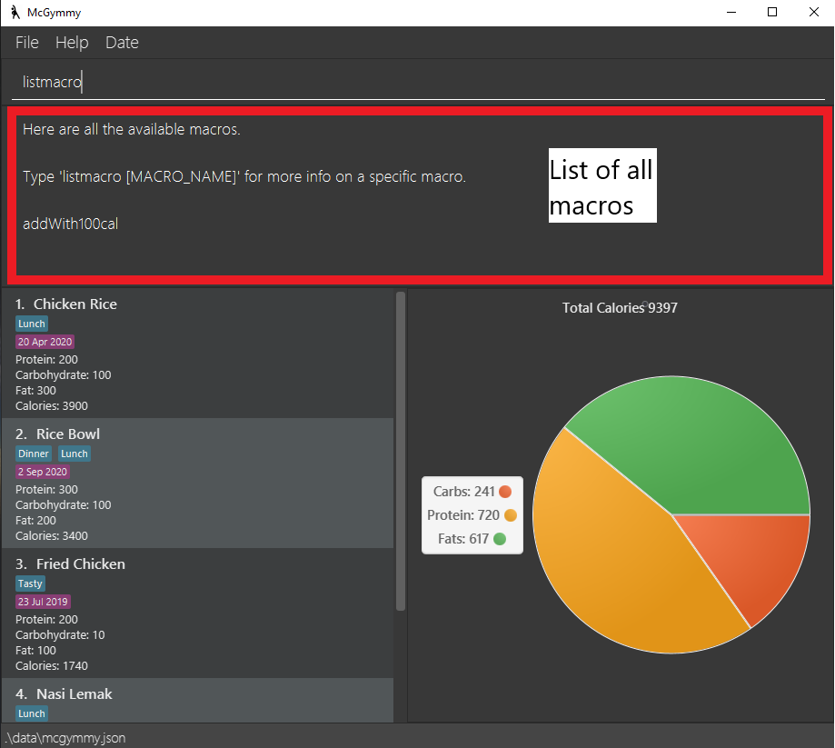

McGymmy is a **desktop app for Software Engineers who need help managing their diet, optimized for use via a Command Line Interface** (CLI) while still having the benefits of a Graphical User Interface (GUI). While we are primarily targetting software engineers who are familiar with the CLI, those who spend a large amount of time at their desk can still benefit from this application by saving time as opposed to the more traditional caloric tracker applications.  
If you can type fast, McGymmy can log your food intake faster than traditional GUI apps. McGymmy aims to help users track their caloric and macronutrient intake in an efficient way that does not interfere with one's workflow.

This document aims to showcase all of McGymmy's commands.
Open this document in a modern internet browser (Mozilla Firefox, Google Chrome, or Microsoft Edge).

##  1. Icon Legend

:bulb: **Tip:** This indicates that the following text consists of tips to better utilise McGymmy

:information_source: This indicates important notes for the current feature we are looking at 

## 2. A little note from the developers

Thank you for using McGymmy. We sincerely hope that McGymmy plays apart to help you achieve a healthier lifestyle.
We understand that McGymmy may be a little different from traditional GUI applications, and it may be a little difficult to start using it initially.
Thus, we recommend you to start by first understanding how McGymmy works at a high level at the Quick start section. Then, explore the Features section.

:bulb: **Tip:** Press Ctrl-F to open the find prompt in your browser. You can type in keywords such as `add` or `edit` to quickly navigate to those parts of the document.

* Table of Contents
{:toc}

--------------------------------------------------------------------------------------------------------------------

## 3. Quick start

To get started, you can double-click on the jar file to open the GUI.
You can type the command in the command box and press Enter to execute it. e.g. typing help and pressing Enter will open the help window.
Refer to the features below for details of each command.

1. Please ensure that you have Java `11` or above installed in your Computer.

1. You have to download the latest `mcgymmy.jar` from [here](https://github.com/AY2021S1-CS2103T-W17-3/tp).

1. Afterwards, copy the file to the folder you want to use as the _home folder_ for your McGymmy.

1. Double-click the file to start the app. You should notice a GUI similar to the below should appear in a few seconds. Note how the app contains some sample data. 

   

1. Type the command in the command box and press Enter to execute it. e.g. typing **`help`** and pressing Enter will open the help window. 
   Some example commands you can try:

   * **`list`** : Lists all food items.

   * **`add`**`-n potato -p 100 -c 5 -f 0` : Adds a food item named `potato` with `100`g of proteins, `5`g of carbs, and `0`g of fats into current date.

   * **`delete`**`3` : Deletes the 3rd food item (i.e. food item with index 3) shown in the current list.

   * **`exit`** : Exits the app.

1. Refer to the [Features](#features) below for details of each command.

--------------------------------------------------------------------------------------------------------------------
## 4. How to use this guide

Please do read this section in order to use this guide effectively

<b>Important</b>
The picture below shows a summary of where all the items will be. 
Each of the commands explained below will have an image which shows the output.

If you are just looking for a particular command:
1. Press `ctrl-f` 
1. Search for the command in the search bar.

If you want a table with all the commands:
1. Refer to table of contents above
1. Click on Command Summary
    - The command summary will show you all the commands at a glance

If you want to get acquainted with all the commands:
1. Follow the format and continue reading.

--------------------------------------------------------------------------------------------------------------------

## 5. Features

**:information_source: Notes about the command format:** 

A typical *command* in *McGymmy* consists of a *Command Word* followed by several *parameters*.

For example in `add -n scrambled eggs -p 100`, `add` is a *Command Word* and `-n scrambled eggs` and `-p 100` are *parameters*.

**How to intepret the each command's format**:

We will follow the following convention for each command's format:

`COMMAND_WORD PARAMETERS [OPTIONAL_PARAMETERS]`, e.g. `add -n NAME [-p PROTEIN] [-f FATS] [-c CARBS] [-d DATE]`.

* `COMMAND_WORD` is the name of the command to be executed, and is always the first word in the *command*.

* Words in `UPPER_CASE` are the parameters to be supplied by you. 
  e.g. in `add -n NAME -p PROTEIN`, `NAME` and `PROTEIN` are parameters which can be used as `add bacon -p 200`.
  
* Prefixes that precede parameters represent flags that indicate which parameter is being referenced. Parameters that are not preceded by a flag are denoted as flag-less parameters. For simplicity, the [flag + parameter input] together will be referenced as a single parameter. 
  e.g. in `find example -t lunch`, `example` represents a flag-less parameter while `-t lunch` is referred as a parameter with flag `-t` and parameter input `lunch`.

* Items in square brackets are optional. 
  e.g `-n NAME [-f FATS]` can be used as `-n bacon -f 10` or as `-n bacon`.

* Items with `…`​ after them can be used multiple times including zero times. 
  e.g. `[commnand;]…​` can be used as ` ` (i.e. 0 times), `delete 1;`, `delete 2; delete 1;` etc.

* Parameters and optional parameters can be in any order. 
  e.g. if the command specifies `-c CARBS -p PROTEIN [-f FATS]`, `-p PROTEIN [-f FATS] -c CARBS` is also acceptable.

### 5.1 Viewing help : `help`

You can view information on the available commands in the terminal.

Format: `help [COMMAND]`

Examples:
* `help` - this will display all available commands.
* `help add` - this will display a help message specific to the `add` command.

### 5.2 Adding a food item: `add`

You can add a food item to McGymmy.

Format: `add -n NAME [-p PROTEIN] [-f FATS] [-c CARBS] [-d DATE]`

Examples:
* `add -n potato -p 100 -c 5 -f 0`
* `add -n McSpicy`
* `add -n Wonton Mee -c 10`
* `add -n Sushi -d 20/04/2020`

:information_source:
 * The default value for protein, fats and carbs is 0. The default date is the day in which the food item is added. 
 * To view the list of supported date formats, see *Appendix A*. 

### 5.3 Tagging food items : `tag`

You can tag a food item in McGymmy.

Format: `tag INDEX -t TAG_NAME`

:information_source:

* Tags `TAG_NAME` for food item at the specified `INDEX`.
* The index refers to the index number shown in the displayed food list.
* The index **must be a positive integer** 1, 2, 3, …​

### 5.4 Untagging food items : `untag`

You can untag a food item in McGymmy.

Format: `untag INDEX -t TAG_NAME`

:information_source:

* Untags `TAG_NAME` for food item at the specified `INDEX`.
* The index refers to the index number shown in the displayed food list.
* The index **must be a positive integer** 1, 2, 3, …​

### 5.5 Finding a food item: `find`

You can find food items based on the keywords supplied.

Format: `find [KEYWORDS] [-n WORDS_IN_NAME] [-t WORDS_IN_TAG] [-d DATE]`

Examples:
* `find` - finds all food items
* `find -n Sushi -d 20/04/2020` - finds all food items with name "Sushi" and date "20/04/2020"
* `find -t lunch dinner` - finds all food items with tag "lunch" and/or tag "dinner"
* `find sushi lunch` - finds all food items that have the keywords "sushi" and/or "lunch" in their name and/or tag

:information_source:

* Filters the displayed list of food items to only include food items corresponding to the provided parameters.
* `KEYWORDS` and `WORDS_IN_NAME` are nor case sensitive but `WORDS_IN_TAG` is case sensitive.

### 5.6 Clearing food items: `clear`

You can clear food items currently shown in the list.

Format: `clear`

Examples:
* `clear` - clears food items

:information_source:

* Clears all food item that is shown on the list.
* You can clear specific groups of item by using find then clear.

### 5.7 Listing all food items : `list`

You can view a list of all food items in McGymmy.

Format: `list`

:information_source:

* Lists all food items in McGymmy
* All additional input after the *command word* `list` will be ignored. E.g. `list` and `list 123` will have the same effect.

### 5.8 Editing a food item : `edit`

You can edit the details of a food item at the specified index.

Format: `edit INDEX [-n NAME] [-p PROTEIN] [-c CARBS] [-f FATS] [-d DATE]`

:information_source:

* Edits the food item at the specified `INDEX`. The index refers to the index number shown in the displayed food list.
* The index **must be a positive integer** 1, 2, 3, …​
* At least one of the optional fields must be provided.
* Existing values will be updated to the input values.

Examples:
*  `edit 3 -n banana -p 120` Changes the `name` and `protein` values of the 3rd item in the list to `banana` and `120` respectively.

:information_source:  To view the list of supported date formats, see *Appendix A*. 

### 5.9 Deleting a food item: `delete`

You can delete a food item at the specified index.

Format: `delete INDEX`

:information_source:

* Deletes the food at the specified `INDEX`.
* The index refers to the index number shown in the displayed food list.
* The index **must be a positive integer** 1, 2, 3, …​

Examples:
* `list` followed by `delete 2` deletes the 2nd food item in McGymmy.

### 5.10 Importing another save file: `import`

You can import a previously saved file into McGymmy from your local directory

Format: `import FILEPATH`

:information_source:

* Imports the saved file at `FILEPATH`

Examples:
* `import c:/mcgymmy/save_file.json` imports `save_file.json` into McGymmy

:bulb: **Tip:** For those who are more inclined to use a gui to import:
* Click on file
* Click on Import
* Navigate using the GUI to the save file

### 5.11 Exporting your save file to a folder: `export`

You can export a saved file to a folder to your local directory

Format: `export DIRPATH [-o FILENAME]`

:information_source:

* Exports the saved file to `DIRPATH` with `FILENAME`
* Default filename is `mcgymmy.json`

Examples:
* `export c:/mcgymmy` exports the save file as `mcgymmy.json` to `c:/mcgymmy`
* `export c:/mcgymmy -o save_file` exports the save file as `save_file.json` to `c:/mcgymmy`

:bulb: **Tip:** For those who are more inclined to use a gui to export:
* Click on `file` option in the menubar above the command box
* Click on `Export` button to open the directory selector
* Navigate using the GUI to the save file
* Click on `Select Folder` when done

### 5.12 Undoing the previous command : `undo`

Undoes the change made by the previous command

Format: `undo`

:information_source:

* Undo command can be called multiple times.
* Help command will be ignored when undoing. 
For example, if the user calls the following commands in sequence:
`add -n Burger`, `help edit`, `undo`, the undo command will undo the adding operation, not the help one.
* Calling `undo` after 2 or more consecutive `list` calls only undoes the listing operation once.
* Calling `undo` after 2 or more consecutive `find` calls with the same sequence of keyword only undoes the find operation once.
* All additional input after the *command word* `undo` will be ignored. E.g. `undo` and `undo 123` will have the same effect.

### 5.13 Creating a macro command : `macro`

Adds a macro to run several commands in succession.

*__WARNING:__* this is an advanced feature!

Format: `macro MACRONAME FLAG_1 FLAG_2 ... ; COMMAND_1 PARAMETERS_TO_COMMAND_1; [COMMAND_2 PARAMETERS_TO_COMMAND_2; ...]`  

:information_source:

* Create a macro with name `MACRONAME` which takes in parameters `FLAG_1 FLAG_2...` which executes `COMMAND_1; COMMAND_2; ...`.

* Parameters to the macro can be substituted in the `PARAMETERS_TO_COMMAND` using the syntax: `\FLAG_NAME`.

* Flag-less parameters can be substituted using the syntax: `\$`.

* Using `undo` after creating a macro using this command will remove it.

* Read the examples below for more information.

Examples:
* `macro addWith100cal p ; add -n \$ -c 100 -p \p`
    * Example usage of this macro: `addWith100cal Banana -p 2000`
    * The following command will be executed by the macro: `add -n Banana -c 100 -p 2000`
    * i.e. in `add -n \$ -c 100 -p \p`, `\$` and `\p` will be substituted with Banana and 2000 respectively.

* `macro addFoodWithFries; add -n \$ ; add -n \$ With Fries`
    * Example usage of this macro: `addFoodWithFries Ice Cream`
    * The following commands will be executed by the macro: `add -n Ice Cream` and `add -n Ice Cream With Fries`.

:information_source: When using it with conjunction with the undo command, macro will only undo the commands one at a time within the chain of macro commands 

### 5.14 List all macros : `listmacro`

Displays information on the available macros in the terminal.

Format: `listmacro [macro]`

Examples:
* `listmacro` - this will display all available macros.
* `listmacro kfc` - this will display information on the `kfc` macro.

### 5.15 Deleting a macro: `remmacro`

Deletes the given macro.

Format: `remmacro MACRONAME`

:information_source:

* Deletes the macro with the name `MACRONAME`.
* If you accidentally delete a macro you need, `undo` can revert it.

### 5.16 Exiting the program : `exit`

Exits the program.

Format: `exit`

:information_source:

* Exits McGymmy and closes the McGymmy window.
* Data will be automatically saved (see also section on *Saving the data* below).
* All additional input after the *command word* `exit` will be ignored. E.g. `exit` and `exit 123` will have the same effect.

### 5.17 Saving the data

McGymmy's data is saved in the hard disk automatically after any command that changes the data. There is no need to save manually.

--------------------------------------------------------------------------------------------------------------------

## 6. FAQ

**Q1**: How do I transfer my data to another Computer? 
**A1**:  
1. Install the app in the other computer.
1. Export your save file from your previous McGymmy using the `export` function in section `5.11`.
1. Use the `import` function in section `5.10` to import the save file to your McGymmy.
  

**Q2**: How do I backup my current version of McGymmy? 
**A2**: 
1. Use the `export` function in section `5.11` to export the save file to a directory of your choice.
1. A Copy of your save file will be created at the location.

**Q3**: How do I find out what I ate on a particular day? 
**A3**: 
For those who prefer typing:
1. Use the find command in section `5.5` and add the `-d` tag before specifying a date
1. You will see the food you ate on that day
For those who prefer clicking:
1. Click on `date` button at the file menu
1. Click on the calendar icon
1. Select the date you want to filter (You will see a calendar similar to the one below)
1. You will see the food you ate on that day

--------------------------------------------------------------------------------------------------------------------

## 7. Command summary

Action       | Format, Examples
-------------|------------------
**Add**      | `add -n NAME [-p PROTEIN] [-f FATS] [-c CARBS] [-d DATE]`   e.g., `add Chicken Rice -p 10 -f 5 -c 23 -d 02/09/2020`
**Clear**    | `clear`
**Delete**   | `delete INDEX`  e.g., `delete 3`
**Edit**     | `edit INDEX [-n NAME] [-p PROTEIN] [-f FATS] [-c CARBS] [-d DATE]`  e.g.,`edit 2 -n Chicken Rice -p 30 -f 50 -c 60 -d 02/09/2020`
**Exit**     | `exit`
**Export**   | `import DIRPATH [-o FILENAME]`   e.g., `export c:/mcgymmy -o save_file`
**Find**     | `find [KEYWORDS] [-n WORDS_IN_NAME] [-t WORDS_IN_TAG] [-d DATE]`   e.g., `find chicken -t Dinner -d 28-10-2020`
**Help**     | `help [COMMAND]`   e.g., `help add`
**Import**   | `macro SHORTCUT; COMMAND_1; [COMMAND_2;] …​`   e.g., `import c:/mcgymmy/save_file.json`
**List**     | `list`
**Macro**    | `macro SHORTCUT; COMMAND_1; [COMMAND_2;] …​`   e.g., `macro lunch; add Chicken`
**RemMacro** | `remmacro MACRONAME`   e.g., `remmacro lunch`
**ListMacro**| `listmacro [macro]`   e.g., `listmacro kfc`
**Tag**      | `tag INDEX -t TAG_NAME`   e.g., `tag 1 -t Lunch`
**UnTag**    | `untag INDEX -t TAG_NAME`   e.g., `untag 1 -t Lunch`

## 8. Appendix A
List of supported input date formats, sorted from highest parsing priority to lowest parsing priority

Format       | Example
------------ | --------
*yyyy-MM-dd* | 2020-09-02
*yyyy-M-dd*  | 2020-9-02
*yyyy-M-d*   | 2020-9-2
*dd-MM-yyyy* | 02-09-2020
*dd-M-yyyy*  | 02-9-2020
*d-M-yyyy*   | 2-9-2020
*yyyy/MM/dd* | 2020/09/02
*dd/MM/yyyy* | 02/09/2020
*dd/M/yyyy*  | 02/9/2020
*d/M/yyyy*   | 2/9/2020
*d MMM yyyy* | 2 Sep 2020
