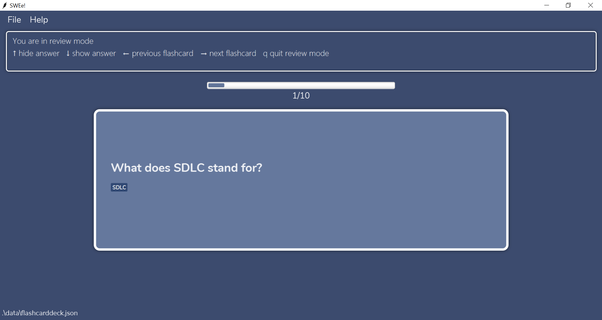
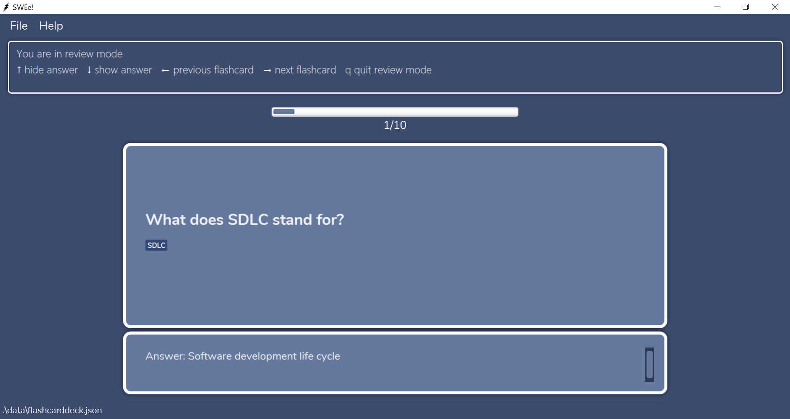
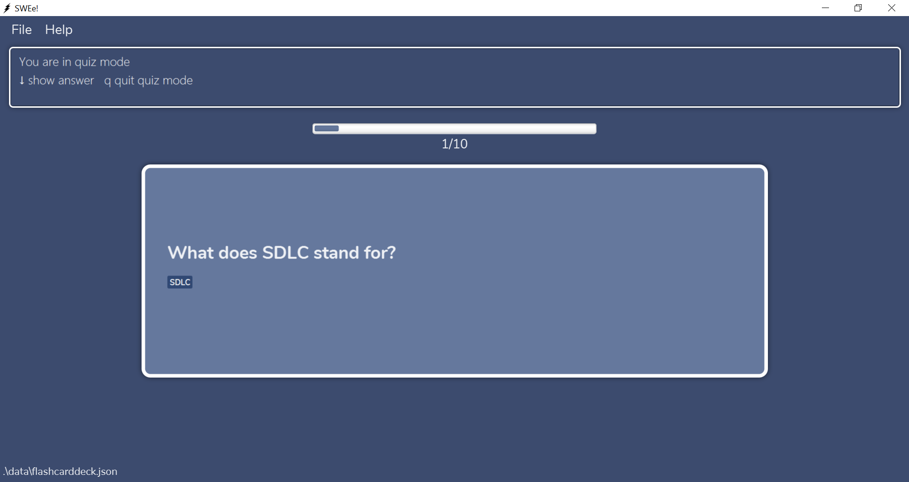

SWEe! is a  **desktop app for CS2103T students to manage their learning progress mainly through flashcards**. It is optimized for CLI users so that frequent tasks can be done faster by typing in commands. If you can type fast, SWEe! can create your CS2103T flashcards faster than traditional GUI apps.

* Table of Contents
    - [Quick start](#quick-start)
    - [Features](#features)
        - [Adding a flashcard](#adding-a-flashcard--add): `add`
        - [Clear all flashcards](#clearing-all-flashcards--clear): `clear`
        - [Deleting a flashcard](#deleting-a-flashcard---delete): `delete`
        - [Editing a flashcard](#editing-a-flashcard---edit): `edit`
        - [Filter relevant flashcards](#filtering-out-flashcards---filter): `filter`
        - [Favourite a flashcard](#favourite-a-flashcard---fav) : `fav`
        - [Unfavourite a flashcard](#unfavourite-a-flashcard---unfav): `unfav`
        - [Find flashcards](#find-flashcards--find): `find`
        - [Viewing help](#viewing-help--help): `help`
        - [Listing all flashcards](#listing-all-flashcards--list): `list`
        - [Review all flashcards](#reviewing-all-flashcards-review) : `review`
        - [Quiz flashcards](#quizzing-flashcards-quiz): `quiz`
        - [Sort all flashcards](#sort-all-flashcards--sort): `sort`
        - [View a flashcard](#views-a-flashcard---view): `view`
        - [View the statistics of a flashcard](#viewing-the-statistics-of-flashcard-stats): `stats`
        - [Exiting the program](#exiting-the-program--exit): `exit`
        - [Saving the data](#saving-the-data)
    - FAQ
    - [Command summary](#command-summary)
        

--------------------------------------------------------------------------------------------------------------------

## Quick start

1. Ensure you have Java `11` or above installed in your Computer.

1. Download the latest `swee.jar` from [here](https://github.com/AY2021S1-CS2103T-T17-2/tp/releases).

1. Copy the file to the folder you want to use as the _home folder_ for SWEe!.

1. Type the command in the command box and press Enter to execute it. 
   Some example commands you can try:

   * **`add q/What does OOP stand for? a/Object Oriented Programming c/General`** : Adds a flashcard with a question and answer into the General category.

   * **`delete 3`**: Deletes the 3rd flashcard in the current list.
   
   * **`edit 2 q/What is a revision control software? a/It is the software tool that automate the process of Revision Control`**: Edits the 2nd flashcard in the current list with the specified attributes.

   * **`filter c/OOP`** : Filters out flashcard(s) belonging to the OOP category. 
   
   * **`fav 1`** : Favourite the 1st flashcard in the current list.
     
   * **`unfav 1`** : Unfavourite the 1st flashcard in the current list.
   
   * **`find general`**: Find all flashcards containing general.

   * **`list`** : Lists all flashcards.

   * **`review`** : Reviews the current list of flashcards.
   
   * **`quiz`** : Quiz the current list of flashcards.
   
   * **`sort reviewed -d`** : Sorts the list of flashcards according to review frequency in descending order.
   
   * **`view 1`** : Views the 1st flashcard in the current list.
   
   * **`stats 1`** : Views the statistics of the 1st flashcard in the current list.

   * **`exit`** : Exits the app.
  

1. Refer to the [Features](#features) below for details of each command.

--------------------------------------------------------------------------------------------------------------------

## Features

**:information_source: Notes about the command format:** 

* Words in UPPER_CASE are the parameters to be supplied by the user. 
  e.g. in add `q/QUESTION`, `QUESTION` is a parameter which can be used as `add q/`What is my name?

* Words in lower_case are to be specified exactly. e.g. in `sort <success|reviewed>`, `success` and `reviewed` 
must be specified exactly.

* Items in square brackets are optional (zero or one instance). 
  e.g `q/QUESTION [c/CATEGORY]` can be used as `q/What is my name?` or as `q/What is my name? c/topic 1`
  * Note: Multiple instances of the same prefix will not throw an error. 
  However, the app will only read the last instance in the input. 
  * e.g `add q/Are apples red? a/Yes c/fruit c/test` will add a flashcard belonging to "test" category 
  
* Items in square brackets with trailing ellipsis are optional (zero, one or multiple instances). 
  e.g. `q/QUESTION [t/TAG]...` can be used as `q/What is my name?`, `q/What is my name? t/topic1` or
  `q/What is my name? t/topic1 t/fun` 
  * Note: Multiple instances of the tag prefix is accepted, and the app will read every instance
  in the input.

* Parameters can be in any order. 
  e.g. if the command specifies `q/QUESTION a/ANSWER, a/ANSWER q/QUESTION` is also acceptable.
  
* Items in angle brackets `<>` are either/or options. Each option is delineated by a `|` . 
  e.g `<success|reviewed>` can be used as `success` or `reviewed` but not both.

### Adding a flashcard : `add`

Adds a flashcard.

Format: `add q/QUESTION a/ANSWER [c/CATEGORY] [r/RATING] [n/NOTE] [d/DIAGRAM] [t/TAG]...`

* `RATING` must be a number between 1 and 5 inclusive.
* `CATEGORY` must be alphanumeric and have a maximum of 50 characters. 
     It can consist of multiple words but there should only be 1 space between words.
* `DIAGRAM` can be defined by a valid relative or absolute path and only supports file path without spaces in it. Unintended behaviour may occur if file path with spaces is used. eg. `d/image s/diagram.png`
* `DIAGRAM` only supports the following image file types.
  * jpeg
  * png
  * bmp
  * jpg
  * gif
* `TAGS` must be alphanumeric, have a maximum of 50 characters and should be 1 word.

:bulb: **Tip:**
If the category is not specified, the flashcard will have the <b>General</b> category.

Examples:
* `add q/What does OOP stand for? a/Object Oriented Programming`
* `add q/What does OOP stand for? a/Object Oriented Programming r/3 t/cool`
* `add q/What does OOP stand for? a/Object Oriented Programming c/Super Important n/Important question!`
* `add q/What does OOP stand for? a/Object Oriented Programming d/images/diagram.png`
* `add q/What does OOP stand for? a/Object Oriented Programming c/UML n/Important question! d/images/diagram.png`

**Steps for adding a flashcard with diagram**:

**Step 1**: Locate the relative file path of the image file. In this example, our file path is `images/classDiagramExample1.png` 

Root folder containing the jar file        |  Image directory
:-------------------------:|:-------------------------:
 |  

**Step 2**: Type the command `add q/This is an example of a class diagram a/True d/image/classDiagramExample1.png`. Remember to include the file extension in `DIAGRAM`.

**Step 3**: The flashcard is added to the list.

### Clearing all flashcards : `clear` 

Clears all flashcard data from the program.

Format: `clear`

### Deleting a flashcard  : `delete`

Deletes the specified flashcard.

Format: `delete INDEX`

* Deletes the flashcard at the specified INDEX.
* The index refers to the index number shown in the displayed flashcard list.
* The index **must be a positive integer greater than 0**. eg. 1, 2, 3, …

Examples:
*  `list` followed by `delete 2` deletes the 2nd flashcard in the flashcard list.

### Editing a flashcard  : `edit`

Edits a flashcard.

Format: `edit INDEX [q/QUESTION] [a/ANSWER] [c/CATEGORY] [n/NOTE] [r/RATING] [d/DIAGRAM] [t/TAG]...`

* Edits the flashcard at the specified INDEX.
* The index refers to the index number shown in the displayed flashcard list.
* The index **must be a positive integer greater than 0**. eg. 1, 2, 3, …
* Although all fields are optional, a minimum of one field has to be given.
* Specifying empty values to note, rating, tag or diagram eg. `r/` will remove the corresponding field in the flashcard.
* Although question, answer and category are optional values, you are not allowed to specify an empty value to those attributes once the prefix is declared e.g. `c/` is not allowed and will not remove category

Examples:
* `edit 3 q/What does OOP stand for? a/Object Oriented Programming c/General`
* `edit 3 q/What does OOP stand for? a/Object Oriented Programming`
* `edit 3 n/Important question! r/`

**Steps for editing a flashcard's category and rating**:

**Step 1**: Locate the flashcard you wish to edit. In this example, we want to edit the flashcard at index 2.

**Step 2**: We want to edit the category of the flashcard to Trivial and rating to 1. Type the command `edit 2 c/Trivial r/1`.

**Step 3**: The flashcard's category and rating are edited to `Trivial` and `1` respectively.

### Filtering out flashcards  : `filter`

Filters for specific flashcard(s) based on the field input(s) by the user. 
This will return all the flashcards whose fields match all the fields specified by the user.

Format: `filter [c/CATEGORY] [r/RATING] [f/<yes|no>] [t/TAG]...`

* Filters the specified flashcard based on category, rating, favourite status or tags.
* Supports filtering of one or more different fields. For example:
    - `filter c/SDLC r/5` will filter out flashcards belonging to the SDLC category with a rating of 5.
* Although all fields are optional, a minimum of one field has to be given.
* Note: `filter r/` will filter for all unrated flashcards.

Examples:
*  `filter c/SDLC` filters and lists all flashcards belonging to the SDLC category.
*  `filter t/examinable t/study` filters and lists all flashcards that have both “examinable” and “study”.
*  `filter r/3 f/yes` filters and lists all favourited flashcards that have a rating of 3.

**Steps for filtering for a flashcard based on category and tag**:

**Step 1**: We want to filter for a flashcard which has a Trivial category and contains the preloaded tag. Type the command `filter c/Trivial t/preloaded`.

**Step 2**: The flashcard with the category `Trivial` and tag field `preloaded` is shown.

### Favourite a flashcard  : `fav`

Favourite the specified flashcard.

Format: `fav INDEX`

* Favourite the flashcard at the specified INDEX.
* The index refers to the index number shown in the displayed flashcard list.
* The index **must be a positive integer greater than 0**. eg. 1, 2, 3, …

Examples: 
* `list` followed by `fav 2` favourite the 2nd flashcard in the displayed list.

### Unfavourite a flashcard  : `unfav`

Unfavourite the specified flashcard.

Format: `unfav INDEX`

* Unfavourite the flashcard at the specified INDEX.
* The index refers to the index number shown in the displayed flashcard list.
* The index **must be a positive integer greater than 0**. eg. 1, 2, 3, …

Examples: 
* `list` followed by `unfav 2` unfavourite the 2nd flashcard in the displayed list.

### Find flashcards : `find`

Search for all flashcards matching any of the search keywords.

Format: `find KEYWORD...`
* Finds all flashcards containing any of the keywords
* The keywords are **case insensitive**
* Keywords will match as long as they are contained within any flashcard’s question/answer/category/note/tags. Eg. `UML` keyword will match a flashcard with a `category` called `UML-Diagram`

Examples: 
* `find general` 
* `find general important` 
* `find GENERAL object`

### Viewing help : `help`

Opens a window with a link that directs you to our user guide.

Format: `help`

### Listing all flashcards : `list`

Shows a list of all flashcards. This is useful for removing any `filter` or `find` you have done on the flashcard list.

Format: `list`

* All additional input after the command word `list` will be ignored. E.g. `list` and `list 123` will have the same effect.

### Reviewing all flashcards: `review`

Reviews the current list of flashcards. This puts the user in review mode and the user can no 
longer input commands to the textbox.

Upon entering review mode, the following user input will be recognised:
* `↓ key` shows answer and notes of the current flashcard  
* `↑ key` hides answer and notes of the current flashcard  
* `→ key` moves on to the next flashcard (if there is a next flashcard)
* `← key` moves to the previous flashcard (if there is a previous flashcard)
* `q` quits review mode

Format: `review`

:memo: Note:
The review and success frequency of a flashcard is not affected by review mode.

 

**Steps for entering review mode**:

**Step 1**: We want to enter review mode to review our flashcards. Type the command `review`.

**Step 2**: We are brought to the review mode. The instructions on how to navigate review mode will be shown at the top.

**Step 3**: In this example, we will demonstrate the behaviour of the `↓ key`. Upon clicking the `↓ key`, the answer of the flashcard is shown.

### Quizzing flashcards: `quiz`

Quiz the current list of flashcards. This puts the user in quiz mode and the user can no longer input commands to the textbox.

Upon entering quiz mode, the following user input will be recognised:
* `↓ key` shows answer and notes of the current flashcard  
* `q` quits quiz mode
* `y` This input will only be recognised after the `↓ key` is pressed. `y` is a feedback to indicate a correct answer. 
* `n` This input will only be recognised after the `↓ key` is pressed. `n` is a feedback to indicate an incorrect answer. 

Upon pressing the `↓ key`, the user will be prompted if they got the answer correct. The user can then press 
`y` to feedback that they got the correct answer or `n` to feedback that they got an incorrect answer.  

The quiz mode works in conjunction with the [statistics](#viewing-the-statistics-of-flashcard-stats) feature. Quiz attempts are recorded and information about the success frequency can be displayed using the [statistics](#viewing-the-statistics-of-flashcard-stats) feature.
* Pressing `y` will increase the review and success frequency of the flashcard.
* Pressing `n` will increase the review frequency of the flashcard.

Format: `quiz`

:memo: Note: Once the user presses `y` or `n`, the review and success frequency of the flashcard is updated accordingly even if the user quits the quiz prematurely.

 

**Steps for entering quiz mode**:

**Step 1**: We want to enter quiz mode to test ourselves on the current list of flashcards. Type the command `quiz`.

**Step 2**: We are brought to the quiz mode. The instructions on how to navigate quiz mode will be shown at the top.

**Step 3**: In this example, we will demonstrate the behaviour of the `↓ key`. Upon clicking the `↓ key`, we will be prompted if we got the answer correct.

**Step 4**: We got this answer correct so we will press `y`. This will automatically bring us to the next flashcard.

### Sort all flashcards : `sort`

Sorts a list of all flashcards according to the criteria given.

Format: `sort <success|reviewed> <-a|-d>`

Examples: 
* `sort reviewed -a` shows a list of all flashcards sorted according to review frequency in ascending order
* `sort reviewed -d` shows a list of all flashcards sorted according to review frequency in descending order
* `sort success -a` shows a list of all flashcards sorted according to success rate in ascending order
* `sort success -d` shows a list of all flashcards sorted according to success rate in descending order

:memo: Note: The review and success frequencies of a flashcard are only affected by quiz mode.

    
### Views a flashcard  : `view`

View the specified flashcard. A "snapshot" of the flashcard is taken and displayed in the view pane to the user.

Format: `view INDEX [-a]`

* View the flashcard at the specified INDEX.
* The index refers to the index number shown in the displayed flashcard list.
* The index **must be a positive integer greater than 0**. eg. 1, 2, 3, …
*  If `-a` is specified, the answer and notes of the flashcard will be shown too.

:memo: Note: Once another command is executed, the view pane will be returned to a blank state even if the shown
flashcard was not modified/deleted.

 

**Steps for viewing a specific flashcard**:

**Step 1**: Locate the flashcard you wish to view. In this example, we want to view the flashcard at index 3. Type the command `view 3`.

**Step 2**: We will be presented with a "snapshot" of the flashcard at index 3 in the view pane.

**Step 3**: To view the answer and notes(if applicable) of the flashcard on the view pane. Type the command `view 3 -a`.

**Step 4**: The answer of the flashcard is now displayed on the view pane.

### Viewing the statistics of flashcard `stats`

View the statistics of a flashcard.

Format: `stats INDEX`

* Shows the statistics of the flashcard at the specified INDEX.
* The index refers to the index number shown in the displayed flashcard list.
* The index **must be a positive integer greater than 0**. eg. 1, 2, 3, …

The statistics of the flashcard will be displayed in the view pane. The statistics feature works in conjunction with the [quiz](#quizzing-flashcards-quiz) feature.

The following information will be displayed on the view pane:
* Question of the flashcard.
* Reviewed count of the flashcard.
* Correct count of the flashcard.
* Pie chart to show the graphical representation of correct attempts vs wrong attempts in quiz mode of the flashcard.

:memo: Note: No pie chart will be shown if the flashcard has not been reviewed.    

 

:memo: Note: Once another command is executed, the view pane containing the statistics will be returned to a blank state even if the shown
flashcard was not modified/deleted.

 

**Steps for viewing the statistics of a specific flashcard**:

**Step 1**: Locate the flashcard you wish to view the statistics of. In this example, we want to view the statistics of the flashcard at index 1. Type the command `stats 1`.

**Step 2**: The statistics of the flashcard at index 1 will be displayed in the view pane.

### Exiting the program : `exit`

Exits the program.

Format: `exit`

### Saving the data

Flashcards data are saved in the hard disk automatically after any command that changes the data. There is no need to save manually.

--------------------------------------------------------------------------------------------------------------------

## Command summary

Action | Format, Examples
--------|------------------
**Add** | `add q/QUESTION a/ANSWER [c/CATEGORY] [n/NOTE] [r/RATING] [d/DIAGRAM] [t/TAG]...`   e.g, `add q/What does OOP stand for? a/Object Oriented Programming c/General n/Important question! d/images/diagram.jpeg`
**Clear** | `clear`
**Delete** | `delete INDEX`   e.g. `delete 3`
**Edit** | `edit INDEX [q/QUESTION] [a/ANSWER] [c/CATEGORY] [n/NOTE] [r/RATING] [d/DIAGRAM] [t/TAG]...`   e.g. `edit 3 q/What does OOP stand for? a/Object Oriented Programming`
**Filter** | <code>filter [c/CATEGORY] [r/RATING] [f/<yes&#124;no>] [t/TAG]...</code>   e.g. `filter t/examinable r/3`
**Fav** | `fav INDEX`   e.g. `fav 1`
**Unfav** | `unfav INDEX`   e.g. `unfav 1`
**Find** | `find KEYWORD...`    e.g. `find general important`
**Help** | `help`
**List** | `list`
**Review** | `review`
**Quiz** | `quiz`
**Sort** | <code>sort <success&#124;reviewed> <-a&#124;-d></code>   e.g. `sort success -a`
**View** | `view INDEX [-a]`   e.g. `view 1`
**Stats** | `stats INDEX`   e.g. `stats 3`
**Exit** | `exit`
