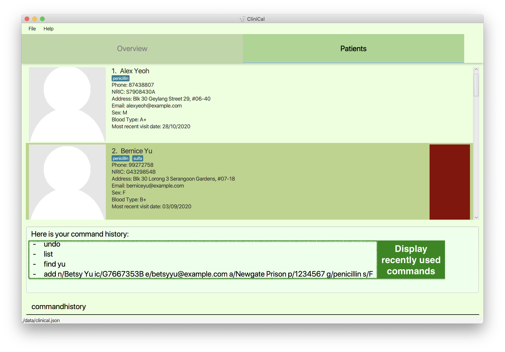
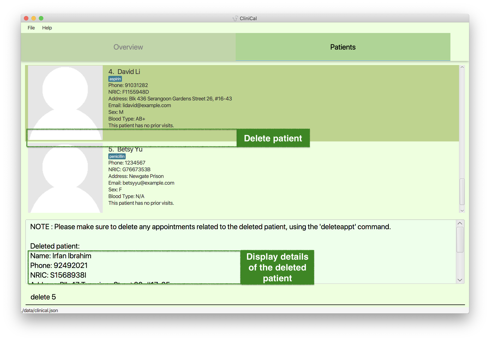
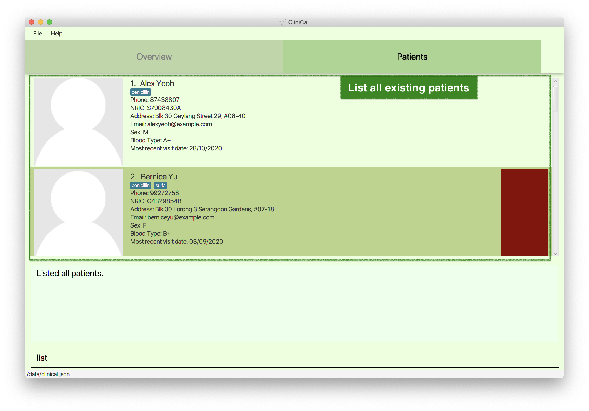

* Table of Contents
{:toc}
--------------------------------------------------------------------------------------------------------------------

## 1. Introduction

Welcome to the CliniCal User Guide!

Clinic Calendar (CliniCal) is a **desktop app that allows doctors to manage patient records and schedule upcoming appointments**. With CliniCal, you can enhance your daily workflow through the effective scheduling of medical appointments. You can also have access to a digital database that safely stores all your patient records.

Furthermore, CliniCal is optimized for use via a Command Line Interface (CLI) and even retains the benefits of a Graphical User Interface (GUI). If you can type fast, CliniCal can get your work done faster than traditional GUI apps.

Interested to know more? Take a look at our [**Quick Start**](#2-quick-start) guide. Enjoy!

## 2. Quick Start

Welcome to CliniCal! If you are new to our software, this quick start guide will get you up and running in no time! It equips you with the basics tools you need to use CliniCal appropriately.

1. Ensure you have Java `11` or above installed in your Computer.

1. Download the latest `CliniCal.jar` from [_here_](https://github.com/AY2021S1-CS2103T-W11-4/tp/releases).

1. Copy the file to the folder you want to use as the _home folder_ for CliniCal.

1. Double-click the file to start the app. The GUI similar to the below should appear in a few seconds. Note how the app contains some sample data. 
   

1. Type the command in the command box and press <kbd>Enter</kbd> to execute it. e.g. typing `help` and pressing <kbd>Enter</kbd> will open the help window. 
   Some example commands you can try:

   * `list` : Lists all your patients.

   * `add``n/John Doe p/98765432 ic/S2561932A a/Pickle street, Block 123, #01-01 e/johnd@example.com` : Adds a patient named `John Doe` to the patient database.

   * `delete``3` : Deletes the 3rd patient shown in the patient list.

   * `clear` : Deletes all your patients.

   * `exit` : Exits the app.

1. Refer to the [**Features**](#3-features) below for details of each command.

--------------------------------------------------------------------------------------------------------------------

## 3. Features

This section highlights the commands that CliniCal supports. These include details about the format of the command and example scenarios of the command.

**:information_source: Notes about the command format:** 

* Words in `UPPER_CASE` are the parameters to be supplied by the user. 
  e.g. in `add n/NAME`, `NAME` is a parameter which can be used as `add n/John Doe`.

* Items in square brackets are optional. 
  e.g `n/NAME [g/ALLERGY]` can be used as `n/John Doe g/penicillin` or as `n/John Doe`.

* Items with `…` after them can be used multiple times including zero times. 
  e.g. `[g/ALLERGY]…` can be used as ` ` (i.e. 0 times), `g/penicillin`, `g/sulfa g/aspirin` etc.

* Parameters can be in any order. 
  e.g. if the command specifies `n/NAME p/PHONE_NUMBER`, `p/PHONE_NUMBER n/NAME` is also acceptable.

### 3.1 General Commands

General commands are commands that enhances general user experience when you are using the app.

#### 3.1.1 Viewing help: `help`

Access help page by referring to the link provided in the message pop-up.

Format: `help`

#### 3.1.2 Retrieving past commands: `history`

View a list of past commands that you had used during the session.

Format: `history`

#### 3.1.3 Clearing command history: `clearhistory`

Clear the command history.

Format: `clearhistory`

**:information_source: Note:** 

 * Use with caution, `clearhistory` cannot be undone!

#### 3.1.4 Exiting the program: `exit`

Exit the program.

Format: `exit`

### 3.2 Patient Commands

Patient commands are commands that you can utilise to make changes to your list of patients.

#### 3.2.1 Adding a patient: `add`

Add your patient to the patient database.

Format: `add n/NAME p/PHONE_NUMBER ic/NRIC [a/ADDRESS] [e/EMAIL] [s/SEX] [b/BLOOD_TYPE] [ct/COLOR_TAG] [g/ALLERGY]…`

Examples:
* `add n/John Doe p/98765432 ic/S3857462J e/johnd@example.com a/Pickle street, block 123, #01-01`
* `add n/Betsy Crowe ic/G7667353B e/betsycrowe@example.com a/Newgate Prison p/1234567 g/penicillin`

:bulb: Tips:

* A patient can have any number of allergies (including 0).
* The color tag can be any standard HTML color name, such as red, green or orange.
* Check out <a href="https://www.w3schools.com/colors/colors_names.asp">this link</a> for an extensive list.

**:information_source: Note about color coding patients:** 

 * When your patient is tagged with a color tag, the background of the patient will be styled to show that color. The color tags can be used for a variety of purposes.
 * For example, you may color code patients at risk of terminal diseases as red, for easier reference.

#### 3.2.2 Adding profile picture: `addpicture`

Add a profile picture to your patient’s profile by specifying the filepath to desired profile picture.

All patient profiles are preloaded with a stock profile picture.

Format: `addpicture INDEX f/FILE_PATH`

Examples:
*  `addpicture 1 f/data/profile_picture.png` Replaces existing profile picture with 'profile_picture.png' for the 1st patient
*  `addpicture 2 f/downloads/profile_picture.png` Replaces existing profile picture with 'profile_picture.png' found in
                                                  'downloads' folder for the 2nd patient

:bulb: Tip: 
 
* You can also add a profile picture using drag and drop with your mouse!
1. Select your desired profile picture and drag it onto the space reserved for patient profile picture in CliniCal.
1. Release the mouse button and your patient's profile picture would be updated with the desired picture.

#### 3.2.3 Editing a patient: `edit`

Edit an existing patient in the patient database.

Format: `edit INDEX [n/NAME] [p/PHONE_NUMBER] [ic/NRIC] [a/ADDRESS] [e/EMAIL] [s/SEX] [b/BLOOD_TYPE] [ct/COLOR_TAG] [g/ALLERGY]…`

* Edits the patient at the specified `INDEX`. `INDEX` refers to the index number shown in the displayed patient list. The index **must be a positive number** 1, 2, 3, …​
* At least one of the optional fields must be provided.
* Existing values will be updated to the input values.
* When editing allergies (or color tag), the existing allergies (or color tag) of the patient will be removed i.e adding of allergies (or color tag) is not cumulative.
* You can remove all the patient’s allergies by typing `g/` without specifying any allergies after it. The same applies for color tags of a patient.

Examples:
*  `edit 1 p/91234567 e/johndoe@example.com` Edits the phone number and email address of the 1st patient to be `91234567` and `johndoe@example.com` respectively.
*  `edit 2 n/Betsy Crower g/` Edits the name of the 2nd patient to be `Betsy Crower` and clears all existing allergies.
*  `edit 3 ct/red` Clears the existing color tag and edits the color tag of the 3rd patient to be `red`.

#### 3.2.4 Deleting a patient: `delete`

Delete a specified patient from the patient database.

Format: `delete INDEX`

* Deletes the patient at the specified `INDEX`.
* `INDEX` refers to the index number shown in the displayed patient list.
* `INDEX` **must be a positive number** 1, 2, 3, …​

Examples:
* `list` followed by `delete 2` deletes the 2nd patient in the patient database.
* `find Betsy` followed by `delete 1` deletes the 1st patient in the results of the `find` command.

#### 3.2.5 Deleting all patients: `clear`

Clear all patient entries from the patient database.

Format: `clear`

:bulb: Tip: 

* Reverse the `clear` command using the `undo` command!

#### 3.2.6 Finding patients: `find`

Find patients whose names or IC number contain any of the given keywords.

Format: `find KEYWORD [MORE_KEYWORDS]`

* The search is case-insensitive. e.g `hans` will match `Hans`
* The order of the keywords does not matter. e.g. `Hans Bo` will match `Bo Hans`
* You can search for the patient's name or IC number.
* Patient will be matched even if the keyword matches the search parameters only partially e.g. `Han` will match `Hans`, `9123456` will match `s9123456z`.
* Patients matching at least one keyword will be returned (i.e. `OR` search).
  e.g. `Hans Bo` will return `Hans Gruber`, `Bo Yang`

Examples:
* `find John` returns `john` and `John Doe`
* `find ben` returns `benjamin`
* `find alex david` returns `Alex Yeoh`, `David Li` 
* `find 9123456` returns the patient with IC number `s9123456z`

#### 3.2.7 Listing all patients: `list`

View a list of all your patients in the patient database.

Format: `list`

:bulb: Tip: 

You can revert your previous command which modified the patient database.

* Useful to view all patients after a `find` command!

#### 3.2.8 Undoing the previous command: `undo`

Revert your previous command which modified the patient database.

Format: `undo`

* Only applies for commands that modify the patient database such as `add`, `addpicture`, `edit`, `delete` and `clear`.
* Does not apply for undoable commands such as `find` and `list`.

Example: 
* While trying to `addpicture` , you deleted Alex Yeoh's patient details by accident.
* Instead of re-entering Alex Yeoh's information all over again, you can easily restore Alex Yeoh's details by using `undo` on your previous `delete` command.

#### 3.2.9 Redoing a command: `redo`

Redo the most recent command that you have undone.

Format: `redo`

* Only able to `redo` commands that have been previously undone such as `add`, `addpicture`, `edit`, `delete` and `clear`.

#### 3.2.10 Viewing patient profile: `profile`

Display the patient's profile in a separate window.

Format: `profile INDEX`

* Displays the patient's profile that is specified by `INDEX`.
* `INDEX` refers to the index number shown in the displayed patient list.
* `INDEX` **must be a positive number** 1, 2, 3, …​

**Example**: You want to display the profile of the 1st patient on the list.

**Step 1**: Input `profile 1` into the command box and press <kbd>Enter</kbd> on your keyboard.

**Step 2**: A window displaying the patient's profile will appear. All relevant patient records and visitation logs will be shown.

**Step 3**: To close the patient profile window, you can click on the 'Close' button on the top-right section of the window. Alternatively, you can press
<kbd>ESC</kbd> key on your keyboard.

### 3.3 Patient Visitation Commands

#### 3.3.1 Adding a new visitation log for patient: `addvisit`

Display a new window to add a new visitation log for the specified patient.

Format: `addvisit INDEX [vd/VISIT_DATE]`

* `INDEX` refers to the patient's index number as shown in the displayed patient list.
* `VISIT_DATE`is optional. If no visit date is being specified in the command, then the current date on the local machine will be used to record the patient's visit.

**Example**: You want to add a visitation log to the 1st patient on the list.

**Step 1**: Input `addvisit 1 vd/10/12/2020` into the command box and press <kbd>Enter</kbd>.

**Step 2**: A window displaying the three parameters - Diagnosis, Prescription and Comments will be shown. Type in relevant
            details in each text box.

**Step 3**: Click on the 'Save' button or press <kbd>CTRL</kbd> + <kbd>S</kbd> on your keyboard to save the visitation log.

**Step 4**: The window will close, and a message will be displayed to indicate that the visitation log has been successfully saved.

:bulb: Tip: 

* Use <kbd>CTRL</kbd> + <kbd>SHIFT</kbd> and <kbd>CTRL</kbd> + <kbd>TAB</kbd> to move to the previous and next text box respectively!
* You can press <kbd>Esc</kbd> or the close button at the top right to close the window without saving.

#### 3.3.2 Deleting patient's visitation log: `deletevisit`

Delete the patient's visitation log.

Format: `deletevisit INDEX i/VISIT_INDEX`

* `INDEX` refers to the patient's index number as shown in the displayed patient list.
* `VISIT_INDEX` refers to the visitation's index number as shown in the patient's profile.
* Both indexes **must be a positive number** 1, 2, 3, …​

**Example**: You want to delete the 2nd visitation log belonging to the 1st patient on the list.

**Step 1**: Input `deletevisit 1 i/2` into the command box and press <kbd>Enter</kbd>.

**Step 2**: A message will be displayed to indicate that the patient's second visitation log has been successfully deleted.

#### 3.3.3 Editing patient's visitation log: `editvisit`

Display a new window to edit the visitation log for a specified patient.

Format: `editvisit INDEX i/VISIT_INDEX`

* `INDEX` refers to the patient's index number as shown in the displayed patient list.
* `VISIT_INDEX` refers to the visitation's index number as shown in the patient's profile.
* Both indexes **must be a positive number** 1, 2, 3, …​

**Example**: You want to edit the 1st visitation log belonging to the 2nd patient on the list.

**Step 1**: Input `editvisit 2 i/1` into the command box and press <kbd>Enter</kbd>.

**Step 2**: A window displaying the three parameters - Diagnosis, Prescription and Comments will be shown. Type in updated
            details in each text box.
    
   * You may press <kbd>CTRL</kbd> + <kbd>TAB</kbd> on your keyboard to move to the next text box.
   * You may press <kbd>CTRL</kbd> + <kbd>SHIFT</kbd> on your keyboard to move to the previous text box.

**Step 3**: Click on the 'Save' button or press <kbd>CTRL</kbd> + <kbd>S</kbd> on your keyboard to save the visitation log.

**Step 4**: The window will close, and a message will be displayed to indicate that the visitation log has been successfully updated.

### 3.4 Patient Appointment Commands

#### 3.4.1 Adding an appointment: `addapp`

Add an appointment for the specified patient.

Format: `addapp INDEX st/APPOINTMENT_DATETIME d/DURATION`

* `INDEX` refers to the patient's index number as shown in the displayed patient list in the patient tab. 
    * It **must be a positive number**, eg. 1, 2, 3, …​
* `APPOINTMENT DATETIME` refers to the date and starting time of the appointment. 
    * It follows the format of `yyyy-MM-dd HH:mm`. 
    * Do note that you will need to input the hour (`HH`) in  the 24-hour format. 
   
* `DURATION` refers to the duration of the appointment, in minutes.

:bulb: Tip: 

* If you are having trouble converting your time to 24 hour format, you may use the time format converter at https://www.timecalculator.net/12-hour-to-24-hour-converter.

Example: You want to add an appointment with the first patient on the list.

Step 1: Input `addapp 1 st/2020-10-10 10:00 d/60` into the command box and press Enter.

Step 2: On the overview tab, you can find your newly added appointment saved inside the appointment list. 

Step 3: If your newly added appointment is happening within a week from today, you can see the appointment being reflected in the calendar on the right of the appointment list.

:bulb: Tip: 

* You are highly recommended to use a duration of at least 60 minutes to optimise your experience with our CliniCal calendar feature.

#### 3.4.2 Deleting an appointment: `deleteapp`

Delete a specified appointment from the appointment database.

Format: `deleteapp INDEX`

* `INDEX` refers to the appointment's index number as shown in the displayed appointment list in the overview tab. 
    * It **must be a positive number**, eg. 1, 2, 3, …​
    
Example: You want to delete your next upcoming appointment as your patient could not make it.

Step 1: Input `deleteapp 1` and press Enter.

Step 2: The first appointment displayed will be removed from the appointment list immediately. You can also see that the appointment is no longer being displayed on the calendar.
    
#### 3.4.3 Editing an appointment: `editapp`

### 3.5 Retrieving past commands using arrow keys

Retrieve and reuse past commands using the <kbd>↑</kbd> arrow and <kbd>↓</kbd> arrow keys on the keyboard.
1. Click on the text field of the command box.
2. Press the <kbd>↑</kbd> arrow key to display the most recent past command.
3. Press the <kbd>↓</kbd> and <kbd>↑</kbd> arrow keys to navigate through the list of past commands.
4. Press <kbd>Enter</kbd>/<kbd>Return</kbd> key to reuse the command.

:bulb: Tip: 

* Useful when inputting repeated commands.
* No need to retype them all over again!

### 3.6 Saving the data

CliniCal data is saved in your hard disk automatically after any command that changes the data. There is no need to save manually.

--------------------------------------------------------------------------------------------------------------------

## 4. FAQ

**Q**: How do I transfer my data to another Computer? 
**A**: Install the app in the other computer and overwrite the empty data file it creates with the file that contains the data of your previous CliniCal home folder.

--------------------------------------------------------------------------------------------------------------------

## 5. Command summary

Action | Format, Examples
--------|------------------
**Add** | `add n/NAME p/PHONE_NUMBER ic/NRIC [a/ADDRESS] [e/EMAIL] [s/SEX] [b/BLOOD_TYPE] [ct/COLOR_TAG] [g/ALLERGY]…​`   e.g., `add n/James Ho p/22224444 i/S2686887R e/jamesho@example.com a/123, Clementi Rd, 1234665 s/M b/B+ g/sulfa g/aspirin`
**Add profile picture** | `addpicture 1 f/data/profile_picture.png`
**Add Visit** | `addvisit INDEX [vd/VISIT_DATE]`
**Add Appointment** | `addapp INDEX st/APPOINTMENT_DATETIME d/DURATION`   e.g., `addapp 1 st/2020-10-27 14:00 d/60`
**Clear** | `clear`
**Clear command history** | `clearhistory`
**Delete** | `delete INDEX`  e.g., `delete 3`
**Delete Visit** | `deletevisit INDEX i/VISIT_INDEX`
**Delete Appointment** | `deleteapp INDEX`   e.g., `delete 3`
**Edit** | `edit INDEX [n/NAME] [p/PHONE_NUMBER] [ic/NRIC] [a/ADDRESS] [e/EMAIL] [s/SEX] [b/BLOOD_TYPE] [ct/COLOR_TAG] [g/ALLERGY]…`  e.g.,`edit 2 n/James Lee e/jameslee@example.com `
**Edit Visit** | `editvisit INDEX i/VISIT_INDEX`
**Find** | `find KEYWORD [MORE_KEYWORDS]`  e.g., `find James Jake`
**List** | `list`
**Help** | `help`
**Undo** | `undo`
**Redo** | `redo`
**Retrieve past commands** | `history`
**View patient profile** | `profile INDEX`  e.g., `profile 2`
**Exit** | `exit`
