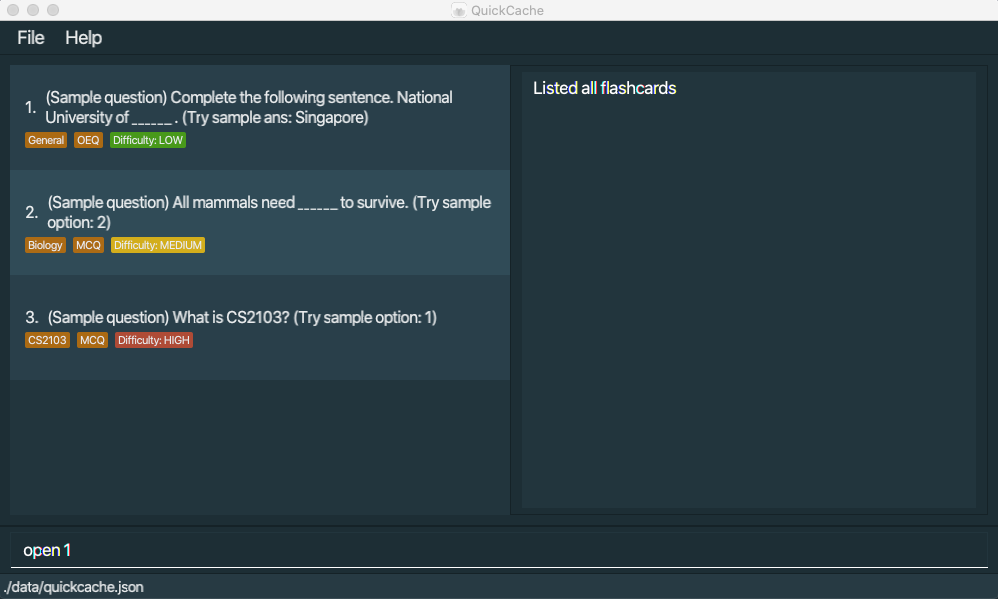
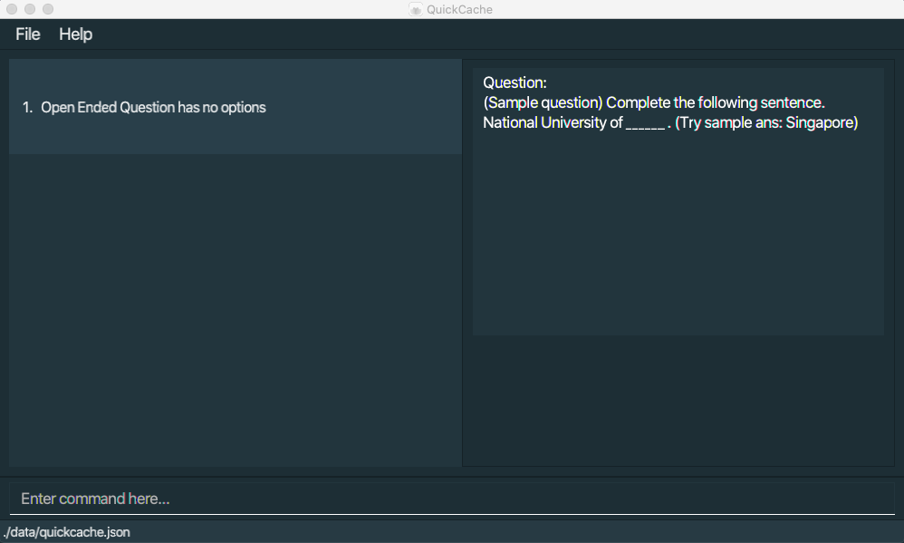
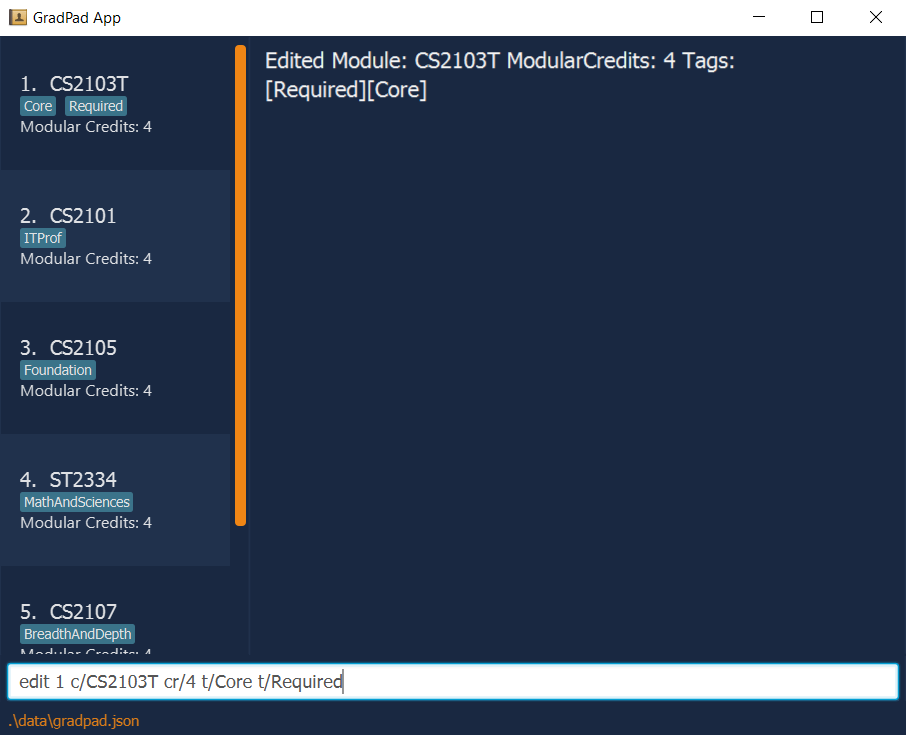
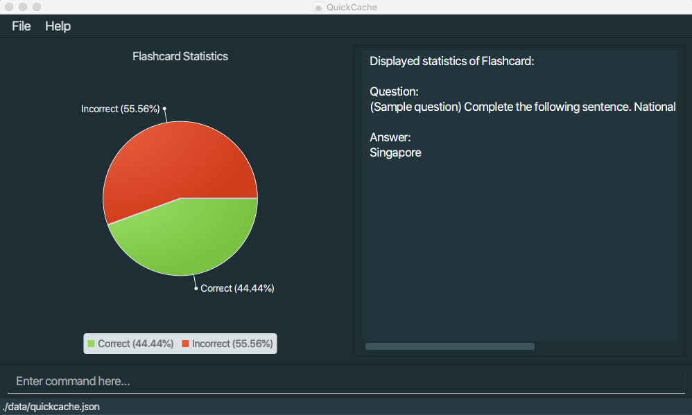
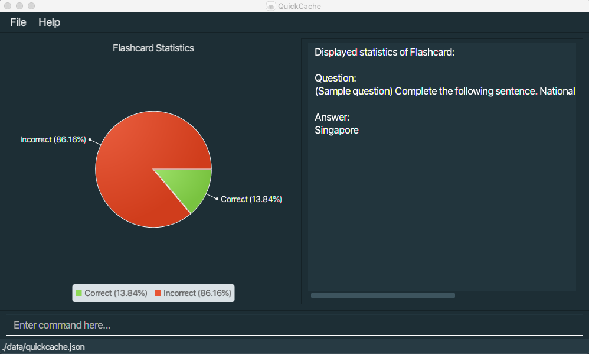

QuickCache is a **desktop app for managing flashcards, optimized for use via a Command Line Interface** (CLI) while still having the benefits of a Graphical User Interface (GUI). If you can type fast, QuickCache can get your flashcard management tasks done faster than traditional GUI apps.

* Table of Contents
{:toc}

--------------------------------------------------------------------------------------------------------------------

## Quick start
Here is a quick start on how you can start using our app in your own computer. 

1. Ensure you have Java `11` or above installed in your Computer.

1. Download the latest `quickcache.jar` from [here](https://github.com/AY2021S1-CS2103T-T13-2/tp/releases).

1. Copy the file to the folder you want to use as the _home folder_ for your QuickCache.

1. Double-click the file to start the app. The GUI similar to the below should appear in a few seconds. Note how the app contains some sample data. 
   

1. Type the command in the command box and press Enter to execute it. e.g. typing **`help`** and pressing Enter will open the help window. 
   Some example commands you can try:
   
   * **`add`**`q/Plants give out ___ when they photosynthesise? ans/Oxygen t/Biology` :  Adds an open ended question `Plants give out ___ when they photosynthesise?` with answer `Oxygen` and tagged to `Biology`. 
      
   * **`addmcq`**`q/Plants give out ___ when they photosynthesise? ans/1 c/Oxygen c/Carbon c/Carbon dioxide` :  Adds a multiple choice question `Plants give out ___ when they photosynthesise?` with 3 options `Oxygen`, `Carbon`, `Carbon dioxide` and with answer `Oxygen`.

   * **`open`**`1` : Opens the 1st question shown in the current list.
   
   * **`edit`**`1 ans/Edited answer` : Edit the answer of the first flashcard on the list to become `Edited answer`.
   
   * **`list`** : Lists all FlashCards.
   
   * **`find`** `find t/MCQ q/What CS2103T q/is t/GoodQuestion` : Finds all Flashcards tagged to the tag `MCQ` and `GoodQuestion` and has keywords `What`, `CS2103T` and `is` in question.
   
   * **`delete`**`3` : Deletes the 3rd flashcard shown in the current list.
   
   * **`clear`** : Deletes all FlashCards.
   
   * **`test`**`1 ans/Example answer` : Tests the 1st question shown in the current list with `Example answer` as the answer.
   
   * **`stats`**`1` : Show stats of the 1st question shown in the current list.
   
   * **`clearstats`**`1` : Clears the statistics of the 1st flashcard shown in the current list.
   
   * **`export`**`science-questions.json` : Exports current list of flashcard to a file named `science-questions.json` in the `export` folder.
   
   * **`import`**`science-questions.json` : Import all flashcards from a file named `science-questions.json` in the `import` folder.

   * **`exit`** : Exits the app.

1. Refer to the [Features](#features) below for details of each command.

--------------------------------------------------------------------------------------------------------------------

## Features

**:information_source: Notes about the command format:** 

* Words in `UPPER_CASE` are the parameters to be supplied by the user. 
  e.g. in `add n/ANSWER`, `ANSWER` is a parameter which can be used as `add n/Oxygen`.

* Parameters can be in any order. 
  e.g. if the command specifies `n/QUESTION p/ANSWER`, `p/ANSWER n/QUESTION` is also acceptable.

### Viewing help : `help`

Shows a message explaning how to access the help page.

Format: `help`

### Creating a new flashcard : You can add a new flashcard to the list.
#### Creating a flashcard with open ended question: `add`
You can create a flashcard that contains an open ended question which will be added to the list.

Format: `add q/QUESTION ans/ANSWER`

Examples:
* `add q/Plants give out ___ when they photosynthesise? ans/Oxygen`

You cannot add a flashcard with empty question and empty answer.

#### Creating a flashcard with multiple choice question: `addmcq`
You can create a flashcard that contains a multiple choice question which will be added to the list.

Format: `addmcq q/QUESTION ans/ANSWER c/FIRST_CHOICE c/SECOND_CHOICE ..`

Examples:
* `addmcq q/Plants give out ___ when they photosynthesise? ans/1 c/Oxygen c/Carbon c/Carbon dioxide`

You cannot add flashcard with missing question or missing answer or missing choice.
 
You should have at least two choices.

### Open a flashcard: `open INDEX`

To view a flashcard you can open it by its index.

:information_source: The INDEX refers to the the index number shown on the last displayed flashcard list and it <strong>must be a positive integer</strong>.

1. Use the `list` command to first list all the flashcards. You can also use the `find` command to filter for a list of flashcards.

	
	
2. Using the indices of the displayed list, enter the open command followed by the index of the flashcard you want to open. For example, if you want to open the 1st flashcard in the displayed list, you can enter `open 1`.

	
	
3. Press enter and QuickCache will open the flashcard specified by the index.

	
	
You have successfully opened a flashcard!

### Editing a flashcard: `edit`

You can edit a flashcard that you have created previously.

Format: `edit INDEX q/QUESTION ans/ANSWER c/FIRST_CHOICE c/SECOND_CHOICE ..`

Examples:
* `edit 1 q/Plants give out ___ when they photosynthesise? ans/2 c/Oxygen c/Carbon c/Carbon dioxide`

You must have at least one edited field which is different from the previous flashcard.

### Listing all flashcards : `list`

Shows a list of all flashcards currently created.

Format: `list`

### Finding Flashcards by their tags and/or question: `find`

Finds all Flashcards based on their tags and/or question.

Format: `find t/TAG1 t/TAG2 .. q/KEYWORD1 q/KEYWORD2 ..`

* Do not need to use both `t/` and `q/` when finding a flashcard.
* Tags are case-sensitive.
* Words in spaced keywords will be treated as individual keywords. Example, the keyword `what is` will be treated as two keywords: `what` and `is`.
* Keywords do not need to match exact word. Example, the keyword `Wha` will pick up questions containing `What` as a word.

Example: `find t/MCQ q/What CS2103T q/is t/GoodQuestion` where `MCQ` and `GoodQuestion` are tags and `What`, `CS2103T` and `is` are keywords.

### Deleting a flashcard : You can delete the flashcard from the list.

You can only delete based on index or based on tags but not both!

#### Deleting by index: `delete`
You can delete a flashcard based on the index from the last displayed list.
Format: `delete INDEX` 

* Deletes the flashcard at the specified `INDEX`.
* The index refers to the index number shown in the displayed flashcard list.
* The index **must be a positive integer** 1, 2, 3, …

Examples:

* `list` followed by `delete 3` deletes the 3rd flashcard in the list.

#### Deleting by tags : `delete`
Format: `delete t/TAG1 TAG2`

* Deletes all flashcards with the tags `TAG1` and `TAG2`

Examples:

* `delete t/MCQ` will delete all flashcards with the tag `MCQ`
#### Clearing all entries : `clear`
Clears all entries from QuickCache.

Format: `clear`

### Testing a flashcard : `test`

Tests a specified flashcard from the list.

#### Containing an open-ended question

Format: `test INDEX ans/ANSWER`

* Tests the flashcard at the specified `INDEX`
* The index refers to the index number shown in the displayed flashcard list.
* The index **must be a positive integer**  1, 2, 3, …
* The `ANSWER` is case-insensitive.

Examples:
* `list` followed by `test 1 a/Example answer` tests the 1st flashcard in the list with `Example answer` as the answer.

#### Containing a multiple choice question

Format: `test INDEX o/OPTION` 

* Tests the flashcard at the specified `INDEX`
* The index refers to the index number shown in the displayed flashcard list.
* The index **must be a positive integer**  1, 2, 3, …
* `CHOICE`(s) are displayed in the displayed choices list of the flashcard after `open INDEX` command is performed.
* The `OPTION` refers to the index number of the specified `CHOICE`.
* The `OPTION` **must be a positive integer** 1, 2, 3, …

Examples:
* `list` followed by `test 1 o/2` tests the 1st flashcard in the list with `OPTION 2` corresponding to the 2nd choice in the choices of the multiple choice question as the answer.

### Displaying statistics for a Flashcard: `stats INDEX`

To view the statistics of a flashcard you can use the stats command.

:information_source: The INDEX refers to the the index number shown on the last displayed flashcard list and it <strong>must be a positive integer</strong>.

Statistics include: 

- The number of times and the percentage the user answers the question associated with the flashcard correctly. 
- The number of times and the percentage the user answers the question associated with the flashcard incorrectly.

1. Use the `list` command to first list all the flashcards. You can also use the `find` command to filter for a list of flashcards.

	
	
2. Using the indices of the displayed list, enter the stats command followed by the index of the flashcard you want to view the statistics of. For example, if you want to view the statistics of the first flashcard in the displayed list, you can enter `stats 1`.

	
	
3. Press enter and QuickCache will display the statistics of the flashcard specified by the index.

	
	
You have successfully displayed the statistics of a flashcard!

### Clearing a flashcard's statistics : `clearstats INDEX`

To clear the statistics of a flashcard you can use the clearstats command.

:information_source: The INDEX refers to the the index number shown on the last displayed flashcard list and it <strong>must be a positive integer</strong>.

1. Use the `list` command to first list all the flashcards. You can also use the `find` command to filter for a list of flashcards.

	
	
	

	<Strong>Optional Step:</Strong>
	You can first check the statistics of the flashcard you want to clear the statistics of.
	
	
		
	

	
2. Using the indices of the displayed list, enter the clearstats command followed by the index of the flashcard you want to clear the statistics of. For example, if you want to clear the statistics of the first flashcard in the displayed list, you can enter `clearstats 1`.

	
	
3. Press enter and QuickCache will clear the statistics of the flashcard specified by the index.

	
	
	

	<Strong>Optional Step:</Strong>
	You can check that the statistics of the flashcard has been cleared.
	
	
	
	

	
You have successfully cleared the statistics of a flashcard!

### Importing a set of flashcards : `import`

Imports the flashcards from a specified file into your local QuickCache.

Format: `import FILE_NAME`

* Imports the flashcards from the specified file.
* Duplicate flashcards will be ignored.
* The input file follows the name specified in `FILE_NAME`.
* The input file should be placed within the `import` folder for it to be detected.

### Exporting a set of flashcards : `export`

Exports the current list of flashcard into a file.

Format: `export FILE_NAME`

* Exports the previously shown list of flashcards.
* The output file follows the name specified in `FILE_NAME`.
* The output file can be found in the `export` folder.

### Exiting the program : `exit`

Exits the program.

Format: `exit`

### Saving the data

QuickCache data are saved in the hard disk automatically after any command that changes the data. There is no need to save manually.

--------------------------------------------------------------------------------------------------------------------

## FAQ

**Q**: How do I transfer my data to another Computer? 
**A**: Install the app in the other computer and overwrite the empty data file it creates with the file that contains the data of your previous QuickCache home folder.

--------------------------------------------------------------------------------------------------------------------

## Command summary

Action | Format, Examples
--------|------------------
**Open**| `open INDEX`   e.g., `open 3`
**Add** | `add q/QUESTION ans/ANSWER`   e.g., `add q/Plants give out ___ when they photosynthesise? ans/Oxygen`
**Addmcq** | `addmcq q/Plants give out ___ when they photosynthesise? ans/1 c/Oxygen c/Carbon c/Carbon dioxide`
**Test** | `test INDEX ans/ANSWER` (open-ended question)  e.g., `test 2 a/lorem ipsum`   `test INDEX o/OPTION` (multiple choice question)  e.g., `test 3 o/1`
**stats** | `stats INDEX`
**Clear** | `clear`
**ClearStats** | `clearstats INDEX`
**Delete** | `delete INDEX` or `delete t/TAG1`  e.g., `delete 3` or `delete t/MCQ`
**List** | `list`
**Find** | `find t/TAG1 t/TAG2 .. q/KEYWORD1 q/KEYWORD2 ..`   e.g., `find t/MCQ q/What CS2103T q/is t/GoodQuestion`
**Help** | `help`
**Export** | `export FILE_NAME`   e.g., `export science-questions.json`
**Import** | `import FILE_NAME`   e.g., `import science-questions.json`
**Exit** | `exit`
