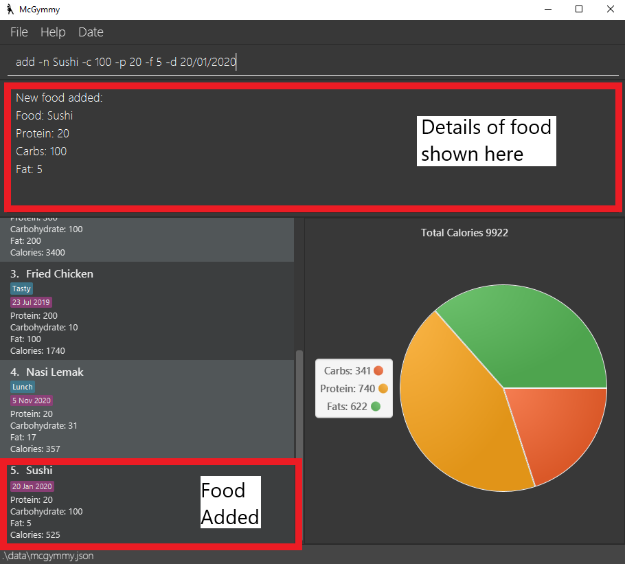
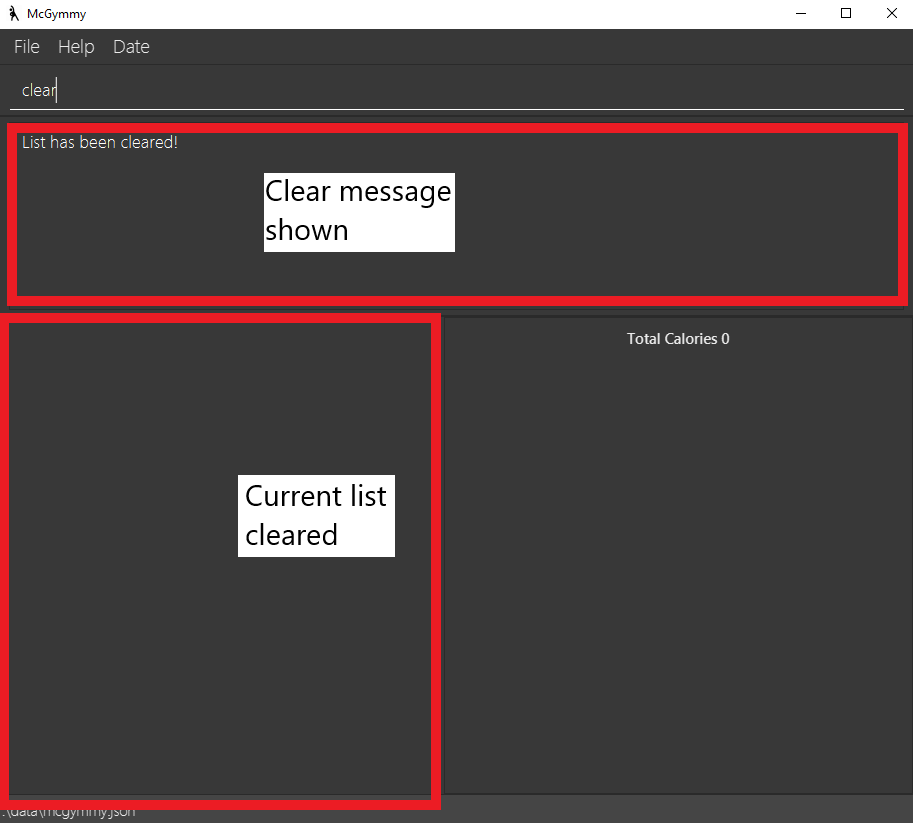
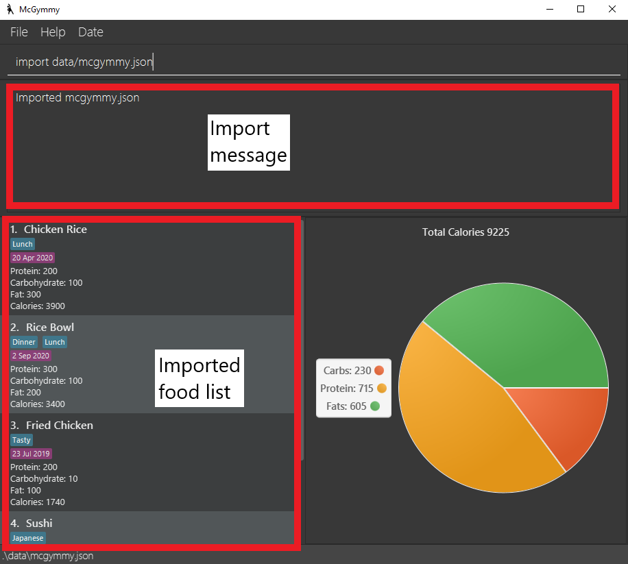
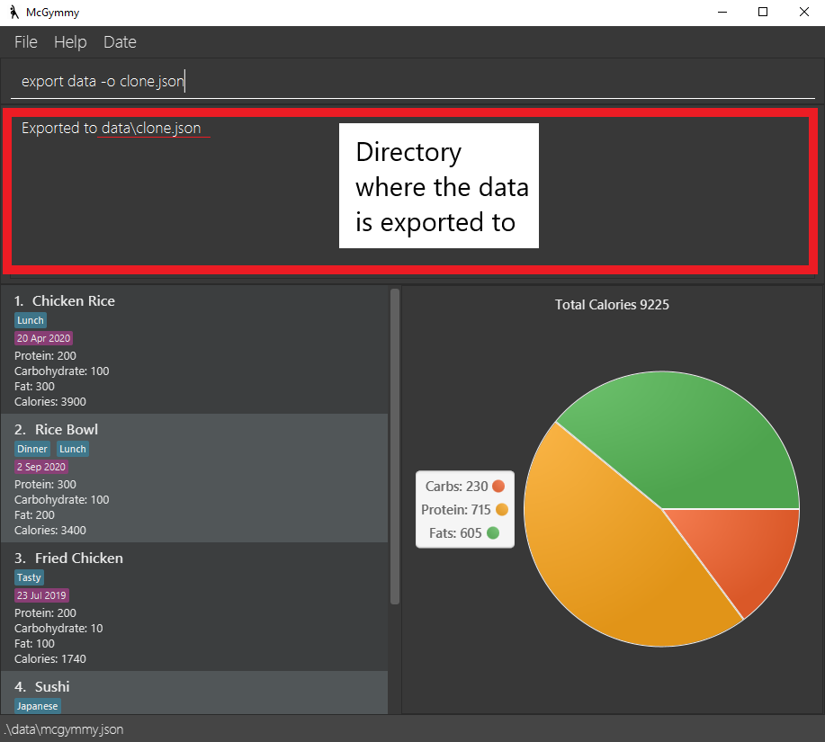
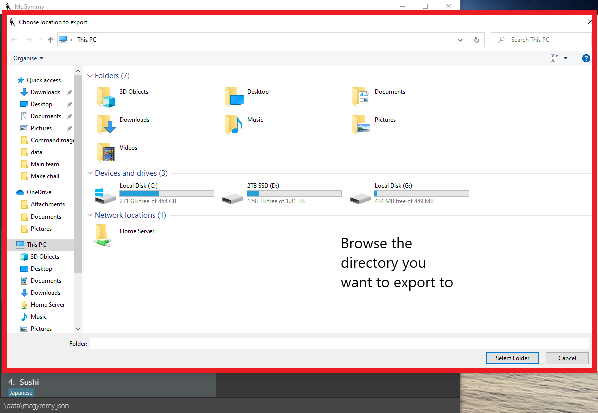
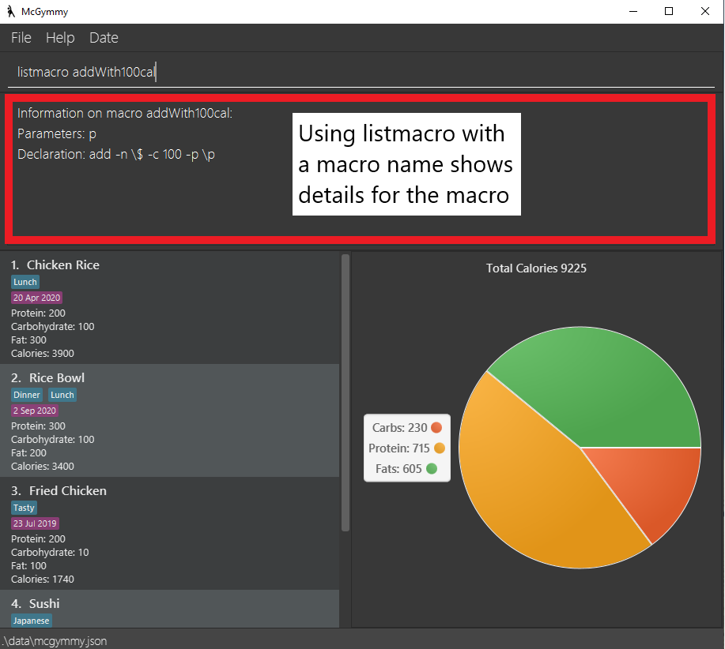
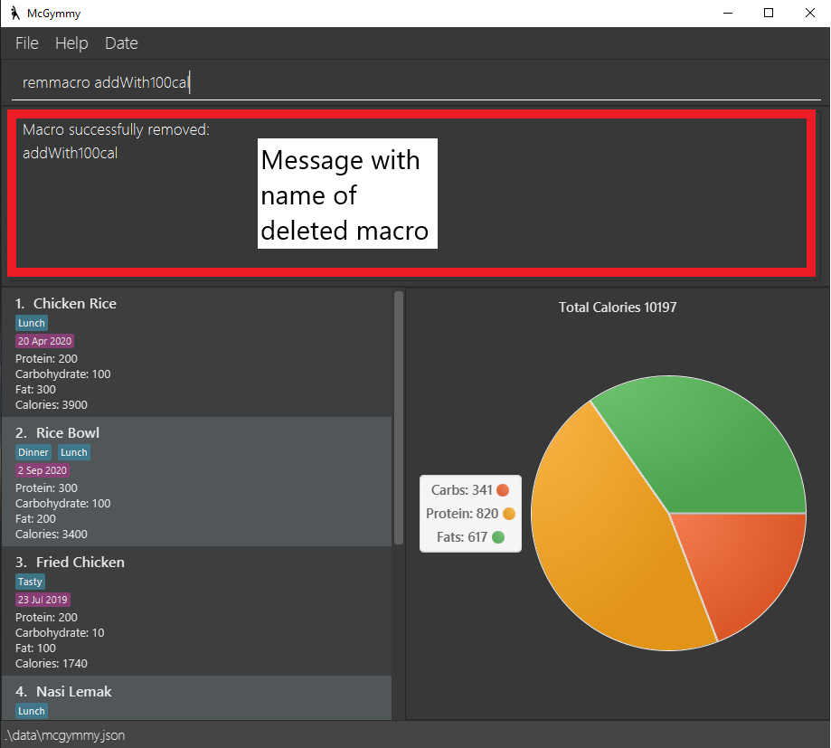
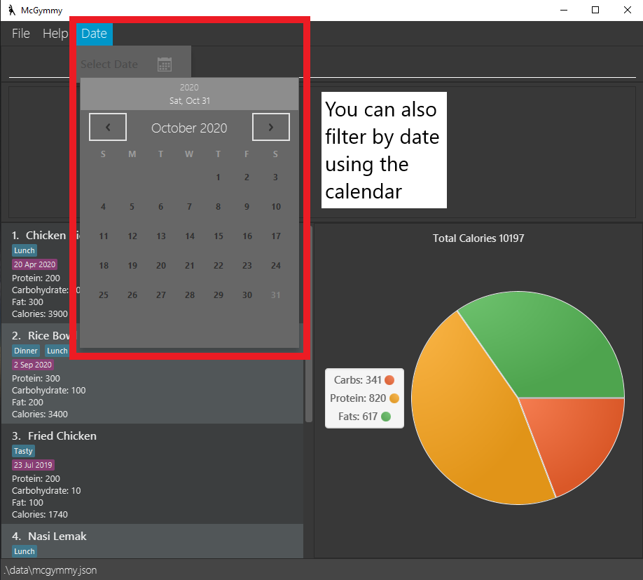

McGymmy is a **desktop app for Software Engineers who need help managing their diet, optimized for use via a Command Line Interface** (CLI) while still having the benefits of a Graphical User Interface (GUI). While we are primarily targetting software engineers who are familiar with the CLI, those who spend a large amount of time at their desk can still benefit from this application by saving time as opposed to the more traditional caloric tracker applications.  
If you can type fast, McGymmy can log your food intake faster than traditional GUI apps. McGymmy aims to help users track their caloric and macronutrient intake in an efficient way that does not interfere with one's workflow.

This document aims to showcase all of McGymmy's commands.
Open this document in a modern internet browser (Mozilla Firefox, Google Chrome, or Microsoft Edge).

* Table of Contents
{:toc}

##  1. Icon Legend

:bulb: **Tip:** This indicates that the following text consists of tips to better utilise McGymmy

:information_source: This indicates important notes for the current feature we are looking at 

## 2. A little note from the developers

Thank you for using McGymmy. We sincerely hope that McGymmy plays a part to help you achieve a healthier lifestyle.
We understand that McGymmy may be a little different from traditional GUI applications, and it may be a little difficult to start using it initially.
Thus, we recommend you to start by first understanding how McGymmy works at a high level at the Quick start section. Then, explore the Features section.

:bulb: **Tip:** Press `Ctrl-F` for Windows and Other OSs and `CMD + F` for Mac OS to open the find prompt in your browser. You can type in keywords such as `add` or `edit` to quickly navigate to those parts of the document.

--------------------------------------------------------------------------------------------------------------------

## 3. Quick start

To get started, you can double-click on the jar file to open the GUI.
You can type the command in the command box and press Enter to execute it. e.g. typing help and pressing Enter will open the help window.
Refer to the [features](#5-features) below for details of each command.

1. Please ensure that you have Java `11` or above installed in your Computer.

1. You can download the latest `mcgymmy.jar` [here](https://github.com/AY2021S1-CS2103T-W17-3/tp).

1. Afterwards, copy the file to the folder you want to use as the _home folder_ for your McGymmy.

1. Double-click the file to start the app. You should notice a GUI similar to the below should appear in a few seconds. Note how the app contains some sample data.
 
*Note* For Ubuntu users, you will need to set execution permissions on the application using `chmod` before double-clicking will work.
 

   

1. Type the command in the command box and press Enter to execute it. e.g. typing **`help`** and pressing Enter will open the help window. 
   Some example commands you can try:

   * **`list`** : Lists all food items.

   * **`add`**` -n potato -p 100 -c 5 -f 0` : Adds a food item named `potato` with `100`g of proteins, `5`g of carbs, and `0`g of fats into current date.

   * **`delete`**` 3` : Deletes the 3rd food item (i.e. food item with index 3) shown in the current list.

   * **`exit`** : Exits the app.

1. Refer to the [Features](#5-features) below for details of each command.

--------------------------------------------------------------------------------------------------------------------
## 4. How to use this guide

Please do read this section in order to use this guide effectively

<b>Important</b>
The picture below shows a summary of where all the items will be. 
Each of the commands explained below will have an image which shows the output.

If you are looking for a particular command:
1. Press `Ctrl-F` for Windows and other operating systems, `CMD + F` for Mac OS.
1. Search for the command in the search bar.

If you want a table with all the commands:
1. Refer to table of contents above
1. Click on Command Summary
    - The command summary will show you all the commands at a glance

If you want to get acquainted with all the commands:
1. Follow the format and continue reading.

--------------------------------------------------------------------------------------------------------------------

## 5. Features

**:information_source: Notes about the command format:** 

A typical *command* in *McGymmy* consists of a *Command Word* followed by several *parameters*.

For example in `add -n scrambled eggs -p 100`, `add` is a *Command Word* and `-n scrambled eggs` and `-p 100` are *parameters*.

**How to intepret the each command's format**:

We will follow the following convention for each command's format:

`COMMAND_WORD PARAMETERS [OPTIONAL_PARAMETERS]`, e.g. `add -n NAME [-p PROTEIN] [-f FATS] [-c CARBS] [-d DATE]`.

* `COMMAND_WORD` is the name of the command to be executed, and is always the first word in the *command*.

* Words in `UPPER_CASE` are the parameters to be supplied by you. 
  e.g. in `add -n NAME -p PROTEIN`, `NAME` and `PROTEIN` are parameters which can be used as `add bacon -p 200`.
  
* Prefixes that precede parameters represent *flags* that indicate which parameter is being referenced. Parameters that are not preceded by a flag are denoted as *flag-less* parameters. For simplicity, the [flag + parameter input] together will be referenced as a single parameter. 
  e.g. in `find example -t lunch`, `example` represents a flag-less parameter while `-t lunch` is referred as a parameter with flag `-t` and parameter input `lunch`.

* Flag-less parameters always have to be the first parameter after the command word. 
  e.g. in `edit 1 -n chicken`, the flag-less parameter is `1` and the `n` parameter is `chicken`. However for `edit -n chicken 1`, there is no flag-less parameter, and the `n` parameter is `chicken 1`.
  
* Items in square brackets are optional. 
  e.g. `-n NAME [-f FATS]` can be used as `-n bacon -f 10` or as `-n bacon`.

* Parameters and optional parameters with flags can be in any order. 
  e.g. if the command specifies `-c CARBS -p PROTEIN [-f FATS]`, `-p PROTEIN [-f FATS] -c CARBS` is also acceptable.

* Items with `…`​ after them can be used multiple times including zero times. 
  e.g. `[commnand;]…​` can be used as ` ` (i.e. 0 times), `delete 1;`, `delete 2; delete 1;` etc.

* Entering the same parameter twice will concatenate the inputs. 
  e.g. in `add -n potato -n chip`, the `n` parameters will be concatenated to `potato chip`, and a new item with the name `potato chip` will be created.

### 5.1 Viewing help : `help`

Stuck and unsure of how to execute a certain command? The `help` command allows you to view
information on all available commands. It also enables you to display detailed information on a specific
command. This way, you won't have any trouble utilising McGymmy to its full potential.

Format: `help [COMMAND]`

Examples:
* `help` - this will display all available commands.
* `help add` - this will display a help message specific to the `add` command.

:information_source: Notes about the `help` Command.
 * `help help` will flag as an invalid command.
 * `help` will not work with created macros, the `listmacro` command should be used instead.

### 5.2 Adding a food item: `add`

The `add` command allows you to store your food items into McGymmy with ease. You can also
specify additional details for your food item entry, creating a more detailed and customisable
diet-tracking experience.

Format: `add -n NAME [-p PROTEIN] [-f FATS] [-c CARBS] [-d DATE] [-t TAG]`

Examples:
* `add -n potato -p 100 -c 5 -f 0`
* `add -n McSpicy`
* `add -n Wonton Mee -c 10`
* `add -n Sushi -d 20/04/2020`
* `add -n Burger -t FastFood`

:information_source: Notes about the `add` Command.
 * The default value for `PROTEIN`, `FATS` and `CARBS` is 0. The default date is the day in which the food item is added. 
 * Values of `PROTEIN`, `FATS` and `CARBS` must be a non-negative integer, less than 1000g. 
 * To view the list of supported date formats, see *Appendix A*. 

### 5.3 Tagging food items : `tag`

Tags are customisable labels that help organise your food items. The `tag` command enables
you to tag food items with a specific label, which allows you to locate and filter the food
items with greater ease and create a more organised food list. 

Format: `tag INDEX -t TAG_NAME`

Examples:
* `tag 1 -t Breakfast` - adds the `Breakfast` tag to the first food item in your list.

:information_source: Notes about the `tag` command.

* Tags `TAG_NAME` for food item at the specified `INDEX`.
* `TAG_NAME` is case-sensitive.
* The index refers to the index number shown in the displayed food list.
* The index **must be a positive integer** 1, 2, 3, …​ that is smaller than 2^31 or the size of the list, whichever lower.
* Tags for food items must be less than 20 characters.
* The list will show all items after tagging

### 5.4 Untagging food items : `untag`

Wrongly tagged a food item? Not to worry, the `untag` command allows for quick and easy
removal of a specified tag.

Format: `untag INDEX -t TAG_NAME`

Examples:
* `untag 1 -t Breakfast` - removes the `Breakfast` tag from the first food item in your list.

:information_source: Notes about the `untag` command.

* Untags `TAG_NAME` for food item at the specified `INDEX`.
* `TAG_NAME` is case-sensitive.
* The index refers to the index number shown in the displayed food list.
* The index **must be a positive integer** 1, 2, 3, …​ that is smaller than 2^31 or the size of the list, whichever lower.
* The list will show all items after untagging

### 5.5 Finding a food item: `find`

Easy and quick filtering of food items is made possible via the `find` command.
This command allows you to specify certain criteria to filter the current food list by,
allowing you to easily locate past entries.

Format: `find [KEYWORDS] [-n WORDS_IN_NAME] [-t WORDS_IN_TAG] [-d DATE]`

:information_source: Notes about the `find` command.

* Filters the displayed list of food items to only include food items corresponding to the provided parameters.
* The `[KEYWORDS]`, `[WORDS_IN_NAME]` and `[WORDS_IN_TAG]` parameters will only find food items that contain at least one of the complete words specified. 
  e.g. `find chick` will not return the food item with the name "Chicken Rice" but `find chicken lemak` will return both the food items "Chicken Rice" and "Nasi Lemak".
* `KEYWORDS` and `WORDS_IN_NAME` are not case sensitive but `WORDS_IN_TAG` is case sensitive.

Examples:
* `find` - finds all food items
* `find -n Sushi -d 20/04/2020` - finds all food items with the word "Sushi" in it's name and date "20/04/2020"
* `find -t lunch dinner` - finds all food items with tag "lunch" and/or tag "dinner"
* `find sushi lunch` - finds all food items that have the keywords "sushi" and/or "lunch" in their name and/or tag

### 5.6 Clearing food items: `clear`

The `clear` command allows you to quickly delete
all entries in the current displayed list, preventing your food list from getting clogged up.

Format: `clear`

Examples:
* `clear` - clears food items in the currently displayed screen.

:information_source: Notes about the `clear` command.

* Clears all food item that is shown on the list.
* You can clear specific groups of item by using find then clear.

### 5.7 Listing all food items : `list`

The `list` command lets you display the entire list of food items stored in your McGymmy.

Format: `list`

:information_source: Notes about the `list` command.

* Lists all food items in McGymmy
* All additional input after the *command word* `list` will be ignored. E.g. `list` and `list 123` will have the same effect.

### 5.8 Editing a food item : `edit`

The `edit` command allows for quick and easy changes to be made on existing food items in
McGymmy.

Format: `edit INDEX [-n NAME] [-p PROTEIN] [-c CARBS] [-f FATS] [-d DATE]`

:information_source: Notes about the `edit` command.

* Edits the food item at the specified `INDEX`. The index refers to the index number shown in the displayed food list.
* The index **must be a positive integer** 1, 2, 3, …​ that is smaller than 2^31 or the size of the list, whichever lower.
 * Values of `PROTEIN`, `FATS` and `CARBS` must be a non-negative integer, less than 1000g. 
* At least one of the optional fields must be provided.
* Existing values will be updated to the input values.
* To view the list of supported date formats, see *Appendix A*.
* To edit tag, use tag and untag command instead.

Examples:
*  `edit 3 -n banana -p 120` Changes the `name` and `protein` values of the 3rd item in the list to `banana` and `120` respectively.

### 5.9 Deleting a food item: `delete`

The `delete` command allows you to instantly remove a food item from the current
displayed list of food items.

Format: `delete INDEX`

:information_source: Notes about the `delete` command.

* Deletes the food at the specified `INDEX`.
* The index refers to the index number shown in the displayed food list.
* The index **must be a positive integer** 1, 2, 3, …​ that is smaller than 2^31 or the size of the list, whichever lower.

Examples:
* `list` followed by `delete 2` deletes the 2nd food item in McGymmy.

### 5.10 Importing another save file: `import`

The `import` command allows you to load a previously saved file from your local directory
into McGymmy. This allows for easy transfer of McGymmy data between multiple computers.

Format: `import FILEPATH`

:information_source: Notes about the `import` command.

* Imports the saved file at `FILEPATH`
* Both relative and absolute paths work for the import feature.
* The imported file will simply override the existing food list.

Examples:
* For Windows users: `import c:/mcgymmy/save_file.json` imports `save_file.json` from the `c:/mcgymmy` directory into McGymmy.
* For Mac users: `import /Users/<username>/Desktop/save_file.json` imports `save_file.json` from the Desktop into McGymmy.

:bulb: **Tip:** For those who are more inclined to use a gui to import:

1. Click on file
1. Click on Import
1. Navigate using the GUI to the save file

### 5.11 Exporting your save file to a folder: `export`

The `export` command allows you to export your current food list as file on
your computer. This would make it easy to send and transfer your existing McGymmy data
between multiple computers.

Format: `export DIRPATH [-o FILENAME]`

:information_source: Notes about the `export` command.

* Exports the saved file to `DIRPATH` with `FILENAME`
* Default filename is `mcgymmy.json`
* Both relative and absolute paths work for the export feature.
* Make sure to export only to valid paths that already exist. The examples below assume that the given paths already exist in your working space.

Examples:
* `export c:/mcgymmy` exports the save file as `mcgymmy.json` to `c:/mcgymmy`
* `export c:/mcgymmy -o save_file` exports the save file as `save_file.json` to `c:/mcgymmy`

:bulb: **Tip:** For those who are more inclined to use a gui to export.

1. Click on `file` option in the menubar above the command box
1. Click on `Export` button to open the directory selector
1. Navigate using the GUI to the save file
1. Click on `Select Folder` when done

### 5.12 Undoing the previous command : `undo`

The `undo` command allows you to reverse the change of the previous command. This makes
it easier to reverse mistakes made in McGymmy.

Format: `undo`

:information_source: Notes about the `undo` command.

* Undo command can be called multiple times.
* Help command will be ignored when undoing. 
For example, if the user calls the following commands in sequence:
`add -n Burger`, `help edit`, `undo`, the undo command will undo the adding operation, not the help one.
* All additional input after the *command word* `undo` will be ignored. E.g. `undo` and `undo 123` will have the same effect.

### 5.13 Creating a macro command : `macro`

Macros are custom shortcuts that ease the diet-tracking process. It allows you to create custom
commands by combining multiple commands together. This is a powerful tool that removes the need for
repetitive long-winded command execution. The `macro` command specifically stores a new macro into
your McGymmy system.

*__WARNING:__* this is an advanced feature!

Format: `macro MACRONAME FLAG_1 FLAG_2 ... ; COMMAND_1 PARAMETERS_TO_COMMAND_1; [COMMAND_2 PARAMETERS_TO_COMMAND_2; ...]`  

:information_source: Notes about the `macro` command.

* If any of the jargon below seem unclear, refer to *How to intepret the each command's format* under section *[5. Features](#5-features)* above.

* Creates a macro with name `MACRONAME` which takes in parameters `FLAG_1 FLAG_2...` which executes `COMMAND_1; COMMAND_2; ...`.

* Parameters to the macro can be substituted in the `PARAMETERS_TO_COMMAND` using the syntax: `\FLAG_NAME`.

* Flag-less parameters can be substituted using the syntax: `\$`.

* Using `undo` after creating a macro using this command will remove it.

* Read the examples below for more information.

Examples:
* `macro addWith100cal p ; add -n \$ -c 100 -p \p`
    * Example usage of this macro: `addWith100cal Banana -p 200`
    * The following command will be executed by the macro: `add -n Banana -c 100 -p 200`
    * i.e. in `add -n \$ -c 100 -p \p`, `\$` and `\p` will be substituted with Banana and 200 respectively.

* `macro addFoodWithFries; add -n \$ ; add -n \$ With Fries`
    * Example usage of this macro: `addFoodWithFries Ice Cream`
    * The following commands will be executed by the macro: `add -n Ice Cream` and `add -n Ice Cream With Fries`.

:bulb: **Tip:** Be careful when creating a macro!
* It is possible to create a macro with errors!
* The commands in the macro will only be checked for errors when you run the macro itself.
* e.g. Entering `macro test; add` will create a new macro, but every time you execute the macro `test`, the error message from `add` telling you it requires the name parameter will be shown.

:information_source: When using it with conjunction with the undo command, macro will only undo the commands one at a time within the chain of macro commands 

### 5.14 Listing all macros : `listmacro`

The `listmacro` command displays information on the available macros in the terminal, which allows you to keep track of
all macros currently in the McGymmy system.

Format: `listmacro [macro]`

Examples:
* `listmacro` - this will display all available macros.
* `listmacro kfc` - this will display information on the `kfc` macro.

When using `listmacro` with a name of a `macro` it will show the details of the macro
Details include:
* Parameters
* Declaration details
 

### 5.15 Deleting a macro: `remmacro`

The `remmacro` command allows you to remove an existing macro from your McGymmy system.

Format: `remmacro MACRONAME`

:information_source: Notes about the `remmacro` command.

* Deletes the macro with the name `MACRONAME`.
* If you accidentally delete a macro you need, `undo` can revert it.

### 5.16 Exiting the program : `exit`

Exits the program.

Format: `exit`

:information_source: Notes about the `exit` command.

* Exits McGymmy and closes the McGymmy window.
* Data will be automatically saved (see also section on *Saving the data* below).
* All additional input after the *command word* `exit` will be ignored. E.g. `exit` and `exit 123` will have the same effect.

### 5.17 Saving the data

McGymmy's data is saved in the hard disk automatically after any command that changes the data. There is no need to save manually.

--------------------------------------------------------------------------------------------------------------------

## 6. FAQ

**Q1**: How do I transfer my data to another Computer? 
**A1**:  
1. Install the app in the other computer.
1. Export your save file from your previous McGymmy using the `export` function in section `5.11`.
1. Use the `import` function in section [`5.10`](#510-importing-another-save-file-import) to import the save file to your McGymmy.
  

**Q2**: How do I backup my current version of McGymmy? 
**A2**: 
1. Use the `export` function in section [`5.11`](#511-exporting-your-save-file-to-a-folder-export) to export the save file to a directory of your choice.
1. A Copy of your save file will be created at the location.

**Q3**: How do I find out what I ate on a particular day? 
**A3**: 
For those who prefer typing:
1. Use the find command in section [`5.5`](#55-finding-a-food-item-find) and add the `-d` tag before specifying a date
1. You will see the food you ate on that day
  
For those who prefer clicking:
1. Click on `date` button at the file menu
1. Click on the calendar icon
1. Select the date you want to filter (You will see a calendar similar to the one below)
1. You will see the food you ate on that day

--------------------------------------------------------------------------------------------------------------------

## 7. Command summary
Action                                                           | Format, Examples
-----------------------------------------------------------------|------------------
[**Add**](#52-adding-a-food-item-add)                            | `add -n NAME [-p PROTEIN] [-f FATS] [-c CARBS] [-d DATE] [-t TAG]`   e.g., `add Chicken Rice -p 10 -f 5 -c 23 -d 02/09/2020 -t Lunch`
[**Clear**](#56-clearing-food-items-clear)                       | `clear`
[**Delete**](#59-deleting-a-food-item-delete)                    | `delete INDEX`  e.g., `delete 3`
[**Edit**](#58-editing-a-food-item--edit)                        | `edit INDEX [-n NAME] [-p PROTEIN] [-f FATS] [-c CARBS] [-d DATE]`  e.g.,`edit 2 -n Chicken Rice -p 30 -f 50 -c 60 -d 02/09/2020`
[**Exit**](#516-exiting-the-program--exit)                       | `exit`
[**Export**](#511-exporting-your-save-file-to-a-folder-export)   | `export DIRPATH [-o FILENAME]`   e.g., `export c:/mcgymmy -o save_file`
[**Find**](#55-finding-a-food-item-find)                         | `find [KEYWORDS] [-n WORDS_IN_NAME] [-t WORDS_IN_TAG] [-d DATE]`   e.g., `find chicken -t Dinner -d 28-10-2020`
[**Help**](#51-viewing-help--help)                               | `help [COMMAND]`   e.g., `help add`
[**Import**](#510-importing-another-save-file-import)            | `import [FILEPATH]​`   e.g., `import c:/mcgymmy/save_file.json`
[**List**](#57-listing-all-food-items--list)                     | `list`
[**Macro**](#513-creating-a-macro-command--macro)                | `macro SHORTCUT; COMMAND_1; [COMMAND_2;] …​`   e.g., `macro lunch; add Chicken`
[**RemMacro**](#515-deleting-a-macro-remmacro)                   | `remmacro MACRONAME`   e.g., `remmacro lunch`
[**ListMacro**](#514-listing-all-macros--listmacro)                 | `listmacro [macro]`   e.g., `listmacro kfc`
[**Tag**](#53-tagging-food-items--tag)                           | `tag INDEX -t TAG_NAME`   e.g., `tag 1 -t Lunch`
[**UnTag**](#54-untagging-food-items--untag)                     | `untag INDEX -t TAG_NAME`   e.g., `untag 1 -t Lunch`
[**Undo**](#512-undoing-the-previous-command--undo)              | `undo`

## 8. Appendix A
List of supported input date formats, sorted from the highest parsing priority to the lowest parsing priority

Format       | Example
------------ | --------
*yyyy-MM-dd* | 2020-09-02
*yyyy-M-dd*  | 2020-9-02
*yyyy-M-d*   | 2020-9-2
*dd-MM-yyyy* | 02-09-2020
*dd-M-yyyy*  | 02-9-2020
*d-M-yyyy*   | 2-9-2020
*yyyy/MM/dd* | 2020/09/02
*dd/MM/yyyy* | 02/09/2020
*dd/M/yyyy*  | 02/9/2020
*d/M/yyyy*   | 2/9/2020
*d MMM yyyy* | 2 Sep 2020
