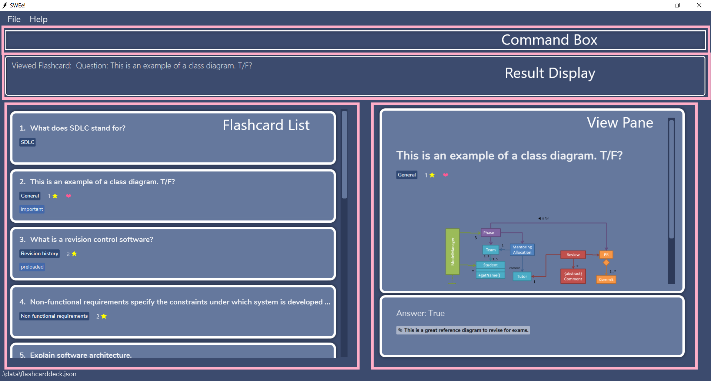
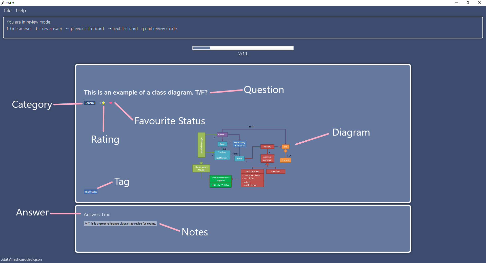
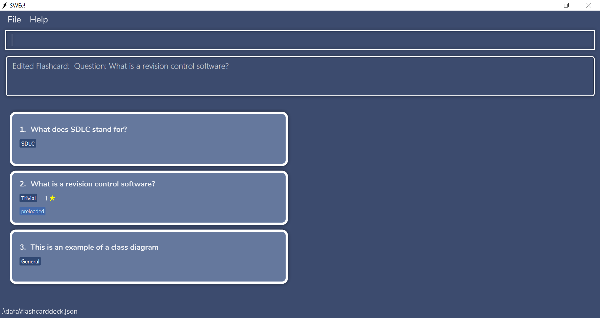
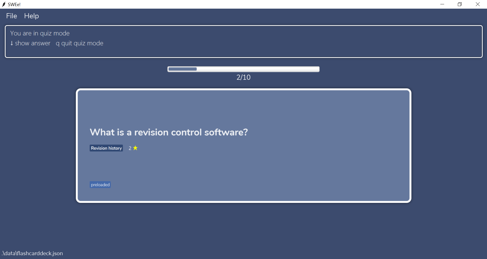

SWEe! is a  **desktop app for CS2103T students to manage their learning progress mainly through flashcards**. It is optimized for CLI users so that frequent tasks can be done faster by typing in commands. If you can type fast, SWEe! can create your CS2103T flashcards faster than traditional GUI apps.

* Table of Contents
    - [Quick start](#quick-start)
    - [Application layout](#application-layout)
    - [Notes about the command format](#notes-about-the-command-format)
    - [Common Input Fields](#common-input-fields)
    - [Features](#features)
        - [Add a flashcard](#add-a-flashcard--add): `add`
        - [Clear all flashcards](#clear-all-flashcards--clear): `clear`
        - [Delete a flashcard](#delete-a-flashcard---delete): `delete`
        - [Edit a flashcard](#edit-a-flashcard---edit): `edit`
        - [Filter for flashcards](#filter-for-flashcards---filter): `filter`
        - [Favourite a flashcard](#favourite-a-flashcard---fav) : `fav`
        - [Unfavourite a flashcard](#unfavourite-a-flashcard---unfav): `unfav`
        - [Find flashcards](#find-flashcards--find): `find`
        - [View help](#view-help--help): `help`
        - [List all flashcards](#list-all-flashcards--list): `list`
        - [Review flashcards](#review-flashcards-review) : `review`
        - [Quiz flashcards](#quiz-flashcards-quiz): `quiz`
        - [Sort all flashcards](#sort-all-flashcards--sort): `sort`
        - [View a flashcard](#view-a-flashcard---view): `view`
        - [View the statistics of a flashcard](#view-the-statistics-of-flashcard-stats): `stats`
        - [Exit the program](#exit-the-program--exit): `exit`
        - [Saving the data](#saving-the-data)
    - [FAQ](#faq)
    - [Command summary](#command-summary)
        

--------------------------------------------------------------------------------------------------------------------

## Quick start

1. Ensure you have Java `11` or above installed in your Computer.

2. Download the latest `swee.jar` from [here](https://github.com/AY2021S1-CS2103T-T17-2/tp/releases).

3. Copy the file to the folder you want to use as the _home folder_ for SWEe!.

4. Double-click the file to start the app. The GUI similar to the image below should appear in a few seconds. Note how the app contains some sample data.  
    
    

    
5. Type the command in the command box and press Enter to execute it. 
   Some example commands you can try:

   * **`add q/What does OOP stand for? a/Object Oriented Programming c/General`** : Adds a flashcard with a question and answer into the General category.

   * **`delete 3`**: Deletes the 3rd flashcard in the current list.
   
   * **`list`** : Lists all flashcards.

   * **`review`** : Reviews the current list of flashcards.
   
   * **`view 1`** : Views the 1st flashcard in the current list.

   * **`exit`** : Exits the app.
  
6. Refer to the [Features](#features) below for details of each command.

## Application layout

The figures below show the annotated version of the graphic user interface. This will help you better identify the various sections and elements in the application, as well as understand the technical terms stated in this documentation.

--------------------------------------------------------------------------------------------------------------------

## Notes about the command format

This section will give you some useful information about the various command formats and notations you will see in [Features](#features).

* Words in UPPER_CASE are the parameters to be supplied by the user. 
  eg. in `add q/QUESTION`, `QUESTION` is a parameter which can be used as `add q/What is my name?`

* Items in angle brackets `<>` are either/or options. Each option is delineated by a `|` . 
  eg. `<success|reviewed>` can be used as either `success` or `reviewed` but not both.

* Words in lower_case are to be specified exactly. 
  eg. in `sort <success|reviewed>`, `success` and `reviewed` must be specified exactly.

* Items in square brackets are optional (zero or one instance). 
  eg. `q/QUESTION [c/CATEGORY]` can be used as `q/What is my name?` or as `q/What is my name? c/topic 1`

* Items in square brackets with trailing ellipsis are optional (zero, one or multiple instances). 
  eg. `q/QUESTION [t/TAG]...` can be used as `q/What is my name?`, `q/What is my name? t/topic1` or
  `q/What is my name? t/topic1 t/fun` 
  Multiple instances of the tag prefix is accepted, and the app will read every instance
    in the input. 

* Multiple instances of the same prefix/flag will not throw an error. However, the app will only read the **last instance** in the input (except for tags). 
  eg. `add q/Are apples red? a/Yes c/fruit c/test` will add a flashcard belonging to "test" category 
  eg. `sort reviewed -a -a -d` will sort flashcards according to review frequency in **descending** order 
  eg. `filter f/yes f/no` will filter and list flashcards that are not favourited.
  
* Parameters can be in any order. 
  eg. Specifying `q/QUESTION a/ANSWER` or `a/ANSWER q/QUESTION` are both acceptable.
  
* All additional input after commands which do not have input fields such as `list`, `exit`, `clear`, `help`, `review`, `quiz` will be ignored. 
  eg. `list` and `list 123` will have the same effect.

* Flags such as `-a` and `-d` allow white spaces within them. 
  eg. `sort success -   a` is valid and will sort flashcards by success rate in ascending order. 
  eg. `view 1 -  a` is valid and will view the first flashcard in the displayed flashcard list with answer shown.

* Prefixes and flags are both case sensitive. 
  eg. `q/` is not the same as `Q/` 
  eg. `-a` is not the same as `-A`

## Common Input Fields

This section will help you understand the different fields you will see in [Features](#features). It gives an overview of what they are, how to specify them and any restrictions.

#### General Notes about Input Fields:
* **Can be empty**  means you can specify the prefix but not pass a value. eg. passing `r/` is valid.
* **Cannot be empty** means you have to specify a value when you specify the prefix. eg. passing `c/` is invalid.
* All input fields should not contain other input prefixes. eg. passing in `What is c/?` as a `QUESTION` to `q/QUESTION` is not supported.

 

Input Field | Restrictions and how to specify
-----------|-----------------------
`q/QUESTION`    | This is the question on the flashcard. `QUESTION` has no character limit or restrictions (eg. can have spaces). Cannot be empty.
`a/ANSWER`      | This is the answer on the flashcard. `ANSWER` has no character limit or restrictions (eg. can have spaces). Cannot be empty.
`c/CATEGORY`    | This is the category of the flashcard. `CATEGORY` must be alphanumeric and have a maximum of 50 characters. It can consist of multiple words but there should only be 1 space between words. Cannot be empty.
`r/RATING`      | This is the star rating of the flashcard. `RATING` must be a number between 1 and 5 inclusive. Can be empty.
`d/DIAGRAM`     | This is the diagram of the flashcard (associated with a question in the view pane). `DIAGRAM` must be a valid relative or absolute path to a file.  Currently only supports file path **without** spaces.  eg. image/umlDiagram.png is supported but image/u mlDiagram.png is not supported  Only supports the following image file types: jpg, png, jpeg, bmp  Can be empty.
`n/NOTE`        | This is the notes of the flashcard (associated with an answer in the view pane). `NOTE` has no character limit or restrictions. Can be empty.
`t/TAG`         | These are tags of the flashcard. A flashcard can have more than one tag. `TAG` must be alphanumeric and have a maximum of 50 characters. Must **only** be one word. Cannot be empty.
`INDEX`         | `INDEX` refers to the index number shown in the displayed flashcard list. Every visible flashcard on the display list has an `INDEX`. `INDEX` must be a positive integer **greater than 0**. eg. 1, 2, 3, …
`KEYWORD`       | `KEYWORD` can be alphanumeric or punctuations. `KEYWORD` has no character limit but there should be no spaces within the keyword. 

## Features

### Add a flashcard : `add`

Adds a flashcard.

Format: `add q/QUESTION a/ANSWER [c/CATEGORY] [r/RATING] [n/NOTE] [d/DIAGRAM] [t/TAG]...`

* Refer to [common input fields](#common-input-fields) on what the different fields are and how to specify them.
* After a new flashcard is added, all flashcards will be listed. 

:bulb: **Tip:** If the category is not specified, the flashcard will have the <b>General</b> category.

Examples:
* `add q/What does OOP stand for? a/Object Oriented Programming`
* `add q/What does OOP stand for? a/Object Oriented Programming r/3 t/cool`
* `add q/What does OOP stand for? a/Object Oriented Programming c/Super Important n/Important question!`
* `add q/What does OOP stand for? a/Object Oriented Programming d/images/diagram.png`
* `add q/What does OOP stand for? a/Object Oriented Programming c/UML n/Important question! d/images/diagram.png`

**Steps for adding a flashcard with diagram**:

**Step 1**: Locate the relative file path of the image file. In this example, our file path is `images/classDiagramExample1.png` 

Root folder containing the jar file        |  Image directory
:-------------------------:|:-------------------------:
 |  

**Step 2**: Type the command `add q/This is an example of a class diagram a/True d/image/classDiagramExample1.png` and press Enter. Remember to include the file extension in `DIAGRAM`

**Step 3**: The flashcard is added to the list.

### Clear all flashcards : `clear` 

Clears all flashcard data from the program.

Format: `clear`

### Delete a flashcard  : `delete`

Deletes the specified flashcard.

Format: `delete INDEX`

* Deletes the flashcard at the specified `INDEX`. The `INDEX` refers to the index number shown in the displayed flashcard list.
* `INDEX` must be a positive integer **greater than 0**. eg. 1, 2, 3, …

Examples:
*  `list` followed by `delete 2` deletes the 2nd flashcard in the flashcard list.

### Edit a flashcard  : `edit`

Edits a flashcard.

Format: `edit INDEX [q/QUESTION] [a/ANSWER] [c/CATEGORY] [n/NOTE] [r/RATING] [d/DIAGRAM] [t/TAG]...`

* Edits the flashcard at the specified `INDEX`. The `INDEX` refers to the index number shown in the displayed flashcard list.
* Refer to [common input fields](#common-input-fields) on what the different fields are and how to specify them.
* Although all fields are optional, a minimum of one field has to be given.
* Specifying empty values to `NOTE`, `RATING`, `TAG` or `DIAGRAM` eg. `r/` will remove the corresponding field in the flashcard.
* Although `QUESTION`, `ANSWER` and `CATEGORY` are optional values, you are not allowed to specify an empty value to those attributes 
once the prefix is declared e.g. `c/` is not allowed and will not remove category.

Examples:
* `edit 3 q/What does OOP stand for? a/Object Oriented Programming c/General`
* `edit 3 q/What does OOP stand for? a/Object Oriented Programming`
* `edit 3 n/Important question! r/`

**Steps for editing a flashcard's category and rating**:

**Step 1**: Locate the flashcard you wish to edit. In this example, we want to edit the flashcard at index 2.

**Step 2**: We want to edit the category of the flashcard to Trivial and rating to 1. Type the command `edit 2 c/Trivial r/1` and press Enter.

**Step 3**: The flashcard's category and rating are edited to Trivial and 1 respectively.

### Filter for flashcards  : `filter`

Filters for specific flashcard(s) based on the field input(s) by the user. 
This will return all the flashcards whose fields match all the fields specified by the user.

Format: `filter [c/CATEGORY] [r/RATING] [f/<yes|no>] [t/TAG]...`

* Filters the specified flashcard based on category, rating, favourite status or tags.
* Refer to [common input fields](#common-input-fields) on what the different fields are and how to specify them.
* Specifying `f/yes` filters for favourited flashcards while `f/no` filters for unfavourited flashcards.
* Supports filtering of one or more different fields. For example:
    - `filter c/SDLC r/5` will filter out flashcards belonging to the SDLC category with a rating of 5.
* Although all fields are optional, a minimum of one field has to be given.

:memo: Note:
<code>filter r/</code> will filter for all unrated flashcards.

:bulb: **Tip:** Want to list all your flashcards after using `filter`? Use the [list](#list-all-flashcards--list) command.

 

Examples:
*  `filter c/SDLC` filters and lists all flashcards belonging to the SDLC category.
*  `filter t/examinable t/study` filters and lists all flashcards that have both an “examinable” tag and a “study” tag.
*  `filter r/3 f/yes` filters and lists all favourited flashcards that have a rating of 3.
*  `filter f/no f/yes c/General` filters and lists all favourited flashcards that belong to the General category.
    (only last instance of f/ is read)

**Steps for filtering for a flashcard based on category and tag**:

**Step 1**: We want to filter for a flashcard which has a Trivial category and contains the preloaded tag. Type the command `filter c/Trivial t/preloaded` and press Enter.

**Step 2**: The flashcard with the category Trivial and tag field preloaded is shown.

### Favourite a flashcard  : `fav`

Favourites the specified flashcard.

Format: `fav INDEX`

* Favourites the flashcard at the specified `INDEX`. The `INDEX` refers to the index number shown in the displayed flashcard list.
* `INDEX` must be a positive integer **greater than 0**. eg. 1, 2, 3, …

Examples: 
* `list` followed by `fav 2` favourites the 2nd flashcard in the displayed flashcard list.

### Unfavourite a flashcard  : `unfav`

Unfavourites the specified flashcard.

Format: `unfav INDEX`

* Unfavourites the flashcard at the specified `INDEX`. The `INDEX` refers to the index number shown in the displayed flashcard list.
* `INDEX` must be a positive integer **greater than 0**. eg. 1, 2, 3, …

Examples: 
* `list` followed by `unfav 2` unfavourites the 2nd flashcard in the displayed flashcard list.

### Find flashcards : `find`

Searches for all flashcards matching any of the search keywords.

Format: `find KEYWORD [KEYWORD]...`
* Finds all flashcards containing any of the keywords.
* Refer to [common input fields](#common-input-fields) on how to specify the different fields.
* The keywords are **case insensitive**.
* Keywords will match as long as they are contained within any flashcard’s question/answer/category/note/tags. eg. `UML` keyword will match a flashcard with a `category` called `UML-Diagram`

:bulb: **Tip:** Want to list all your flashcards after using `find`? Use the [list](#list-all-flashcards--list) command.

 

Examples: 
* `find general` displays all flashcards containing the word general.
* `find general important` displays all flashcards containing either the word general and/or important.
* `find GENERAL object` displays all flashcards containing either the word general and/or object.
* `find -` displays all flashcards containing "-".

### View help : `help`

Opens a window with a link that directs you to our user guide.

Format: `help`

### List all flashcards : `list`

Shows a list of all flashcards. This is useful for removing any `filter` or `find` you have done on the flashcard list.

Format: `list`

### Review flashcards: `review`

Reviews the current list of flashcards. This puts the user in review mode and the user can no 
longer input commands to the textbox.

Format: `review`

Upon entering review mode, the following user input will be recognised:
* `↓ key` shows answer and notes of the current flashcard  
* `↑ key` hides answer and notes of the current flashcard  
* `→ key` moves on to the next flashcard (if there is a next flashcard)
* `← key` moves to the previous flashcard (if there is a previous flashcard)
* `q` quits review mode

:memo: Note:
The review and success frequency of a flashcard is <b>not affected</b> by review mode.

 

**Steps for entering review mode**:

**Step 1**: We want to enter review mode to review our flashcards. Type the command `review` and press Enter.

**Step 2**: We are brought into review mode. The instructions on how to navigate review mode will be shown at the top.

**Step 3**: In this example, we will demonstrate the behaviour of the `↓ key`. Upon pressing the `↓ key`, the answer of the flashcard is shown.

### Quiz flashcards: `quiz`

Quizzes the current list of flashcards. This puts the user in quiz mode and the user can no longer input commands to the textbox.

Format: `quiz`

Upon entering quiz mode, the following user input will be recognised:
* `↓ key` shows answer and notes of the current flashcard  
* `q` quits quiz mode
* `y` This input will only be recognised after the `↓ key` is pressed. `y` is a feedback to indicate a correct answer. 
* `n` This input will only be recognised after the `↓ key` is pressed. `n` is a feedback to indicate an incorrect answer. 

Upon pressing the `↓ key`, the user will be prompted if they got the answer correct. The user can then press 
`y` to feedback that they got the correct answer or `n` to feedback that they got an incorrect answer.  

The quiz mode works in conjunction with the [statistics](#view-the-statistics-of-flashcard-stats) feature. Quiz attempts are recorded and information about the success frequency can be displayed using the [statistics](#view-the-statistics-of-flashcard-stats) feature.
* Pressing `y` will increase the review and success frequency of the flashcard.
* Pressing `n` will increase the review frequency of the flashcard.

:memo: Note: Once the user presses <code>y</code> or <code>n</code>, the review and success frequency of the flashcard is updated accordingly even if the user quits the quiz prematurely.

 

**Steps for entering quiz mode**:

**Step 1**: We want to enter quiz mode to test ourselves on the current list of flashcards. Type the command `quiz` and press Enter.

**Step 2**: We are brought into quiz mode. The instructions on how to navigate quiz mode will be shown at the top.

**Step 3**: In this example, we will demonstrate the behaviour of the `↓ key`. Upon pressing the `↓ key`, we will be prompted if we got the answer correct.

**Step 4**: We got this answer correct so we will press `y`. This will automatically bring us to the next flashcard.

### Sort all flashcards : `sort`

Sorts all flashcards according to the criteria given.

Format: `sort <success|reviewed> <-a|-d>`

* Specifying `-a` means sorting by the criteria in ascending order.
* Specifying `-d` means sorting by the criteria in descending order.

Examples: 
* `sort reviewed -a` shows a list of current flashcards sorted according to review frequency in ascending order
* `sort reviewed -d` shows a list of current flashcards sorted according to review frequency in descending order
* `sort success -a` shows a list of current flashcards sorted according to success rate in ascending order
* `sort success -d` shows a list of current flashcards sorted according to success rate in descending order

:memo: Note: The review frequency of a flashcard refers to the number of times you review in <b>quiz mode</b>, and the success rate refers to the rate at which you get the question correct in <b>quiz mode</b>.

:memo: Note: The review and success frequencies of a flashcard are <b>only affected by quiz mode</b>, not review mode. So you can think of review mode as a trial that <b>does not affect</b> the statistics of the flashcard.

:memo: Note: Sorting results in a permanent change in the ordering of the flashcards. This means your list of flashcards will follow the sorted order even after you relaunch the app.

### View a flashcard  : `view`

Views the specified flashcard. A "snapshot" of the flashcard is taken and displayed in the view pane to the user.

Format: `view INDEX [-a]`

* Views the flashcard at the specified `INDEX`. The `INDEX` refers to the index number shown in the displayed flashcard list.
* `INDEX` must be a positive integer **greater than 0**. eg. 1, 2, 3, …
* If `-a` is specified, the answer and notes of the flashcard will be shown too.

Examples:
* `view 1` shows the 1st flashcard (in the displayed flashcard list) on the view pane without answer and notes.
* `view 1 -a` shows the 1st flashcard (in the displayed flashcard list) on the view pane with answer and notes.

:memo: Note: Once another command is executed, the view pane will be returned to a blank state even if the shown
flashcard was not modified/deleted.

 

**Steps for viewing a specific flashcard**:

**Step 1**: Locate the flashcard you wish to view. In this example, we want to view the flashcard at index 3. Type the command `view 3` and press Enter.

**Step 2**: We will be presented with a "snapshot" of the flashcard at index 3 in the view pane.

**Step 3**: To view the answer and notes (if applicable) of the flashcard on the view pane. Type the command `view 3 -a` and press Enter.

**Step 4**: The answer of the flashcard is displayed on the view pane.

### View the statistics of flashcard : `stats`

View the statistics of a flashcard.

Format: `stats INDEX`

* Shows the statistics of the flashcard at the specified `INDEX`. The `INDEX` refers to the index number shown in the displayed flashcard list.
* `INDEX` must be a positive integer **greater than 0**. eg. 1, 2, 3, …

Example:
* `stats 1` shows the statistics of the 1st flashcard (in the displayed flashcard list) on the view pane.

The statistics feature works in conjunction with the [quiz](#quiz-flashcards-quiz) feature.

The following information will be displayed on the view pane:
* Question of the flashcard (may be truncated for brevity).
* Reviewed count of the flashcard.
* Correct count of the flashcard.
* Pie chart to show the graphical representation of correct attempts vs wrong attempts in quiz mode of the flashcard. (No pie chart will be shown if the flashcard has not been reviewed.)

:memo: Note: Once another command is executed, the view pane containing the statistics will be returned to a blank state even if the shown
flashcard was not modified/deleted.

 

**Steps for viewing the statistics of a specific flashcard**:

**Step 1**: Locate the flashcard you wish to view the statistics of. In this example, we want to view the statistics of the flashcard at index 1. Type the command `stats 1` and press Enter.

**Step 2**: The statistics of the flashcard at index 1 will be displayed in the view pane.

### Exit the program : `exit`

Exits the program.

Format: `exit`

### Saving the data

Flashcards data are saved in the hard disk automatically after any command that changes the data. There is no need to save manually.

--------------------------------------------------------------------------------------------------------------------

## FAQ

**Q**: What does it mean if some action is **not supported**? 
**A**: It means that our app is not intended to allow said action to work although it may work under certain circumstances.
If you still want to perform the action, do take note that you may face unintended or unexplained behaviour.

**Q**: What is the difference between review mode and quiz mode? 
**A**: Review mode is like a sandbox mode where you can move back and forth between flashcards. In quiz mode, you can only go forward. Also, quiz mode asks you for feedback and keeps track of statistics but review mode doesn't.

**Q**: Are success frequency and correct count of a flashcard the same thing? 
**A**: Yes. They both refer to how many times you answered with `y` in quiz mode for the flashcard.

**Q**: Why doesn't review mode affect review frequency/count of a flashcard? 
**A**: We know the naming may be a little bit confusing but just keep in mind that review mode does **not** affect the statistics (success, review frequency) of a flashcard. Only quiz mode does!

**Q**: What is the success rate of a flashcard? 
**A**: Success rate of a flashcard is measured by `(success frequency) / (review frequency) x 100%`. If a flashcard has a review frequency of 0, then its success rate will be 0%.

--------------------------------------------------------------------------------------------------------------------

## Command summary

Action | Format, Examples
--------|------------------
**Add** | `add q/QUESTION a/ANSWER [c/CATEGORY] [n/NOTE] [r/RATING] [d/DIAGRAM] [t/TAG]...`   eg. `add q/What does OOP stand for? a/Object Oriented Programming c/General n/Important question! d/images/diagram.jpeg`
**Clear** | `clear`
**Delete** | `delete INDEX`   eg. `delete 3`
**Edit** | `edit INDEX [q/QUESTION] [a/ANSWER] [c/CATEGORY] [n/NOTE] [r/RATING] [d/DIAGRAM] [t/TAG]...`   eg. `edit 3 q/What does OOP stand for? a/Object Oriented Programming`
**Filter** | <code>filter [c/CATEGORY] [r/RATING] [f/<yes&#124;no>] [t/TAG]...</code>   eg. `filter t/examinable r/3`
**Fav** | `fav INDEX`   eg. `fav 1`
**Unfav** | `unfav INDEX`   eg. `unfav 1`
**Find** | `find KEYWORD [KEYWORD]...`    eg. `find general important`
**Help** | `help`
**List** | `list`
**Review** | `review`
**Quiz** | `quiz`
**Sort** | <code>sort <success&#124;reviewed> <-a&#124;-d></code>   eg. `sort success -a`
**View** | `view INDEX [-a]`   eg. `view 1`
**Stats** | `stats INDEX`   eg. `stats 3`
**Exit** | `exit`
