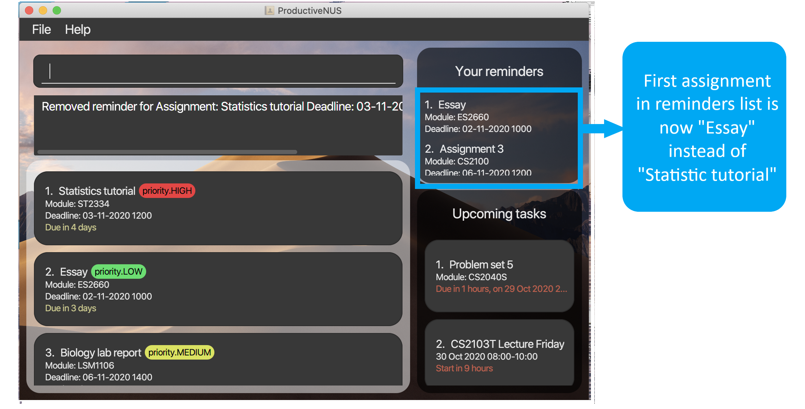

## Introduction
Welcome to ProductiveNUS User Guide! :blue_book:

**ProductiveNUS is a desktop application** made for you, **a School of Computing (SoC) student in National University of Singapore (NUS)**, to **manage and schedule your academic tasks more effectively**. It makes use of a **Graphical User Interface (GUI)**, which provides you with an intuitive interface and immediate visual feedback. ProductiveNUS uses a **Command Line Interface (CLI)**; this means that you operate the application by typing commands into a [Command line](#gui-terminologies). If you are fast at typing, you can manage your academic tasks more efficiently.

As a **student from the SoC in NUS**, you tend to have a **heavy workload**. ProductiveNUS helps **improve your productivity** by **enhancing your organisational skills**. Apart from simply **keeping track of your tasks**, ProductiveNUS is capable of **scheduling** them for you so you will never **miss any deadlines**. ProductiveNUS is also compatible with NUSMods, meaning all your **timetable information can be imported easily** into the application so all your academic tasks can be found in just one application.

--------------------------------------------------------------------------------------------------------------------

## Table of Contents

* Table of Contents
{:toc}

--------------------------------------------------------------------------------------------------------------------

## About
This user guide provides you with the necessary information on how to become an expert user of ProductiveNUS. 
You can familiarize yourself with the terminologies, syntax and icons used in this user guide by reading the following sub-sections.  

### GUI terminologies
The figure below shows the GUI of ProductiveNUS, with its components labelled. 

### Icon usages
Wondering what each icon is used for? You can refer to the table below to find out.

| Icon        | Icon usage                                             | Box color |
|-------------|--------------------------------------------------------|-----------|
| :clipboard: | - Notes about the command format - Pointers to note | Blue      |
| :bulb:      | - Tip                                                  | Green     |

### Command syntax and terminologies

All commands and their examples are demarcated with `markups`. `Markups` appear as a grey box as shown.

You can find out more about the command terminologies here:

* Prefix: An indicator to identify your input.

--------------------------------------------------------------------------------------------------------------------

## Getting started

1. Ensure you have Java `11` or above installed in your Computer.

1. Download the latest `productivenus.jar` from [here](https://github.com/AY2021S1-CS2103T-F11-3/tp/releases).

1. Copy the file to the folder you want to use as the _home folder_ for ProductiveNUS.

1. Double-click the file to start the app. The GUI similar to the below should appear in a few seconds. Note how the app contains some sample data. 

   

1. Refer to the [Features](#features) below for details of each command.

--------------------------------------------------------------------------------------------------------------------

## Features

**:clipboard: Notes about the command format:** 

* Words in `UPPER_CASE` are the parameters to be supplied by you. 
  e.g. in `add n/NAME_OF_ASSIGNMENT`, `NAME_OF_ASSIGNMENT` is a parameter which can be used as `add n/Assignment 2`.

* Items in square brackets are optional. 
  e.g `n/NAME_OF_ASSIGNMENT [remind]` can be used as `n/Assignment 2 remind` or as `n/Assignment 2`.

* Parameters can be in any order. 
  e.g. if the command specifies `n/NAME_OF_ASSIGNMENT d/DEADLINE`, `d/DEADLINE n/NAME_OF_ASSIGNMENT` is also acceptable.
  
* All instances of `INDEX` **must be a positive integer**. 
  e.g. 1, 2, 3, …​

### Adding an assignment: `add`

Format: `add n/NAME_OF_ASSIGNMENT d/DEADLINE_OF_ASSIGNMENT TIME_ASSIGNMENT_IS_DUE mod/MODULE​ [remind]`

   
**:bulb: Tip:**
You can include `remind` when adding an assignment instead of using the `remind` command to set reminders after adding an assignment.

Examples:
* `add n/Lab report 3 d/23-04-2020 1230 mod/CS2100`
* `add n/Tutorial 2 d/29-06-2020 1400 mod/CS2100 remind`

### Deleting assignments : `delete`

Format: `delete INDEX [MORE_INDEXES]`

You can delete assignments from your assignment list by specifying the assignment `INDEX` as shown in your list.

You can delete **one or more** assignments at a time. Here is an example with steps to follow:

1) To delete assignments with the name "Statistics tutorial" and "Biology lab report" as shown in the figure below, you can simply enter `delete 1 3` into the command line as per their indexes that are circled and labelled in the figure.

DIAGRAM

2) The two assignments are no longer displayed and are successfully deleted from your assignment list. 
3) A "Deleted assignments" message that includes the information of your deleted assignments will be displayed in the Command Box.

DIAGRAM

Examples:
* `delete 1`
* `delete 2 3 1`

 **:clipboard: Pointers to note:** 
* At least one index must be **present**. For example, `delete` without any index will not work.
* The indexes **must be found in your assignment list**.
* The indexes **must not be duplicated**. For example, `delete 3 3` will not work.

### Importing your timetable : `import`

Format: `import url/YOUR_NUSMODS_URL`

You can import your NUSMods timetable data into ProductiveNUS by providing the URL to your NUSMods timetable share
link. Imported lesson information can be found in the `Upcoming tasks`.
 
Follow these steps and try importing your timetable:

1) At your NUSMods timetable website, click on the "Share/Sync" button to obtain your timetable share link URL.

   
   *Figure X: The "Share/Sync" at the NUSMods website highlighted in green*

2) The URL obtained will be `YOUR_NUSMODS_URL` to be used in the import command.

3) Added lesson information can be found in your task list.

   
   *Figure X: Added lesson information can be found in the `Upcoming tasks` list highlighted in red*

 **:clipboard: Pointers to note:** 
* Importing a new timetable will override your previous timetable data.

Example:
* `import url/https://nusmods.com/timetable/sem-1/share?CS2100=TUT:01,LAB:11,LEC:1&CS2101=&CS2103T=LEC:G16&CS2105=TUT:14,LEC:1&EC1301=TUT:S28,LEC:1&IS1103=` will 

### Listing assignments : `list`

Format: `list [NUMBER_OF_DAYS]`

You can list all your assignments with `list`. Alternatively, you can type `list` followed by an index `NUMBER_OF_DAYS` to list your assignments with deadlines that fall within the current date (and time) and `NUMBER_OF_DAYS` later (in number of hours).

For example, `list 3` lists all your assignments that are due within 3 days (72 hours) from the current date (and current time). If the current date and time is 24/10/2020 1200, all assignments due within this date and time to 27/10/2020 1200 will be displayed.

DIAGRAM

**:bulb: Tip:**
You can use this `NUMBER_OF_DAYS` index to quickly view assignments that you need to complete soon!

More examples: 
- `list`
- `list 7`
 

 **:clipboard: Pointers to note:** 
* `NUMBER_OF_DAYS` **must be a positive integer** 1, 2, 3, …​
* **Only one** number can be keyed in. For example, `list 1 2` will not work. 

### Finding assignments : `find`

Format: `find PREFIX/ KEYWORD [MORE_KEYWORDS]`

You can find your assignments based on keywords you enter. The types of keywords are the name, module code, deadline and priority of assignments. 

This is the table of prefixes used:

| Prefix | Syntax | Examples |
|-|-|-|
| n/ | n/NAME_OF_ASSIGNMENT [MORE NAME_OF_ASSIGNMENT] | - n/Tutorial - n/tutorial essay |
| mod/ | mod/MODULE_CODE [MORE MODULE_CODE] | - mod/ST2334 - mod/CS2100 cs2103t |
| d/ | d/DATE_OR_TIME_OF_ASSIGNMENT [MORE DATE_OR_TIME_OF_ASSIGNMENT] | - d/24-10-2020  - d/1200 - d/1300 25-11-2020 |
| p/ | p/PRIORITY_OF_ASSIGNMENT [MORE PRIORITY_OF_ASSIGNMENT] | - p/high - p/LOW |

 **:clipboard: Pointers to note:** 
Date keywords are irrespective of time  and time keywords are irrespective of date. For example, find d/1300 25-11-2020 will list assignments with due date of 25-11-2020 (regardless of time) and with due time of 1300 (regardless of date).

Here is an example with steps to follow:

1) To find assignments from the modules CS2100 and ST2334, you can simply key in `find mod/CS2100 ST2334`. 

DIAGRAM

2) Assignments from the modules CS2100 and ST2334 will appear in the assignment list.
3) A "listed your assignments" message will be displayed in the command box.

DIAGRAM

 **:clipboard: Pointers to note:** 
* `DATE_OR_TIME_OF_ASSIGNMENT` has date in the format **dd-MM-yyyy** and time in the format **HHmm** (24 hour).
* You can only **find assignments with keywords of the same prefix**. For example, `find n/Assignment d/23-10-2020` will not work.

### Setting reminders for assignments : `remind`

Format: `remind INDEX [MORE_INDEXES]`

You can set reminders for specific assignments which will be displayed in `Your Reminders` (Highlighted in red in the figure below) for your easy referral.

   
   *Figure X: `Your Reminders` highlighted in red*

You can use the `INDEX` of the assignment as shown in your assignment list to set reminders for that assignment. 

For example, `remind 1` will set reminders for the first assignment in your assignment list ("Statistics tutorial" as shown in the Figure X) and adds it to `Your Reminders` (Figure X).

   
   *Figure X: Before "Statistics tutorial" is added into `Your Reminders`*
      
   
   *Figure X: "Statistics tutorial" (highlighted in red) is added into `Your Reminders`*

You can set reminders for **more than one** assignments at a time as well. 

For example, `remind 2 4` will set reminders for the second and fourth assignment in your assignment list ("Essay" and "Assignment 3" respectively as shown in Figure X) and adds both assignments to `Your Reminders` (Figure X).

   
   *Figure X: Before "Essay" and "Assignment 3" are added into `Your Reminders`*
      
   
   *Figure X: "Essay" and "Assignment 3" (highlighted in red) are added into `Your Reminders`*

  
**:clipboard: Pointers to note:** 
* At least one `INDEX` must be present. For example, `remind` will not work.
* The `INDEX` must be found in your assignment list.

### Removing reminders for assignments : `unremind`

Format: `unremind INDEX`

You can remove your reminded assignments from `Your Reminders` by specifying the `INDEX` of the assignment as shown in your **reminded assignments list**. 

For example, `unremind 1` will remove the first assignment in `Your Reminders` ("CS2106 Lab" as shown in the figure below).

   
   *Figure X: Before "Statistics tutorial" (highlighted in red) is removed from `Your Reminders`*
      
   
   *Figure X: "Statistics tutorial" is removed from`Your Reminders`*

  
**:clipboard: Pointers to note:** 
* At least one `INDEX` must be present. For example, `unremind` will not work.
* The `INDEX` must be found in `Your Reminders`.

### Setting priority for assignments : `prioritize`

Format: `prioritize INDEX p/PRIORITY`

You can set priority levels for assignments based on their urgency. Assignments tagged with a priority level will be
shown with a coloured priority tag (As shown highlighted in red in the figure below).

   
   *Figure X: The priority tags of assignments highlighted in red*

You can use the `INDEX` of the assignment as shown in your assignment list to set priority tag for that assignment.

For example, `prioritize 1 p/LOW` will set a low priority tag for the first assignment in your assignment list.

  
**:clipboard: Pointers to note:** 
* The `INDEX` must be found in your assignment list.
* Priority levels you can use are `LOW`, `MEDIUM` and `HIGH`.
* If the assignment already has a priority tag, this command will replace the previous priority tag with the new one.

### Removing priority for assignments : `unprioritize`

Format: `unprioritze INDEX`

You can remove a priority tag from an assignment that has a priority tag by specifying the `INDEX` of the assignment
you wish to have the priority tag removed.

For example, `unprioritize 1` will remove the priority tag, if present, of the first assignment in your assignment list.

  
**:clipboard: Pointers to note:** 
* At least one `INDEX` must be present. For example, `remind` will not work.
* The `INDEX` must be found in your assignment list.

### Marking assignments as done : `done`

Marks the specified assignment as done.

Format: `done INDEX`

* Marks the assignment at the specified `INDEX` as done.
* The index refers to the index number shown in the displayed assignment list.

### Marking assignments as not done : `undone`

Marks the specified assignment as not done.

Format: `undone INDEX`

**Tip:**
Assignments are marked as not done by default.

* Marks the assignment at the specified `INDEX` as not done.
* The index refers to the index number shown in the displayed assignment list.

### Exiting the program : `exit`

Exits the program.

Format: `exit`

### Saving the data

ProductiveNUS data are saved in the hard disk automatically after any command that changes the data. There is no need to save manually.

--------------------------------------------------------------------------------------------------------------------

## Command summary

| Action | Format | Examples |
|-|-|-|
| **add** | `add n/NAME_OF_ASSIGNMENT d/DEADLINE_OF_ASSIGNMENT TIME_ASSIGNMENT_IS_DUE mod/MODULE [remind]` | `add n/Math tutorial d/21-03-2020 1100 mod/ST2334` |
| **delete** | `delete INDEX [MORE_INDEXES]` | `delete 3` `delete 2 3 4` |
| **import** | `import url/NUSMODS_URL` | `import url/https://nusmods.com/timetable/sem-2/share?CS2108=LEC:1` |
| **list** | `list [NUMBER_OF_DAYS]` | `list 2` `list` |
| **find** | `find PREFIX/ KEYWORD [MORE_KEYWORD]` | `find mod/CS2103T CS2100` `find p/HIGH` |
| **remind** | `remind INDEX [MORE_INDEXES]` | `remind 5` `remind 2 4 5` |
| **unremind** | `unremind INDEX` | `unremind 2` |
| **prioritize** | `prioritize INDEX p/PRIORITY` | `prioritize 3 p/HIGH` `prioritize 1 p/LOW` |
| **unprioritize** | `unprioritize INDEX` | `unprioritize 1` |
| **done** | `done INDEX` | `done 4` |
| **undone** | `undone INDEX` | `undone 2` |
| **help** | `help` | `help` |
| **exit** | `exit` | `exit` |

--------------------------------------------------------------------------------------------------------------------

## FAQ

**Q**: How do I transfer my data to another Computer? 
**A**: 
1. Install the app in your other computer and start the app.
2. Notice that a data file named `addressbook.json` is created under the `/data` folder.
3. Close the app in your other computer.
4. Overwrite the newly created data file with the data file from your previous computer.
5. All your existing data has been successfully transferred!
