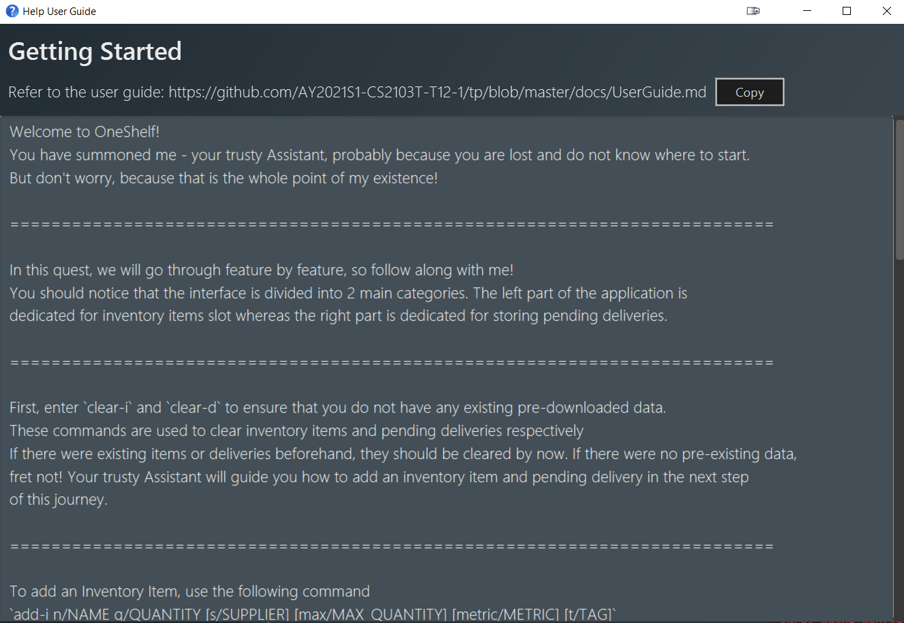
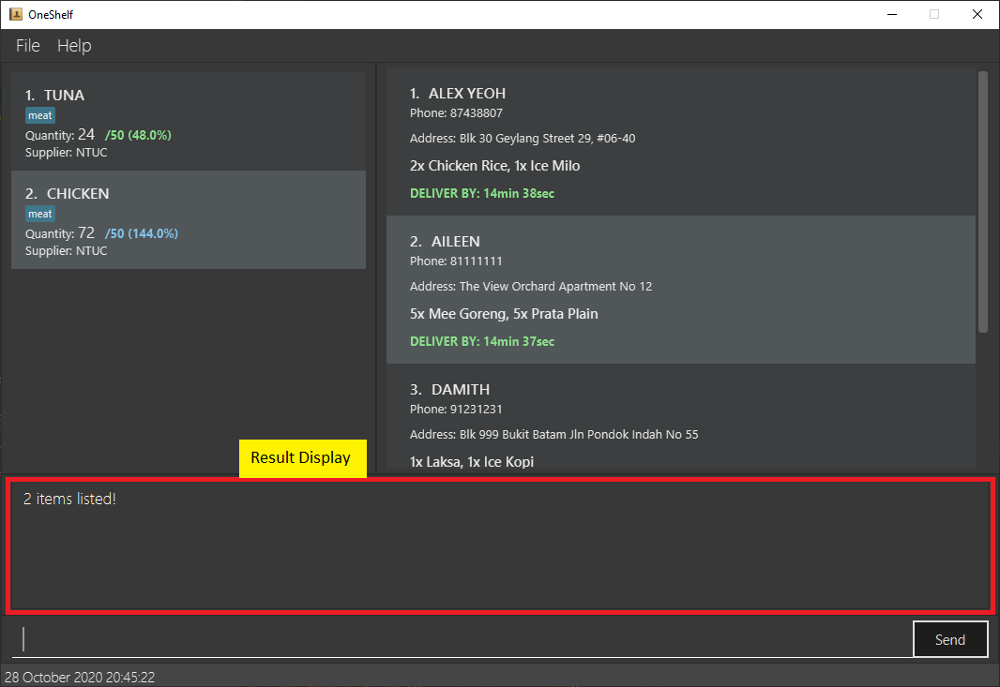
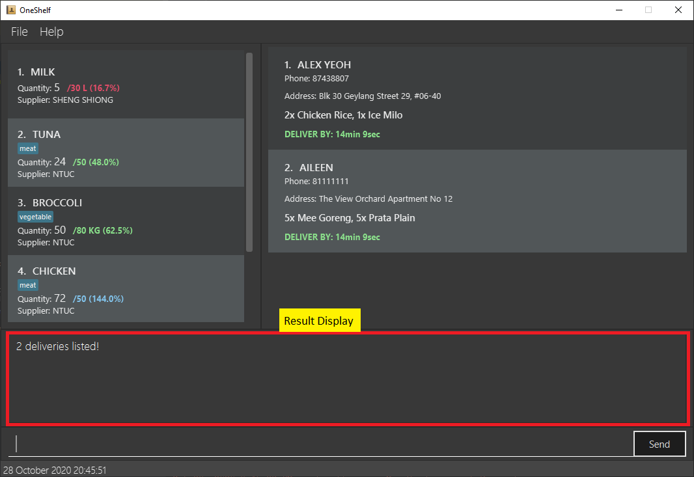
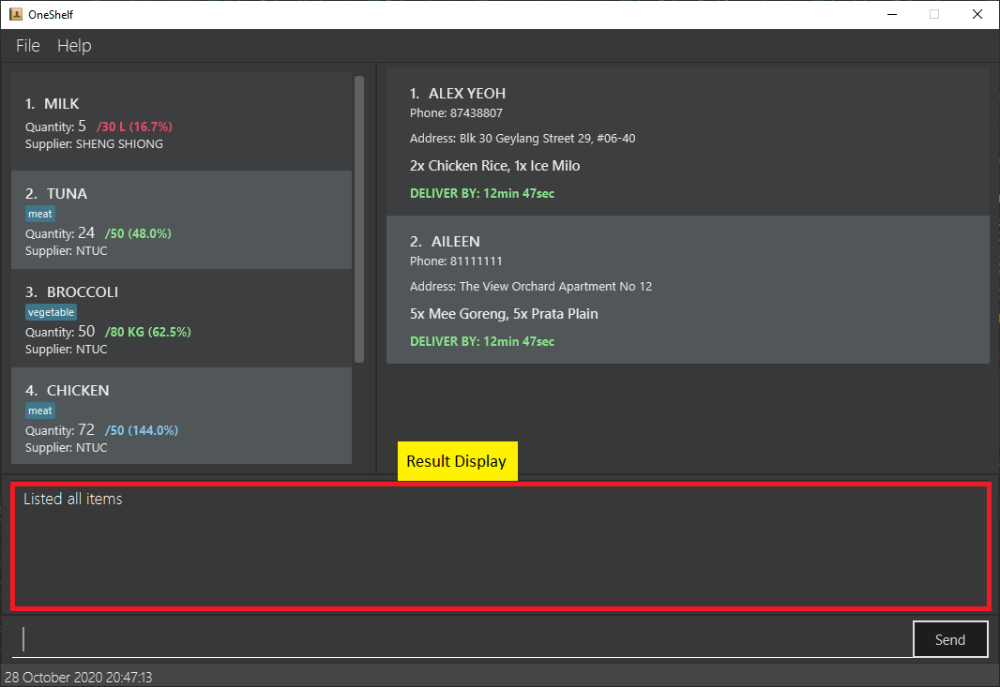

* Table of Contents
{:toc}
--------------------------------------------------------------------------------------------------------------------
## 1. Introduction
OneShelf is a desktop application for you to manage restaurant inventories and pending deliveries.
It is easy to build and customise your inventories and deliveries by using
only Command Line Interface. If you are a fast-typist restaurant manager
who prefers to use the Command Line Interface and needs to keep
track of inventory items and pending deliveries, OneShelf is for you!
  
This User Guide document will provide a general overview of installation, existing features, coming-up features
as well as summary commands.

--------------------------------------------------------------------------------------------------------------------
## 2. Quick start

1. Ensure you have Java `11` or above installed in your Computer.

2. Download the latest `oneshelf.jar` from [here](https://github.com/AY2021S1-CS2103T-T12-1/tp/releases).

3. Copy the file to the folder you want to use as the _home folder_ for your Inventory Book.

4. Double-click the file to start the app. The similar GUI shown below (Figure 1) should appear in a few seconds.  
   *Note how the app contains some sample data but the installed version on your desktop might have a different data set.*
     
    
    # 
    Figure 1: Introduction to OneShelf User Interface

     
    
5. Type the command `help start` in the command box and press Enter to execute it.  
   A new help window shown below (Figure 2) should appear on your desktop.
     
    # 
    Figure 2: Help Start Window
    
     

6. Refer to the [Features](#3-features) below for details of each command.

--------------------------------------------------------------------------------------------------------------------
## 3. Features

OneShelf has 2 main features that it is able to store, namely are:
1. Inventory items
2. Pending deliveries

From here onwards, the term `item` and `delivery` are used specifically for inventory items and pending deliveries respectively.
*You may want to refer to Figure 1 above.*

**:information_source: Notes about the item command format:** 

* Words in `UPPER_CASE` are the parameters to be supplied by the user. 
  e.g. in `add n/NAME`, `NAME` is a parameter which can be used as `add-i n/Chicken`.

* Items in square brackets are optional. 
  e.g `n/NAME [t/TAG]` can be used as `n/Chicken t/Poultry` or as `n/Chicken`.

* Items with `…`​ after them can be used multiple times including zero times. 
  e.g. `[t/TAG]…​` can be used as ` ` (i.e. 0 times), `t/friend`, `t/friend t/family` etc.

* Parameters can be in any order. 
  e.g. if the command specifies `n/NAME q/QUANTITY`, `q/QUANTITY n/NAME` is also acceptable.

*Note: The above notes are also applicable for `delivery`.*

--------------------------------------------------------------------------------------------------------------------
### 3.1 Command Features

#### 3.1.1 Viewing help : `help`

##### 3.1.1.a Help Start

Format: `help start`
If you are a first time user, we strongly encourage you to enter `help start` and follow the guide to kick-start your journey in OneShelf.

Alternatives:
* Press `F1` at any point in the usage of the app
* GUI navigation menu at the top left

##### 3.1.1.b Help Summary

Format: `help summary`

We understand that even if you are not a first time user, it is not easy to remember all the commands within a single session.
Should you need a list of summary commands, you can enter `help summary` and a new window similar to Figure 3 should appear.

Alternatives:
* Press `F2` at any point in the usage of the app
* GUI navigation menu at the top left

  
Figure 3: Help Summary Window

#### 3.1.2 Adding an item or delivery: `add-i` or `add-d`

Adds inventory item or pending delivery to OneShelf.

##### 3.1.2.a `add-i`

Format: `add-i n/NAME q/QUANTITY [s/SUPPLIER] [max/MAX_QUANTITY] [metric/METRIC] [t/TAG]...​`
* Adds `QUANTITY` from the current quantity of an inventory item if the item already exist.
An item is uniquely identified by its `NAME` and `SUPPLIER`.
* Note 1: `MAX_QUANTITY` denotes the ideal stock level of that particular item.
* Note 2: `TAG` could be used to categorise items. EG: Duck can be tagged as meat. 

Example 1: `add-i n/DUCK q/10 s/NTUC max/50 metric/KG t/meat t/food` using [Figure 1](#uiwithannotationpng) as the starting point.

1. Select the Command Box and type in `add-i n/DUCK q/10 s/NTUC max/50 metric/KG t/meat t/food`.
 

 
 

2. Either press Enter on your keyboard or click Send to execute the command.

3. Success Message will be shown in the Result Display (assuming there isn't an existing same item) and added item will show up in InventoryBook.
 

 
 

Example 2: `add-i n/Tuna q/20 s/NTUC` using [Figure 1](#uiwithannotationpng) as the starting point.

1. Select the Command box and type in `add-i n/Tuna q/20 s/NTUC`
 

 
 

2. Either press Enter on your keyboard or click Send to execute the command.

3. Success Message will be shown in the Result Display and added item's quantity will combine with existing same item's quantity.
 

 
 

:bulb: **Note:** Notice how Tuna's `Quantity` increased from 24 to 44

##### 3.1.2.b `add-d`

Format: `add-d n/NAME p/PHONE a/ADDRESS o/ORDER`

Examples: `add-d n/DAMITH p/91111111 a/Blk 251 Orchard Road o/Nasi goreng x1`

:bulb:**Tip:**
<li>An item can have any number of tags (including 0)</li>
<li>Unlike inventory item, pending delivery does not have a quantity</li>

#### 3.1.3 Removing quantity from an item: `remove-i`

Removes a specified quantity of an existing item from OneShelf.

Format: `remove-i INDEX q/QUANTITY`
* Subtracts `QUANTITY` from the current quantity of an item at the specified `INDEX`.
The index refers to the index number shown in the displayed item list. The index **must be a positive integer** 1, 2, 3, …​

Examples:
* `remove-i 1 q/10`

:bulb: **Tip:**
* There is no remove-d since a pending delivery does not have a quantity

#### 3.1.4 Editing an item or delivery: `edit-i` or `edit-d`

Edits an existing item in the Inventory book or an existing pending delivery in the Delivery book.

##### 3.1.4.a `edit-i`

Format: `edit-i INDEX [n/NAME | q/QUANTITY | s/SUPPLIER | max/MAX_QUANTITY | t/TAG]`

:bulb: **Note:** The `|` symbol means the user must provide at least one of the fields
separated by the `|`

* Edits the item at the specified `INDEX`. The index refers to the index number shown in the displayed item list. The index **must be a positive integer** 1, 2, 3, …​
* Updates the components of an item.
* When editing tags, the existing tags of the item will be removed
* You can remove all the item’s tags by typing `t/` without
    specifying any tags after it.

Example 1: `edit-i 3 n/CARROTS q/50` using [Figure 1](#uiwithannotationpng) as the starting point.

1. Select the Command Box and type in `edit-i 3 n/CARROTS q/50`.

2. Either press Enter on your keyboard or click Send to execute the command.

3. Success Message will be shown in the Result Display and the 3rd item will show up with its updated fields as shown below.
 

 
 

Example 2: `edit-i 2 n/Spinach t/` using [Figure 1](#uiwithannotationpng) as the starting point.

1. Select the Command box and type in `edit-i 2 n/Spinach t/`

2. Either press Enter on your keyboard or click Send to execute the command.

3. Success Message will be shown in the Result Display and the 2nd item will show up with its updated fields as shown below.
 

 
 

:bulb: **Note:** Notice how Tuna's `Quantity` increased from 24 to 44

##### 3.1.4.b `edit-d`

Format: `edit-d INDEX [n/NAME] [p/PHONE] [a/ADDRESS] [o/ORDER]`

Examples:
* `edit-d 1 n/AARON p/91111233`  
Edits the name and phone number of the 1st item to be `AARON` and `91111233` respectively.

#### 3.1.5 Locating items or delivery by keywords: `find-i` or `find-d`

Finds items or deliveries whose attributes contain any of the given keywords.

##### 3.1.5.a `find-i`

Format: `find-i PREFIX KEYWORD [MORE_KEYWORDS]`

* The search is case-insensitive. e.g `chicken` will match `CHICKEN`
* The order of the keywords does not matter. e.g. `Chicken steak` will match `steak Chicken`
* Name, Supplier and Tag can be searched
* Only full words will be matched e.g. `chicke` will not match `chicken`
* Items matching at least one keyword will be returned (i.e. `OR` search).
  e.g. `chicken steak` will return `chicken steak`, `steak beef`
* More than one Prefix can be specified (i.e. `AND` search).
  e.g. 'find-i n/Chicken s/NTUC' will return items matching name and supplier.

Examples:
* `find-i s/ntuc t/meat` returns item with supplier of `NTUC` and tag of `meat`.

1. Select the Command Box and type in `find-d s/ntuc t/meat`.
 

 
 

2. Either press 'Enter' on your keyboard or click Send to execute the command.

3. Success Message will be shown in the Result Display, and the number of matches will be shown.
 

 
 

##### 3.1.5.b `find-d`

Format: `find-d PREFIX KEYWORD [MORE_KEYWORDS]`

* The search is case-insensitive. e.g `john` will match `JOHN`
* The order of the keywords does not matter. e.g. `John Lim` will match `Lim John`
* Name, Phone, Address, Order can be searched
* Only full words for name will be matched e.g. `Bob` will not match `Bobby`
* Any phone/address/order containing the search string within them will be matched. e.g. "Holland V" will match "Holland Village"
* Items matching at least one keyword will be returned (i.e. `OR` search).
  e.g. `Bernice Adam` will return `Bernice Yeo`, `Adam Tan`
* More than one Prefix can be specified (i.e. `AND` search).
  e.g. 'find-d n/Bernice p/85783742' will return delivery matching name and phone.
 
Examples:
* `find-d n/alex aileen` returns `Alex` and `Aileen`'s deliveries

1. Select the Command Box and type in `find-d n/alex aileen`.
 

 
 

2. Either press 'Enter' on your keyboard or click Send to execute the command.

3. Success Message will be shown in the Result Display, and the number of matches will be shown.
 

 
 

#### 3.1.6 Listing all items or delivery: `list-i` or `list-d`

After entering `find-i` or `find-d`, the placeholder in your application will only show the items or deliveries
that match your find KEYWORD. If you would like to show **all** the items and deliveries again,
`list-i` or `list-d` command would be useful.

Format: `list-i` or `list-d`

Example: `list-i`

1. Select the Command Box and type in `list-i`.
 

 
 

2. Either press 'Enter' on your keyboard or click Send to execute the command.

3. Success Message will be shown in the Result Display.
 

 
 

#### 3.1.7 Deleting an item or delivery: `delete-i` or `delete-d`

Deletes an item or delivery from inventory book or delivery book respectively. Delete command is especially useful
for delivery as you would often need to delete a pending delivery once it has been delivered.

Format: `delete-i INDEX` or `delete-d INDEX`

* Deletes an item or delivery at the specified `INDEX`.
* The index refers to the index number shown in the displayed item/ delivery list.
* The index **must be a positive integer** 1, 2, 3, …​

Examples:
* `list-i` followed by `delete-i 2` deletes the 2nd item in the inventory book.
* `find-i Duck` followed by `delete-i 1` deletes the 1st item in the results of the `find-i` command.

#### 3.1.8 Clearing all entries: `clear-i` or `clear-d`

Clears all entries from the Inventory/ Delivery book.

Format: `clear-i` or `clear-d`

#### 3.1.9 Exiting the program: `exit`

Exits the program.

Format: `exit`

#### 3.1.10 Undo last command: `undo`

Undoes the previous command by reverting the current data displayed to the state it was in before the last command was executed.

Format: `undo`

* If there is a previous state available, the current state is reverted to that state
* If the current state is the earliest possible one, it shows a message informing the user that there is nothing more to undo
* The maximum number of previous commands you can undo is 20

Example 1: `undo` using [Figure 1](#uiwithannotationpng) as the starting point.

1. Select the Command box and type in `clear-i`

2. Either press Enter on your keyboard or click Send to execute the command.
 

 
 

3. Select the Command box and type in `undo`

4. Repeat step 2
* You should now see the same items as appearing in [Figure 1](#uiwithannotationpng)

#### 3.1.11 Redo last command: `redo`

Redoes the last undone command by reverting the current data displayed to the state it was in before the last undo command was executed.

Format: `redo`

* If there is an undone state available, the current state is reverted to that state
* If the current state is the latest possible one, it shows a message informing the user that there is nothing more to redo
* After any command that changes the state of data (such as add, clear, delete, edit), the new state becomes the latest state
(i.e. the previous undo commands are "forgotten" and `redo` will have no effect)

Example 1: `redo` using [Figure 1](#uiwithannotationpng) as the starting point.

1. Follow steps 1 - 4 of [Example 1](#undoExample1) for the `undo` command

2. Select the Command box and type in `undo`

3. Either press Enter on your keyboard or click Send to execute the command

4. You should now see the items cleared again, as shown in [Step 2 of Example 1](#undoExample1Step2) of the `undo` command.

--------------------------------------------------------------------------------------------------------------------
### 3.2 General Features
#### 3.2.1 Saving the data

OneShelf data are saved in the hard disk automatically after any command that changes the data. There is no need to save manually.

#### 3.2.2 Scrolling through command history

OneShelf commands are traversable (up to 20 commands) much like Window's command prompt. 
By pressing the arrow up key traversing you're able to traverse previous commands and 
by pressing the arrow down key you're able to traverse into next commands.

#### 3.2.3 Sorting items

* Inventory items are sorted based on percentage of quantity in ascending order.
* If the maximum quantity does not exist for that particular item then it the item will be located at the end of the list.
* If 2 items have the same quantity, they are then sorted lexicographically.

--------------------------------------------------------------------------------------------------------------------
### 3.3 Coming Soon
#### 3.3.1 Countdown to deliver `[Coming Soon]`

Allows user to input a countdown timer when adding a new delivery so that the user will be able to keep track
the deliveries that needs to be delivered out based on their urgency

#### 3.3.2 Statistics `[Coming Soon]`

Prints the total amount of delivery and reservation for the day

#### 3.3.3 Scheduling `[Coming Soon]`

Allows user to know when to do restocking

#### 3.3.4 Prices of items `[Coming Soon]`

Look up prices on a 'supplier' database

#### 3.3.5 Notification `[Coming Soon]`

Notify the user if a certain stock is below threshold

--------------------------------------------------------------------------------------------------------------------

## 4. FAQ

**Q**: How do I transfer my data to another Computer? 
**A**: Install the app in the other computer and overwrite the empty data file it creates with the file that contains the data of your previous Inventory/ DeliveryBook home folder.

**Q**: Help! I've accidentally typed `clear-i` or `clear-d` and wiped all my data!  
**A**: Use the [Undo Command](#3110-undo-last-command-undo) to reset your data back.

--------------------------------------------------------------------------------------------------------------------

## 5. Command summary

#### 5.1 General commands summary

| Action    | Format, Examples                                                                                    |
|-----------|-----------------------------------------------------------------------------------------------------|
|**Get help to start off**    | `help start` or press `F1` or use GUI help menu at the top left |
|**Get help summary**    | `help summary` or press `F2` or use GUI help menu at the top left |   
|**Undo last command**   | `undo`  |
|**Redo last undone command**   | `redo`  |
|**Exit command** | `exit` |

#### 5.2 Inventory summary

| Action    | Format, Examples                                                                                    |
|-----------|-----------------------------------------------------------------------------------------------------|
|**Add to Inventory**    | `add-i n/NAME q/QUANTITY [s/SUPPLIER] [max/MAX_QUANTITY] [t/TAG]...​`   e.g., `add n/Chicken q/3 s/ShengSiong t/Poultry` |
|**Clear from Inventory**  | `clear-i`            |
|**Delete from Inventory** | `delete-i INDEX`  e.g., `delete 3`         |
|**Edit Inventory**   | `edit-i INDEX [n/NAME] [q/QUANTITY] [s/SUPPLIER] [max/MAX_QUANTITY] [t/TAG]…​`  e.g.,`edit 1 n/Chicken q/50`    |
|**Find in Inventory**   | `find-i PREFIX KEYWORD [MORE_KEYWORDS]`  e.g., `find-i n/Chicken Steak`     |
|**List Inventory**   | `list-i` |
|**Remove from Inventory** | `remove-i INDEX q/QUANTITY`    |

#### 5.3 Delivery summary

| Action    | Format, Examples                                                                                    |
|-----------|-----------------------------------------------------------------------------------------------------|
|**Add to Delivery**    | `add-d`   e.g `add-d n/Alex Yeoh p/87438807 a/Blk 30 Geylang Street 29, #06-40 o/2x Chicken Rice, 1x Ice Milo` |
|**Clear from Delivery**  | `clear-d`               |
|**Delete from Delivery** | `delete-d INDEX`  e.g., `delete 3`     |
|**Edit Delivery**   | `edit-d INDEX [n/NAME] [p/PHONE] [a/ADDRESS] [o/ORDER]`  e.g.,`edit 3 n/AARON p/91111233`   |
|**List Delivery**   | `list-d` |
|**Find in Delivery**  | `find-d PREFIX KEYWORD [MORE_KEYWORDS]`   e.g., `find-d n/Alex`   |

--------------------------------------------------------------------------------------------------------------------

### 6. Glossary
* **Item**: Restaurant's inventory item which can be restaurant materials *(i.e fork, spoon, chair)* or ingredients
*(i.e milk, cheese)*
* **Delivery**: Delivery order that has yet to be delivered out from the restaurant
* **Book**: There are 2 types of book, namely: Inventory Book and Delivery Book which stores the data of your 
inventory items and pending deliveries respectively
