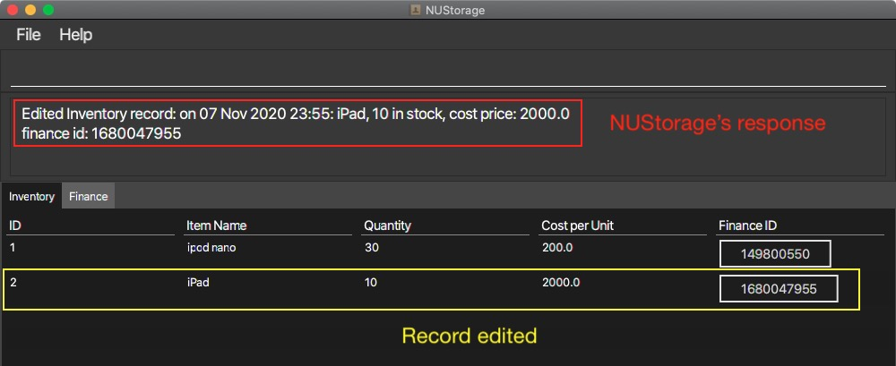
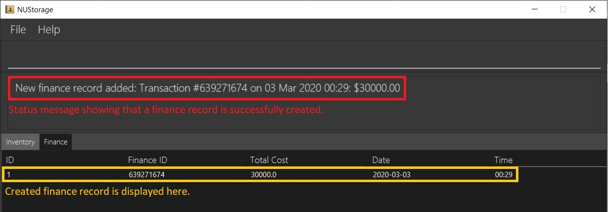
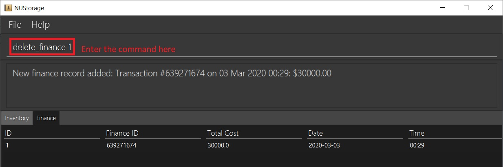
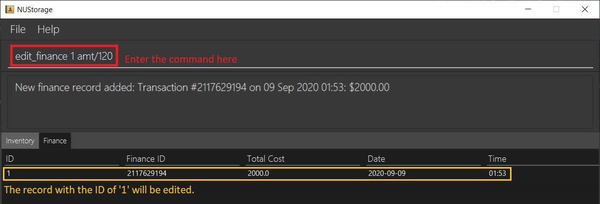
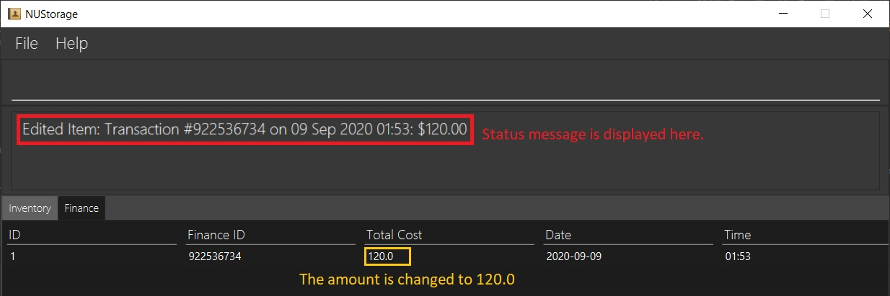
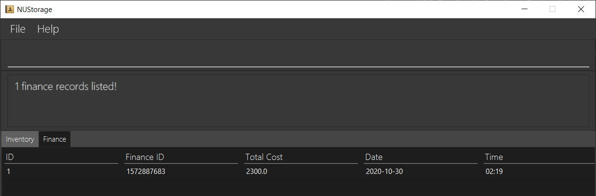
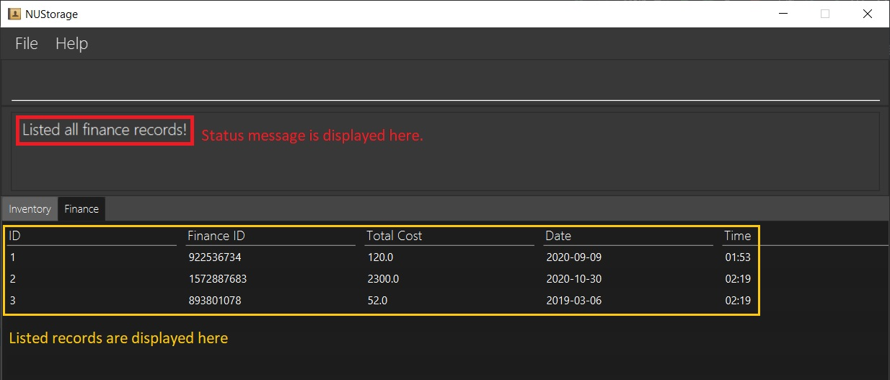

<!-- TOC adapted from
https://github.com/AY2021S1-CS2103T-W16-3/tp/pull/179/commits/aec461182c194c9ca2c67d7c407fcabb376191ff
-->

  * Table of Contents
  {:toc}

---

## 1. Using this User-Guide

This User-Guide aims to aid users in using NUStorage to its fullest potential. In this guide, we will be guiding you through the entire process of using NUStorage, from setting it up on your system to the using the features that NUStorage offers.

If you are a new user, we recommend that you read this user guide from start to the end and follow the examples provided in the [commands](#5-commands) section to gain a better understanding of the application. If you are an experienced user, feel free to use the Table-Of-Contents to skip to the section most relevant to you.

If you see an acronym that you don't understand, kindly refer to the [glossary](#8-glossary-and-terms). If you have further questions regarding NUStorage or this User-Guide, feel free to contact us at _nustorage.support@u.nus.edu_.

## 2. Introduction

Welcome to NUStorage, a desktop application that aims to help users to manage __inventory__, __finance transactions__ as well as __accounts__.

NUStorage revolutionises the way we can manage our inventory and finances by ridding us of cumbersome traditional means of management, such as books and folders. Instead, everything is now stored and displayed neatly in a fast and low-resource application!

NUStorage is optimised for store owners and managers who prefer to work with a command line interface (CLI) while still enjoying the visual benefits of a graphical user interface (GUI).

With proper usage, NUStorage can manage your inventory and finance records much faster than traditional GUI-based applications, streamlining your workflow and increasing productivity.

Interested? Read on to get [started](#3-quick-start-guide)!

---

## 3. Quick Start Guide

1. Ensure that you have `Java 11` or above installed on your device.
2. Download the latest release of `NUStorage.jar` [here](https://github.com/AY2021S1-CS2103T-T11-3/tp/releases).
3. Copy the `.jar` file to the folder you want to use as the home folder for your application.
4. Double-click on the `.jar` file to start the app. The GUI should look something like this:

    

5. The image below explains the relevant areas of the application's interface:

    

6. Type a few commands in the command box and press enter to execute. This is small calibration test to ensure that NUStorage is working as intended.
    * Here are some sample commands you can try out to get started:
        * `create_inventory i/Logitech G400 q/20 c/69` to add 20 Logitech G400 gaming mouse that cost $69 to the inventory
        * `add_finance amt/120.17` to add an inbound transaction of $120.17
        * `exit` to exit programme
    * Refer to the [list of commands](#5-commands) below for details of each command.

---

## 4. Command Formats

This section details the notations used to specify the command formats in the [commands](#5-commands) and [commands summary](#6-commands-summary) sections.

**:information_source: Notes about the command format:** 

* Words in `UPPER_CASE` are the __parameters__ to be keyed-in by the user.
  * e.g. in `create_inventory i/ITEM`, `ITEM` is a parameter which can be used in this format: `create_inventory i/MacBook`.
* Only parameters in **square brackets** are **optional**, all others are **compulsory**.
  * e.g. `amt/AMOUNT [at/DATE] [TIME]` can be used as the possible formats:
    * `amt/200 at/2020-04-10 18:00`
    * `amt/200 at/2020-04-10`
    * `amt/200 at/18:00`
    * `amt/200 at/2020-04-10`
    * `amt/200`
  * Notice that the `AMOUNT` field is compulsory.
* Inputs that require date and time have specific formats.
  * Date must be formatted in `YYYY-MM-DD`.
  * Time must be formatted in `HH:mm`.
  * e.g. input of `2020-01-01` will show up as `01 Jan 2020` as the date, and `13:00` will show up as `13:00` as the time in NUStorage's response box.
* Parameters can be switched around.
  * They do NOT need to come in the order as specified by the formats.
    * E.g. `create_item i/iPad q/100` and `create_item q/100 i/iPad` are both accepted.
  * Exception: commands that require the `INDEX` must have the `INDEX` directly after the command.
    * E.g. `edit_inventory 1 i/newname` is accepted but NOT `edit_inventory i/newname 1`
* Range of valid inputs:
  * Parameters that expect an integer must be between `0` and `2147483647`.

---

## 5. Commands

This section shows the commands that can be used with NUStorage. It is divided into three sections:

1. [Inventory commands](#51-inventory-commands)
2. [Finance commands](#52-finance-commands)
3. [Universal commands](#53-universal-commands)

Accompanying the details of each command are figures that show an example of the command and the result of executing the command.

---

### 5.1. Inventory Commands

NUStorage supports the storage and manipulation of inventory records. The following sections detail the commands related to inventory storage, given in alphabetical order.

Commands in this section are best executed when you are in the inventory tab. If you do not know how to switch to the inventory tab, please refer to the [switch between tabs](#534-switch-tabs-switch) section for more information.

#### 5.1.1. Add items to inventory: `create_inventory`

NUStorage allows you to add and save a new inventory record.

**:information_source: What this command does:**

`create_inventory` allows us to create and store a new inventory record into the inventory list.

**:information_source: Using the command:** Below are instructions on how to use the `create_inventory` command.

__Format:__ `create_inventory i/ITEM_NAME q/QUANTITY [c/ITEM_COST]`

This creates a new inventory record for the item `[ITEM_NAME]` of quantity `[QUANTITY]`. Note that `QUANTITY` is currently limited to a maximum value of `2147483647`.

For the `[ITEM_COST]` parameter:

* If given, then a finance record is created automatically with a total amount of `ITEM_COST * QUANTITY`.
* If left empty, then an **empty** finance record is created with an amount of `0`.

__Example:__ `create_inventory i/iphone q/10 c/20`

This creates a new inventory record of item `iphone` and quantity `10`. A finance record with the total amount of `200` will also be created.

Enter the example command into the command box as shown below:

__Result:__ Inventory record for the item `iphone` of quantity `10` is added to the inventory.

A corresponding finance record of total cost `200` is added to the finance account.

---

#### 5.1.2. Remove items from inventory: `delete_inventory`

Previously in the [Add Inventory Records](#511-add-items-to-inventory-create_inventory) section, we have created a new inventory record, and its accompanying finance record. Now, let's try to delete from NUStorage using `delete_inventory`.

If you are reading this section without having read the previous section, please ensure that your NUStorage application has at least one inventory record stored. If you are unclear on how to do so, refer to the [Add Inventory Records](#511-add-items-to-inventory-create_inventory) section.

For the purpose of this section, we have created two other inventory records, you can add them in if you wish to. Our NUStorage now has three records as shown below:

**:information_source: What this command does:**

`delete_inventory` allows us to delete an inventory record currently stored within NUStorage.

**:information_source: Using the command:** Below are instructions on how to use the `delete_inventory` command.

__Format:__ `delete_inventory INDEX`

This allows us to delete the inventory record with the ID of `INDEX`.

__Example:__ `delete_inventory 1` deletes the inventory record with index `1`.

Enter the sample command into the command box as shown below:

__Result:__ Inventory record at index `1` is removed from the inventory list.

The corresponding finance record is also deleted.

---

#### 5.1.3. Edit record in inventory: `edit_inventory`

Previously in the [Delete inventory records](#512-remove-items-from-inventory-delete_inventory) section, we have deleted one of our inventory records. For this section, ensure that you have at least one inventory record.

If you are reading this section without having read the previous section, please ensure that your NUStorage application has at least one inventory record stored. If you are unclear on how to do so, refer to the [Add Inventory Records](#511-add-items-to-inventory-create_inventory) section.

We will proceed with our example from the previous section with two records in NUStorage, you can add them in if you wish to.

Currently, our NUStorage has two records as shown below:

**:information_source: What this command does:**

`edit_inventory` allows us to edit the item name, quantity or unit cost of the specified record in the inventory list.

**:information_source: Using the command:** Below are instructions on how to use the `delete_inventory` command.

__Format:__ `edit_inventory INDEX [i/ITEM_NAME] [q/QUANTITY] [c/ITEM_COST]`

This allows us to change the item name, quantity and cost of the inventory record with the ID `INDEX`. Note that `QUANTITY` is currently limited to a maximum value of `2147483647` and that `INDEX` must be the **first** parameter for this command.

__Example:__ `edit_inventory 2 i/iPad q/10 c/2000` edits the inventory record at index `2`.

Enter the sample command into the command box as shown below:

__Result:__ Inventory record's item name changed from `iphone 12` to `iPad`, quantity changed from `100` to `10` and unit cost from `1000` to `2000`.

The corresponding finance record is also updated to reflect the new total cost of `20000`.

---

#### 5.1.4. Find record in inventory: `find_inventory`

Searches and lists all inventory records that contain the keyword in the item name.

__Format:__ `find_inventory KEYWORD`

__Example:__ `find_inventory ipad` finds for inventory records containing the name `ipad`.

__Result:__ lists all inventory records with the word `ipad`.

---

#### 5.1.5. List inventory records: `list_inventory`

Displays all records in the inventory list.

__Format:__ `list_inventory`

__Example:__ `list_inventory` lists all inventory records.

__Result:__ lists all inventory records.

---

#### 5.1.6. Update inventory record: `update_inventory`

Displays all records in the inventory list.

__Format:__ `update_inventory INDEX q/CHANGE_QUANTITY`

<!-- Note that `QUANTITY` is currently limited to a maximum value of `2147483647` and that `INDEX` must be the **first** parameter for this command.-->

__Example:__ `update_inventory 1 q/-5` changes the quantity of the inventory by `-5` and updates corresponding finance record. `CHANGE_QUANTITY` can be of negative value.

__Result:__ Updated inventory record at `1` from `30` to `25`.

__Result:__ Updated corresponding finance record.

---

### 5.2. Finance Commands

NUStorage supports the storage and manipulation of finance records. 
The following sections detail the commands related to finance storage in alphabetical order.

Commands in this section are best executed when you are in the finance tab. 
If you do not know how to switch to the finance tab, please refer to the [switch between tabs](#534-switch-tabs-switch) 
section for more information.

**NOTE:** Some of these commands only work for [stand-alone finance records](#8-glossary-and-terms) (i.e. finance records that are not attached to any inventory records).

#### 5.2.1. Add finance records: `add_finance`

NUStorage allows you to add and save a new finance record into the account. In the [Add Inventory Record](#511-add-items-to-inventory-create_inventory) section, we have seen how a finance record is added when an inventory record is created to reflect the changes in the finance account. However, there are times that you want to create a finance record independent of any inventory records to record an influx/outflow of funds for example.

This is where `add_finance` comes in handy.

**:information_source: What this command does:**

`add_finance` allows us to add a stand-alone finance record into NUStorage's.

Note that this command **can only add a stand-alone finance record**.

**:information_source: Using the command:** Below are instructions on how to use the `add_finance` command.

__Format:__ `add_finance amt/AMOUNT [at/DATE] [TIME]`

This creates a new finance record of amount `AMOUNT`. If `DATE` and `TIME` are specified, the finance record would reflect that `DATE` and `TIME` in the record.

**NOTE:** If the Date and Time fields are not specified, they will default to the current location's Date and Time.

__Example:__ `add_finance amt/30000 at/2020-03-03`

This creates a new finance record of amount `$30000` on `3rd March 2020`

Enter the example command into the command box as shown below:

__Result:__ Finance record of amount `$30000` on `3rd March 2020` is added to the finance account:

---

#### 5.2.2. Delete finance records: `delete_finance`

Previously, in the [Add Finance Records](#521-add-finance-records-add_finance) section, we have created a finance record. Now, let's try to delete it from NUStorage using `delete_finance`.

If you are reading this section without having read the previous section, please ensure that your NUStorage application has at least one finance record stored. If you are unclear on how to do so, refer to the [Add Finance Records](#521-add-finance-records-add_finance) section.

**:information_source: What this command does:**

`delete_finance` allows us to delete a stand-alone finance record currently stored within NUStorage.

Note that this command **can only delete a stand-alone finance record**.

**:information_source: Using the command:** Below are instructions on how to use the `delete_finance` command.

__Format:__ `delete_finance INDEX`:

This allows us to delete the finance record with the ID of `INDEX`.

Currently, our NUStorage only contains one record, as shown below:

__Example:__ `delete_finance 1` deletes the finance record with index `1`.

Enter the example command into the command box as shown below:

__Result:__ Finance record at index `1` is removed from the finance account.

---

#### 5.2.3. Edit a finance record: `edit_finance`

Previously, in the [Delete Finance Records](#522-delete-finance-records-delete_finance) section, we have deleted our only finance record in our application. For this section, ensure you have at least one **stand-alone** finance record (i.e not attached to any inventory records) stored in the application and that you are on the finance tab.

Your NUStorage application should currently look something like this:

**:information_source: What this command does:**

`edit_finance` allows us to edit details of the stand-alone finance records currently stored within NUStorage. Currently, with `edit_finance`, we are able to edit a finance record's amount and date.

Note that this command **can only edit a stand-alone finance record**.

**:information_source: Using the command:** Below are instructions on how to use the `edit_finance` command.

__Format:__ `edit_finance INDEX amt/AMOUNT [at/DATE]`

This allows us to change the amount and date details of the finance record with the `INDEX` ID. Note that `INDEX` must be the **first** parameter for this command.

__Example:__ `edit_finance 1 amt/120`

This changes the amount of the finance record with the ID of `1` to `120`.

Enter the example command into the command box as shown below:

__Result:__ Finance amount changed from `$100` to `$120` while the date remains unchanged.

---

#### 5.2.4. Find a finance record with a specified keyword: `find_finance`

**:information_source: Notes about the command:**

Previously, in the [Edit Finance Records](#523-edit-a-finance-record-edit_finance) section, we have learnt how to edit a stand-alone finance record. For this section, let us first add some more finance records to populate our finance account.

Ensure that you have at least 2 finance records, preferably with differing amounts and dates, stored in NUStorage as well as that you are in the `Finance` tab before proceeding. If you are having trouble adding finance records refer to the sections on [Add Finance Records](#521-add-finance-records-add_finance) or [Add Inventory Records](#511-add-items-to-inventory-create_inventory).

Currently, your NUStorage application should look something like this:

In the event that we have multiple records, it can get a little tedious to locate a certain finance record. We can use the `find_finance` command to find finance records that contain the specified keyword and display them on the record panel.

**:information_source: Using the command:** Below are instructions on how to use the `find_finance` command.

__Format:__ `find_finance [id/ID] [aft/AFTDATE] [bef/BEFDATE] [item/YESNO]`

This allows us to find all finance records with a finance ID that contains `ID` that were created after the date `AFTDATE` abd before the date `BEFDATE`. The parameter `[item/YESNO]` to choose between finance recrods tied to inventory records, or finance records that are stand-alone (`yes` to find only the finance records tied to inventory records, `no` to find stand-alone records only).

__Example:__ `find_finance id/8 aft/2019-10-20 bef/2020-12-30 item/no`

This allows us to find finance records with finance IDs that contain "8", created place between 20th Oct 2019 to 30th Dec 2020 (inclusive) and are not linked any inventory records.

Enter the example command into the command box as shown below:

__Result:__ Finance records that fit the parameters are listed. Below shows the record(s) from the image above that passes the `find_finance` criteria:

**NOTE:** Do not worry if your resulting display does not match the image above. If the records you added is not exactly the same as the ones shown above, the output would likely not be the same as well.

---

#### 5.2.5. List finance records: `list_finance`

**:information_source: Notes about the command:**

Previously, in the [Find Finance Records](#524-find-a-finance-record-with-a-specified-keyword-find_finance) section, we have learnt how to find certain finance records that contains our provided parameters. For this section, we will be reusing the examples from the [Find Finance Records](#524-find-a-finance-record-with-a-specified-keyword-find_finance) section. Currently, our NUStorage should look like this:

After finding certain records, chances are we would like to display all the records again. This can be achieved using the `list_finance` command.

The `list_finance` command will result in NUStorage displaying all the finance records stored within it.

**:information_source: Using the command:** Below are instructions on how to use the `list_finance` command.

__Format:__ `list_finance`

__Example:__ `list_finance`

Enter the example command into the command box as shown below:

__Result:__ All finance records are listed.

---

### 5.3. Universal Commands

The following are universal commands for navigating the application.

#### 5.3.1. Clear records: `clear`

Deletes all data stored locally.

**:heavy_exclamation_mark: Executing this command DELETES ALL RECORDS AND CAN NOT BE UNDONE!**

__Format:__ `clear`

__Example:__ `clear`

When on either tab, enter the command `clear` and press enter to execute.

__Result:__ All records currently stored in NUStorage are deleted as seen below.

**NOTE:** This command can be executed even if there are no records stored in NUStorage. There will be no effects when executing this command on an empty NUStorage.

---

#### 5.3.2. Quit the programme: `exit`

Saves data locally in a data file and exits the programme.

__Format:__ `exit`

__Example:__ `exit`

__Result:__ Programme terminates.

---

#### 5.3.3. Get help on the commands: `help`

Opens a help window that links to this User Guide.

__Format:__ `help`

__Example:__ `help`

__Result:__ A help window is opened as shown below, redirecting user to this User Guide. Here, you can click on the `Copy URL` button to copy the link to the User Guide. Simply paste this URL into a web browser of your choice and press enter to visit the User Guide.

---

#### 5.3.4. Switch tabs: `switch`

Switches between the inventory and finance tabs.

**:information_source: Using the command:** Below are instructions on how to use the `switch` command.

__Format:__ `switch`

__Example:__ `switch`

* When on the **inventory** tab, execute the command `switch` to **switch to the finance** tab.
  1. Make sure you are on the inventory tab first.
  2. Then, type in the command as shown below and press enter to execute the command.

  3. You should see the window changing to the finance tab, as shown below.
  

 

* When on the **finance** tab, execute the command `switch` to **switch to the inventory** tab.
  1. Make sure you are on the finance tab first.
  2. Then, type in the command as shown below and press enter to execute the command.
  
  3. You should see the window changing to the finance tab, as shown below.
  

__Result:__ Tabs switched.

---

#### 5.3.5. Undo/Redo the previous command: `undo`/`redo`[coming in v2.0]`

[_This feature is planned for v2.0_]

Undo or redo the previous command.

__Format:__ `undo` or `redo`

__Example:__ `undo` or `redo`

__Result:__ The previous command is undone / redone.

---

## 6. Commands Summary

This section gives a summarised view of the commands available in NUStorage.

### 6.1. Inventory Commands Summary

The following table gives a summary of the [__inventory commands__](#51-inventory-commands) for quick reference and look-ups.

|Description|Command and Example|
|---|---|
| __Create inventory__ | `create_inventory i/ITEM q/QUANTITY [c/ITEM_COST]`   e.g. `create_inventory i/MacBook pro q/200 c/50` |
| __Delete inventory__ | `delete_inventory INDEX`   e.g. `delete_inventory 4` |
| __Edit inventory__ | `edit_inventory INDEX i/ITEM_NAME q/QUANTITY`  e.g. `edit_inventory 3 i/Lenovo Y50 q/10` |
| __Find inventory__ | `find_inventory KEYWORD`   e.g. `find_inventory ipad` |
| __List inventory__ | `list_inventory` |
| __Update Inventory__| `update_inventory INDEX q/CHANGE_QUANTITY`   e.g. `update_inventory 1 q/50` |

### 6.2. Finance Commands Summary

The following table gives a summary of the [__finance commands__](#52-finance-commands) for quick reference and look-ups.

|Description|Command and Example|
|---|---|
| __Add finance__ | `add_finance amt/AMOUNT [at/DATE] [TIME]`   e.g. `add_finance amt/420.69 at/2020-04-23` |
| __Delete finance__ | `delete_finance INDEX`   e.g. `delete_finance 2` |
| __Edit finance__ | `edit_finance INDEX amt/AMOUNT [at/DATE] [TIME]`   e.g. `edit_finance 1 amt/120 at/2020-10-01` |
| __Find finance__ | `find_finance [id/ID] [aft/DATE] [bef/DATE] [item/YESNO]`   e.g. `find_finance id/10 aft/2019-10-30 bef/2020-03-23 item/yes` |
| __List finance__ | `list_finance` |

### 6.3. Universal Commands Summary

The following table gives a summary of the [__universal commands__](#53-universal-commands) for quick reference and look-ups.

|Description|Command and Example|
|---|---|
| __Clear records__ | `clear` |
| __Exit programme__ | `exit` |
| __Help__ | `help` |
| __Switch tabs__ | `switch` |

---

## 7. FAQs

This section answers some of the _frequently asked questions_.

### 7.1. How do I migrate the data to another computer?

**:heavy_exclamation_mark: Doing so will OVERWRITE the existing data you may have on the other device. Please make sure you make a backup before migrating data.**

Steps to migrate data:

1. Locate the data files under the directory (folder) `./data`. The data files are names `inventory.json` and `financeAccount.json`.
2. Copy the files to the other device.
3. Place the two files under the directory `./data`.
4. Restart NUStorage on the other device to load the data.

### 7.2. How do I combine data from two devices?

Currently, NUStorage does not support the merging of data between different devices. NUStorage only supports moving of data from one device to another. Please see FAQ 7.1 regarding how to migrate data.

### 7.3. Can I directly modify the storage file?

**:heavy_exclamation_mark: Manually editing data in the storage file may result in a TOTAL LOSS OF DATA!**

Modifying the storage file is possible but NOT RECOMMENDED!

---

## 8. Glossary and Terms

1. `CLI`: command line interface.
2. `GUI`: graphical user interface.
3. `.jar`: The file type that NUStorage is released in. This is similar to the `.exe` files in Windows and `.app` files in MacOS.
4. `stand-alone finance records`: Finance records that are not attached to any inventory records.

---
