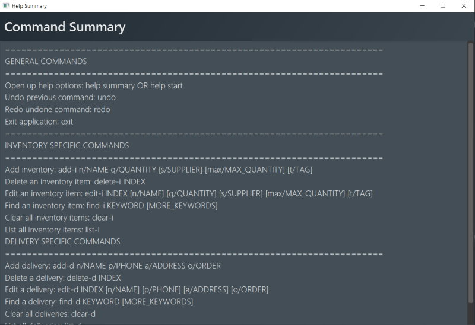

* Table of Contents
{:toc}
--------------------------------------------------------------------------------------------------------------------

## Introduction
 OneShelf is a desktop application for you to manage all of restaurant inventories, table reservations and pending deliveries.
It is easy to build and customise your inventories by using
only Command Line Interface. If you are a busy restaurant manager
who prefers to use the Command Line Interface and needs to keep
track of multiple items, OneShelf is for you!

## Quick start

1. Ensure you have Java `11` or above installed in your Computer.

1. Download the latest `oneshelf.jar` from [here]().

1. Copy the file to the folder you want to use as the _home folder_ for your Inventory Book.

1. Double-click the file to start the app. The GUI similar to the below should appear in a few seconds. Note how the app contains some sample data. 
   

1. Type the command in the command box and press Enter to execute it. e.g. typing **`help`** and pressing Enter will open the help window. 
   Some example commands you can try:

   * **`list-i`** : Lists all items.

   * **`add-i`**`add-i n/Chicken q/3 s/ShengSiong t/Poultry` : Adds a item named `Chicken` to OneShelf.

   * **`delete-i`**`3` : Deletes the item shown in the current list.

   * **`clear-i`** : Deletes all items.

   * **`exit`** : Exits the app.

1. Refer to the [Features](#features) below for details of each command.

--------------------------------------------------------------------------------------------------------------------

## Features

**:information_source: Notes about the command format:** 

* Words in `UPPER_CASE` are the parameters to be supplied by the user. 
  e.g. in `add n/NAME`, `NAME` is a parameter which can be used as `add-i n/Chicken`.

* Items in square brackets are optional. 
  e.g `n/NAME [t/TAG]` can be used as `n/Chicken t/Poultry` or as `n/Chicken`.

* Items with `…`​ after them can be used multiple times including zero times. 
  e.g. `[t/TAG]…​` can be used as ` ` (i.e. 0 times), `t/friend`, `t/friend t/family` etc.

* Parameters can be in any order. 
  e.g. if the command specifies `n/NAME q/QUANTITY`, `q/QUANTITY n/NAME` is also acceptable.

### Viewing help : `help`

Format: `help start`
Shows a guide for user to kick-start their journey in OneShelf.

Alternatives:
* Press `F1` at any point in the usage of the app
* GUI navigation menu at the top left

Format: `help summary`
Shows a summary of all the possible commands in OneShelf.

Alternatives:
* Press `F2` at any point in the usage of the app
* GUI navigation menu at the top left

### Adding an item: `add-i` or `add-d`

Adds inventory item or pending delivery to OneShelf.

Format: `add-i n/NAME q/QUANTITY [s/SUPPLIER] [max/MAX_QUANTITY] [t/TAG]...​`
* Adds `QUANTITY` from the current quantity of an inventory item if the item already exist.
An item is uniquely identified by its NAME and SUPPLIER.

Examples: `add-i n/CHICKEN q/10 s/NTUC max/50`

Assuming that your inventory item is empty, entering the above command would add a new chicken item that was previously purchased from NTUC.  
By entering `add-i n/CHICKEN q/10 max/50`, a new inventory item would be added instead of increasing the quantity since the second chicken has no supplier.  
On the other hand, by entering `add-i n/CHICKEN q/10 s/NTUC` again would increase the quantity of Chicken from NTUC to be 20kg.

Format: `add-d n/NAME p/PHONE a/ADDRESS o/ORDER`

Examples: `add-d n/DAMITH p/91111111 a/Blk 251 Orchard Road o/Nasi goreng x1`

:bulb: **Tip:**
* An item can have any number of tags (including 0)
* Unlike inventory item, pending delivery does not have a quantity.

### Removing quantity from an item: `remove-i`

Removes a specified quantity of an existing item from OneShelf.

Format: `remove-i INDEX q/QUANTITY`
* Subtracts `QUANTITY` from the current quantity of an item at the specified `INDEX`. The index refers to the index number shown in the displayed item list. The index **must be a positive integer** 1, 2, 3, …​

Examples:
* `remove-i n/Chicken q/1`

### Listing all items : `list-i` or `list-d`

Shows a list of all items in the Inventory book or Delivery book respectively.

Format: `list-i` or `list-d`

### Editing an item : `edit-i`

Edits an existing item in the Inventory book.

Format: ` edit-i INDEX [n/NAME] [q/QUANTITY] [s/SUPPLIER] [max/MAX_QUANTITY] [t/TAG]…​`

* Edits the item at the specified `INDEX`. The index refers to the index number shown in the displayed item list. The index **must be a positive integer** 1, 2, 3, …​
* Updates ALL the components of an item, UNABLE to update a specific component of an item.
Ie if a user wants to update the quantity, he/ she needs to specify all attributes again: name, quantity, supplier, tag, if any.
* When editing tags, the existing tags of the item will be removed i.e adding of tags is not cumulative.
* You can remove all the item’s tags by typing `t/` without
    specifying any tags after it.

Examples:
*  `edit-i 1 n/Chicken q/50` Edits the name and quantity of the 1st item to be `CHICKEN` and `50` respectively.
*  `edit-i 2 n/Spinach t/` Edits the name of the 2nd item to be `Spinach` and clears all existing tags.

### Locating items by keywords: `find-i`

Finds items whose attributes contain any of the given keywords.

Format: `find-i PREFIX KEYWORD [MORE_KEYWORDS]`

* The search is case-insensitive. e.g `chicken` will match `CHICKEN`
* The order of the keywords does not matter. e.g. `Chicken steak` will match `steak Chicken`
* Name, Supplier and Tag can be searched
* Only full words will be matched e.g. `chicke` will not match `chicken`
* Items matching at least one keyword will be returned (i.e. `OR` search).
  e.g. `chicken steak` will return `chicken steak`, `steak beef`
* More than one Prefix can be specified (i.e. `AND` search).
  e.g. 'find-i n/Chicken s/NTUC' will return items matching name and supplier.

Examples:
* `find-i n/Chicken` returns `chicken` and `chicken salad` items.
* `find-i s/Cold Storage t/meat` returns item with supplier of Cold Storage and tags of meat.

### Locating deliveries by keywords: `find-d`

Finds deliveries whose attributes contain any of the given keywords.

Format: `find-d PREFIX KEYWORD [MORE_KEYWORDS]`

* The search is case-insensitive. e.g `john` will match `JOHN`
* The order of the keywords does not matter. e.g. `John Lim` will match `Lim John`
* Name, Phone, Address, Order can be searched
* Only full words for name will be matched e.g. `Bob` will not match `Bobby`
* Any phone/address/order containing the search string within them will be matched. e.g. "Holland V" will match "Holland Village"
* Items matching at least one keyword will be returned (i.e. `OR` search).
  e.g. `Bernice Adam` will return `Bernice Yeo`, `Adam Tan`
* More than one Prefix can be specified (i.e. `AND` search).
  e.g. 'find-d n/Bernice p/85783742' will return delivery matching name and phone.

Examples:
* `find-d n/John` returns `John Tay` and `John Lim`'s deliveries

### Deleting an item : `delete-i`

Deletes the specified item from the inventory book.

Format: `delete-i INDEX`

* Deletes the item at the specified `INDEX`.
* The index refers to the index number shown in the displayed item list.
* The index **must be a positive integer** 1, 2, 3, …​

Examples:
* `list-i` followed by `delete-i 2` deletes the 2nd item in the inventory book.
* `find-i Duck` followed by `delete-i 1` deletes the 1st item in the results of the `find-i` command.

### Clearing all entries : `clear-i`

Clears all entries from the Inventory book.

Format: `clear-i`

### Exiting the program : `exit`

Exits the program.

Format: `exit`

### Undo last command : `undo`

Undoes the previous command by reverting the current data displayed to the state it was in before the last command was executed.

Format: `undo`

* If there is a previous state available, the current state is reverted to that state
* If the current state is the earliest possible one, it shows a message informing the user that there is nothing more to undo

### Redo last command : `redo`

Redoes the last undone command by reverting the current data displayed to the state it was in before the last undo command was executed.

Format: `redo`

* If there is an undone state available, the current state is reverted to that state
* If the current state is the latest possible one, it shows a message informing the user that there is nothing more to redo
* After any command that changes the state of data (such as add, clear, delete, edit), the new state becomes the latest state
(i.e. the previous undo commands are "forgotten" and `redo` will have no effect)

### Saving the data

OneShelf data are saved in the hard disk automatically after any command that changes the data. There is no need to save manually.

### Scroll through command history

OneShelf commands are traversable much like Window's command prompt with the arrow up key traversing into previous commands and arrow down key traversing into next commands.  

### Sorting items

Implicit sorting done.
Inventory is sorted by % max quantity in ascending order, if it max quantity does not exist for that particular item then it'll be flushed to the end and sorted in ascending order. If 2 items have the same quantity, they are then sorted lexiographically.

### Statistics `[Coming Soon]`

Prints the total amount of delivery and reservation for the day

### Scheduling `[Coming Soon]`

Allows user to know when to do restocking

### Prices of items `[Coming Soon]`

Look up prices on a 'supplier' database

### Notification `[Coming Soon]`

Notify the user if a certain stock is below threshold

--------------------------------------------------------------------------------------------------------------------

## FAQ

**Q**: How do I transfer my data to another Computer? 
**A**: Install the app in the other computer and overwrite the empty data file it creates with the file that contains the data of your previous InventoryBook home folder.

--------------------------------------------------------------------------------------------------------------------

## Command summary

#### General commands summary

| Action    | Format, Examples                                                                                    |
|-----------|-----------------------------------------------------------------------------------------------------|
|**Get help to start off**    | `help start` or press `F1` or use GUI help menu at the top left |
|**Get help summary**    | `help summary` or press `F2` or use GUI help menu at the top left |                                                                                       |                                                                                             |
|**Undo last command**   | `undo`  |
|**Redo last undone command**   | `redo`  |

#### Inventory summary

| Action    | Format, Examples                                                                                    |
|-----------|-----------------------------------------------------------------------------------------------------|
|**Add to Inventory**    | `add-i n/NAME q/QUANTITY [s/SUPPLIER] [max/MAX_QUANTITY] [t/TAG]...​`   e.g., `add n/Chicken q/3 s/ShengSiong t/Poultry` |
|**Clear from Inventory**  | `clear-i`                                                                                             |
|**Delete from Inventory** | `delete-i INDEX`  e.g., `delete 3`                                                                 |
|**Edit Inventory**   | `edit-i INDEX [n/NAME] [q/QUANTITY] [s/SUPPLIER] [max/MAX_QUANTITY] [t/TAG]…​`  e.g.,`edit 1 n/Chicken q/50`                |
|**Find in Inventory**   | `find-i PREFIX KEYWORD [MORE_KEYWORDS]`  e.g., `find-i n/Chicken Steak`                                       |
|**List Inventory**   | `list-i
|**Remove from Inventory** | `remove-i INDEX q/QUANTITY`                                                                                              |                                                                                          |

#### Delivery summary
| Action    | Format, Examples                                                                                    |
|-----------|-----------------------------------------------------------------------------------------------------|
|**Add Deliveries**    | `add-d`   e.g `add-d n/Alex Yeoh p/87438807 a/Blk 30 Geylang Street 29, #06-40 o/2x Chicken Rice, 1x Ice Milo`
|**List Deliveries**   | `list-d`
|**Find in Deliveries**  | `find-d PREFIX KEYWORD [MORE_KEYWORDS]`   e.g., `find-d n/Alex`           |
