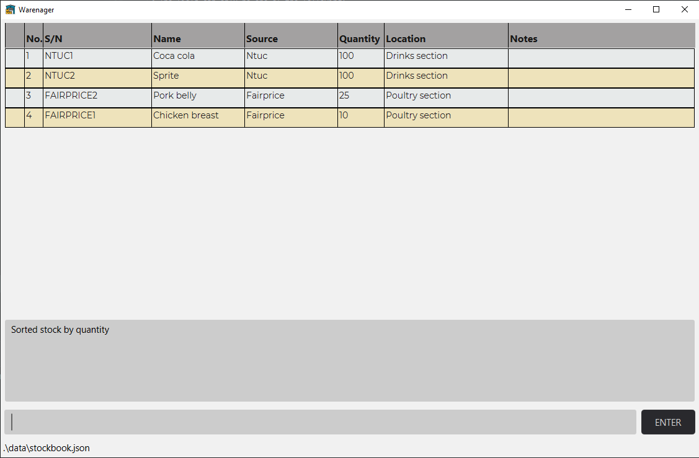
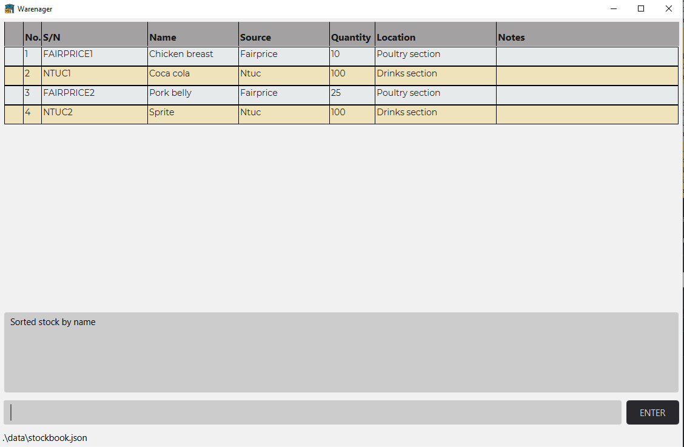
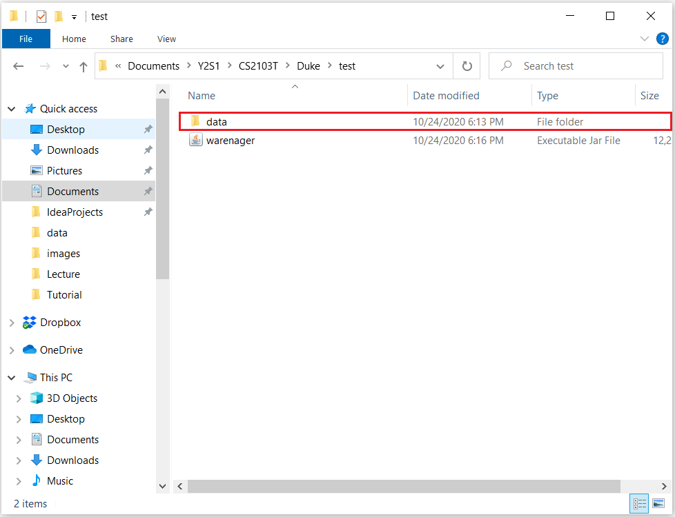
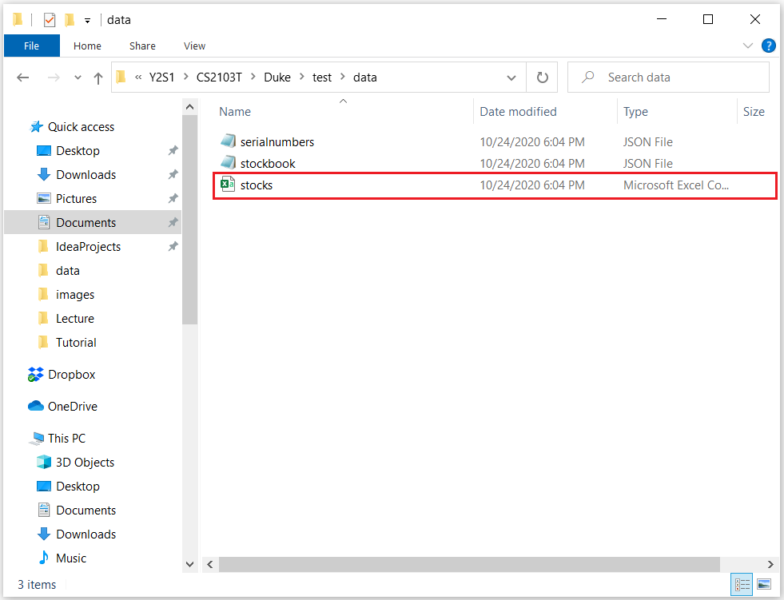

---
<h3>Table of Contents</h3>
* Table of Contents
{:toc}

--------------------------------------------------------------------------------------------------------------------
## Introduction

### Warenager’s User Guide

This user guide introduces our inventory application, Warenager, and provides support
for the usage of its functionalities. For quick reference, we have provided a [summarised table of commands](#command-summary)
and their usage formats
at the end of this guide.

### About Warenager

Warenager is an **inventory application** to help warehouse managers of small scale companies
keep track of items in their warehouse. It **optimizes management tasks** for warehouse managers including but not
exhaustive of updating, searching and sorting via Command Line Interface (CLI).

--------------------------------------------------------------------------------------------------------------------
## Quick start
To get started using Warenager,

1. Ensure you have Java `11` or above installed in your Computer.

1. Download the latest `warenager.jar` from [here](https://github.com/AY2021S1-CS2103T-T15-3/tp/releases).

1. Copy the jar file to the folder you want to use as the _home folder_ for your Warenager.

1. Double-click the jar file to start the app. The commands available in the current version of
   Warenager are: add, delete, update, find, findexact, note, notedelete, stats, sort, print, list and help.

--------------------------------------------------------------------------------------------------------------------
## Definitions

Term | Definition
--------|------------------
**Parameters** | Parameters are additional fields to key in during user input. e.g. `q/<source of stock>`, `n/<name>`
**CSV File** | Comma-separated values File. It contains data separated by commas.

--------------------------------------------------------------------------------------------------------------------
## Labels

Label | Meaning
--------|------------------
**:warning:** | Cautionary advice/Precautions
**:information_source:** | Useful notes/summaries for sections.

--------------------------------------------------------------------------------------------------------------------

## Features

**:information_source: Brief summary of features:** 

Note: Stocks possess these fields: Name, Serial Number, Source, Quantity, Location etc.  
(These stock details are presented in a drop down window.)

* **Adding** stocks: Unique serial number is generated based on the stock item and source company.
* **Deleting** stocks
* **Updating** stock fields
* **Searching** for stocks by
    * name of stock
    * serial number
    * source of stock
    * location stored in warehouse
* Adding / Deleting **optional notes** to stocks
* **Bookmarking** stocks: e.g. often used stocks, search bookmark<item>.
* **Print** to generate file for printing of stock list.
* **Storage** into csv and json files.

* Upon start up of the Warenager application, stocks are by default displayed
in order of decreasing priority: low quantity stocks, bookmarked stocks, other stocks

--------------------------------------------------------------------------------------------------------------------
## Commands

This section provides support for the commands required to perform desired actions on Warenager.

**:information_source: Note for command input format:** 

* Parameters can be in any order. 
  e.g. if the command specifies `[command word] n/<name> q/<source of stock>`,
  `[command word] q/<source of stock> n/<name>` is also acceptable.
* Duplicate parameters are not allowed.
  e.g. `[command word] n/<name> n/<name>` is an invalid command format and will show an error message.
  

### Command summary
Summary of the commands required to perform certain actions is listed in this table:

Action | Format, Examples
--------|------------------
**Add** | `add n/<name> s/<source of stock> q/<quantity> l/<location in warehouse>`  `add n/<name> s/<source of stock> q/<quantity> l/<location in warehouse> lq/<low quantity>`   e.g. `eg. add n/Banana s/NUS q/9999 l/Fruit Section`   e.g. `eg. add n/Banana s/NUS q/9999 l/Fruit Section lq/100`
**List** | `list`
**Delete** | `delete sn/<serial number>`  e.g. `delete sn/100`
**Find** | Any combination of 1, 2, 3 or 4 different fields:   `find n/<name>` `find sn/<serial number>` `find l/<location>` `find s/<source of stock>`  `find n/<name> l/<location> s/<source of stock>`   e.g. `find n/umbrella s/ntuc`
**FindExact** | Any combination of 1, 2, 3 or 4 different fields:   `findexact n/<name> l/<location>`   `findexact n/<name> l/<location> s/<source of stock> sn/<serial number>`   e.g. `findexact n/umbrella s/ntuc`
**Note** | `note sn/<serial number> nt/<note>`
**NoteDelete** | `notedelete sn/<serial number> ni<note index>`
**Update** | Any combination of prefixes, at most one of `iq/` or `nq/` may be provided, serial number must be provided.   `update sn/<serial number> n/<new name>`   `update sn/<serial number> iq/<+/-><increment value>`   `update sn/<serial number> nq/<new quantity>`   `update sn/<serial number> l/<new location>`   `update sn/<serial number> s/<new source>`   `update sn/<serial number> n/<new name> iq/<+/-><increment value> l/<new location> s/<new source>`   `update sn/<serial number> n/<new name> nq/<new quantity> l/<new location> s/<new source>`   e.g. `update sn/NTUC1 n/Apple nq/1000 l/Fruit Section s/Fairprice`
**Statistics** | `stats st/source` `stats st/source-qd-<source company>`
**Print** | `print fn/<file name>`
**Help** | `help`
**Exit** | `exit`

--------------------------------------------------------------------------------------------------------------------

### Viewing help : `help`

Displays the list of command instructions for features in Warenager and how to use the command.

<h5>Format</h5>

`help`

### Adding new stock: `add`
Adds a new stock into the inventory. A unique serial number for the new stock will be generated by the program.
The optional field low quantity will be set to 0 if not present in the input.
* Required fields:
    1. Name of item
    2. Source of stock 
    3. Quantity 
    4. Location in warehouse
    
* Optional fields: 
    1. Low Quantity

<h5>Format</h5>

The header fields can be in any order: 
`add n/<name> s/<source of stock> q/<quantity> l/<location in warehouse>` 
`add n/<name> s/<source of stock> l/<location in warehouse> q/<quantity>` 
`add n/<name> s/<source of stock> l/<location in warehouse> q/<quantity> lq/<low quantity>`

**:warning:**
Each specific fields specified in the `add` command should only be entered once. 
e.g. `add n/banana n/apple s/fairprice q/1000 l/Fruit section` is not a valid command.

### Listing of stock: `list`
Lists all the stock(s) in the inventory.

<h5>Format</h5>

`list`, followed by one of the following:

**Command to append** | **What the list shows**
------| --------
**lt/all** | All the stocks in the inventory.
**lt/bookmark** | All the stocks in the inventory that is bookmarked.
**lt/low** | All the stocks in the inventory that is low in quantity.

e.g. `list lt/all`, `list lt/bookmark`, `list lt/low`

### Deleting of stock: `delete`
Deletes the stock(s) using the stock's serial number from the inventory. Multiple stocks can be deleted simultaneously.
* Required fields:
    1. Serial number of product

<h5>Format</h5>

* Single: `delete sn/<serial number>`
* Multiple: `delete sn/<serial number> sn/<serial number 2> ...`

### Find stocks from inventory: `find`

Displays a list of stocks found in the inventory that contains all keywords
specified in ANY one of fields searched.

* Fields that can be searched:
    * Name
    * Serial Number
    * Location in warehouse
    * Source of the stock

<h5>Format</h5> 

Any combination of 1,2,3 or 4 of the fields:  
* Single:
    * `find n/<name keyword(s) to be searched in stock name>`  
    * `find sn/<serial number to be searched in stock serial number>`  
    * `find l/<location stored keyword(s) to be searched in stock location stored>`  
    * `find s/<source keyword(s) to be searched in stock source>`  
* Multiple:
    * `find n/<name keyword(s)> l/<location keyword(s)> s/<source keyword(s) sn/<serial number>`  

**:warning:**
Each specific fields specified in the `find` command should only be entered once. 
e.g. `find n/banana n/apple` is not a valid command.

<h5>Search criteria</h5>

* Only stocks that contain all the search keywords for a field will be displayed.  
    e.g. `find n/ChickenNuggets` will not match stock with Name: Chick.  
    e.g. `find n/ChickenNuggets abcdef` will not match stock with Name: ChickenNuggets.  

* Search is case-insensitive.
    e.g. `find n/ashLey` will match stock with Name: Ashley.

* Any stock with any field that contains all the search keywords in any of the fields searched will be displayed. 
    e.g.

Stock | Details
------| --------
**Stock 1** | Name: banana  Serial Number: NTUC1111  Source: ntuc  Quantity: 5  Location in warehouse: Fruits Section
**Stock 2** | Name: chicken  Serial Number: SHENGSIONG1111  Source: sheng siong  Quantity: 100  Location in warehouse: Poultry Section

`find n/banana sn/SHENGSIONG` will match both Stock 1 and Stock 2  
`find l/section` will match both Stock 1 and Stock 2.  
`find n/chicken l/poultry` will match only Stock 2.  
`find s/ntuc l/singapore` will match only Stock 1.

### Find exact stocks from inventory: `findexact`
Displays a list of stocks found in the inventory that contains all keywords specified in ALL fields searched.
* Fields that can be searched:
    * Name
    * Serial Number
    * Location in warehouse
    * Source of the stock

<h5>Format</h5>

Any combination of 1,2,3 or 4 of the fields:  
* Single:
    * `findexact n/<name keyword(s) to be searched in stock name>`  
    *  `findexact sn/<serial numberto be searched in stock serial number>`  
    * `findexact l/<location stored keyword(s) to be searched in stock location stored>`  
    * `findexact s/<source keyword(s) to be searched in stock source>`  
* Multiple:
    * `findexact n/<name keyword(s)> l/<location keyword(s)> s/<source keyword(s) sn/<serial number>`  

**:warning:**
Each specific fields specified in the `findexact` command should only be entered once. 
e.g. `findexact n/banana n/apple s/fairprice l/Fruit section` is not a valid command.

<h5>Search criteria</h5>
* Only stocks that contain all the search keywords for all fields will be displayed.  
    e.g. `findexact n/ChickenNuggets s/ntuc` 
    will match stock with Name: Chick, Source: ntuc.  
    e.g. `findexact n/Chicken sn/1111`
    will match stock with Name: ChickenNuggets, SerialNumber: 1111.  
    e.g. `findexact n/ChickenNuggets abcdef l/section b`
    will not match stock with Name: ChickenNuggets, Location: section b. 

* Search is case-insensitive.
    e.g. `findexact n/ashLey s/nTuC` will match stock with Name: Ashley, Source: ntuc.

* Any stock with fields containing all the search keywords in all the fields searched will be displayed. 
    e.g.

Stock | Details
------| --------
**Stock 1** | Name: banana  Serial Number: NTUC1111  Source: ntuc  Quantity: 5  Location in warehouse: Fruits Section
**Stock 2** | Name: chicken  Serial Number: SHENGSIONG1111  Source: sheng siong  Quantity: 100  Location in warehouse: Poultry Section

`findexact n/banana sn/SHENGSIONG` will not match Stock 1 and Stock 2. 
`findexact l/section` will match both Stock 1 and Stock 2.  
`findexact n/chicken l/section` will match only Stock 2.  
`findexact n/banana s/ntuc l/singapore` will not match Stock 1 and Stock 2.

### Update inventory: `update`
Updates the details of the desired stock, requires the serial number of products.
* Fields that can be updated:
    * Name
    * Quantity
    * Location in warehouse
    * Source of the stock
* Required fields:
    1. Serial number of product

Prefixes:
* `sn/<serial number>`
* `n/<new name>`
* `iq/<+/-><increment value>`
* `nq/<new quantity>`
* `l/<new location>`
* `s/<new source>`

<h5>Format</h5>

* Any combination of the prefixes may be passed in and updated at once.
* Only at most one of `iq/` or `nq/` may be passed.
* User may pass in more than one serial number to update all at once.

`update sn/<serial number> n/<new name>`

`update sn/<serial number> iq/<+/-><increment value>`

`update sn/<serial number> nq/<new quantity>`

`update sn/<serial number> l/<new location>`

`update sn/<serial number> s/<new source>`

`update sn/<serial number> n/<new name> iq/<+/-><increment value> l/<new location> s/<new source>`

`update sn/<serial number> n/<new name> nq/<new quantity> l/<new location> s/<new source>`

**:warning:**
If more than one serial number is passed and one of them are wrong (not found in the inventory list), then the command
will not update anything and shows an error message.

Values to be updated are case-sensitive.
* e.g. `update sn/NUS1 n/Book` will update the name of the stock with serial number `NUS1` to `Book` instead of `book`.

<h5>Example usages</h5>

Stock | Details
------| --------
**Stock 1** | Name: banana  Serial Number: NTUC1111  Source: ntuc  Quantity: 5  Location in warehouse: Fruits Section
**Stock 2** | Name: chicken  Serial Number: SHENGSIONG1111  Source: sheng siong  Quantity: 100  Location in warehouse: Poultry Section
**Stock 3** | Name: guinness  Serial Number: COLDSTORAGE1111  Source: cold storage  Quantity: 10  Location in warehouse: Drinks Section

`update sn/NTUC1111 n/Apple` will change **Stock 1** name to `Apple`.

`update sn/SHENGSIONG1111 s/cold storage l/Meat section` will change **Stock 2** source to `cold storage` and location
to `Meat section`.

`update sn/NTUC1111 iq/+50 n/heineken` will change **Stock 3** name to `heineken` and increment the quantity by `50`. **Stock 3** quantity changes to `60`.

`update sn/SHENGSIONG1111 s/cold storage nq/50` will change **Stock 2** source to `cold storage` and quantity
to `50`.

`update sn/NTUC1111 sn/NTUC1111 n/Apple juice` will change **Stock 1** and **Stock 3** name to `Apple juice`.

### Adding notes to stock: `note`
Adds a note to the stock specified, displayed in the notes column for that stock.
Multiple notes can be added to the stock and each note will be indexed.  

**:warning:**
If notes are too long to be fully displayed in the notes column, ellipsis will be displayed in place of overrun.
To view full notes for the stock, use the `noteview` command.

* Required fields:
    1. Serial number of stock
    2. Note to add to stock

<h5>Format</h5>
`note sn/<serial number> nt/<note>`

<h5>Example usages</h5>

Example Usages:

Stock | Details
------| --------
**Stock 1** | Name: banana  Serial Number: ntuc1  Source: ntuc  Quantity: 5  Location in warehouse: Fruits Section
**Stock 2** | Name: chicken  Serial Number: sheng siong1  Source: sheng siong  Quantity: 100  Location in warehouse: Poultry Section

Command: `note sn/sheng siong1 nt/chicken will expire soon` will add note with index 1 in note column for Stock 2.  

Command: `note sn/sheng siong1 nt/chicken order will arrive wednesday` will add note with index 2 for Stock 2.  

Command: `note sn/ntuc1 nt/banana just arrived` will add note with index 1 in note column for Stock 1.  

### Deleting note(s) from stock: `notedelete`
Deletes a note, specified by the note's index, from the stock specified by its serial number.
* Required fields:
    1. Serial number of stock
    2. Note index of note to delete

**:warning:**
Note index must be an integer.
To delete ALL notes from a stock, note index to specify is 0.

<h5>Format</h5>

`notedelete sn/<serial number> ni/<note index>`

<h5>Example usages</h5>

* Before:  

* After command: `notedelete sn/ntuc1 ni/1`:  

* After command: `notedelete sn/ntuc1 ni/0`:  

### Generating statistics: `stats`
Generates a statistical view in a pie chart depicting the target fields.
* Required fields:
    1. Type of statistics to generate and display.

<h5>Format</h5>
`stats `, followed by one of the following:

**Command to append** | **What the statistics describes**
------| --------
**st/source** | Distribution of source companies.
**st/source-qd-<source company>** | Distribution of stocks for the target source company.

e.g. `stats st/source`, `stats st/source-qd-abc`

* Command: `stats st/source`:  

* Command: `stats st/source-qd-abc` (`abc` exists with the shown items):  

### Bookmarking stocks in the list: `bookmark`
Bookmarks the desired stock. 
Bookmarking a stock pushes the stock to the top of the stocklist.

* Required fields:
    1. Serial number of stock

<h5>Format</h5>
`bookmark sn/<serial number>`

### Unbookmarking stocks in the list: `unbookmark`
Removes bookmark from the desired stock

* Required fields:
    1. Serial number of stock

<h5>Format</h5>

`unbookmark sn/<serial number>`

### Sorting inventory: `sort`
Sort the inventory by a specific field and order.

* Required fields:
    1. The field to be sorted by
    2. The order of the sorting

<h5>Format</h5>
`sort o/<order> by/<field>`

* The order can only be one of the following:
    1. `ascending` - sorts the inventory in ascending order
    2. `descending` - sorts the inventory in descending order
    
* The field can only be one of the following:
    1. `name` - sorts the inventory by name
    2. `source` - sorts the inventory by source
    3. `quantity` - sorts the inventory by quantity
    4. `location` - sorts the inventory by location
    5. `serialnumber` - sorts the inventory by serial number

<h5>Example usages</h5>

Stock | Details
------| --------
**Stock 1** | Name: Chicken Breast  Serial Number: Fairprice1  Quantity: 10  Source: Fairprice  Location in warehouse: Poultry Section
**Stock 2** | Name: Pork Belly  Serial Number: Fairprice2  Quantity: 25  Source: Fairprice  Location in warehouse: Poultry Section
**Stock 3** | Name: Coca Cola  Serial Number: NTUC1  Quantity: 100  Source: NTUC  Location in warehouse: Drinks Section
**Stock 4** | Name: Sprite  Serial Number: NTUC2  Quantity: 100  Source: NTUC  Location in warehouse: Drinks Section

Command: `sort o/descending by/quantity` will sort based on quantity and in descending order.  

Command: `sort o/ascending by/name` will sort based on name and in ascending order.  

### Command Suggestion
Sometimes user will type in wrong commands. Warenager will help such user by suggesting the correct format
of the command if the command word is valid. If the command word is invalid, then Warenager will try to predict
and suggest the closest command to whatever the user has typed.

**:warning:**
The suggestion will only be made if the command format is invalid or unknown. If the command is valid, but there
are errors such as serial number not found, then Warenager will not suggest anything to the user and instead displays
an error message.

<h5>Example usages</h5>

* `del`  
  Warenager will suggest: `delete sn/<serial number>`
* `delt sn/NUS1`  
  Warenager will suggest: `delete sn/NUS1`
* `ad n/Thai Tea s/Fairprice q/100`  
  Warenager will suggest: `add n/Thai Tea s/Fairprice q/100 l/<location>`
* `list n/Duck q/100`  
  Warenager will suggest: `list`

### Generates a csv file that contains all stocks: `print`
Generates a csv file that contains all stocks. Csv file will be named according to the user input, and the file name
can only contain alphanumeric characters. Users may want to sort the stocks using `sort` command
to sort the stock in their preferred order before converting it into the csv file. The csv file is saved
to `[root directory]/data/userInput.csv` after successfully executing the command.

* Required fields:
    1. file name

<h5>Format</h5>

The header fields can be in any order: 
`print fn/<file name>`

**:warning:**
Each specific fields specified in the `print` command should only be entered once. 
e.g. `print fn/stock fn/stock2` is not a valid command.

<h5>Example usages</h5>

After executing the `print fn/stocks` command, proceed to the folder which contains Warenager. Click on the `data`
folder circled in red.

 
Open `stocks.csv` folder circled in red with excel.

The stocks in your inventory will be listed according the to format shown below. The file also includes
the latest update time for the `stocks.csv`.

### Saving data
Data (all stocks in inventory in json) is automatically saved to
`[root directory]/data/stockbook.json` when any of these commands is executed:
* add
* delete
* note
* update

The set of used serial number sources is automatically saved to
`[root directory]/data/serialnumbers.json` when any of these commands is executed:
* add

### Exiting Warenager: `exit`
Terminates the program.

<h5>Format</h5>

`exit`

--------------------------------------------------------------------------------------------------------------------
## FAQ

**Q**: Can I use Warenager on any OS? 
**A**: Yes. Warenager is supported by Windows, Mac and Linux.

**Q**: Can I use Warenager on another device? 
**A**: Yes. Simply transfer the data files under `/data` and copy over to the same directory `/data` in the Warenager of your
other device.

--------------------------------------------------------------------------------------------------------------------
