* Table of Contents
{:toc}

<!-- <style>body {text-align: justify}</style> -->

---------------
## 1&ensp;Introduction

ChopChop is a food recipe management system, which aims to make it easier for people to manage their recipes and ingredients in an easy and effective manner. It is a *desktop app*, optimised for use through typing textual commands; for fast typists, ChopChop will be able to manage your recipes more efficiently than other applications. Even so, it also features a graphical user interface (GUI) to display ingredients and recipes in an interactive manner.

Furthermore, our command interface also features [tab completion](#TabCompletion), which will greatly increase the speed at which you can use ChopChop by reducing the amount of typing required.


### 1.1&ensp;Navigating this Document

This user guide provides an in-depth guide about how to use ChopChop; simply choose a topic from the Table of Contents above to find answers or get step-by-step instructions. In addition, the quick start guide provides an end-to-end setup process to get you started on the ChopChop installation process.

Specifically, this document covers:
1. The components of the user interface
2. The syntax and behaviour of the commands
3. Detailed usage examples, with step-by-step illustrated walkthroughs
4. Other usage notes and features


### 1.2&ensp;Document Conventions

In this document, some elements are styled differently for emphasis. These include:
- :bulb: — This indicates a useful piece of information that can make using ChopChop easier
- :information_source: — This indicates something that you should pay attention to
- `code` — Text styled in this font generally indicates commands that you will type into the <i>command box</i> (see below)
- <kbd>enter</kbd> — Text styled in this font indicates keys that you press on your keyboard


--------------
## 2&ensp;Quick Start

To start using and experimenting with ChopChop, here are the steps you can follow:

1. Ensure you have Java <b>11</b> or above installed in your computer; it can be obtained from [AdoptOpenJDK](https://adoptopenjdk.net).

2. Download the latest <b>chopchop.jar</b> from [here](https://github.com/AY2021S1-CS2103T-T10-3/tp/releases).

3. Copy the file to the folder you want to use as the <i>home folder</i> for your ChopChop.

4. Double-click the file to start the app. The GUI similar to the below should appear in a few seconds. The app starts with some sample data for you to experiment with.<br/>

<div style="text-align: center; padding-bottom: 2em">
 <br />
Figure 1.1: <i>The initial state of ChopChop, including sample data</i>
</div>

Now that you have ChopChop installed, you can start to play around with the sample data — add recipes, ingredients, and more! Some commands you could try include:

- `add ingredient milk /qty 500ml /expiry 2020-11-09` — to add some milk
- `add recipe milkshake /ingredient milk /qty 250ml /step Add milk /step Shake` — to add a recipe

To exit ChopChop, you can either use the `quit` command, or simply close the application window.


-----------
## 3&ensp;Overview

ChopChop manages two key components — ingredients and recipes — and they will be the main pieces you will interact with. Common to both are names and tags, the latter of which allow you to quickly group related ingredients or recipes together, or to organise them in any way you desire.

The names for both ingredients and recipes are case insensitive, so <i>pAnCaKeS</i> and <i>Pancakes</i> refer to the same recipe. Note that you cannot have duplicate recipes nor ingredients in ChopChop; items are duplicates if their names are the same.

### 3.1&ensp;Recipes
A recipe consists of a list of used ingredients (and their quantities), as well as a list of ordered steps in textual form.

### 3.2&ensp;Ingredients
An ingredient consists of a quantity with an associated unit, and an optional expiry date. Each ingredient can have multiple *sets*, where each set is a given quantity of that ingredient, expiring on a certain date.

For example, you might have <i>500 mL</i> of milk that you bought last week that expires tomorrow, while you have another <i>1.5 L</i> of milk that you bought today, expiring two weeks from now. ChopChop will track both these *sets*, and will intelligently use the earliest-expiring set when doing its accounting.

For a more in-depth look at how ChopChop handles quantities, see [this section](#QuantitiesAndUnits).


### 3.3&ensp;Name Constraints
Recipe and ingredient names have the same constraints, of which there is only one — they cannot consist <i>only</i> of a `#` followed by digits, to diambiguate them from numbered references (for the tech savvy, the regular expression is `#[0-9]+`).

Here are some examples of names that are valid and invalid:

| name     | valid      |
|----------|------------|
| `#1`     | <b>no</b>  |
| `#1234`  | <b>no</b>  |
| `#`      | <b>yes</b> |
| `#asdf`  | <b>yes</b> |
| `#1a`    | <b>yes</b> |
| `#1 abc` | <b>yes</b> |
| `#12 34` | <b>yes</b> |


--------------------------------
## 4&ensp;Navigating the User Interface (Xue Yong)

ChopChop's UI design allows users to view all of the information you need in three main tabs. However, that might lead to a slightly steeper learning curve. Hence, this section aims to give you a breakdown of the GUI's various components.

Specifically, this section covers:
1. [Command Box](#CommandBox)
2. [Command Output](#CommandOutput)
3. [Recipe Button](#RecipeButton)
4. [Ingredient Button](#IngredientButton)
5. [Recommendation Button](#RecommendationButton)
6. [Statistics Box](#StatisticsBox)
7. [Recipe Tile](#RecipeTiles)
8. [Ingredient Tile](#IngredientTiles)
9. [Recipe Name](#RecipeName)
10. [Recipe Tags](#RecipeTags)
11. [Recipe Ingredients](#RecipeIngredients)
12. [Recipe Steps](#RecipeSteps)
13. [Menu Bar](#MenuBar)

<div style="text-align: center; padding-bottom: 2em">
 <br />
Figure 1.2: <i>The Recipe View Panel of ChopChop.</i>
</div>

<a name="CommandBox"></a>
### 4.1&ensp;Command Box
{:.no_toc}
ChopChop does your bidding by listening to your commands — the `Command Box` is where you type your textual commands.
After typing your commands, press <kbd>enter</kbd> to input the command. You can also use the <kbd>up</kbd> and <kbd>down</kbd> arrow keys to navigate through the history of commands you've typed previously.

To learn about the commands you can perform, check out our [command summary](#CommandSummary) for a quick overview or our [commands](#Commands) for a detailed list.
If you have yet to check out ChopChop's [tab completion](#TabCompletion) section, do drop by to learn this handy feature!


<a name="CommandOutput"></a>
### 4.2&ensp;Command Output
{:.no_toc}
ChopChop will always display textual responses to the commands you input — the `Command Output` is where you can view the responses.


<a name="RecipeButton"></a>
### 4.3&ensp;Recipe Button
{:.no_toc}
ChopChop is able to display all of your recipes as [Recipe Tiles](#RecipeTiles) in the `Main Display Area` as shown in Figure 1.2 when you press the `Recipes` button. The 4 buttons at the bottom of our GUI will take on a darker shade when they are currently selected.


<a name="IngredientButton"></a>
### 4.4&ensp;Ingredient Button
{:.no_toc}
ChopChop is able to display all of your ingredients as [Ingredient Tiles](#IngredientTiles) in the `Main Display Area` as shown in Figure 1.3 when you press the `Ingredients` button.


<a name="RecommendationButton"></a>
### 4.5&ensp;Recommendation Button
{:.no_toc}
ChopChop is able to recommend you recipes to cook if you want it to! The recipes that are recommended will be displayed as [Recipe Tiles](#RecipeTiles) in the `Main Display Area` when you press the `Recommendations` button.


<a name="StatisticsBox"></a>
### 4.6&ensp;Statistics Box
{:.no_toc}
ChopChop is able to produce statistics based on the food you make! To view your ingredient or recipe usage statistics, simply input into the `Command Box` one of the `stats` [commands available](#GroupStatsCommands).


<a name="RecipeTiles"></a>
### 4.7&ensp;Recipe Tiles
{:.no_toc}
ChopChop is able to show you your recipes in the form of tiles — simply click on a tile to view the detailed information about the selected recipe in the `Main Display Area`, as shown in Figure 1.4.


<a name="IngredientTiles"></a>
### 4.8&ensp;Ingredient Tiles
{:.no_toc}
ChopChop is able to show you your ingredients in the form of tiles, as shown in Figure 1.3. In each tile, there are 5 components:

1. The `Index` shows the index of the ingredient for easier referencing.
2. The `Expiry Date` of the ingredient.
3. The `Quantity` of the ingredient.
4. The `Ingredient Name` of the ingredient.
5. The `Tags` associated with the ingredient.


<div style="text-align: center; padding-bottom: 2em">
 <br />
Figure 1.3: <i>The Ingredient View Panel of ChopChop.</i>
</div>

<div style="text-align: center; padding-bottom: 2em">
 <br />
Figure 1.4: <i>The Recipe Display Panel of ChopChop.</i>
</div>


<a name="RecipeName"></a>
### 4.9&ensp;Recipe Name
{:.no_toc}
ChopChop displays the name of the recipe here.


<a name="RecipeTags"></a>
### 4.10&ensp;Recipe Tags
{:.no_toc}
ChopChop displays the tags associated with this recipe here.


<a name="RecipeIngredients"></a>
### 4.11&ensp;Recipe Ingredients
{:.no_toc}
ChopChop displays the ingredients you need in the recipe here. The format of the display is the `Ingredient`, follow by the `(Quantity)`.


<a name="RecipeSteps"></a>
### 4.12&ensp;Recipe Steps
{:.no_toc}
ChopChop lists down the steps you can take to create the dish here.


<a name="MenuBar"></a>
### 4.13&ensp;Menu Bar
{:.no_toc}
ChopChop provides two buttons here — `File` and `Help`. Click the `exit` option under `File` to exit ChopChop, and if you want to view this User Guide, you can click the `help` option under `Help`.


-----------
<a name="Commands"></a>
## 5&ensp;Commands

While ChopChop has a graphical user interface, the main method of interaction is through the use of *typed commands*. Using these commands as described below, you can manipulate your recipes and ingredients without ever needing to move your mouse!

Commands should be typed in the <i>Command Box</i> — you can refer to <i>Figure 1.2</i> above if you get lost. ChopChop also features [tab completion](#TabCompletion), which will make typing commands easier.

### 5.1&ensp;Command Syntax

To succinctly represent the syntax of the various commands, we adopt a simple notation in this User Guide, as shown below:

* Words starting with a slash (`/`) denote named parameters; these names are case sensitive (eg. `/STEP` is not the same as `/step`). All the text following a named parameter *belong* to it, until either the end of the input, or the next named parameter. <br />
For example, in `/param1 lorem ipsum /param2 dolor sit amet`, the parameter <i>param1</i> will have the value &ldquo;<i>lorem ipsum</i>&rdquo;, while the parameter <i>param2</i> will have the value &ldquo;<i>dolor sit amet</i>&rdquo;.

* Words in angle brackets (eg. `<name>`) denote an input that is provided by *you*, the user. <br />
For example, the <i>add ingredient</i> command is specified like this: `add ingredient <name> /qty <quantity> [/expiry <expiry-date>]`; in this case, you would need to provide the <i>name</i>, <i>quantity</i>, and <i>expiry date</i>.

* Portions in square brackets (eg. `[/expiry <expiry-date>]`) denote optional parts of the command. In this example, not all ingredients will expire, so the expiry date is optional.

* Portions with trailing ellipses (eg. `[/step <step>]...`) denote commands accepting one or more of the given parameter. In this example, a recipe can have multiple steps, so you can specify multiple `/step` arguments.

* A `<#REF>` refers to an item reference, and is used to refer to either a recipe or an ingredient. It can either be the (case-insensitive) name of the item, or it can be a number prefixed with '#', eg. `#3` to refer to the third item in the list. In the GUI, displayed items are numbered in the corner.

* In general, the order of arguments is important; for example, the order of `/step` determines the order of the steps in the recipe, while a `/qty` in an <i>add recipe</i> command must only appear after an `/ingredient`.


#### 5.1.1&ensp;Escaping Slashes

Since ChopChop uses `/` to denote argument names, it would seem that recipe and ingredient names cannot contain slashes. Worry not, because you can <i>escape</i> these slashes! This is done by prefixing the `/` with a backslash, eg. `\/`. For example, if you want to make a recipe named `some / recipe`, you would instead use `some \/ recipe`.

In other contexts, the backslash (`\`) behaves like a normal character and doesn't do anything special.

When tab-completing names, ChopChop will automatically insert the backslashes for you, so that you don't have to worry about it when typing your commands.

<a name="DateFormats"></a>
#### 5.1.2&ensp;Date Formats

Across ChopChop, dates have the same format: `yyyy-mm-dd`. Examples include:
- `2020-11-09` for the 9th of November, 2020
- `2021-02-28` for the 28th of February, 2021

Note that each part (the year, month, and date) must always be 4, 2, and 2 digits respectively. For months and days, add a 0 to the beginning to make up 2 digits (eg. `04` for April).


<a name="TabCompletion"></a>
### 5.2&ensp;Tab Completion (Zhia Yang)

Suppose you wanted to add a recipe for pancakes, and you wanted real, <i>industrial strength</i> pancakes (unlike the simplified recipe we'll be using below) — the list of ingredients would look something like this:

```
add recipe Pancakes
  /ingredient flour /qty 290g
  /ingredient egg /qty 1
  /ingredient sugar /qty 60g
  /ingredient baking powder /qty 4tsp
  /ingredient baking soda /qty 0.25tsp
  /ingredient salt /qty 3g
  /ingredient milk /qty 440ml
  /ingredient butter /qty 60g
  /ingredient vanilla extract /qty 2tsp
  /step ...
```

That certainly seems cumbersome to type out in full, so what if there was a way to speed it up drastically? You can, simply by pressing the <kbd>tab</kbd> key to let ChopChop &ldquo;fill-in-the-blanks&rdquo; for you!

#### 5.2.1&ensp;Introduction to Tab Completion

Here's what you can do instead (where <kbd>tab</kbd> represents pressing the tab key):
<pre>
a <kbd>tab</kbd> r <kbd>tab</kbd> Pancakes
  /i <kbd>tab</kbd> f <kbd>tab</kbd> /q <kbd>tab</kbd> 290g
  /i <kbd>tab</kbd> e <kbd>tab</kbd> /q <kbd>tab</kbd> 1
  /i <kbd>tab</kbd> su <kbd>tab</kbd> /q <kbd>tab</kbd> 60g
  /i <kbd>tab</kbd> baking p <kbd>tab</kbd> /q <kbd>tab</kbd> 4tsp
  /i <kbd>tab</kbd> baking s <kbd>tab</kbd> /q <kbd>tab</kbd> 0.25tsp
  /i <kbd>tab</kbd> sa <kbd>tab</kbd> /q <kbd>tab</kbd> 3g
  /i <kbd>tab</kbd> m <kbd>tab</kbd> /q <kbd>tab</kbd> 440ml
  /i <kbd>tab</kbd> bu <kbd>tab</kbd> /q <kbd>tab</kbd> 60g
  /i <kbd>tab</kbd> v <kbd>tab</kbd> /q <kbd>tab</kbd> 2tsp
</pre>

At just 126 compared to 289 keystrokes, that's more than a 50% reduction! ChopChop will intelligently fill in commands, parameter names (eg. `/ingredient`), recipe names, ingredient names, and tag names.


#### 5.2.2&ensp;Using Tab Completion

How does it work? ChopChop uses the current text when completing and searches for the <i>appropriate</i> matching items; it knows to look for ingredient names while within an `/ingredient` parameter, and to look for ingredient tags instead of recipe tags when in an `add ingredient` command.

<div markdown="span" class="alert alert-primary">
:information_source: **Note:** For tab completion to work, you must type at least one character before pressing <kdb>tab</kdb>. ChopChop cannot read your mind!
</div>

What if there are multiple items that share a prefix, for example <i>baking powder</i> and <i>baking soda</i> in the pancake recipe above? Worry not; pressing <kbd>tab</kbd> <i>repeatedly</i> will cycle through the available completions, and they are sorted lexicographically (length, followed by alphabetical order) — pressing <kbd>tab</kbd> after `/ingredient b` would give you <i>butter</i>, <i>baking powder</i>, and <i>baking soda</i>, in that order.

The same thing applies to commands; <code>f <kbd>tab</kbd></code> would cycle between `find` and `filter`.


<br/><br/>
<hr/>
<br/>

<a name="GroupGeneralCommands"></a>
### 5.3&ensp;General Commands

These commands are general commands that do not operate on ingredients or recipes.

<a name="HelpCommand"></a>
#### 5.3.1&ensp;Getting Help — **`help`**

This command shows a message with a link to this user guide; you can use it to easily access this page from the application. The link can be clicked, and will open this page in your web browser.

Furthermore, you can also use this command to get help for specific commands. In that case, clicking the link will bring you to the corresponding section in the User Guide for that command.

**Usage**: `help [<command-name> [<command-target>]]`

Examples:
- `help` <br />
  This shows the link to bring you to this User Guide, as shown in figure 2.1 below.

  <div style="text-align: center; padding-bottom: 2em">
   <br />
  Figure 2.1: <i>The help message, with a link to this User Guide</i>
  </div>

- `help add recipe` <br />
  This gives a brief description of the command provided, as well as a link to its section.

  <div style="text-align: center; padding-bottom: 2em">
   <br />
  Figure 2.2: <i>The help message for a specific command</i>
  </div>


<a name="QuitCommand"></a>
#### 5.3.2&ensp;Quitting ChopChop — **`quit`**
This command quits ChopChop. You can rest assured that your data is automatically saved whenever a command is executed, so you do not need to save it manually before quitting.

**Usage**: `quit`


<a name="UndoCommand"></a>
#### 5.3.3&ensp;Undoing Commands — **`undo`**
Undoes the last undoable command. Undoable commands are commands that involve changes to recipes and ingredients stored in ChopChop. You can check the <a href="#CommandSummary">command summary</a> for a quick list of which commands can be undone.

**Usage**: `undo`


<a name="RedoCommand"></a>
#### 5.3.4&ensp;Redoing Commands — **`redo`**
Redoes the last redoable command. All undoable commands (as described [above](#UndoCommand)) can be redone.

**Usage**: `redo`


<a name="ListRecommendationCommand"></a>
#### 5.3.5&ensp;Listing Recommendations — **`list`**`recommendations`

This command allows you to switch to the recommendations pane, to view recipe recommendations. There are currently main types of recommendations that ChopChop will make:

1. Recipes that only use ingredients you have
2. Recipes that use ingredients that are about to expire

In the second case, only ingredients that expire within the next week will be taken into account.

**Usage**: `list recommendations`

<div markdown="span" class="alert alert-primary">
:bulb: **Tip:** For convenience, you can use either `list recommendations` or `list recommendation`.
</div>

In this example, ChopChop knows about some <i>Milk</i> that is about to expire within the next week:

<div style="text-align: center; padding-bottom: 2em">
 <br />
Figure 3.1: <i>There's some milk expiring on the 9th of November</i>
</div>

So it highlights the Pancake recipe, which uses milk, while the rest of the recipes displayed all use ingredients that you have in stock:

<div style="text-align: center; padding-bottom: 2em">
 <br />
Figure 3.2: <i>The recommendations view</i>
</div>


<br/><br/>
<hr/>
<br/>

<a name="GroupRecipeCommands"></a>
### 5.4&ensp;Recipe Commands

These commands allow you to add, delete, edit, view, and make recipes.


<a name="ViewRecipeCommand"></a>
#### 5.4.1&ensp;Viewing Recipes — **`view`**`recipe`
This command opens the detailed recipe view, allowing you to see the steps, ingredients, and tags of the recipe.

**Usage**: `view recipe <#REF>`

Examples:
- `view recipe #4` <br />
	This displays the fourth recipe currently shown in the GUI's recipe view.
- `view recipe pancakes` <br />
	This displays the recipe named 'pancakes'. Note that the name here is case insensitive.

To illustrate, in the scenario below, both `#4` and `pancakes` will refer to the same recipe:
<div style="text-align: center; padding-bottom: 2em">
 <br />
Figure 4.1: <i>The recipe list view</i>
</div>

After pressing <kbd>enter</kbd>, you will see this view, showing the recipe you wish to view:

<div style="text-align: center; padding-bottom: 2em">
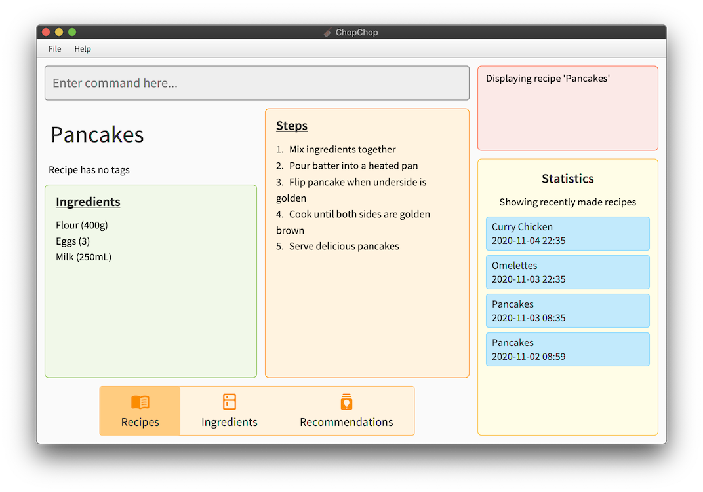 <br />
Figure 4.2: <i>The detailed recipe view</i>
</div>


<a name="ListRecipeCommand"></a>
#### 5.4.2&ensp;Listing Recipes — **`list`**`recipes`
This command shows a list of all recipes in ChopChop. You can use this to switch panes (between recipes and ingredients) without using the mouse, as well as to clear any filters that might have been applied due to previous commands (eg. `find` and `filter`).

**Usage**: `list recipes`

<div markdown="span" class="alert alert-primary">
:bulb: **Tip:** For convenience, you can use either `list recipes` or `list recipe`.
</div>

Executing this command simply brings you back to the recipe list view:

<div style="text-align: center; padding-bottom: 2em">
 <br />
Figure 5: <i>The recipe list view</i>
</div>


<a name="AddRecipeCommand"></a>
#### 5.4.3&ensp;Adding Recipes — **`add`**`recipe` (Zhia Yang)
This command adds a recipe to ChopChop, specifying zero or more ingredients, each with an optional quantity, and zero or more steps. After a recipe is added, you will be able to see it immediately in the application.

**Usage**:
```
add recipe <name>
  [/ingredient <ingredient-name> [/qty <quantity>]]...
  [/step <step>]...
  [/tag <tag-name>]...
```

Constraints:
- Recipe name should not be empty
- Ingredient names should not be empty
- Steps should not be empty
- Tag names should not be empty
- Quantities (`/qty`) must only appear after an `/ingredient`

If an ingredient is specified without a quantity, it is treated *as if* you used `/qty 1`. This works for counted ingredients (eg. eggs), but it will cause errors for other ingredients (eg. volume of milk).


For example, suppose you wanted to add a recipe for pancakes using flour, eggs, and milk, you would type this:
```
add recipe Pancakes
/ingredient flour /qty 400g
/ingredient egg /qty 3
/ingredient milk /qty 250ml
/step Mix ingredients together
/step Bake for 30 minutes at 400 celsius
/step Pour syrup and serve
```
(note that this is displayed on separate lines for clarity, but you should type this in one go)

<div style="text-align: center; padding-bottom: 2em">
 <br />
Figure 6.1: <i>The add recipe command</i>
</div>

After pressing <kbd>enter</kbd>, you will see this view, showing your newly created recipe:

<div style="text-align: center; padding-bottom: 2em">
 <br />
Figure 6.2: <i>The recipe detail view</i>
</div>

If you go back to the main recipe view (either by clicking on the tab at the bottom, or by using `list recipes`, you can see the new recipe in the list (ChopChop won't actually highlight it, but we do here for clarity):

<div style="text-align: center; padding-bottom: 2em">
 <br />
Figure 6.3: <i>The newly created recipe in the recipe list</i>
</div>


<a name="EditRecipeCommand"></a>
#### 5.4.4&ensp;Editing Recipes — **`edit`**`recipe` (Alex)

This command edits a specific recipe in ChopChop. The `edit recipe` lets you perform different actions on the name, ingredients, steps, and tags, as specified below.

To accommodate the various different kinds of editing operations, ChopChop has special syntax for editing, known as *edit-arguments*, eg. `/step:add`. The component following the colon is the *ACTION*, which can take these values:

- For ingredients and steps, it can either be `add`, `edit`, or `delete`.
- For tags, it can be either `add` or `delete`.


<h4>Name</h4>
If you want to edit a recipe's name, use `/name`, for example `/name new recipe name`.


<h4>Ingredients</h4>
If you want to edit a recipe's ingredients, use `/ingredient` with the corresponding action (eg. `/ingredient:add`).

When adding or editing ingredients, a `/qty` *must* be specified after the ingredient (similar to an `add recipe` command). Here are some examples:

- `/ingredient:add milk /qty 500ml` <br />
  This makes the recipe require 500ml of milk; if the recipe already used milk, then an error is displayed — here, you should use `/ingredient:edit` instead.

- `/ingredient:edit beef /qty 200g` <br />
  This changes the quantity of beef used in the recipe from its previous value, to 200 grams. If the recipe did not use beef as an ingredient, an error is displayed — here, you should use `/ingredient:add` instead.

- `/ingredient:delete carrot` <br />
  This removes carrots from the recipe entirely. If the recipe did not use carrots, then an error is displayed.


<h4>Tags</h4>
If you want to edit the tags for a recipe, use `/tag` with the corresponding action, which are either `add` or `delete`. For example:

- `/tag:add vegetarian` <br />
  This adds the 'vegetarian' tag to the recipe. If the recipe already contains this tag, an error is displayed.

- `/tag:delete cold` <br />
  This removes the 'cold' tag from the recipe. If the recipe did not have this tag, an error is displayed.


<h4>Steps</h4>
Since steps have a fixed ordering in a recipe, editing them is slightly more involved; when editing or deleting steps, you are required to provide the step number as an additional component in the *edit-argument*, for example `/step:edit:3` edits the third step in the recipe.

When adding a step, the step number is optional; if not specified, the new step will be added at the end. If it is specified, then the new step will be inserted at the corresponding position, and the following steps will be re-numbered.

For example:

- `/step:add Bake for 80 minutes at 400 C` <br />
  This adds a new step at the end of the existing steps of the recipe.

- `/step:edit:4 Bake for 50 minutes at 250 C` <br />
  This changes the content of step number 4, so the cake does not get burnt.

- `/step:delete:1` <br />
  This deletes the first step of the recipe.

Note that steps must be added sequentially; for instance, you cannot add step 5 to a recipe with only 2 steps.


<h4>Usage</h4>

Except `/name` (which can only appear once), all of the edit operations described above can appear multiple times, in any order, in a single `edit recipe` command. Each operation is processed sequentially from left-to-right, so if two operations modify the same item, then the second one will take precedence.

(As an example, `/step:edit:3 Bake ... /step:edit:3 Fry` will cause step 3 to be 'Fry')

**Usage**:
```
edit recipe <#REF>
  [/name <new-recipe-name>]
  [/ingredient:<action> <ingredient-name> [/qty <quantity>]]...
  [/step:<action>[:<index>] <step>]...
  [/tag:<action> <tag-name>]...
```

Examples:
- `edit recipe #4 /name soup` <br/>
	This changes the name of the fourth recipe currently shown in the GUI's view to 'soup'.

- `edit recipe pancakes /ingredient:add syrup /qty 500ml` <br/>
	This edits the recipe named 'pancakes' by adding 500ml of syrup to its ingredient list.

- `edit recipe risotto /step:edit:1 In a saucepan, warm the broth over low heat` <br/>
  This edits the recipe named 'risotto' by changing the 1st step to the text above.

- `edit recipe beef curry /ingredient:delete apple /step:delete:4` <br/>
  This edits the recipe named 'beef curry' to remove both the ingredient 'apple' as well as the 4th step.

To illustrate how to use this powerful command, let us recreate the Pancake recipe from above, but starting from a blank recipe. First, we make the empty recipe using `add recipe Pancakes`:

<!-- to editors: don't mind the image names, i cut out some steps for brevity and i'm lazy to rename the files. -->
<div style="text-align: center; padding-bottom: 2em">
 <br />
Figure 7.1: <i>The empty recipe</i>
</div>

Now, let's add our ingredients, using `/ingredient:add`; first, 400 grams of flour:

<div style="text-align: center; padding-bottom: 2em">
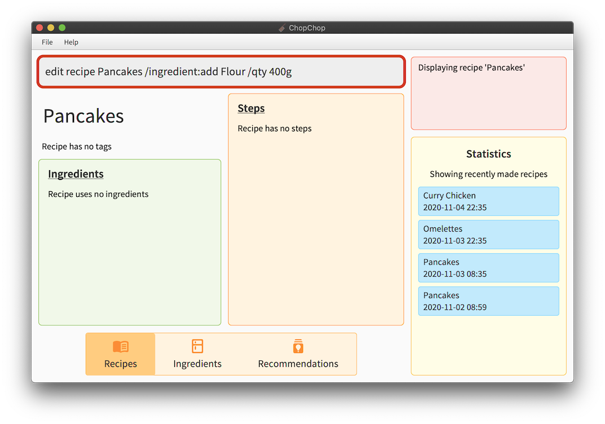 <br />
Figure 7.2: <i>The command to add a new ingredient to the recipe</i>
</div>

Next, adding the eggs and milk in one go:

<div style="text-align: center; padding-bottom: 2em">
 <br />
Figure 7.3: <i>The edit command supports multiple operations at once</i>
</div>

Oops, that's too many eggs, so let's edit the quantity using `/ingredient:edit`:

<div style="text-align: center; padding-bottom: 2em">
 <br />
Figure 7.4: <i>Editing an ingredient to change its quantity</i>
</div>

<div style="text-align: center; padding-bottom: 2em">
 <br />
Figure 7.5: <i>The recipe now uses only 3 eggs</i>
</div>

Now let's add the steps with `/step:add`:

<div style="text-align: center; padding-bottom: 2em">
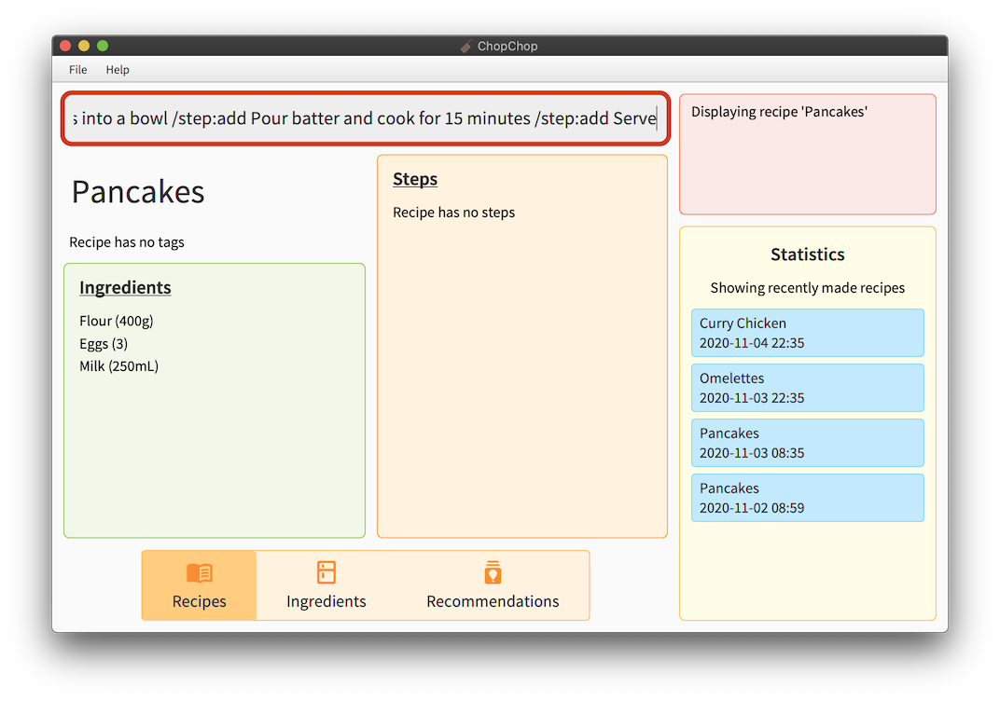 <br />
Figure 7.6: <i>Multiple steps can be added at the same time</i>
</div>

<div style="text-align: center; padding-bottom: 2em">
 <br />
Figure 7.7: <i>The finished recipe</i>
</div>

Wait, we forgot to mix the ingredients together! Let's fix it by inserting a new step 2 with `/step:add:2`:

<div style="text-align: center; padding-bottom: 2em">
 <br />
Figure 7.8: <i>Adding a new step in the second position</i>
</div>

Oh no, we also forgot the most important thing — syrup! So let's modify the last step (4) to include syrup with `/step:edit:4`:

<div style="text-align: center; padding-bottom: 2em">
 <br />
Figure 7.9: <i>Editing the last step</i>
</div>

And now the pancake recipe is complete!

<div style="text-align: center; padding-bottom: 2em">
 <br />
Figure 7.10: <i>The finished recipe</i>
</div>


<a name="DeleteRecipeCommand"></a>
#### 5.4.5&ensp;Deleting Recipes — **`delete`**`recipe`

This command deletes a specific recipe from ChopChop. Don't worry if you did this accidentally, because commands can be undone! (see: [undo](#UndoCommand)).

**Usage**: `delete recipe <#REF>`

Examples:
- `delete recipe #4` <br />
	This deletes the fourth recipe currently shown in the GUI's view.
- `delete recipe pancakes` <br />
	This deletes the recipe named 'pancakes'. Note that the name here is case insensitive.

In this example, `delete recipe #7` will delete the **Pancakes** recipe:

<div style="text-align: center; padding-bottom: 2em">
 <br />
Figure 8: <i>The initial list of ingredients</i>
</div>


<a name="FindRecipeCommand"></a>
#### 5.4.6&ensp;Finding Recipes — **`find`**`recipe`

This command finds all recipes containing the given keywords in the name.

**Usage**: `find recipe <keyword> [<keyword>]...`

Constraints:
- At least one search keyword must be given

Only the recipe name is searched, and only full words are matched, case-insensitively. In the case of multiple search keywords, recipes containing any of those words will be returned.

Examples:
- `find recipe cake` will match **Chocolate Cake** and **Strawberry Cake**, but *not* **Pancakes**.
- `find recipe milk cake` will match **Milk Tea** and **Carrot Cake**.

To illustrate, suppose you want to search for recipes with names containing 'cake', you would use `find recipe cake`:
<div style="text-align: center; padding-bottom: 2em">
 <br />
Figure 9.1: <i>The initial list of recipes</i>
</div>

After executing the command, note how the recipe list has changed, showing only the matching recipes, and that item number in the corners have changed as well. As explained above, the 'Pancakes' recipe was not included in this list:

<div style="text-align: center; padding-bottom: 2em">
 <br />
Figure 9.2: <i>The recipes containing 'cake'</i>
</div>

To go back to the full recipe view (resetting the search filter), you can either click the Recipes button at the bottom, or run the `list recipes` command:

<div style="text-align: center; padding-bottom: 2em">
 <br />
Figure 9.3: <i>Back to the main recipe list</i>
</div>


<a name="FilterRecipeCommand"></a>
#### 5.4.7&ensp;Filtering Recipes — **`filter`**`recipe` (Jialei)

This command filters all recipes and lists those containing all given name, tag and ingredient keywords.

**Usage**:
```
filter recipe
  [/name <name-keywords>...]...
  [/tag <tag-keywords>...]...
  [/ingredient <ingredient-keywords>...]...
```

- Keywords do not have to be complete to match the 'name', 'tag' or 'ingredient' names.
- Multiple search terms from the same category are allowed. e.g. `/tag movie /tag family`
- Search terms can be placed in any order.
- The filtering is case-insensitive and allows spaces between keywords in a single search term. e.g. `/tag family favourite` is allowed.

Constraints:
- At least one search term must be given, and they should be either `/name`, `/tag` or `/ingredient`.
- Search terms must not be empty.

Examples:
- `filter recipe /name ginger`<br />
  This matches **Gingerbread Man** and **Ginger Chicken Soup**, the only recipes which names include **ginger**.
  
- `filter recipe /name sweet /name cake`<br />
  This matches **Sweet Choco Cake** and **Sweet Caramel Cake**, the only recipes which names include both **sweet** and **cake**.
  
- `filter recipe /tag family reunion`<br />
  This matches **Spring Rolls** and **Hot Pot**, the only recipes with 'tag' **family reunion**.

- `filter recipe /tag snacks /tag sweet` <br />
  This matches **Chocolate Cookie** and **Gummy Bears**, the only recipes with both 'tag' **snacks** and 'tag' **sweet**.

- `filter recipe /ingredient eggs` <br />
  This matches **Egg Tart** and **Scrambled Eggs**, assuming they are the only recipes using **eggs**.

- `filter recipe /ingredient chicken /ingredient cheese /ingredient pineapple` <br />
  This matches **Chicken Quesadilla**, assuming it is the only recipe using **chicken**, **cheese**, and **pineapple**.

- `filter recipe /tag local dish /name chicken /ingredient chicken /ingredient white rice /tag family favourite /name rice` <br />
  This matches **Chicken Rice**, assuming it is the only recipe that matches all the criteria specified.

To illustrate, suppose you had the following two recipes:

<div style="text-align: center; padding-bottom: 2em">
  
   <br /> <br />
  Figure 10.1: <i>The starting recipes</i>
</div>

Then, you wanted to search for recipes with tags **christmas** and **baked**, using ingredients **honey**, **ginger root**, and **molasses**, and whose names contain keywords **ginger** and **bread** — you would use this command (separated into lines for clarity):
```
filter recipe
  /name men /name bread
  /tag christmas /tag baked
  /ingredient honey /ingredient ginger /ingredient molasses
```

After executing the command, similar to the effect of [`find recipe`](#FindRecipeCommand) command, the recipe list has changed, showing only the matching recipe, **Gingerbread Men**:

<div style="text-align: center; padding-bottom: 2em">
 <br />
Figure 10.2: <i>Only one recipe matched all the provided criteria</i>
</div>

Note how the search term `ginger` matched the ingredient `ginger root`, the search term `baked` matched the tag `home baked`, and search terms `men` and `bread` matched the name`Gingerbread Men`. Again, to reset the search filter or go back to the full recipe view, you can click the Recipes button or run the `list recipes` command.


<a name="MakeRecipeCommand"></a>
#### 5.4.8&ensp;Making Recipes — **`make`**`recipe`
This command allows you to <i>make</i> a recipe, which will add it to the statistics tracker, and deduct the appropriate amounts from ChopChop's internal ingredient inventory.

If you do not have sufficient ingredients to make the recipe, an error message is shown. After the recipe is made, you will be brought to the ingredient list showing the updated ingredient amounts.

**Usage**: `make recipe <#REF>`

Examples:
- `make recipe pancakes` <br />
  This makes the recipe named 'pancakes'. Note that the name here is case insensitive.

To illustrate suppose you wanted to make the pancakes here, you would use `make recipe pancakes`. You can run this command from any view (not necessarily from the recipe detail view):
<div style="text-align: center; padding-bottom: 2em">
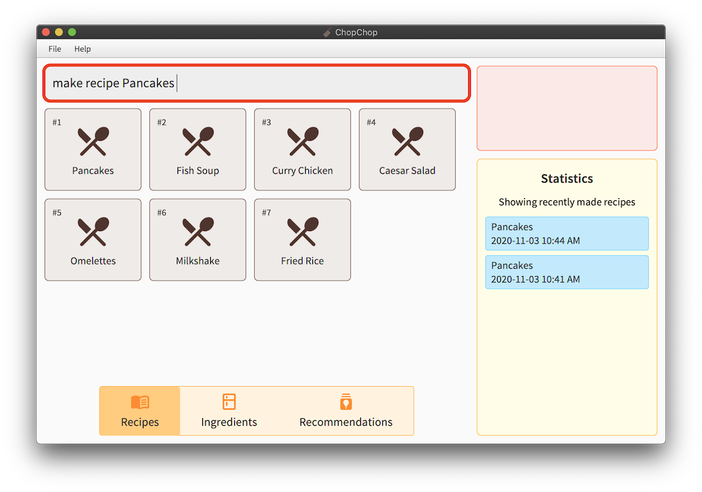 <br />
Figure 11.1: <i>Making pancakes</i>
</div>

After pressing <kbd>enter</kbd>, ChopChop will open up the recipe that you've just made:

<div style="text-align: center; padding-bottom: 2em">
 <br />
Figure 11.2: <i>The detailed recipe view</i>
</div>

If there are ingredients that are missing, or that you have insufficient amounts of, ChopChop will display this message in the command output window:

<div style="text-align: center; padding-bottom: 2em">
 <br />
Figure 11.3: <i>Insufficient ingredients to make the pancakes</i>
</div>


<br/><br/>
<hr/>
<br/>

<a name="GroupIngredientCommands"></a>
### 5.5&ensp;Ingredient Commands

These commands allow you to add, delete, and edit ingredients.

<a name="ListIngredientCommand"></a>
#### 5.5.1&ensp;Listing Ingredients — **`list`**`ingredients`
This command shows a list of all recipes in ChopChop. As with the `list recipes` command, you can use this command to switch between panes without clicking, or to reset any filters.

**Usage**: `list ingredients`

<div markdown="span" class="alert alert-primary">
:bulb: **Tip:** For convenience, you can use either `list ingredients` or `list ingredient`.
</div>

<div style="text-align: center; padding-bottom: 2em">
 <br />
Figure 12: <i>The ingredient list view</i>
</div>


<a name="AddIngredientCommand"></a>
#### 5.5.2&ensp;Adding Ingredients — **`add`**`ingredient` (Zhia Yang)
This command adds an ingredient to ChopChop, with an optional quantity and expiry date:
- If the quantity is not specified, ChopChop will infer a counted quantity, like eggs.
- If the expiry date is not specified, it is assumed that the ingredient (eg. salt) does not expire.

As mentioned in the overview above, an ingredient can consist of multiple sets; the `add ingredient` command will intelligently *combine* ingredients as appropriate.

<div markdown="span" class="alert alert-primary">
:information_source: **Note:** Ingredients need to have compatible units in order to be combined; see [this section](#QuantitiesAndUnits) for how it works.
</div>

If the new ingredient has `/tag` options that are not present in the existing ingredient, then they are added as well.

**Usage**:
```
add ingredient <name>
  [/qty <quantity>]
  [/expiry <expiry-date>]
  [/tag <tag-name>]...
```

Examples:
- `add ingredient milk /qty 1l /expiry 2020-11-09` adds one litre of milk that expires on the 9th of November.
- `add ingredient egg /expiry 2020-12-25` adds one egg that expires on Christmas day.

Suppose you just finished a grocery run, and want to add the items to ChopChop. First, you have 2 cartons of milk:

<div style="text-align: center; padding-bottom: 2em">
 <br />
Figure 13.1: <i>Adding 2 litres of milk</i>
</div>

Since ChopChop did not know about 'milk' previously, a new ingredient entry is created for it:

<div style="text-align: center; padding-bottom: 2em">
 <br />
Figure 13.2: <i>The newly added milk ingredient</i>
</div>

Next, suppose you also bought 24 blueberries:

<div style="text-align: center; padding-bottom: 2em">
 <br />
Figure 13.3: <i>Adding 24 blueberries</i>
</div>

This time, since ChopChop already knew about blueberries, our previous 19 blueberries now become 43:

<div style="text-align: center; padding-bottom: 2em">
 <br />
Figure 13.4: <i>You now have 43 blueberries</i>
</div>

If you try to add an ingredient with incompatible quantities (for example, suppose you did not want to count the blueberries individually, and you only know that you bought a 400 gram box), ChopChop will display an error message, and not update the ingredient:

<div style="text-align: center; padding-bottom: 2em">
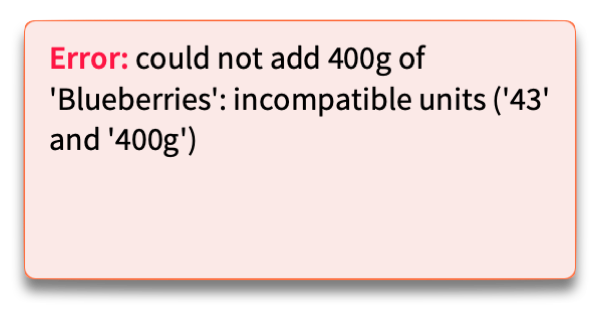 <br />
Figure 13.5: <i>Ingredients must have compatible units to be combined</i>
</div>


<a name="DeleteIngredientCommand"></a>
#### 5.5.3&ensp;Deleting Ingredients — **`delete`**`ingredient`

This command deletes a specific ingredient from ChopChop. Similar to the `add ingredient` command, this command also allows you to delete quantities of ingredients instead of the whole ingredient. In this scenario, ChopChop will intelligently remove the earliest-expiring ingredients first.

If `/qty` is not specified, then the behaviour of this command is to completely remove the ingredient from ChopChop. Worry not: if you accidentally delete something, you can always [`undo`](#UndoCommand) it.

<div markdown="span" class="alert alert-primary">
:information_source: **Note:** If specified, the quantity needs to have compatible units with the existing ingredient; see [this section](#QuantitiesAndUnits) for how it works.
</div>

**Usage**: `delete ingredient <#REF> [/qty <quantity>]`

Examples:
- `delete ingredient #4` <br />
	This deletes the fourth ingredient currently shown in the GUI's view.
- `delete ingredient milk /qty 500ml` <br />
	This removes 500ml of milk from ChopChop's inventory.

To illustrate, suppose that you poured yourself a glass of cold milk to drink, without making a recipe. To tell ChopChop that there is less milk in the fridge, you would use this command:

<div style="text-align: center; padding-bottom: 2em">
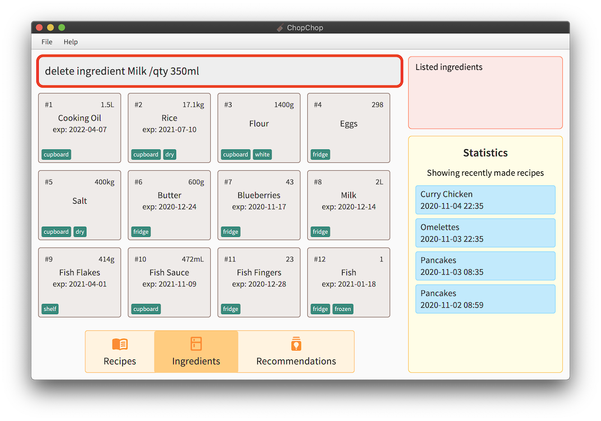 <br />
Figure 14.1: <i>Removing 350ml of milk</i>
</div>

Notice how the amount of milk decreased from 2 litres to 1.65 litres:

<div style="text-align: center; padding-bottom: 2em">
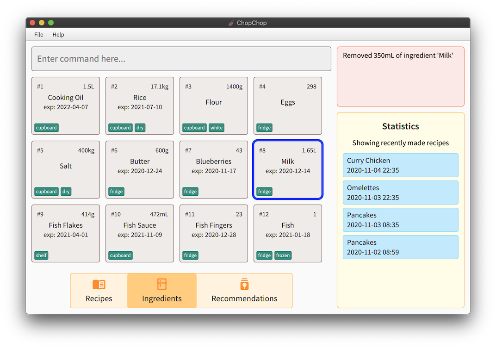 <br />
Figure 14.2: <i>You now only have 1.65 litres of milk left</i>
</div>


<a name="FindIngredientCommand"></a>
#### 5.5.4&ensp;Finding Ingredients — **`find`**`ingredient`
This command finds all ingredients containing the given keywords in the name, and it works identically to the `find recipe` command [above](#FindRecipeCommand).

Constraints:
- At least one search keyword must be given

**Usage**: `find ingredient <keyword> [<keyword>]...`

For example, suppose you wanted to find all ingredients containing fish (not in the literal sense, but only in their name):

<div style="text-align: center; padding-bottom: 2em">
 <br />
Figure 15.1: <i>The complete ingredient list</i>
</div>

Now, only the matching ingredients are shown:

<div style="text-align: center; padding-bottom: 2em">
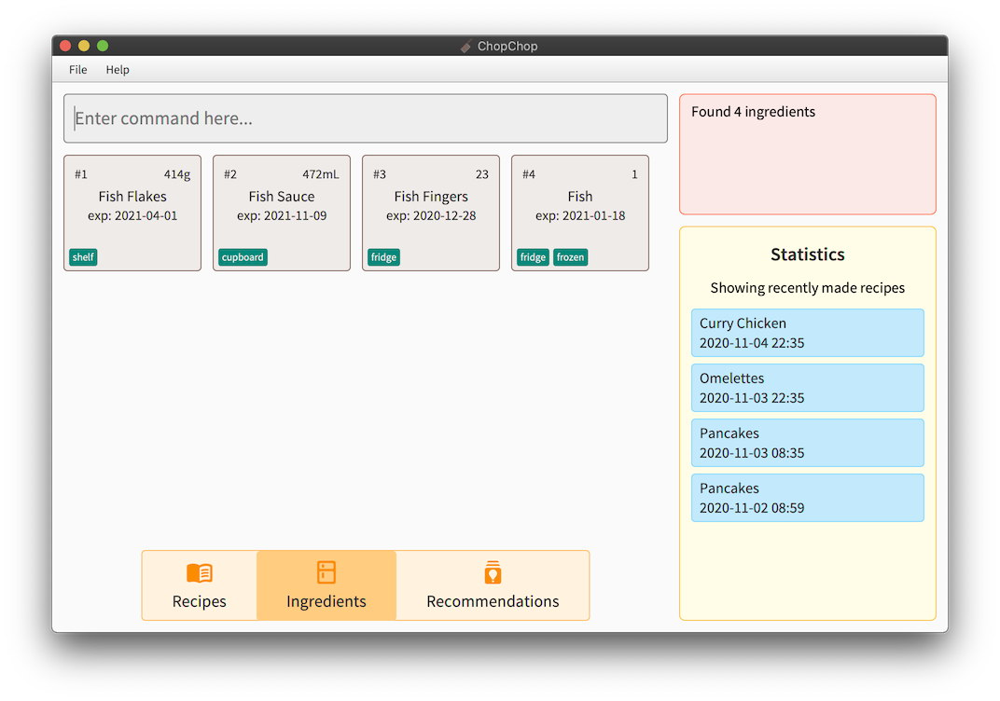 <br />
Figure 15.2: <i>Only ingredients containing 'fish' in their name are shown</i>
</div>

Again, you can either click the Ingredients button, or use `list ingredients` to clear the search filter.


<a name="FilterIngredientCommand"></a>
#### 5.5.5&ensp;Filtering Ingredients — **`filter`**`ingredient` (Jialei)

This command filters all ingredients and lists those that match all the name keywords, tags and expiry dates specified in the command.

**Usage**:
```
filter ingredient
  [/name <name-keywords>...]...
  [/expiry <expiry-date>]
  [/tag <tag-keywords>...]...
```

- Keywords following `/tag` and `/name` do not have to be complete to match the 'tag' or the ingredient's 'name'.
- `/expiry <expiry-date>` filters the ingredients and only lists those that expire before the date provided.
- When there are multiple expiry dates specified, only the earliest one will be considered.
- Except for the changes in the search fields, this feature works identically to the [`filter recipe`](#FilterRecipeCommand) command above.

Constraints:
- At least one search term must be given, and they should be either `/name`, `/expiry` or `/tag`.
- Search terms must not be empty.

Examples:
- `filter ingredient /name dark chocolate` <br />
  This matches **dark chocolate** and **dark chocolate syrup**, assuming they are the only ingredients whose names contain **dark chocolate**.
  
- `filter ingredient /name dark chocolate /syrup` <br />
  This matches **dark chocolate syrup**, assuming it is the only ingredient whose name contains both **dark chocolate** and **syrup**.

- `filter ingredient /tag bitter taste` <br />
  This matches **bitter melon** and **dark chocolate**, assuming they are the only ingredients tagged with **bitter taste**.

- `filter ingredient /tag frequently used /tag sweet` <br />
  This matches **sugar**, if it is the only ingredient tagged both **frequently used** and **sweet**.

- `filter ingredient /expiry 2020-12-01 /expiry 2020-10-31 /expiry 2023-01-01` <br />
  This matches **apple**, if it is the only ingredient expiring before **2020-10-31**. Note that only the earliest date is considered here (in this case, 31st October 2020), and the rest are ignored.

- `filter ingredient /tag powdery /expiry 2020-12-31 /tag bakery /name soda` <br />
  This matches **baking soda**, assuming it is the only ingredient that matches all the specified criteria.

To illustrate, suppose you want to search for ingredients tagged both **bakery** and **sweet**, expiring before **2021-12-31** and containing **sugar** in the name; you can use `filter ingredient /tag bakery /expiry 2021-12-31 /tag sweet /name sugar`:

<div style="text-align: center; padding-bottom: 2em">
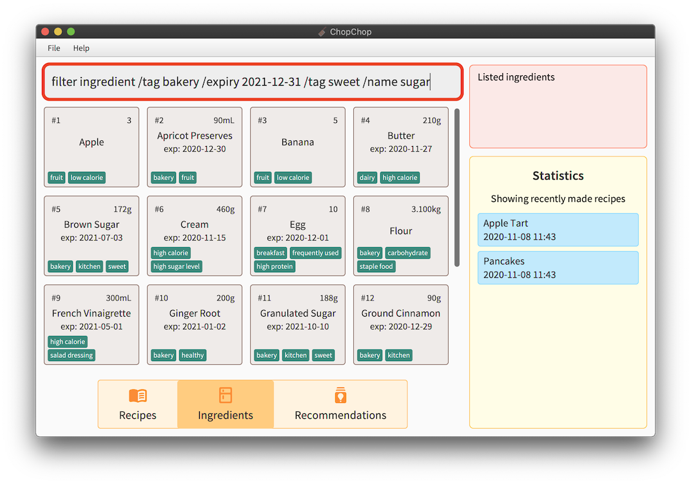 <br />
Figure 16.1: <i>The initial list of ingredients</i>
</div>

After executing the command, similar to the effect of **filter recipe** command, the ingredient list has changed, showing the only matching ingredients, **Brown Sugar** and **Granulated Sugar**:

<div style="text-align: center; padding-bottom: 2em">
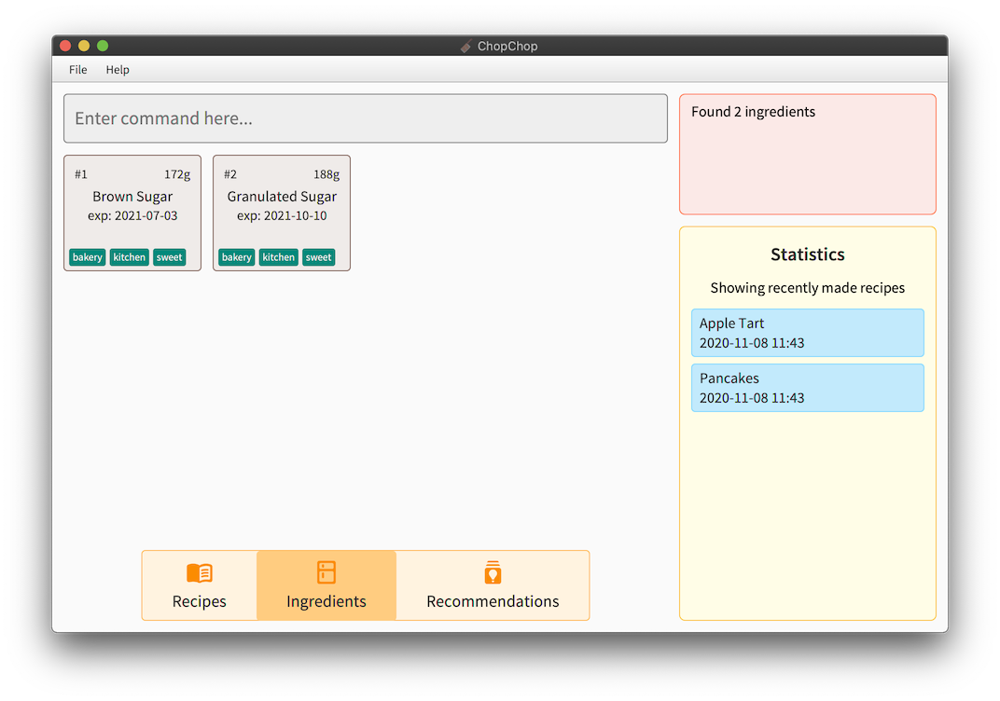 <br />
Figure 16.2: <i>The ingredients matching all the provided criteria</i>
</div>

Note that **Honey**, which was also tagged **bakery** and **sweet** and would expire before **2021-12-31**, was not included because its name does not contain **sugar**.

Again, to reset the search filter or go back to the full ingredient view, you can click the Ingredients button or run the `list ingredients` command.


<a name="EditIngredientCommand"></a>
#### 5.5.6&ensp;Editing Ingredients — **`edit`**`ingredient`

This command edits the given ingredient, in a similar fashion to the [`edit recipe`](#EditRecipeCommand) command. However, currently its functionality is limited to only editing the tags of an ingredient (more features coming soon!).

Again, do refer to the documention on the [`edit recipe`](#EditRecipeCommand) above to find out how edit-descriptors work; this command currently only supports `/tag:add` and `/tag:delete`.

It is an error to delete a tag from an ingredient that did not contain that tag, and similarly to add a duplicate tag to an ingredient.

**Usage**:
```
edit ingredient <#REF>
  [/tag:<action> <tag-name>]...
```

Examples:
- `edit ingredient #4 /tag:add frozen` <br/>
  This tags the fourth ingredient currently shown in the GUI's view with **frozen**.

- `edit ingredient sprinkles /tag:delete fridge` <br/>
  This removes the tag **fridge** from the ingredient named 'sprinkles'.


<br/><br/>
<hr/>
<br/>
<a name="GroupStatsCommands"></a>

### 5.6&ensp;Statistics Commands (Travis)

Whenever you make a recipe or consume an ingredient, ChopChop saves a record of the usage. You can view these records with the commands below.

The output of these statistics commands are shown in the [statistics box](#StatisticsBox) on the right side of ChopChop's interface.


<a name="StatsRecipeTopCommand"></a>
#### 5.6.1&ensp;Listing Top Recipes — **`stats`**`recipe top`

This command shows a list of recipes that were made the most, in descending order (the recipe listed first was made the most number of times).

Note that, even if a recipe was deleted (with `delete recipe`), its cooking records will still exist in ChopChop. To remove these statistics, you can use `stats recipe clear` to clear them for all recipes.

**Usage**: `stats recipe top`

For example, here is the output for someone who really really loves pancakes:

<div style="text-align: center; padding-bottom: 2em">
 <br />
Figure 17: <i>No pancakes were sacrificed for this picture</i>
</div>


<a name="StatsRecipeRecentCommand"></a>
#### 5.6.2&ensp;Listing Recent Recipes — **`stats`**`recipe recent`

This command shows a list of the 10 recently made recipes, with the most recent one at the top of the list. As with the other statistics commands, deleting a recipe from ChopChop does not delete it from this list.

Note that this is also the view that is displayed by default when no statistics commands have been used yet.

**Usage**: `stats recipe recent`

<div style="text-align: center; padding-bottom: 2em">
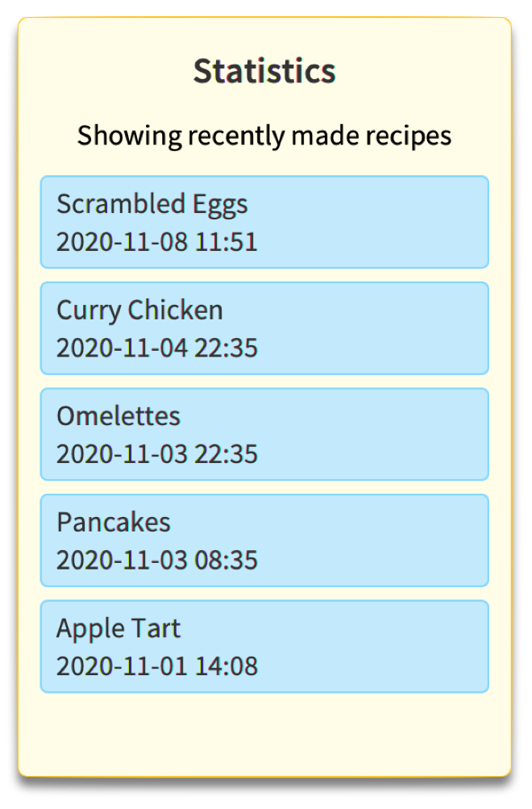 <br />
Figure 18: <i>The recently-made recipes view</i>
</div>


<a name="StatsRecipeMadeCommand"></a>
#### 5.6.3&ensp;Listing Recipes within a Time Frame — **`stats`**`recipe made`

This command shows a list of recipes that were made within the given time frame, arranged in descending chronological order. You can specify the lower bound (earliest date/time), upper bound (latest date/time), both, or neither.

**Usage**: `stats recipe made [/before <date-time>] [/after <date-time>]`

The format of `<date-time>` is as such: `yyyy-mm-dd [hh:mm]`, where `yyyy-mm-dd` is the [familiar date format](#DateFormats), and `hh:mm` is the optional time in 24-hour format (eg. `18:30` for 6.30pm).

If the time component is omitted, it is assumed to be midnight of the given day. If both `/before` and `/after` are omitted, then ChopChop shows recipes made on the current day, ie. from midnight to 23:59.

Examples:
- `stats recipe made` <br />
  This shows all recipes made since the beginning of the current day

- `stats recipe made /after 2020-04-15` <br />
  This shows all recipes made after the 15th of April, 2020

- `stats recipe made /before 2020-12-25` <br />
  This shows all recipes made before the 25th of December, 2020

- `stats recipe made /after 2020-04-15 /before 2020-12-25` <br />
  This shows all recipes made between the 15th of April and 25th of December

- `stats recipe made /after 2020-01-01 08:00 /before 2020-01-01 23:00` <br />
  This shows all recipes made between 8am and 11pm on the 1st of January


For example, `stats recipe made /after 2020-11-02 /before 2020-11-04 23:00` shows this output:

<div style="text-align: center; padding-bottom: 2em">
 <br />
Figure 19: <i>Showing the recipes made between a date range</i>
</div>

Meanwhile, just executing `stats recipe made` only shows the recipes made on the current day:

<div style="text-align: center; padding-bottom: 2em">
 <br />
Figure 20: <i>Showing the recipes made on the current day</i>
</div>


<a name="StatsRecipeClearCommand"></a>
#### 5.6.4&ensp;Clearing Recipe History — **`stats`**`recipe clear`

This command clears the history of the recipes that you've made from ChopChop. If you did this accidentally, don't worry, because you can [undo](#UndoCommand) this.

**Usage**: `stats recipe clear`


<a name="StatsIngredientRecentCommand"></a>
#### 5.6.5&ensp;Listing Recent Ingredients — **`stats`**`ingredient recent`

This command shows a list of the 10 most recently-used ingredients consumed by `make`-ing recipes. The output format is identical to that of [`stats recipe recent`](#StatsRecipeRecentCommand) as discussed above, so it will be omitted for brevity.

**Usage**: `stats ingredient recent`


<a name="StatsIngredientUsedCommand"></a>
#### 5.6.6&ensp;Listing Ingredients within a Time Frame — **`stats`**`ingredient used`

This command shows a list of ingredients that were used within the given time frame, arranged in descending chronological order. You can specify the lower bound (earliest date/time), upper bound (latest date/time), both, or neither.

This command behaves similarly to [`stats recipe made`](#StatsRecipeMadeCommand) as discussed above, except that `made` is replaced with `used` instead. Otherwise, the arguments (`/before`, `/after`) function identically.

**Usage**: `stats ingredient used`


<a name="StatsIngredientClearCommand"></a>
#### 5.6.7&ensp;Clearing Ingredient History — **`stats`**`ingredient clear`

This command clears the history of the ingredients that you've used in ChopChop. If you did this accidentally, don't worry, because you can [undo](#UndoCommand) this.

**Usage**: `stats ingredient clear`


<a name="CommandSummary"></a>
### 5.7&ensp;Command Summary

For easy reference, here are the commands that ChopChop supports, listed in alphabetical order. You can click on the name of the command to go to its section in the User Guide.

<!-- why is this table in html? because markdown is the WORST of both worlds. -->
<!-- you can't put line breaks in code blocks inside markdown table cells. sucks to be you. -->
<!-- &lt; and &gt; all day every day. -->
<table style="width: 100%">
<thead>
  <tr>
    <th>Command</th>
    <th>Description</th>
    <th>Syntax Summary</th>
    <th>Undo</th>
  </tr>
</thead>
<tbody>
  <tr>
    <td><a href="#AddIngredientCommand">add ingredient</a></td>
    <td>Adds a new ingredient, or increases the quantity of an existing ingredient</td>
    <td><pre>
add ingredient &lt;name&gt;
  [/qty &lt;quantity&gt;]
  [/expiry &lt;expiry-date&gt;]
  [/tag &lt;tag-name&gt;]...
</pre></td>
    <td><b>YES</b></td>
  </tr><tr>
    <td><a href="#AddRecipeCommand">add recipe</a></td>
    <td>Adds a new recipe</td>
    <td><pre>
add recipe &lt;name&gt;
  [/ingredient &lt;name&gt;
    [/qty &lt;quantity&gt;]]...
  [/step &lt;step&gt;]...
  [/tag &lt;tag-name&gt;]...
</pre></td>
    <td><b>YES</b></td>
  </tr><tr>
    <td><a href="#DeleteIngredientCommand">delete ingredient</a></td>
    <td>Completely deletes an ingredient, or removes some quantity of it</td>
    <td><pre>
delete ingredient &lt;#REF&gt;
  [/qty &lt;quantity&gt;]
</pre></td>
    <td><b>YES</b></td>
  </tr><tr>
    <td><a href="#DeleteRecipeCommand">delete recipe</a></td>
    <td>Completely deletes a recipe</td>
    <td><pre>
delete recipe &lt;#REF&gt;
</pre></td>
    <td><b>YES</b></td>
  </tr><tr>
    <td><a href="#EditIngredientCommand">edit ingredient</a></td>
    <td>Edits an existing ingredient</td>
    <td><pre>
edit ingredient &lt;#REF&gt;
  [/tag:&lt;action&gt;
    &lt;tag-name&gt;]...
</pre></td>
    <td><b>YES</b></td>
  </tr><tr>
    <td><a href="#EditRecipeCommand">edit recipe</a></td>
    <td>Edits an existing recipe</td>
    <td><pre>
edit recipe &lt;#REF&gt;
  [/name &lt;new-recipe-name&gt;]
  [/ingredient:&lt;action&gt;
    &lt;ingredient-name&gt;
    [/qty &lt;quantity&gt;]
  ]...
  [/step:&lt;action&gt;[:&lt;index&gt;]
    &lt;step&gt;]...
  [/tag:&lt;action&gt;
    &lt;tag-name&gt;]...
</pre></td>
    <td><b>YES</b></td>
  </tr><tr>
    <td><a href="#FilterIngredientCommand">filter ingredient</a></td>
    <td>Searches for ingredients by one or more filtering criteria</td>
    <td><pre>
filter ingredient
  [/name &lt;name-keywords&gt;...]...
  [/expiry &lt;expiry-date&gt;]
  [/tag &lt;tag-keywords&gt;...]...
</pre></td>
    <td><b>NO</b></td>
  </tr><tr>
    <td><a href="#FilterRecipeCommand">filter recipe</a></td>
    <td>Searches for recipes by one or more filtering criteria</td>
    <td><pre>
filter recipe
  [/name &lt;name-keywords&gt;...]...
  [/tag &lt;tag-keywords&gt;...]...
  [/ingredient
    &lt;ingr-keywords&gt;...]...
</pre></td>
    <td><b>NO</b></td>
  </tr><tr>
    <td><a href="#FindIngredientCommand">find ingredient</a></td>
    <td>Searches for ingredients by their name</td>
    <td><pre>
find ingredient &lt;keyword&gt;
  [&lt;keyword&gt;]...
</pre></td>
    <td><b>NO</b></td>
  </tr><tr>
    <td><a href="#FindRecipeCommand">find recipe</a></td>
    <td>Searches for recipes by their name</td>
    <td><pre>
find recipe &lt;keyword&gt;
  [&lt;keyword&gt;]...
</pre></td>
    <td><b>NO</b></td>
  </tr><tr>
    <td><a href="#HelpCommand">help</a></td>
    <td>Shows help in general, or help for specific commands</td>
    <td><pre>
help [&lt;command-name&gt;
  [&lt;command-target&gt;]]
</pre></td>
    <td><b>NO</b></td>
  </tr><tr>
    <td><a href="#ListIngredientCommand">list ingredient</a></td>
    <td>Shows the main ingredient list, and clears any search filters</td>
    <td><pre>
list ingredients
</pre></td>
    <td><b>NO</b></td>
  </tr><tr>
    <td><a href="#ListRecipeCommand">list recipe</a></td>
    <td>Shows the main recipe list, and clears any search filters</td>
    <td><pre>
list recipes
</pre></td>
    <td><b>NO</b></td>
  </tr><tr>
    <td><a href="#MakeRecipeCommand">make recipe</a></td>
    <td>Makes a recipe, consuming ingredients and recording statistics</td>
    <td><pre>
make recipe &lt;#REF&gt;
</pre></td>
    <td><b>YES</b></td>
  </tr><tr>
    <td><a href="#QuitCommand">quit</a></td>
    <td>Exits ChopChop</td>
    <td><pre>
quit
</pre></td>
    <td><b>NO</b></td>
  </tr><tr>
    <td><a href="#RedoCommand">redo</a></td>
    <td>Redoes a command that was previously undone</td>
    <td><pre>
redo
</pre></td>
    <td><b>NO</b></td>
  </tr><tr>
    <td><a href="#StatsRecipeClearCommand">stats recipe clear</a></td>
    <td>Clear cooked recipe history</td>
    <td><pre>
stats recipe clear
</pre></td>
    <td><b>YES</b></td>
  </tr><tr>
    <td><a href="#StatsRecipeMadeCommand">stats recipe made</a></td>
    <td>Shows recipes made within a given time frame</td>
    <td><pre>
stats recipe made
  [/after &lt;date-time&gt;]
  [/before &lt;date-time&gt;]
</pre></td>
    <td><b>NO</b></td>
  </tr><tr>
    <td><a href="#StatsRecipeRecentCommand">stats recipe recent</a></td>
    <td>Shows recently made recipes</td>
    <td><pre>
stats recipe recent
</pre></td>
    <td><b>NO</b></td>
  </tr><tr>
    <td><a href="#StatsRecipeTopCommand">stats recipe top</a></td>
    <td>Shows the top recipes</td>
    <td><pre>
stats recipe top
</pre></td>
    <td><b>NO</b></td>
  </tr><tr>
    <td><a href="#StatsIngredientClearCommand">stats ingredient clear</a></td>
    <td>Clear ingredient usage history</td>
    <td><pre>
stats ingredient clear
</pre></td>
    <td><b>YES</b></td>
  </tr><tr>
    <td><a href="#StatsIngredientRecentCommand">stats ingredient recent</a></td>
    <td>Shows recently used ingredients</td>
    <td><pre>
stats ingredient recent
</pre></td>
    <td><b>NO</b></td>
  </tr><tr>
    <td><a href="#StatsIngredientUsedCommand">stats ingredient used</a></td>
    <td>Shows ingredients used within a given time frame</td>
    <td><pre>
stats ingredient used
  [/after &lt;date-time&gt;]
  [/before &lt;date-time&gt;]
</pre></td>
    <td><b>NO</b></td>
  </tr><tr>
    <td><a href="#UndoCommand">undo</a></td>
    <td>Undoes a command that was previously executed</td>
    <td><pre>
undo
</pre></td>
    <td><b>NO</b></td>
  </tr><tr>
    <td><a href="#ViewRecipeCommand">view</a></td>
    <td>Opens the detailed view for a recipe</td>
    <td><pre>
view recipe &lt;#REF&gt;
</pre></td>
    <td><b>NO</b></td>
  </tr>
</tbody></table>


<!--

| Command                                      | Description                                                                | Undoable |
|----------------------------------------------|----------------------------------------------------------------------------|----------|
| [add ingredient](#AddIngredientCommand)      | Adds a new ingredient, or increases the quantity of an existing ingredient | **YES**  |
| [add recipe](#AddRecipeCommand)              | Adds a new recipe                                                          | **YES**  |
| [delete ingredient](#DeleteIngredientCommand)| Completely deletes an ingredient, or removes some quantity of it           | **YES**  |
| [delete recipe](#DeleteRecipeCommand)        | Completely deletes a recipe                                                | **YES**  |
| [edit recipe](#EditRecipeCommand)            | Edits an existing recipe                                                   | **YES**  |
| [filter ingredient](#FilterIngredientCommand)| Searches for ingredients by one or more filtering criteria                 | **NO**   |
| [filter recipe](#FilterRecipeCommand)        | Searches for recipes by one or more filtering criteria                     | **NO**   |
| [find ingredient](#FindIngredientCommand)    | Searches for ingredients by their name                                     | **NO**   |
| [find recipe](#FindRecipeCommand)            | Searches for recipes by their name                                         | **NO**   |
| [help](#HelpCommand)                         | Shows help in general, or help for specific commands                       | **NO**   |
| [list ingredient](#ListIngredientCommand)    | Shows the main ingredient list, and clears any search filters              | **NO**   |
| [list recipe](#ListRecipeCommand)            | Shows the main recipe list, and clears any search filters                  | **NO**   |
| [make](#MakeRecipeCommand)                   | Makes a recipe, consuming ingredients and recording statistics             | **YES**  |
| [quit](#QuitCommand)                         | Exits ChopChop                                                             | **NO**   |
| [redo](#RedoCommand)                         | Redoes a command that was previously undone                                | **NO**   |
| [stats recipe top](#StatsRecipeTopCommand)              | Shows the top recipes                                           | **NO**   |
| [stats recipe recent](#StatsRecipeRecentCommand)        | Shows the recently made recipes                                 | **NO**   |
| [stats recipe made](#StatsRecipeMadeCommand)            | Shows the recipes made within the given time frame              | **NO**   |
| [stats recipe clear](#StatsClearRecipeCommand)          | Clear recipe usage records                                      | **YES**  |
| [stats ingredient recent](#StatsIngredientRecentCommand)| Shows the recently used ingredients                             | **NO**   |
| [stats ingredient made](#StatsIngredientUsedCommand)    | Shows the ingredient used within the given time frame           | **NO**   |
| [stats ingredient clear](#StatsIngredientClearCommand)  | Clear ingredient usage records                                  | **YES**  |
| [undo](#UndoCommand)                         | Undoes a command that was previously executed                              | **NO**   |
| [view](#ViewRecipeCommand)                   | Opens the detailed view for a recipe                                       | **NO**   |

 -->


-------------------------
<a name="QuantitiesAndUnits"></a>
## 6&ensp;Quantities and Units (Zhia Yang)

In order to keep track of ingredients correctly, ChopChop needs to know about their amounts. Currently, there are 3 'kinds' of units supported; volume, mass (weight), and counts. Specifically, these are the supported units:

- `ml`, `mL` — millilitres
- `l`, `L` — litres (1000 ml)
- `cup`, `cups` — metric cup (250 ml)
- `tsp` — metric teaspoon (5 ml)
- `tbsp` — metric tablespoon (15 ml)
- `g` — gram
- `mg` — milligram (0.001 g)
- `kg` — kilogram (1000 g)

Quantities without a unit are assumed to be dimensionless 'counts'; for example, **3** eggs. They do not need to be whole numbers, so that a recipe can use **2.5** apples, for example.


### 6.1&ensp;Ingredient Combining

As mentioned above, ChopChop will combine ingredients when you `add` them, provided they have compatible units. Combining works as you would expect, and is rather flexible; adding `3 cups` of milk to an existing stock of `400ml` will yield `1.15l`.

However, you cannot, for example, add `300g` of blueberries to `4` blueberries, as grams and counts are incompatible units.


