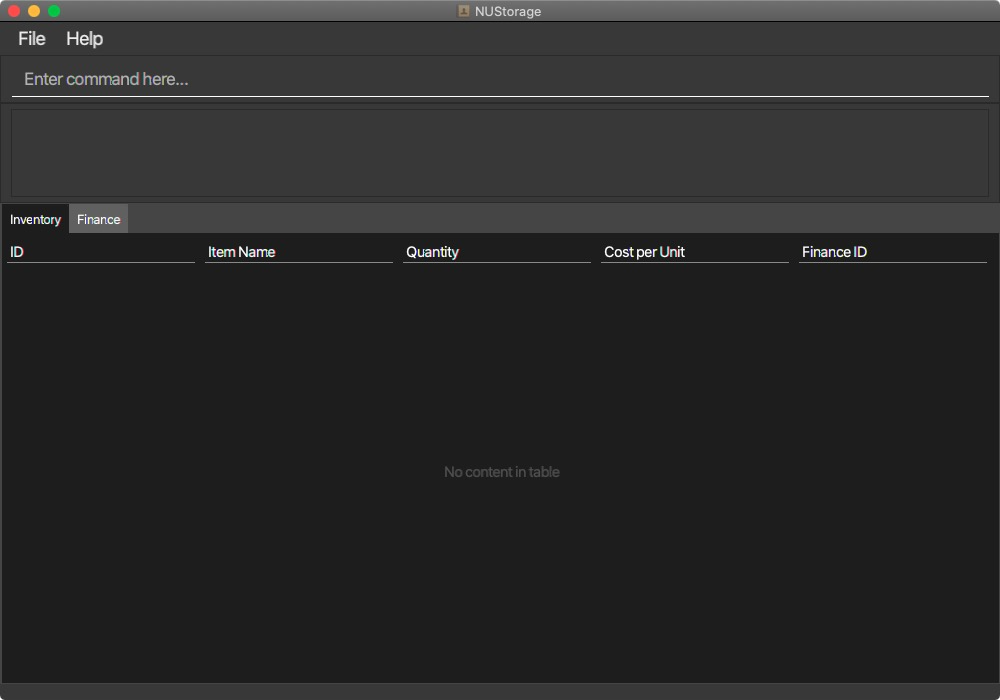

---
### NUStorage User Guide

By: `AY2021S1-CS2103T-T11-3` Since:`September 2020`

### Table of content
- [Introduction](#introduction)
- [Quick start](#quick-start)
- [Features](#features)
    + [Add items to inventory: `add_inventory`](#add-items-to-inventory-add_inventory)
    + [Remove items from inventory: `delete_inventory`](#remove-items-from-inventory-delete_inventory)
    + [Edit record in inventory: `edit_inventory`](#edit-record-in-inventory-edit_inventory)
    + [List inventory records: `list_inventory`](#list-inventory-records-list_inventory)
    + [Add finance records: `add_finance`](#add-finance-records-add_finance)
    + [Delete finance records: `delete_finance`](#delete-finance-records-delete_finance)
    + [List finance records: `list_finance`](#list-finance-records-list_finance)
    + [Quit the programme: `exit`](#quit-the-programme-exit)
- [Command summary](#command-summary)

--------------------------------------------------------------------------------------------------------------------

## Introduction
NUStorage is a desktop application for __managing inventory, finance transactions and accounts__.

--------------------------------------------------------------------------------------------------------------------

## Quick start

1. Make sure you have Java 11 installed
1. Download the NUStorage.jar from <here>.
1. Copy the jar file to the folder you want to use as the home folder for your application.
1. Double-click on the jar file to start the app. The GUI should look something like this:

1. Type the command in the command box and press enter to execute.
    - Some commands you can try are:
        - `list_inventory` to list inventory records
        - `list_finance` to list finance records
        - `add_inventory i/Logitech G400 q/20 c/69` to add 20 Logitech G400 gaming mouse that cost $69 to the inventory
        - `add_finance amt/120.17` to add an inbound transaction of $120.17
        - `bye` to exit programme
    - Refer to the feature list below for details of each command.

--------------------------------------------------------------------------------------------------------------------

## Features

**:information_source: Notes about the command format:** 
* Words in `UPPER_CASE` are the __parameters__ to be supplied by the user. 
    e.g. in `add_inventory i/ITEM`, `ITEM` is a parameter which can be used as `add_inventory i/MacBook`.
* Items in square brackets are optional. 
  e.g `amt/AMOUNT [at/[DATE] [TIME]]` can be used as the possible formats:
  * `amt/200 at/2020-04-10 18:00`
  * `amt/200 at/2020-04-10`
  * `amt/200 at/18:00`
  * `amt/200 at/2020-04-10`
  * `amt/200`

--------------------------------------------------------------------------------------------------------------------
#### Add items to inventory: `add_inventory`
Add and store items into the inventory

Format: `add_inventory i/ITEM_NAME q/QUANTITY [c/ITEM_COST]`

--------------------------------------------------------------------------------------------------------------------

#### Remove items from inventory: `delete_inventory`
Remove specified record from the inventory

Format: `delete_inventory INDEX`

--------------------------------------------------------------------------------------------------------------------

#### Edit record in inventory: `edit_inventory`
Edit specified record in the inventory

Format: `edit_inventory INDEX [i/ITEM_NAME] [q/QUANTITY]`

--------------------------------------------------------------------------------------------------------------------

#### List inventory records: `list_inventory`
Display all records in the inventory

Format: `list_inventory`

--------------------------------------------------------------------------------------------------------------------

#### Add finance records: `add_finance`
Add and store finance record into the account

Date and time are default to current location's datetime unless specified

Format: `add_finance amt/AMOUNT [at/[DATE] [TIME]]`

--------------------------------------------------------------------------------------------------------------------

#### Delete finance records: `delete_finance`

Delete specified finance record from the account

Format: `delete_finance INDEX`

--------------------------------------------------------------------------------------------------------------------

#### List finance records: `list_finance`

Display all finance records in the account

Format: `list_finance`

--------------------------------------------------------------------------------------------------------------------

#### Quit the programme: `exit`

Save data locally in a data file and exit the programme

Format: `exit`

--------------------------------------------------------------------------------------------------------------------

## Command summary

Action | Format, Examples
--------|------------------
__Add inventory__ | `add_inventory i/ITEM q/QUANTITY [c/ITEM_COST]`  e.g. add_inventory i/MacBook pro q/200 c/50
__Delete inventory__ | `delete_inventory ITEM_NUMBER`  e.g. delete_inventory 4
__Edit inventory__ | `edit_inventory ITEM_NUMBER [i/ITEM_NAME] [q/QUANTITY]`  e.g. edit_inventory 3 i/Lenovo Y50 q/10
__List inventory__ | `list_inventory`
__Add finance__ | `add_finance amt/AMOUNT [at/[DATE] [TIME]]`  e.g. add_finance amt/420.69 at/2020-04-23
__Delete finance__ | `delete_finance INDEX`  e.g. delete_finance 2
__List finance__ | `list_finance`
__Exit programme__ | `exit`
