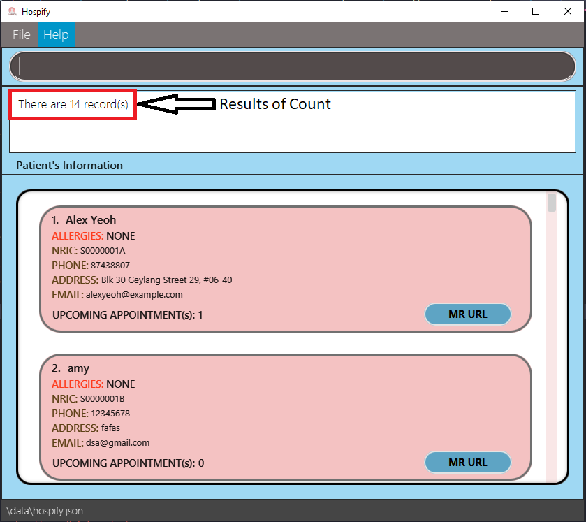
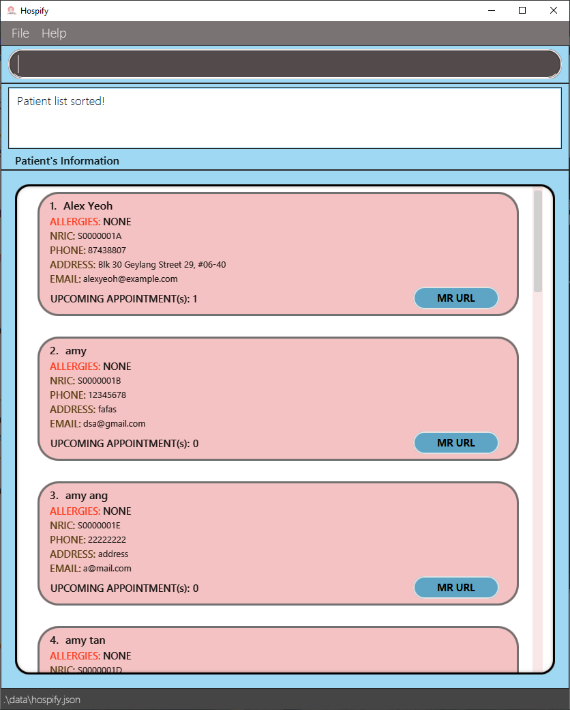
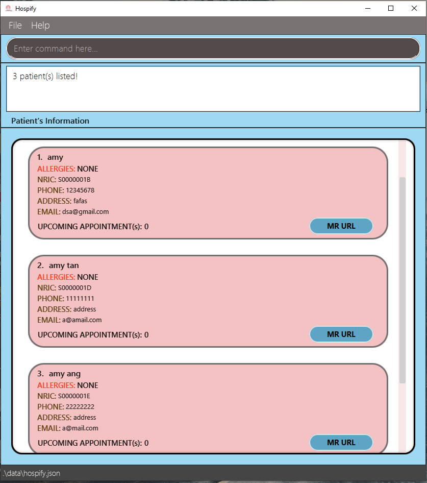

* Table of Contents
{:toc}

--------------------------------------------------------------------------------------------------------------------
## 1. Introduction

Hello, fellow clinic administrative staff.

Welcome to **Hospify**, a desktop application for a digital medical record management solution. With **Hospify**, you will be able to add, edit, find, delete and sort (and more!) patients' medical record and even appointment details. In this user guide, you will learn more about how to get started with **Hospify** and how you can use the key features of the application.

**Hospify** is primarily optimized for use via a Command Line Interface (CLI), which means most features can be used by just typing a single line of command! If you can type fast, you will be able to manage medical records much more efficiently. However, if you are new to **Hospify**, fret not! Read on to find out what **Hospify** can offer.

Before we move on to how to install **Hospify**, let us understand how the user guide works!

To navigate around this user guide, you may use the hyperlinks provided at the top of the page to jump to a particular section that you are interested in. This user guide is divided into 4 major sections: Quick Start, Features (contains sub section, each representing a feature of **Hospify**), Frequently Asked Questions (FAQ) and Command Summary. The following explains the key notations used in this user guide:

1. `text in box` - represents a command, action, input, output or file

1. **:information_source: Notes:** - represents noteworthy information

1. **:bulb: Tip:** - represents a useful tip

1. **:warning: Important:** - represents important warnings

## 2. Quick start

In this section, we will be going through the process of installing **Hospify** on your computer and some of the necessary pre-requisites. Before we start the installation, please ensure that you have Java `11` or above installed in your Computer. If not, you may download Java `11` from [here](https://www.oracle.com/java/technologies/javase-jdk11-downloads.html).

**:information_source: Note on installing Java `11`:** 
There are many versions of Java `11` listed. Select the correct version based on your computer's operating system.

1. Download the latest `hospify.jar` from [here](https://github.com/AY2021S1-CS2103T-W15-3/tp/releases). Click on `hospify.jar` to start the download as shown in figure 1.1 below.  
    
    
    Figure 1.1 **Hospify** download page

1. Copy the file to the folder you want to use as the _home folder_ for the **Hospify** app.

1. Double-click the file to start the app. A Graphical User Interface (GUI) similar to the one as shown in figure 1.2 below should appear in a few seconds. Notice that **Hospify** came listed with some sample patients. 
   
   
   Figure 1.2 Start up UI showing list of sample patients

1. You can now try typing your very first command in the command box and press `Enter` to execute it! Not sure what to type? Try typing **`help`** and pressing `Enter`. A help window as shown in figure 1.3 below should appear. 
    
    
    Figure 1.3 Help window
    
   Now, you can try out some other commands:

   * **`list`** : Lists all patients.

   * **`add`**`n/John Doe ic/S1234567A p/98765432 e/johnd@example.com a/John street, block 123, #01-01 mr/www.samplerecord.com/01`: Adds a patient named `John Doe` to **Hospify**.

   * **`delete`**`3` : Deletes the 3rd patient shown in the current list.

   * **`clear`** : Deletes all patients.

   * **`exit`** : Exits the app.

1. You can refer to the [Features](#features) below for a list of all the commands available and the details of each command.

--------------------------------------------------------------------------------------------------------------------

## 3. Features

In this section, we will be looking at a series of commands that **Hospify** supports, how you can use these commands, why these commands may be helpful to you and the expected outcomes of executing these commands. You may refer to the table of contents at the top of this page to skip to the specific command that you are interested in.

**:information_source: Notes about the command format:** 

* Words in `UPPER_CASE` are the parameters that you have to provide when typing a command. 
  e.g. in `add n/NAME`, `NAME` is a parameter which can be used as `add n/John Doe`.

* Items in square brackets are optional parameters. 
  e.g `n/NAME [t/ALLERGIES]` can be used as `n/John Doe t/shellfish` or as `n/John Doe`.

* Items with `…`​ after them can be used multiple times (including zero times). 
  e.g. `[t/ALLERGIES]…​` can be used as ` ` (i.e. 0 times), `t/shellfish`, `t/shellfish t/grass` etc.

* Parameters can be in any order. 
  e.g. if the command specifies `n/NAME ic/ NRIC p/PHONE_NUMBER`, `p/PHONE_NUMBER n/NAME ic/S1234567A` is also acceptable.

### 3.1 Displaying usage instructions: `help` (by Peh Jun Siang)

The `help` command shows the list of all the commands and their usages with examples supported by **Hospify**.

Format: `help`

After executing the `help`, the **sizable Help Window** pops up as shown below. The commands are sorted alphabetically.

\
Figure 2.1 Help window

**:bulb: Tip:** Whenever you feel lost when using **Hospify**, the `help` command can be very helpful.

**:bulb: Tip:** You can copy the URL of the **Hospify User Guide** to your clipboard to view a more detailed description
for the commands.

### 3.2 Adding a patient: `add` (by Cedric Lim Jun Wei)

This is a core and basic feature of **Hospify**. This command allows you to add a new patient to **Hospify**. Start by typing the command word `add`, followed by the following items:

1. `n/NAME` : Name of patient

2. `ic/NRIC` : Nric of patient

3. `p/PHONE_NUMBER` : Phone number of patient

4. `e/EMAIL` : Email of patient

5. `a/ADDRESS` : Home address of patient

6. `mr/MEDICAL_RECORD_URL` : Url to the patient's online medical record

7. `t/ALLERGIES` : Known allergies of the patient

**:information_source: Important note on the fields:** 

* All items except items 4 and 7 are compulsory fields that you have to provide. Missing any one of those fields will trigger an error.

* Items 4 and 7 are optional items that you may choose to exclude. In addition, for item 7, you may choose to include more than one of such item by using `t/ALLERGIES` again.

* You are **not allowed** to add patients with the same `NRIC` or `MEDICAL_RECORD_URL` field as an existing patient in **Hospify**. However, it is possible to do so for the other fields.

Let us summarise the information above to a single line of command in the following format.

Format: `add n/NAME ic/NRIC p/PHONE_NUMBER [e/EMAIL] a/ADDRESS mr/MEDICAL_RECORD_URL [t/ALLERGIES]…​`

* The `NAME` (upper limit of 100 characters) and `ALLERGIES` (upper limit of 100 characters) field should contain alphanumeric characters.
* The `NRIC` field should start with an alphabet, followed by 7 digits, before ending with another alphabet.
* The `PHONE_NUMBER` field should contain a number that is between 3 and 15 digits (inclusive) long.
* The `EMAIL` field should contain a valid email address (for more information on email validity, please refer to the [Command Summary](#command-summary)).
* The `ADDRESS` (upper limit of 200 characters) field can contain any word or number.
* The `MEDICAL_RECORD` field should contain a valid url (for more information on url validity, please refer to the [Command Summary](#command-summary)).

**:information_source: Note:** A patient can have any number of allergies (including 0)

Let us use some examples (as shown below) to see how this command can actually be used.

Examples:
* `add n/John Doe ic/S1234567A p/98765432 e/johnd@example.com a/John street, block 123, #01-01 mr/www.samplerecord.com/11`
* `add n/Betsy Crowe ic/S9425431A t/shellfish e/betsycrowe@example.com a/Newgate Prison p/1234567 t/grass mr/www.samplerecord.com/02`

When a patient is successfully added to **Hospify**, a success message will appear in the message box, and the patient is shown at the bottom of the list as shown in figure 3.1 below.  

Figure 3.1 Adding a patient (success scenario)

### 3.3 Listing all patients: `list` (by Cedric Lim Jun Wei)

This command allows you to display the complete list of patients recorded in **Hospify**. This may be useful after you have used the [`find`](#locating-patients-by-name-or-nric-find-by-gabriel-teo-yu-xiang) command (which displays a partial list of patients) and you wish to revert back to the complete list of patients again.

To use the command, simply type in `list` on the command line with no additional parameters.

Format: `list`

In the example below, we first use the `find` command to search for patient `Bernice Yu`. To do so, we type `find Bernice Yu` on the command line. This results in a partial list containing only one patient as shown in figure 4.1 below.

Figure 4.1 Finding patient `Bernice Yu`

With the help of the `list` command, we can revert back to the complete list of patients as shown in figure 4.2 below.

Figure 4.2 Listing all patients

### 3.4 Editing a patient: `edit` (by Cao Qin)

This command allows you to edit an existing patient in **Hospify**.

Format: `edit INDEX [n/NAME] [p/PHONE] [e/EMAIL] [a/ADDRESS] [t/ALLERGIES]…​`

**:information_source: Important notes:** 

* The meaning of each filed is the same as in `add` command, please refer to [add command](#adding-a-patient-add-by-cedric-lim-jun-wei).
* `INDEX` refers to the index number shown in the displayed patient list. The index **must be a positive integer** 1, 2, 3, …​
* Except `INDEX`, all other fields are optional.
* At least one of the optional fields must be provided.
* Existing values will be updated to the input values.
* When editing allergies, the existing allergies of the patient will be removed i.e adding of allergies is not cumulative.
* You are **not allowed** to edit the `NRIC` or `MEDICAL_RECORD_URL` field of a patient to the same as another existing patient's in **Hospify**. However, it is possible to do so for the other fields.

Examples:
*  `edit 1 p/91234567 e/johndoe@example.com` Edits the phone number and email address of the 1st patient to be `91234567` and `johndoe@example.com` respectively.
*  `edit 2 n/Betsy Crower t/` Edits the name of the 2nd patient to be `Betsy Crower` and clears all existing allergies.

When a patient is successfully edited in **Hospify**, a success message will appear in the message box, and the edited patient is updated in the list as shown in figure 5.1 below.  

Figure 5.1 Editing a patient(success scenario)

**:bulb: Tip:** 

* You can remove all the patient’s allergies by typing `t/` without
    specifying any allergies after it.
    

### 3.5 Locating patients by name or Nric: `find` (by Gabriel Teo Yu Xiang)

This command allows you to find patients whose names contain any of the given keywords or NRICs.

Format: `find KEYWORD [MORE_KEYWORDS] [NRIC] [MORE_NRICs]`

* The search is case-insensitive. e.g. `hans` will match `Hans`, and `s1234567a` will match `S1234567A`
* The order of the keywords or NRICs does not matter. e.g. `Hans Bo` will match `Bo Hans`
* Both the name and NRIC are searched.
* Patients matching at least one keyword or NRIC will be returned (i.e. `OR` search).
  e.g. `Hans Bo S7654321A` will return `Hans Gruber`, `Bo Yang`, `Tom Lee` (whose NRIC is S7654321A)

**:information_source: Note:** 

* Only full words will be matched e.g. `Han` will not match `Hans`

* Only full NRICs will be matched e.g. `S12345` will not match `S1234567A`

Examples:
* `find John` returns `john` and `John Doe`
* `find alex david` returns `Alex Yeoh`, `David Li` 
  
  Figure 6.1

* `find bernice s0000003a` returns `Bernice Yu`, `Charlotte Oliveiro`
  
  Figure 6.2

### 3.6 Deleting a patient: `delete` (by Cao Qin)

Deletes the specified patient from **Hospify**.

Format: `delete INDEX` or `delete NRIC`

**:information_source: About the format of `delete` command:** 
* Deletes the patient at the specified `INDEX` or `NRIC`
* The `INDEX` refers to the index number shown in the displayed patient list.
* The `INDEX` **must be a positive integer** 1, 2, 3, …​
* The `NRIC` refers to the `NRIC` of the patient to be deleted.
* The `NRIC` entered is **case-insensitive**. e.g. `s1234567a` will match `S1234567A`
* Only full `NRIC`s will be matched e.g. `S12345` will **not** match `S1234567A`

Examples:

scenario 1 (delete by index):

* `list`(shown in Figure 2.4 below) followed by `delete 2`(shown in Figure 2.5 below) deletes the 2nd patient in **Hospify**.

  `list` command shows all the patients and their corresponding index.
  
  Figure 7.1 result of `list` command
  
  `delete 2` command deletes the patient with index 2. 
  
  Figure 7.2 result of `delete 2` command

scenario 2 (delete by nric):

* `delete S0000004A`(shown in Figure 7.3 below) deletes `David Li` (whose NRIC is S0000004A).

  
  Figure 7.3 result of `delete S0000004A` command

### 3.7 Counting total number of patients: `count` (by Chong Jia Le)

This command allows you to see the total number of patients recorded in **Hospify**.

To use this command, simply type in `count` on the command line with no additional parameters.

Format: `count`

**:information_source: Note:** 

* The total number of patients will always be provided, and not the number of patients currently displayed in the list.

Example:

Figure 8.1 Result of `count` command

### 3.8 Sorting the patients: `sort` (by Chong Jia Le)

This function allows you to sort the patients in **Hospify**. The sort can be performed by either name or NRIC and it will be sorted in ascending order.
Using this command after you have used the `find` command, which displays a partial list of patient, would allow you to sort the partial list.

To use this command, simply type in `sort` on the command line followed by either `name` or `NRIC` depending on how you want the patients to be sorted.

Format: `sort name` or `sort NRIC`

Examples:

* Performing `sort name` would result in the patients to be sorted by their name in ascending order, as shown in the steps below.

    1. Initially, list of patients is not sorted by name as seen below:
        
        
        Figure 9.1 List of patients not sorted by name
        
    2. After user inputs `sort name` list is sorted as seen below:
        
        
        Figure 9.2 List of patients after `sort name`

* Performing `sort NRIC` would result in the patients to be sorted by their NRIC in ascending order, as shown in the steps below.
    
    1. Initially, list of patients is not sorted by NRIC as seen below:
        
        
        Figure 9.3 List of patients not sorted by NRIC
    
    2. After user inputs `sort NRIC` list is sorted as seen below:
        
        
        Figure 9.4 List of patients after `sort NRIC`
        
* Performing `find amy` followed by `sort name` would result in the app displaying all patients whose names contain `amy` sorted in alphabetical order by their name.
    
    1. `find amy` is performed resulting in the application showing only patients whose names contain `amy` as shown below:
  
        
        Figure 9.5 Partial list of patients after `find amy`
        
    2. After the user inputs `sort name`, the partial list is sorted as seen below:
        
        
        Figure 9.6 Partial list of patients after `sort name`
        
### 3.9 Showing Appointments of a Patient: `showAppt` (by Peh Jun Siang)

The `showAppt` command shows you all the appointments of a patient in a table for ease of viewing.
Unlike other commands, you can click on the patient's information to show the appointments **without needing to enter any commands**.

###### 3.9.1 Using the `GUI`
You can simply **double click** on the patient to display all the appointments of that patient.

Figure 10.1 Show appointments via GUI
###### 3.9.2 Using the `Command Line`
If the number of patients is too large, it might be difficult to find the patient's information to click.
In that case, you can use the command line to show the patient's appointments.

\
Figure 10.2 Show appointments via Command Line

Format: `showAppt NRIC`

Example: `showAppt S1234567A`

The **Appointment window should pop up** after successfully running the command either through the `GUI` or the `Command Line` shown below.

Figure 10.3 Appointments window with appointments of patient

**:bulb: Tip:** You can **click on the **DATE** header** to sort the appointments from earliest to latest or latest to earliest.

**:warning: Important:** Only **ONE** appointment window is allowed to be opened at any moment.

**:information_source: Note:** `showAppt` takes in only **ONE** NRIC of the patient to show.

### 3.10 Adding an Appointment: `addAppt` (by Gabriel Teo Yu Xiang)

This command allows you to schedule an `Appointment` for a patient in **Hospify**.

Format: `addAppt NRIC appt/DATE TIME [d/DESCRIPTION]`

* `NRIC` represents the `NRIC` of the patient you are adding an `Appointment` to.
* `DATE` and `TIME` represent the date and time of the `Appointment` respectively.
* `DESCRIPTION` represents the name or brief description of the `Appointment`.
  e.g. `Eye Check-up` or `Physiotherapy Session`

**:warning: Important:** `DATE` and `TIME` parameters must be specified in the following formats:

**:information_source: Note:** The appointment description is **optional** and may be left out

- **Date format:**

Format | Example
------ | -------
dd/MM/yyyy | 28/09/2022

- **Time format:**

Format | Example
------ | -------
HH:mm | 20:00

Examples:
* `addAppt S1234567A appt/25/12/2020 15:00`
* `addAppt S0000001A appt/28/09/2022 20:00 d/Eye Check-up`

When an `Appointment` is successfully added to a patient, a success message will appear in the message box, and the number of upcoming appointments will be updated and reflected as shown in the figure below. 

Figure 11.1

### 3.11 Editing an Appointment: `editAppt` (by Gabriel Teo Yu Xiang)

This command allows you to edit an existing `Appointment` for a patient in **Hospify**.

Format: `editAppt NRIC oldappt/DATE TIME newappt/DATE TIME [d/DESCRIPTION]`

**:information_source: Note on different appointment parameters:** 

* There are two separate `Appointment` timings specified in the format

* The old `Appointment` timing is preceded by a `oldappt/` prefix

* The new `Appointment` timing is preceded by a `newappt/` prefix

* The new `Appointment` description is **optional**  
i.e. you can choose whether or not to edit the description

* The `Appointment` to edit must be an existing appointment of the patient.
* `NRIC` represents the `NRIC` of the patient whose `Appointment` you are editing.
* `DATE` and `TIME` formats follow the same format as specified in the [`addAppt`](#adding-an-appointment-addappt-by-gabriel-teo-yu-xiang) command section.
* `DESCRIPTION` represents the description of the new `Appointment` to be changed to.

Examples:
* `editAppt S0000001A oldappt/28/09/2022 20:00 newappt/30/09/2022 15:00`
* `editAppt S1234567A oldappt/25/12/2020 20:00 newappt/10/01/2021 14:00 d/Revisit`

When an `Appointment` is successfully edited, a success message will appear in the message box as shown in the figure below. 

Figure 12.1

### 3.12 Deleting an Appointment: `deleteAppt` (by Gabriel Teo Yu Xiang)

This command allows you to delete an existing `Appointment` for a patient in **Hospify**.

Format: `deleteAppt NRIC appt/DATE TIME`

* The `Appointment` to delete must be an existing appointment of the patient.
* The `Appointment` name/description does not need to be specified, since **Hospify** does not allow multiple appointments of the same timing for the same patient, and every appointment will have a unique timing.
* `NRIC` represents the `NRIC` of the patient whose `Appointment` you are deleting.
* `DATE` and `TIME` represent the date and time of the `Appointment` to be deleted.
* `DATE` and `TIME` formats follow the same format as specified in the [`addAppt`](#adding-an-appointment-addappt-by-gabriel-teo-yu-xiang) command section.

Examples:
* `deleteAppt S0000001A appt/28/09/2022 20:00`

When an `Appointment` is successfully deleted, a success message will appear in the message box, and the number of upcoming appointments will be updated and reflected as shown in the figure below. 

Figure 13.1

### 3.13 Using the Medical Record feature: `mr/` (by Cedric Lim Jun Wei)

By now we have learnt that we can [`add`](#adding-a-patient-add-by-cedric-lim-jun-wei) and [`edit`](#editing-a-patient-edit-by-cao-qin) patients by including the `mr/MEDICAL_RECORD_URL` field. Recall that this is a compulsory field for the `add` command while it is an optional field for the `edit` command and we can summarise the command formats as shown below.

Format: `add n/NAME …​ mr/MEDICAL_RECORD_URL …​` or `edit INDEX …​ [mr/MEDICAL_RECORD_URL] …​`

Example: `add n/John Doe …​ mr/www.samplemedicalrecord.com/01 …​` or `edit 1 …​ mr/www.samplemedicalrecord.com/02 …​`

With this field, you can store the url to the online medical record of the patient and can access this url in the patient's tab whenever necessary. Now, let us explore how we can make use of this feature to edit patients' online medical record.

**:information_source: Note on choice of medical record url:** 

* It is helpful to generate the medical record url before adding or editing a patient.

* We recommend using a secure online documenting software to store the patients' medical record for privacy purposes.

In the following example, we will be using [Google Docs](https://docs.google.com) to store the medical record of patient `John Doe`.

1. First, we add patient `John Doe` using the `add` command. For this step, we will be using the url `https://docs.google.com/document/d/1cWm83218iwKEzNHP41vHFWLukaDn6eYompjyCcJxBiA/edit`. Upon successful addition, you should be able to see a success message including the `MEDICAL_RECORD_URL` you have just added when you scroll the message box to the bottom as shown in figure 14.1 below. 
    
    
    Figure 14.1 Adding patient John Doe
    
1. Next, to copy the medical record url of patient `John Doe` that we have just added, locate the patient in the list and click on the `MR URL` button located on the bottom right corner as shown in figure 14.2 below. A `Link Copied!` success message should appear once clicked, indicating that the link has been copied to the system clipboard. 
    
    
    Figure 14.2 Copying medical record url of John Doe
    
1. Then, open the web browser of your choice and paste the medical record url onto the search bar as shown in figure 14.3 below. 
    
    
    Figure 14.3 Pasting medical record url of John Doe onto search bar
    
1. Finally, you can access the medical record of the patient and make edits if applicable. A sample medical record is shown in figure 14.4 below for your reference. 
    
    
    Figure 14.4 Sample medical record of John Doe on Google Docs

The example we have just discussed uses the `add` command. The usage of the `MEDICAL_RECORD_URL` field in `edit` works in the same way as described in the `add` example as well.

Another method to access the online medical record of the patient directly (without the copy-and-paste mechanism) is shown in the `showMr` command section below.

### 3.14 Show medical record directly: `showMr` (by Peh Jun Siang)
We understand that it might be quite a hassle to copy the URL and paste it in your browser manually. Therefore, we
implemented a short cut so that you can open up your default browser with the URL to the medical record directly from **Hospify** with the `showMr`
command!

Format: `showMr NRIC`\
Example: `showMr s1234567A`

Running the command as shown below will open your computer's **default browser** with the patient's medical record.

Figure 15.1 Using the `showMr` command to open patient's medical record.

In the unlikely event that `showMr` command does not open up the medical record in your default browser,
use the **manual method** described in [the above section](#using-the-medical-record-feature-mr-by-cedric-lim-jun-wei)
on the medical record feature.

**:warning: Important:** - Check that your URL is valid if the medical record does not open on your browser.

Depending on the `Operating System` you are using, the `showMr` command may not work 
sometimes because there might be some issues with your default browser. Do drop us an email
at **hospify_enquiry@gmail.com** to notify the tech team if it does not open on your browser.

### 3.15 Clearing all entries: `clear` (by Cao Qin)

This command helps clear all patients' information from **Hospify**.

Format: `clear`

Example: 
execute `clear`(shown in Figure 14.5 below) command will empty the patients' list (shown in Figure 14.5 below).

Figure 16.1 clear command

Figure 16.2 clear command result

### 3.16 Exiting the program: `exit` 

You can exit the program by typing `exit` on the command line. Alternatively, you can close the window directly. Don't worry, either way, your data is automatically saved in the program!

Format: `exit`

### 3.17 Saving the data

**Hospify** data are saved in the hard disk automatically after any command that changes the data. There is no need to save manually.

--------------------------------------------------------------------------------------------------------------------

## 4. FAQ (by Peh Jun Siang)

In this section, we will be looking at some of the frequently asked questions from our users.

**Q**: How do I transfer my data to another Computer? 
**A**: Install the app in the other computer and overwrite the **data file** with the `hospify.json` 
that is in the **data file** of your other computer.

* **Step 1.** Go into the **data file** in the previous home directory of the **Hospify** app.\

Figure 17.1.1 Go to the **Data File**

* **Step 2.** Transfer the `hospify.json` file to your other computer through a flash drive or
the web and paste the `hospify.json` file in the **data file** of your new **Hospify** app.

Figure 17.1.2 Replace `hospify.json` file

**Q**: I cannot run the `JAR` file! How do I get the program to run? 
**A**: Check if you have at least `Java 11` installed on your Computer.

* On **Windows**\
    
    **Step 1.** Open up **Command Prompt** by searching for **command prompt** in the task bar shown below.\
\
Figure 17.2.1 Windows search for command prompt\
    
    **Step 2.** Type the command `java -version` to check for the version.
\
Figure 17.2.2 Check windows java version

**:warning: Important:** Ensure that the java version is at least `11`. If your version is less than `11`, 
scroll down to the **:information_source: Notes** to the view the download link.

After verifying that you have at least `java 11` installed, double click on the `hospify.jar` to run the app.

If it still does not run, type the command `java -jar hospify.jar` in the command prompt in the **SAME directory** 
containing your `hospify.jar` file shown below.

Figure 17.2.3 Running jar from windows prompt

* On **MAC**\

**Step 1.** Open up **Terminal** by searching for **terminal** in the search bar shown below.\
\
Figure 17.2.4 mac search bar\

**Step 2.** Type the command `java -version` to check for the version shown below.
\
Figure 17.2.5 Mac java version command

**:warning: Important:** Ensure that the java version is at least `11`. If your version is less than `11`,
scroll down to the **:information_source: Notes** to the view the download link.

After verifying that you have at least `java 11` installed, double click on the `hospify.jar` to run the app.

If it still does not run, type the command `java -jar hospify.jar` in the **TERMINAL** in the **SAME directory** 
containing your `hospify.jar` file. 

Figure 17.2.6 Running jar from Mac terminal

**:information_source: Notes:** If your java version is **less than 11**, download from
 the official Java website [here](https://www.oracle.com/java/technologies/javase-jdk11-downloads.html).

**Q**: How do I get the latest version of **Hospify**?\
**A**: As of the latest version, **Hospify** does not support updating within the application. In order to get the
 latest version, go to the **GitHub releases** [here](https://github.com/AY2021S1-CS2103T-W15-3/tp/releases/tag/v1.3) to download the latest version.\
\
Figure 17.3.1 Download latest jar file

**Q**: My question is not listed in the FAQ. What should I do?\
**A**: For inquires, please send email to our developer team at **hospify_enquiry@gmail.com**.

--------------------------------------------------------------------------------------------------------------------

## 5. Command summary

In this section, we have summarised all the commands and their formats into a table for easy reference. The commands are arranged in alphabetical order. Additionally, you may refer to the specific requirements of a valid email and url (for the `Medical Record` feature) if you are encountering problems with using these fields.

Action | Format, Examples
--------|------------------
**Add** | `add n/NAME ic/NRIC p/PHONE_NUMBER e/EMAIL a/ADDRESS mr/MEDICAL_RECORD_URL [t/TAG]…​`   e.g., `add n/James Ho ic/S1234567A p/22224444 e/jamesho@example.com a/123, Clementi Rd, 1234665 mr/www.samplerecord/100 t/shellfish`
**Add Appointment** | `addAppt NRIC appt/DATE TIME [d/DESCRIPTION]`   e.g., `addAppt S1234567A appt/30/12/2020 18:00 d/foot surgery`
**Clear** | `clear`
**Count** | `count`
**Delete** | `delete INDEX`  e.g., `delete 3`  `delete NRIC`  e.g., `delete S1234567A`
**Delete Appointment** | `deleteAppt NRIC appt/DATE TIME`   e.g., `deleteAppt S1234567A appt/30/12/2020 18:00`
**Edit** | `edit INDEX [n/NAME] [p/PHONE_NUMBER] [e/EMAIL] [a/ADDRESS] [ic/NRIC] [t/TAG]…​`  e.g.,`edit 2 n/James Lee e/jameslee@example.com ic/S1234567A`
**Edit Appointment** | `editAppt NRIC oldappt/DATE TIME newappt/DATE TIME [d/DESCRIPTION]`   e.g., `editAppt S1234567A oldappt/30/12/2020 18:00 newappt/27/11/2020 20:30 d/Revisit`
**Exit** | `exit`
**Find** | `find KEYWORD [MORE_KEYWORDS] [NRIC] [MORE_NRICs]`  e.g., `find James Jake`  e.g., `find Curry Davis Heskey S1234567A`
**Help** | `help`
**List** | `list`
**Show Appointment** | `showAppt NRIC` or double click on patient   e.g., `showAppt S1234567A`
**Show Medical Record** | `showMr NRIC` or double click `MR URL` button to copy the url and paste onto web browser manually   e.g., `showMr S1234567A`
**Sort** | `sort name` or `sort NRIC` 

* Valid email format

    * Emails should be of the format local-part@domain.topleveldomain
    * The local-part (upper limit of 64 characters) only contains alphanumeric characters or special characters including !#$%&'*+/=?`{}~^.- and the vertical line symbol
    * The domain should be between 2 and 255 characters long (inclusive), start and end with alphanumeric characters, and consist of alphanumeric characters, a period or a hyphen for the characters in between, if any
    * The top level domain should be between 2 and 6 (inclusive) characters long and only contain alphabets 
    
* Valid URL format
    
    * URL should be of the format (http:// or https://)(www.)domain.topleveldomain/path
    * The URL can start with `http://`, `https://`, `www.` or any of the first two paired with `www.`
    * The domain should be between 2 and 256 characters long (inclusive) and should only contain alphanumeric characters or special characters including @:%._+~#?&=/
    * The top level domain should be between 2 and 6 (inclusive) characters long and only contain alphabets
    * The path follows the same rule as the domain except there is no restriction in its length
