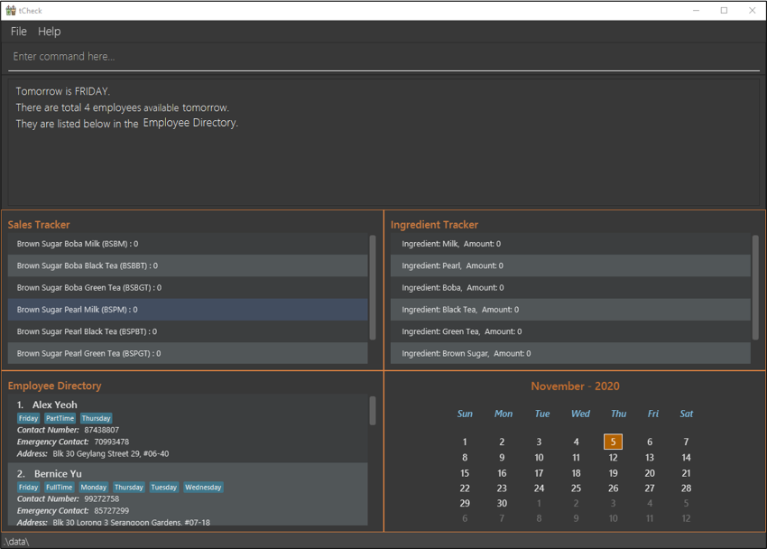
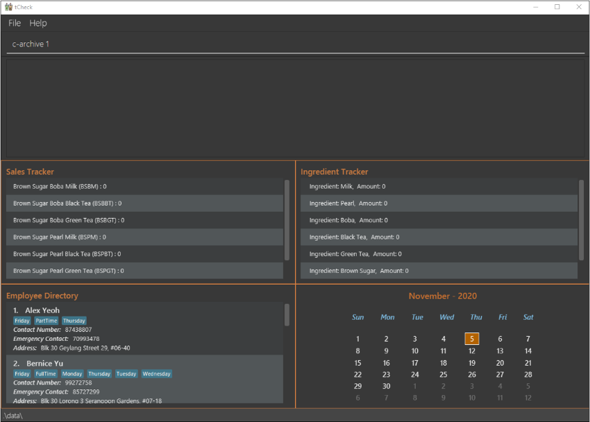
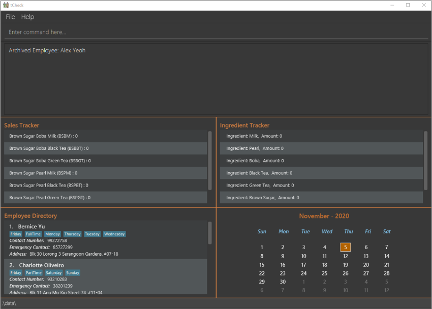
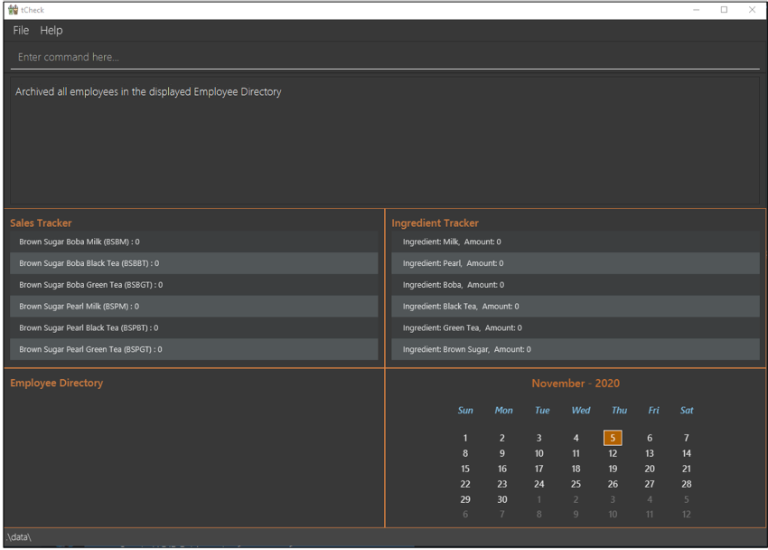

* Table of Contents
    * [Introduction](#introduction)
    * [Quick start](#quick-start)
    * [About](#about)
    * [Features](#features)
        * [Commands - Sales Tracking](#commands-sales-tracking)
        * [Commands - Ingredients Tracking](#commands-ingredients-tracking)
        * [Commands - Manpower Management](#commands-manpower-management)
        * [Commands - General](#commands-general)
        * [Other Features](#other-features)
    * [Command summary](#command-summary)

## Introduction 

Welcome to the User Guide of **tCheck**!
 
Are you a bubble tea store manager (from T-Sugar) looking to reduce your time spent on administrative work in store
management? Look no further, as tCheck can assist you with these tasks.

tCheck is a desktop application that offers an integrated system to efficiently manage a bubble tea shop, of 
the (imaginary) brand T-sugar, by providing sales tracking, ingredient tracking and manpower management. It is an
application optimized for the Command Line Interface (CLI); this means that you use this application by typing
commands into a _Command Box_. If you are a fast typist, then you will be able to update and retrieve the
information in tCheck more efficiently, as opposed to using other applications that requires a mouse.

This User Guide will help you get started with tCheck and learn how to use the features that tCheck provides.
You can start from the [Quick Start](#quick-start) section to learn how to obtain tCheck to begin managing
 your store more efficiently.

--------------------------------------------------------------------------------------------------------------------
## Quick start 

1. Ensure you have Java `11` or above installed in your Computer.

1. Download the latest `tCheck.jar` from [here](https://github.com/AY2021S1-CS2103T-T12-2/tp/releases).

1. Copy the file to the folder you want to use as the _home folder_ for your tCheck.

1. Double-click the file to start the app. The GUI similar to the below should appear in a few seconds. Note how the app contains some sample data. 
   

1. Type the command in the command box and press Enter to execute it. e.g. typing **`help`** and pressing Enter will open the help window. 
   Some example commands you can try:

   * **`c-list`** : Lists all employees.

   * **`c-add`**`n/John Doe p/98765432 e/81234567 t/parttime` : Adds an employee
    named `John Doe` to tCheck.

   * **`c-delete`**`3` : Deletes the 3rd employee shown in the current list.

   * **`c-clear`** : Deletes all employees.

   * **`exit`** : Exits the app.

1. Refer to the [Features](#features) below for details of each command.

--------------------------------------------------------------------------------------------------------------------
## 3. About 

### 3.1 Structure of this document

We have structured this User Guide in a way so that you can find what you need easily and quickly. In the next section,
[Section 3.2 - Reading this document](#reading-this-document), you can find sevaral useful tips on how to read this guide. The following section,
[Section 4 - Features](#features), documents the four main features in **tCheck**, namely:

   * Sales Tracking

   * Ingredients Tracking

   * Manpower Management

   * Other general features

### 3.2 Reading this document 

This section introduces you to some key technical terms, symbols and syntax that are used throughout this guide.
You may want to familarize yourself with them before moving on to the next section.

#### 3.2.1 Terminology related to the GUI

Figure 2 shows the GUI of **tCheck**, annotated with descriptions for all components of the GUI.

Figure 2 - Annotated GUI of tCheck

#### 3.2.4 Prefix process and usage

The table below explains some important features of how prefix(es) are processed in tCheck to help you understand and use prefix(es) in commands.

Situation | What will happen
-------|------------------------------
Duplicate (2 or more) valid prefixes detected | Only the last prefix and its following parameter are accepted and processed as part of the command.
Invalid prefix entered | tCheck will not recognize this "prefix" and thus it will be processed as part of the parameter for the nearest previous valid prefix, which may result in error for the parameter.
Unexpected prefix(es) entered for commands which do not take in any parameter | tCheck will not accept or process these prefix(es) because all words entered after the command words will be ignored. 

**Example 1:**
`i-set i/Milk i/Boba m/90`

**How the command is processed:**

In this example, the situation of duplicate valid prefixes detected takes place. Hence, only the last, in this case, the second prefix and its following parameters are accepted.
Thus, the command will be processed in the same way as `i-set i/Boba m/90`.

**Example 2:**
`i-set-all M/10 P/10 B/10 L/10 G/10 S/10 T/10`

**How the command is processed:**

In this example, the prefixes `M/`, `P/`, `B/`, `L`, `G` and `S/` are valid but `T/` is invalid. Hence, the situation of
invalid prefix entered takes place. Since tCheck will not be able to recognize the `T/` entered as a prefix. Thus, it will be treated as
part of the parameter for the nearest previous prefix, which is `S/`. This will cause the command to fail because `10 T/20` is an invalid format for amount and appropriate error message will be shown.

**Example 3:**
`help i/Milk i don't know what to do `

**How the command is processed:**

In this example, `help` is a command which does not take in any parameter. Hence, the situation of unexpected prefix(es) entered for commands which do not take in any parameter takes place.
Thus, tCheck will ignore all words come after the command word `help` and the command will be processed in the same way as `help`.

--------------------------------------------------------------------------------------------------------------------
## Features 

**:information_source: Notes about the command format:** 

* Words in `UPPER_CASE` are the parameters to be supplied by the user. 
  e.g. in `i-set i/INGREDIENT_NAME m/AMOUNT`, both `INGREDIENT_NAME` and `AMOUNT` are parameters which can be used as `i-set i/Milk m/90`.

* Items in square brackets are optional. 
  e.g `n/NAME [t/TAG]` can be used as `n/John Doe t/friend` or as `n/John Doe`.

* Items with `...`​ after them can be used once or multiple times. 
  e.g. `sales A/NUM B/NUM C/NUM ...` can be used as `sales BSBM/100` or `sales BSBM/100 BSBBT/120`.

* Parameters can be in any order. 
  e.g. if the command specifies `n/NAME p/PHONE_NUMBER`, `p/PHONE_NUMBER n/NAME` is also acceptable.

### 1. Commands - Sales Tracking 
The Sales Tracking features allows you to keep a record of the sales of the bubble tea drinks inside the
Sales Tracker. You are able to view data related to sales tracking in the Sales Tracker inside the _Main View_.

**:information_source: Notes about available drinks:** 

Currently, there are 6 types of drinks that can be tracked by tCheck's Sales Tracker. The drinks and their respective
 abbreviations are shown as below: 

* `BSBM`  : Brown Sugar Boba Milk 

* `BSBBT` : Brown Sugar Boba Black Tea 

* `BSBGT` : Brown Sugar Boba Green Tea 

* `BSPM`  : Brown Sugar Pearl Milk 

* `BSPBT` : Brown Sugar Pearl Black Tea 

* `BSPGT` : Brown Sugar Pearl Green Tea 

#### 1.1 Updating the number of drinks sold : `s-update`
Updates the number of drinks sold for each drink type as given in the user input. The previous records will
be overwritten.

Format: `s-update DRINK [MORE_DRINKS]`
* where `DRINK` is formatted as `A/NUM`
    * `A` refers to the drink's abbreviation.
    * `NUM` refers to the number of drinks sold. It should be a **non-negative unsigned integer** that is 
less than or equal to 99999999.
* The sales of at least one drink item should be recorded when using this command.

Example: 

Let's say you want to update the sales of Brown Sugar Boba Milk, `BSBM`, to 100 
and Brown Sugar Boba Black Tea, `BSBBT`, to 120 in the Sales Tracker. You can follow these instructions:

1. Type `s-update BSBM/100 BSBBT/120` into the _Command Box_.
2. Press "Enter" to execute the command.

Outcome:

1. The _Result Display_ will show a success message.
2. You can now see that tCheck has updated the sales of the two drinks in the Sales
 Tracker inside the _Main View_. 

Figure x. A screenshot showing the outcome of an `s-update` command

#### 1.2 Listing the number of drinks sold : `s-list`
Shows a list of all types of drinks sold in the Sales Tracker. The list of drinks shown is 
ordered in descending order (i.e. ranked from the most to least sales).

Format: `s-list`

Example: 

Let's say you want to see an ordered list of drink sales that have been recorded with `s-update`.
You can follow these instructions:

1. Type `s-list` into the _Command Box_.
2. Press "Enter" to execute the command.

Outcome:

1. The _Result Display_ will show a success message.
2. The Sales Tracker inside the _Main View_ will show a list of the drinks sales in descending order, where the drink
 with the most sales is on top.

Figure x. A screenshot showing the outcome of an `s-list` command

#### 1.3 Finds the number of drinks by keywords : `s-find`

Finds all drinks where their abbreviated names match the KEYWORD(s).

Format: `s-find KEYWORD [MORE_KEYWORDS] ...`

* The search is case-insensitive. e.g `bsbbt` will match `BSBBT`.
* Only the drink's abbreviated name is searched.
* Only full words will be matched e.g. `BSB` will not match `BSBBT`.
* Drinks matching at least one keyword will be returned.
  e.g. `BSBBT BSBM` will return `BSBBT`, `BSBM`.

Examples:
* `s-find BSBBT` returns `BSBBT`'s sales data.
* `s-find BSBBT BSBM` returns `BSBBT`'s sales data and `BSBM`'s sales data. 

#### 1.4 Ranking the list of drinks sold : `s-rank`
Shows a ranked list of all types of drinks sold in the Sales Tracker. The list of drinks
is ranked from the most popular to least popular.

Format: `s-rank`

### 2. Commands - Ingredients Tracking 

**:information_source: Notes about ingredients:** 

* Unit of measurement for ingredients: 
   * Unit for solid items / jelly (Pearl, Boba and Brown Sugar) : **KG** 
   * Unit for liquids (Milk, Black Tea and Green Tea) : **L** 

* All ingredients' initial levels (the levels you see when running tCheck for the very first time) are set to 0. 

* Recording ingredients' leves to the nearest **KG**/**L** is sufficient for inventory keeping. 

* tCheck is designed specifically for an imaginary bubble tea brand, T-Sugar, which produces all their drinks using six ingredients. Hence, all available ingredients in a T-Sugar store are pre-defined in tCheck's ingredient book and no other ingredient can be added. 

* Please note that the ingredient names are **case-sensitive** to ensure consistency with the ingredient names displayed in Ingredient Tracker section of the _Main View_. 

* Please be informed that a prefix is chosen for an ingredient using the following logic : 
   1. Use the first letter of the ingredient name. 
   2. If that letter is taken by another ingredient, use the first letter of the second word for that ingredient. 
   3. If the ingredient name does not have a second word or if the first letter of the second word is not unique, use the second letter of the first word of the ingredient name.

* Here is a comprehensive list of all available ingredients and their pre-determined default levels in a T-Sugar bubble tea store: 
    * Milk, 50 L 
    * Pearl, 20 KG 
    * Boba, 20 KG 
    * Black Tea, 50 L 
    * Green Tea, 50 L 
    * Brown Sugar, 20 KG 

#### 2.1 Setting one ingredient's level : `i-set`

Sets the level of one single ingredient predefined in the ingredient book to the specified amount.

Format: `i-set i/INGREDIENT_NAME m/AMOUNT`

* Sets the `INGREDIENT_NAME` to the specified `AMOUNT`.

Example:

Let's say you want to set the ingredient Milk's level to 90 L. 
You can follow these instructions:

1. Type `i-set i/Milk m/90` into the _Command Box_.
2. Press "Enter" on your keyboard to execute the command.

Outcome:

1. The _Result Display_ will show a success message.
2. You can now see that tCheck has updated Milk's level to 90 L in The Ingredient Tracker inside the _Main View_.

Before the execution:

Figure above shows tCheck's GUI during the command is being entered.

Figure above showing tCheck's GUI after pressing "Enter". Note that the amount for Milk is updated in Ingredient Tracker section inside the _Main View_.

#### 2.2 Setting all ingredients' levels to different specified amounts : `i-set-all`

Sets all ingredients' levels to different specified amounts according to user inputs.

Format: `i-set-all M/AMOUNT_FOR_MILK P/AMOUNT_FOR_PEARL B/AMOUNT_FOR_BOBA L/AMOUNT_FOR_BLACK_TEA G/AMOUNT_FOR_GREEN_TEA S/AMOUNT_FOR_BROWN_SUGAR`

* Sets all ingredients' levels as such : Milk : `AMOUNT_FOR_MILK` L, Pearl : `AMOUNT_FOR_PEARL` KG, Boba : `AMOUNT_FOR_BOBA` KG, Black Tea : `AMOUNT_FOR_BLACK_TEA` L, Green Tea: `AMOUNT_FOR_GREEN_TEA`, Brown Sugar : `AMOUNT_FOR_BROWN_SUGAR` KG.

Example:

Let's say you want to set Milk's level to 20, Pearl's level to 20, Boba's level to 20, Black Tea's level to 20, Green Tea's level to 80 and Brown Sugar's level to 50.
You can follow these instructions:

1. Type `i-set-all M/20 P/20 B/20 L/50 G/80 S/50` into the _Command Box_.
2. Press "Enter" on your keyboard to execute the command.

Outcome:

1. The _Result Display_ will show a success message.
2. You can now see that tCheck has updated all ingredients' levels to the specified amounts in the Ingredient Tracker inside the _Main View_.

Figure above shows tCheck's GUI during the command is being entered.

Figure above showing tCheck's GUI after pressing "Enter". Note that all amounts for the ingredients are updated in Ingredient Tracker inside the _Main View_.

#### 2.3 Setting all ingredients to different levels : `i-set-default`

Sets all ingredients' levels to their pre-determined default levels for a store.

Format: `i-set-default`

* Sets all ingredients' levels to their default levels : Milk : 50 L, Pearl : 20 KG, Boba : 20 KG, Black Tea : 50 L, Green Tea : 50 L, Brown Sugar : 20 KG.

Example:

Let's say you want to set all ingredients' levels to their pre-determined default amounts in tCheck.
You can follow these instructions:

1. Type `i-set-default` into the _Command Box_.
2. Press "Enter" on your keyboard to execute the command.

Outcome:

1. The _Result Display_ will show a success message.
2. You can now see that tCheck has updated all ingredients' levels to the pre-determined default amounts in the Ingredient Tracker inside the _Main View_.

tCheck GUI behaves similarly to examples given in the previous command, except no parameters are taken in.

#### 2.4 Listing all ingredients' levels : `i-list`
Lists the ingredient's levels of all ingredient types.

Format: `i-list`

#### 2.5 Viewing a single ingredient's level : `i-view-single`
Shows the ingredient's level of a particular type of ingredient that is specified by the user’s command.

Format: `i-view-single i/INGREDIENT_NAME`

Example:
* `i-view-single i/Green Tea`
Shows the amount of green tea recorded by tCheck.

#### 2.6 Resetting all ingredients' levels to zero : `i-reset-all`
Resets all types of ingredients' levels to zero in tCheck.

Format: `i-reset-all`

#### 2.7 Listing all ingredients that user should restock : `i-restock`
Lists the ingredient's levels of all ingredient types that fall below their minimum stock levels and require the user to
restock.

The table below shows the minimum stock levels of different types of ingredients:

Ingredient Type | Minimum Stock Level
-------|------------------------------
**Milk** | 5 L
**Pearl** | 5 KG
**Boba** | 5 KG
**Black Tea** | 5 L
**Green Tea** | 5 L
**Brown Sugar** | 5 KG

Format: `i-restock`

### 3. Commands - Manpower Management 

#### 3.1 Adding an employee : `c-add`

Adds an employee to the contact list.

Format: `c-add n/NAME p/PHONE_NUMBER e/EMERGENCY_CONTACT a/ADDRESS [t/TAG] ...`

:bulb:

**Tip:**
An employee can have any number of tags (including 0)

Examples:
* `c-add n/John Doe p/98765432 e/81234567 a/Blk 123 ABC Road`.
* `c-add n/Betsy Crowe e/81234567 p/89007413 a/Blk 120 ABC Road t/Friday t/PartTime`.

#### 3.2 Listing all employees : `c-list`

Shows a list of all employees in the contact list.

Format: `c-list`

#### 3.3 Editing a person : `c-edit`

Edits the corresponding contact information in the contact list.

Format: `c-edit INDEX [n/NAME] [p/PHONE_NUMBER] [e/EMERGENCY_CONTACT] [a/ADDRESS] [t/TAG] ...`

* Edits the employee at the specified `INDEX`. The index refers to the index number shown in the displayed contact list. The index **must be a positive integer** 1, 2, 3, ...
* At least one of the optional fields must be provided.
* Existing values will be updated to the input values.
* When editing tags, the existing tags of the employee will be removed i.e adding of tags is not cumulative.
* You can remove all the employees’s tags by typing `t/` without
    specifying any tags after it.

Examples:
*  `c-edit 1 p/91234567 e/81234567` Edits the phone number and emergency contact of the 1st employee to be `91234567` and
 `81234567` respectively.
*  `c-edit 2 n/Betsy Crower t/` Edits the name of the 2nd employee to be `Betsy Crower` and clears all existing tags.

#### 3.4 Locating persons by keywords: `c-find`

Finds all active (unarchived) contacts that contain the KEYWORD(s) in their names.

Format: `c-find KEYWORD [MORE_KEYWORDS] ...`

* The search is case-insensitive. e.g `hans` will match `Hans`.
* The order of the keywords does not matter. e.g. `Hans Bo` will match `Bo Hans`.
* Only the name is searched.
* Only full words will be matched e.g. `Han` will not match `Hans`.
* Employees matching at least one keyword will be returned (i.e. `OR` search).
  e.g. `Hans Bo` will return `Hans Gruber`, `Bo Yang`.

Examples:
* `c-find John` returns `john` and `John Doe`.
* `c-find alex david` returns `Alex Yeoh`, `David Li`. 

#### 3.5 Locating employees based on matching tags: `c-tag-find`

Finds all employees whose tags contain the one or more `KEYWORD(s)`.

Format: `c-tag-find KEYWORD [MORE_KEYWORDS]`

* The search is case-insensitive. For example, `Friday` will match `friday`. 
* The order of the keywords does not matter. For example, `monday friday` will match `monday friday`. 
* Only the tag names are searched. 
* Only full words will be matched. For example, `Fri` will not match `Friday`. 
* Employees whose tag(s) matching at least one keyword will be listed in the Employee
 Directory inside the _Main View_ (i.e. `OR` search).  For example, `c-tag-find Monday Friday` will find employees whose
  tags contain `Monday` or `Friday`. 

**:information_source: Note:** 
In tCheck, if an employee contains a tag for a specific day, it means this employee is available on that day
. You may set an employee's tags when adding the employee into tCheck (Refer to `c-add` command), or edit the
tag(s) by editing employee's information feature (Refer to `c-edit` command). 

Example:

Let's say you want to find out who is available to work on `Monday` or `Friday`. In this case, the two 
keywords are `Monday` and `Friday`. You can follow these instructions:

1. Type `c-tag-find monday friday` into the _Command Box_.
2. Press "Enter" to execute.

Outcome:

1. The _Result Display_ will show the total number of employees who are can work on `Monday` or `Friday`.

2. Employees who are can work on `Monday` or `Friday` will be listed in the Employee Directory inside the _Main View_.

Figure x. A screenshot showing the outcome of an `c-tag-find monday friday` command

#### 3.6 Locating all employees who are available to work today: `c-today`

Finds employees whose tags contain today's day (i.e. `Wednesday`, `Thursday`, etc).

Format: `c-today`

* The search is case-insensitive (e.g. `Friday` will match `friday`). 
* The application will automatically get today's day based on the computer's current date. 
* Only full words will be matched (e.g. `Fri` will not match `Friday`). 

**:information_source: Note:** 
In tCheck, if an employee contains a tag for a specific day, it means this employee is available on that day
. You may set an employee's tags when adding the employee into tCheck (Refer to `c-add` command), or edit the
tag(s) by editing employee's information feature (Refer to `c-edit` command). 

Example:

Let's say today is `Thursday`. You want to find out who are the available manpower for today. 
You can follow these instructions:

1. Type `c-today` into the _Command Box_.
2. Press "Enter" to execute.

Outcome:

1. The _Result Display_ will show 3 information:
    
    a. Today's day. (e.g. Today is THURSDAY.)
    
    b. Total number of employees who are available today.
    
    c. The success message.
    
2. The available manpower for today will be listed in the Employee Directory inside the _Main View_.

Figure x. A screenshot showing the outcome of an `c-today` command

#### 3.7 Locating all employees who are available to work tomorrow: `c-tomorrow`

Finds employees whose tags contain tomorrow's day (i.e. `Wednesday`, `Thursday`, etc).

Format: `c-tomorrow`

* The search is case-insensitive. For example, `Friday` will match `friday`. 
* The application will automatically get tomorrow's day based on the computer's current date. 
* Only full words will be marched (e.g. `Fri` will not match `Friday`). 

**:information_source: Note:** 
In tCheck, if an employee contains a tag for a specific day, it means this employee is available on that day
. You may set an employee's tags when adding the employee into tCheck (Refer to `c-add` command), or edit the
tag(s) by editing employee's information feature (Refer to `c-edit` command). 

Example:

* Let's say tomorrow is `Friday`. You want to find out who are the available manpower for tomorrow. 
You can follow these instructions:

1. Type `c-tomorrow` into the _Command Box_.
2. Press "Enter" to execute.

Outcome:

1. The _Result Display_ will show 3 information:
    
    a. Tomorrow's day. (e.g. Tomorrow is FRIDAY.)
    
    b. Total number of employees who are available tomorrow.
    
    c. The success message.
2. The available manpower for tomorrow will be listed in the Employee Directory inside the _Main View_.

Figure x. A screenshot showing the outcome of an `c-tomorrow` command

#### 3.8 Deleting a person : `c-delete`

Deletes the specified employee from the contact list.

Format: `c-delete INDEX`

* Deletes the person at the specified `INDEX`.
* The index refers to the index number shown in the displayed person list.
* The index **must be a positive integer** 1, 2, 3, ...

Examples:
* `c-list` followed by `c-delete 2` deletes the 2nd employee in the contact list.
* `c-find Betsy` followed by `c-delete 1` deletes the 1st employee in the results of the `c-find` command.

#### 3.9 Clearing all entries : `c-clear`

Clears all entries from the contact list.

Format: `c-clear`

#### 3.10 Archiving an employee : `c-archive`

Archives the specified employee from tCheck.

Format: `c-archive INDEX`

* Archives the employee at the specified `INDEX` in the Employee Directory inside the _Main View_. 
* The `INDEX` refers to the index number shown in the current Employee Directory inside the _Main View_. 
* The `INDEX` **must be a positive integer** (e.g. 1, 2, 3, ...​). 
* The `INDEX` **should not be larger than** the total number of employees listed in the current 
_Employee Directory_ pane. For example, there are 2 employees listed in the current Employee Directory inside the _Main
 View_. The `INDEX` should be less or equal to 2. 

**:information_source: Notes about Employee Directory:** 

If _Employee Directory_ currently shows a list of archived employees (archived employees are displayed with a red
 color label, named as "[Archived]", in front of the name), command `c-active-list` needs to be used first to see a
  list of all your employees. Then, `c-archive INDEX` can be used to archive a specified employee identified
  by `INDEX`. 

Example:

Let's say one of your employees, Alex Yeoh, is no longer working in your bubble tea shop. But he may come back
to work again in the future. You, as a store manager, want to remove him from your employee directory without
permanently deleting his information, so that you can retrieve/move back his information to your
employee directory when he comes back to work again. To archive the first employee, Alex Yeoh, in the sample data, you
can follow these instructions:
 
1. Type `c-archive 1` into the _Command Box_.
2. Press "Enter" to execute.

Outcome:

1. The _Result Display_ will show a success message with the employee's name that you have archived.
2. Alex Yeoh's information will be removed from Employee Directory inside the _Main View_.

Before executing: 

Figure x. Screenshot showing the view before executing `c-archive 1` command

After executing: 

Figure x. Screenshot showing the outcome of an `c-archive 1` command

#### 3.11 Archiving all employees : `c-archive-all`

Archives all employees in the Employee Directory inside the _Main View_.

Format: `c-archive-all`

**:information_source: Notes about Employee Directory:** 
* All employees who are currently working in the shop are active/unarchived employees. They are stored in the active
(unarchived) Employee Directory. You may refer to `c-active-list` to view the active (unarchived) Employee Directory
.  

* All archived employees (refer to `c-archive` to see how to archive an employee) will be stored in the archived
 Employee Directory. You may refer to `c-archive-list` to view the archived Employee Directory. 

* If _Employee Directory_ currently shows a list of archived employees (archived employees are displayed with a red
 color label, named as "[Archived]", in front of their names), command `c-active-list` needs to be used first to see a
  list of all your employees. Then, `c-archive-all` can be used to archive all employees. 

Example:

Let's say after you familiarize yourself with tCheck, you want to remove all sample data in employee directory. But
 you don't want to permanently delete those data, so that you can use them as a reference in the future. To archive
  all employees, you can follow these instructions:

1. Type `c-archive-all` into the _Command Box_.
2. Press "Enter" to execute.

Outcome:
1. The _Result Display_ will show a success message.
2. All employees will be removed from Employee Directory inside the _Main View_.

Before executing: 

Figure x. Screenshot showing the view before executing `c-archive-all` command

After executing: 

Figure x. Screenshot showing the outcome of an `c-archive-all` command

#### 3.12 Listing all archived employees : `c-archive-list`

Shows a list of all archived employees in Employee Directory inside the _Main View_.

Format: `c-archive-list`

**:information_source: Notes about displaying archived employees in tCheck:** 

Archived employees will be shown with a red color label, named as "[Archived]", in front of their names. You may
 refer to the screenshot below. 

Example:

Let's say you want to see an archived employee's information. You can follow these instructions:

1. Type `c-archive-list` into the _Command Box_.
2. Press "Enter" to execute.

Outcome:

1. The _Result Display_ will show a success message.
2. All archived employees will be listed in Employee Directory inside the _Main View_.

Figure x. A screenshot showing the outcome of an `c-archive-list` command

#### 3.13 Unarchiving an employee : `c-unarchive`
Unarchives the specified employee from the archived employee list.

Format: `c-unarchive INDEX`

* Unarchives the employee at the specified `INDEX` in the Employee Directory inside the _Main View_. 
* The `INDEX` refers to the index number shown in the current Employee Directory inside the _Main View_. 
* The `INDEX` **must be a positive integer** (e.g. 1, 2, 3, ...​). 
* The `INDEX` **should not be larger than** the total number of employees listed in the current
Employee Directory inside the _Main View_. For example, there are 2 employees listed in the current Employee
 Directory inside the _Main View_. The `INDEX`should be less or equal to 2. 

**:information_source: Notes about Employee Directory:** 
* All employees who are currently working in the shop are active/unarchived employees. They are stored in the active
(unarchived) Employee Directory. You may refer to `c-active-list` to view the active (unarchived) Employee Directory
. 

* All archived employees (refer to `c-archive` to see how to archive an employee) will be stored in the archived
 Employee Directory. You may refer to `c-archive-list` to view the archived Employee Directory. 

* If _Employee Directory_ currently shows a list of active/unarchived employees (Archived employees are displayed with a
 red color label, named as "[Archived]", in front of their names. While employees in the active/unarchived employee list
  don't have this red label.), command `c-archive-list` needs to be used first to see a list of all your archived
  employees. Then, `c-unarchive INDEX` can be used to unarchive a specified
   employee identified by `INDEX`. 

Example:

Let's say one of your ex-employees, Alex Yeoh, is now rehired to work in your bubble tea shop. Since he worked in
 the store before, and you archived his data when he left last time. Now, instead of typing his information again and
  use `c-add` command to add him into your employee directory. You can just unarchive him
 and move his data to your employee directory. You can follow these instructions:

1. Type `c-unarchive 1` into the _Command Box_.
2. Press "Enter" to execute.

Outcome:

1. The _Result Display_ will show a success message with the employee's name that you have unarchived.
2. Alex Yeoh's information will be removed from the archived employee list shown in Employee Directory inside
 the _Main View_.

Before executing: 

Figure x. Screenshot showing the view before executing `c-unarchive 1` command

After executing: 

Figure x. Screenshot showing the outcome of an `c-unarchive 1` command

### 4. Commands - General 
#### 4.1 Viewing help : `help`

Displays a brief explanation of the list of commands, and a link to the help page, which is the user guide.

Format: `help`

#### 4.2 Exiting the program : `exit`

Exits the program.

Format: `exit`

### 5. Other Features 
#### 5.1 Saving the data :
All tCheck data (i.e. ingredient data, sales data, employees' data) are saved in the hard disk automatically after each
 command. There is no need to save manually.
 
 

 **:information_source: Notes about data files:** 
User should not attempt to make any changes in all data files. 

#### 5.2 Calendar :

tCheck also shows a current month's calendar when you start the application. You may use it for planning you work.

 
 Example:
 
 Let's say today is 8-Nov-2020, when you start tCheck, the calendar inside _Main View_ will show November's calendar,
 and hightlight today's date.
 
 
 Figure x. Screenshots showing the calendar in tCheck
 
## Command summary 

### Sales Tracking

Action | Format, Examples
-------|------------------------------
**Update**| `s-update DRINK [MORE_DRINKS] ...`   e.g., `s-update BSBM/100 BSBBT/120`
**List**| `s-list`
**Find**| `s-find KEYWORD [MORE_KEYWORDS] ...`   e.g., `s-find BSBM BSBBT`

### Ingredients  Tracking

Action | Format, Examples
-------|------------------------------
**Set a single ingredient**  | `i-set i/INGREDIENT_NAME m/AMOUNT`   e.g., `i-set i/Milk m/20`
**Set all ingredients**  | `i-set-all M/AMOUNT_FOR_MILK P/AMOUNT_FOR_PEARL B/AMOUNT_FOR_BOBA L/AMOUNT_FOR_BLACK_TEA G/AMOUNT_FOR_GREEN_TEA S/AMOUNT_FOR_BROWN_SUGAR`   e.g., `i-set-all M/20 P/20 B/20 L/50 G/20 S/100`
**Set all ingredients to default**  | `i-set-default`   e.g., `i-set-default`
**Reset all ingredients**| `i-reset-all`
**View a single ingredient**| `i-view-single i/INGREDIENT_NAME`    e.g., `i-view-single i/Milk`
**View all ingredients that the user should restock**| `i-restock`
**List**| `i-list`

### Manpower Management

Action | Format, Examples
-------|------------------------------
**Add** | `c-add n/NAME p/PHONE_NUMBER e/EMERGENCY_CONTACT a/ADDRESS [t/TAG] ...`   e.g., `c-add n/James Ho p/22224444 e/81234567 a/Blk 123 ABC Road t/Friday t/PartTime`
**List** | `c-list`
**Edit** | `c-edit INDEX [n/NAME] [p/PHONE_NUMBER] [e/EMERGENCY_CONTACT] [t/TAG] ...`  e.g.,`c-edit 2 n/James Lee e/81234567`
**Find by name** | `c-find KEYWORD [MORE_KEYWORDS] ...`  e.g., `c-find James Jake`
**Find by tag(s)** | `c-tag-find KEYWORD [MORE_KEYWORDS]`  e.g., `c-tag-find Friday Monday PartTime`
**Find available manpower** | 1. **For today:**  `c-today` 2. **For the next day:**  `c-tomorrow`  
**Delete** | `c-delete INDEX`  e.g., `c-delete 3`
**Clear** | `c-clear`
**Archive an employee** |  `c-archive INDEX`  e.g., `c-archive 1`  
**Archive all employees** |  `c-archive-all`  
**Unarchive** | `c-unarchive INDEX`  e.g., `c-unarchive 1` 

### General

Action | Format, Examples
-------|------------------------------
**Help** | `help`
**Exit** | `exit`
