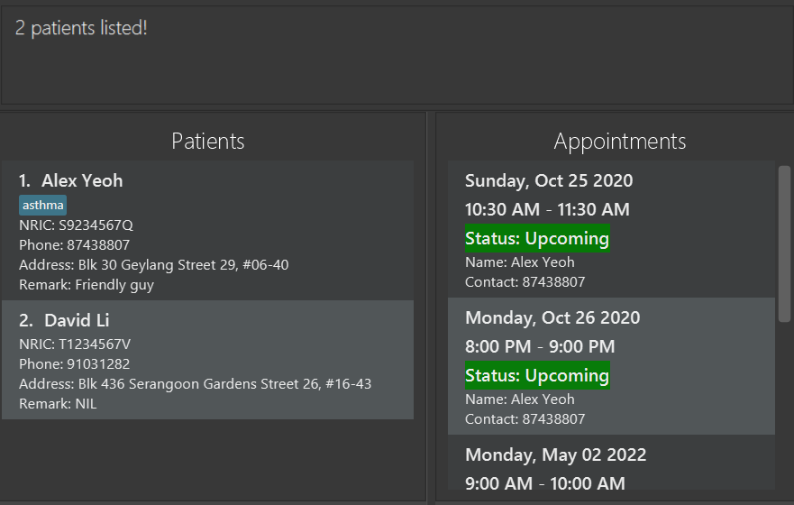

---
User Guide
---

PlaNus is a desktop app for **managing tasks, optimized for use via a Command Line Interface (CLI)** while still having the benefits of a Graphical User Interface (GUI). If you can type fast, PlaNus can get your tasks managed faster than traditional GUI apps.

## Quick start
* [Features](#features)
  * [Show all commands : `help`](#viewing-help-:-`help`)
  * [Listing all tasks : `list`](#listing-all-persons-:-`list`)
  * [Adding a task: `add`](### Adding a person: `add`)
  * [Deleting a task : `delete`](### Deleting a person : `delete`)
  * Mark a task as done: `done`
  * Editing a task : `edit`
  * Locating tasks by attribute and key: `find` 
  * Find by modules: `find module` [coming in future]
  * Find by time spent: `find time-spent` [coming in future]
  * Exiting the program : `exit`
* FAQ
* Command summary

--------------------------------------------------------------------------------------------------------------------

## Features

**Notes about the command format** 

* Words in UPPER_CASE are the parameters to be supplied by the user. 
  e.g. in `add title:TITLE`, `TITLE` is a parameter which can be used as `title:homework 1`.

* Items in square brackets are optional. e.g `desc:DESCRIPTION`  
`[desc:DESCRIPTION]` can be used as `title:homework 1 desc:science project` or just as `title:homework 1`.

* Items with `…`​ after them can be used multiple times including zero times. 
  e.g. `done INDEX…` can be used as (i.e. 0 times), `done 1 2 3`.

* Parameters can be in any order. 
  e.g. if the command specifies `title:TITLE desc:DESCRIPTION`, `desc:DESCRIPTION title:TITLE` is also acceptable.

### Viewing help : `help`

Shows a message explaining how to access the help page. 

Format: `help`

### Listing all persons : `list`

Shows a list of all persons in PlaNus.

Format: `list`

### Adding a person: `add`

Adds a person to the address book.

Format: `add n/NAME p/PHONE_NUMBER e/EMAIL a/ADDRESS [t/TAG]…​`

:bulb: **Tip:**
A person can have any number of tags (including 0)

Examples:
* `add n/John Doe p/98765432 e/johnd@example.com a/John street, block 123, #01-01`
* `add n/Betsy Crowe t/friend e/betsycrowe@example.com a/Newgate Prison p/1234567 t/criminal`

### Editing a person : `edit`

Edits an existing person in the address book.

Format: `edit INDEX [n/NAME] [p/PHONE] [e/EMAIL] [a/ADDRESS] [t/TAG]…​`

* Edits the person at the specified `INDEX`. The index refers to the index number shown in the displayed person list. The index **must be a positive integer** 1, 2, 3, …​
* At least one of the optional fields must be provided.
* Existing values will be updated to the input values.
* When editing tags, the existing tags of the person will be removed i.e adding of tags is not cumulative.
* You can remove all the person’s tags by typing `t/` without
    specifying any tags after it.

Examples:
*  `edit 1 p/91234567 e/johndoe@example.com` Edits the phone number and email address of the 1st person to be `91234567` and `johndoe@example.com` respectively.
*  `edit 2 n/Betsy Crower t/` Edits the name of the 2nd person to be `Betsy Crower` and clears all existing tags.

### Locating persons by name: `find`

Finds persons whose names contain any of the given keywords.

Format: `find KEYWORD [MORE_KEYWORDS]`

* The search is case-insensitive. e.g `hans` will match `Hans`
* The order of the keywords does not matter. e.g. `Hans Bo` will match `Bo Hans`
* Only the name is searched.
* Only full words will be matched e.g. `Han` will not match `Hans`
* Persons matching at least one keyword will be returned (i.e. `OR` search).
  e.g. `Hans Bo` will return `Hans Gruber`, `Bo Yang`

Examples:
* `find John` returns `john` and `John Doe`
* `find alex david` returns `Alex Yeoh`, `David Li` 
  

### Deleting a person : `delete`

Deletes the specified person from the address book.

Format: `delete INDEX`

* Deletes the person at the specified `INDEX`.
* The index refers to the index number shown in the displayed person list.
* The index **must be a positive integer** 1, 2, 3, …​

Examples:
* `list` followed by `delete 2` deletes the 2nd person in the address book.
* `find Betsy` followed by `delete 1` deletes the 1st person in the results of the `find` command.

### Clearing all entries : `clear`

Clears all entries from the address book.

Format: `clear`

### Exiting the program : `exit`

Exits PlaNus.

Format: `exit`

--------------------------------------------------------------------------------------------------------------------

## FAQ

**Q**: How do I start the application? 
**A**: In command prompt, go to the folder the application resides in and type: java - jar planus.jar

--------------------------------------------------------------------------------------------------------------------

## Command summary

Action | Format, Examples
--------|------------------
**Add** | `add title:TITLE type:TYPE_OF_TASK [desc:DESCRIPTION] [date:DATE]`   e.g., `add title:return book type:todo`
**Delete** | `delete INDEX...`  e.g., `delete 3 5 6`
**List** | `list`
**Help** | `help`
**Done** | `done INDEX...`  e.g., `done 1 2 3`
**Exit** | `exit`
