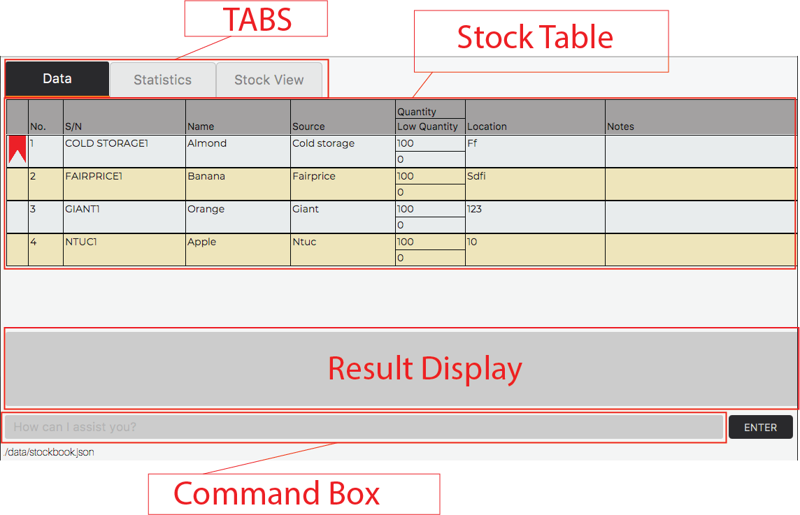
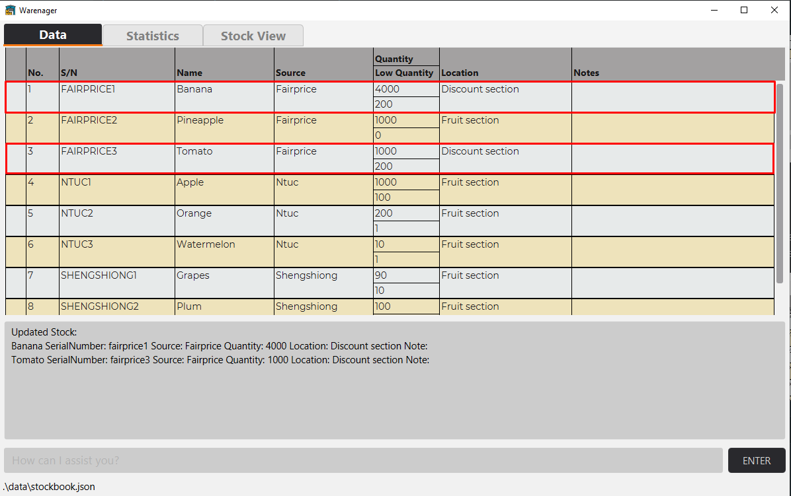
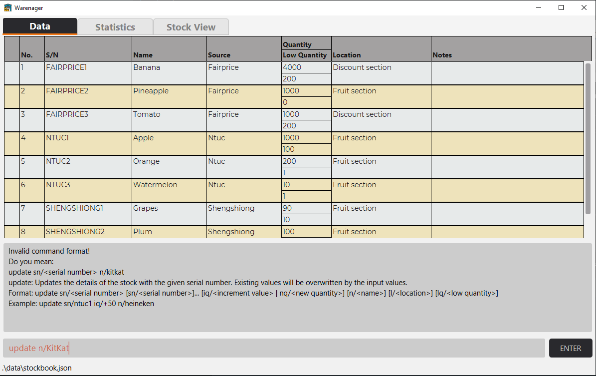
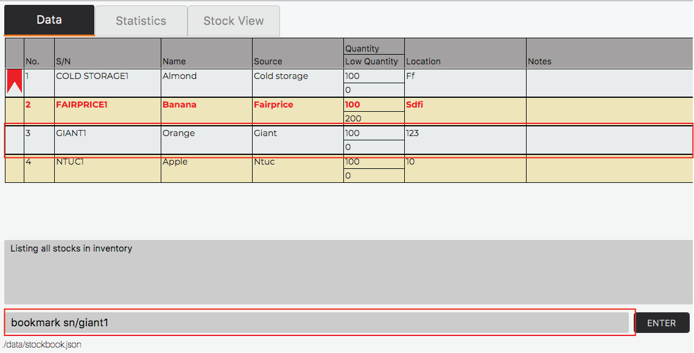
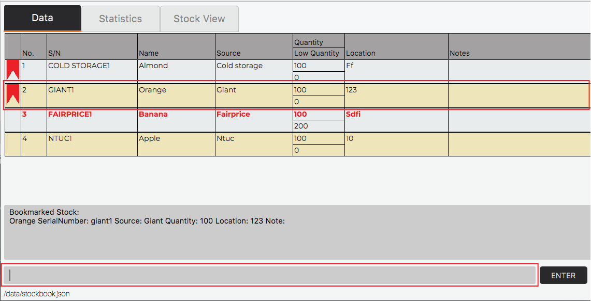
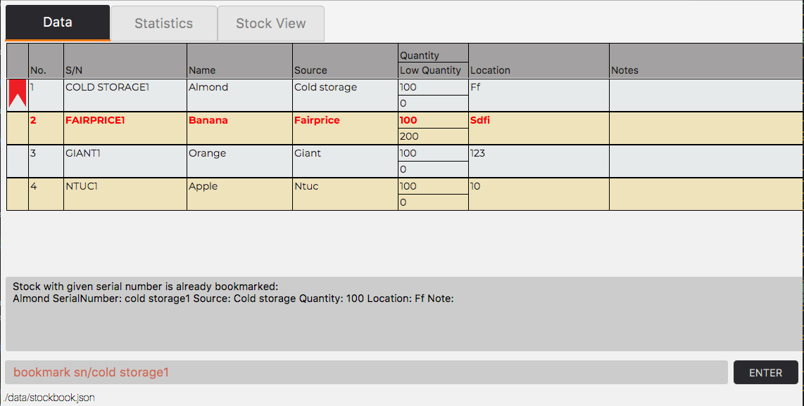
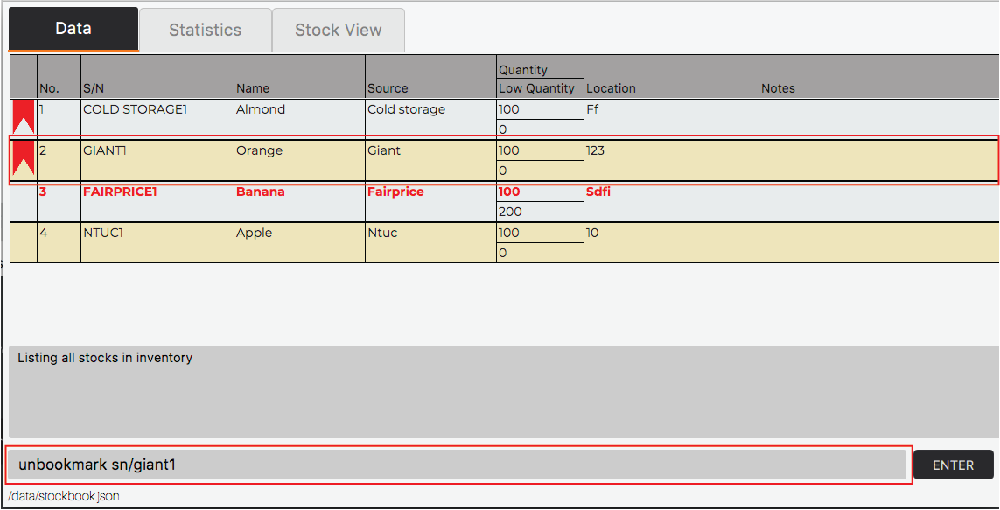
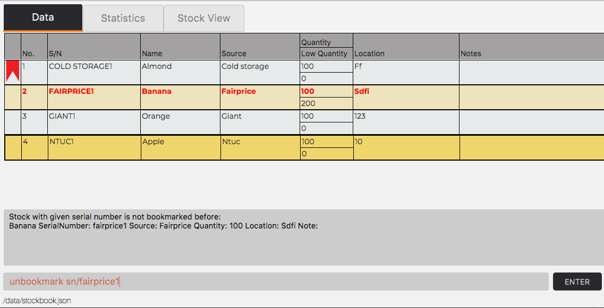
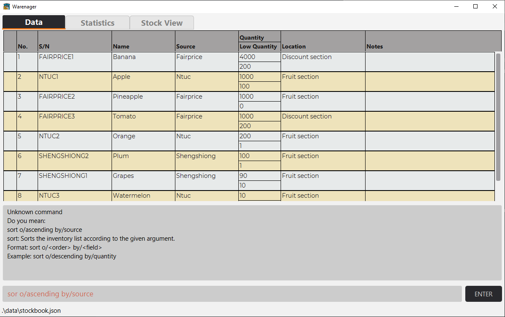

---
<h3>Table of Contents</h3>
* Table of Contents
{:toc}

--------------------------------------------------------------------------------------------------------------------
## Introduction

### Warenager’s User Guide

This user guide introduces our inventory management application, Warenager,
and provides support for the usage of its functionalities.
For quick reference, we have provided a [summarised table of commands](#command-summary)
and their usage formats.

### About Warenager

Warenager is an **inventory management application** to help warehouse managers
of small scale companies keep track of stocks in their warehouse.
It **optimizes inventory management tasks** for warehouse managers including but not
exhaustive of **updating, searching and sorting stocks** via Command Line Interface (CLI),
while still having the benefits of a Graphical User Interface (GUI).

--------------------------------------------------------------------------------------------------------------------
## Quick start
To get started using Warenager,

1. Ensure you have Java `11` or above installed in your Computer.

    <div markdown="block" class="alert alert-info">
    
    **:information_source: Installing Java 11**
    
    If you have not done Java programming before or have not used CLI-based applications
    programmed with Java like Warenager, then you probably do not have Java `11` installed in your computer. <br>
    You can install Java `11` [here](https://www.oracle.com/java/technologies/javase-jdk11-downloads.html).
    
    </div>

2. Download the latest `[CS2103T-T15-3][Warenager].jar` from [here](https://github.com/AY2021S1-CS2103T-T15-3/tp/releases).

3. Copy the jar file you have just downloaded to the folder you want to use as the _home folder_ for your Warenager.

4. Double-click the jar file to start the application.<br>

The commands available in the current version of
Warenager are: add, delete, update, find, findexact, note, notedelete,
stockview, stats, sort, print, bookmark, unbookmark, list and help.
Refer to the [Commands](#commands) section to for details of each command.

--------------------------------------------------------------------------------------------------------------------
## Definitions

Terms used in Warenager are defined here.
If your term is not stated here, google the term to understand more.

Term | Definition
--------|------------------
**Command Line Interface (CLI)** | A command-line interface processes commands to a computer program in the form of lines of text. 
**Graphical User Interface (GUI)** | The graphical user interface is a form of user interface that allows users to interact with electronic devices through graphical icons.
**Prefixes** | The field code that are entered during user input, so that Warenager will know what to do. e.g. `q/`, `n/`, `s/`, `sn/`.
**Parameters** | Parameters are additional fields to key in during user input and provided after a prefix. e.g. `<name>` in `n/<name>`.
**CSV File** | Comma-Separated Values File. It contains data separated by commas.
**JSON File** | JavaScript Object Notation File. Data interchange format file that uses human-readable text to store and transmit data objects consisting of attribute–value pairs.

--------------------------------------------------------------------------------------------------------------------
## Labels

Label | Meaning
--------|------------------
**:warning:** | Cautionary advice/Precautions
**:information_source:** | Useful notes/summaries for sections.

--------------------------------------------------------------------------------------------------------------------

## Features

<div markdown="block" class="alert alert-info">

**:information_source: Brief summary of features:**<br>

Note: Stocks possess these fields: Name, Serial Number, Source, Quantity, Location etc. <br>
(These stock details are presented in a drop down window.)

* **Adding** stocks: Unique serial number is generated based on the stock item and source company.
* **Deleting** stocks
* **Updating** stock fields
* **Searching** for stocks by
    * name of stock
    * serial number
    * source of stock
    * location stored in warehouse
* Adding / Deleting **optional notes** to stocks
* **Viewing** all details of a stock
* **Bookmarking** stocks: e.g. often used stocks, search bookmark<item>.
* **Print** to generate CSV file for printing of stock list.
* **Clear** to clear **all** existing data in Warenager.
* **Tab** to toggle between tabs in Warenager.
* **Listing** all stocks in Warenager.
* **Suggesting** valid command formats when an invalid command is entered.
* **Sorting** all stocks according to the field and order specified by the user.
* **Storage** into CSV and JSON files.

* Upon start up of the Warenager application, stocks are by default displayed
in order of decreasing priority: low quantity stocks, bookmarked stocks, other stocks.

</div>

--------------------------------------------------------------------------------------------------------------------
## Commands

This section provides support for the commands required to perform desired actions on Warenager.
<div markdown="block" class="alert alert-info">

**:information_source: Note for command input format:**<br>

* Words enclosed in `<>` are the input parameters to be supplied by the user. <br>
  For example, in `n/<name>`, `name` is a parameter which can be used as `n/Pork Belly`.

* Prefixes not enclosed with anything is compulsory, must be provided by the user, and duplicate is not allowed. <br>
  For example, in `list lt/<list type>`, the `lt/<list type>` must be provided and no duplicate is allowed. <br>
  `list` and `list lt/all lt/bookmark` are invalid command formats, but `list lt/all` is valid.

* Prefixes enclosed with `[]` is optional, can be omitted by the user, and duplicate is not allowed. <br>
  For example, in `update sn/<serial number> [n/<name>]`, the `n/<name>` can be omitted. <br>
  `update sn/Fairprice1 n/Apple` and `update sn/Fairprice1` are both valid command formats, <br>
  but `update sn/Fairprice1 n/Apple n/Banana` is not a valid command format.

* Prefixes with `...` trailing after them are allowed to be duplicated. <br>
  For example, in `delete sn/<serial number> [sn/<serial number>]...`, the `sn/<serial number>` must be provided at least once and duplicates are allowed. <br>
  `delete sn/Fairprice1` and `delete sn/Fairprice1 sn/Ntuc1` are both valid command formats, but `delete` is not a valid command format.
  
* Multiple prefixes combined with `|` means only one of them can be provided at a single command. <br>
  For example, in `update sn/<serial number> [iq/<increment value> | nq/<new quantity>]`, at most one of `iq/<increment value>`
  or `nq/<new quantity>` may be provided. <br>
  `update sn/Fairprice1 iq/+10 nq/100` is an invalid command format, but `update sn/Fairprice1 iq/+10`, 
  `update sn/Fairprice1 nq/100`, `update sn/Fairprice1` are all valid command formats.

* Multiple prefixes enclosed with `{ }` means that at least one of the prefixes within the `{ }` must be present
  in the command.<br>
  For example, in `find { [n/<name>] [s/<source>] [l/<location>] [q/<quantity>] }`, at least one of `n/<name>`,
  `s/<source>`, `l/<location>` and `q/<quantity>` must be provided in the command. <br>
  `find sn/Fairprice1 n/banana` is a valid command, but `find` and `find sn/Fairprice1 sn/ntuc` are invalid commands.
  
* Prefixes given can be in any order. <br>
  For example, `update sn/Fairprice1 n/Apple` and `update n/Apple sn/Fairprice1` are both valid and behave exactly the same.

* All 15 valid prefixes along with their default parameter description that are used in Warenager are <br>
  `n/<name>, s/<source>, q/<quantity>, lq/<low quantity>, l/<location>, lt/<list type>, sn/<serial number>, nq/<new quantity>,
  iq/<increment value>, nt/<note>, ni/<note index>, st/<statistics type>, by/<field>, o/<order>, fn/<file name>`.

* All parameters for prefixes are case-insensitive, with the **exception** of `nt/` prefix. <br>
  For example, `bookmark sn/Fairprice1` and `bookmark sn/FAIRPRICE1` are exactly the same.

</div>

<div markdown="block" class="alert alert-warning">

**:warning: Warning for invalid prefixes**

Unexpected behaviors might occur if any prefix besides the 15 valid prefixes recognized by Warenager is supplied by the user. <br>
In general, Warenager will not be able to parse any prefix besides the 15 valid prefixes above and will recognize the
invalid prefix as a parameter instead. <br>
For example, in `delete sn/Fairprice1 x/Random`, `Fairprice1 x/Random` will be recognized as the `<serial number>`. 

If a recognized prefix is supplied to a command which does not require this field, Warenager will not be able to parse this command
 and will show you an error message. <br>
For example, `print fn/stocks ni/0` is not a valid command as `ni/0` is not required in the `print` command.

</div>

<div markdown="block" class="alert alert-warning">

**:warning: Warning for invalid command input**

If an invalid command is entered with incorrect prefixes that results in Warenager
not able to perform the desired action, Warenager will return to the Data tab which
shows the entire stock book list.
You can then correct the command input and enter to perform the desired action.

</div>

### Command summary
Summary of the commands required to perform certain actions is listed in this table:

Action | Format, Examples
--------|------------------
**Add** | `add n/<name> s/<source> q/<quantity> l/<location> [lq/<low quantity>]` <br> e.g. `add n/Banana cake s/Fairprice q/100 l/Food section`
**List** | `list lt/<list type>` <br> e.g. `list lt/bookmark`
**Delete** | `delete sn/<serial number> [sn/<serial number>]...` <br> e.g. `delete sn/Fairprice1`
**Find** | `find { [n/<name>] [sn/<serial number>] [s/<source>] [l/<location>] }` <br> e.g. `find n/banana sn/SHENGSIONG`
**FindExact** | `findexact { [n/<name>] [sn/<serial number>] [s/<source>] [l/<location>] }` <br> e.g. `findexact n/banana sn/SHENGSIONG`
**Note** | `note sn/<serial number> nt/<note>` <br> e.g. `note sn/shengsiong1 nt/chicken will expire soon`
**NoteDelete** | `notedelete sn/<serial number> ni<note index>` <br> e.g. `notedelete sn/ntuc1 ni/1`
**StockView** | `stockview sn/<serial number>` <br> e.g. `stockview sn/ntuc1`
**Update** | `update sn/<serial number> [sn/<serial number>]... [iq/<increment value> `&#124;` nq/<new quantity>] [n/<name>] [l/<location>] [lq/<low quantity>]` <br> e.g. `update sn/Ntuc1 iq/+50 n/heineken` 
**Statistics** | `stats st/<statistics type>` <br> e.g. `stats st/source-qd-ntuc`
**Print** | `print fn/<file name>` <br> e.g. `print fn/stocks`
**Sort** | `sort o/<order> by/<field>` <br> e.g. `sort o/descending by/quantity`
**Bookmark** | `bookmark sn/<serial number> [sn/<serial number>]...` <br> e.g. `bookmark sn/China3`
**Unbookmark** | `unbookmark sn/<serial number> [sn/<serial number>]...` <br> e.g. `unbookmark sn/China3`
**Help** | `help`
**Clear**| `clear`
**Tab** | `tab`
**Exit** | `exit`

### Prefix summary
Summary of the prefixes known to Warenager is listed in this table:

Prefix | Parameter | Parameter Description
------ | --------- | -----------
**n/** | `<name>`  | The name of the stock. It is a string and only alphanumeric characters are allowed. <br> It must not be blank and it must not consists of only whitespaces.
**s/** | `<source>`| The source of the stock. It is a string and any valid ASCII characters are allowed. <br> It must not be blank and it must not consists of only whitespaces.
**q/** | `<quantity>` | The quantity of the stock. It is a number. <br> Only numbers between 0 and 2,147,483,647 inclusive are allowed.
**lq/** | `<low quantity>` | The threshold of low quantity of a certain stock. It is a number. <br> Only numbers between 0 and 2,147,483,647 inclusive are allowed.
**l/** | `<location>` | The location of the stock in the warehouse. It is a string and any valid ASCII characters are allowed. <br> It must not be blank and it must not consists of only whitespaces.
**lt/** | `<list type>` | The type of the list user want to view. It is a string and only the following values are known to Warenager. <br> `all`, `bookmark`, `low`.
**sn/** | `<serial number>` | The serial number of the stock. It is a string and any valid ASCII characters are allowed. <br> It must not be blank and it must not consists of only whitespaces. <br> It must always be ended by a number.
**nq/** | `<new quantity>` | The new quantity of the stock. It is a number. <br> Only numbers between 0 and 2,147,483,647 are allowed.
**iq/** | `<increment value>` | The quantity value the user wants to add to the stock. It is a number. Both negative and positive numbers are allowed.
**nt/** | `<note>` | The note the user wants to add. It is a string and any valid ASCII characters are allowed. <br> It must not be blank and it must not consists of only whitespaces.
**ni/** | `<note index>` | The note number the user wants to remove. It is a number and it must not be negative.
**st/** | `<statistics type>` | The statistics type the user wants to be shown. It is a string and only the following values are known to Warenager. <br> `source`, `source-qd-<existing source>` where `<existing source>` is a valid source currently inside Warenager.
**by/** | `<field>` | The field the user wants to be sorted. It is a string and only the following values are known to Warenager. <br> `name`, `quantity`, `serialnumber`, `source`, `location`.
**o/** | `<order>` | The order the user wants to be sorted. It is a string and only the following values are known to Warenager. <br> `ascending`, `descending`.
**fn/** | `<file name>` | The file name the stocks will be printed at. It is a string and only alphanumeric characters are allowed. <br> It must not be blank and it must not consists of only whitespaces.

--------------------------------------------------------------------------------------------------------------------

### Components of Warenager



**Tabs:** Displays the different tabs of the application.<br>
**Stock Table:** Displays all stocks in your inventory.<br>
**Result Display:** Displays the result of your command.<br>
**Command Box:** Place to input your commands.<br>


### Viewing help : `help`

Displays the list of command instructions for features in Warenager and how to use the command.

<h4>Format</h4>

```
help
```

<h4>Expected Help Window</h4>


### Adding new stock: `add`
Adds a new stock into the inventory. A unique serial number for the new stock will be generated by the program.

<div markdown="block" class="alert alert-info">

**:information_source: Note for low quantity field:**<br>

The low quantity field is the amount where you deem the stock to be low in quantity. Stocks that are highlighted 
in red are stocks that have quantities less than or equal to the low quantity field.
The optional field low quantity will be set to 0 if not present in the input.

</div>

<h4>Format</h4>

```
add n/<name> s/<source> q/<quantity> l/<location> [lq/<low quantity>]
```

<h4>Examples</h4>

```
add n/Orange s/Shengshiong q/1300 l/Fruits section
add n/Sprite s/Ntuc q/1000 l/Drinks section lq/5000
```

<h4>Below is a guided example for adding stocks:</h4>

**Step 1.** Let's add stock with the name `orange`, source of stock `shengshiong`,
 quantity of `1300` and location `fruits section`. The fields are **not** case-sensitive.
 Start by entering the command `add n/orange s/shengshiong q/1300 l/fruits section` in the command box.

**Before input**:


**After input**:


You have now added the stock successfully into the stock book. The stock will be added to the bottom
 of the stock table as shown above.

### Listing of stock: `list`
Lists all the stock(s) in the inventory.

<h4>Format</h4>

```
list lt/<list type>
```

<div markdown="block" class="alert alert-info">

**:information_source: The valid list types that can be provided and the respective list that it shows are**

**list type** | **What the list shows**
------| --------
**bookmark** | All the stocks in the inventory that is bookmarked.
**low** | All the stocks in the inventory that is low in quantity.
**all** | All the stocks in the inventory.

</div>

<h4>Below is a guided example for deleting stocks:</h4>
**Step 1.** Let's list out all the bookmarked stocks using the command `list lt/bookmark`.

**Before input**:


**After input**:


**Step 2.** We can then list out all the stocks that are low in quantity using the command `list lt/low`.

**Before input**:


**After input**:


**Step 3.** Lastly, listing out all the stocks using the command `list lt/all`.

**Before input**:


**After input**:


### Deleting of stock: `delete`
Deletes the stock(s) using the stock's serial number from the inventory. Multiple stocks can be deleted simultaneously.

<h4>Format</h4>

```
delete sn/<serial number> [sn/<serial number>]...
```

<h4>Examples</h4>

```
delete sn/courts1 sn/courts2
```

<h4>Below is a guided example for deleting stocks:</h4>
**Step 1.** Before you start any deletion, you might want to use the command `list lt/all` to list all
the stocks you have in Warenager. 


**Step 2.** Let's delete the stock with serial number `COURTS2`. The fields are **not** case-sensitive.<br>
A valid delete input would be `delete sn/courts2`.

**Before input**:


**After input**:


**Step 3.** Multiple stocks can also be deleted at the same time. Let's delete 2 stocks with serial numbers `COURTS3`
and `COURTS4`. It can be done by chaining the serial numbers when deleting.<br>
A valid delete input would be `delete sn/courts3 sn/courts4`.<br>

**Before input**:


**After input**:


<div markdown="block" class="alert alert-warning" markdown="1">

**:warning:**
Stocks that do not exist in Warenager cannot be deleted. Using the same input in the previous step,
`delete sn/courts3 sn/courts`, you should expect the following:


Invalid delete command formats will also result in an error.<br>
For example, the input `delet sn/courts3 sn/courts4` will lead in an error as shown below
as the keyword `delete` is misspelt.


The input `delete` will lead in an error as shown below as the compulsory fields with `sn/` is missing.


The input `delete sn/serial` will lead in an error as shown below as the serial number is invalid. This is
also true for inputs with no serial numbers like `delete sn/`.


The `delete sn/courts1 q/20` will lead in an error as shown below even though the serial number `courts1`
is found. This is because the prefix `q/` is not allowed, and it is not just limited to `q/`. In delete
commands, only the prefix `/sn` is allowed.


</div>


### Find stocks from inventory: `find`

Displays a list of stocks found in the inventory that contains all keywords
specified in ANY one of fields searched.

<h4>Format</h4> 

```
find { [n/<name>] [sn/<serial number>] [s/<source>] [l/<location>] }
```

<h4>Search criteria</h4>

* Only stocks that contain all the search keywords for a field will be displayed. <br>
    e.g. `find n/ChickenNuggets` will not match stock with Name: Chick. <br>
    e.g. `find n/ChickenNuggets abcdef` will not match stock with Name: ChickenNuggets. <br>


* Search is case-insensitive.
    e.g. `find n/ashLey` will match stock with Name: Ashley.

* Any stock with any field that contains all the search keywords in any of the fields searched will be displayed.<br>

<h4>Examples</h4>

Stock | Details
------| --------
**Stock 1** | Name: Banana<br> Serial Number: NTUC1111<br> Source: Ntuc<br> Quantity: 5<br> Location in warehouse: Fruits section
**Stock 2** | Name: Chicken<br> Serial Number: SHENGSIONG1111<br> Source: Shengsiong<br> Quantity: 100<br> Location in warehouse: Poultry section

```
find n/banana sn/SHENGSIONG
```
will match both Stock 1 and Stock 2 <br>

```
find l/section
```
will match both Stock 1 and Stock 2. <br>

```
find n/chicken l/poultry
```
will match only Stock 2. <br>

```
find s/ntuc l/singapore
```
will match only Stock 1.

<h4>Below is a guided example for finding stocks using the `find` command:</h4>
<div markdown="block" class="alert alert-info">

**:information_source:** 
The links provided are for reference if you do not know how to use the respective commands mentioned.

</div>

**Step 1.** Start by [adding](#adding-new-stock-add) 3 stocks to your stock list.<br>
`add n/apple juice s/ntuc l/fruits section a q/100`<br>
`add n/banana bun s/ntuc l/fruits section b q/200`<br>
`add n/pineapple tart s/cold storage l/fruits section c q/300`

The 3 stocks added should appear in your `Data` tab as shown in the image below.


Let's find the stock with **name that contains `apple` or source that contains `cold`**.

**Step 2.** Type the command `find n/apple s/cold` into the command box and enter. The result display should show
the keywords you searched for and how many stocks were found.<br>
In this case, the two stocks with names `apple juice` and `pineapple tart` would be found.

**After input:**


You have successfully used the `find` command.

Let's add an additional field into the search.

**Step 3.** Type the command `find n/apple s/cold l/unknown` in the command box and enter.
The same two stocks as in Step 2 should be found as they still match `n/apple`. 

**After input:**


You are now done with the guided tutorial for `find`.

<div markdown="block" class="alert alert-warning">

**:warning:** Below are some cases where `find` command does not work:
You will see an error message describing what went wrong
and the correct command format for the `find` command.

Continuing from the steps from the guided example above, 
let's try finding by **entering nothing** as a keyword. 

Type `find n/` into the command box and enter. You will see that no stocks will be found.

**After input:**


Let's try finding with an **invalid prefix**: `/nt` for the `find` command.

Type `find nt/apple` into the command box and enter. 

**After input:**


Let's try finding with a **duplicate** valid prefix for the `find` command.

Type `find n/apple n/pineapple` into the command box and enter.

**After input:**

</div>

### Find exact stocks from inventory: `findexact`
Displays a list of stocks found in the inventory that contains all keywords specified in ALL fields searched.

<div markdown="block" class="alert alert-info">

**:information_source:** The difference between the `find` and `findexact` command is that with the `find` command, stocks that
                       match any of the fields searched will be displayed while for `findexact`, stocks must match all the of the fields
                       searched to be displayed.<br>
                       <br>
                       For example, for `find n/apple s/cold`, stock details just need to match `n/apple` or `s/cold` to be displayed.
                       For `findexact n/apple s/cold`, stock details have to match both `n/apple` and `s/cold` to be displayed.

</div>

<h4>Format</h4>

```
findexact { [n/<name>] [sn/<serial number>] [s/<source>] [l/<location>] }
```

<h4>Search criteria</h4>
* Only stocks that contain all the search keywords for all fields will be displayed. <br>
    e.g. `findexact n/ChickenNuggets s/ntuc` 
    will not match stock with Name: Chick, Source: ntuc. <br>
    e.g. `findexact n/Chicken sn/1111`
    will match stock with Name: ChickenNuggets, SerialNumber: 1111. <br>
    e.g. `findexact n/ChickenNuggets abcdef l/section b`
    will not match stock with Name: ChickenNuggets, Location: section b.<br>

* Search is case-insensitive.
    e.g. `findexact n/ashLey s/nTuC` will match stock with Name: Ashley, Source: ntuc.

* Any stock with fields containing all the search keywords in all the fields searched will be displayed.<br>

<h4>Examples</h4>

Stock | Details
------| --------
**Stock 1** | Name: Banana<br> Serial Number: NTUC1111<br> Source: Ntuc<br> Quantity: 5<br> Location in warehouse: Fruits section
**Stock 2** | Name: Chicken<br> Serial Number: SHENGSIONG1111<br> Source: Shengsiong<br> Quantity: 100<br> Location in warehouse: Poultry section

```
findexact n/banana sn/SHENGSIONG
```
will not match Stock 1 and Stock 2.<br>

```
findexact l/section
```
will match both Stock 1 and Stock 2. <br>

```
findexact n/chicken l/section
```
will match only Stock 2. <br>

```
findexact n/banana s/ntuc l/singapore
```
will not match Stock 1 and Stock 2.

<h4>Below is a guided example for finding stocks using the `findexact` command:</h4>
<div markdown="block" class="alert alert-info">

**:information_source:** The links provided are for reference if you do not know how to use the respective commands mentioned.
If you are continuing from the above `find` command tutorial, you may skip step 1.

</div>

**Step 1.** Start by [adding](#adding-new-stock-add) 3 stocks to your stock list. <br>
`add n/apple juice s/ntuc l/fruits section a q/100`<br>
`add n/banana bun s/ntuc l/fruits section b q/200`<br>
`add n/pineapple tart s/cold storage l/fruits section c q/300`

The 3 stocks added should appear in your `Data` tab as shown in the image below.


Let's find the stock with **name that contains `apple` and source that contains `cold`**.

**Step 2.** Type the command `findexact n/apple s/cold` into the command box and enter. The result display should show
the keywords you searched for and how many stocks were found.<br>
In this case, only one stock, with the name `pineapple tart`, would be found.

**After input:**


You have successfully used the `findexact` command.

Let's add an additional field into the search.

**Step 3.** Type the command `findexact n/apple s/cold l/unknown` and enter.
No stock should be found as there is no stock with the location unknown.

**After input:**


You are now done with the guided tutorial for `findexact`.

<div markdown="block" class="alert alert-warning">

**:warning:** Cases where the `findexact` command does not work are the same as those in
the warning section in the [`find` command](#find-stocks-from-inventory-find) section,
with the replacement of the `find` command with the `findexact` command.

</div>

### Update inventory: `update`
Updates the details of the desired stock(s), requires the serial number of stock(s).

<h4>Format</h4>

```
update sn/<serial number> [sn/<serial number]... [iq/<increment value> | nq/<new quantity>] [n/<name>] [l/<location>] [lq/<low quantity>]
```

<div markdown="block" class="alert alert-info">

**:information_source: Updating nothing** <br>
Warenager recognizes updating nothing as a valid update command. 
For example, assuming stock with serial number `FAIRPRICE1` exist, `update sn/fairprice1` will be recognized as a valid command and executed.
Even though it essentially does nothing.

</div>

<div markdown="block" class="alert alert-warning">

**:warning: In case one of serial numbers is invalid** <br>
If more than one serial number is passed and at least one of them is wrong (not found in the inventory list), then the command
will not update anything and shows an error message.

</div>

Values to be updated are case-insensitive.

<h4>Below is a guided example for updating stocks:</h4>

**Step 1.** Before you start any updating activity, make sure to use the command `list lt/all` to list all
the stocks you have in Warenager. The list shown below will be the basis reference for this guided example. <br>


**Step 2.** Let's update the stock with serial number `NTUC1`. Let's update the name to `Apple` and the low quantity to `100`. Remember that the fields are **case-insensitive**. <br>
A valid update input would be `update sn/ntuc1 n/apple lq/100`. <br>

**Before input:**


**After input:**


**Step 3.** Multiple stocks can also be updated at the same time. Let's update 2 stocks with serial numbers `FAIRPRICE1`
and `FAIRPRICE3`. It can be done by chaining the serial numbers when updating.<br>
Let's update the low quantity to `200` and the location to `Discount section`
A valid update input would be `update sn/fairprice1 sn/fairprice3 lq/200 l/discount section`. <br>

**Before input:**


**After input:**



<div markdown="block" class="alert alert-warning" markdown="1">

**:warning: Nonexistent stocks**

Stocks that do not exist in Warenager cannot be updated. Using the update input `update sn/fairprice4 n/peach`,
you should expect the following error:


**:warning: Invalid command format**

Invalid update command format will also result in an error. Using the update input `updat sn/fairprice3 n/peach`,
you should expect the following error because the keyword `update` is misspelt:


**:warning: Missing compulsory prefixes**

Missing the compulsory prefix `sn/<serial number>` will result in an error. Using the update input `update n/KitKat`,
you should expect the following error:



**:warning: Invalid prefixes**

Providing invalid prefixes for update, even though it is a valid prefix in other commands, will result in
an error. Using the update input `update sn/fairprice1 fn/StockBook`, you should expect the following
error since `fn/<file name>` is invalid in update:


</div>


### Adding notes to stock: `note`
Adds a note to the stock specified, displayed in the notes column for that stock.
Multiple notes can be added to the stock and each note will be indexed. <br>

<h4>Format</h4>
```
note sn/<serial number> nt/<note>
```

<h4>Example</h4>
```
note sn/SHENG SIONG1 nt/chicken will expire soon
```

<h4>Below is a guided example for adding notes to stocks:</h4>

<div markdown="block" class="alert alert-info">

**:information_source:** If you already have stocks in your stock book, you may also skip Step 1.
Just make sure that the serial number of the stock you are adding the note to is correctly entered.
Use the `list lt/all` command to show all the stocks in the stock book in the `Data` tab.

</div>

**Step 1.** Start with [adding](#adding-new-stock-add) these 3 stocks in your
stock book in your `Data` tab as shown in the image below.


Let's add a note to stock with name Apple juice.

**Step 2.** Type `note sn/ntuc1 nt/buy on wednesday` into the command box and enter. You will see the note
added to the stock with name Apple juice at note index 1 in the Notes column.

**After input:**


Let's add different note to the same stock as in Step 2.

**Step 3.** Type `note sn/ntuc1 nt/another note for the SAME stock!` into the command box and enter.
You will see the note added to the stock with name Apple juice at note index 2 in the Notes column.

**After input:**


Let's add a note to a different stock from that in Steps 1 and 2.

**Step 4.** Type `note sn/COLD STORAGE1 nt/3 pineapple tarts JUST arrived` into the command box and enter.
You will see the note added to the stock with name Pineapple tart at note index 1 in the Notes column.

**After input:**


You are now done with the guided tutorial for `note`.

<div markdown="block" class="alert alert-warning">

**:warning:** Below are some cases where `note` command does not work:
You should see an error message describing what went wrong and the correct format for the `note` command.

Continuing from the steps from the guided example above, 
Let's try **entering nothing** as a note. 
Type `note sn/ntuc1 nt/` into the command box and enter.

**After input:**


Let's try adding a note to an **unknown** serial number.

Type `note sn/unknown1 nt/note` in the command box and enter.

**After input:**


Let's try adding a note but with an **invalid prefix**: `n/` for the `note` command.

Type `note sn/ntuc1 nt/valid note n/invalid` into the command box.

**After input:**


Let's try adding a note but with a **duplicate** valid prefix for the `note` command.

Type `note sn/ntuc1 nt/first note nt/second note` into the command box and enter.

**After input:**


</div>                        

### Deleting note(s) from stock: `notedelete`
Deletes a note, specified by the note's index, from the stock specified by its serial number.

<div markdown="block" class="alert alert-warning">

**:warning:**
Note index must be an integer.
To delete ALL notes from a stock, note index to specify is 0.

</div>

<h4>Format</h4>

```
notedelete sn/<serial number> ni/<note index>
```

<h4>Example</h4>

```
notedelete sn/ntuc1 ni/1
```

<h4>Below is a guided example for deleting notes from stocks:</h4>

**Step 1.** Start with these stocks in your stock book in your `Data` tab as shown in the image below.


<div markdown="block" class="alert alert-info">

**:information_source:** You may skip Step 1 and use the stocks that have notes already in your stockbook.
Make sure that the serial number of the stock and the note index of the note you are deleting
from the stock is correctly entered. Note that deleting notes is an irreversible action and you will have to
manually add the note back using the `note` command, if you deleted the note.
Use the `list lt/all` command to show all the stocks in the stock book in the `Data` tab.

</div>

Let's delete a note from the stock with name Pineapple tart.

**Step 2.** Type `notedelete sn/cold storage1 ni/2` into the command box and enter. 
You will see that the note at note index 2, `pineapple tarts for CNY`
of the stock with serial number `coldstorage1` has been deleted.

**After input:**


You have successfully used the `notedelete` command.

Let's try deleting all the notes from the stock with serial number `ntuc1` with one command.

**Step 3.** Type `notedelete sn/ntuc1 ni/0` into the command box and enter.
You will see that all the notes of the stock with serial number `ntuc1` has been deleted.

**After input:**


You are now done with the guided tutorial for `notedelete`.

<div markdown="block" class="alert alert-warning">

**:warning:** Below are some cases where `notedelete` command does not work:
You should see an error message describing what went wrong and the correct format for the `notedelete` command.

Continuing from the steps from the guided example above, 
Let's try deleting a note from an **unknown** serial number.

Type `notedelete sn/unknown1 ni/1` in the command box and enter.

**After input:**


Let's try deleting a note but with an **invalid prefix**: `n/` for the `notedelete` command.

Type `notedelete sn/cold storage1 ni/1 n/invalid` into the command box.

**After input:**


Let's try deleting a note but with a **duplicate** valid prefix for the `notedelete` command.

Type `notedelete sn/cold storage1 ni/1 ni/2` into the command box and enter.

**After input:**


Let's try deleting a note with an **invalid note index**. You will see that the note
index for the stock could not be found.

Type `notedelete sn/cold storage1 ni/10` into the command box and enter.

**After input:**


Let's try deleting a note from a stock **without notes**. You will see that
you cannot delete a note as the stock does not have notes.

Type `notedelete sn/ntuc1 ni/1` into the command box and enter.

**After input:**


</div>

### Viewing details of a stock: `stockview`
Shows the details of the stock, specified by its serial number, in the `Stock View` tab.

Details of the stock that are shown:
* Name
* Serial Number
* Quantity left
* Low quantity threshold
* Location stored in warehouse
* Notes

<h4>Format</h4>

```
stockview sn/<serial number>
```

<h4>Example</h4>

```
stockview sn/ntuc1
```

<h4>Below is a guided example for viewing a stock:</h4>
<div markdown="block" class="alert alert-info">

**:information_source:** 
The links provided are for reference if you do not know how to use the respective commands mentioned.

</div>
Let's see what the `Stock View` tab looks like first before using the `stockview` command.

**Step 0.** When you start up Warenager, click into the `Stock View` tab and it should
look as shown in the image below.

**Clicking into the `Stock View` tab:**


<div markdown="block" class="alert alert-info">

**:information_source:** If you already have stocks in your stockbook, you may skip Step 1.
Make sure that the serial number of the stock you want to view is correctly entered.
Use the `list lt/all` command to show all the stocks in the stock book in the `Data` tab.

</div>

**Step 1.** Start with these stocks in your stock book in your `Data` tab as shown in the image below.


Let's view the stock with serial number `COLD STORAGE1`.

**Step 2.** Type `stockview sn/cold storage1` into the command box and enter. 
You will be brought to the `Stock View` tab with the stock details shown as in the image below.

**After input:**


You have successfully used the `stockview` command.

Let's try [updating](#update-inventory-update) the stock that you have just viewed.
You may skip this Step 3 and just read through what will happen if you do not want to
update your stock.

**Step 3.** Type `update sn/cold storage1 n/pineapple tart 2` into the command box and enter.
You will be brought back to the `Data` tab with the stock's name updated. Click back to
the `Stock View` tab and you will see that the information for the stock that was viewed
has been updated.

**After input:**


**Clicking back to the `Stock View` tab:**


<div markdown="block" class="alert alert-info">

**:information_source:** The `Stock View` tab live updates when the details of the stock that is being
viewed has been updated.

</div>

Let's try [deleting](#deleting-of-stock-delete) the stock that you have just viewed.
You may skip this Step 4 and just read through what will happen if you do not want to
delete your stock.

**Step 4.** Type `delete sn/cold storage1` into the command box and enter.
You should be brought back to the `Data` tab with the stock deleted. Click back to the
`Stock View` tab and you should see that the `Stock View` tab has been emptied as the stock
is no longer in your stock book.

**After input:**


**Clicking back to the `Stock View` tab:**


<div markdown="block" class="alert alert-info">

**:information_source:** The `Stock View` tab empties when the stock that is being viewed is deleted.

</div>

You are now done with the guided tutorial for `stockview`.

<div markdown="block" class="alert alert-warning">

**:warning:** Below are some cases where `stockview` command does not work:
You should see an error message describing what went wrong and the correct format for the `stockview` command.

Continuing from the steps from the guided example above, 
Let's try deleting a note from an **unknown** serial number.

Type `stockview sn/unknown1` in the command box and enter.

**After input:**


Let's try viewing a stock but with an **invalid prefix**: `n/` for the `stockview` command.

Type `stockview sn/ntuc1 n/invalid` into the command box and enter.

**After input:**


Let's try viewing a stock but with a **duplicate** valid serial number prefix.

Type `stockview sn/ntuc1 sn/ntuc2` into the command box and enter.

**After input:**


</div>

### Generating statistics: `stats`
Generates a statistical view in a pie chart depicting the target fields.

<h4>Format</h4>

```
stats st/<statistics type>
```

<div markdown="block" class="alert alert-info">

**:information_source: The valid statistics types that can be provided and what the respective statistics describes are**

**Statistics type** | **What the statistics describes**
------| --------
**source** | Distribution of source companies.
**source-qd-<source company>** | Distribution of stocks for the target source company.

</div>

<h4>Examples</h4>

```
stats st/source, stats st/source-qd-abc ("abc" is an existing source company)
```

<h4>Below is a guided example for displaying statistics:</h4>

Start Warenager. Suppose you want to display source statistics. After the input, you should notice that
the title in the statistics window as highlighted corresponds to the type of statistics shown.<br>
The valid statistics input would be `stats st/source`.

**Before input:**


**After input:**


Now suppose you want to display source statistics for the source company `courts`. After the input, you
should notice that the title in the statistics window as highlighted now corresponds to the source company `courts`.<br>
The valid statistics input would be `stats st/source-qd-courts`.

**Before input:**


**After input:**


<div markdown="block" class="alert alert-warning" markdown="1">

**:warning:**
If Warenager is first started up, you should expect the following in the **Statistics** tab,
and this is **intended**:


</div>

### Bookmarking stocks in the list: `bookmark`
Bookmarks the desired stock(s). 
Bookmarking a stock pushes the stock to the top of the stock list.

<h4>Format</h4>

```
bookmark sn/<serial number> [sn/<serial number>]...
```

<h4>Below is a guided example for viewing a stock:</h4>

**Step 1.** You want to bookmark the stock with serial number `giant1`. You can bookmark the stock by
using the command `bookmark sn/giant1`. Below shows the desired outcome.

**Before input:**



**After input:**



<div markdown="block" class="alert alert-warning" markdown="1">

**:warning: Nonexistent Stocks**

Stocks that do not exist in Warenager cannot be bookmarked. Using the update input `bookmark sn/fairprice4`,
you should expect the following error:


**:warning: Bookmarked Stocks**

Bookmarking a bookmarked stock will also result in an error. Using the bookmark input `bookmark sn/cold storage1`,
you should expect the following error:



</div>

### Unbookmarking stocks in the list: `unbookmark`
Removes bookmark from the desired stock(s).

<h4>Format</h4>

```
unbookmark sn/<serial number> [sn/<serial number>]...
```

<h4>Below is a guided example for viewing a stock:</h4>

**Step 1.** You want to unbookmark the stock with serial number `giant1`. You can unbookmark the stock by
using the command `bookmark sn/giant1`. Below shows the desired outcome.

**Before input:**




**After input:**


<div markdown="block" class="alert alert-warning" markdown="1">

**:warning: Nonexistent Stocks**

Stocks that do not exist in Warenager cannot be unbookmarked. Using the update input `unbookmark sn/fairprice4`,
you should expect the following error:


**:warning: Not Bookmarked Stocks**

Unbookmarking a stock that is not bookmarked will also result in an error.
Using the bookmark input `bookmark sn/fairprice1`,you should expect the following error:


</div>

</div>

### Sorting inventory: `sort`
Sort the inventory by a specific field and order.

<h4>Format</h4>

```
sort o/<order> by/<field>
```

<div markdown="block" class="alert alert-info">

**:information_source: Regarding order and field to be sorted** 

* The order can only be one of the following:
    1. `ascending` - sorts the inventory in ascending order
    2. `descending` - sorts the inventory in descending order
    
* The field can only be one of the following:
    1. `name` - sorts the inventory by name
    2. `source` - sorts the inventory by source
    3. `quantity` - sorts the inventory by quantity
    4. `location` - sorts the inventory by location
    5. `serialnumber` - sorts the inventory by serial number

</div>

<div markdown="block" class="alert alert-info">

**:information_source: Regarding comparison between stocks** 

For sorting by `name`, `source`, `location`, and `serialnumber`, Warenager will compare fields by
their lexicographical order. For example, in `sort o/ascending by/name`, the stock with name `100`
will be listed above the stock with name `2` since `100` is lexicographically smaller than `2`.

For sorting by `quantity`, Warenager will compare quantity by mathematical integer ordering.
For example, in `sort o/ascending by/quantity`, the stock with quantity `100` will be listed below
the stock with quantity `2`, since `100` is greater than `2`.

</div>

<h4>Below is a guided example for sorting stocks:</h4>

**Step 1.** The list shown below will be the basis reference for this guided example. <br>


**Step 2.** In the picture above, the stock is sorted by serial number in ascending order.
Suppose that we now want to view the stocks by name in ascending order instead. <br>
A valid sort input would be `sort o/ascending by/name`. <br>

**Before input:**


**After input:**


**Step 3.** It is also possible to sort in descending order.
Suppose that we now want to view the stocks by quantity in descending order. <br>
A valid sort input would be `sort o/descending by/quantity`. <br>

**Before input:**


**After input:**


<div markdown="block" class="alert alert-warning" markdown="1">

**:warning: Invalid command format**

Invalid sort command format will result in an error. Using the sort input `sor o/ascending by/source`,
you should expect the following error because the keyword `sort` is misspelt:



**:warning: Missing compulsory prefixes**

Missing any of the compulsory prefixes `o/<order>` and `by/<field>` will result in an error.
Using the sort input `sort o/ascending`, you should expect the following error:


**:warning: Invalid prefixes**

Providing invalid prefixes for sort, even though it is a valid prefix in other commands, will result in
an error. Using the sort input `sort o/descending by/serialnumber iq/+50`, you should expect the following
error since `iq/<increment value>` is invalid in sort:


</div>

### Command Suggestion

Sometimes user will type in wrong commands. Warenager will help such user by suggesting the correct format
of the command if the command word is valid. If the command word is invalid, then Warenager will try to predict
and suggest the closest command to whatever the user has typed.

<div markdown="block" class="alert alert-info">

**:information_source: When will suggestion appear?** 

The suggestion will only be made if the command format is invalid or unknown.
If the command is valid, but there are errors such as serial number not found when executing commands,
then Warenager will not suggest anything to the user and instead displays an error message.

</div>

<div markdown="block" class="alert alert-info">

**:information_source: What prefixes and parameters will be suggested?** 

The suggestion feature will always suggest a valid command format.

Therefore, when giving a certain suggestion, Warenager will throw out every prefix that are
not valid for that particular command, even though the prefixes were provided by the user.

Furthermore, for every valid prefixes (both compulsory and optional) that the user has entered,
Warenager will check if the parameter supplied for each of those valid prefixes are also valid.
For parameters that are deemed to be invalid, Warenager will display the parameter's default description.

Lastly, for every compulsory prefixes that is required for the suggested command, but were
not supplied by the user, Warenager will add them to the suggestion message along with
their parameter's default description.

Every optional prefix that is valid for the suggested command if not entered by the user
will not be suggested by Warenager.

For example, consider the case where user has entered an invalid command
`ad n/apple s/ q/1000 sn/fairprice1`

The command Warenager will then suggest will be
`add n/apple s/<source> q/1000 l/<location>`

Explanation:
* Warenager will first try to predict the intended command word. Warenager will conclude that
  the command word intended was `add`.
* Warenager will now check for compulsory prefixes with respect to the infered command `add`.
  The first prefix is `n/` and its parameter `apple`. It is valid and hence the suggestion message
  generated is `n/apple`.
* The second prefix is `s/` and its parameter is empty. The parameter is not valid and hence the
  suggestion message generated is `s/<source>`.
* The third prefix is `q/` and its parameter is `1000`. It is valid and hence the suggestion message
  generated is `q/1000`.
* The fourth prefix is `sn/fairprice1` which is not a valid prefix with respect to `add` command word.
  Therefore it is discarded.
* Lastly, Warenager will notice that the compulsory prefix `l/` is missing and hence the suggestion
  message generated is `l/<location>`.
* The prefix `lq/` is not generated since it is an optional prefix and not supplied by the user.

</div>

<div markdown="block" class="alert alert-warning">

**:warning: Accuracy and correctness of suggestion**

In short, the suggestion feature will always suggest a correct and valid command format, but
it cannot guarantee that the suggested command will run without execution errors.

Warenager uses a certain heuristic (minimum edit distance) to predict the intended command. Since it
is a heuristic, and therefore a method to predict, it may not be 100% accurate and bound to make
some mistakes.

More information about the heuristic used and thus how Warenager will predict the intended command
can be found at Warenager's [Developer Guide](https://ay2021s1-cs2103t-t15-3.github.io/tp/DeveloperGuide.html#suggestion-feature).

</div>

<h4>Below is a guided example for command suggestion:</h4>

**Step 1.** The list shown below will be the basis reference for this guided example. <br>


**Step 2.** Suppose now we want to add a new stock with the following description:
* name: eggplant
* source: fairprice
* quantity: 500
* low quantity: 100
* location: vegetable section

A valid input would be `add n/eggplant s/fairprice q/500 l/vegetable section lq/100`.

But we make a mistake and instead entered `ad n/eggplant sn/fairprice q/500 l/vegetable section lq/100`

**Before input:**


**After input:**


**Step 3.** As shown above, the suggestion `add n/eggplant s/<source> q/500 l/vegetable section lq/100` is generated.
Now we can amend our input according to the suggested format.
We now enter a valid input `add n/eggplant s/fairprice q/500 l/vegetable section lq/100`.

**Before input:**


**After input:**


As shown above, the stock has been successfully added.

### Generates a CSV file that contains all stocks: `print`
Generates a CSV file that contains all stocks.

<div markdown="block" class="alert alert-info">

Csv file will be named according to the input, and the file name
can only contain alphanumeric characters. You may want to sort the stocks using `sort` command
to sort the stock in their preferred order as mentioned [earlier](#sorting-inventory-sort) before converting it into the CSV file. The CSV file is saved
to `[root directory]/data/userInput.csv` after successfully executing the command.

</div>

<h4>Format</h4>

```
print fn/<file name>
```

<h4>Examples</h4>

```
print fn/stocks
```

<h4>Below is a guided example for creating CSV file:</h4>

**Step 1.** Let's create a CSV file with a file name of `stocks`. Start by typing `print fn/stocks` in the command box. 


**Step 2.**  After successfully executing the command, proceed to the folder which
 contains Warenager. Click on the `data` folder circled in red.


 
**Step 3.** Open `stocks.csv` folder circled in red with excel.


**Step 4.** The stocks in your inventory will be listed according the to format shown below. The file also includes
the latest update time for the `stocks.csv`.


**Step 5.** The columns and rows in the csv file will not be formatted to show the full text in a cell.
You will need to resize the columns and row of the excel sheet to see the full text of a cell as shown below.


<div markdown="block" class="alert alert-warning" markdown="1">

**:warning: Warning before executing print command**<br>
`print` writes over a CSV file of the same file name and is an irreversible process.
 Do backup the data it if might be needed again.

</div>

### Clearing all data in Warenager: `clear`
Clears all the existing data in Warenager.

<h4>Format</h4>

```
clear
```
<div markdown="block" class="alert alert-warning" markdown="1">

**:warning: Warning for clearing data**<br>
`clear` is an irreversible process. Do backup the data it if might be needed again.

</div>

<h4>Below is the expected outcome for clearing Warenager:</h4>

**Before input:**


**After input:**


### Toggling tabs: `tab`
Toggles between the tabs in Warenager.

<h4>Format</h4>

```
tab
```
<h4>Below is a guided example for toggling tabs:</h4>
In this example, Warenager is started up for the first time. Observe that you are always in the
data tab after each startup.


**Step 1.** Now input the command word `tab` and hit enter. This should bring you to the next tab,
which is the **Statistics** tab.

**Before input:**


**After input:**


**Step 2.** Now input the command word `tab` again and hit enter. This should bring you to the next tab,
which is the **Stock view** tab.

**After input:**


**Step 3.** Now input the command word `tab` again and hit enter. This should bring you back to the **Data** tab.

**After input:**


<div markdown="block" class="alert alert-warning" markdown="1">

**:warning:**<br>
Note that the above example used is a new Warenager session. If you have already used the `stats` command
input at least once in your current Warenager session, you should see the latest piechart viewed when you
are in **Statistics** tab.


Similarly, if you used the `stockview` command input at least once in your current Warenager session,
you should see an existing table describing the latest stock viewed.


</div>

### Saving data
Data (all stocks in inventory in JSON) is automatically saved to
`[root directory]/data/stockbook.json` when any of these commands are executed:
* add
* delete
* note
* update
* clear

The set of used serial number sources is automatically saved to
`[root directory]/data/serialnumbers.json` when any of these commands is executed:
* add

### Exiting Warenager: `exit`
Terminates the program.

<h4>Format</h4>

```
exit
```

--------------------------------------------------------------------------------------------------------------------
## FAQ

**Q**: Can I use Warenager on any OS?<br>
**A**: Yes. Warenager is supported by Windows, Mac and Linux.

**Q**: Can I use Warenager on another device?<br>
**A**: Yes. Simply transfer the JSON data files under `/data` and copy over to the same directory `/data` in the Warenager of your
other device.

--------------------------------------------------------------------------------------------------------------------
