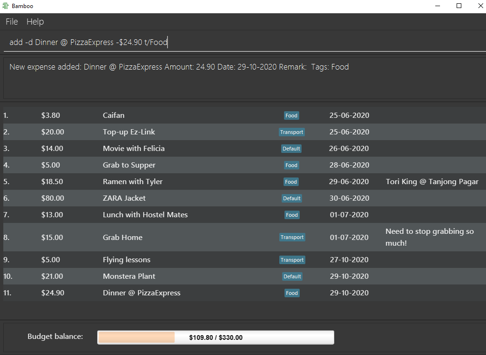
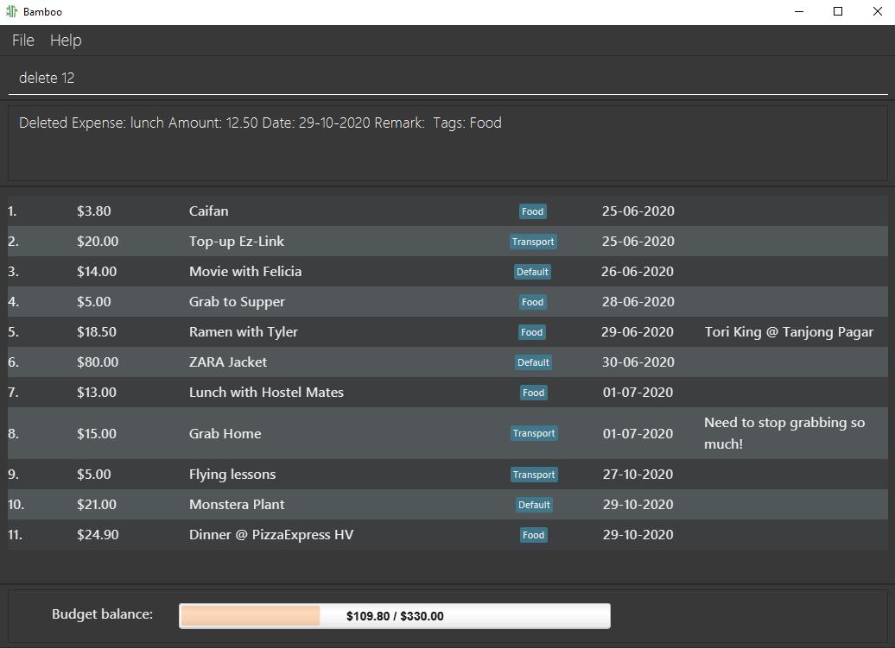
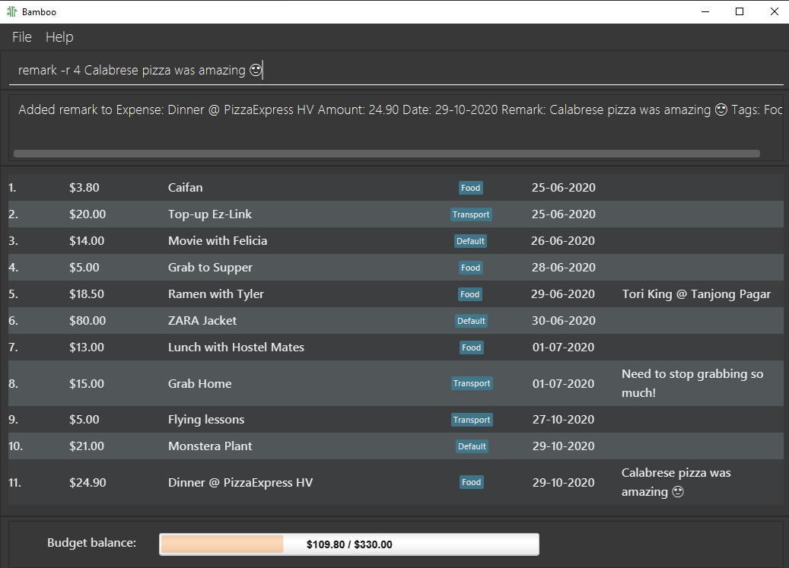

# User Guide

Bamboo (v1.3) is a **simple desktop app for managing personal finance, optimized for use via a Command Line Interface (CLI),** and targeted at college students. If you can type fast, Bamboo v1.2 can get your financial management tasks done faster than traditional GUI apps.

---

## Table of content

1. [Quick Start](#QuickStart)
2. [Features](#Features)
3. [Usage](#Usage)
4. [Command Summary](#CommandSummary)

## Quick Start 

1. Download Java Version 11
2. Download [Bamboo v1.3](https://github.com/AY2021S1-CS2103-W14-3/tp/releases/tag/v1.3).

## Features 

1. **Add**
    - Adds new expense record.
    - Command: `add`
    - [API](#add)

1. **List**
    - Displays a list of the all the user's expenses.
    - Command: `list`
    - [API](#list)

1. **Update**
    - Edits existing expense record.
    - Command: `edit`
    - [API](#edit)

1. **Delete**
    - Deletes a specified existing expense record.
    - Command: `delete`
    - [API](#delete)

1. **Top up budget**
    - Increases a budget by amount input by user.
    - Command: `topup`
    - [API](#topup)

1. **Category tagging**
    - Tags expenses by their categories
    - Prefix: `t/`
    - [API](#tag)

1. **Expense finding**
    - Finds expenses by keywords, date, tags
    - Command: `find`
    - [API](#find)

1. **Adding Remark**
    - Adds a remark to an existing expense
    - Command: `remark`
    - [API](#remark)
    
1. **Sorting expenses**  
    - Sort by **date, description (alphabetical), amount**, with option of reverse sort 
    - Command: `sort` 
    - [API](#sort)
    
1. **Switch Category**
    - Switches an expense book into another existing category
    - Command: `switch`
    - [API](#switch)

1. **Category adding**
    - Adds a new category (for budgeting and expenses)
    - Command: `addCat`
    - [API](#addCat)

1. **Delete Category**
    - Deletes an existing category in the expense book
    - Command: `deleteCat`
    - [API](#deleteCat) 
    
1. Save Load Function
    - Auto saves the new state of expense book after each operations
    - Auto load previously saved data upon initialisation of the application

1. Help command
    - Renders a help link to the commands in User Guide
    - Command: `help`
    - [API](#help)
        
1. Password &lt;pending&gt;
1. Multiple Accounts &lt;pending&gt;
1. GUI &lt;pending&gt;>
1. Budget notifications &lt;pending&gt;
1. Achievements &lt;pending&gt;
1. Graphs and progress trackers &lt;pending&gt;
1. Colours &lt;pending&gt;
1. Sort/Search more powerful &lt;pending&gt;
1. Customisation of workflow → shortcuts etc. &lt;pending&gt;
1. Simulation of spending &lt;pending&gt;

## Usage/ API 
### Commands
1. **add** 
    - Order of arguments is flexible.
    - Date input (DD-MM-YYYY) is optional, defaults to system's date.
    - Tag input is optional, defaults to the Default category.
    - If multiple fields of the same type are specified, only the last one is processed.
    - Format: `add -d<description> -$<amount_spent> [-@<date>] [t/<category>]`
    - Example: `add -ddinner -$10.50` Adds the spending to **current date's** record
    - Example: `add -ddinner -$10.50 -@24-06-2020 t/Food` Adds the spending to **input date's** record and tags with **input category**
    - Example: `add -ddinner -$10.50 -@20-08-2020 t/Food t/Basic` Adds the spending to **input date's** record and tags with the last **input category**
    - Input constraints:
      - If specified, the tag input must match one of the categories in the expense book.
      - The expense to be added must not share the same identity fields (description, amount and date) as any expense in the expense book.

    

1. **list** 
    - Format: `list`
    - Example: `list` Displays all the items in the list.

    

1. **edit** 
    - Identified by index starting from 1.
    - Order of arguments is flexible except index.
    - Edited fields overwrite the previous field completely.
    - **At least 1 of the 4 fields** (description, amount, date, category) of expense must be specified.
    - Format: `edit <index> [-d<description>] [-$<amount_spent>] [-@<date>] [t/<category>]`
    - Example: `edit 1 -dlunch -$12.50`
    - Example: `edit 11 -$12.50 -dlunch -@23-06/2020 t/Food`
    - Input constraints:
      - See [add](#add)
    - NOTE: Specifying a blank tag field (e.g. `edit 1 t/`) is the same as editing the tag to the Default tag.

    

1. **delete** 
    - Deletes a specified existing expense record.
    - Identified by index starting from 1.
    - Format:  `delete <index>`
    - Example: `delete 11` Deletes the item at index 11 of the list.

    

1. **addCat** 
    - Adds a new category to the expense book.
    - The category must not already exist in the expense book.
    - Format: `addCat t/<category>`
    - Example: `addCat t/Food`
    
    
    
1. **topup** 
    - Increases the budget of a particular category by the amount specified by the user.
    - Expenses in the same category reduce the balance of the budget.
    - Tag input is optional, defaults to the Default category.
    - Format: `topup -$<amount> [t/<category>]`
    - Example: `topup -$10` Adds an extra budget of 10 dollars to the Default category-budget.
    - Example: `topup -$20 t/Food` Adds an extra budget of 20 dollars to the Food category-budget.

    

1. **find** 
    - Finds expenses with given keywords and/or date by user.
    - Expenses that fits the criteria will be presented as another list.
    - Keywords are case-sensitive, and partial word matching is supported.
    - Format: `find [-d<description>] [-@<date>]`
    - Example: `find -dPhone`, `find -dlunch -@01-07-2020`

    

1. **remark** 
    - Adds a remark to an existing expense.
    - Format: `remark <index> -r <remark>`
    - Example: `remark 11 -r Pepper Lunch`

    
    
8. **sort** 
    - Sorts expenses in current view.
    - **Sorting keywords** (and thus criterion) include:
        - expense amount: `amount`
        - date: `date`
        - description (alphabetical order): `description` 
    - Add a "R" behind sorting keywords to induce reversed sorting order
    - Sorting criterion are assigned priority in order of appearance.
    - A minimum of 1 sorting keyword is required  
    - Format: `sort -by <sorting keyword> [-by <sorting keyword>] [-by <sorting keyword>]`
    - Example: `sort -by date -by descriptionR` (sorts by date, then by reversed alphabetical order of the descriptions)

    
    
1. **switch** 
    - Switches an expense book into another category.
    - Category switched must already exists in expense book
    - Format: `switch t/<category>`
    - Example: `switch t/Food`

    
    
 1. **deleteCat** 
    - Deletes an existing category in expense book.
    - Category budget with the same category will be deleted
    - Expenses with the same category will be changed to "Default" tag
    - Format: `deleteCat t/<category>`
    - Example: `deleteCat t/Food`
    
    
    
 1. **help** 
    - Renders a help link to the commands in User Guide
    - Format: `help`
    - Example: `help` 
    
    

### Fields
1. **description**
    - Description of expense made.
    - Works only in complement with [add](#add), [edit](#edit), [find](#find), [sort](#sort)
    - Prefix: `-d`
    - Format: `-d<description>`
    - Example: `-dlunch`, `-ddinner`

1. **amount**
    - Amount of expense made
    - Works only in complement with [add](#add), [edit](#edit), [find](#find), [sort](#sort), [topup](#topup)
    - Prefix: `-$`
    - Format: `-$<amount>`
    - Example: `-$2`, `-$1.50`

1. **date**
    - Date at which expense was made
    - Works only in complement with [add](#add), [edit](#edit), [find](#find), [sort](#sort)
    - Prefix: `-@`
    - Format: `-@<DD-MM-YYYY>`
    - Example: `-@01-07-2020`, `-@02-07-2020`

1. **tag** 
    - Tags expense by a category input by user
    - Works only in complement with [add](#add), [edit](#edit), [find](#find), [switch](#switch), [deleteCat](#deleteCat)
    - Format: `t/<category>`
    - Example: `edit t/Food`, `find -dCoffee t/Food`

## Command summary 

|   Action      | Format, Examples                                                                                                                                              |
|---------------|---------------------------------------------------------------------------------------------------------------------------------------------------------------|
|  **Add**      | `add -d<description> -$<amount_spent> [-@<date>] [t/<category>]`   e.g., `add -ddinner -$10.50`, `add -ddinner -$10.50 -@20-08-2020 t/Food`                |
|  **List**     | `list`                                                                                                                                                        |
|  **Edit**     | `edit <index> [-d<description>] [-$<amount_spent>] [-@<date>] [t/<category>]`  e.g.,`edit 1 -dlunch -$12.50`, `edit 1 -$12.50 -dlunch -@11-11/2020 t/Lunch`|
| **Delete**    | `delete <index>`  e.g., `delete 1`                                                                                                                         |
| **Topup**     | `topup -$<amount> [t/<category>]`  e.g., `topup -$200`, `topup -$30 t/Food`                                                                                |
|  **Find**     | `find [-d<description>] [-@<date>]`   e.g., `find -dlunch`, `find -dlunch -@01-07-2020`                                                                    |
| **Remark**    | `remark <index> -r<remark>`   e.g., `remark 11 -r Pepper Lunch`                                                                                            |
| **Sort**      | `sort -by <sorting keyword> [-by <sorting keyword>] [-by <sorting keyword>]`   e.g., `sort -by date -by descriptionR`                                      |
| **Switch**    | `switch t/<category>`   e.g., `switch t/Food`                                                                                                              |
| **AddCat**    | `addCat t/<category>`  e.g., `addCat t/Food`                                                                                                               |
| **DeleteCat** | `deleteCat t/<category>`   e.g., `deleteCat t/Food`                                                                                                        |
| **Help**      | `help`                                                                                                                                                        |
