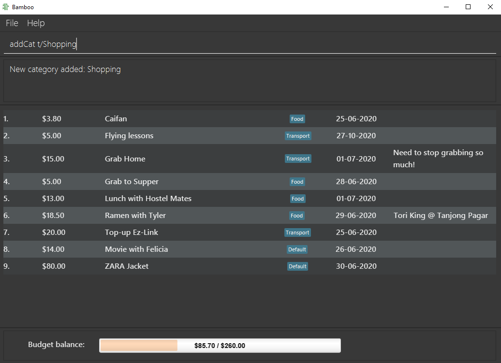
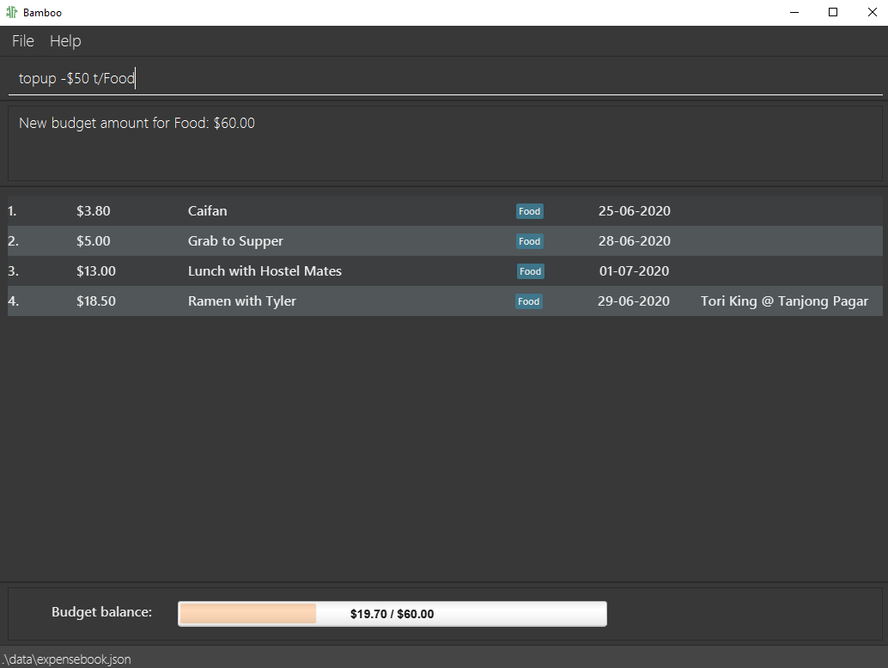

# User Guide

Bamboo (v1.4) is a **simple desktop app for managing personal finance, optimized for use via a Command Line Interface (CLI),** and targeted at college students. If you can type fast, Bamboo v1.4 can get your financial management tasks done faster than traditional GUI apps.

This User Guide explains how you can use Bamboo to manage your personal finances. Let's grow our wealth! :bamboo:

Refer to [Quick Start](#QuickStart) for a short tutorial on how to set up Bamboo on your system, and refer to [Features](#Features) for a full walk-through of Bamboo's features.

---

## Table of contents

1. [Quick Start](#QuickStart)
2. [Features](#Features)
3. [Usage](#Usage)
4. [Command Summary](#CommandSummary)

## Quick Start 
> _Bamboo runs on Windows, OS-X, and Unix systems._
1. Ensure that Java Version 11 or above is installed in your computer
2. Download the latest Bamboo Release `ExpenseBook.jar` [here](https://github.com/AY2021S1-CS2103-W14-3/tp/releases/tag/v1.4).
3. Copy the file to the folder you want to use as the home directory for Bamboo.
4. Double-click the file to start the app. It should open in a new window.
    OR Navigate to the directory on terminal and run `java -jar ExpenseBook.jar`.
5. Type in commands with arguments in the command input box above, and press `Enter` to execute them.
6. Use the `help` command to find out the list of commands available, or we'd recommend checking out the
[Features](#Features) section for a comprehensive guide!
7. Let's grow our wealth together!

## Command Format Guide

This section explains the format of commands in this User Guide.

* Items in <angular_brackets> are types of parameters to be supplied by the user e.g. in `add -d <description>`, `<description>` refers to a description of an expense such as "Lunch @ Thai Place".
* Items in square brackets are optional e.g `-d <description> [-@<date>]` means that date input is optional. Both `-d lunch` and `-d lunch -@03-09-2020` are valid.

:bulb: **Note:** Command input is limited to 450 characters total (including command and parameters).

## Features 

### Basic
1. **Add an Expense**
    - Adds new expense record.
    - Command: `add`
    - [Usage](#add)

1. **List All Expenses**
    - Displays a list of all the user's expenses.
    - Command: `list`
    - [Usage](#list)

1. **Update an Expense**
    - Edits existing expense record.
    - Command: `edit`
    - [Usage](#edit)

1. **Delete an Expense**
    - Deletes a specified existing expense record.
    - Command: `delete`
    - [Usage](#delete)

1. **Top-up Budget**
    - Increases the amount of budget (in the "Default" category) by a user-defined amount.
    - Command: `topup`
    - [Usage](#topup)

1. **Show Help**
    - Renders a help link to the commands in User Guide
    - Command: `help`
    - [Usage](#help)

1. **Clear Expense Book**
    - Clears and resets the expense book.
    - Command: `clear`
    - [Usage](#clear)

1. **Exit Application**
    - Exits Bamboo.
    - Command: `exit`
    - [Usage](#exit)

1. **Save Load Function**
    - Automatically saves the state of the expense book after each operation.
    - Automatically loads previously saved data on app start-up.

### Extension

1. **Category Tagging**
    - Tags expenses by their categories.
    - Prefix: `t/`
    - [Usage](#tag)

2. **Adding Remark**
    - Adds a remark to an existing expense.
    - Command: `remark`
    - [Usage](#remark)

3. **Add Category**
    - Adds a new category (for budgeting and expenses).
    - Command: `addCat`
    - [Usage](#addCat)

4. **Delete Category**
    - Deletes an existing category in the expense book.
    - Command: `deleteCat`
    - [Usage](#deleteCat)

5. **Top-up Budget by Category**
    - Increases the amount of budget in a specific category by a user-defined amount.
    - Command: `topup`
    - [Usage](#topup)

6. **Reduce Budget (by Category)**
    - Reduces the amount of budget in a specific category by a user-defined amount.
    - Command: `reduce`
    - [Usage](#reduce)

7. **Switch Category**
    - Switches an expense book into another existing category.
    - Command: `switch`
    - [Usage](#switch)

8. **Find an Expense**
    - Finds expenses by keywords, date, tags.
    - Command: `find`
    - [Usage](#find)

9. **Sort Expenses**
    - Sort by **date, description (alphabetical), amount**, with option of reverse sort.
    - Command: `sort`
    - [Usage](#sort)

10. **Add Command Shortcut**
    - Maps user-specified shortcut to existing command.
    - Command: `alias`
    - [Usage](#alias)

11. **Reset Command Shortcuts**
    - Removes all user-specified command shortcuts.
    - Command: `resetAlias`
    - [API](#resetAlias)

12. **Display Graph**
    - Opens a window that displays a pie chart representing categorical expenses.
    - Command: `graph`
    - [API](#graph)

## Usage 
For the purposes of Bamboo, the terms `Tag` and `Category` are interchangeable.
### Fields/Glossary
1. **expense**
    - An expense is a cost incurred in or required for something. Every entry in **Bamboo** is an expense.
    - Bamboo treats 2 expenses as identical if they have the same **Description**, **Amount**, and **Date**.
    - Restrictions: Bamboo cannot store duplicate expenses i.e. 2 expenses are identical according to the criterion above.
    - Refer to [Commands](#commands) to see how to manage expenses using Bamboo.

2. **description**
    - Description of expense.
    - Works only in complement with [add](#add), [edit](#edit), [find](#find), [sort](#sort)
    - Prefix: `-d`
    - Format: `-d <description>`
    - Restrictions: Descriptions can be up to 200 characters long.
    - Example: `-d lunch`, `-d dinner`

3. **amount**
    - Amount of money spent in expense.
    - **NOTE**: Amounts provided must be between 0 and 10e9
    - Works only in complement with [add](#add), [edit](#edit), [find](#find), [sort](#sort), [topup](#topup)
    - Prefix: `-$`
    - Format: `-$<dollars>[.<cents>]`
    - Restrictions: Value provided must be between 0 and 10e9, inclusive.
    - Example: `-$2`, `-$1.50`

4. **date**
    - Date which expense was made.
    - Works only in complement with [add](#add), [edit](#edit), [find](#find), [sort](#sort)
    - Prefix: `-@`
    - Format: `-@<dd-MM-yyyy>`
    - Restrictions: Date must be a valid calendar date.
    - Example: `-@01-07-2020`, `-@02-07-2020`

5. **tag** 
    - Tags expense under a category. (synonymous with Category)
    - Each tag (or category) is associated with 1 budget, and vice versa.
    - Works only in complement with [add](#add), [edit](#edit), [find](#find), [switch](#switch), [addCat](#addCat), [deleteCat](#deleteCat), [topup](#topup)
    - Format: `t/<category>`
    - Example: `edit t/Food`, `find -d Coffee t/Food`

6. **remark** 
    - Additional information about an expense.
    - Works only in complement with [remark](#remark)
    - Format: `-r <remark>`
    - Restrictions: Remarks can be up to 200 characters long.
    - Example: `remark 1 -r impulse spending`, `remark 2 -r emergency`

7. **alias** 
    - "Also known as" for commands.
    - Alternative shortcuts for commands can be used to invoke original commands.
    - Added with [alias](#alias) command
    - Format: `alias <original_command> <new_command>`
    - Input Restrictions:
        - The shortcut cannot be the same as the original command.
        - Original command must exist.
        - Length of shortcut must not exceed 10 characters long.
        - Shortcut may consist of only case-sensitive alphabetical characters.
        - Cannot remap the `alias` and `resetAlias` commands.
        - Only one shortcut for a command at any point in time.
    - Example: `alias add spent` makes `spent` a command shortcut for `add`

:bulb: **Note:** Prefixes function with or without whitespace after. For example, `-d dinner` and `-ddinner` will yield the same results.

### Commands  
1. **Add an Expense `add`** 
    - Order of arguments is flexible.
    - If multiple fields of the same type are specified, only the last one is processed.
    - Date input (dd-MM-yyyy) is optional, defaults to system's date (usually today).
    - Tag (or category) input is optional, defaults to the "Default" category. This means that the expense is subtracted from the "Default" Budget.
    - Format: `add -d <description> -$<amount_spent> [-@<date>] [t/<category>]`
    - Example: `add -d dinner -$10.50` Adds the expense to **current date's** record.
    - Example: `add -d dinner -$10.50 -@24-06-2020 t/Food` Adds the expense under **24 June 2020** and tags it under "Food" category.

    _**Specifying Category/Tag**_
    - Example: `add -d dinner -$10.50 -@20-08-2020 t/Food t/Basic` As stated above, only `t/Basic` is processed, thus the expense is tagged with the "Basic" category, if it exists.
    - Input constraints:
      - If specified, the tag input must match one of the existing categories in the expense book. If not, the
       expense will be added to the "Default" category - the new category needs to be created first (see [addCategory](#addCat))
      - The expense to be added must not share the same identity fields (description, amount and date) as any expense in the expense book.
      - Total sum of expenses cannot exceed 10e9 (_Consistent with `Amount`_)

    
    &nbsp;

1. **List all Expenses `list`** 
    - Displays all the items in the list.
    - Displays the budget balance based on **total expenditure** against the **total sum of all budgets**.
    - Format: `list`
    - Example: `list`

    
    &nbsp;

1. **Edit an Expense `edit`** 
    - Edits the fields of existing expenses.
    - Identified by index starting from 1, based on expenses currently displayed.
    - Order of arguments is flexible except index.
    - Edited fields overwrite the previous field completely.
    - **At least 1 of the 4 fields** (description, amount, date, category) of expense must be specified.
    - Format: `edit <index> [-d <description>] [-$<amount_spent>] [-@<date>] [t/<category>]`
    - Example: `edit 1 -d lunch -$12.50`
    - Example: `edit 11 -$12.50 -d lunch -@23-06-2020 t/Food`
    - Input constraints:
      - See [add](#add)
    

    :bulb: **Note**: Specifying a blank tag field (e.g. `edit 1 t/`) is the same as editing the tag to the "Default" tag.

    

    
    &nbsp;

1. **Delete an Expense `delete`** 
    - Deletes a specified existing expense record.
    - Identified by index starting from 1, based on expenses currently displayed.
    - Format:  `delete <index>`
    - Example: `delete 11` Deletes the item at index 11 of the list.

    
    &nbsp;

1. **Add a Category `addCat`** 
    - Adds a new category to the expense book.
    - The category must not already exist in the expense book.
    - Format: `addCat t/<category>`
    - Example: `addCat t/Food`

    
    _"Shopping" category is added_

    
    _Use "Shopping" category_
    &nbsp;

1. **Delete a Category `deleteCat`** 
    - Deletes an existing category in expense book, if it exists. (Note: the "Default" category <u> cannot </u> be deleted.)
    - Category budget of the deleted category will be deleted.
    - All expenses tagged with deleted category will be reverted to "Default" category.
    - Format: `deleteCat t/<category>`
    - Example: `deleteCat t/Food`

    
    _Expense 9 is reverted from "Shopping" category to "Default" category_
    &nbsp;

1. **Top up Category Budget `topup`** 
    - Increases the budget of a **particular category** by the amount specified by the user.
    - Expenses in the same category reduce the balance of the budget.
    - Tag (or category) input is optional, defaults to the "Default" category.
    - Format: `topup -$<amount> [t/<category>]`
    - Example: `topup -$10` Increases the "Default" category's budget by 10 dollars.
    - Example: `topup -$20 t/Food` Adds an extra budget of 20 dollars to the "Food" category-budget.
    - Input constraints:
      - The category specified must exist in the Expense Book. Otherwise, it must be [created](#addCat) before it can be topped up.
      - The input amount must be non-negative (see [Amount](#amount)) and cannot exceed 10e9.
      - The total amount of all the budgets cannot exceed 10e9.
    

    :bulb: **Note**: Each budget is associated with 1 category, and vice versa.

    

    
    &nbsp;

1. **Reduce Category Budget `reduce`** 
    - Reduces the budget of a **particular category** by the amount specified by the user.
    - The amount in any budget cannot fall below zero (any reduction in budget beyond the amount present would cause a _reduction to zero_).
    - Tag (or category) input is optional, defaults to the "Default" category.
    - Format: `reduce -$ [t/<category>]`
    - Example: `reduce -$10` Reduces the "Default" category's budget by 10 dollars.
    - Example: `reduce -$5 t/Food` Reduces the amount in the "Food" category-budget by $5 (or to $0 if the original amount was insufficient).
    - Input constraints:
      - The category specified must exist in the Expense Book. Otherwise, it must be [created](#addCat) before it can be reduced.
      - The input amount must be non-negative (see [Amount](#amount)) and cannot exceed 10e9.

    
    &nbsp;

1. **Find Expenses `find`** 
    - Finds expenses with given keywords and/or date by user.
    - Expenses that fits the criteria will be presented as another list.
    - For Description, keywords are not case-sensitive, and partial word matching is supported.
    - Date input should be in the format dd-MM-yyyy.
    - Budget Balance will not be shown in this view.
    - Format: `find [-d <description>] [-@<date>]`
    - Example: `find -d Phone`, `find -d lunch -@01-07-2020`

    
    _Find by partial description keyword_

    
    _Find by description keyword and date_
    &nbsp;

1. **Add a Remark `remark`** 
    - Adds a remark to an existing expense.
    - Note: Remarks can be up to 200 characters long.
    - Format: `remark <index> -r <remark>`
    - Example: `remark 11 -r Pepper Lunch`

    
    &nbsp;

1. **Sort Expenses `sort`** 
    - Sorts expenses which are current displayed.
    - **Sorting keywords** (and thus criterion) include:
        - expense amount: `amount`
        - date: `date`
        - description (alphabetical order): `description`
    - Add a "R" behind sorting keywords to induce reversed sorting order
    - Sorting criterion are assigned priority in order of appearance.
    - A minimum of 1 sorting keyword is required
    - Format: `sort -by <sorting keyword> [-by <sorting keyword>] [-by <sorting keyword>]`
    - Example: `sort -by date -by descriptionR` (sorts by date, then by reversed alphabetical order of the descriptions)

    |    _Single parameter sort: ascending Date order_                                       |    _Multiple parameter sort: in order of appearance – date, then description, then amount (see Expenses 1 and 2)_ |      
    |------------------------------------------------------------------------------------------------------------------------------------------------|-------------------------------------------------------------------------------------------------------------------------------------------------------------------------------|
    |   _Multi-parameter sort will take the last sorting keyword if there are duplicates_|   _Sorting after using `Find`_                                                                                    |
    &nbsp;

1. **Switch Category `switch`** 
    - Switches expense book to requested category.
    - Displays all expenses tagged under requested category.
    - Budget balance displayed below is also category-specific.
    - Requested category must exist in expense book.
    - Format: `switch t/<category>`
    - Example: `switch t/Food`
    

    :bulb: **Note**: Can also switch to the "Default" category view.

    

    
    _Budget balance displayed here is the budget for the "Food" category_
    &nbsp;

1. **Add Command Shortcut `alias`** 
    - Maps user-specified shortcut to existing command.
    - Original command keyword will still function as before.
    - Input Restrictions:
        - The shortcut specified and the original command cannot be the same.
        - Original command must exist.
        - Length of shortcut must not exceed 10 characters long.
        - Shortcut may consist of only case-sensitive alphabetical characters.
        - Cannot remap the `alias` and `resetAlias` commands.
    - Format: `alias <original_command> <new_command>`
    - Example: `alias add spent`
    - Each command may only have up to one shortcut at each time. If a new shortcut is provided for a command, the old shortcut will be un-mapped.
    - Reversing the two parameters will remove the particular shortcut from the command.
        - Example: `alias spent add`

    
    _Map "spent" to "add" command_

    
    _"spent" keyword can now function as "add"_
    &nbsp;

    
    _"spent" keyword can no longer function as "add"_

1. **Reset Command Shortcuts `resetAlias`** 
    - Removes all existing shortcuts defined by user.
    - Format: `resetAlias`
    - Example: `resetAlias`

    

1. **Graph Command `graph`** 
    - Opens a window that displays a pie chart representing categorical expenses.
    - Format: `graph`
    - Example: `graph`
    - Note: The pie chart does not update dynamically.
      If a command that edits the Expense Book is entered while the graph window is open, the pie chart will not be updated.
      User must re-enter the graph command to update the pie chart accordingly.

    

1. **Display Help `help`** 
    - Displays a help link to the User Guide, which comprehensively covers Bamboo's commands.
    - Format: `help`
    - Example: `help`

    
    &nbsp;

17. **Clear All Expenses `clear`** 
    - Clears all expenses from Bamboo, resulting in an empty expense book.
    - Format: `clear`
    - Example: `clear`

    

1. **Exit Application `exit`** 
    - Exits the application.
    - Format: `exit`

## Command Summary 

|   Action      | Format, Examples                                                                                                                                                 |
|---------------|------------------------------------------------------------------------------------------------------------------------------------------------------------------|
|  **Add**      | `add -d <description> -$<amount_spent> [-@<date>] [t/<category>]`   e.g., `add -d dinner -$10.50`, `add -d dinner -$10.50 -@20-08-2020 t/Food`                |
|  **List**     | `list`                                                                                                                                                           |
|  **Edit**     | `edit <index> [-d <description>] [-$<amount_spent>] [-@<date>] [t/<category>]`  e.g.,`edit 1 -d lunch -$12.50`, `edit 1 -$12.50 -d lunch -@11-11-2020 t/Lunch`|
| **Delete**    | `delete <index>`  e.g., `delete 1`                                                                                                                            |
| **Topup**     | `topup -$<amount> [t/<category>]`  e.g., `topup -$200`, `topup -$30 t/Food`                                                                                   |
| **Reduce**    | `reduce -$<amount> [t/<category>]`  e.g., `reduce -$50`, `reduce -$40 t/Food`                                                                                 |
|  **Find**     | `find [-d <description>] [-@<date>]`   e.g., `find -d lunch`, `find -d lunch -@01-07-2020`                                                                    |
| **Remark**    | `remark <index> -r<remark>`   e.g., `remark 11 -r Pepper Lunch`                                                                                               |
| **Sort**      | `sort -by <sorting keyword> [-by <sorting keyword>] [-by <sorting keyword>]`   e.g., `sort -by date -by descriptionR`                                         |

| **Switch**    | `switch t/<category>`   e.g., `switch t/Food`                                                                                                                 |
| **AddCat**    | `addCat t/<category>`  e.g., `addCat t/Food`                                                                                                                  |
| **DeleteCat** | `deleteCat t/<category>`   e.g., `deleteCat t/Food`                                                                                                           |
| **Alias**     | `alias <original_command> <new_command>`   e.g., `alias add spent`                                                                                            |
| **ResetAlias**| `resetAlias`                                                                                                                                                     |
| **Graph**     | `graph`                                                                                                                                                          |
| **Help**      | `help`                                                                                                                                                           |
| **Clear**     | `clear`                                                                                                                                                          |
| **Exit**      | `exit`                                                                                                                                                           |
