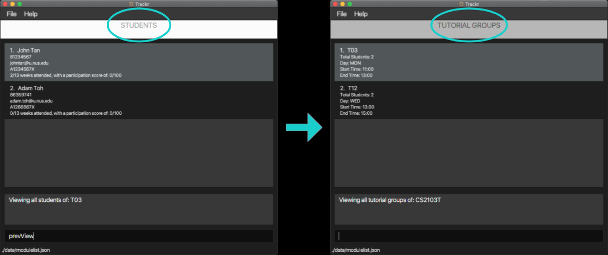

# Trackr - User Guide

1. [Introduction](#1-introduction) 
2. [About This Document](#2-about-this-document) 
    2.1 [Glossary](#21-glossary) 
	2.2 [Formatting](#22-formatting) 
	2.3 [Command format](#23-command-format) 
3. [Getting Started](#3-getting-started) 
    3.1 [Setting Up](#31-setting-up) 
    3.2 [Using Trackr](#32-using-trackr) 
    3.3 [Switching Views](#33-switching-views) 
4. [Features](#4-features) 
   4.1 [General Features](#41-general-features) 
   --- 4.1.1 [View help: `help`](#411-view-help-help) 
   --- 4.1.2 [Clear Trackr: 'clear'](#412-clear-trackr-clear) 
   --- 4.1.3 [Exit Trackr: 'exit'](#413-exit-trackr-exit) 
   4.2 [Navigation Features](#42-navigation-features) 
   --- 4.2.1 [List all Modules in Trackr: `listMod`](#421-list-all-modules-in-__trackr__-listmod) 
   --- 4.2.2 [View all Tutorial Groups in a Module: `viewtTG`](#422-view-all-tutorial-groups-in-a-module-viewtg) 
   --- 4.2.3 [List all Tutorial Groups in the current Module: `listTG`](#423-list-all-tutorial-groups-in-the-current-module-listtg) 
   --- 4.2.4 [View all Students in a Tutorial Group: `viewStudent`](#424-view-all-students-in-a-tutorial-group-viewstudent) 
   --- 4.2.5 [List all Students in a Tutorial Group: `listStudent`](#425-list-all-students-in-a-tutorial-group-liststudent) 
   --- 4.2.6 [Show the Attendance of target Student: `viewAttendance`](#426-show-the-attendance-of-target-student-viewattendance) 
   --- 4.2.7 [Return to previous view: `prevView`](#427-return-to-previous-view-prevview) 
   4.3 [Module features](#43-module-features) 
   --- 4.2.1 [Add a module: `addMod`](#421-add-a-module-addmod) 
   --- 4.2.2 [Delete a module: `deleteMod`](#422-delete-a-module-deletemod) 
   --- 4.2.3 [Edit a module: `editMod`](#423-edit-a-module-editmod) 
   --- 4.2.4 [Find a module: `findMod`](#424-find-a-module-findmod) 
   --- 4.2.5 [List all modules: `listMod`](#425-list-all-modules-listmod) 
   4.3 [Tutorial group features](#43-tutorial-group-features) 
   --- 4.3.1 [View all tutorial groups in a module: `viewTG`](#431-view-all-tutorial-groups-in-a-module-viewtg) 
   --- 4.3.2 [Add a tutorial group to a module: `addTG`](#432-add-a-tutorial-group-to-a-module-addtg) 
   --- 4.3.3 [Find a tutorial group: `findTG`](#433-find-a-tutorial-group-findtg) 
   --- 4.3.4 [Return to Tutorial Group List: `listTG`](#434-return-to-tutorial-group-list-listtg) 
   --- 4.3.5 [Delete a tutorial group from a module: `deleteTG`](#435-delete-a-tutorial-group-from-a-module-deletetg) 
   --- 4.3.6 [Edit a Tutorial Group: `editTG`](#436-edit-a-tutorial-group-edittg) 
   4.4 [Student features](#44-student-features) 
   --- 4.4.1 [View all students in a tutorial group: `viewStudent`](#441-view-all-students-in-a-tutorial-group-viewstudent) 
   --- 4.4.2 [Add a student: `addStudent`](#442-add-a-student-addstudent) 
   --- 4.4.3 [Delete a student: `deleteStudent`](#443-delete-a-student-deletestudent) 
   --- 4.4.4 [Edit a student: `editStudent`](#444-edit-a-student-editstudent) 
   --- 4.4.5 [Find a student: `findStudent`](#445-find-a-student-findstudent) 
   --- 4.4.6 [List all students in a tutorial group: `listStudent`](#446-list-all-students-in-a-tutorial-group-liststudent) 
5. [FAQ](#5-faq) 
6. [Command Summary](#6-command-summary) 
   6.1 [General Commands](#61-general-commands)  
   6.2 [Navigation Commands](#62-navigation-commands) 
   6.3 [Module Commands](#63-module-commands) 
   6.4 [Tutorial Group Commands](#64-tutorial-group-commands) 
   6.5 [Student Commands](#65-student-commands) 

## 1. Introduction

__Trackr__ is an application for teaching assistants (TAs) who prefer to use a desktop application for managing their
student records. It is uses a Command Line Interface (CLI), while still retaining the benefits of a Graphical User
Interface (GUI). If you are a TA with a fast typing speed, __Trackr__ is the app for you! You can start by familiarising
yourself with the information regarding how this document is designed in
[Section 2, "About this document"](#2-about-this-document).

## 2. About this document

Welcome to the __Trackr__ User Guide! In this document you will be able to learn the features that __Trackr__ can
provide to make your TA experience less troublesome. This section will provide information regarding the use of this
document, namely how to navigate through this document, what the technical terms mean and how to interpret the
formatting used.

### 2.1 Glossary

The table below explains certain terms used in the document to describe different parts or aspects of the application.

| Term                           | Meaning                                                      |
| ------------------------------ | ------------------------------------------------------------ |
| Graphical User Interface (GUI) | An interface through which users interact with electronic devices via visual indicator representations. |
| Command Line Interface (CLI)   | An interface that processes commands to a computer program in the form of lines of text. |
| Command                        | An instruction typed by you, the user for **Trackr** to perform. |
| Field                          | A segment of a command that requires information to be filled into. |
| Parameter                      | The information filled by you, the user, into the field of a command. |
| Prefix                         | A short word that is typed right before you, the user, writes the parameter into the command. It always starts with a slash (/) and typically is an abbreviation of the name of the field. |
| Tutorial Group                 | The specific class being taught under a given module.        |
| Student                        | An individual who is enrolled in a given module.             |

### 2.2 Formatting

This document is written in a manner where formatting is applied to text in order to convey different meanings. The table below will explain what these formatting uses are, what they look like, and what they mean in the context of the document.

| Formatting    | Meaning                                                      |
| ------------- | ------------------------------------------------------------ |
| `code`        | Words in 'code' format refer to commands (or fields in commands) that can be typed into the command line. |
| *Italics*     | Words in italics refer to example parameters, which is what you, the user could type as the parameter that needs to be provided. |
| [Underline]() | Words that are in blue and underlined when hovered over refer to hyperlinks. Hyperlinks are clickable, and bring you either to different parts of this document or to external websites, for the convenience of navigating quickly to different parts of the document or the web. |
| **Bold**      | The name of the application **Trackr** is written in bold to refer to what the application does or how it responds to user input. |

### 2.3 Command Format

Commands you provide in the command line follow specific rules. These are the rules you have to follow when typing commands for **Trackr** to read:

-   Words in UPPER_CASE are the parameters to be supplied by the user.
    e.g. in add n/NAME, NAME is a parameter which can be used as add n/John Doe.
-   Items in square brackets are optional.
    e.g n/NAME [t/TAG] can be used as n/John Doe t/friend or as n/John Doe.
-   Items with …  after them can be used multiple times including zero times.
    e.g. [t/TAG]…  can be used as (i.e. 0 times), t/friend, t/friend t/family etc.
-   Parameters can be in any order.
    e.g. if the command specifies n/NAME p/PHONE_NUMBER, p/PHONE_NUMBER n/NAME is also acceptable.

## 3. Getting Started

### 3.1 Setting Up
Get started by installing __Trackr__ with the following steps:

1. Ensure you have Java 11 or above installed. The latest version of Java can be found
[here](https://www.java.com/en/download/).
2. Download the latest version of __Trackr__ [here](https://github.com/AY2021S1-CS2103T-W12-2/tp/releases).
Look for the file trackr.jar.
3. Copy the file to a folder you wish to use as your home folder for __Trackr__
4. Double-click trackr.jar to start the app. The GUI (Figure 3.1) should appear in a few seconds.

  
Figure 3.1 Trackr GUI

### 3.2 Using Trackr
__Trackr__ boasts many useful features to make using the app seamless and smooth. These include
commands to add or delete modules, tutorial groups, or students you are teaching. To use a feature, simply
type the command into the command box (see Figure 3.2) and press _Enter_ to execute it. Further explanations of
all the commands are listed in [Section 4, "Features"](#4-features).

  
Figure 3.2 Command example

### 3.3 Switching Views
__Trackr__ allows you to switch the current view from Module View (Figure 3.3.1) to Tutorial Group View (Figure 3.3.2)
to Student View (Figure 3.3.3) depending on your current need. This is done using the commands `listMod`, `viewTG`, and
`viewStudent`. You may wish to navigate back from Student View to Tutorial Group View or from Tutorial Group View to
Module View. This is achieved using `prevView`. The correct syntax for these commands are shown in
[Section 4, "Features"](#4-features). The top of the app shows the view you are currently in.

  
Figure 3.3.1 Module View

  
Figure 3.3.2 Tutorial Group View

  
Figure 3.3.3 Student view

## 4. Features

### 4.1 General Features

#### 4.1.1 View help: `help`
Shows a message explaining how to access the user guide.

Format: `help`

Example: `help`

Expected Outcome:

#### 4.1.2 Clear Trackr: `clear`
Clears all data inside Trackr.

Format: `clear`

> Note
> - Method can be called in ANY view.
> - Trackr will erase all data.
> - Method is irreversible.
> - View will change to Module view.

Example: `clear`

Expected Outcome:

#### 4.1.3 Exit Trackr: `exit`
Exits Trackr and automatically saves the data.

Format: `exit`

> Note
> - Method can be called in ANY view.
> - Trackr will close by itself.

Example: `exit`

### 4.2 Navigation Features

#### 4.2.1 List all modules in __Trackr__: `listMod`

Shows all the modules you have added in the Module view.

Format: `listMod`

> Note: You can perform this command in ANY view.

Example: `listMod`
    
Expected Outcome:

#### 4.2.2 View all Tutorial Groups in a Module: `viewTG`
Change view to Tutorial Groups of target Module.

Format: `viewTG MODULE_INDEX`
- MODULE_INDEX is the target Module's index in the currently displayed Module List.

> Note: You should perform this command in the MODULE view.

Example: `viewTG 1`

Expected Outcome:

#### 4.2.3 List all Tutorial Groups in the current Module: `listTG`
Lists all Tutorial Groups in the current Module.

Format: `listTG`

> Note: You should perform this command in the TUTORIAL GROUP view.

Example: `listTG`
- Can be used to show all Tutorial Groups after [findTG]() command.

Expected Outcome:

#### 4.2.4 View all students in a tutorial group: `viewStudent`
Change view to Students of target Tutorial Group.

Format: `viewStudent TG_INDEX`
- `TG_INDEX` refers to the index number shown in the Tutorial Group view.
- `TG_INDEX` must be a positive integer starting from 1.

> Note: You should perform this command in the TUTORIAL GROUP view.

Example: `viewStudent 1`
- Views all students of tutorial group at _index 1_ of Tutorial Group List.

Expected Outcome:

#### 4.2.5 List all students in a tutorial group: `listStudent`
Lists all Students in the current Tutorial Group.

Format: `listStudent`

> Note: You should perform this command in the STUDENT view.

Example: `listStudent`
- Can be used to show all Students after [findStudent]() command.

Expected Outcome:

#### 4.2.6 Show the attendance of Target Student: 'viewAttendance'
Shows the attendance of Target student: `viewAttendance`

Format: `viewAttendance STUDENT_INDEX`

> Note: You should perform this command in STUDENT view.

Example: `viewAttendance 1`

Expected Outcome:

#### 4.2.7 Return to previous view: `prevView`
Returns to the previous view: `prevView`

Format: `prevView`

> Note: You can perform this command in ANY view but MODULE is the last View.

Example: `prevView`

### 4.3 Module features

#### 4.3.1 Add a module: `addMod`

Adds a module to the module list.

Format: `addMod m/MODULE_CODE`

> Note:
> - Method can only be called in the Module view.
> - Modules should not share the same code.
> - It is recommended to use the exact code of the module.

Example:

- Adds a module _CS2100_ to the module list.
    - `addMod m/CS2100`

Expected Outcome:

#### 4.3.2 Delete a module: `deleteMod`

Deletes a module based on the given `INDEX`

Format: `deleteMod INDEX`

> Note:
> - Method can only be called in the Module view.
> - `INDEX` refers to the index number shown in the Module view.
> - `INDEX` must be a positive integer starting from 1.
> - Deleting a module is irreversible.

Example:

- Deletes a module at index _1_ in the module list.
    - `deleteMod 1`

Expected Outcome:

    
#### 4.3.3 Edit a module: `editMod`

Edits a module with the provided details.

Format: `editMod INDEX m/MODULE_CODE`

> Note:
> - Method can only be called in the Module view.
> - `INDEX` refers to the index number shown in the Module view.
> - `INDEX` must be a positive integer starting from 1.
> - New module code must be provided.
> - Existing values will be updated to the given values.
> - New module code should not already exist.

Example:

- Editing the module code of the first module to be _CS2020_.

    - `editMod 1 m/CS2020`

Expected Outcome:

#### 4.3.4 Find a module: `findMod`

Finds and lists all modules in the current Module view whose field contains any of the given keywords.

Format: `findMod KEYWORD`

> Note:
> - Method can only be called in the Module view.
> - `KEYWORD` is not case-sensitive (e.g. _cs2100_ will match _CS2100_).
> - `KEYWORD` can be a substring (e.g. _CS20_ will match _CS2020_).
> - The search will look for matches in the module's code. 
> - If no module matching the keyword is found, the Module view will be empty.

Example:

- Finds a module with `KEYWORD` _cs20_.

    - `findMod cs20`

Expected Outcome:

### 4.4 Tutorial Group features

#### 4.4.1 Add a Tutorial Group to a Module: `addTG`
You can add a Tutorial Group to the Module you are viewing using this command.

> - You can only use this command when you are viewing Tutorial Groups of the Module you intend to add the Tutorial Group to.
> - This command can also be used after the findTG command while displaying only Tutorial Groups you searched for.
> - Refer to 4.2.1 - View all Tutorial Groups in a Module

Format: `addTG tg/TG_CODE day/MON/TUE/WED/THU/FRI start/HH:MM end/HH:MM`

Example: `addTG tg/T03 day/MON start/08:00 end/10:00`

#### 4.4.2 Find a Tutorial Group: `findTG`
If you need to quickly find a Tutorial from a list of Tutorials, use this command.

> - You can only use this command when you are viewing the Module which you are looking for the target Tutorial Group in.
> - Refer to 4.2.1 - View all Tutorial Groups in a Module

Format: `findTG TARGET_TG_CODE`
Where TARGET_TG_CODE is the code of the Tutorial Group you want to search for.

Example: `findTG B014`
To search for a Tutorial Group with code B014

#### 4.4.3 Delete a Tutorial Group from a Module: `deleteTG`
You can use this command to delete a Tutorial Group you have previously added to a Module.
> - You can only use this command when you are viewing the Module which you are looking for the target Tutorial Group in.
> - Refer to 4.2.1 - View all Tutorial Groups in a Module

Format: `deleteTG TG_INDEX`
Where TG_INDEX is the index of the Tutorial Group you want to delete.

Example: `deleteTG 2`
To delete Tutorial Group with the index 2 in the currently displayed list.

#### 4.4.4 Edit a Tutorial Group: `editTG`
You can use this command to edit a Tutorial Group you have previously added to a Module.
> - You can only use this command when you are viewing the Module which you are looking for the target Tutorial Group in.
> - Refer to 4.2.1 - View all Tutorial Groups in a Module

Format: `editTG TG_INDEX tg/TG_CODE day/MON/TUE/WED/THU/FRI start/HH:MM end/HH:MM`
Where TG_INDEX is the index of the Tutorial Group you want to edit.
You must enter all arguments regardless of which field you would like to edit.

Example: `editTG 3 tg/T04 day/TUE start/08:00 end/10:00`

These are the commands you can use to manage the different `Tutorial Groups` you teach. Now we look at how you can manage your `Students`.

### 4.5 Student features

> You should perform the following features while in the Student view.

#### 4.5.1 Add a student: `addStudent`

Adds a student with your provided details.

Format: `addStudent n/NAME p/PHONE_NUMBER e/EMAIL id/STUDENT_ID [t/TAG]...`

Note:

- Students should not share the same student ID within the same tutorial group.
- Phone numbers should only contain numbers, and it should be at least 3 digits long.
- Student IDs begin and end with a capital letter and should have 7 digits (e.g. A1243567X).
- A student can have any number of tags, including 0.

Example:

- Adds a student called _John Tan_ with phone number _81234567_, email _johntan@u.nus.edu_, student id _A1234567X_
and tag _student_ to the current tutorial group in view.
  - `addStudent n/John Tan p/81234567 e/johntan@u.nus.edu id/A1234567X t/student`

Expected Outcome:

#### 4.5.2 Delete a student: `deleteStudent`

Deletes a student based on the given `INDEX`.

Format: `deleteStudent INDEX`

Note:

- `INDEX` refers to the index number shown in the Student view.
- `INDEX` must be a positive integer starting from 1.
- Deleting a student is irreversible.

Example:

- Deletes the second student in the Student view.

    - `deleteStudent 2`

Expected Outcome:

#### 4.5.3 Edit a student: `editStudent`

Edits a student at the given `INDEX` with the provided details.

Format: `editStudent INDEX [n/NAME] [p/PHONE_NUMBER] [e/EMAIL] [id/STUDENT_ID] [t/TAG]...`

Note:

- `INDEX` refers to the index number shown in the Student view.
- `INDEX` must be a positive integer starting from 1.
- At least one of the optional fields must be provided.
- Existing values will be updated to the given values.
- When you edit the tag(s), the existing tag(s) of the student will be replaced (adding of tag(s) is not cumulative).
- You may wish to remove all the student's tags by typing `t/` without specifying any tags after it.

Example:

- Editing the phone number and email address of the first student to be _97654321_ and _jtan@u.nus.edu_.

    - `editStudent 1 p/97654321 e/jtan@u.nus.edu`

Expected Outcome:

#### 4.5.4 Find a student: `findStudent`

Finds and lists all students in the current Student view whose name contains any of the given keywords.

Format: `findStudent KEYWORD [KEYWORD]...`

Note:

- `KEYWORD` is not case-sensitive (e.g. _john_ will match _John_).
- The search will look for matches, including partial match, in the student's name (e.g. _jo_ will match _John_,
 however, _jhn_ will not match _John_).
- If no student matching the keyword is found, the Student view will be empty.

Example:

- Finds a student with `KEYWORD` _john_.

    - `findStudent john`

Expected Outcome:

## 5. FAQ
__Q:__ Why did the command I input change colour from white to red?  
__A:__ This happens when the input command is of the wrong syntax or does not exist. You may go to the
[Command Format](#23-command-format) to view the list of commands and their accepted formats.

__Q:__ How do I save my data?  
__A:__ When you issue a new command, __Trackr__ automatically updates the local save file immediately. This ensures that
no data will be lost when you close the app or even in the event of a crash.

__Q:__ How do I exit the app safely?  
__A:__ To close the app, simply click the red X on the top right for Windows users, on the top left
for MacOS and Linux users.

## 6. Command Summary

### 6.1 General Commands

Command | Description | Compatible View
--------|--------|--------
`help` | Shows a message explaining how to access the user guide | ANY
`clear` | Clears all data inside Trackr | ANY
`exit` | Exits Trackr and automatically saves data | ANY

### 6.2 Navigation Commands

Command | Description | Compatible View
--------|-------------|------------
`listMod` | Views all modules in __Trackr__ | ANY
`viewTG MODULE_INDEX` | Changes view to Tutorial Groups of target Module | MODULE
`listTG` | Lists all Tutorial Groups in current Module | TUTORIAL GROUP
`viewStudent TG_INDEX` | Change view to Students of target Tutorial Group | TUTORIAL GROUP
`listStudent` | Lists all Students in current Tutorial Group | STUDENT
`viewAttendance STUDENT_INDEX` | Shows the attendance for Target student | STUDENT
`prevView` | Returns to the previous view | ANY

### 6.3 Module Commands

Command | Description | Compatible View
--------|--------|--------
`addMod m/MODULE_CODE` | Adds a new module to the current Module view | MODULE
`deleteMod INDEX` | Deletes a module from the current Module view | MODULE
`editMod INDEX m/MODULE_CODE` | Edits the module code in the specified index to be the new module code | MODULE
`findMod KEYWORD` | Finds module(s) that contain the keyword in the current Module view | MODULE

### 6.4 Tutorial Group Commands

Command | Description | Compatible View
--------|--------|--------
`addTG tg/TG_CODE` | Adds a Tutorial Group to a Module | TUTORIAL GROUP
`findTG TARGET_TG_CODE` | Finds a Tutorial Group | TUTORIAL GROUP
`deleteTG TG_INDEX` | Deletes a Tutorial Group from a Module | TUTORIAL GROUP

### 6.5 Student Commands

Command | Description | Compatible View
--------|--------|--------

`addStudent n/NAME p/PHONE_NUMBER e/EMAIL id/STUDENT_ID [t/TAG]...` | Adds a new student to the current Student view | STUDENT
`deleteStudent INDEX` | Deletes a student from the current Student view | STUDENT
`editStudent INDEX [n/NAME] [p/PHONE_NUMBER] [e/EMAIL] [id/STUDENT_ID] [t/TAG]...` | Edits a student in the current Student view | STUDENT
`findStudent KEYWORD` | Finds student(s) whose name(s) contain the keyword in the current Student view | STUDENT
