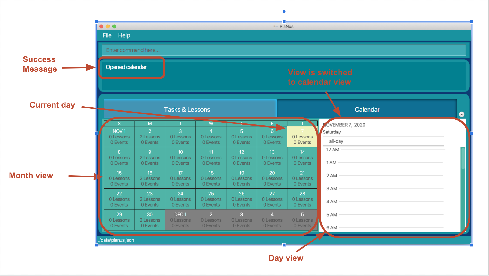

---
User Guide v1.4
---

This user guide provides [set-up](#set-up) instructions, and a detailed description of all the [features](#features) available in the PlaNus application. You can also access this user guide on the application website with
this [link](https://ay2021s1-cs2103t-t12-3.github.io/tp/).

## Table of Contents

* **[Introduction](#introduction)**
* **[Set-up](#set-up)**
* **[Features](#features)**
  * **[1. General Features](#1-general-features)**
    * [1.1 Show all commands : `help`](#11-show-all-commands--help)
    * [1.2 Clear the program : `clear`](#12-clear-the-program--clear)
    * [1.3 Exit the program : `exit`](#13-exit-the-program--exit)
  * **[2. Create, Read, Update and Delete a Task](#2-create-read-update-and-delete-a-task)**
    * [2.1 List all tasks : `list-task`](#21-list-all-tasks--list-task)
    * [2.2 Add a deadline: `deadline`](#22-add-a-deadline--deadline)
    * [2.3 Add an event: `event`](#23-add-an-event--event)
    * [2.4 Mark a deadline as done: `done`](#24-mark-a-deadline-as-done--done)
    * [2.5 Edit a task : `edit-task`](#25-edit-a-task--edit-task)
    * [2.6 Find a task : `find-task`](#26-find-a-task-by-an-attribute--find-task)
    * [2.7 Delete a task : `delete-task`](#27-delete-a-task--delete-task)
  * **[3. Create, Read, Update and Delete a Lesson](#3-create-read-update-and-delete-a-lesson)**
    * [3.1. List all lessons: `list-lesson`](#31-list-all-lessons-list-lesson)
    * [3.2. Add a lesson: `lesson`](#32-add-a-lesson--lesson)
    * [3.3. Edit a lesson: `edit-lesson`](#33-edit-a-lesson--edit-lesson)
    * [3.4. Find a lesson: `find-lesson`](#34-find-a-lesson--find-lesson)
    * [3.5. Delete a lesson: `delete-lesson`](#35-delete-a-lesson--delete-lesson)
  * **[4. Calendar View: `calendar`](#4-calendar-view)**
  * **[5. Time Analysis](#5-time-analysis)**
* **[Glossary](#glossary)**
* **[Command summary](#command-summary)**
    * [General commands](#general-commands)
    * [Task related commands](#task-related-commands)
    * [Lesson related commmands](#lesson-related-commands)
* **[Input format summary](#input-format-summary)**

## Introduction

PlaNus is a **task managing desktop application** for students in NUS with many projects and deadlines, optimized for use via a Command Line Interface (CLI) with the benefits of Graphical 

Interface (GUI). PlaNus reduces the time spent by students in task management as adding tasks and lessons is now simple and quick!

Objectives of PlaNus:

1. Provide students with a detailed breakdown of how much time they spend on their tasks and lessons in their respective modules.
2. Allow students to have a calendar view of their schedule.

--------------------------------------------------------------------------------------------------------------------

## Set-up

(Done by: Gabriella)

1. Ensure you have Java version 11 or above installed in your computer.

2. Download the latest jar file from **[here](https://github.com/AY2021S1-CS2103T-T12-3/tp/releases/)**.

   

3. Copy the file to the folder you want to use as the home folder for PlaNus.

4. Double-click the file to start the app. Upon launching PlaNus, you should see the following 
interface.

   

5. Alternatively, in command prompt (for Windows) or terminal (in MacOS), go to the directory where planus.jar is stored and enter `java -jar planus.jar`.To open command prompt (for Windows) or terminal (in MacOS), simply search for them in your computer.

    

6. You may try out some commands listed in the [command summary](#command-summary) to explore the app.

--------------------------------------------------------------------------------------------------------------------

## Features

This section is a comprehensive walkthrough of the features in PlaNus.

**:information_source: Notes about the command format** 

* Words highlighted are code snippets.  
  - e.g. `title`
* Words in **upper case** are the parameters (i.e. your input) to be supplied by the you. 
  - e.g. in `event title:TITLE`, `TITLE` is a parameter which you can provide.
  - For example, you can type `title:homework 1` or `title:assignment`.

* Items in **square brackets** are optional fields that you can provide to add more details to the command.  
  - e.g. command `event title:Title [desc:DESCRIPTION]` means that the `desc` field is optional.
  - In the above case, you can either type `event title:homework 1` or `title:homework 1 desc:science project` if they want to store a description of the event.

* Items with `...` after them can be keyed in multiple times. 
  - e.g. `delete-task INDEX...` can be used as both `delete-task 1` or `delete-task 1 2 3`.

* Parameters can be in any order. 
  - e.g. commands `deadline title:TITLE desc:DESCRIPTION` and `deadline desc:DESCRIPTION title:TITLE` are the same.

## 1. General Features

This section shows features that deal with the general functionality of PlaNus application.

### 1.1 Show all commands : `help`

(Done by: Gabriella)

Shows you a link to the user guide.

Format: `help`

1. Type in `help` into the command box.

2. A pop-up window with some sample commands and a link to the user guide will appear as shown below.

   

 

### 1.2 Clear the program : `clear`

(Done by: Gabriella)

You can clear all the tasks and lessons in PlaNus.

Format: `clear`

1. Type in `clear` into the command box.
    

2. All the tasks and lessons in PlaNus will be cleared as shown below.
    

    

 

### 1.3 Exit the program : `exit`

(Done by: Gabriella)

You can exit PlaNus.

Format: `exit`

1. Type `exit` into the command box.

2. The application window will automatically close.

 

## 2. Create, Read, Update and Delete a Task

This section shows features that deal with operation of tasks including
creating, reading, updating and deleting a task. A task can be either a
`event` or `deadline`.

 

### 2.1 List all tasks : `list-task`

(Done by: Beining)

You can list all the tasks in PlaNus.

Format: `list-task`

To show all tasks currently stored in PlaNus, you can do the following:

1. Type in `list-task` into the command box.

2. A success message will appear and list of all tasks will be shown in the task panel.

 

### 2.2 Add a deadline : `deadline`

(Done by: Beining)

You can add a deadline to PlaNus.
 

A deadline is a task that has a compulsory deadline date and time.

Format: `deadline title:TITLE [desc:DESCRIPTION] datetime:DATE_TIME [tag:MODULE_CODE]`

* Adds a deadline to PlaNus,
  * with the specified title in `title:TITLE`,
  * with the specified description in `description:DESCRIPTION`,
  * with a date and time in `datetime:DATE_TIME` of when this deadline should be completed before,
  * with a tag in `tag:MODULE_CODE` indicating the module of which this deadline belongs to.

* The added deadline will be tracked for time analysis if it has a tag.

Examples:

To add a deadline with title "Return book", and a date and time of "02-01-2020 18:00" to PlaNus,
you can do the following:

1) Type in the command box the following command:

* `deadline title:Return book datetime:02-01-2020 18:00`

2) This adds the corresponding deadline to PlaNus. You can see the added deadline in the task list.

 

**:information_source: Notes** 

* Multiple inputs of the same attribute is not allowed. 
  E.g. `deadline title:Return book title:Borrow book datetime:02-01-2020 18:00` is not allowed as the `title` attribute is input twice.

 

### 2.3 Add an event : `event`

(Done by: Beining)

You can add an event to PlaNus.
 

An event is a task that has a start time, end time and a date.

Format: `event title:TITLE date:DATE from:START_TIME to:END_TIME [desc:DESCRIPTION] [tag:MODULE_CODE]`

* Adds an event to PlaNus,
  * with the specified title in `title:TITLE`,
  * with the specified description in `desc:DESCRIPTION`,
  * on the date specified in `date:DATE`, starting from the time specified in `from:START_TIME` to the time specified in `to:END_TIME`,
  * with a tag in `tag:MODULE_CODE` indicating the module this deadline belongs to.

* The added event will be tracked for time analysis if it has a tag.
* Event must not overlap with existing events or lessons.

Examples:

To add an event with title "Project meeting", and a date "07-11-2020" with start time of "09:00" and end time of "12:30" and with tag "CS2103T" to PlaNus,
you can do the following:

1) Type in the command box the following command:

* `event title:Project meeting date:07-11-2020 from:09:00 to:12:30 tag:CS2103T`

2) This adds the corresponding event to PlaNus. You can see the added event in the task list and the calendar. The duration of the event will be recorded for time analysis.

 

**:information_source: Notes** 

* Multiple inputs of the same attribute is not allowed. 
  E.g. `event title:Project meeting title:Group meeting date:07-11-2020 from:09:00 to:12:30 tag:CS2103T` is not allowed as the `title` attribute is input twice.

 

### 2.4 Mark a deadline as done : `done`

(Done by: Beining)

You can mark a specified deadline in PlaNus as done.

Format: `done INDEX:TIME_TAKEN...`

* Marks the deadline(s) at the specified `INDEX` as done and records the time taken to complete the deadline.
* The index refers to the index number shown in the displayed task list.
* The time taken refers to the time in minutes that you took to complete the specific deadline.
* The index and time taken **must be a positive integer** e.g. 1:20, 2:30, 3:120, ...

**:information_source: Notes** 

* There are two type of tasks, event and deadline.
  * Only a deadline can be marked as done through this command, an error message will be shown if you attempt to mark an event as done.
* After you have marked a deadline as done, you cannot edit the deadline or undo the done command anymore.

Examples:

* `list-task` followed by `done 2:30 3:60`
  * Marks the 2nd and 3rd tasks in the results of the `list` command status to be done, and records that you have spent 30 minutes to finish the 2nd task, and 60 minutes to finish the 3rd task.
* `find-task title:homework` followed by `done 1:20`
  * Marks the 1st task in the results of the `find` command status to be done and record the time taken to complete the deadline as 20 minutes.

To mark the first deadline in the current task list as done and recording the time spent on it as 50 minutes,
you can do the following:

1) Type in the command box the following command:

   * `done 1:50`

2) The status of the deadline has been set to complete, and the time taken to complete the task will be used for time analysis.

 

### 2.5 Edit a task : `edit-task`

(Done by: Gangwei)

You can edit a task by a set of attributes given below.

Format: `edit-task INDEX ATTRIBUTE_1:NEW_VALUE ATTRIBUTE_2:NEW_VALUE ...`

* Edits the task(s) at the specified INDEX.
* The index refers to the index number shown in the displayed task list.
* The index **must be a positive integer** e.g. 1, 2, 3, …

**:information_source: Notes** 

* If different fields are provided in the command, all the provided fields of the specified task will be updated.
* If a deadline has a status of **complete**, it cannot be edited.
* Fields that you can modify differ by the type of task (Event or Deadline) you are trying to modify.

  * Available attributes for both deadline and event in 4 include:
    * `title:` edits the title of the specified task
    * `desc:` edits the description of the specified task
    * `tag:` edits the tag of the specified task
  * Available attributes for **deadline only** in v1.4 include:
    * `datetime:` edits the date and time of the specified deadline
  * Available attributes for **event only** in v1.4 include:
    * `date:` edits the date of the specified event
    * `from:` edits the start time of the specified event
    * `to:` edits the end time of the specified event

Examples:

To edit the time of a task, you can do the following:

1) Display all lessons by typing `list-task` in the command box, and find the index of the task you want to edit in the task list. The index is displayed in the top left corner of each task.

2) Type `edit-task` and the index of the task, followed by the new date and time you want to update the task with.
For example, if you want to change the first task start time to be an hour earlier, you can type
`edit-task 6 from:10:00` in the command box.

3) This changes the start time of the sixth task to 10:00 which is one hour after than the original start time. You can view the task with the updated information in the task list.

4) If the task that is being edited is an event, the calendar will also be updated with the information.

Other examples:

* `edit-task 1 title:play games` 
  * Edits the first task in the results of the `list-task` command, changing its title to `play games`.
* `edit-task 3 desc:This is very urgent!` 
  * Edits the third task in the results of the `list-task` command, changing its description to "This is very urgent!".
* `find-task title:homework` followed by`edit-task 2 desc:Homework is difficult date:01-01-2020` 
  * Edits the second task in the results of the `find-task` command if the task is an event, changing its date to 01-01-2020 and its description to "Homework is difficult", otherwise, PlaNus will notify you of the incompatible error.
* `edit-task 1 tag:CS2103T` 
  * Edits the first task in the results of the `list-task` command, changing its tag to "CS2103T".

 

**:information_source: Notes** 

* Multiple inputs of the same attribute is not allowed. 
  E.g. `edit-task title:play games title:watch tv` is not allowed as the `title` attribute is input twice.
  

 

### 2.6 Find a task by an attribute : `find-task`

(Done by: Gangwei)

You can find a task by a set of attributes given below.

Format: `find-task ATTRIBUTE_1:SEARCH_PHRASE ATTRIBUTE_2:SEARCH_PHRASE ...`

**:information_source: Notes** 

* If you provide different attributes in the command, tasks that match all attributes will be displayed.

* If you provide multiple search phrases of the same attribute in the command, tasks that match any of the search phrases will be displayed.

Available attributes in v1.4 include:

* `title:` finds all tasks which contain the search phrase in the given title
* `desc:` finds all tasks which contain the search phrase in the given description
* `date:` finds all tasks happening on or due the searched date
* `status:` finds all tasks with the given status
* `tag:` finds all tasks related with the given module tag (case-insensitive)

Examples:

To find all tasks with titles containing the phrase "CS" (case-insensitive), you can do the following:

1) List all tasks by typing `list-task` in the command box.

2) Type the following command in the command box: 

   * `find-task title:CS` 

3) This lists all tasks with a title including the phrase `CS`.

Other examples:

* `find-task title:play games` 
  * Lists all tasks with a title including the phrase `play games`.
* `find-task tag:CS2040` 
  * Lists all tasks with a tag containing `CS2040`.
* `find-task date:01-01-2020` .
  * List all tasks happening on or due `01-01-2020`
* `find-task title:dinner title:lunch`.
  * List all tasks with the title including either `dinner` or `lunch`.

 

### 2.7 Delete a task : `delete-task`

(Done by: Gangwei)

You can delete the specified task from PlaNus.

Format: `delete-task INDEX...`

* Deletes the task(s) at the specified `INDEX`.
* The index refers to the index number shown in the displayed task list.
* The index **must be a positive integer** e.g. 1, 2, 3, ...
* You can provide more than 1 index at the same time, e.g. `delete-task 1 2 3`.
  *  However, if one of the index is invalid, the whole command will not be executed and an error message will be shown.

Examples:

To delete the first task, you can do the following:

1) Type `list-task` in the command box to display all tasks.

2) Type `delete-task 1` in the command box.

 
3) This deletes the 1st task from PlaNus.

Other examples:

* `list-task` followed by `delete-task 1 2` 
  * Deletes the 1st task followed by the 2nd task in the results of the `list-task` command.

You can also delete lessons by first finding the lessons of interest, refer to [feature 2.6](#26-find-a-task-by-an-attribute-find-task) for more information. Sample usage:

* `find-task title:homework` followed by `delete-task 1` 
  * Deletes the 1st task in the results of the `find-task` command.

 

## 3. Create, Read, Update and Delete a Lesson

This section shows features that you can use to manage lessons. A lesson happens in a 
recurring manner that have a start and end time, and a start and end date.

### 3.1 List all lessons :`list-lesson`

(Done by: Gangwei)

Shows you a list of all the lessons in PlaNus.

Format: `list-lesson`

To show all lessons currently stored in PlaNus, you can do the following:

1) Type in the command box the following command:

* `list-lesson`

2) This displays all lessons in the lesson list.

### 3.2 Add a lesson : `lesson`

(Done by: Zijian)

You can add a lesson to PlaNus.

Format: `lesson title:TITLE tag:MODULE_CODE [desc:DESCRIPTION] day:DAY from:TIME to:TIME start:DATE end:DATE`

* Adds a lesson to PlaNus, 
  * with the title specified in `title:TITLE`, 
  * that happens on the day specified by `day:DAY`, from the time specified by `from:TIME` to the time specified by `to:TIME`, between the start date specified by `start:DATE` and the end date specified by `end:DATE`.

**:information_source: Notes** 

* The format of day in `day:DAY` must be as the following (case-insensitive):
  * Monday, Tuesday, ..., Sunday
  

Examples:

To add a lesson with title "CS2101 Tutorial" under module "CS2101" that happens on every Monday from 10am to 12pm, starts on 10 Aug 2020 and ends on 10 Dec 2020, you can do the following:

1) Type in the command box the following command:

* `lesson title:CS2101 Tutorial tag:CS2101 desc:Most exciting tutorial in NUS! day:Monday from:10:00 to:12:00 start:10-08-2020 end:10-12-2020`

2) This adds the corresponding lesson to PlaNus. You can then see the added lesson in the lesson list, calendar view and time analysis.

    

 

**:information_source: Notes** 

* Multiple inputs of the same attribute is not allowed. 
  E.g. `lesson title:Tutorial title:Lecture tag:CS2103T day:Monday from:10:00 to:12:00 start:10-08-2020 end:10-12-2020` is not allowed as the `title` attribute is input twice.

 

### 3.3 Edit a lesson : `edit-lesson`

(Done by: Zijian)

You can edit a lesson in PlaNus. When a lesson is edited, all occurrences of the particular lesson will be updated.

Format: `edit-lesson INDEX [title:TITLE] [tag:MODULE_CODE] [desc:DESCRIPTION] [day:DAY] [from:TIME] [to:TIME] [start:DATE] [end:DATE]`

**:information_source: Notes** 

* `INDEX` refers to the index of the lesson in the lesson list.

* The format of day in `day:DAY` must be as follows (case-insensitive):
  * Monday, Tuesday, ..., Sunday

* Edit a lesson in PlaNus,
  * that changes the lesson's values to the new values specified in the `edit-lesson` command.

Examples:

To edit a lesson, you can do the following:

1) Display all lessons by typing `list-lesson` in the command box. This will display all lessons.

2) Choose the lesson you want to edit. Find its index which is displayed on the top-left corner.
For example, if you want to change the first lesson to Tuesday, you can type `edit-lesson 1 day:Tuesday` in the command box.

3) This changes the day of the first lesson to every Tuesday. You can see that the calendar view and time analysis is also updated.

    

 

**:information_source: Notes** 

* Multiple inputs of the same attribute is not allowed. 
  E.g. `edit-lesson 1 title:tutorial 1 title:tutorial 2` is not allowed as the `title` attribute is input twice.

 

### 3.4 Find a lesson : `find-lesson`

(Done by: Zijian)

You can find lessons in the lesson list by a set of attributes.

Format: `find-lesson ATTRIBUTE_1:SEARCH_PHRASE ATTRIBUTE_2:SEARCH_PHRASE ...`

**:information_source: Notes** 

* `ATTRIBUTE` refers to the category which you can use to search in the lesson list. The full list of categories supported is given below.

* `SEARCH_PHRASE` refers to the actual input that you give for each attribute.

* If you provide different attributes in the command, lesson that match all attributes will be displayed.

* If you provide multiple search phrases of the same attribute in the command, lessons that match any of the search phrases will be displayed.

Available attributes in v1.4 include:

* `title:` finds all lessons which contain the search phrase in the given title
* `desc:` finds all lessons which contain the search phrase in the given description
* `date:` finds all lessons happening on the searched date
* `time:` finds all lessons happening at the searched time
* `datetime:` finds all lessons happening at the searched date and time
* `tag:` finds all lessons related to the given module tag (case-insensitive)

Examples:

To find all lessons with titles containing the phrase "tutorial" (case-insensitive), you just need the following steps:

1) List all lessons by typing `list-lesson` in the command box:

2) Type the following command in the command box: 

   * `find-lesson title:tutorial` 

3) This lists all lessons with a title including the phrase `tutorial`.

Other examples include:

* `find-lesson tag:CS2040` 
  * Lists all lessons with a tag containing 'CS2040'.
* `find-lesson date:01-01-2020` .
  * List all lessons happening on 01-01-2020.
* `find-lesson title:dinner title:lunch`.
  * List all
    lessons with the title including either `dinner` or `lunch`.
* `find-lesson datetime:01-01-2020 14:00` 
  * Lists all lessons happening on 01-01-2020 at 14:00.

 

### 3.5 Delete a Lesson : `delete-lesson`

(Done by: Zijian)

You can delete a specified set of lessons from PlaNus.

Format: `delete-lesson INDEX...`

**:information_source: Notes** 

* `INDEX` refers to the index of the lesson in the lesson list.

* `...` means that there can be multiple indexes supplied. If all indexes are valid,
  all lessons of the specified indexes will be deleted. 

Examples:

To delete the first two lessons, you simply need to do the following 3 steps:

1) Type `list-lesson` in the command box to display all lessons.

2) Type `delete-lesson 1 2` in the command box.

 
3) This deletes the 1st and 2nd lesson from PlaNus.

You can also delete lessons by first finding the lessons of interest, refer to [feature 3.4](#34-find-a-lesson--find-lesson)
for more information. Sample usage:

* `find-lesson title:Lab` followed by `delete-lesson 1` 
  * Deletes the 1st lesson in the result lesson list of the `find-lesson` command.

 

## 4. Calendar View

(Done by: Marcus)

PlaNus has two application views:

* Task and Lesson view: place where you can see the list of your tasks and lessons
* Calendar view: place where you can see all your tasks and lessons in a calendar

You can switch between **Task and Lesson View** and **Calendar View**.

 

**Change from Task and Lesson View to Calendar View**

Format: `calendar`

Example:

1) Type `calendar` into the command box.

2) The calendar view will appear as shown below.

With the calendar view, you can have a clear and intuitive view of:

* how many events and lessons you have on each day of the current month in the calendar's **month view**.
* what events and lessons you have for a particular day in the calendar's **day view**.

**:information_source: Notes** 

* Days in the **calendar view** that are marked as grey are days that are not in the current month, and therefore unclickable. However, they can still display the number of events and lessons.

**Changing back to Task and Lesson View**

You can change back to Task and Lesson view (which is displayed when the app starts) by issuing a `list-task` command or a `list-lesson` command. 

 

## 5. Time Analysis

(Done by: Marcus)

You can use the pie chart and list of modules to visualise how much time you spent on each module **in the past week**. PlaNus calculates the time spent on each module based on the module code in its `tag`.

How does it work:

* Each module has a **time spent on tasks** and **time spent on lessons**.
* When a `deadline` is marked as done, it contributes towards **time spent on tasks** for that module.
* When an `event` has occurred, it contributes towards **time spent on tasks** for that module.
* When a `lesson` has occurred, it contributes towards **time spent on a lesson** for that module.

Example:

* The first lesson in the list:
  * Title of "CS2105 Lecture"
  * Only occurred once in the past week
  * Last for 2 hours from 14:00 to 16:00

Therefore, the **time analysis for the week** will show that the **time spent on lessons** with the CS2105 `tag` as
120 minutes (2 hours).

**:information_source: Notes** 

* In v1.4 (current version):
  * Only time spent on each module in the **past week** is displayed.

* In the upcoming version:
  * A breakdown of time spent on each module in the **past week** and of **all time** is displayed.

 

--------------------------------------------------------------------------------------------------------------------

## Glossary

* Task: An event or a deadline
* Event: Consists of a start and end time, and a date
* Deadline: Consists of a deadline date and time
* Lesson: Consists of recurring events

--------------------------------------------------------------------------------------------------------------------

## Command summary

### General commands

| Action            | Format, Examples                                             |
| ----------------- | ------------------------------------------------------------ |
| **Help**          | `help`                                                       |
| **Calendar View** | `calendar`                                                   |
| **Clear all**     | `clear`                                                      |
| **Exit**          | `exit`                                                       |

### Task related commands

| Action            | Format, Examples                                             |
| ----------------- | ------------------------------------------------------------ |
| **List task**     | `list-task`                                                  |
| **Add Event**     | `event title:TITLE [desc:DESCRIPTION] date:DATE from:TIME to:TIME tag:MODULE_CODE`   e.g. `event title:CS2103T Group meeting date:23-10-2020 from:20:00 to:22:00 tag:CS2103T` |
| **Add Deadline**  | `deadline title:TITLE [desc:DESCRIPTION] datetime:DATETIME tag:MODULE_CODE`   e.g. `deadline title:Assignment2 submission datetime:23-10-2020 18:00 tag:CS2103T` |
| **Delete task**   | `delete-task INDEX...`   e.g. `delete-task 3`, `delete-task 3, 4, 5` |
| **Mark Task As Done**     | `done INDEX:TIME_TAKEN...`  e.g. `done 1:20`, `done 1:20 2:60 3:120` |
| **Find task**     | `find-task ATTRIBUTE_1:SEARCH_PHRASE ATTRIBUTE_2:SEARCH_PHRASE ...`   e.g.`find-task title:dinner date:02-02-2020` |
| **Edit task**     | `edit-task INDEX [title:TITLE] [date:DATE] [desc:DESCRIPTION] [tag:MODULE_CODE] [datetime:DEADLINE (deadline only)] [date:EVENT_DATE (event only)] [start:START_TIME (event only)] [end:END_TIME (event only)]` e.g. `edit-task 1 date:02-02-2020 12:00 tag:CS2101` |

### Lesson related commands

| Action            | Format, Examples                                             |
| ----------------- | ------------------------------------------------------------ |
| **List lesson**   | `list-lesson`               |
| **Add Lesson**    | `lesson title:TITLE tag:MODULE_CODE [desc:DESCRIPTION] day:DAY from:TIME to:TIME start:DATE end:DATE` e.g.`lesson title:CS2103T Lecture tag:CS2103T desc:Most exciting lecture in NUS! day:Mon from:12:00 to:14:00 start:01-01-2020 end:01-05-2020` |
| **Edit lesson**   | `edit-lesson INDEX [title:TITLE] [tag:MODULE_CODE] [desc:DESCRIPTION] [day:DAY] [from:TIME] [to:TIME] [start:DATE] [end:DATE]`   `e.g.edit-lesson 1 start:10-10-2020` |
| **Find lesson**   | `find-lesson ATTRIBUTE_1:SEARCH_PHRASE ATTRIBUTE_2:SEARCH_PHRASE ...`   e.g. `find-lesson title:Tutorial` |
| **Delete lesson** | `delete-lesson INDEX...`   e.g. `delete-lesson 1 2 3`     |

## Input format summary

All the keywords mentioned in the command should follow the format stated below:

| keyword  | Format, Examples                   |
| -------- | ---------------------------------- |
| **date** | `dd-MM-yyyy`    e.g. 23-10-2020 |
| **time** | `HH:mm`    e.g. 10:00           |
| **datetime** | `dd-MM-yyyy HH:mm`   e.g. 21-10-2020 10:00 
| **day**  |  `Monday/Tuesday/Wednesday/Thursday/Friday/Saturday/Sunday` |
| **from, to, time** | `HH:mm`   e.g. 18:00      |