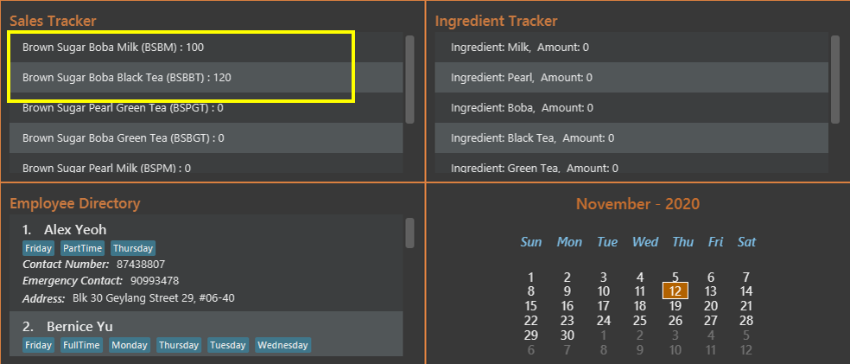
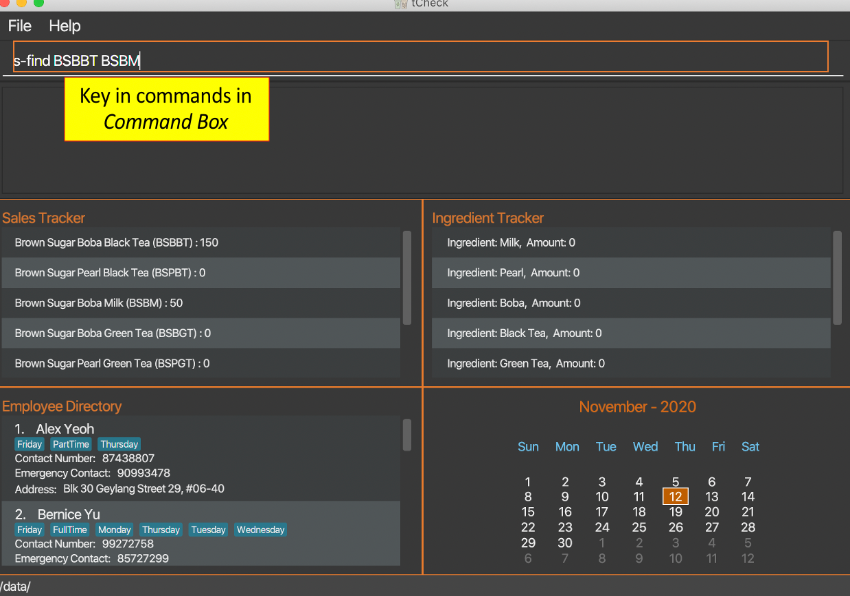
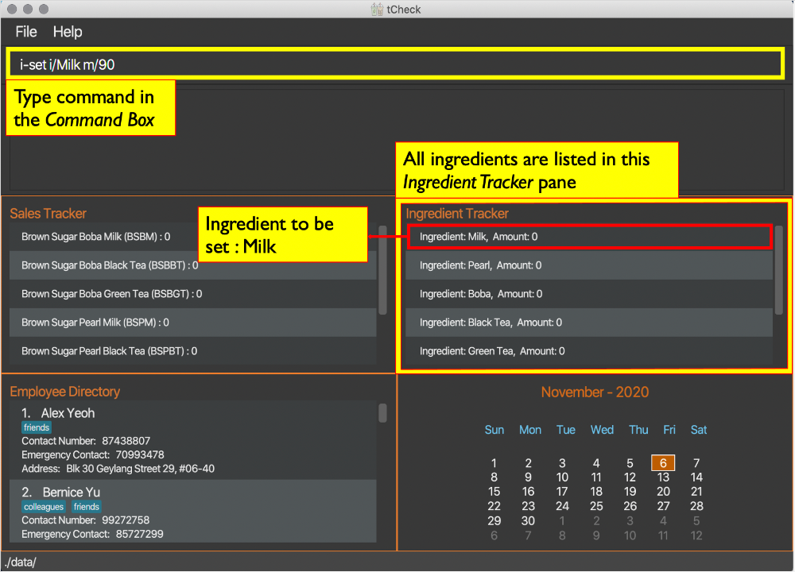
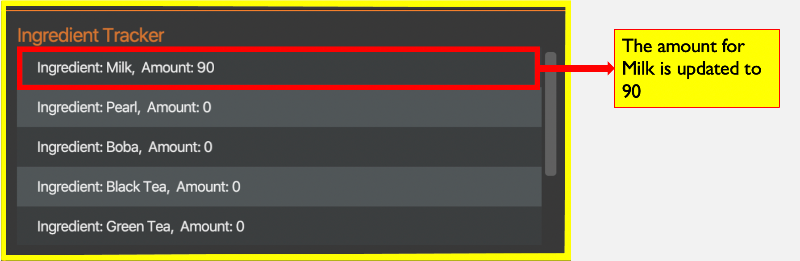
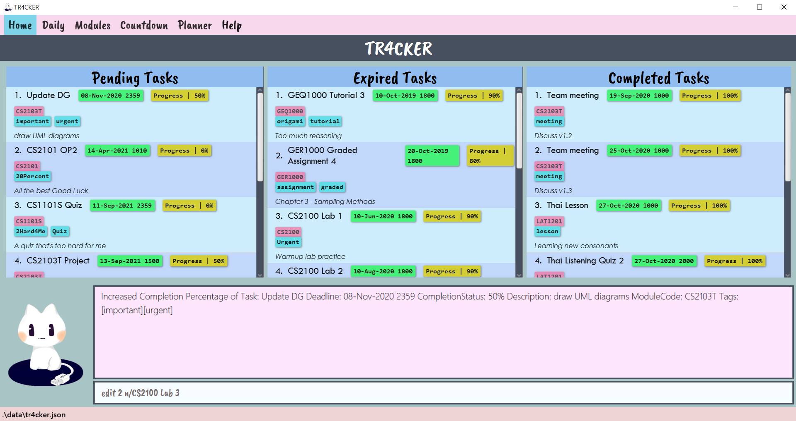
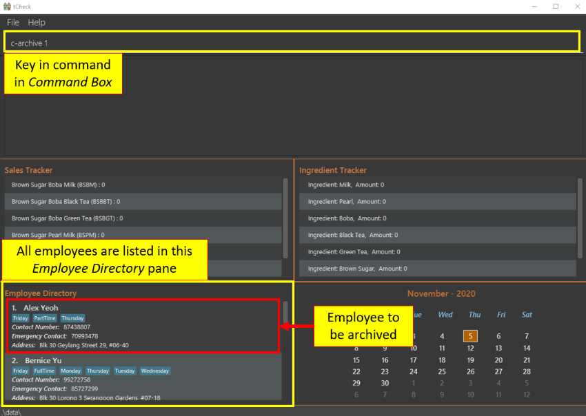
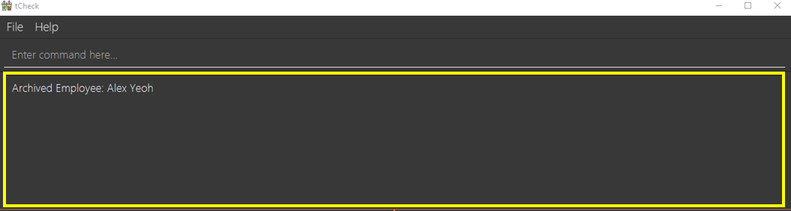
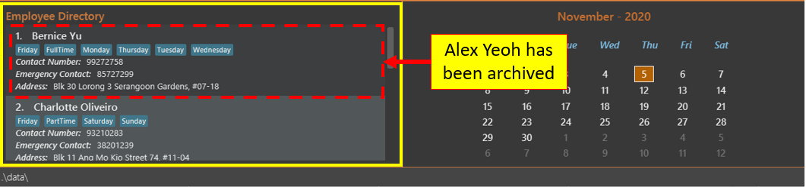

## Table of Contents:

  * Table of Contents
  {:toc}

## 1. Introduction 

Welcome to the User Guide of **tCheck**!
 
Are you a bubble tea store manager (from T-Sugar) looking to reduce your time spent on administrative work in store
management? Look no further, as tCheck can assist you with these tasks.

tCheck is a desktop application that offers an integrated system to efficiently manage a bubble tea shop, of 
the (imaginary) brand T-sugar, by providing sales tracking, ingredients tracking and manpower management. It is an
application optimized for the Command Line Interface (CLI); this means that you use this application by typing
commands into a _Command Box_. If you are a fast typist, then you will be able to update and retrieve the
information in tCheck more efficiently, as opposed to using other applications that requires a mouse.

This User Guide will help you get started with tCheck and learn how to use the features that tCheck provides.
You can start from the [Quick Start](#quick-start) section to learn how to obtain tCheck to begin managing
 your store more efficiently.

## 2. Quick start 

1. Ensure you have Java `11` or above installed in your Computer.

1. Download the latest `tCheck.jar` from [here](https://github.com/AY2021S1-CS2103T-T12-2/tp/releases).

1. Copy the file to the folder you want to use as the _home folder_ for your tCheck.

1. Double-click the file to start the app. The graphic user interface (GUI) similar to the figure below should appear in a few seconds. Note
how the figure below shows some sample data. 
   
   
   _Figure 1. A screenshot showing the tCheck's UI_

1. Type the command in the command box and press "Enter" on your keyboard to execute it. e.g. typing **`help`** and pressing "Enter" will open the help window. 

1. Refer to the [Features](#features) for details of each command.

## 3. About this document 

### 3.1. Structure of this document

We have structured this User Guide in a way so that you can find what you need easily and quickly. In the next section,
[Section 3.2 - Reading this document](#reading-this-document), you can find sevaral useful tips on how to read this guide. The following
 section,
[Section 4 - Features](#features), documents the four main features in **tCheck**, namely:

   * Sales Tracking

   * Ingredients Tracking

   * Manpower Management

   * Other General Features
   

### 3.2. Reading this document 

This section introduces you to some key technical terms, symbols and syntax that are used throughout this guide.
You may want to familarise yourself with them before moving on to the next section.

#### 3.2.1. Terminology related to the GUI

Figure 2 shows the GUI of **tCheck**, annotated with descriptions for all components of the GUI.

_Figure 2 - Annotated GUI of tCheck_

#### 3.2.2. General Symbols and Syntax 

The following table explains the general symbols and syntax used in this User Guide.

| Syntax |  What it means |
|----------|-------------|
| `command` |  The grey block specifies an execuable command which can be entered in the command box |
| _italics_ | Italicised text specifies the terms related to tCheck's GUI |
|
 :information_source: 
  | An exclamation mark indicates that the following text is a note|

#### 3.2.3. Command Syntax and Usage

The following table explains the technical terms used in this user guide.

| Technical Term | What it means |
| ---------------| --------------|
| Command Word | The first word of a command. tCheck uses this command word to decide what kinds of actions it should perform. |
| Prefix | It is the characters before every "/". They are used to distinguish different kinds of parameters. |
| Parameter | The words after every "/". They are values given to a command to perform the specified action.|

**Example:**  
`c-add n/NAME p/PHONE_NUMBER e/EMERGENCY_CONTACT a/ADDRESS [t/TAG]`

**Breakdown:** 
* Command Word - `c-add`  
* Prefixes - `n/`, `e/`, `p/`, `a/`, `t/`   
* Parameters - `NAME`, `PHONE_NUMBER`, `EMERGENCY_CONTACT`, `ADDRESS`, `TAG`

The following points explain the format of a command. 

* Words in `UPPER_CASE` are the parameters to be supplied. 
   e.g. In `c-delete INDEX`, `INDEX` is a parameter and the command can be used as `c-delete 1`.

* Items in square brackets are optional. 
   e.g. `c-add n/NAME p/PHONE_NUMBER e/EMERGENCY_CONTACT a/ADDRESS [t/TAG]` can be used as `c-add n/Betsy Crowe e/81234567 p/89007413 a/Blk 120 ABC Road t/Friday` 
    or as `c-add n/Betsy Crowe e/81234567 p/89007413 a/Blk 120 ABC Road`.

* Items with `...` after them can be used multiple times, including zero times. 
   e.g. `[t/TAG] ...` can be used as `  ` (i.e. 0 times), `t/Friday`, `t/Friday t/PartTime`, etc.

* Parameters can be in any order. 
   e.g. If the command specifies `p/PHONE_NUMBER e/EMERGENCY_CONTACT`, `e/EMERGENCY_CONTACT p/PHONE_NUMBER` is also acceptable.
    

#### 3.2.4. Prefix processing and usage

The table below explains some important features of how prefix(es) are processed in tCheck to help you understand and use prefix(es) in commands.

Situation | What will happen
-------|------------------------------
Duplicate (2 or more) valid prefixes detected | Only the last prefix and its following parameter are accepted and processed as part of the command.
Invalid prefix entered | tCheck will not recognise this "prefix" and thus it will be processed as part of the parameter for the nearest previous valid prefix, which may result in error for the parameter.
Unexpected prefix(es) entered for commands which do not take in any parameter | tCheck will not accept or process these prefix(es) because all words entered after the command words will be ignored. 

**Example 1:**
`i-set i/Milk i/Boba m/90`

**How the command is processed:**

In this example, the situation of duplicate valid prefixes detected takes place. Hence, only the last, in this case, the second prefix and its following parameters are accepted.
Thus, the command will be processed in the same way as `i-set i/Boba m/90`.

**Example 2:**
`i-set-all M/10 P/10 B/10 L/10 G/10 S/10 T/10`

**How the command is processed:**

In this example, the prefixes `M/`, `P/`, `B/`, `L/`, `G/` and `S/` are valid but `T/` is invalid. Hence, the situation of
invalid prefix entered takes place. Since tCheck will not be able to recognise the `T/` entered as a prefix. Thus, it will be treated as
part of the parameter for the nearest previous prefix, which is `S/`. This will cause the command to fail because `10 T/20` is an invalid format for amount and appropriate error message will be shown.

**Example 3:**
`help i/Milk i don't know what to do `

**How the command is processed:**

In this example, `help` is a command which does not take in any parameter. Hence, the situation of unexpected prefix(es) entered for commands which do not take in any parameter takes place.
Thus, tCheck will ignore all words come after the command word `help` and the command will be processed in the same way as `help`.

## 4. Features 

This section provides the details and commands for all tCheck's features.

### 4.1. Commands - Sales Tracking 
The Sales Tracking features allows you to keep a record of the sales of the bubble tea drinks inside the
Sales Tracker. You are able to view data related to sales tracking in the Sales Tracker inside the _Main View_.

**:information_source: Notes about available drinks:** 

Currently, there are 6 types of drinks that can be tracked by tCheck's Sales Tracker. The drinks and their respective
 abbreviations are shown as below:  

* `BSBM`  : Brown Sugar Boba Milk
* `BSBBT` : Brown Sugar Boba Black Tea
* `BSBGT` : Brown Sugar Boba Green Tea
* `BSPM`  : Brown Sugar Pearl Milk
* `BSPBT` : Brown Sugar Pearl Black Tea
* `BSPGT` : Brown Sugar Pearl Green Tea

#### 4.1.1. Updating the number of drinks sold : `s-update` 
Updates the number of drinks sold for each drink type as given in the user input. The previous records for those
 drinks will be overwritten.

Format: `s-update DRINK [MORE_DRINKS]`
* where `DRINK` is formatted as `A/NUM`
    * `A` refers to the drink's abbreviation.
    * `NUM` refers to the number of drinks sold. It should be a **non-negative unsigned integer** that is 
less than or equal to 9,999,999.
* The sales of at least one drink item should be recorded when using this command.

Example: 

Let's say you want to update the sales of Brown Sugar Boba Milk, `BSBM`, to 100 
and Brown Sugar Boba Black Tea, `BSBBT`, to 120 in the Sales Tracker. You can follow these instructions:

1. Type `s-update BSBM/100 BSBBT/120` into the _Command Box_.

    
    
    _Figure 3a. A screenshot showing the entering of an `s-update` command_

2. Press "Enter" to execute the command.

Outcome:
1. The _Result Display_ will show a success message.

    

    _Figure 3b. A screenshot showing the success message_

2. You can now see that tCheck has updated the sales of the two drinks in the Sales
 Tracker inside the _Main View_. You may need to scroll through the Sales Tracker to find the drinks.
 
    

    _Figure 3c. A screenshot showing the changes in the Sales Tracker_

#### 4.1.2. Listing the number of drinks sold : `s-list` 
Shows a list of all types of drinks sold in the Sales Tracker. The list of drinks shown is 
ordered in descending order (i.e. ranked from the most to least sales).

Format: `s-list`

Example: 

Let's say you have recorded some drink sales using the instructions given in the `s-update` command.
 You now want to see an ordered list of drink sales that have been recorded. You can follow these instructions:

1. Type `s-list` into the _Command Box_.
2. Press "Enter" to execute the command.

Outcome:

1. The _Result Display_ will show a success message.
2. The Sales Tracker inside the _Main View_ will show a list of the drinks sales in descending order, where the drink
 with the most sales is on top.

_Figure 4. A screenshot showing the outcome of an `s-list` command_

#### 4.1.3. Finds the number of drinks by keywords : `s-find` 

Finds all drinks where their abbreviated names match the KEYWORD(s).

Format: `s-find KEYWORD [MORE_KEYWORDS]`

* The search is case-insensitive. e.g `bsbbt` will match `BSBBT`.
* Only the drink's abbreviated name is searched.
* Only full words will be matched e.g. `BSB` will not match `BSBBT`.
* Drinks matching at least one keyword will be returned.
  e.g. `BSBBT BSBM` will return `BSBBT`, `BSBM`.

Example:

Let's say you want to find BSBBT and BSBM's sales data, you can follow these instructions:

1. Type `s-find BSBBT BSBM` into the _Command Box_.

    
    
    _Figure 5a. A screenshot showing before  an `s-find` command_

2. Press "Enter" to execute.

Outcome:

1. The _Result Display_ will show that how many drinks you find.
2. All matching drink's sales data will be listed in the _Main View_.

_Figure 5b. A screenshot showing the outcome after of an `s-find` command_

### 4.2. Commands - Ingredients Tracking 

The Ingredients Tracking features allows you to keep an inventory of the ingredients for a T-Sugar store inside the Ingredient Tracker.
You are able to view data related to ingredients tracking in the Ingredient Tracker inside the _Main View_.

**:information_source: Notes about ingredients:** 

* Unit of measurement for ingredients: 
   * Unit for solid items / jelly (Pearl, Boba and Brown Sugar) : **KG** 
   * Unit for liquids (Milk, Black Tea and Green Tea) : **L** 

* All ingredients' initial levels (the levels you see when running tCheck for the very first time) are set to 0. 

* Recording ingredients' leves to the nearest **KG**/**L** is sufficient for inventory keeping. 

* tCheck is designed specifically for an imaginary bubble tea brand, T-Sugar, which produces all their drinks using six ingredients. Hence, all available ingredients in a T-Sugar store are pre-defined in tCheck's ingredient book and no other ingredient can be added. 

* Please note that the ingredient names are **case-sensitive** to ensure consistency with the ingredient names displayed in Ingredient Tracker section of the _Main View_. 

* Please be informed that a prefix is chosen for an ingredient using the following logic : 
   1. Use the first letter of the ingredient name. 
   2. If that letter is taken by another ingredient, use the first letter of the second word for that ingredient. 
   3. If the ingredient name does not have a second word or if the first letter of the second word is not unique, use the second letter of the first word of the ingredient name.

* Here is a comprehensive list of all available ingredients and their pre-determined default levels in a T-Sugar bubble tea store: 
    * Milk, 50 L 
    * Pearl, 20 KG 
    * Boba, 20 KG 
    * Black Tea, 50 L 
    * Green Tea, 50 L 
    * Brown Sugar, 20 KG 

#### 4.2.1. Setting one ingredient's level : `i-set` 

Sets the level of one single ingredient predefined in the ingredient book to the specified amount.

Format: `i-set i/INGREDIENT_NAME m/AMOUNT`

* Sets the `INGREDIENT_NAME` to the specified `AMOUNT`.

**:information_source: Notes about amounts:**  

You can use one or two leading zeros when setting the amounts if you prefer, as long as the total number of digits entered for the amount is less than or equal to three, except for zero. Zero will always be displayed as one single "0".
This applies for both setting one ingredient's level and setting all ingredients' levels.

For example, tCheck accepts `07`, `007` and `070` as valid parameters for `AMOUNT`, but `0007` is rejected.

Example:

Let's say you want to set the ingredient Milk's level to 90 L. 
You can follow these instructions:

1. Type `i-set i/Milk m/90` into the _Command Box_  
2. Press "Enter" on your keyboard to execute the command.

Before the execution: 

_Figure 6a. A screenshot showing the view before executing `i-set` command_

Outcome:

1. The _Result Display_ will show a success message.

After the execution: 

_Figure 6b. A screenshot showing the success message of an `i-set` command_

2. You can now see that tCheck has updated Milk's level to 90 L in The Ingredient Tracker inside the _Main View_.

After the execution: 

_Figure 6c. A screenshot showing the outcome of an `i-set` command_

#### 4.2.2. Setting all ingredients' levels to different specified amounts : `i-set-all` 

Sets all ingredients' levels to different specified amounts according to user inputs.

Format: `i-set-all M/AMOUNT_FOR_MILK P/AMOUNT_FOR_PEARL B/AMOUNT_FOR_BOBA L/AMOUNT_FOR_BLACK_TEA G/AMOUNT_FOR_GREEN_TEA S/AMOUNT_FOR_BROWN_SUGAR`

* Sets all ingredients' levels as such : Milk : `AMOUNT_FOR_MILK` L, Pearl : `AMOUNT_FOR_PEARL` KG, Boba : `AMOUNT_FOR_BOBA` KG, Black Tea : `AMOUNT_FOR_BLACK_TEA` L, Green Tea: `AMOUNT_FOR_GREEN_TEA`, Brown Sugar : `AMOUNT_FOR_BROWN_SUGAR` KG.

**:information_source: Notes:**  

Details of the step by step instructions are omitted because they are similar to the example given above.

Example:

Let's say you want to set Milk's level to 20, Pearl's level to 20, Boba's level to 20, Black Tea's level to 20, Green Tea's level to 80 and Brown Sugar's level to 50.
You can follow these instructions:

1. Type `i-set-all M/20 P/20 B/20 L/50 G/80 S/50` into the _Command Box_.
2. Press "Enter" on your keyboard to execute the command.

Outcome:

1. The _Result Display_ will show a success message.
2. You can now see that tCheck has updated all ingredients' levels to the specified amounts in the Ingredient Tracker inside the _Main View_.

Before the execution: 

_Figure 7a. A screenshot showing the view before executing `i-set-all` command_

After the execution: 

_Figure 7b. A screenshot showing the outcome of an `i-set-all` command_

#### 4.2.3. Setting all ingredients to different levels : `i-set-default` 

Sets all ingredients' levels to their pre-determined default levels for a store.

Format: `i-set-default`

* Sets all ingredients' levels to their default levels : Milk : 50 L, Pearl : 20 KG, Boba : 20 KG, Black Tea : 50 L, Green Tea : 50 L, Brown Sugar : 20 KG.

Example:

Let's say you want to set all ingredients' levels to their pre-determined default amounts in tCheck.
You can follow these instructions:

1. Type `i-set-default` into the _Command Box_.
2. Press "Enter" on your keyboard to execute the command.

Outcome:

1. The _Result Display_ will show a success message.
2. You can now see that tCheck has updated all ingredients' levels to the pre-determined default amounts in the Ingredient Tracker inside the _Main View_.

**:information_source: Notes:**  

tCheck GUI behaves similarly to examples given in the previous command, except no parameters are taken in.

#### 4.2.4. Listing all ingredients' levels : `i-list` 
Shows a list of ingredient levels of all ingredient types.

Format: `i-list`

Example:

Let's say you want to see the list of all the ingredients.
You can follow these instructions:

1. Type `i-list` into the _Command Box_.
2. Press "Enter" to execute the command.

Outcome:

1. The _Result Display_ will show a success message.
2. The Ingredient Tracker inside the _Main View_ will show the list of all the ingredients.

_Figure 8. A screenshot showing the outcome of an `i-list` command_

#### 4.2.5. Finding ingredients by keywords : `i-find` 
Finds all ingredients that contain one or more keywords in their names.

Format: `i-find KEYWORD [MORE_KEYWORDS]`

* The search is case-insensitive. For example, `milk` will match `Milk`. 
* The order of the keywords does not matter. For example, `Milk Boba` will match `Boba Milk`. 
* Only the ingredient names are searched. 
* Only full words will be matched. For example, `Mil` will not match `Milk`. 
* Ingredients with names matching at least one keyword will be listed in the Ingredient Tracker inside the _Main View_ 
(i.e. `OR` search). For example, `i-find Milk Boba` will find the ingredient `Milk` and the ingredient `Boba`. 

Example: 

Let's say you want to find the ingredients that have names containing the keyword `Tea`.
You can follow these instructions:

1. Type `i-find Tea Sugar` into the _Command Box_.
2. Press "Enter" to execute the command.

Outcome:

1. The _Result Display_ will show a message stating the number of ingredients found and listed.
2. The Ingredient Tracker inside the _Main View_ will show the ingredient `Black Tea`, the ingredient `Green Tea` and 
the ingredient `Brown Sugar`.

Before the execution: 

_Figure 9a. A screenshot showing the view before executing `i-find` command_

After the execution: 

_Figure 9b. A screenshot showing the outcome of an `i-find` command_

#### 4.2.6. Resetting all ingredients' levels to zero : `i-reset-all` 
Resets the ingredient levels of all types of ingredients to zero.

Format: `i-reset-all`

Example:

Let's say that you have found that all ingredients have been used up in the store.
You now want to reset the ingredient levels of all types of ingredients to zero in tCheck.
You can follow these instructions:

1. Type ` i-reset-all` into the _Command Box_.

    
    
    _Figure 10a. A screenshot showing the entering of an `i-reset-all` command_

2. Press "Enter" to execute the command.

Outcome:

1. The _Result Display_ will show a success message.

    
    
    _Figure 10b. A screenshot showing the success message_
    

2. You can now see that tCheck has reset the ingredient levels, or amounts, of all types of ingredients to zero in the Ingredient Tracker inside 
the _Main View_. You may scroll down the list in the Ingredient Tracker to see all the ingredients and their current amounts.

    

    _Figure 10c. A screenshot showing the changes in the Ingredient Tracker_

#### 4.2.7. Listing all ingredients that the user should restock : `i-restock` 
Lists the ingredient levels of all ingredient types that fall below their pre-determined default levels and require the user to 
restock. The list also includes the amount needed for each ingredient to reach its pre-determined default level.

Format: `i-restock`

**:information_source: Notes:** 
Refer to the [Notes about ingredients](#commands-ingredients-tracking-notes-about-ingredients)
for details on the pre-determined default levels of different types of ingredients.

Example: 

Let's say you want to see a list of ingredients that you need to restock.
You can follow these instructions:

1. Type ` i-restock` into the _Command Box_.
2. Press `"Enter" to execute the command.

Outcome:

1. The _Result Display_ will show a list of ingredients that the user should restock, including each ingredient's name, 
its ingredient level and the amount needed for the ingredient to reach its pre-determined default level.

_Figure 11. A screenshot showing the outcome of an `i-restock` command_

**:information_source: Notes:** 
Due to the limited size of the _Result Display_, only a part of the list of ingredients that the user should restock
is shown in the screenshot above. In the actual application, you can scroll down to see the entire list.

### 4.3. Commands - Manpower Management 

The Manpower Management features allows you to keep a record of your employees' data (i.e. employee's names,
employee's phone numbers, tags that indicate what days the employee is available to work, etc) inside
Employee Directory. You are able to view data related to manpower in the Employee Directory inside the _Main
 View_.

**:information_source: Notes about employee(s) and Employee Directory:** 

* All employees who are currently working in the shop are active (unarchived) employees.

* Employees who are no longer working in the shop can be deleted from the Employee Directory (refer to 
 [`c-delete`](#c-delete) command for details), or moved to the archived Employee Directory 
 refer to [`c-archive`](#c-archive) command
  for
  details).

* All active (unarchived) employees' information is stored in the active Employee Directory 
(refer to [`c-active-list`](#c-active-list) 
to view the active Employee Directory).

* All archived employees' information is stored in the archived Employee Directory (refer to 
[`c-archive-list`](#c-archive-list)
 to view the archived Employee Directory).

* The list shown in the Employee Directory inside the _Main View_ when the app is launched is always the active
 Employee Directory.
 

#### 4.3.1. Adding an employee : `c-add` 

Adds an employee to the Employee Directory.

Format: `c-add n/NAME p/PHONE_NUMBER e/EMERGENCY_CONTACT a/ADDRESS [t/TAG] ...`

* In tCheck, you may add an employee to the Employee Directory. When you add an employee, you need to provide his/her name, phone number, emergency contact, and address.
* Tag is optional. Tags names should be alphanumeric. White space, characters are not allowed to be used in tags names. 

**:information_source: Notes:**  

PHONE_NUMBER and EMERGENCY_CONTACT must be 8-digit number and start with 8 or 9. 

Example: 

Let's say you want to add an employee called John Doe to the Employee Directory. His phone number is 98765432. His
 emergency contact is 81234567. His address is Blk 123 ABC Road. 
 Assume he is a part-time employee, and he only can work on Friday. 
 So you want to indicate these two characteristics in tCheck. 
 You can assign him two labels, "Friday" and "PartTime" so that 
 you can use find-employees-by-tags features (refer to 
 [`c-tag-find`](#c-tag-find)
  for more details) to find a group of employees
  by their tag(s). You can follow these instructions:

1. Type `c-add n/John Doe p/98765432 e/81234567 a/Blk 123 ABC Road t/Friday t/PartTime` into the _Command Box_.
1. Press "Enter" to execute.

Outcome:
1. The _Result Display_ will show that you add a new employee.
2. All active employees will be listed in the Employee Directory inside the _Main View_.

_Figure 12. A screenshot showing the outcome of an `c-add` command_

#### 4.3.2. Listing all employees in the active list: `c-active-list`

Lists all employees who are active. 

Format: `c-active-list`

Example: 

All employees who are currently working in the shop are active/unarchived employees. They are stored in the active (unarchived) Employee Directory.
Let's say you want to see all active (unarchived) employees in your store, you can follow these instructions:

1. Type `c-active-list` into the _Command Box_.
1. Press "Enter" to execute.

Outcome:
1. The _Result Display_ will show that all active (unarchived) employees are listed.
2. All active employees will be listed in the Employee Directory inside the _Main View_.

_Figure 13. A screenshot showing the outcome of an `c-active-list` command_

#### 4.3.3. Editing a person : `c-edit` 

Edits the corresponding employee's information in the Employee Directory.

Format: `c-edit INDEX [n/NAME] [p/PHONE_NUMBER] [e/EMERGENCY_CONTACT] [a/ADDRESS] [t/TAG] ...`

* Edits the employee at the specified `INDEX`. The index refers to the index number shown in the displayed contact list. The index **must be a positive integer** 1, 2, 3, ...
* At least one of the optional fields must be provided.
* Existing values will be updated to the input values.
* When editing tags, the existing tags of the employee will be removed i.e. adding of tags is not cumulative.
* You can remove all the employee's tags by typing `t/` without specifying any tags after it.

Example: 

Let's say you want to edit an employee whose index is 1 in Employee Directory. His new phone number is 91234567. His new emergency contact is 81232744. 
You can follow these instructions:

1. Type `c-edit 1 p/91234567 e/81232744` into the _Command Box_.
1. Press "Enter" to execute.

Outcome:
1. The _Result Display_ will show that you edit the employee.
2. All active employees will be listed in the _Main View_.

Before the execution: 

_Figure 14a. A screenshot showing the view before executing `c-edit` command_

After the execution: 

_Figure 14b. A screenshot showing the outcome of a `c-edit` command_

#### 4.3.4. Locating persons by keywords: `c-find` 

Finds all active (unarchived) employees that contain the KEYWORD(s) in their names.

Format: `c-find KEYWORD [MORE_KEYWORDS]`

* The search is case-insensitive. e.g `hans` will match `Hans`.
* The order of the keywords does not matter. e.g. `Hans Bo` will match `Bo Hans`.
* Only the name is searched.
* Only full words will be matched e.g. `Han` will not match `Hans`.
* Employees matching at least one keyword will be returned (i.e. `OR` search).
  e.g. `Hans Bo` will return `Hans Gruber`, `Bo Yang`.

Example: 

Let's say you want to find employees whose name contains "John". 
You can follow these instructions:

1. Type `c-find john` into the _Command Box_.
1. Press "Enter" to execute.

Outcome:
1. The _Result Display_ will show how many employees' matching your find command
2. Employees whose name contains "john" will be listed in the Employee Directory inside the _Main View_.

_Figure 15. A screenshot showing the outcome of a `c-find` command_

#### 4.3.5. Locating employees based on matching tags: `c-tag-find` 

Finds all employees whose tags contain the one or more `KEYWORD(s)`.

Format: `c-tag-find KEYWORD [MORE_KEYWORDS]`

* The search is case-insensitive. For example, `Friday` will match `friday`. 
* The order of the keywords does not matter. For example, `monday friday` will match `monday friday`. 
* Only the tag names are searched. 
* Only full words will be matched. For example, `Fri` will not match `Friday`. 
* Employees whose tag(s) matching at least one keyword will be listed in the Employee
 Directory inside the _Main View_ (i.e. `OR` search).  For example, `c-tag-find Monday Friday` will find employees whose
  tags contain `Monday` or `Friday`. 

**:information_source: Notes:** 
In tCheck, if an employee contains a tag for a specific day, it means this employee is available on that day
. You may set an employee's tags when adding the employee into tCheck (refer to [`c-add`](#c-add) command), or edit the
tag(s) by editing employee's information feature (refer to [`c-edit`](#c-edit) command). 

Example:

Let's say you want to find out who is available to work on `Monday` or `Friday`. In this case, the two 
keywords are `Monday` and `Friday`. You can follow these instructions:

1. Type `c-tag-find monday friday` into the _Command Box_.
2. Press "Enter" to execute.

Outcome:

1. The _Result Display_ will show the total number of employees who are can work on `Monday` or `Friday`.

2. Employees who are can work on `Monday` or `Friday` will be listed in the Employee Directory inside the _Main View_.

_Figure 16. A screenshot showing the outcome of an `c-tag-find` command_

#### 4.3.6. Locating all employees who are available to work today: `c-today` 

Finds employees whose tags contain today's day (i.e. `Wednesday`, `Thursday`, etc).

Format: `c-today`

* The search is case-insensitive (e.g. `Friday` will match `friday`). 
* The application will automatically get today's day based on the computer's current date. 
* Only full words will be matched (e.g. `Fri` will not match `Friday`). 

**:information_source: Notes:** 
In tCheck, if an employee contains a tag for a specific day, it means this employee is available on that day
. You may set an employee's tags when adding the employee into tCheck (refer to [`c-add`](#c-add) command), or edit the
tag(s) by editing employee's information feature (refer to [`c-edit`](#c-edit) command). 

Example:

Let's say today is `Thursday`. You want to find out who are the available manpower for today. 
You can follow these instructions:

1. Type `c-today` into the _Command Box_.
2. Press "Enter" to execute.

Outcome:

1. The _Result Display_ will show 3 information:
    
    a. Today's day. (e.g. Today is THURSDAY.)
    
    b. Total number of employees who are available today.
    
    c. The success message.
    
2. The available manpower for today will be listed in the Employee Directory inside the _Main View_.

_Figure 17. A screenshot showing the outcome of an `c-today` command_

#### 4.3.7. Locating all employees who are available to work tomorrow: `c-tomorrow` 

Finds employees whose tags contain tomorrow's day (i.e. `Wednesday`, `Thursday`, etc).

Format: `c-tomorrow` 

* The search is case-insensitive. For example, `Friday` will match `friday`. 
* The application will automatically get tomorrow's day based on the computer's current date. 
* Only full words will be marched (e.g. `Fri` will not match `Friday`). 

**:information_source: Notes:** 
In tCheck, if an employee contains a tag for a specific day, it means this employee is available on that day
. You may set an employee's tags when adding the employee into tCheck (refer to [`c-add`](#c-add) command), or edit the
tag(s) by editing employee's information feature (refer to [`c-edit`](#c-edit) command). 

Example:

* Let's say tomorrow is `Friday`. You want to find out who are the available manpower for tomorrow. 
You can follow these instructions:

1. Type `c-tomorrow` into the _Command Box_.
2. Press "Enter" to execute.

Outcome:

1. The _Result Display_ will show 3 information:
    
    a. Tomorrow's day. (e.g. Tomorrow is FRIDAY.)
    
    b. Total number of employees who are available tomorrow.
    
    c. The success message.
2. The available manpower for tomorrow will be listed in the Employee Directory inside the _Main View_.

_Figure 18. A screenshot showing the outcome of an `c-tomorrow` command_

#### 4.3.8. Deleting a person : `c-delete` 

Deletes the specified employee from the Employee Directory.

Format: `c-delete INDEX`

* Deletes the person at the specified `INDEX`.
* The index refers to the index number shown in the displayed Employee Directory.
* The index **must be a positive integer** 1, 2, 3, ...​

Example:
* Let's say you want to delete the employee whose index is 1. You can follow these instructions:

1. Type `c-delete 1` into the _Command Box_.
2. Press "Enter" to execute.

Outcome:
1. The _Result Display_ will show deleted employee's information.
2. Remaining employees will be listed in the Employee Directory inside the _Main View_.

_Figure 19. A screenshot showing the outcome of a `c-delete` command_

#### 4.3.9. Clearing all entries : `c-clear` 

Clears all entries from the Employee Directory.

Format: `c-clear`

Example:

* Let's say you want to delete all employees in Employee Directory. You can follow these instructions:

1. Type `c-clear` into the _Command Box_.
2. Press "Enter" to execute.

Outcome:
1. No employees will be listed in the Employee Directory inside the _Main View_.

Before the execution: 

_Figure 20a. A screenshot showing the view before executing `c-clear` command_

After the execution: 

_Figure 20b. A screenshot showing the outcome of a `c-clear` command_

#### 4.3.10. Archiving an employee : `c-archive` 

Archives the specified employee from tCheck.

Format: `c-archive INDEX`

* Archives the employee at the specified `INDEX` in the Employee Directory inside the _Main View_. 
* The `INDEX` refers to the index number shown in the current Employee Directory inside the _Main View_. 
* The `INDEX` **must be a positive integer** (e.g. 1, 2, 3, ...​). 
* The `INDEX` **should not be larger than** the total number of employees listed in the current 
_Employee Directory_ pane. For example, there are 2 employees listed in the current Employee Directory inside the _Main
 View_. The `INDEX` should be less or equal to 2. 

**:information_source: Notes about Employee Directory:** 

 * If _Employee Directory_ currently shows a list of archived employees (archived employees are displayed with a red
 color label, named as "[Archived]", in front of the name), command
  [`c-active-list`](#c-active-list) needs to be used first to
  see a list of all your employees. Then, `c-archive INDEX` can be used to archive a specified employee identified
  by `INDEX`. 
  
  * If you want to see all your archived employees, you can use command 
  [`c-archive-list`](#c-archive-list).

Example:

Let's say one of your employees, Alex Yeoh, is no longer working in your bubble tea shop. But he may come back
to work again in the future. You, as a store manager, want to remove him from your employee directory without
permanently deleting his information, so that you can retrieve/move back his information to your
employee directory when he comes back to work again. To archive the first employee, Alex Yeoh, in the sample data, you
can follow these instructions:
 
 

 
1. Type `c-archive 1` into the _Command Box_.

    
    
    _Figure 21a. Screenshot showing the view before executing `c-archive` command_
    
2. Press "Enter" to execute.

Outcome:

1. The _Result Display_ will show a success message with the employee's name that you have archived.

    
    
    _Figure 21b. Screenshot showing the success message of an `c-archive` command_

2. Alex Yeoh's information will be removed from Employee Directory inside the _Main View_.
    
    

    _Figure 21c. Screenshot showing the outcome of an `c-archive` command_

#### 4.3.11. Archiving all employees : `c-archive-all` 

Archives all employees in the Employee Directory inside the _Main View_.

Format: `c-archive-all`

**:information_source: Notes about Employee Directory:** 
* All employees who are currently working in the shop are active/unarchived employees. They are stored in the active
(unarchived) Employee Directory. You may refer to [`c-active-list`](#c-active-list) to view the active (unarchived
) Employee
 Directory
.  

* All archived employees (refer to [`c-archive`](#c-archive) to see how to archive an employee) will be stored in the
 archived Employee Directory. You may refer to [`c-archive-list`](#c-archive-list) 
 to view the archived Employee Directory. 

* If _Employee Directory_ currently shows a list of archived employees (archived employees are displayed with a red
 color label, named as "[Archived]", in front of their names), command [`c-archive-list`](#c-archive-list) 
 needs to be used first to see a
  list of all your employees. Then, `c-archive-all` can be used to archive all employees. 

Example:

Let's say after you familiarise yourself with tCheck, you want to remove all sample data in employee directory. But
 you don't want to permanently delete those data, so that you can use them as a reference in the future. To archive
  all employees, you can follow these instructions:

1. Type `c-archive-all` into the _Command Box_.
2. Press "Enter" to execute.

Outcome:
1. The _Result Display_ will show a success message.
2. All employees will be removed from Employee Directory inside the _Main View_.

Before the execution: 

_Figure 22a. Screenshot showing the view before executing `c-archive-all` command_

After the execution: 

_Figure 22b. Screenshot showing the outcome of an `c-archive-all` command_

#### 4.3.12. Listing all archived employees : `c-archive-list` 

Shows a list of all archived employees in Employee Directory inside the _Main View_.

Format: `c-archive-list`

**:information_source: Notes about displaying archived employees in tCheck:** 

Archived employees will be shown with a red color label, named as "[Archived]", in front of their names. You may
 refer to the screenshot below. 

Example:

Let's say you want to find an archived employee's information. You can follow these instructions:

1. Type `c-archive-list` into the _Command Box_.
2. Press "Enter" to execute.

Outcome:

1. The _Result Display_ will show a success message.
2. All archived employees will be listed in Employee Directory inside the _Main View_.

_Figure 23. A screenshot showing the outcome of an `c-archive-list` command_

#### 4.3.13. Unarchiving an employee : `c-unarchive` 
Unarchives the specified employee from the archived employee list.

Format: `c-unarchive INDEX`

* Unarchives the employee at the specified `INDEX` in the Employee Directory inside the _Main View_. 
* The `INDEX` refers to the index number shown in the current Employee Directory inside the _Main View_. 
* The `INDEX` **must be a positive integer** (e.g. 1, 2, 3, ...​). 
* The `INDEX` **should not be larger than** the total number of employees listed in the current
Employee Directory inside the _Main View_. For example, there are 2 employees listed in the current Employee
 Directory inside the _Main View_. The `INDEX`should be less or equal to 2. 

**:information_source: Notes about Employee Directory:** 
* If _Employee Directory_ currently shows a list of active/unarchived employees, command 
[`c-archive-list`](#c-archive-list) 
  needs to be used first to see a list of all your archived
  employees. Then, `c-unarchive INDEX` can be used to unarchive a specified
   employee identified by `INDEX`. 
   
* Archived employees are displayed with a
 red color label, named as "[Archived]", in front of their names. While employees in the active/unarchived employee list
  don't have this red label.
* To see the list of all archived employees, use command 
[`c-archive-list`](#c-archive-list).

* To see the list of all active (unarchived) employees, use command
[`c-active-list`](#c-active-list).
   

Example:

Let's say one of your ex-employees, Alex Yeoh, is now rehired to work in your bubble tea shop. Since he worked in
 the store before, and you archived his data when he left last time. Now, instead of typing his information again and
  use [`c-add`](#c-add) command to add him into your employee directory. You can just unarchive him
 and move his data to your employee directory. You can follow these instructions:

1. Type `c-unarchive 1` into the _Command Box_.
2. Press "Enter" to execute.

Outcome:

1. The _Result Display_ will show a success message with the employee's name that you have unarchived.
2. Alex Yeoh's information will be removed from the archived employee list shown in Employee Directory inside
 the _Main View_.

Before the execution: 

_Figure 24a. Screenshot showing the view before executing `c-unarchive` command_

After the execution: 

_Figure 24b. Screenshot showing the outcome of an `c-unarchive` command_

### 4.4. Commands - General 

This section provides an overview of the general commands used in tCheck.

#### 4.4.1. Viewing help : `help` 

Shows a message explaining how to access the help page, which is the tCheck User Guide.

Format: `help`

Example: 

Let's say you are unsure of what are the commands that you can use.
You can follow these instructions to access the tCheck User Guide:

1. Type `help` into the _Command Box_.
2. Press "Enter" to execute the command.

Outcome:

1. The _Result Display_ will show a success message.
2. A pop-up window will appear. The window contains a message explaining how to access the tCheck User Guide.

_Figure 25. A screenshot showing the outcome of a `help` command_

#### 4.4.2. Exiting the program : `exit` 

Exits the program.

Format: `exit`

### 4.5. Other Features 

This section provides an overview of the other features of tCheck which do not use a command.

#### 4.5.1. Saving the data :

All tCheck data (i.e. ingredient data, sales data, employees' data) are saved in the hard disk automatically after each
 command. There is no need to save manually.
 
 

 **:information_source: Notes about data files:** 
User should not attempt to make any changes in all data files. 

#### 4.5.2. Calendar :

tCheck also shows the calendar for the current month when you start the application. You may use it for planning your
 work.

 
 Example:
 
 Let's say today is 8-Nov-2020, when you start tCheck, the calendar inside _Main View_ will show November's calendar,
 and hightlight today's date.
 
 

 
 
 _Figure 26. Screenshots showing the calendar in tCheck_

## 5. FAQ 

**Q**: Why does tCheck ignore additional or extra input that I add after single-word commands, like `help`?  
**A**: Any extra input after a single-word command, for example, the input `123` inside the input `c-list 123`, will 
be ignored because extra input does not affect the operation conducted by `c-list`. These single-word commands 
include: [`s-list`](#s-list), 
[`i-set-default`](#i-set-default), 
[`i-list`](#i-list), 
[`i-reset-all`](#i-reset-all), 
[`i-restock`](#i-restock), 
[`c-active-list`](#c-active-list), 
[`c-today`](#c-today), 
[`c-tomorrow`](#c-tomorrow), 
[`c-clear`](#c-clear), 
[`c-archive-all`](#c-archive-all), 
[`c-archive-list`](#c-archive-list), 
[`help`](#help), [`exit`](#exit).

**Q**: How do I transfer my data to another Computer? 
**A**: Install tCheck in another computer and overwrite the three data files it creates (saved in the folder named
 "data" in tCheck home folder) with the files that contain the data in your previous tCheck home folder.

## 6. Command Summary 

### 6.1. Sales Tracking

Action | Format, Examples
-------|------------------------------
**Update** | `s-update DRINK [MORE_DRINKS]`   e.g., `s-update BSBM/100 BSBBT/120`
**List** | `s-list`
**Find** | `s-find KEYWORD [MORE_KEYWORDS]`   e.g., `s-find BSBM BSBBT`

### 6.2. Ingredients Tracking

Action | Format, Examples
-------|------------------------------
**Set a single ingredient**  | `i-set i/INGREDIENT_NAME m/AMOUNT`   e.g., `i-set i/Milk m/20`
**Set all ingredients**  | `i-set-all M/AMOUNT_FOR_MILK P/AMOUNT_FOR_PEARL B/AMOUNT_FOR_BOBA L/AMOUNT_FOR_BLACK_TEA G/AMOUNT_FOR_GREEN_TEA S/AMOUNT_FOR_BROWN_SUGAR`   e.g., `i-set-all M/20 P/20 B/20 L/50 G/20 S/100`
**Set all ingredients to default**  | `i-set-default`   e.g., `i-set-default`
**List**  | `i-list`
**Find**  | `i-find KEYWORD [MORE_KEYWORDS]`    e.g., `i-find milk sugar`
**Reset all ingredients' levels to zero** | `i-reset-all`
**List all ingredients that the user should restock**  | `i-restock`

### 6.3. Manpower Management

Action | Format, Examples
-------|------------------------------
**Add** | `c-add n/NAME p/PHONE_NUMBER e/EMERGENCY_CONTACT a/ADDRESS [t/TAG] ...`  e.g., `c-add n/James Ho p/22224444 e/81234567 a/Blk 123 ABC Road t/Friday t/PartTime`
**List all active employees** |  `c-active-list` 
**Edit** | `c-edit INDEX [n/NAME] [p/PHONE_NUMBER] [e/EMERGENCY_CONTACT] [t/TAG] ...`  e.g.,`c-edit 2 n/James Lee e/81234567`
**Find by name** | `c-find KEYWORD [MORE_KEYWORDS]`  e.g., `c-find James Jake`
**Find by tag(s)** | `c-tag-find KEYWORD [MORE_KEYWORDS]`  e.g., `c-tag-find Friday Monday PartTime`
**Find available manpower** | 1. **For today:**  `c-today` 2. **For the next day:** `c-tomorrow`  
**Delete** | `c-delete INDEX`  e.g., `c-delete 3`
**Clear** | `c-clear`
**Archive an employee** |  `c-archive INDEX`  e.g., `c-archive 1`  
**Archive all employees** |  `c-archive-all`  
**List all archived employees** |  `c-archive-list`
**Unarchive** | `c-unarchive INDEX`  e.g., `c-unarchive 1` 

### 6.4. General

Action | Format, Examples
-------|------------------------------
**Help** | `help`
**Exit** | `exit`
