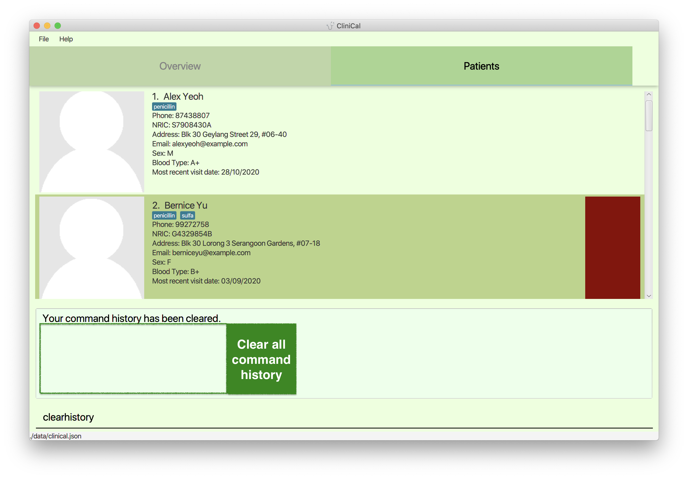
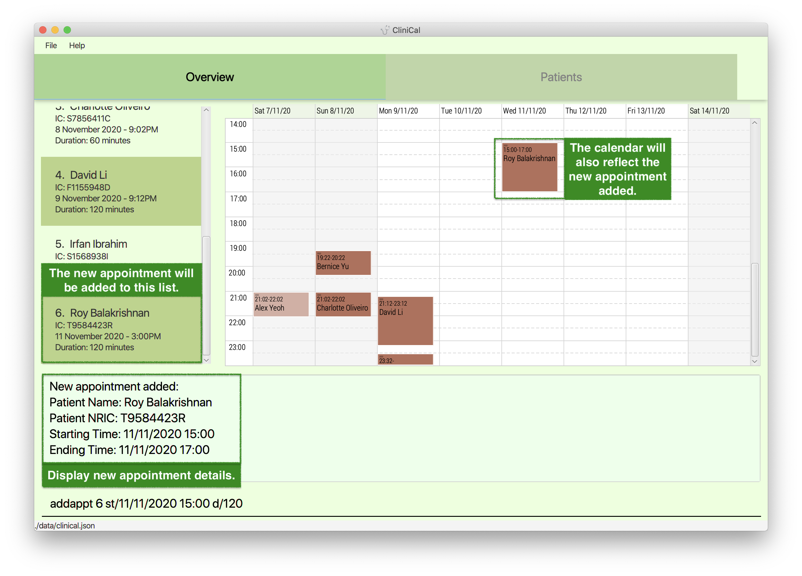
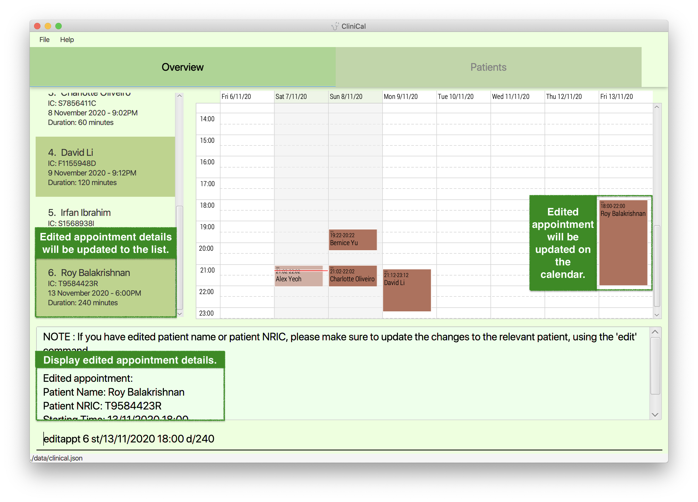

* Table of Contents
{:toc}
--------------------------------------------------------------------------------------------------------------------

## 1. Introduction

CliniCal(Clinic Calendar) is a **desktop app that allows doctors to manage patient records and schedule upcoming appointments**. With CliniCal, you can enhance your daily workflow through the effective scheduling of medical appointments. You can also have access to a digital database that safely stores all your patient records. 

Furthermore, CliniCal is optimized for use via a Command Line Interface (CLI) and even retains the benefits of a Graphical User Interface (GUI). If you can type fast, CliniCal can get your work done faster than traditional GUI apps.

Interested to know more? Take a look at our [**Getting started**](#3-getting-started) guide. Enjoy!

## 2. About this document

Welcome to the CliniCal User Guide!

If you are new to CliniCal, this user guide will get you up and running in no time! It equips you with the basic knowledge you need to use CliniCal properly.

### 2.1 Formatting

The CliniCal User Guide contains different formatting used throughout the document which is used to convey different meanings. 
This table below illustrates what each formatting means.

| Formatting    | What                            | Meaning   | Example                     |
| ----------    |-------------------------------------|-----------|--------------------------|
| `add`      | Words in light-blue highlight, also known as a mark-up| A command that can be typed into CliniCal|`help`|
| `p/PHONE_NUMBER` | Words in UPPER_CASE | A parameter to be supplied by the user |`p/91234567`|
| `n/NAME [s/SEX]` | Words in square brackets| Optional|`n/John Doe` or   `n/John s/M` |
| `[g/ALLERGY]…` | Words with `…` after them| Parameters that can be input multiple times including 0 times|`g/sulfa g/zyrtec` or `g/levocetirizine `|
| [Blue underline](#2-about-this-document)| Blue words that show underline on mouse-over| A clickable hyperlink, to either an external webpage or other parts of this User Guide|[1. Introduction](#1-introduction)|

[**SOME OF THE CONTENTS INSIDE THE TABLE ABOVE AND THE NOTE BELOW SEEMS TO BE REDUNDANT**]

**:information_source: Notes about the command format:** 

* Words in `UPPER_CASE` are the parameters to be supplied by the user. 
  e.g. in `add n/NAME`, `NAME` is a parameter which can be used as `add n/John Doe`.

* Items in square brackets are optional. 
  e.g `n/NAME [g/ALLERGY]` can be used as `n/John Doe g/penicillin` or as `n/John Doe`.

* Items with `…` after them can be used multiple times including zero times. 
  e.g. `[g/ALLERGY]…` can be used as ` ` (i.e. 0 times), `g/penicillin`, `g/sulfa g/aspirin` etc.

* Parameters can be in any order. 
  e.g. if the command specifies `n/NAME p/PHONE_NUMBER`, `p/PHONE_NUMBER n/NAME` is also acceptable.

## 3. Getting started

You can follow the steps below to get CliniCal up and running:

1. Ensure you have Java `11` or above installed on your Computer. If you have not installed Java on your computer, download the installer from [Oracle](https://www.oracle.com/java/technologies/javase-jdk11-downloads.html).

1. Download the latest version of CliniCal from [GitHub](https://github.com/AY2021S1-CS2103T-W11-4/tp/releases).

1. Copy the file to the folder you want to use as the _home folder_ for CliniCal.

1. Double-click the file, `CliniCal.jar` to start the app. The GUI similar to the below should appear in a few seconds.  
   

1. Type the command in the command box and press <kbd>Enter</kbd> to execute it. e.g. typing `help` and pressing <kbd>Enter</kbd> will open the help window. 
   Some example commands you can try:

   * `list`: Lists all your patients.

   * `add n/John Doe p/98765432 ic/S2561932A a/Pickle street, Block 123, #01-01 e/johnd@example.com` : Adds a patient named `John Doe` to the patient database.

   * `delete 3` : Deletes the 3rd patient shown in the patient list.

   * `clear`: Deletes all your patients.

   * `exit`: Exits the app.

1. Refer to the [**Features**](#5-features) below for details of each command or refer to the [**Command Summary**](#7-command-summary) to quickly refer to all available commands.

1. Finally, if you wish to return the sample data back into its original state, you can delete the `data` folder that was generated in the same folder as `CliniCal.jar`.

--------------------------------------------------------------------------------------------------------------------

## 4. User Interface

CliniCal contains a Graphical User Interface (GUI) which serves to allow you to easily view upcoming appointments and also patient records.

[**INSERT PICTURE ON FIRST STARTUP OF CLINICAL WITH ANNOTATIONS OF THE MAIN PARTS OF THE GUI (indicated below)**]

The layout of the GUI is as follows:
* Top Menu Bar
* Main Display Area
* Result Display Area
* Command Input Area

On the first startup, CliniCal will be loaded with sample data to give you a feel of the features in CliniCal.

If you wish to start afresh, enter the `clear` command to clear all entries from the appointment and patient database!

### 4.1 Overview Tab

[**INSERT PICTURE ON FIRST STARTUP ON OVERVIEW TAB WITH ANNOTATIONS OF APPOINTMENT LIST, CALENDAR AND APPOINTMENT INDEX**]

This would be the home page of CliniCal, where the appointment list would be on the left, and the calendar view on the right.

* The index used to access each appointment is shown next to the patient's name.

* On the left, you would be able to view all upcoming appointments with the follow details under each appointment:
    * Patient Name
    * NRIC
    * Date and Time of Appointment
    * Duration of Appointment

* On the right, you would be able to view the upcoming appointments in a weekly calendar view. The view is set to show you appointments ranging from yesterday to 6 days from now.

* Refer to the section on [**Patient Appointment Commands**](#54-patient-appointment-commands) for more details on how to add an appointment!

:bulb: Tip: 
 
* If the patient name in the appointment list is too long and becomes cutoff, simply resize the window to make it wider!

### 4.2 Patients Tab

[**INSERT PICTURE OF SAMPLE DATA PATIENTS TAB WITH ANNOTATIONS OF PATIENT LIST AND PATIENT INDEX**]

This tab shows you the patient database and the details of each patient, together with a summary of each visit.

* The index used to access each patient is shown next to the patient's name.

* The sample data in the figure above indicates that Bernice Yu has the red color tag, meaning that Bernice Yu has high priority and requires close monitoring and follow-up actions. You are free to assign any color to any patient.

* Refer to [**Patient Commands**](#52-patient-commands) for more details on how to add a patient!

### 4.3 Profile Window

[**INSERT PICTURE OF SAMPLE DATA OF BERNICE YU PATIENT PROFILE WITH ANNOTATIONS OF PATIENT PROFILE PICTURE, PERSONAL DETAILS PANE, VISITS PANEL AND VISITATION LOG INDEX**]

This window shows you the individual patient profile picture and personal details in an easy to read manner.

* It also contains details of each visit stored in visitation logs sorted by descending date order in DD/MM/YYYY format (i.e. The most recent visit will appear at the top). 

* The index used to access each visitation log is also shown after the words 'Visitation Log'.

* Each visitation log contains the following details:
    * Diagnosis
    * Prescription
    * Comments

* Refer to [**Patient Visitation Commands**](#53-patient-visitation-commands) for more details on how to add a visit!

--------------------------------------------------------------------------------------------------------------------

## 5. Features

This section highlights the commands that CliniCal supports. These include details about the format of the command and example scenarios of the command.

### 5.1 General Commands

General commands help enhance your general user experience while using CliniCal.

#### 5.1.1 Viewing help: `help`

Access help page by referring to the link provided in the message pop-up.

Format: `help`

  :bulb: **Tip:** You can press the <kbd>Esc</kbd> key to close the help popup!
  

#### 5.1.2 Retrieving past commands: `history`

View a list of past commands that you had used during the session.

Format: `history`

#### 5.1.3 Clearing command history: `clearhistory`

Clear the command history.

Format: `clearhistory`

**:information_source: Note:** 

 * Your history is erased when you close and reopen the app. Do not close the app if you have anything in the history that needs to be undone!
 * Use with caution, `clearhistory` cannot be undone using `undo`!

#### 5.1.4 Undoing the previous command: `undo`

Revert your previous command which modified the patient database.

Format: `undo`

* Only applies for commands that modify the patient database such as `add`, `edit`, `delete`, `clear`,
`addvisit`, `editvisit`, `deletevisit`, `addappt`, `editappt` and `deleteappt`.
* Does not support `addpicture`, so remember be careful when using modifying a patient's profile picture!
* Does not apply for undoable commands such as `find`, `list` and `clearhistory`.

Example: 
* While trying to `edit`, you accidentally deleted Alex Yeoh's patient details by accident.
* Instead of re-entering all the information again, you can easily restore Alex Yeoh's details by using `undo` on your previous `delete` command.

#### 5.1.5 Redoing a command: `redo`

Redo the most recent command that you have undone.

Format: `redo`

* Only able to `redo` commands that have been previously undone such as `add`, `edit`, `delete`, `clear`,
`addvisit`, `editvisit`, `deletevisit`, `addappt`, `editappt` and `deleteappt`.

#### 5.1.6 Exiting the program: `exit`

Exit the program.

Format: `exit`

### 5.2 Patient Commands

Patient commands help you make changes to your database of patients.

#### 5.2.1 Adding a patient: `add`

Add a new patient to the patient database.

Format: `add n/NAME p/PHONE_NUMBER ic/NRIC [a/ADDRESS] [e/EMAIL] [s/SEX] [b/BLOOD_TYPE] [ct/COLOR_TAG] [g/ALLERGY]…`

Examples:
* `add n/John Doe p/98765432 ic/S3857462J e/johnd@example.com a/Pickle street, block 123, #01-01` Adds a new patient named 'John Doe' with the respective fields.
* `add n/Betsy Crowe ic/G7667353B e/betsycrowe@example.com a/Newgate Prison p/1234567 g/penicillin` Adds a new patient named 'Betsy Crowe' with the respective fields.

**:information_source: Note:** 

* Only Singaporean NRIC format is accepted for NRIC field.
* `N/A` is accepted as a special placeholder for all optional fields.
* To account for corporate email networks, we allow a wide range of email addresses, such as `user@desk102`. If you are entering normal email addresses, check that you have not missed out on any parts of the email.
* A patient can have any number of allergies (including 0).
* The color tag can be any standard HTML color name, such as red, green or orange.
* Check out <a href="https://www.w3schools.com/colors/colors_names.asp">this link</a> for an extensive list.

**:information_source: Note about color coding patients:** 

 * When your patient is tagged with a color tag, the background of the patient will be styled to show that color. The color tags can be used for a variety of purposes.
 * For example, you may color code patients at risk of terminal diseases as red, for easier reference.

#### 5.2.2 Adding profile picture: `addpicture`

Add a profile picture to the patient’s profile by specifying the image's filepath.
If the person already has an existing profile picture, you can use this command to update the profile picture with a new picture.

Format: `addpicture INDEX f/FILE_PATH`

* All patient profiles are preloaded with a stock profile picture.
* `addpicture` cannot be undone using `undo`. You can repeat the `addpicture` command to update your desired profile picture.

Examples:
*  `addpicture 3 f/data/profile_3.jpg` Replaces existing profile picture with 'profile_3.jpg' found in
                                                  'data' folder for the 3rd patient on the list

:bulb: Tip: 
 
* You can also add a profile picture using drag and drop with your mouse!
1. Select your desired profile picture and drag it onto the space reserved for patient profile picture in CliniCal.
1. Release the mouse button and your patient's profile picture would be updated with the desired picture.

#### 5.2.3 Editing a patient: `edit`

Edit an existing patient in the patient database.

Format: `edit INDEX [n/NAME] [p/PHONE_NUMBER] [ic/NRIC] [a/ADDRESS] [e/EMAIL] [s/SEX] [b/BLOOD_TYPE] [ct/COLOR_TAG] [g/ALLERGY]…`

* Edits the patient at the specified `INDEX`. `INDEX` refers to the index number shown in the displayed patient list. The index **must be a positive number** 1, 2, 3, …​
* At least one of the optional fields must be provided.
* Existing values will be updated to the input values.
* Note that only Singaporean IC format(@xxxxxxx#) is accepted for NRIC.
* To account for corporate email networks, we allow a wide range of email addresses, such as `user@desk102`. If you are entering normal email addresses, check that you have not missed out on any parts of the email.
* When editing allergies (or color tag), the existing allergies (or color tag) of the patient will be removed i.e adding of allergies (or color tag) is not cumulative.
* You can remove all the patient’s allergies by typing `g/` without specifying any allergies after it. The same applies for color tags of a patient.

Examples:
*  `edit 1 p/11111111 e/pauline@example.com` Edits the phone number and email address of the 1st patient to be `11111111` and `pauline@example.com` respectively.
*  `edit 2 ct/red` Clears the existing color tag and edits the color tag of the 2nd patient to be red.

**:information_source: Note:** 

* `N/A` is accepted as a special placeholder for all optional fields.
* Only Singaporean NRIC format is accepted for NRIC field.
* If you have edited **patient name** or **patient NRIC**, please make sure to update the changes to any relevant appointments, using the `editappt` command.

#### 5.2.4 Deleting a patient: `delete`

Delete a specified patient from the patient database.

Format: `delete INDEX`

* Deletes the patient at the specified `INDEX`.
* `INDEX` refers to the index number shown in the displayed patient list.
* `INDEX` **must be a positive number** 1, 2, 3, …​

Examples:
* `list` followed by `delete 9` Deletes the 9th patient (duplicated entry of John Doe) in the patient database.
* `find Betsy` followed by `delete 1` Deletes the 1st patient in the results of the `find` command.

**:information_source: Note:** 

* Please make sure to delete **any appointments related to the deleted patient**, using the `deleteappt` command.

#### 5.2.5 Deleting all patients: `clear`

Clear all patient entries from the patient database.

Format: `clear`

:bulb: Tip: 

* Reverse the `clear` command using the `undo` command!

**:information_source: Note:** 

* Please make sure to delete **any appointments related to the deleted patient**, using the `deleteappt` command.

#### 5.2.6 Finding patients: `find`

Find patients whose names or NRIC contain any of the given keywords.

Format: `find KEYWORDS`

* You can search for the patient's name or NRIC.
* The search is case-insensitive. 
    * `benson` will match `Benson`
* The search keyword entered can consist of just one word or even multiple keywords. 
    * `Benson` or `Benson Meier` 
* Patient will be matched even if the keyword matches the search parameters only partially 
    * `Ben` will match `Benson`, `7435696` will match `S7435696B`.
* The order of the keywords does not matter. 
    * `Meier Benson` will match `Benson Meier`
* Patients matching at least one keyword will be returned (i.e. OR search).
    * `Benson Meier` will return `Benson Yu`, `Andrew Meier`

Examples:
* `find John` Returns `john` and `John Doe`
* `find ben` Returns `benjamin`
* `find alex david` Returns `Alex Yeoh`, `David Li` 
* `find 9123456` Returns the patient with the NRIC `s9123456z`

#### 5.2.7 Listing all patients: `list`

View a list of all your patients in the patient database.

Format: `list`

:bulb: Tip: 

* If you are on the `Overview` screen rather than the `Patients` screen, the application may not be updated! When using list, please switch over to the patients tab to see the list of your patients.

#### 5.2.8 Viewing patient profile: `profile`

Display the patient's profile in a separate window.

Format: `profile INDEX`

* Displays the patient's profile that is specified by `INDEX`.
* `INDEX` refers to the index number shown in the displayed patient list.
* `INDEX` **must be a positive number** 1, 2, 3, …​

**Example**: You want to display the profile of the 1st patient on the list.

**Step 1**: Input `profile 1` into the command box and press <kbd>Enter</kbd> on your keyboard.

**Step 2**: A window displaying the patient's profile will appear. All relevant patient records and visitation logs will be shown.

**Step 3**: To close the patient profile window, you can click on the 'Close' button on the top-right section of the window. Alternatively, you can press the <kbd>ESC</kbd> key on your keyboard.

### 5.3 Patient Visitation Commands

Visitation commands help you make changes to the visitation logs specific to a patient. 

These visitation logs store the following as a short summary of a patient's visit:
* Diagnosis
* Prescription
* Comments

#### 5.3.1 Adding a new visitation log for patient: `addvisit`

Display a new window to add a new visitation log for the specified patient.

Format: `addvisit INDEX [vd/VISIT_DATE]`

* `INDEX` refers to the patient's index number as shown in the displayed patient list.
* `VISIT_DATE` refers to the date of visitation.
    * It follows the format of `dd/MM/yyyy`, for example `23/10/2020`.
    * Do note that for numerical inputs `1-9`, you will need to include an additional `0` in front. For example, enter `05` instead of `5`.
    * Only dates before and *up till and including today* are accepted.
* `VISIT_DATE` is optional. If no visit date is being specified in the command, then the current date on the local machine will be used to record the patient's visit.

**Example**: You want to add a visitation log to the 1st patient on the list.

**Step 1**: Input `addvisit 1 vd/23/10/2020` into the command box and press <kbd>Enter</kbd>.

**Step 2**: A window displaying the three parameters - Diagnosis, Prescription and Comments will be shown. Type in relevant
            details in each text box.

**Step 3**: Click on the 'Save' button or press <kbd>CTRL</kbd> + <kbd>S</kbd> on your keyboard to save the visitation log.

**Step 4**: The window will close, and a message will be displayed to indicate that the visitation log has been successfully saved.

:bulb: Tip: 

* Use <kbd>SHIFT</kbd> + <kbd>TAB</kbd> and <kbd>CTRL</kbd> + <kbd>TAB</kbd> to move to the previous and next text box respectively!
* Do note that after entering relevant details for the Comments text box, your mouse cursor will automatically move to the Save button 
  if you press <kbd>CTRL</kbd> + <kbd>TAB</kbd>. At this point, you can simply press <kbd>ENTER</kbd> to save the visitation log.
* You can press <kbd>Esc</kbd> or the close button at the top right to close the window without saving.

#### 5.3.2 Editing patient's visitation log: `editvisit`

Display a new window to edit the visitation log for a specified patient.

Format: `editvisit INDEX i/VISIT_INDEX [vd/VISIT_DATE]`

* `INDEX` refers to the patient's index number as shown in the displayed patient list.
* `VISIT_INDEX` refers to the visitation's index number as shown in the patient's profile.
* Both indexes **must be a positive number** 1, 2, 3, …​
* `VISIT_DATE` refers to the new date of visitation that you wish to amend to.
    * It follows the format of `dd/MM/yyyy`, for example `23/10/2020`.
    * Do note that for numerical inputs `1-9`, you will need to include an additional `0` in front. For example, enter `05` instead of `5`.
    * Only dates before and *up till and including today* are accepted.
* `VISIT_DATE` is optional. If no visit date is being specified in the command, then the date of the visitation will remain the same.

**:information_source: Note:** 

* If you do not wish to change the date, it is not needed to enter the same date again, even though CliniCal will still accept it.
* The date "01/01/1900" is reserved for internal usage, please do not use this date!

**Example**: You want to edit the 1st visitation log belonging to the 2nd patient on the list.

**Step 1**: Input `editvisit 2 i/1` into the command box and press <kbd>Enter</kbd>.

**Step 2**: A window displaying the three parameters - Diagnosis, Prescription and Comments will be shown. Type in updated
            details in each text box.

   * You may press <kbd>CTRL</kbd> + <kbd>TAB</kbd> on your keyboard to move to the next text box.
   * You may press <kbd>SHIFT</kbd> + <kbd>TAB</kbd> on your keyboard to move to the previous text box.

**Step 3**: Click on the 'Save' button or press <kbd>CTRL</kbd> + <kbd>S</kbd> on your keyboard to save the visitation log.

**Step 4**: The window will close, and a message will be displayed to indicate that the visitation log has been successfully updated.

#### 5.3.3 Deleting patient's visitation log: `deletevisit`

Delete the patient's visitation log.

Format: `deletevisit INDEX i/VISIT_INDEX`

* `INDEX` refers to the patient's index number as shown in the displayed patient list.
* `VISIT_INDEX` refers to the visitation's index number as shown in the patient's profile.
* Both indexes **must be a positive number** 1, 2, 3, …​

**Example**: You want to delete the 2nd visitation log belonging to the 1st patient on the list.

**Step 1**: Input `deletevisit 1 i/2` into the command box and press <kbd>Enter</kbd>.

**Step 2**: A message will be displayed to indicate that the patient's second visitation log has been successfully deleted.

### 5.4 Patient Appointment Commands

Patient Appointment commands help you manage your upcoming patient appointments.

#### 5.4.1 Adding an appointment: `addappt`

Add a new appointment for the specified patient to the appointment database.

Format: `addappt INDEX st/APPOINTMENT_START_TIME d/DURATION`

* `INDEX` refers to the patient's index number as shown in the displayed patient list in the **Patients** tab.
    * It **must be a positive number**, eg. 1, 2, 3, …​
* `APPOINTMENT_START_TIME` refers to the date and starting time of the appointment.
    * It follows the format of `dd/MM/yyyy HH:mm`, for example `31/12/2020 23:59`.
    * Note that you will need to input the hour (`HH`) in  the 24-hour format.

* `DURATION` refers to the duration of the appointment, in minutes.

:bulb: Tip: 

* Note that only appointments of upcoming dates (including today) will be accepted.
* If you are having trouble converting your time to 24 hour format, check out a time format converter at <a href="https://www.timecalculator.net/12-hour-to-24-hour-converter">this link</a>.
* You can retrieve your desired patient `INDEX` from the **Patients** tab.

Example: You want to add an appointment with the first patient on the list.

**Step 1**: Input `addappt 6 st/29/12/2020 16:00 d/120` into the command box and press Enter.

**Step 2**: On the **Overview** tab, you can find your newly added appointment saved inside the appointment list.

**Step 3**: If your newly added appointment is happening within a week from today, you can see the appointment being reflected in the calendar on the right of the appointment list.

:bulb: Tip: 

* You are highly recommended to use a duration of at least 30 minutes to optimise your experience with our CliniCal calendar feature.

#### 5.4.2 Editing an appointment: `editappt`

Edit the specified appointment in the appointment database.

Format: `editappt INDEX [pn/PATIENT_NAME] [pi/PATIENT_IC] [st/APPOINTMENT_START_TIME] [d/DURATION]`

* Edits the appointment at the specified `INDEX`. `INDEX` refers to the index number shown in the displayed appointment list. The index **must be a positive number** 1, 2, 3, …​
* At least one of the optional fields must be provided.
* Existing values will be updated to the input values.

* `INDEX` refers to the appointment's index number as shown in the displayed appointment list in the **Overview** tab. 
    * It **must be a positive number**, eg. 1, 2, 3, …​
* `PATIENT_NAME` refers to the name of the patient involved in the appointment as shown in the displayed calendar in the **Overview** tab.
* `PATIENT_IC` refers to the NRIC of the patient involved in the appointment as shown in the displayed calendar in the **Overview** tab. 
* `APPOINTMENT_START_TIME` refers to the date and starting time of the appointment. 
    * It follows the format of `dd/MM/yyyy HH:mm`, for example `31/12/2020 23:59`.
    * Note that you will need to input the hour (`HH`) in  the 24-hour format. 
* `DURATION` refers to the duration of the appointment, in minutes.

Example: You want to reschedule the first appointment in the appointment list.

**Step 1**: Input `editappt 1 st/29/12/2020 17:00 d/120` into the command box and press Enter.

**Step 2**: On the **Overview** tab, you can find the newly updated appointment inside the appointment list. 

**Step 3**: If the newly updated appointment is due within a week from today, you can also see the appointment details inside the calendar.

:bulb: Tip: 

* If you are having trouble converting your time to 24 hour format, check out the time format converter at <a href="https://www.timecalculator.net/12-hour-to-24-hour-converter">this link</a>.
* You can retrieve your desired appointment `INDEX` from the **Overview** tab.

**:information_source: Note:** 

* Only Singaporean NRIC format is accepted for NRIC field.
* Please make sure to **update the changes to the relevant patient**, using the `edit` command.

#### 5.4.3 Deleting an appointment: `deleteappt`

Delete the specified appointment from the appointment database.

Format: `deleteappt INDEX`

* `INDEX` refers to the appointment's index number as shown in the displayed appointment list in the **Overview** tab.
    * It **must be a positive number**, eg. 1, 2, 3, …​

Example: You want to delete your next upcoming appointment as your patient could not make it for the appointment.

**Step 1**: Input `deleteappt 1` and press Enter.

**Step 2**: The first appointment displayed will be removed from the appointment list immediately. You can also see that the appointment is no longer being displayed on the calendar.

:bulb: Tip: 

* You can retrieve your desired appointment `INDEX` from the **Overview** tab.

### 5.5 Retrieving past commands using arrow keys

Retrieve and reuse past commands using the <kbd>↑</kbd> arrow and <kbd>↓</kbd> arrow keys on the keyboard.
1. Click on the text field of the command box.
2. Press the <kbd>↑</kbd> arrow key to display the most recent past command.
3. Press the <kbd>↓</kbd> and <kbd>↑</kbd> arrow keys to navigate through the list of past commands.
4. Press <kbd>Enter</kbd>/<kbd>Return</kbd> key to reuse the command.

:bulb: Tip: 

* Useful when inputting repeated commands.
* No need to retype them all over again!

### 5.6 Saving the data

CliniCal data is saved in your hard disk automatically after any command that changes the data. There is no need to save manually.

--------------------------------------------------------------------------------------------------------------------

## 6. FAQ

**Q**: How do I transfer my data to another Computer? 
**A**: Install the app in the other computer and overwrite the empty data file it creates with the file that contains the data of your previous CliniCal home folder.

--------------------------------------------------------------------------------------------------------------------

## 7. Command summary

Action | Format, Examples
--------|------------------
**Add** | `add n/NAME p/PHONE_NUMBER ic/NRIC [a/ADDRESS] [e/EMAIL] [s/SEX] [b/BLOOD_TYPE] [ct/COLOR_TAG] [g/ALLERGY]…​`   e.g. `add n/James Ho p/22224444 ic/S2686887R e/jamesho@example.com a/123, Clementi Rd, 1234665 s/M b/B+ g/sulfa g/aspirin`
**Add profile picture** | `addpicture 1 f/data/profile_picture.png`
**Add Visit** | `addvisit INDEX [vd/VISIT_DATE]`   e.g. `addvisit 1 vd/31/12/2020`
**Add Appointment** | `addappt INDEX st/APPOINTMENT_START_TIME d/DURATION`   e.g., `addappt 1 st/27/12/2020 14:00 d/60`
**Clear** | `clear`
**Clear command history** | `clearhistory`
**Delete** | `delete INDEX`  e.g. `delete 3`
**Delete Visit** | `deletevisit INDEX i/VISIT_INDEX`   e.g. `deletevisit 1 i/2`
**Delete Appointment** | `deleteappt INDEX`   e.g. `delete 3`
**Edit** | `edit INDEX [n/NAME] [p/PHONE_NUMBER] [ic/NRIC] [a/ADDRESS] [e/EMAIL] [s/SEX] [b/BLOOD_TYPE] [ct/COLOR_TAG] [g/ALLERGY]…`  e.g.`edit 2 n/James Lee e/jameslee@example.com `
**Edit Appointment** | `editappt INDEX [pn/PATIENT_NAME] [pi/PATIENT_IC] [st/APPOINTMENT_START_TIME] [d/DURATION]`   e.g. `editappt 3 st/12/12/2020 10:10 d/40`
**Edit Visit** | `editvisit INDEX i/VISIT_INDEX [vd/VISIT_DATE]`   e.g. `editvisit 1 i/2`
**Find** | `find KEYWORD [MORE_KEYWORDS]`  e.g. `find James Jake`
**List** | `list`
**Help** | `help`
**Undo** | `undo`
**Redo** | `redo`
**Retrieve past commands** | `history`
**View patient profile** | `profile INDEX`  e.g. `profile 2`
**Exit** | `exit`
