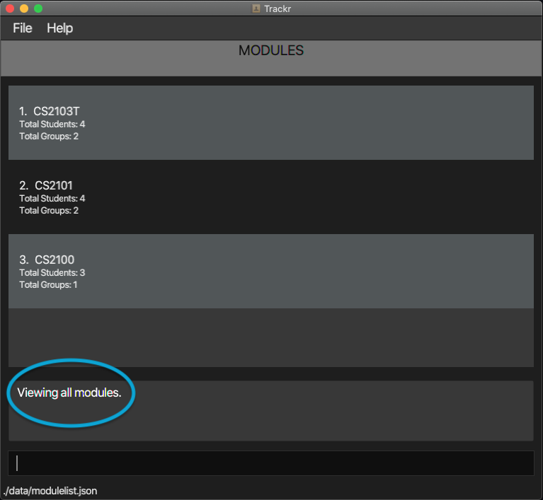
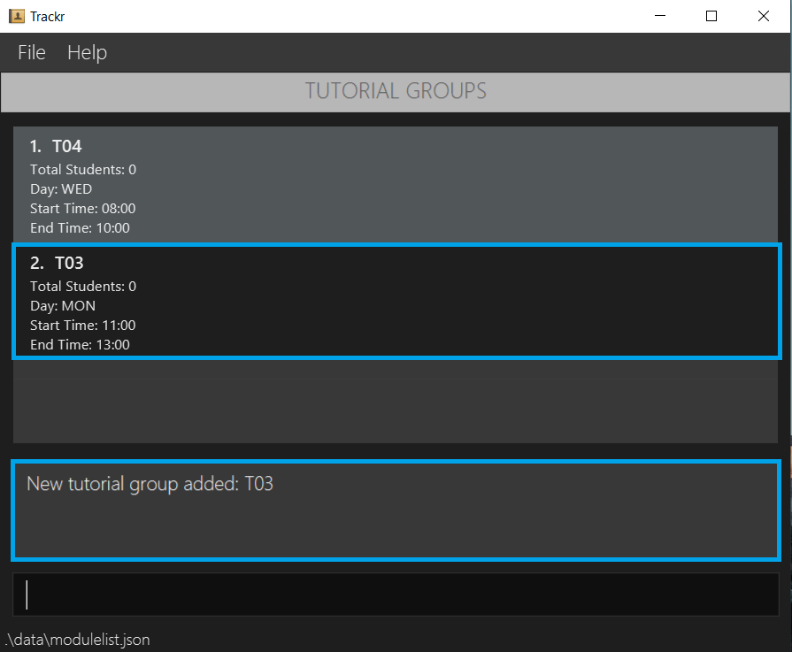
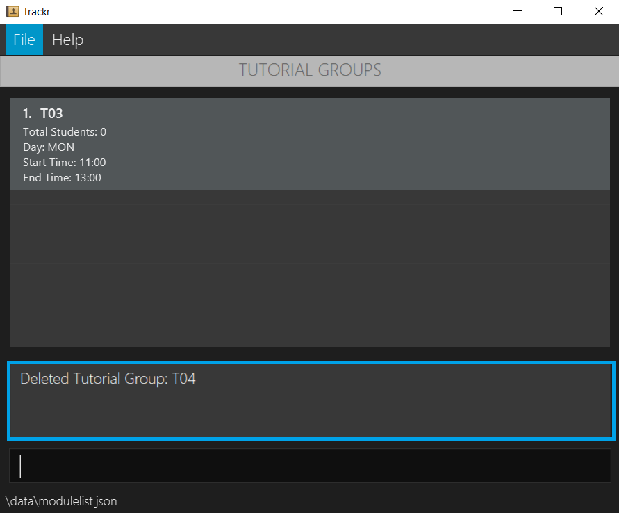
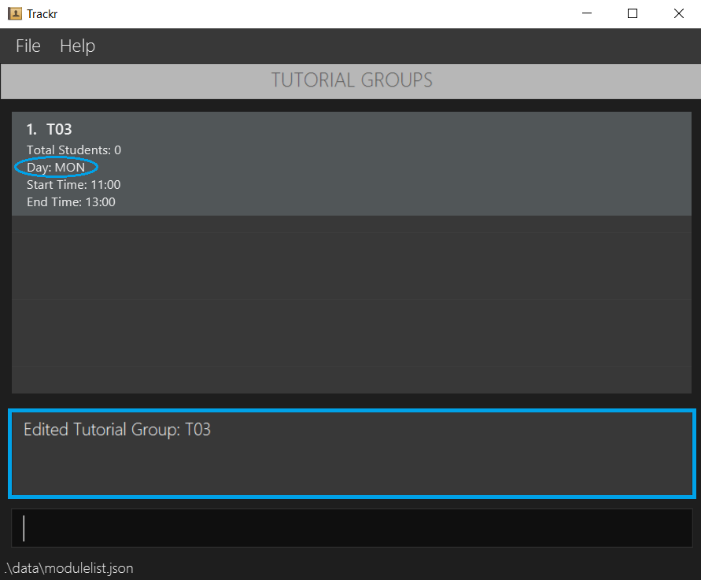
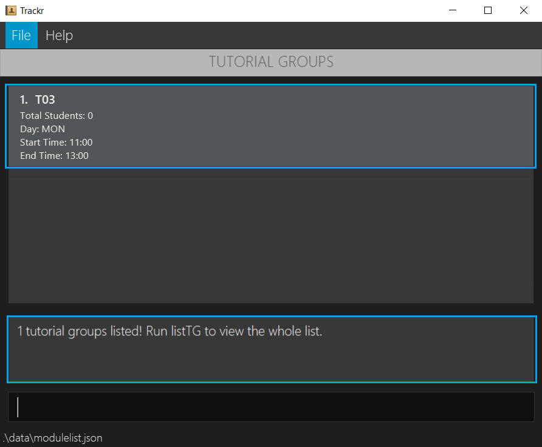
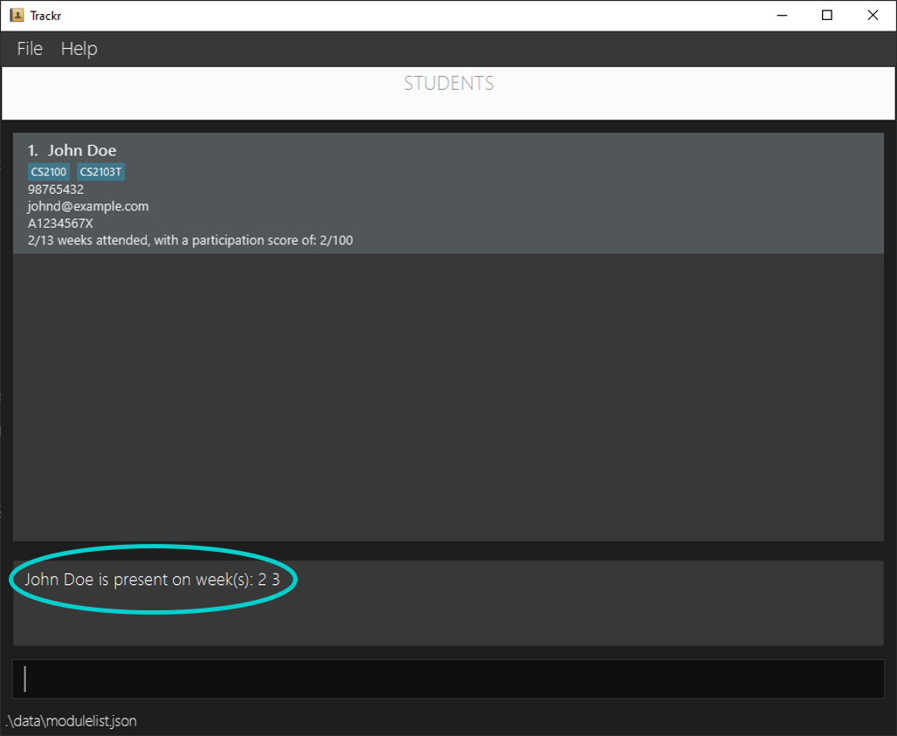

## **Table of Contents**
1. [Introduction](#1-introduction) 
2. [About This Document](#2-about-this-document) 
    2.1 [Glossary](#21-glossary) 
	2.2 [Formatting](#22-formatting) 
	2.3 [Command Format](#23-command-format) 
3. [Getting Started](#3-getting-started) 
    3.1 [Setting Up](#31-setting-up) 
    3.2 [Using Trackr](#32-using-trackr) 
    3.3 [Switching Views](#33-switching-views) 
4. [Features](#4-features) 
   4.1 [General Features](#41-general-features) 
   --- 4.1.1 [View help: `help`](#411-view-help-help) 
   --- 4.1.2 [Clear Trackr: `clear`](#412-clear-trackr-clear) 
   --- 4.1.3 [Exit Trackr: `exit`](#413-exit-trackr-exit) 
   4.2 [Navigation Features](#42-navigation-features) 
   --- 4.2.1 [List all modules in Trackr: `listMod`](#421-list-all-modules-in-trackr-listmod) 
   --- 4.2.2 [View all tutorial groups in a module: `viewtTG`](#422-view-all-tutorial-groups-in-a-module-viewtg) 
   --- 4.2.3 [List all tutorial groups in the current module: `listTG`](#423-list-all-tutorial-groups-in-the-current-module-listtg) 
   --- 4.2.4 [View all students in a tutorial group: `viewStudent`](#424-view-all-students-in-a-tutorial-group-viewstudent) 
   --- 4.2.5 [List all students in a tutorial group: `listStudent`](#425-list-all-students-in-a-tutorial-group-liststudent) 
   --- 4.2.6 [Return to previous view: `prevView`](#426-return-to-previous-view-prevview) 
   4.3 [Module Features](#43-module-features) 
   --- 4.3.1 [Add a module: `addMod`](#431-add-a-module-addmod) 
   --- 4.3.2 [Delete a module: `deleteMod`](#432-delete-a-module-deletemod) 
   --- 4.3.3 [Edit a module: `editMod`](#433-edit-a-module-editmod) 
   --- 4.3.4 [Find a module: `findMod`](#434-find-a-module-findmod) 
   4.4 [Tutorial Group Features](#44-tutorial-group-features) 
   --- 4.4.1 [Add a tutorial group: `addTG`](#441-add-a-tutorial-group-addtg) 
   --- 4.4.2 [Delete a tutorial group: `deleteTG`](#442-delete-a-tutorial-group-deletetg) 
   --- 4.4.3 [Edit a tutorial group: `editTG`](#443-edit-a-tutorial-group-edittg) 
   --- 4.4.4 [Find a tutorial group: `findTG`](#444-find-a-tutorial-group-findtg) 
   4.5 [Student Features](#45-student-features) 
   --- 4.5.1 [Add a student: `addStudent`](#451-add-a-student-addstudent) 
   --- 4.5.2 [Delete a student: `deleteStudent`](#452-delete-a-student-deletestudent) 
   --- 4.5.3 [Edit a student: `editStudent`](#453-edit-a-student-editstudent) 
   --- 4.5.4 [Find a student: `findStudent`](#454-find-a-student-findstudent) 
   4.6 [Attendance Features](#46-attendance-features) 
   --- 4.6.1 [Add attendance: `addAttendance`](#461-add-attendance-addattendance) 
   --- 4.6.2 [Delete attendance: `deleteAttendance`](#462-delete-attendance-deleteattendance) 
   --- 4.6.3 [View all attendance of a student: `viewAttendance`](#463-view-all-attendance-of-a-student-viewattendance) 
   --- 4.6.4 [Show students who fall below an attendance score: `attendanceBelow`](#464-show-students-who-fall-below-an-attendance-score-attendancebelow) 
   --- 4.6.5 [Edit a student's participation: `editParticipation`](#465-edit-a-students-participation-editparticipation) 
   --- 4.6.6 [Show students who fall below a participation score: `participationBelow`](#466-show-students-who-fall-below-a-participation-score-participationbelow) 
5. [FAQ](#5-faq) 
6. [Command Summary](#6-command-summary) 
   6.1 [General Commands](#61-general-commands)  
   6.2 [Navigation Commands](#62-navigation-commands) 
   6.3 [Module Commands](#63-module-commands) 
   6.4 [Tutorial Group Commands](#64-tutorial-group-commands) 
   6.5 [Student Commands](#65-student-commands) 
   6.6 [Attendance Commands](#66-attendance-commands) 

## 1. Introduction

__Trackr__ is an application for teaching assistants (TAs) who prefer to use a desktop application for managing their
student records. It is uses a Command Line Interface (CLI), while still retaining the benefits of a Graphical User
Interface (GUI). If you are a TA with a fast typing speed, __Trackr__ is the app for you! You can start by familiarising
yourself with the information regarding how this document is designed in
[Section 2, "About this document"](#2-about-this-document).

## 2. About this document

Welcome to the __Trackr__ User Guide! In this document you will be able to learn the features that __Trackr__ can
provide to make your TA experience less troublesome. This section will provide information regarding the use of this
document, namely how to navigate through this document, what the technical terms mean and how to interpret the
formatting used.

### 2.1 Glossary

The table below explains certain terms used in the document to describe different parts or aspects of the application.

| Term                           | Meaning                                                      |
| ------------------------------ | ------------------------------------------------------------ |
| Graphical User Interface (GUI) | An interface through which users interact with electronic devices via visual indicator representations. |
| Command Line Interface (CLI)   | An interface that processes commands to a computer program in the form of lines of text. |
| Command                        | An instruction typed by you, the user for **Trackr** to perform. |
| Field                          | A segment of a command that requires information to be filled into. |
| Parameter                      | The information filled by you, the user, into the field of a command. |
| Prefix                         | A short word that is typed right before you, the user, writes the parameter into the command. It always starts with a slash (/) and typically is an abbreviation of the name of the field. |
| Module                         | The specific course being taught in a University.        |
| Tutorial Group                 | The specific class being taught under a given module.        |
| Student                        | An individual who is enrolled in a given module.             |

### 2.2 Formatting

This document is written in a manner where formatting is applied to text in order to convey different meanings. The table below will explain what these formatting uses are, what they look like, and what they mean in the context of the document.

| Formatting                  | Meaning                                                      |
| --------------------------- | ------------------------------------------------------------ |
| `code`                      | Words in 'code' format refer to commands (or fields in commands) that can be typed into the command line. |
| *Italics*                   | Words in italics refer to example parameters, which is what you, the user could type as the parameter that needs to be provided. |
| [Underline](#22-formatting) | Words that are in blue and underlined when hovered over refer to hyperlinks. Hyperlinks are clickable, and bring you either to different parts of this document or to external websites, for the convenience of navigating quickly to different parts of the document or the web. This example on the left will bring you to this section (2.2 Formatting). |
| **Bold**                    | The name of the application **Trackr** is written in bold to refer to what the application does or how it responds to user input. |

### 2.3 Command Format

Commands you provide in the command line follow specific rules. These are the rules you have to follow when typing commands for **Trackr** to read:

-   Words in UPPER_CASE are the parameters to be supplied by the user.  
    e.g. in `addMod m/MODULE_CODE`, MODULE_CODE is a parameter which can be used as `addMod m/CS3243`.
-   Items in square brackets are optional.  
    e.g `n/NAME [t/TAG]` can be used as `n/John Doe t/friend` or as `n/John Doe`.
-   Items with …  after them can be used multiple times including zero times.  
    e.g. `[t/TAG]…`  can be used as (i.e. 0 times), `t/friend`, `t/friend t/family` etc.
-   Parameters can be in any order.  
    e.g. if the command specifies `n/NAME p/PHONE_NUMBER`, `p/PHONE_NUMBER n/NAME` is also acceptable.
-   Multiple instances of the same parameter will still be accepted, however, Trackr will only regard the **last instance** as the intended user input, except for tags.  
    e.g. 
    - `addMod m/CS3243 m/CS2100` will only add the module _CS2100_ to Trackr.
    - `editStudent 1 n/Johnny n/James` will edit the student's name to be _James_.
    - `addStudent n/John Doe p/98765432 e/johnd@example.com id/A1234567X t/CS2103T t/CS2100` will still add both tags to the newly added student _John Doe_.

## 3. Getting Started

### 3.1 Setting Up
Get started by installing __Trackr__ with the following steps:

1. Ensure you have Java 11 or above installed. The latest version of Java can be found
[here](https://www.java.com/en/download/).
2. Download the latest version of __Trackr__ [here](https://github.com/AY2021S1-CS2103T-W12-2/tp/releases).
Look for the file trackr.jar.
3. Copy the file to a folder you wish to use as your home folder for __Trackr__
4. Double-click trackr.jar to start the app. The GUI (Figure 3.1) should appear in a few seconds.

  
Figure 3.1a Trackr GUI

### 3.2 Using Trackr
__Trackr__ boasts many useful features to make using the app seamless and smooth. These include
commands to add or delete modules, tutorial groups, or students you are teaching. To use a feature, simply
type the command into the command box (see Figure 3.2) and press _Enter_ to execute it. Further explanations of
all the commands are listed in [Section 4, "Features"](#4-features).

  
Figure 3.2a Command example

### 3.3 Switching Views
__Trackr__ allows you to switch the current view from Module View (Figure 3.3.1) to Tutorial Group View (Figure 3.3.2)
to Student View (Figure 3.3.3) depending on your current need. This is done using the commands `listMod`, `viewTG`, and
`viewStudent`. You may wish to navigate back from Student View to Tutorial Group View or from Tutorial Group View to
Module View. This is achieved using `prevView`. The correct syntax for these commands are shown in
[Section 4, "Features"](#4-features). The top of the app shows the view you are currently in.

  
Figure 3.3a Module View

  
Figure 3.3b Tutorial Group View

  
Figure 3.3c Student view

## 4. Features

### 4.1 General Features

#### 4.1.1 View help: `help`
Shows a message explaining how to access the user guide.

Format: `help`

> Note
>
> - You can perform this command in ANY view.

Example: `help`

Expected Outcome:

Figure 4.1.1a Expected outcome of performing the `help` command

#### 4.1.2 Clear Trackr: `clear`
Clears all data inside Trackr.

Format: `clear`

> Note
> - You can perform this command in ANY view.
> - Trackr will erase all data.
> - Method is irreversible.
> - View will change to Module view.

Example: `clear`

Expected Outcome:

Figure 4.1.2a Expected outcome of performing the `clear` command

#### 4.1.3 Exit Trackr: `exit`
Exits Trackr and automatically saves the data.

Format: `exit`

> Note
> - You can perform this command in ANY view.
> - Trackr will close by itself.

Example: `exit`

### 4.2 Navigation Features

#### 4.2.1 List all modules in Trackr: `listMod`

Lists all the modules in the Module view.

Format: `listMod`

> Note: You can perform this command in ANY view.

Example: 
- Lists all modules in Trackr.
    - `listMod`
    

Expected Outcome:

Figure 4.2.1a Expected outcome of performing the `listMod` command

#### 4.2.2 View all tutorial groups in a module: `viewTG`
Shows the tutorial group list of a target module.

Format: `viewTG INDEX`

> Note: 
> - You should perform this command in the Module view.
> - `INDEX` is the target module's index in the currently displayed module List.

Example: 
- Changes the view to Tutorial Group view and shows the tutorial group list of module at index 1.
    - `viewTG 1`

Expected Outcome:

Figure 4.2.2a Expected outcome of performing the `viewTG` command

#### 4.2.3 List all tutorial groups in the current module: `listTG`
Lists all tutorial groups in the Tutorial Group view.

Format: `listTG`

> Note: 
>
> - You should perform this command in the Tutorial Group view.

Example: 
- Lists all tutorial groups in the Tutorial Group view.
    - `listTG`

Expected Outcome:

Figure 4.2.3a Expected outcome of performing the `listTG` command

#### 4.2.4 View all students in a tutorial group: `viewStudent`
Shows the student list of a target tutorial group.

Format: `viewStudent INDEX`

> Note: You should perform this command in the TUTORIAL GROUP view.
> - `INDEX` refers to the index number shown in the Tutorial Group view.
> - `INDEX` must be a positive integer starting from 1.

Example: 
- Changes the view to Student view and shows the student list of tutorial group at index 1.
    - `viewStudent 1`
    

Expected Outcome:

Figure 4.2.4a Expected outcome of performing the `viewStudent` command

#### 4.2.5 List all students in a tutorial group: `listStudent`
Lists all students in the Student view.

Format: `listStudent`

> Note: 
>
> - You should perform this command in the Student view.

Example: 
- Lists all students in the Student view.
    - `listStudent`

Expected Outcome:

Figure 4.2.5a Expected outcome of performing the `listStudent` command

#### 4.2.6 Return to previous view: `prevView`
Returns to the previous view.

Format: `prevView`

> Note: 
>
> - You can perform this command in ANY view but MODULE is the last View.

Example: `prevView`

Figure 4.2.6a Expected outcome of performing the `prevView` command

### 4.3 Module Features

> You should perform the following features while in the Module view.

#### 4.3.1 Add a module: `addMod`

Adds a module to the module list.

Format: `addMod m/MODULE_CODE`

> Note:
> - Modules should not share the same `MODULE_CODE`.
> - It is recommended to use the exact code of the module.
> - `MODULE_CODE` should not be blank and only contain alphanumeric characters.

Example:

- Adds a module _CS2100_ to the module list.
    - `addMod m/CS2100`

Expected Outcome:

Figure 4.3.1a Expected outcome of performing the `addMod` command

#### 4.3.2 Delete a module: `deleteMod`

Deletes a module based on the given `INDEX`

Format: `deleteMod INDEX`

> Note:
> - `INDEX` refers to the index number shown in the Module view.
> - `INDEX` must be a positive integer starting from 1.
> - Deleting a module is irreversible.

Example:

- Deletes a module at index _1_ in the module list.
    - `deleteMod 1`

Expected Outcome:

Figure 4.3.2a Expected outcome of performing the `deleteMod` command
    
#### 4.3.3 Edit a module: `editMod`

Edits a module with the provided details.

Format: `editMod INDEX m/MODULE_CODE`

> Note:
> - `INDEX` refers to the index number shown in the Module view.
> - `INDEX` must be a positive integer starting from 1.
> - New `MODULE_CODE` should not already exist.

Example:

- Edits the module code of the first module to be _CS2020_.

    - `editMod 1 m/CS2020`

Expected Outcome:

Figure 4.3.3a Expected outcome of performing the `editMod` command

#### 4.3.4 Find a module: `findMod`

Finds and lists all modules in the current Module view whose module code contains any of the given keywords.

Format: `findMod KEYWORD`

> Note:
> - `KEYWORD` should not be blank.
> - `KEYWORD` is not case-sensitive (e.g. _cs2100_ will match _CS2100_).
> - The search will look for matches, including partial match, in the module's code (e.g. _cs2_ will match _CS2100_,
however, _cs23_ will not match _CS2100_).
> - If no module matching the keyword is found, the Module view will be empty.

Example:

- Finds a module with `KEYWORD` _cs20_.

    - `findMod cs20`

Expected Outcome:

Figure 4.3.4a Expected outcome of performing the `findMod` command

### 4.4 Tutorial Group Features

> - You should perform the following features while in the Tutorial Group view.
> - Refer to Section 4.2 - Navigation for help getting to the correct view

#### 4.4.1 Add a tutorial group: `addTG`
Adds a tutorial group to the tutorial group list.

Format: `addTG tg/TG_CODE day/DAY_OF_WEEK start/START_TIME end/END_TIME`

> Note:
> - Tutorial groups should not share the same `TG_CODE` within the same module.
> - It is recommended to use the exact code of the tutorial group.
> - `TG_CODE`, `DAY_OF_WEEK`, `START_TIME` and `END_TIME` should not be blank.
> - `TG_CODE` should only contain alphanumeric characters.
> - `DAY_OF_WEEK` should only be one of MON/TUE/WED/THU/FRI.
> - `START_TIME` and `END_TIME` should be in the form of 24HR format HH:MM.

Example: 
- Adds a tutorial group _T03_ that takes place every _MON_ from _08:00_ to _10:00_ to the tutorial group list.
    - `addTG tg/T03 day/MON start/11:00 end/13:00`

Expected Outcome:

Figure 4.4.1a Expected outcome of performing the `addTG` command

#### 4.4.2 Delete a tutorial group: `deleteTG`
Deletes a tutorial group based on the given `INDEX`

Format: `deleteTG INDEX`

> Note:
> - `INDEX` refers to the index number shown in the Tutorial Group view.
> - `INDEX` must be a positive integer starting from 1.
> - Deleting a tutorial group is irreversible.

Example:

- Deletes a tutorial group at index _1_ in the tutorial group list.
    - `deleteTG 1`

Expected Outcome:

Figure 4.4.2a Expected outcome of performing the `deleteTG` command

#### 4.4.3 Edit a tutorial group: `editTG`
Edits a module with the provided details.

Format: `editTG INDEX [tg/TG_CODE] [day/DAY_OF_WEEK] [start/START_TIME] [end/END_TIME]`

> Note:
> - `INDEX` refers to the index number shown in the Student view.
> - `INDEX` must be a positive integer starting from 1.
> - At least one of the optional fields must be provided.
> - Existing values will be updated to the given values.

Example:

- Edits the third tutorial group to be _T04_, takes place every _TUE_ from _08:00_ to _10:00_.

    - `editTG 1 tg/T03 day/MON start/11:00 end/13:00`

Expected Outcome:

Figure 4.4.3a Expected outcome of performing the `editTG` command

#### 4.4.4 Find a tutorial group: `findTG`
Finds and lists all tutorial groups in the current Tutorial Group view whose tutorial group code contains any of the given keywords.

Format: `findTG KEYWORD`

> Note:
> - `KEYWORD` should not be blank.
> - `KEYWORD` is not case-sensitive (e.g. _t05_ will match _T05_).
> - The search will look for matches, including partial match, in the tutorial group's code (e.g. _t_ will match _T05_,
however, _t5_ will not match _T05_).
> - If no tutorial groups matching the keyword are found, the Tutorial Group view will be empty.

Example: 
- Finds a tutorial group with `KEYWORD` _T03_.

    - `findTG T03`

Expected Outcome:

Figure 4.4.4a Expected outcome of performing the `findTG` command

### 4.5 Student Features

> You should perform the following features while in the Student view.

#### 4.5.1 Add a student: `addStudent`

Adds a student with your provided details.

Format: `addStudent n/NAME p/PHONE e/EMAIL id/STUDENT_ID [t/TAG]...`

> Note:
> - Students should not share the same `STUDENT_ID` within the same tutorial group.
> - `NAME` should not be blank and only contain alphanumeric characters.
> - `PHONE` should only contain numbers, and it should be at least 3 digits long.
> - `EMAIL` should be in the form local-part@domain.
> - `STUDENT_ID` begin and end with a capital letter and should have 7 digits (e.g. A1243567X).
> - A student can have any number of `TAG`, including 0.

Example:

- Adds a student called _John Tan_ with phone number _81234567_, email _johntan@u.nus.edu_, student id _A1234567X_
and tag _student_ to the student list.
  - `addStudent n/John Tan p/81234567 e/johntan@u.nus.edu id/A1234567X t/student`

Expected Outcome:

Figure 4.5.1a Expected outcome of performing the `addStudent` command

#### 4.5.2 Delete a student: `deleteStudent`

Deletes a student based on the given `INDEX`.

Format: `deleteStudent INDEX`

> Note:
> - `INDEX` refers to the index number shown in the Student view.
> - `INDEX` must be a positive integer starting from 1.
> - Deleting a student is irreversible.

Example:

- Deletes the second student in the student list.

    - `deleteStudent 2`

Expected Outcome:

Figure 4.5.2a Expected outcome of performing the `deleteStudent` command

#### 4.5.3 Edit a student: `editStudent`

Edits a student at the given `INDEX` with the provided details.

Format: `editStudent INDEX [n/NAME] [p/PHONE] [e/EMAIL] [id/STUDENT_ID] [t/TAG]...`

> Note:
> - `INDEX` refers to the index number shown in the Student view.
> - `INDEX` must be a positive integer starting from 1.
> - At least one of the optional fields must be provided.
> - Existing values will be updated to the given values.
> - When you edit the tag(s), the existing tag(s) of the student will be replaced (adding of tag(s) is not cumulative).
> - You may wish to remove all the student's tags by typing `t/` without specifying any tags after it.

Example:

- Edits the phone number and email address of the first student to be _97654321_ and _jtan@u.nus.edu_.

    - `editStudent 1 p/97654321 e/jtan@u.nus.edu`

Expected Outcome:

Figure 4.5.3a Expected outcome of performing the `editStudent`command

#### 4.5.4 Find a student: `findStudent`

Finds and lists all students in the current Student view whose name contains any of the given keywords.

Format: `findStudent KEYWORD [KEYWORD]...`

> Note:
> - `KEYWORD` should not be blank.
> - `KEYWORD` is not case-sensitive (e.g. _john_ will match _John_).
> - The search will look for matches, including partial match, in the student's name (e.g. _jo_ will match _John_,
however, _jhn_ will not match _John_).
> - If no student matching the keyword is found, the Student view will be empty.

Example:

- Finds a student with `KEYWORD` _john_.

    - `findStudent john`

Expected Outcome:

Figure 4.5.4a Expected outcome of performing the `findStudent` command

### 4.6 Attendance Features

> You should perform the following features while in the Student view.

#### 4.6.1 Add attendance: `addAttendance`

Adds the attendance of a student for specific week(s). Can also be seen as marking a student as 'present' for specific week(s).

Format: `addAttendance INDEX week/WEEK_NUMBER [week/WEEK_NUMBER]...`
> Note:
> - `INDEX` refers to the index number shown in the Student view.
> - `INDEX` must be a positive integer starting from 1.
> - You can provide more than one WEEK_NUMBER to mark attendance for multiple weeks.
> - Marking attendance for weeks that have already been marked as 'present' will not make any changes for those weeks.
Example:

- Adds the attendance of the first student on the student list for `WEEK_NUMBER` _2_ and `WEEK_NUMBER` _3_.

    - `addAttendance 1 week/2 week/3`

Expected Outcome:

Figure 4.6.1a Expected outcome of performing the `addAttendance` command

#### 4.6.2 Delete attendance: `deleteAttendance`

Deletes the attendance of a student for specific week(s). Can also be seen as marking a student as 'absent' for specific week(s).

Format: `deleteAttendance INDEX week/WEEK_NUMBER [week/WEEK_NUMBER]...`

> Note:
> - `INDEX` refers to the index number shown in the Student view.
> - `INDEX` must be a positive integer starting from 1.
> - You can provide more than one WEEK_NUMBER to mark attendance for multiple weeks.
> - Marking attendance for weeks that have already been marked as 'absent' will not make any changes for those weeks.

Example:

- Deletes the attendance of the first student on the student list for `WEEK_NUMBER` _3_.

  - `deleteAttendance 1 week/3`

Expected Outcome:

Figure 4.6.2a Expected outcome of performing the `deleteAttendance` command

#### 4.6.3 View all attendance of a student: `viewAttendance`

Shows the attendance of target student by specifying the week(s) that the student has attended.

Format: `viewAttendance INDEX`

> Note:
>
> - `INDEX` refers to the index number shown in the Student view.
> - `INDEX` must be a positive integer starting from 1.

Example:

- Views the attendance of the first student on the student list.
  - `viewAttendance 1`

Expected Outcome:

Figure 4.6.3a Expected outcome of performing the `viewAttendance` command

#### 4.6.4 Show students who fall below an attendance score: `attendanceBelow`

Finds and lists all students in the current Student view whose attendance score falls below the provided score.

Format: `attendanceBelow UPPER_BOUND`

> Note:
>
> - This command finds students who has an attendance score below `UPPER_BOUND`.
> - `UPPER_BOUND` must be a positive integer starting from 1.
> - The students found will not include those whose attendance score is equal to `UPPER_BOUND`, only below, i.e. `UPPER_BOUND` is not inclusive.

Example:

- Shows all students who has an attendance score below 5.
  - `attendanceBelow 5`

Expected Outcome:

Figure 4.6.4a Expected outcome of performing the `attendanceBelow` command

#### 4.6.5 Edit a student's participation: `editParticipation`

Edits the participation score of a student by adding to or deducting from their existing score by the provided score.

Format: `editParticipation INDEX score/PARTICIPATION_SCORE`

> Note:
>
> - `INDEX` refers to the index number shown in the Student view.
> - `INDEX` must be a positive integer starting from 1.
> - You can deduct score from a student by putting a negative number for `PARTICIPATION_SCORE` (e.g. Put -10 as `PARTICIPATION_SCORE` to deduct 10 score from a student)
> - `PARTICIPATION_SCORE` must be a whole number ranging from -100 to 100, using 0 will have no effect on the existing score.
> - Students can have a participation score from 0 to 100, adding or deducting score to one outside this range will cause the score to clip to the limits (e.g. Deducting 40 score from a student with a score of 30 will lead to the student having the score of 0 instead of -10)

Example:

- Adds 10 score to the first student on the student list.
  - `editParticipation 1 score/10`

Expected Outcome:

Figure 4.6.5a Expected outcome of performing the `editParticipation` command

#### 4.6.6 Show students who fall below a participation score: `participationBelow`

Finds and lists all students in the current Student view whose participation score falls below the provided score.

Format: `participationBelow UPPER_BOUND`

> Note:
>
> - This command finds students who has an participation score below `UPPER_BOUND`.
> - `UPPER_BOUND` must be a positive integer starting from 1.
> - The students found will not include those whose participation score is equal to `UPPER_BOUND`, only below, i.e. `UPPER_BOUND` is not inclusive.

Example:

- Shows all students who has a participation score below 35.
  - `participationBelow 35`

Expected Outcome:

Figure 4.6.6a Expected outcome of performing the `participationBelow` command

## 5. FAQ
__Q:__ Why did the command I input change colour from white to red?  
__A:__ This happens when the input command is of the wrong syntax or does not exist. You may go to the
[Command Format](#23-command-format) to view the list of commands and their accepted formats.

__Q:__ How do I save my data?  
__A:__ When you issue a new command, __Trackr__ automatically updates the local save file immediately. This ensures that
no data will be lost when you close the app or even in the event of a crash.

__Q:__ How do I exit the app safely?  
__A:__ To close the app, simply click the red X on the top right for Windows users, on the top left
for MacOS and Linux users.

## 6. Command Summary

### 6.1 General Commands

Command | Description | Compatible View
--------|--------|--------
`help` | Shows a message explaining how to access the user guide | ANY
`clear` | Clears all data inside Trackr | ANY
`exit` | Exits Trackr and automatically saves data | ANY

### 6.2 Navigation Commands

Command | Description | Compatible View
--------|-------------|------------
`listMod` | Lists all the modules in the Module view | ANY
`viewTG INDEX` | Shows the tutorial group list of a target module | MODULE
`listTG` | Lists all tutorial groups in the Tutorial Group view | TUTORIAL GROUP
`viewStudent INDEX` | Shows the student list of a target tutorial group | TUTORIAL GROUP
`listStudent` | Lists all students in the Student view | STUDENT
`prevView` | Returns to the previous view | ANY

### 6.3 Module Commands

Command | Description | Compatible View
--------|--------|--------
`addMod m/MODULE_CODE` | Adds a new module to the current Module view | MODULE
`deleteMod INDEX` | Deletes a module from the current Module view | MODULE
`editMod INDEX m/MODULE_CODE` | Edits the module code in the specified index to be the new module code | MODULE
`findMod KEYWORD` | Finds module(s) that contain the keyword in the current Module view | MODULE

### 6.4 Tutorial Group Commands

Command | Description | Compatible View
--------|--------|--------
`addTG tg/TG_CODE day/DAY_OF_WEEK start/START_TIME end/END_TIME` | Adds a Tutorial Group to a Module | TUTORIAL GROUP
`deleteTG INDEX` | Deletes a Tutorial Group from a Module | TUTORIAL GROUP
`editTG INDEX [tg/TG_CODE] [day/DAY_OF_WEEK] [start/START_TIME] [end/END_TIME] ` | Edits a Tutorial Group from a Module | TUTORIAL GROUP
`findTG KEYWORD` | Finds all Tutorial Groups containing the keyword | TUTORIAL GROUP

### 6.5 Student Commands

Command | Description | Compatible View
--------|--------|--------
`addStudent n/NAME p/PHONE_NUMBER e/EMAIL id/STUDENT_ID [t/TAG]...` | Adds a new student to the current Student view | STUDENT
`deleteStudent INDEX` | Deletes a student from the current Student view | STUDENT
`editStudent INDEX [n/NAME] [p/PHONE_NUMBER] [e/EMAIL] [id/STUDENT_ID] [t/TAG]...` | Edits a student in the current Student view | STUDENT
`findStudent KEYWORD` | Finds student(s) whose name(s) contain the keyword in the current Student view | STUDENT

### 6.6 Attendance Commands

| Command                                                      | Description                                                  | Compatible View |
| ------------------------------------------------------------ | ------------------------------------------------------------ | --------------- |
| `addAttendance INDEX week/WEEK_NUMBER [week/WEEK_NUMBER]...` | Adds the attendance of a student for specific week(s)        | STUDENT         |
| `deleteAttendance INDEX week/WEEK_NUMBER [week/WEEK_NUMBER]...` | Deletes the attendance of a student for specific week(s)     | STUDENT         |
| `viewAttendance INDEX`                                       | Shows the attendance of target student by specifying the week(s) that the student has attended | STUDENT         |
| `attendanceBelow UPPER_BOUND`                                | Finds and lists all students in the current Student view whose attendance score falls below the provided score | STUDENT         |
| `editParticipation INDEX score/PARTICIPATION_SCORE`          | Edits the participation score of a student by adding to or deducting from their existing score by the provided score | STUDENT         |
| `participationBelow UPPER_BOUND`                             | Finds and lists all students in the current Student view whose participation score falls below the provided score. | STUDENT         |
