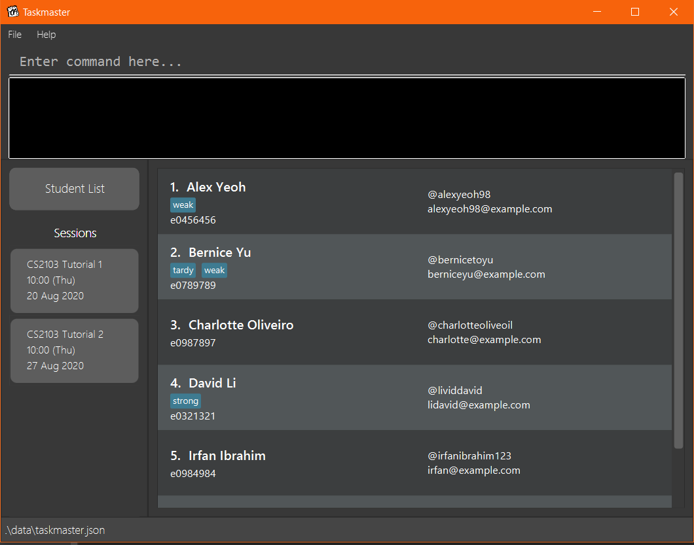

TAskmaster is a **desktop app for managing students, optimised for use via a Command Line Interface** (CLI) while still having the benefits of a Graphical User Interface (GUI). If you are a CS Teaching Assistant who can type fast, TAskmaster can help you track your students' attendance and class participation faster than traditional GUI apps.

## Contents:
- [Quick Start](#quick-start "Go to Quick Start")
    - [Installation](#installation "Go to Installation")
    - [Usage](#usage "Go to Usage")
- [GUI](#gui "Go to GUI")
- [Commands](#commands "Go to Commands")
    - [Adding a student: `add`](#adding-a-student-add "Go to Adding a student")
    - [Listing all students: `list`](#listing-all-students-list "Go to Listing all students")
    - [Deleting a student: `delete`](#deleting-a-student-delete "Go to Deleting a student")
    - [Adding a session: `session`](#adding-a-session-session "Go to Adding a session")
    - [Changing the current session: `goto`](#changing-the-current-session-goto "Go to Changing the current session")
    - [Marking a student's attendance: `mark`](#marking-a-students-attendance-mark "Go to Marking a student's attendance")
    - [Marking all students' attendance: `mark all`](#marking-all-students-attendance-mark-all "Go to Marking all students' attendance")
    - [Scoring a student's participation: `score`](#scoring-a-students-participation-score "Go to Scoring a student's participation mark")
    - [Scoring all students' participation: `score all`](#scoring-all-students-participation-score-all "Go to Scoring all students' participation marks")
    - [Clear all students: `clear`](#clearing-all-entries-clear "Go to Clearing all entries")
    - [Exit the program: `exit`](#exiting-the-program-exit "Go to Exiting the program")
- [Command Summary](#command-summary "Go to Command Summary")
- [Storage](#storage "Go to Storage")
- [FAQ](#frequently-asked-questions-faq "Go to Frequently Asked Questions (FAQ)")

## Quick Start

### Installation
1. Ensure you have Java 11 or later installed.
2. Download the jar file from the project website.
3. Copy the file to the folder you want to use as the home folder for the application.
4. Double-click the file to start the app. A GUI should appear, with the field bar to input commands. The list of commands are available below.

### Usage
1. Add the students that you are currently teaching into TAskmaster using the `add` command.
    * You can use the `list`, `edit` and `delete` commands to read and modify your student list.
2. Create a new session that represents a tutorial, lab or recitation session using the `session` command.
    * This session will read your student list and create a list of corresponding student records belonging to that session
    * Each student in the student list will be represented by a student record
    * This list of records, once created, will be **independent of the student list**. Any modifications to the student list after a session is created **will not** affect the student records in that session. 
3. Mark your students' attendance and award them class participation marks with the `mark` and `score` commands respectively.
    * Note that you will not be allowed to use these commands outside of a session.

## GUI


### Accessing the student lists
Click on the button titled "Students".

### Accessing a session
Click on the button with the name of the Session.

## Commands
> Command format:
> - Words in `UPPER_CASE` are parameters supplied by the user
> - Items in square brackets are optional
> - Items with ellipses (`...`) after them can be used multiple times including zero times
> - Parameters can be in any order

### Adding a student: `add`
Adds a student into the student list.
```
add n/NAME u/TELEGRAM e/EMAIL i/NUSNETID [t/TAG]...
```
- The `NAME` must be non-empty.
- The `TELEGRAM` handle must be a valid handle (comprising only alphanumeric characters and underscores with length between 5 and 32 characters inclusive).
- The `EMAIL` and `NUSNETID` must be in a valid format.

Example usage:
```
add n/John Tan u/johntan98 e/johntan98@gmail.com i/e0012345 t/tardy
```

### Listing all students: `list`
Shows a list of all students in the student list.
```
list
```

### Deleting a student: `delete`
Deletes the specified student from the student list.
```
delete INDEX
```
- Deletes the student at the specified `INDEX` number shown in the displayed student list.
- The `INDEX` **must be a positive integer** that exists in said list.

Example usage:
```
delete 3
```

### Adding a session: `session`
Adds a session into the session list.
```
session s/SESSION_NAME dt/SESSION_DATE_TIME
```
- The `SESSION_DATE_TIME` must be of the format `dd-MM-yyyy HHmm`.

Example usage:
```
session s/CS2103 Tutorial 9 dt/23-10-2020 0900
```

### Changing the current session: `goto`
Changes the current session to the session with the specified name.
```
goto s/SESSION_NAME
```
- The `SESSION_NAME` must belong to one of the existing sessions in the session list.

Example usage:
```
goto s/CS2103 Tutorial 9
```

### Marking a student's attendance: `mark`
Marks the attendance of the specified student from the student list.
```
mark INDEX a/ATTENDANCE_TYPE
```
- Marks the attendance at the specified `INDEX` number shown in the displayed student record list.
- The `INDEX` **must be a positive integer** that exists in said list.
- The `ATTENDANCE_TYPE` must either be `present` or `absent`.

Example Usage:
```
mark 1 a/absent
```

### Marking all students' attendance: `mark all`
Marks the attendance of all students in the student list.
```
mark all a/ATTENDANCE_TYPE
```
- Marks the attendances of all students shown in the displayed student record list.
- The `ATTENDANCE_TYPE` must either be `present` or `absent`.

Example Usage:
```
mark all a/present
```

### Scoring a student's participation: `score`
Scores the participation of the specified student from the student list.
```
score INDEX cp/SCORE
```
- Scores the participation of the student associated with the specified `INDEX` number shown in the displayed student record list.
- The `INDEX` **must be a positive integer** that exists in said list.
- The `SCORE` **must be a positive integer**.

Example Usage:
```
score 1 cp/5
```

### Scoring all students' participation: `score all`
Scores the participation of all students from the student list.
```
score all INDEX cp/SCORE
```
- Scores the participation of all students shown in the displayed student record list.
- The `SCORE` **must be a positive integer**.

Example Usage:
```
score all cp/10
```

### Clearing all entries: `clear`
Clears all data from TAskmaster.
```
clear
```
- This will delete all students and all sessions (including student record data).

### Exiting the program: `exit`
Exits the program.
```
exit
```
- Data is automatically saved.

## Command Summary

| Action            | Format, Examples                                                                                              |
|-------------------|---------------------------------------------------------------------------------------------------------------|
| Add student       | ```add n/NAME u/TELEGRAM e/EMAIL i/NUSNETID [t/TAG]``` <br> e.g., ```add n/John Tan u/johntan98```<br>```e/johntan98@gmail.com i/e0012345 t/tardy```  |
| List students     | ```list```                                                                                               |
| Delete student    | ```delete INDEX``` <br> e.g., ```delete 3```                                                             |
| Add session       | ```session s/SESSION_NAME dt/SESSION_DATE_TIME``` <br> e.g., ```session s/CS2103 Tutorial 9 dt/23-10-2020 0900```|
| Change session    | ```goto s/SESSION_NAME``` <br> e.g., ```goto s/CS2103 Tutorial 9```
| Mark              | ```mark INDEX a/ATTENDANCE_TYPE``` <br> e.g., `mark 1 a/absent`                                             |
| Mark all          | ```mark all a/ATTENDANCE_TYPE``` <br> e.g., `mark all a/present`
| Score             | ```score INDEX cp/SCORE``` <br> e.g., `score 1 cp/5`                                             |
| Score all         | ```score all cp/SCORE``` <br> e.g., `score all cp/10`
| Clear             | ```clear```                                                                                              |
| Exit              | ```exit```                                                                                              |

## Storage
The TAskmaster stores the running list of students and sessions automatically to JSON files when they are updated.

**Student data** is stored in `data/taskmaster.json`
**Session data** is stored in `data/session_list.json`

Avoid modifying the files as this may cause the program to read the input as invalid on startup and load with an
empty student list without any sessions.

## Frequently Asked Questions (FAQ)
How to download java? [Here](https://lmgtfy.com/?q=how+to+download+java)
