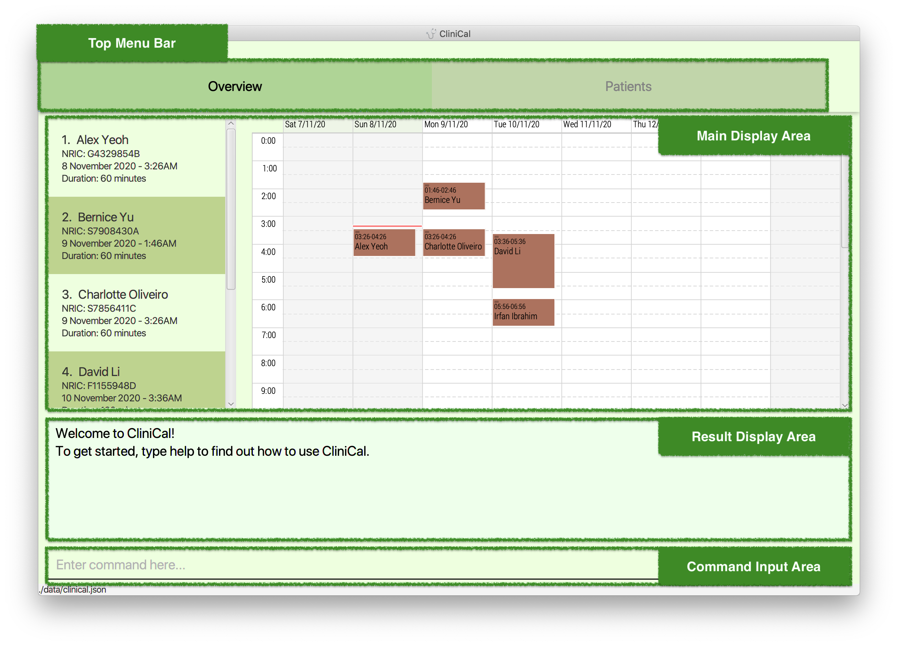
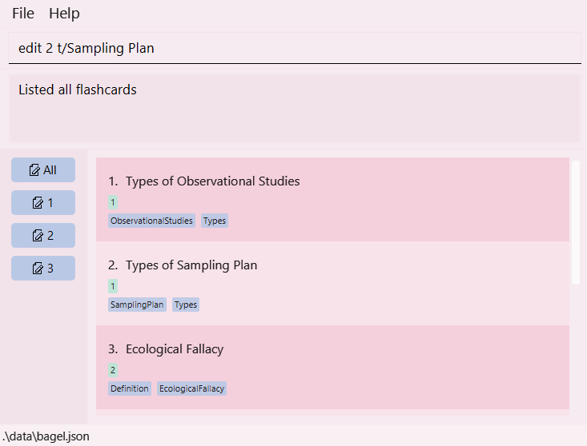

* Table of Contents
{:toc}
--------------------------------------------------------------------------------------------------------------------

## 1. Introduction

CliniCal (Clinic Calendar) is a **desktop app that allows doctors to manage patient records and schedule upcoming appointments**. With CliniCal, you can enhance your daily workflow through the effective scheduling of medical appointments. You can also have access to a digital database that safely stores all your patient records. 

Furthermore, CliniCal is optimized for use via a Command Line Interface (CLI) and even retains the benefits of a Graphical User Interface (GUI). If you can type fast, CliniCal can get your work done faster than traditional GUI apps.

Interested to know more? Take a look at our [**Getting started**](#3-getting-started) guide. Enjoy!

## 2. About this document

Welcome to the CliniCal User Guide!

If you are new to CliniCal, this user guide will get you up and running in no time! It equips you with the basic knowledge you need to use CliniCal properly.

### 2.1 Formatting

The CliniCal User Guide contains different formatting used throughout the document which is used to convey different meanings. 
This table below illustrates what each formatting means.

| Formatting    | What                            | Meaning   | Example                     |
| ----------    |-------------------------------------|-----------|--------------------------|
| `add`      | Words in light-blue highlight, also known as a mark-up| A command that can be typed into CliniCal|`help`|
| `p/PHONE_NUMBER` | Words in UPPER_CASE | A parameter to be supplied by the user |`p/91234567`|
| `n/NAME [s/SEX]` | Words in square brackets| Optional parameter |`n/John Doe` or   `n/John Doe s/M` |
| `[g/ALLERGY]…` | Words with `…` after them| Parameters that can be input multiple times including 0 times|`g/sulfa g/zyrtec` or `g/levocetirizine `|
| [**Blue underline**](#2-about-this-document)| Bold blue words that show underline on mouse-over| A clickable hyperlink, to either an external webpage or other parts of this User Guide|[**1. Introduction**](#1-introduction)|

* These sections give examples of how you can use the features of CliniCal.

:book: Example: 
You want to list all the patient data that was entered into CliniCal.

**Step 1**: Input `list` into the command box and press <kbd>Enter</kbd>.

**Step 2**: On the **Patients** tab, you can find all the patient data that have been entered into CliniCal.

* These sections give information crucial to the use of CliniCal.

**:information_source: Notes about the command format:** 
* Parameters can be in any order. 
  e.g. if the command specifies `n/NAME p/PHONE_NUMBER`, `p/PHONE_NUMBER n/NAME` is also acceptable.

* These sections give non-essential information that will help you maximise your productivity with CliniCal.

:bulb: Tip: 

* You can resize the window as you like, so that you can use CliniCal with another application side by side on your monitor.

## 3. Getting started

You can follow the steps below to get CliniCal up and running:

1. Ensure you have Java `11` or above installed on your Computer. If you have not installed Java on your computer, download the installer from [Oracle](https://www.oracle.com/java/technologies/javase-jdk11-downloads.html).

1. [Download](https://github.com/AY2021S1-CS2103T-W11-4/tp/releases) the latest version of CliniCal.

1. Copy the file to the folder you want to use as the _home folder_ for CliniCal.

1. Double-click the file, `CliniCal.jar` to start the app. The GUI similar to the below should appear in a few seconds.  
   

       
        
       <em style="color:#CC5500">Figure 1. GUI of CliniCal</em>
   

1. If the GUI does not appear, you may try opening a command terminal in the home folder and enter `java -jar CliniCal.jar`.

1. Type the command in the command box and press <kbd>Enter</kbd> to execute it. e.g. typing `help` and pressing <kbd>Enter</kbd> will open the help window. 
   Some example commands you can try:

   * `list`: Lists all your patients.

   * `add n/John Doe p/98765432 ic/S2561932A a/Pickle street, Block 123, #01-01 e/johnd@example.com` : Adds a patient named `John Doe` to the patient list.

   * `delete 3` : Deletes the 3rd patient shown in the patient list.

   * `clear`: Deletes all your patients.

   * `exit`: Exits the app.

1. Refer to the [**Features**](#5-features) below for details of each command or refer to the [**Command Summary**](#7-command-summary) to quickly refer to all available commands.

1. Finally, if you wish to return the sample data back into its original state, you can delete the `data` folder that was generated in the same folder as `CliniCal.jar`.

--------------------------------------------------------------------------------------------------------------------

## 4. User Interface

CliniCal contains a Graphical User Interface (GUI) which serves to allow you to easily view upcoming appointments and also patient records.

    
     
    <em style="color:#CC5500">Figure 2. Main GUI Layout</em>

The layout of the GUI is as follows:
* Top Menu Bar
* Main Display Area
* Result Display Area
* Command Input Area

On the first startup, CliniCal will be loaded with sample data to give you a feel of the features in CliniCal.

If you wish to start afresh, enter the `clear` command to clear all entries from the appointment and patient list.

### 4.1 Overview Tab

    
     
    <em style="color:#CC5500">Figure 3. Overview Tab Layout</em>

This would be the main screen of CliniCal, where the appointment list would be on the left, and the calendar view on the right.

* The index used to access each appointment is shown next to the patient's name.

* On the left, you would be able to view all upcoming appointments and each appointment contains the following details:
    * Patient Name
    * Patient NRIC
    * Date and Time of Appointment
    * Duration of Appointment

* On the right, you would be able to view the upcoming appointments in a weekly calendar view. The view is set to show you appointments ranging from yesterday to 6 days from now.

* Refer to the section on [**Patient Appointment Commands**](#54-patient-appointment-commands) for more details on how to add an appointment!

:bulb: Tip: 
 
* If the patient name in the appointment list is too long and becomes cutoff, simply resize the window to make it wider!

### 4.2 Patients Tab

    
     
    <em style="color:#CC5500">Figure 4. Patient Tab Layout</em>

This tab shows you the patient list and the details of each patient, together with the most recent visit date.

* The index used to access each patient is shown next to the patient's name.

* Each patient contains the following details:
    * Name
    * Allergies (if applicable)
    * Phone Number
    * NRIC
    * Address
    * Email
    * Sex
    * Blood Type
    * Most Recent Visit Date (if applicable)

* The sample data in the figure above indicates that Bernice Yu has the red color tag, meaning that Bernice Yu has high priority and requires close monitoring and follow-up actions. You are free to assign any color to any patient.

* Refer to the section on [**Patient Commands**](#52-patient-commands) for more details on how to add a patient!

### 4.3 Profile Window

    
     
    <em style="color:#CC5500">Figure 5. Profile Window Layout</em>

This window shows you the individual patient profile picture and personal details in an easy to read manner.

* If applicable, the profile contains details of each visit stored in visitation logs sorted by descending date order in DD/MM/YYYY format (i.e. The most recent visit will appear at the top). 

* The index used to access each visitation log is also shown after the words 'Visitation Log'.

* Each visitation log contains the following details:
    * Diagnosis
    * Prescription
    * Comments

* Refer to the section on [**Patient Visitation Commands**](#53-patient-visitation-commands) for more details on how to add a visit!

--------------------------------------------------------------------------------------------------------------------

## 5. Features

This section highlights all the commands that CliniCal supports. These include details about the format of the command and example scenarios of each command.

### 5.1 General Commands

General commands help enhance your general user experience while using CliniCal.

#### 5.1.1 Viewing help: `help`

Access help page by referring to the link provided in the message pop-up.

Format: `help`

    
     
    <em style="color:#CC5500">Figure 6. Example of Help Message</em>

  :bulb: **Tip:** You can press the <kbd>Esc</kbd> key to close the help popup!
  

#### 5.1.2 Retrieving past commands: `history`

View a list of past commands that you had used during the session.

Format: `history`

    
     
    <em style="color:#CC5500">Figure 7. Example of History Command</em>

#### 5.1.3 Clearing command history: `clearhistory`

Clear the command history.

Format: `clearhistory`

    
     
    <em style="color:#CC5500">Figure 8. Example of Clear History Command</em>

**:information_source: Note:** 

 * Your history is erased when you close and reopen the app. Do not close the app if you have anything in the history that needs to be undone!
 * Use with caution, `clearhistory` cannot be undone using `undo`!

#### 5.1.4 Undoing the previous command: `undo`

Revert your previous command which modified the patient list.

Format: `undo`

* Only applies for commands that modify the patient list such as `add`, `edit`, `delete`, `clear`,
`addvisit`, `editvisit`, `deletevisit`, `addappt`, `editappt` and `deleteappt`.
* Does not support `addpicture`, so remember to be careful when modifying a patient's profile picture!
* Does not apply for undoable commands such as `find`, `list` and `clearhistory`.

    
     
    <em style="color:#CC5500">Figure 9. Example of Undo Command</em>

:book: Example: 
You want to restore Alex Yeoh's patient details right after accidentally using the `edit` command.

**Step 1**: Input `undo` into the command box and press <kbd>Enter</kbd>.

**Step 2**: On the Patient tab, you can check that Alex Yeoh's patient details are restored to the original state before the `edit` command.

#### 5.1.5 Redoing a command: `redo`

Redo the most recent command that you have undone.

Format: `redo`

* Only able to `redo` commands that have been previously undone such as `add`, `edit`, `delete`, `clear`,
`addvisit`, `editvisit`, `deletevisit`, `addappt`, `editappt` and `deleteappt`.

    
     
    <em style="color:#CC5500">Figure 10. Example of Redo Command</em>

:book: Example: 
You want to restore Alex Yeoh's patient details right after accidentally using `undo` command on the `edit` command.

**Step 1**: Input `redo` into the command box and press <kbd>Enter</kbd>.

**Step 2**: On the Patient tab, you can check that Alex Yeoh's patient details are restored to the original state before the `undo` command.

#### 5.1.6 Exiting the program: `exit`

Exit the program.

Format: `exit`

### 5.2 Patient Commands

Patient commands help you make changes to the patient list.

#### 5.2.1 Adding a patient: `add`

Add a new patient to the patient list.

Format: `add n/NAME p/PHONE_NUMBER ic/NRIC [a/ADDRESS] [e/EMAIL] [s/SEX] [b/BLOOD_TYPE] [ct/COLOR_TAG] [g/ALLERGY]…`

* `NAME` refers to the name of the patient and should only contain alphanumeric characters.
* `PHONE_NUMBER` refers to the phone number of the patient and can be any 8 digit number combinations.
* `NRIC` refers to the unique alphanumeric serial number on the National Registration Identity Card. Only Singaporean NRIC format is accepted.
* `ADDRESS` refers to the address of the patient.
* `EMAIL` refers to the email of the patient. To account for corporate email networks, a wide range of email addresses is accepted, such as `user@desk102`. If you are entering normal email addresses, check that you have not missed out on any parts of the email.
* `SEX` refers to the sex of the patient and can only be either M(male) or F(female).
* `BLOOD_TYPE` refers to the blood type of the patient and can only be any of the following, A, B, O, AB, followed by either + or -.
* `ALLERGY` refers to the allergy of the patient. A patient can have any number of allergies (including 0).
* `COLOR_TAG` refers to the color tag that can be used to classify patients. Color tag can be any standard HTML color name, such as red, green or orange. When a patient is tagged with a color tag, a portion of the patient's panel will be styled to show that color.

    
     
    <em style="color:#CC5500">Figure 11. Example of Add Patient Command</em>

:book: Example: 
You want to add a new patient with specific personal details.

**Step 1**: Input `add n/Betsy Yu ic/G7667353B e/betsyyu@example.com a/Newgate Prison p/1234567 g/penicillin s/F` into the command box and press <kbd>Enter</kbd>.

**Step 2**: On the Patient tab, you can find your newly added patient at the bottom of the patient list.

**:information_source: Note:** 

* `N/A` is accepted as a special placeholder for all optional fields.
* Color tags can be used for a variety of purposes. For example, you may color code patients at risk of terminal diseases as red, for easier reference. Check out <a href="https://www.w3schools.com/colors/colors_names.asp">this link</a> for an extensive list of possible color tags.

#### 5.2.2 Adding profile picture: `addpicture`

Add a profile picture to the patient’s profile by specifying the image's filepath.
If the person already has an existing profile picture, you can use this command to update the profile picture with a new picture.

    
     
    <em style="color:#CC5500">Figure 12. Example of Add Profile Picture Command</em>

Format: `addpicture INDEX f/FILE_PATH`

* All patient profiles are preloaded with a stock profile picture.
* `addpicture` cannot be undone using `undo`. You can repeat the `addpicture` command to update the patient's profile with your desired profile picture.

:book: Example: 
You want to add a profile picture to the 1st patient on the list.

**Step 1**: Input `addpicture 1 f/data/profile_1.jpg` into the command box and press <kbd>Enter</kbd>.

**Step 2**: On the Patient tab, you can find your newly added profile picture displayed on the patient's profile.

:bulb: Tip: 
 
* You can also add a profile picture using drag and drop with your mouse!
1. Select your desired profile picture and drag it onto the space reserved for patient profile picture in CliniCal.
1. Release the mouse button and your patient's profile picture would be updated with the desired picture.

#### 5.2.3 Editing a patient: `edit`

Edit an existing patient in the patient list.

Format: `edit INDEX [n/NAME] [p/PHONE_NUMBER] [ic/NRIC] [a/ADDRESS] [e/EMAIL] [s/SEX] [b/BLOOD_TYPE] [ct/COLOR_TAG] [g/ALLERGY]…`

* Edits the patient at the specified `INDEX`. 
* `INDEX` refers to the index number shown in the displayed patient list. 
  * The index **must be a positive number**, eg. 1, 2, 3, …
* `NAME` refers to the name of the patient and should only contain alphanumeric characters.
* `PHONE_NUMBER` refers to the phone number of the patient and can be any 8 digit number combinations.
* `NRIC` refers to the unique alphanumeric serial number on the National Registration Identity Card. Only Singaporean NRIC format is accepted.
* `ADDRESS` refers to the address of the patient. 
* `EMAIL` refers to the email of the patient. To account for corporate email networks, a wide range of email addresses is accepted, such as `user@desk102`. If you are entering normal email addresses, check that you have not missed out on any parts of the email.
* `SEX` refers to the sex of the patient and can only be either M(male) or F(female).
* `BLOOD_TYPE` refers to the blood type of the patient and can only be any of the following, A, B, O, AB, followed by either + or -.
* `ALLERGY` refers to the allergy of the patient. A patient can have any number of allergies (including 0).
* `COLOR_TAG` refers to the color tag that can be used to classify patients. Color tag can be any standard HTML color name, such as red, green or orange. When a patient is tagged with a color tag, a portion of the patient's panel will be styled to show that color.
* At least one of the optional fields must be provided.
* Existing values will be updated to the input values.

    
     
    <em style="color:#CC5500">Figure 13. Example of Edit Patient Command</em>

:book: Example: 
You want to edit the details of the 1st patient.

**Step 1**: Input `edit 1 p/35154520 g/aspirin ct/green g/recombinant interferons` into the command box and press <kbd>Enter</kbd>.

**Step 2**: On the Patient tab, you can find your newly edited patient inside the patient list.

    
     
    <em style="color:#CC5500">Figure 14. Example of Removing Allergy and Color Tag with Edit Patient Command</em>

**:information_source: Note:** 

* If you have edited **patient name** or **patient NRIC**, please make sure to update the changes to any relevant appointments, using the `editappt` command.
* `N/A` is accepted as a special placeholder for all optional fields.
* When you edit allergies (or color tag), the existing allergies (or color tag) of the patient will be removed i.e adding of allergies (or color tag) is not cumulative.
* You can remove all the patient’s allergies by typing `g/` without specifying any allergies after it. The same applies for color tags of a patient where you can remove the color tag by typing `ct/` without specifying any color tag.
* Color tags can be used for a variety of purposes. For example, you may color code patients at risk of terminal diseases as red, for easier reference. Check out <a href="https://www.w3schools.com/colors/colors_names.asp">this link</a> for an extensive list of possible color tags.

#### 5.2.4 Deleting a patient: `delete`

Delete a specified patient from the patient list.

Format: `delete INDEX`

* Deletes the patient at the specified `INDEX`. `INDEX` refers to the index number shown in the displayed patient list. 
  * The index **must be a positive number**, eg. 1, 2, 3, …

    
     
    <em style="color:#CC5500">Figure 15.1 Example of Delete Patient Command (Before)</em>
    
     
    <em style="color:#CC5500">Figure 15.2 Example of Delete Patient Command (After)</em>

:book: Example: 
You want to delete the 6th patient.

**Step 1**: Input `delete 6` into the command box and press <kbd>Enter</kbd>.

**Step 2**: On the Patient tab, you can check that the specified patient is no longer inside the patient list.

**:information_source: Note:** 

* Please make sure to delete **any appointments related to the deleted patient**, using the `deleteappt` command.

#### 5.2.5 Deleting all patients: `clear`

Clear all patient entries from the patient list.

Format: `clear`

    
     
    <em style="color:#CC5500">Figure 16. Example of Clear Command</em>

:book: Example: 
You want to delete all the patients.

**Step 1**: Input `clear` into the command box and press <kbd>Enter</kbd>.

**Step 2**: On the Patient tab, you can check that there is no patient inside the patient list.

**:information_source: Note:** 

* Please make sure to delete **any appointments related to the deleted patient**, using the `deleteappt` command.

:bulb: Tip: 

* Reverse the `clear` command using the `undo` command!

#### 5.2.6 Finding patients: `find`

Find patients whose names or NRIC contain any of the given keywords.

Format: `find KEYWORDS`

* You can search for the patient's name or NRIC.
* The search is case-insensitive. 
    * `benson` will match `Benson`
* The search keyword entered can consist of just one word or even multiple keywords. 
    * `Benson` or `Benson Meier`
* Patient will be matched even if the keyword matches the search parameters only partially. Keywords have to be matched consecutively.
    * `Ben` will match `Benson`, `7435696` will match `S7435696B`.
* The order of the keywords does not matter. 
    * `Meier Benson` will match `Benson Meier`
* Patients matching at least one keyword will be returned (i.e. OR search).
    * `Benson Meier` will return `Benson Yu`, `Andrew Meier`

    
     
    <em style="color:#CC5500">Figure 17. Example of Find Command</em>

:book: Example: 
You want to find all the patients with `yu` in their names.

**Step 1**: Input `find yu` into the command box and press <kbd>Enter</kbd>.

**Step 2**: On the Patient tab, you can check that the patient list only shows the patients with `yu` in their names.

#### 5.2.7 Listing all patients: `list`

View a list of all your patients in the patient list.

Format: `list`

    
     
    <em style="color:#CC5500">Figure 18. Example of List Command</em>

:bulb: Tip: 

* If you are on the Overview tab, the list may not be updated! When using `list`, please switch over to the Patients tab to see the list of your patients.

#### 5.2.8 Viewing patient profile: `profile`

Display the patient's profile in a separate window.

Format: `profile INDEX`

* Displays the patient's profile that is specified by `INDEX`.
* `INDEX` refers to the index number shown in the displayed patient list.
  * The index **must be a positive number**, eg. 1, 2, 3, …

    
     
    <em style="color:#CC5500">Figure 19. Example of Profile Window</em>

:book: Example: 
You want to display the profile of the 1st patient on the list.

**Step 1**: Input `profile 1` into the command box and press <kbd>Enter</kbd> on your keyboard.

**Step 2**: A window displaying the patient's profile will appear. All relevant patient records and visitation logs will be shown.

**Step 3**: To close the patient profile window, you can click on the 'Close' button on the top-right section of the window. Alternatively, you can press the <kbd>ESC</kbd> key on your keyboard.

### 5.3 Patient Visitation Commands

Visitation commands help you make changes to the visitation logs specific to a patient. 

These visitation logs store the following as a short summary of a patient's visit:
* Diagnosis
* Prescription
* Comments

#### 5.3.1 Adding a new visitation log for patient: `addvisit`

Displays a new window to add a new visitation log for the specified patient.

Format: `addvisit INDEX [vd/VISIT_DATE]`

* `INDEX` refers to the patient's index number as shown in the displayed patient list.
* `VISIT_DATE` refers to the date of visitation.
    * `VISIT_DATE` is optional. If no visit date is being specified in the command, then the current date on the local machine will be used to record the patient's visit.
    * It follows the format of `dd/MM/yyyy`, for example `23/10/2020`.
    * Do note that for numerical inputs `1-9`, you will need to include an additional `0` in front. For example, enter `05` instead of `5`.
    * Only dates before and *up till and including today* are accepted.

    
     
    <em style="color:#CC5500">Figure 20. Example of Add Visit Command</em>

:book: Example:  
You want to add a visitation log with date 23/10/2020 to the 1st patient on the list.

**Step 1**: Input `addvisit 1 vd/23/10/2020` into the command box and press <kbd>Enter</kbd>.

**Step 2**: A window displaying the three parameters - Diagnosis, Prescription and Comments will be shown. Type in relevant
            details in each text box.

**Step 3**: Click on the 'Save' button or press <kbd>CTRL</kbd> + <kbd>S</kbd> on your keyboard to save the visitation log.

**Step 4**: The window will close, and a message will be displayed to indicate that the visitation log has been successfully saved.

:bulb: Tip: 

* You may press <kbd>CTRL</kbd> + <kbd>TAB</kbd> on your keyboard to move to the next text box.
* You may press <kbd>SHIFT</kbd> + <kbd>TAB</kbd> on your keyboard to move to the previous text box.
* After entering relevant details for the Comments text box, your mouse cursor will automatically move to the Save button 
  if you press <kbd>CTRL</kbd> + <kbd>TAB</kbd>. At this point, you can simply press <kbd>ENTER</kbd> to save the visitation log.
* Otherwise, you can also press <kbd>Esc</kbd> or the close window button to close the window without saving.

#### 5.3.2 Editing patient's visitation log: `editvisit`

Displays a new window to edit the visitation log for a specified patient.

Format: `editvisit INDEX i/VISIT_INDEX [vd/VISIT_DATE]`

* `INDEX` refers to the patient's index number as shown in the displayed patient list.
* `VISIT_INDEX` refers to the visitation's index number as shown in the patient's profile.
* Both indexes **must be a positive number** 1, 2, 3, …​
* `VISIT_DATE` refers to the new date of visitation that you wish to amend to.
    * `VISIT_DATE` is optional. If no visit date is being specified in the command, then the date of the visitation will remain the same.
    * It follows the format of `dd/MM/yyyy`, for example `23/10/2020`.
    * Do note that for numerical inputs `1-9`, you will need to include an additional `0` in front. For example, enter `05` instead of `5`.
    * Only dates before and *up till and including today* are accepted.

    
     
    <em style="color:#CC5500">Figure 21. Example of Edit Visit Command</em>

:book: Example:  
You want to edit the 1st visitation log belonging to the 2nd patient on the list.

**Step 1**: Input `editvisit 2 i/1` into the command box and press <kbd>Enter</kbd>.

**Step 2**: A window displaying the three parameters - Diagnosis, Prescription and Comments will be shown. Type in updated
            details in each text box.

**Step 3**: Click on the 'Save' button or press <kbd>CTRL</kbd> + <kbd>S</kbd> on your keyboard to save the visitation log.

**Step 4**: The window will close, and a message will be displayed to indicate that the visitation log has been successfully updated.

**:information_source: Note:** 

* If you do not wish to change the date, it is not required to enter the same date again, even though CliniCal will still accept it.
* The date "01/01/1900" is reserved for internal usage, please do not use this date!

:bulb: Tip: 

* You can use `editvisit` followed by the patient index to check if the patient has any existing visitation logs.
    * A message pop-up will appear if the patient has no existing visitation logs.
    * If the patient has existing visitation logs, then you will see an error informing you to input the visitation index.
* You may press <kbd>CTRL</kbd> + <kbd>TAB</kbd> on your keyboard to move to the next text box.
* You may press <kbd>SHIFT</kbd> + <kbd>TAB</kbd> on your keyboard to move to the previous text box.
* After entering relevant details for the Comments text box, your mouse cursor will automatically move to the Save button 
  if you press <kbd>CTRL</kbd> + <kbd>TAB</kbd>. At this point, you can simply press <kbd>ENTER</kbd> to save the visitation log.
* Otherwise, you can also press <kbd>Esc</kbd> or the close window button to close the window without saving.

#### 5.3.3 Deleting patient's visitation log: `deletevisit`

Delete the patient's visitation log.

Format: `deletevisit INDEX i/VISIT_INDEX`

* `INDEX` refers to the patient's index number as shown in the displayed patient list.
* `VISIT_INDEX` refers to the visitation's index number as shown in the patient's profile.
* Both indexes **must be a positive number** 1, 2, 3, …​

    
     
    <em style="color:#CC5500">Figure 22. Example of Delete Visit Command</em>

:book: Example:  
You want to delete the 2nd visitation log belonging to the 1st patient on the list.

**Step 1**: Input `deletevisit 1 i/2` into the command box and press <kbd>Enter</kbd>.

**Step 2**: A message will be displayed to indicate that the patient's 2nd visitation log has been successfully deleted.

:bulb: Tip: 

* You can use `deletevisit` followed by the patient index to check if the patient has any existing visitation logs.
    * A message pop-up will appear if the patient has no existing visitation logs.
    * If the patient has existing visitation logs, then you will see an error informing you to input the visitation index.

### 5.4 Patient Appointment Commands

Patient Appointment commands help you manage your upcoming patient appointments.

#### 5.4.1 Adding an appointment: `addappt`

Add a new appointment for the specified patient to the appointment list.

Format: `addappt INDEX st/APPOINTMENT_START_TIME d/DURATION`

* `INDEX` refers to the patient's index number as shown in the displayed patient list in the **Patients** tab.
  * The index **must be a positive number**, eg. 1, 2, 3, …
* `APPOINTMENT_START_TIME` refers to the date and starting time of the appointment.
  * It follows the format of `dd/MM/yyyy HH:mm`, for example `31/12/2020 23:59`.
  * Note that you will need to input the hour (`HH`) in  the 24-hour format.
* `DURATION` refers to the duration of the appointment, in minutes.

    
     
    <em style="color:#CC5500">Figure 23. Example of Add Appointment Command</em>

:book: Example:  
You want to add an appointment with the 1st patient on the list.

**Step 1**: Input `addappt 6 st/11/12/2020 15:00 d/120` into the command box and press <kbd>Enter</kbd>.

**Step 2**: On the **Overview** tab, you can find your newly added appointment saved inside the appointment list.

**Step 3**: If your newly added appointment is happening within a week from today, you can see the appointment being reflected in the calendar on the right of the appointment list.

:bulb: Tip: 

* You can retrieve your desired patient `INDEX` from the **Patients** tab.
* Note that only appointments with future dates (including today) will be accepted, since patient appointments are scheduled in advance.
* If you are having trouble converting your time to 24 hour format, check out a time format converter at <a href="https://www.timecalculator.net/12-hour-to-24-hour-converter">this link</a>.
* You are highly recommended to use a duration of at least 60 minutes to optimise your experience with our CliniCal calendar feature.

#### 5.4.2 Editing an appointment: `editappt`

Edit the specified appointment in the appointment list.

Format: `editappt INDEX [pn/PATIENT_NAME] [pi/PATIENT_IC] [st/APPOINTMENT_START_TIME] [d/DURATION]`

* Edits the appointment at the specified `INDEX`.
* `INDEX` refers to the appointment's index number as shown in the displayed appointment list in the **Overview** tab. 
    * The index **must be a positive number**, eg. 1, 2, 3, …
* `PATIENT_NAME` refers to the name of the patient involved in the appointment as shown in the displayed calendar in the **Overview** tab.
* `PATIENT_IC` refers to the NRIC of the patient involved in the appointment as shown in the displayed calendar in the **Overview** tab. 
* `APPOINTMENT_START_TIME` refers to the date and starting time of the appointment. 
    * It follows the format of `dd/MM/yyyy HH:mm`, for example `31/12/2020 23:59`.
    * Note that you will need to input the hour (`HH`) in  the 24-hour format. 
* `DURATION` refers to the duration of the appointment, in minutes.

* At least one of the optional fields must be provided.
* Existing values will be updated to the input values.

    
     
    <em style="color:#CC5500">Figure 24. Example of Edit Appointment Command</em>

:book: Example: 
You want to reschedule the 1st appointment in the appointment list.

**Step 1**: Input `editappt 6 st/12/12/2020 18:00 d/240` into the command box and press <kbd>Enter</kbd>.

**Step 2**: On the **Overview** tab, you can find the newly updated appointment inside the appointment list. 

**Step 3**: If the newly updated appointment is due within a week from today, you can also see the appointment details inside the calendar.

**:information_source: Note:** 

* Only Singaporean NRIC format (@xxxxxxx#) is accepted for NRIC field.
* If you have edited **patient name** or **patient NRIC**, please make sure to update the changes to any relevant patients, using the `edit` command.

:bulb: Tip: 

* You can retrieve your desired appointment `INDEX` from the **Overview** tab.
* If you are having trouble converting your time to 24 hour format, check out the time format converter at <a href="https://www.timecalculator.net/12-hour-to-24-hour-converter">this link</a>.
* You are highly recommended to use a duration of at least 60 minutes to optimise your experience with our CliniCal calendar feature.

#### 5.4.3 Deleting an appointment: `deleteappt`

Delete the specified appointment from the appointment list.

Format: `deleteappt INDEX`

* `INDEX` refers to the appointment's index number as shown in the displayed appointment list in the **Overview** tab.
    * The index **must be a positive number**, eg. 1, 2, 3, …

    
     
    <em style="color:#CC5500">Figure 25. Example of Delete Appointment Command</em>

:book: Example: 
You want to delete your next upcoming appointment as your patient could not make it for the appointment.

**Step 1**: Input `deleteappt 1` and press <kbd>Enter</kbd>.

**Step 2**: The 1st appointment displayed will be removed from the appointment list immediately. You can also see that the appointment is no longer being displayed on the calendar.

:bulb: Tip: 

* You can retrieve your desired appointment `INDEX` from the **Overview** tab.

### 5.5 Retrieving past commands using arrow keys

Retrieve and reuse past commands using the <kbd>↑</kbd> arrow and <kbd>↓</kbd> arrow keys on the keyboard.
1. Click on the text field of the command box.
2. Press the <kbd>↑</kbd> arrow key to display the most recent past command.
3. Press the <kbd>↓</kbd> and <kbd>↑</kbd> arrow keys to navigate through the list of past commands.
4. Press <kbd>Enter</kbd>/<kbd>Return</kbd> key to reuse the command.

:bulb: Tip: 

* This command is useful when inputting repeated commands, since you do not need to type them again.

### 5.6 Saving the data

CliniCal data is saved in your hard disk automatically after any command that changes the data. There is no need to save manually.

--------------------------------------------------------------------------------------------------------------------

## 6. FAQ

**Q**: What are the minimum system requirements for this application? 
**A**: If your computer runs any of the Operating Systems found in [this link](https://www.oracle.com/java/technologies/javase/products-doc-jdk11certconfig.html), you will be able to run CliniCal. 

**Q**: How do I transfer my data to another Computer? 
**A**: Install CliniCal in the other computer and overwrite the empty data file it creates with the file that contains the data of your previous CliniCal home folder.

**Q**: I want to revert back to the sample data that was present when I first opened the application. How can I do this? 
**A**: Remove the `data` folder that is in the same directory as `CliniCal.jar`. The sample data should be reloaded on the next start of the application.

**Q**: The application doesn't start when the jar file is double-clicked. What can I do? 
**A**: It is possible that java was not installed onto your system properly, or the installation of Java is corrupted. Try reinstalling java or running solutions such as [JarFix](https://johann.loefflmann.net/en/software/jarfix/index.html) to solve this problem.

**Q**: Some of the longer text in the application is truncated at the end. How do I see the full text stored in the application? 
**A**: The main window of CliniCal is resizable and you can expand the window if you want the window to contain more information. Click and drag on the edge of the window to adjust its size.

**Q**: Is the source code of this application freely available? 
**A**: Yes, our code is available on our [GitHub repository](https://github.com/AY2021S1-CS2103T-W11-4/tp) under the MIT License. If you wish to contribute to the codebase of this application, please read the [Developer Guide](https://ay2021s1-cs2103t-w11-4.github.io/tp/DeveloperGuide.html) and make a pull request to our repository.

**Q**: Is my data secure with this application? 
**A**: Your data is stored safely on your machine. CliniCal stores the data locally and does not upload any data to servers on the Internet. However, you are recommended to use antivirus software on your machine to prevent unauthorised hackers from accessing the local database.

**Q**: I am a developer and I wish to port over data from other applications. Does your application allow third-party apps to modify the database directly? 
**A**: Yes! Our data is stored in the file `clinical.json` in the `data` folder you run CliniCal in. You may modify this file to modify the database directly. Keep in mind that if the data is stored in a format that doesn't match the formatting described in [Section 5.2.1](#521-adding-a-patient-add), the application will start with an empty set of data.

**Q**: I've spotted a bug in your application. How can I report this? 
**A**: We would love to hear from you. You can either email us at `seer [at] comp.nus.edu.sg` or make a GitHub issue at this [link](https://github.com/AY2021S1-CS2103T-W11-4/tp/issues) with the relevant details.

**Q**: Is there a way to export the calendar data into another application, say Google Calendar? 
**A**: We are currently working on this feature and it is planned for `v2.0`, scheduled to be released in January 2021.

--------------------------------------------------------------------------------------------------------------------

## 7. Command summary

Action | Format, Examples
--------|------------------
**Add** | `add n/NAME p/PHONE_NUMBER ic/NRIC [a/ADDRESS] [e/EMAIL] [s/SEX] [b/BLOOD_TYPE] [ct/COLOR_TAG] [g/ALLERGY]…​`   e.g. `add n/James Ho p/22224444 ic/S2686887R e/jamesho@example.com a/123, Clementi Rd, 1234665 s/M b/B+ g/sulfa g/aspirin`
**Add profile picture** | `addpicture 1 f/data/stock_picture.png`
**Add Visit** | `addvisit INDEX [vd/VISIT_DATE]`   e.g. `addvisit 1 vd/01/01/2020`
**Add Appointment** | `addappt INDEX st/APPOINTMENT_START_TIME d/DURATION`   e.g., `addappt 1 st/27/12/2020 14:00 d/60`
**Clear** | `clear`
**Clear command history** | `clearhistory`
**Delete** | `delete INDEX`  e.g. `delete 3`
**Delete Visit** | `deletevisit INDEX i/VISIT_INDEX`   e.g. `deletevisit 1 i/2`
**Delete Appointment** | `deleteappt INDEX`   e.g. `delete 3`
**Edit** | `edit INDEX [n/NAME] [p/PHONE_NUMBER] [ic/NRIC] [a/ADDRESS] [e/EMAIL] [s/SEX] [b/BLOOD_TYPE] [ct/COLOR_TAG] [g/ALLERGY]…`  e.g.`edit 2 n/James Lee e/jameslee@example.com `
**Edit Appointment** | `editappt INDEX [pn/PATIENT_NAME] [pi/PATIENT_IC] [st/APPOINTMENT_START_TIME] [d/DURATION]`   e.g. `editappt 3 st/12/12/2020 10:10 d/40`
**Edit Visit** | `editvisit INDEX i/VISIT_INDEX [vd/VISIT_DATE]`   e.g. `editvisit 1 i/2 vd/01/01/2020`
**Find** | `find KEYWORDS`  e.g. `find James Jake`
**List** | `list`
**Help** | `help`
**Undo** | `undo`
**Redo** | `redo`
**Retrieve past commands** | `history`
**View patient profile** | `profile INDEX`  e.g. `profile 2`
**Exit** | `exit`
