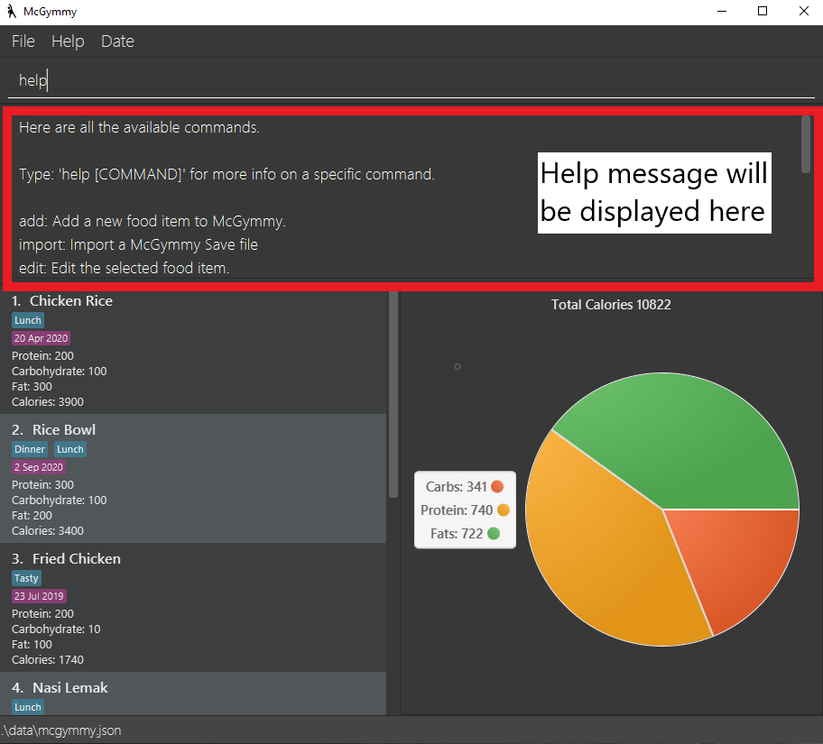
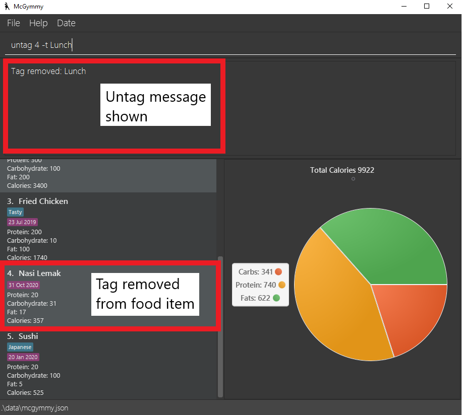
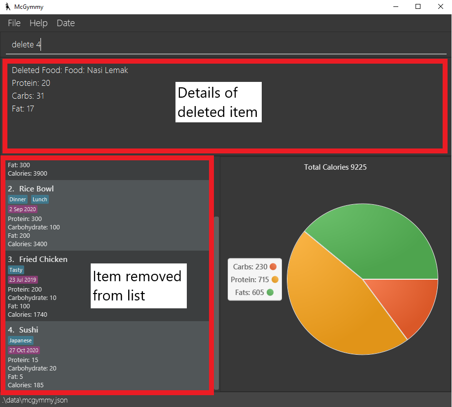

McGymmy (MG) is a **desktop app for managing diet and exercise, optimized for use via a Command Line Interface** (CLI) while still having the benefits of a Graphical User Interface (GUI). If you can type fast, McGymmy can log your diet and exercise tasks, goals and progress done faster than traditional GUI apps.

* Table of Contents
{:toc}

--------------------------------------------------------------------------------------------------------------------

## Quick start

Double click on the jar file to open the GUI.
Type the command in the command box and press Enter to execute it. e.g. typing help and pressing Enter will open the help window.
Refer to the features below for details of each command.

1. Ensure you have Java `11` or above installed in your Computer.

1. Download the latest `mcgymmy.jar` from [here](https://github.com/AY2021S1-CS2103T-W17-3/tp).

1. Copy the file to the folder you want to use as the _home folder_ for your McGymmy.

1. Double-click the file to start the app. The GUI similar to the below should appear in a few seconds. Note how the app contains some sample data. 
   

1. Type the command in the command box and press Enter to execute it. e.g. typing **`help`** and pressing Enter will open the help window. 
   Some example commands you can try:

   * **`list`** : Lists all food items.

   * **`add`**`-n potato -p 100 -c 5 -f 0` : Adds a food item named `potato` with `100` proteins, `5` carbs, and `0` fats.

   * **`delete`**`3` : Deletes the 3rd food item shown in the current list.

   * **`exit`** : Exits the app.

1. Refer to the [Features](#features) below for details of each command.

--------------------------------------------------------------------------------------------------------------------

## Features

**:information_source: Notes about the command format:** 

* Words in `UPPER_CASE` are the parameters to be supplied by the user. 
  e.g. in `add -n NAME -p PROTEIN`, `NAME` and `PROTEIN` are parameters which can be used as `add bacon -p 200`.

* Items in square brackets are optional. 
  e.g `-n NAME [-f FATS]` can be used as `-n bacon -f 10` or as `-n bacon`.

* Items with `…`​ after them can be used multiple times including zero times. 
  e.g. `[commnand;]…​` can be used as ` ` (i.e. 0 times), `delete 1;`, `delete 2; delete 1;` etc.

* Parameters can be in any order. 
  e.g. if the command specifies `-c CARBS -p PROTEIN`, `-p PROTEIN -c CARBS` is also acceptable.

### Viewing help : `help`

Shows all help commands in the terminal.

Format: `help`

### Adding a food item: `add`

Add food item to McGymmy

Format: `add -n NAME [-p PROTEIN] [-f FATS] [-c CARBS]`

Examples:
* `add -n potato -p 100 -c 5 -f 0`
* `add -n McSpicy`
* `add -n Wonton Mee -c 10`

### Tagging food items : `tag`

Tags a food item in McGymmy.

* Tags `TAG_NAME` for food item at the specified `INDEX`. The index refers to the index number shown in the displayed food list. The index **must be a positive integer** 1, 2, 3, …​

Format: `tag INDEX -t TAG_NAME`

### Tagging food items : `untag`

Untags a food item in McGymmy.

* Untags `TAG_NAME` for food item at the specified `INDEX`. The index refers to the index number shown in the displayed food list. The index **must be a positive integer** 1, 2, 3, …​

Format: `untag INDEX -t TAG_NAME`

### Finding a food item: `find`

Find specified foods within McGymmy with a keyword

* Finds all food within McGymmy with a keyword

Format: `find KEYWORDS`

### Listing all food items : `list`

Shows a list of all food items in McGymmy.

* List all food items in McGymmy

Format: `list`

### Editing a food item : `edit`

Edit the food item details based on the index.

Format: `edit INDEX [-n NAME] [-p PROTEIN] [-c CARBS] [-f FATS]`

Examples: 

* Edits the food item at the specified `INDEX`. The index refers to the index number shown in the displayed food list. The index **must be a positive integer** 1, 2, 3, …​
* At least one of the optional fields must be provided.
* Existing values will be updated to the input values.

Examples:
*  `edit 3 -n banana -p 120` Changes the `name` and `protein` values of the 3rd item in the list to `banana` and `120` respectively.

### Deleting a food item: `delete`

Deletes the specified food from McGymmy.

Format: `delete INDEX`

* Deletes the food at the specified `INDEX`.
* The index refers to the index number shown in the displayed food list.
* The index **must be a positive integer** 1, 2, 3, …​

Examples:
* `list` followed by `delete 2` deletes the 2nd food item in McGymmy.

### Creating a macro command : `macro`

Creates a macro in McGymmy.

* Creates a macro with name `SHORTCUT` which executes `COMMAND_1; COMMAND_2; ...`.

Format: `macro SHORTCUT; COMMAND_1; [COMMAND_2;] …​`

### Exiting the program : `exit`

Exits the program.

* Exits McGymmy

Format: `exit`

### Saving the data

McGymmy's data is saved in the hard disk automatically after any command that changes the data. There is no need to save manually.

### Archiving data files `[coming in v2.0]`

_{explain the feature here}_

--------------------------------------------------------------------------------------------------------------------

## FAQ

**Q**: How do I transfer my data to another Computer? 
**A**: Install the app in the other computer and overwrite the empty data file it creates with the file that contains the data of your previous McGymmy home folder.

--------------------------------------------------------------------------------------------------------------------

## Command summary

Action     | Format, Examples
-----------|------------------
**Add**    | `add -n NAME [-p PROTEIN] [-f FATS] [-c CARBS]`   e.g., `add Chicken Rice -p 10 -f 5 -c 23`
**Delete** | `delete INDEX`  e.g., `delete 3`
**edit**   | `edit INDEX [-n NAME] [-p PROTEIN] [-f FATS] [-c CARBS]`  e.g.,`edit 2 -n Chicken Rice -p 30 -f 50 -c 60`
**List**   | `list`
**Help**   | `help`
**Find**   | `find KEYWORDS`   e.g., `find chicken`
**Tag**    | `tag INDEX -t TAG_NAME`   e.g., `tag 1 -t Lunch`
**UnTag**  | `untag INDEX -t TAG_NAME`   e.g., `untag 1 -t Lunch`
**Macro**  | `macro SHORTCUT; COMMAND_1; [COMMAND_2;] …​`   e.g., `macro lunch; add Chicken
**Exit**   | `exit`
