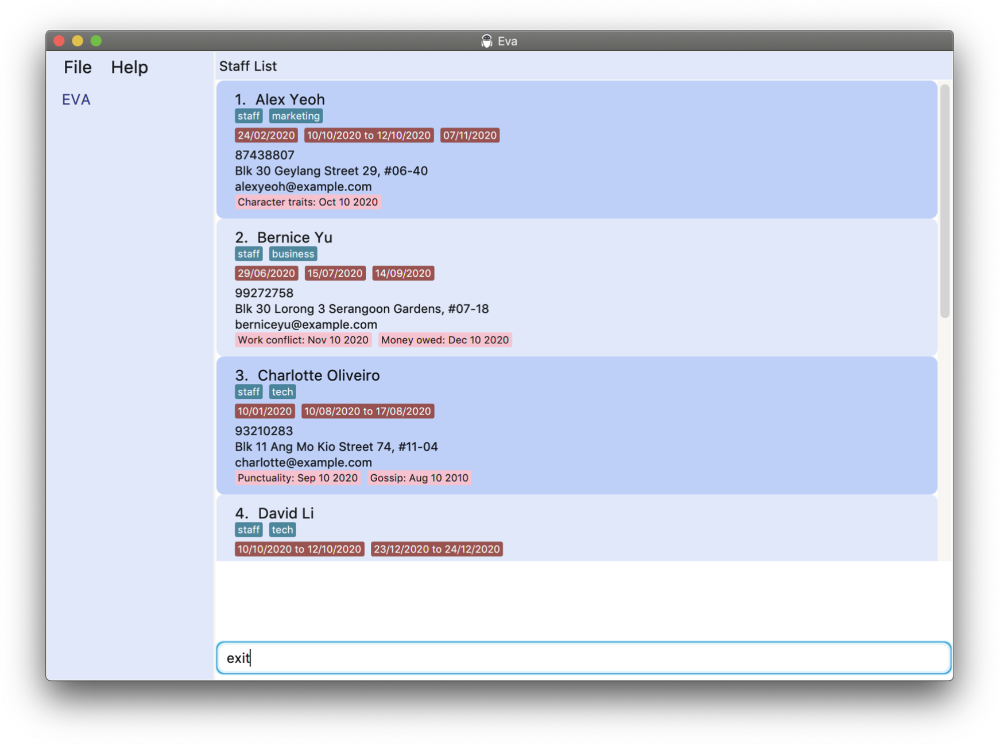
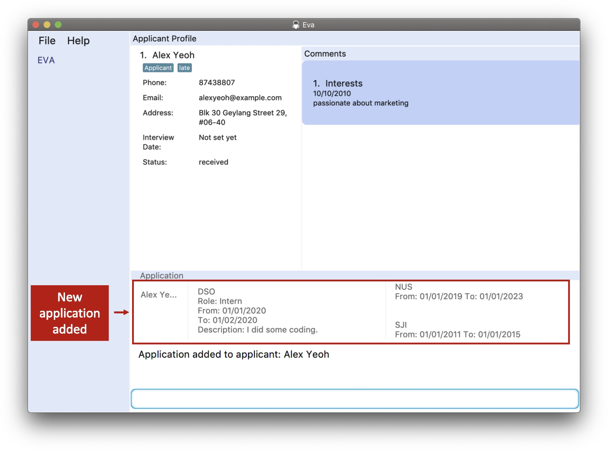
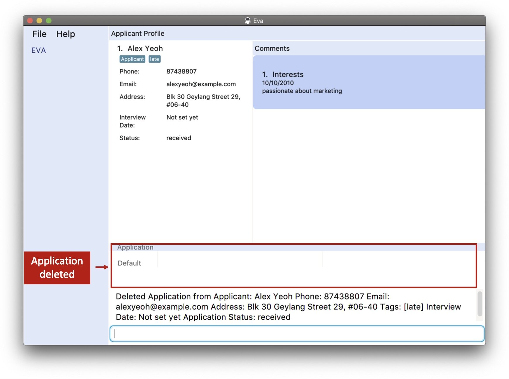

Welcome to the User Guide for Eva!

* Table of Contents
{:toc}

## 1. Introduction

   

Welcome and thanks for downloading Eva!

What is _Eva_?

Eva is a simple and lightweight desktop application that **handles HR related administrative tasks**, 
like managing your company staffs and recording details related to recruitment. 
Eva comes with a Command Line Interface (CLI) which is faster than a typical mouse/GUI driven app after you or your staffs get used to it. 

We hope that through our app, you and your company will be empowered and able to solve your basic HR needs. 
This user guide will take you through the basics of Eva and help you get moving straightaway.

------------------------------------------------------------------------------------------------------------------------

## 2. Getting Started

1. Ensure you have Java `11` or above installed in your Computer.

1. Download the latest `eva.jar` from [here](https://github.com/AY2021S1-CS2103T-W13-1/tp/releases).

1. Copy the file to the folder you want to use as the _home folder_ for Eva.

1. Double-click the file to start the app. The GUI similar to the below should appear in a few seconds. 
Note how the app contains some sample data. 
   

1. Type a command in the command box and press Enter to execute it. e.g. typing **`help`** and pressing Enter will open the help window. 
   
   

   
   **:information_source: Note:**
   Eva launches into the `Staff List Panel` by default.
   However, Eva remembers which list you last looked at and will open at `Applicant List Panel` if you exited the app from there!
   
   

   
   Some example commands you can try:

   * **`list a-`** : Lists all applicants, changes the panel to display the applicant list.
   
   * **`adda`**`  n/John Doe p/98765432 e/johnd@example.com a/John street, block 123, #01-01` : Adds a staff named `John Doe` to the application.
   
   * **`list s-`** : Lists all staffs, changes the panel to display the staff list.

   * **`adds`**`  n/John Doe p/98765432 e/johnd@example.com a/John street, block 123, #01-01` : Adds a staff named `John Doe` to the application.

   * **`dels`**` 3` : Deletes the 3rd staff shown in the staff list.
   
   * **`addl`**` 2 l/d/08/10/2020 d/10/10/2020 l/d/20/10/2020` : Adds two leave records with dates `08/10/2020 to 10/10/2020` and `20/10/2020` to the 2nd staff shown in the current list.

   * **`dell`**` 1 10/10/2020` : Deletes the leave record containing the date `10/10/2020` from the 1st person in the current list.

   * **`find s-`**` Doe` : Finds the staff whose name contains "Doe".
   
   * **`clear s-`** : Clears the staff database.

   * **`exit`** : Exits the app.

1. Refer to the [Features](#3-features) below for details of each command.

--------------------------------------------------------------------------------------------------------------------

## 3. Features

**:information_source: Notes about the command format:** 
Here are some general information you would need to know about our commands as you read through the user guide.

* Words in `UPPER_CASE` are the parameters to be supplied by the user. 
  e.g. in `add n/NAME`, `NAME` is a parameter which can be used as `add n/John Doe`.

* Items in square brackets are optional. 
  e.g `n/NAME [t/TAG]` can be used as `n/John Doe t/friend` or as `n/John Doe`.

* Items with `…`​ after them can be used multiple times including zero times. 
  e.g. `[t/TAG]…​` can be used as ` ` (i.e. 0 times), `t/friend`, `t/friend t/family` etc.

* Parameters can be in any order. 
  e.g. if the command specifies `n/NAME p/PHONE_NUMBER`, `p/PHONE_NUMBER n/NAME` is also acceptable.

* In Eva, you can store information about staff and applicants. Information includes details like name, phone number 
and more. As such, in order to prevent incorrect details from being stored, make sure you follow these guidelines
on storing these details
  * Names can be contain only alphanumeric characters and have a character limit of 70 characters.
  * Phone numbers can only contain numbers, and should be at least 8 digits long.
  * Emails should be of the format local-part@domain where the local-part should contain alpha numeric characters or 
    special characters which includes ( !#$%&'*+/=?`{|}~^.- ) excluding the parentheses. The domain name should have 
    at least 2 characters and contain only alphanumeric with a period or a hyphen for the characters in between if 
    needed.
  * Tags can only contain alphanumeric characters. 
  * All dates should be in the format DD/MM/YYYY. 

:bulb: **Tip:**

Eva automatically saves any changes made to the records in your hard disk when using the commands below!
There is no need to save manually!  
You can also find the records in the `data` folder where the `eva.jar` file is located.

Here is a brief overview on how this section is arranged. The first section brings you through the 
[different panels](#31-eva-gui) you will see in our application. After getting familiar with that, we will share some 
[general system commands](#32-system-commands) you can use at any point in time. In the third section, 
we will bring you through the [features we have implemented for staff](#33-staff-commands). 
Following which, you will be introduced to the [features for managing applicant records](#34-applicant-commands). 
Finally, you will learn about [how to add and delete comments to applicants and staff](#35-comment-commands) and 
[our very own unique script engine](#35-script-engine). By then, you will definitely become a master in using Eva! 
So let's get started! 

### 3.1. Eva GUI

Before we dive into the features, let us help you familiarize yourself with our GUI!

As of `v1.4`, Eva currently has four different application panels it can switch between:

* The `Staff List` :

* The `Staff Profile` :

* The `Applicant List` :

* The `Applicant Profile` :

These four panels form the core of our application to be sure to familiarize yourself with them! Once ready, move on to the [Commands](#32-system-commands)!

### 3.2. System Commands

#### 3.2.1. Open help window : `help`

If you're not sure of how to use Eva at any point in time, use the `help` command!

The `help` command shows a message explaining how to access the help page.

Format: `help`

#### 3.2.2. Exit the program : `exit`

Done using Eva? The `exit` command exits the program!

Format: `exit`

**:information_source: Note:** The exit command immediately closes the app upon execution. 

As mentioned earlier in [Features](#3-features), there is no need to manually save data! So don't worry if you accidentally close your app!

### 3.3. Staff commands

Staff commands give you the ability to keep track of your staffs which help you make business and manpower decisions.

:bulb: **Tip:** 

* All commands under staff can only be done on either staff list or staff profile panel except `adds`, which can be done on any panel 
 
* While in staff profile, only details of the profile that is being viewed can be changed. 

#### 3.3.1. List all staff : `list s-`

The staff list panel serves as your primary tool to give you an overview of all the staffs in your company.

This command changes the panel to the [`Staff List`](#31-eva-gui) and shows a list of all staffs in the Eva Database.

Format: `list s-`

#### 3.3.2. Add a staff: `adds`

This command enables you to add a staff record into Eva. A staff record can contain the details listed below:
 - Name*
 - Phone Number*
 - Email*
 - Address*
 - Tags
 - Comments
 - Leaves 
 
The fields marked with a asterisk (*) are compulsory and have to be provided in the parameters below.
Without any of these fields, Eva will not accept your input. Tags and comments can be added with these commands as shown 
in the examples. To manage leave records for each staff, please refer to the commands 
[addl](#337-record-leave-taken-by-staff-addl) and [dell](#338-delete-leave-taken-by-staff-dell)

Format: `adds n/NAME p/PHONE_NUMBER e/EMAIL a/ADDRESS [t/TAG]…​[c/COMMENTS]…`

 - A staff can have any number of tags (including 0)  
 - A staff can have any number of comments (including 0)  
 - Each staff is uniquely identified by their name. In the event you wish to add 2 staff records with the same name,
   please ensure that both their phone number and email addresses are different
 
:bulb: **Tip:**
 - The details of each field can be provided in any order.
 - In the case of multiple similar prefixes, the description of the last prefix will be used (excluding tags and comments).

 
Examples:
* To add only the necessary fields  
`adds n/John Doe p/98765432 e/johnd@example.com a/John street, block 123, #01-01`
* To add a comment along with the necessary fields  
`adds n/Kristina Ryan e/betsycrowe@example.com a/Betsy street, block 123, #01-01 p/12345678
 c/ ti/Behaviour d/20/12/2020 desc/Very enthusiastic in meetings`
* To add a tag along with the necessary fields  
`adds n/Betsy Crowe t/friend e/betsycrowe@example.com a/Betsy street, block 123, #01-01 p/12345678 t/Developer`

The image below shows what you would see after executing the second command in the examples given above. 

#### 3.3.3. Find a staff : `find s-`

Shows a list of staffs whose name contains one of the given names.

Format `find FIND_TYPE- KEYWORD`

Examples:
* `find s- Doe`

#### 3.3.4. View : `view`

Want a more in depth and focused view of a staff? Use this command to open up their individual profile!

This command changes the panel to the [`Staff Profile`](#31-eva-gui) and Brings you to the profile panel of the staff at the specified index. 

Format: `view INDEX`

Example:
* `view 1`

#### 3.3.5. Delete a staff: `dels`

Deletes a staff from Eva. 

Please take note that this action is irreversible.

 

Format: `dels INDEX`

Example:
* `dels 1`

#### 3.3.6. Edit a staff: `edits`

Edits general details of a staff from eva (excluding leave taken)

Format: `edits INDEX [n/NAME] [p/PHONE_NUMBER] [a/ADDRESS] [e/EMAIL] [t/TAG] [c/COMMENT]`

:bulb: **Tip:** 

* Only description of comments can be edited. Title and Date cannot be edited.

* Please note that comments format is `c/ ti/TITLE_OF_COMMENT_TO_EDIT d/DATE_OF_COMMENT_TO_EDIT desc/NEW_DESCRIPTION_OF_COMMENT` 
 

Example:
* `edits 1 n/John Doe p/99999999 a/John Street e/NEW@example.com`

#### 3.3.7. Record leave taken by staff: `addl`

Need to record down when your staffs are taking leaves?

This command records the leave taken by a staff in the Eva Database.  

Format: `addl INDEX l/d/DATE [d/DATE] [l/d/DATE [d/DATE]]…​`

:bulb: **Tip:** 

* Addition of multiple leaves using the same command is supported. A leave can have either one (single day) or two dates (start and end inclusive). 

* Dates can be input in any order. Eva will sort the leaves and dates according to which date comes first. 

* Eva automatically tells you if a staff has either already taken the leave, is in the process of taking it or has not taken the leave. This can be seen on the [Staff Profile](#31-eva-gui).  

* Eva also automatically tallies up the total number of leave days taken by a staff and displays the total below the leaves! This can be seen on the [Staff Profile](#31-eva-gui).  

Examples:
* `list s-` followed by `addl 2 l/d/20/10/2020` adds the leave record with the given date(s) to the 2nd person in the shown list.
* `find s- Betsy` followed by `addl 1 l/d/20/10/2020` adds the leave to the 1st person in the results of the `find s-` command.
* `addl 1 l/d/08/10/2020 d/10/10/2020 l/d/20/10/2020`
* `addl 2 l/d/10/10/2020 d/08/10/2020 l/d/09/09/2020`

#### 3.3.8. Delete leave taken by staff: `dell`

Should a staff be unable to take their leave and cancels or postpones, Eva allows you to delete their recorded leaves!

This command removes the record of leave taken by staff, specified by the date given. 

Please take note that this action is irreversible.

 

Format: `dell INDEX d/DATE`

**:information_source: Note:**
If a leave record has a date range that lasts from 08/11/2020 to 12/11/2020, any date keyed in that date range will cause the whole record to be deleted. 

Examples:
* `list s-` followed by `dell 2 d/09/10/2020` deletes the leave record of which the given date coincides with from the 2nd person in shown list.
* `find s- Betsy` followed by `dell 1 d/09/10/2020` deletes the leave from the 1st person in the results of the `find s-` command.
* `dell 2 d/09/10/2020`

#### 3.3.9. Clear staff database : `clear s-`

In any case that you might want to remove all staff records, you can always use this command.  
This command clears all staff entries from the Eva database. 

Please take note that this action is irreversible.

 

Format: `clear s-`

The image below shows what you would see after using this command. Notice that there are no more records of staff in the
Staff List.

### 3.4. Applicant commands

:bulb: **Tip:** 

* All commands under applicant can only be done on either applicant list or applicant profile except `adda`, 
 which can be done on any panel.  
 
* While in profiles, only details of the profile that is being viewed can be changed.

#### 3.4.1. List all applicants : `list a-`

Shows a list of all applicants in Eva.

#### 3.4.2 Add an applicant: `adda`

This command enables you to add an applicant record into Eva. An applicant record can contain the details listed below:
 - Name*
 - Phone Number*
 - Email*
 - Address*
 - Tags
 - Comments
 - Interview Date
 - Application Status
 - Application
 
The fields marked with a asterisk (*) are compulsory and have to be provided in the parameters below.
Without any of these fields, Eva will not accept your input. Tags and comments can be added with these commands as shown 
in the examples. To manage application records for each applicant, please refer to the commands 
[addapp](#347-add-an-application-addapp) and [delapp](#348-delete-an-application-delapp)

Format: `adda n/NAME p/PHONE_NUMBER e/EMAIL a/ADDRESS [id/INTERVIEW_DATE] [t/TAG]…​[c/COMMENTS]…`

 - An applicant can have any number of tags (including 0) 
 - An applicant can have any number of comments (including 0) 
 - Each applicant is uniquely identified by their name. In the event you wish to add 2 applicant records with the same name,
      please ensure that both their phone numbers and email addresses are different
 - The interview date has to be in DD/MM/YYYY format 
 - Once you add an applicant the status would be automatically set as received, if you wish to change it, refer to the feature 
 [setting of application status](#349-set-application-status-setas) below
 - :bulb: **Tip** In the case of multiple similar prefixes, the description of the last prefix will be used (excluding tags and comments).
 - :bulb: **Tip:** The details of each field can be provided in any order. 
 - :bulb: **Tip** The interview date is optional. If an interview date is not fixed yet, you can leave it and set it later.  
 

Examples:
* To add an applicant without an interview date 
`adda n/Vicky Santana p/98765432 e/vsc@xample.com a/John street, block 123, #01-01`
* To add an applicant with an interview date 
`adda n/John Doe p/98765432 e/johnd@example.com a/John street, block 123, #01-01 id/22/11/2020`
* To add an applicant with tags and comments
 `adda n/Betsy Crowe t/friend e/betsycrowe@example.com a/Betsy street, block 123, #01-01 
 p/92345678 t/Developer c/ ti/Working Ethics d/10/10/2010 desc/Good`

The image below shows what you would see after executing the second command in the examples given above.

#### 3.4.3. Find an applicant : `find a-`

Shows a list of staffs whose name contains one of the given names.

Format `find FIND_TYPE- KEYWORD`

Examples:
* `find a- Doe`

#### 3.4.4. View : `view`

Brings you to the profile panel of the applicant at the specified index. 

Format: `view INDEX`

Example:
* `view 1`

#### 3.4.5. Delete an applicant: `dela`

If you need to remove specific records of applicants, you may use this command. By providing the index of the 
applicant you see on Applicant List, you can remove that applicant's record. 

Please take note that this action is irreversible.

 
Format: `dela INDEX`

Example:
* `dela 1`

#### 3.4.6. Edit an applicant: `edita`

Edits general details of an applicant from eva (excluding application status)

Format: `edita INDEX [n/NAME] [p/PHONE_NUMBER] [a/ADDRESS] [e/EMAIL] [c/COMMENT] [id/INTERVIEW_DATE]`

:bulb: **Tip:** 

* Only description of comments can be edited. Title and Date cannot be edited.

* Please note that comments format is `c/ ti/TITLE_OF_COMMENT_TO_EDIT d/DATE_OF_COMMENT_TO_EDIT desc/NEW_DESCRIPTION_OF_COMMENT` 

* In the case of multiple similar prefixes, the description of the last prefix will be used (excluding tags and comments).
 

Example:
* `edita 1 n/NEWNAME p/99999999 a/NEWADDRESS e/NEW@example.com`
* `edita 1 id/ 10/10/2010`

#### 3.4.7. Add an application: `addapp`

Adds an application (resume details) to an applicant with the specified index under Eva.

Format: `addapp INDEX [filepath]`

 - An applicant should be created prior to the addition of its application.

:bulb: **Tip:**  

* You may find a resume text file generated in the data folder `data/resume.txt`, 
which is in the same directory as your jar file. This is the strict template to follow for resume files. 

* You may use the sample resume by keying in `sample` as filepath. 

Example:
* `addapp 1 data/resume.txt`
* `addapp 1 sample`

#### 3.4.8. Delete an application: `delapp`

Deletes an application from an applicant with the specified index under Eva.

Please take note that this action is irreversible.

 

Format: `delapp INDEX`

**:information_source: Note:** `delapp` replaces the current application of the target applicant with a blank application.  

Example:
* `delapp 1`

#### 3.4.9. Set application status: `setas`

We understand that the process of hiring new talent requires multiple stages and this can be tracked using the
application status. You can use this command to change the status of any applicant at any time.

Format: `setas INDEX as/NEW_APPLICATION_STATUS`

- Application status can only be any one from the following: 
  - received
  - processing
  - accepted
  - rejected
  
Example:
* `setas 1 as/received`

#### 3.4.10 Clear applicant database: `clear`

In any case that you might want to remove all applicant records, you can always use this command.
This command clears all applicant entries from the Eva database.

Please take note that this action is irreversible.

 

Format: `clear a-`

The image below shows what you would see after using this command. 
Notice that there are no more records of staff in the
Applicant List.

### 3.5. Comment Commands

Commands to add, delete and edit comments on staff or applicants

**:information_source: Important:**  

* Comment Commands take index reference from which type of person user is viewing.  

* If user is viewing staff list or profile, comment commands takes index reference from staff list. 

* If user is viewing applicant list or profile, comment commands takes index reference from applicant list. 

* Comments are arranged according to date, then alphabetically if same date. 

* Comments do not support the input `|`. 

* Comment description can only be seen in profiles. 

 
#### 3.5.1 Add comment to a staff/applicant: `addc`

Adds a comment to a staff/applicant under eva depending on which panel you are in

Format: `addc INDEX c/ ti/TITLE_OF_COMMENT d/DATE_OF_COMMENT desc/DESCRIPTIONS`

Example:
* `addc 1 c/ ti/Working Ethics d/10/10/2010 desc/Good`

#### 3.5.2 Delete comment from a staff/applicant: `delc`

Deletes a comment from a staff/applicant under eva depending on which panel you are in

Format: `delc INDEX c/ ti/TITLE_OF_COMMENT_TO_DELETE`

Example Scenario:
* Comment to delete has Title: Working Ethics, Date: 10/10/2010, Description:Good, Staff index is 1
* Command: `delc 1 c/ ti/Working Ethics`

#### 3.5.3. Edit comment on a staff: `editc`

Edits only the description of a comment on a staff. 

Format: `editc INDEX c/ ti/TITLE_OF_COMMENT_TO_CHANGE d/DATE_OF_COMMENT_TO_CHANGE desc/NEW_DESCRIPTION`

Example Scenario:
* Comment to change has Title: Working Ethics, Date: 10/10/2010, Description: Good, and staff index is 1
* Command: `editc 1 c/ ti/Working Ethics d/10/10/2010 desc/Quite Bad`

### 3.6. Script Engine

Eva has a built-in script to execute JavaScript that can be used to extend the features of Eva.

Please refer to [Nashorn official website](https://www.oracle.com/technical-resources/articles/java/jf14-nashorn.html)
for supported JavaScript features, and how to import Java classes to extend Eva features.

#### 3.6.1. Load a JavaScript script: `load`

Format: `load SCRIPT_FILE_PATH`

Example Scenario:
* Load a script located at `C:\Documents\script.js`
* Command: `load C:\Documents\script.js`

--------------------------------------------------------------------------------------------------------------------

## 4. FAQ

**Q**: How do I transfer my data to another Computer? 
**A**: Install the app in the other computer and overwrite the empty data file it creates with the file that contains the data of your previous Eva home folder.

**Q**: I can't run the app by double clicking! What do I do? 
**A**: Open terminal and traverse to the directory the `eva.jar` file is in. Then type the command `java -jar eva.jar`.

--------------------------------------------------------------------------------------------------------------------

## 5. Command summary                                                                                 

### 5.1. System

| Action    | Format, Examples   |
|-----------|--------------------|
| **Help**  | `help`             |
| **Exit**  | `exit`             |
| **Load**  | `load`             |

### 5.2. Staff

| Action          | Format, Examples                                                                                                                                        |
|-----------------|---------------------------------------------------------------------------------------------------------------------------------------------------------|
| **ListStaff**  | `list s-`   
| **AddStaff**    | `adds n/NAME p/PHONE_NUMBER e/EMAIL a/ADDRESS [t/TAG]…​`   e.g., `adds n/John Doe p/98765432 e/johnd@example.com a/John street, block 123, #01-01` |
| **FindStaff**   | `find s- KEYWORD [MORE_KEYWORDS]`  e.g., `find s- James Jake`                                                                 |
| **View**        | `view INDEX`  e.g., `view 2`                                                                                            |
| **DeleteStaff** | `dels INDEX`  e.g., `dels 1`         
| **EditStaff**   | `edits INDEX [n/NAME] [p/PHONE_NUMBER] [e/EMAIL] [a/ADDRESS] [t/TAG]…​`  e.g.,`edits 2 n/James Lee e/jameslee@example.com` |
| **AddLeave**    | `addl INDEX l/d/DATE [d/DATE]`   e.g., `addl 2 l/d/08/10/2020 d/10/10/2020 l/d/20/10/2020`                                                   |
| **DeleteLeave** | `dell INDEX d/DATE`  e.g., `dell 1 d/10/10/2020`                                                                                       |
| **ClearStaffDatabase** | `clear s-`         |

### 5.3. Applicant

| Action                | Format, Examples                                                                                                 |
|-----------------------|--------------------------------------------------------------------------------------------|
| **List** | `list a-`   
| **AddApplicant**      | `adda`   e.g., `adda n/John Doe p/98765432 e/jd@example.com a/John street, block 123, #01-01` |
| **Find** | `find a- KEYWORD [MORE_KEYWORDS]`  e.g., `find a- James Jake`                                                                 |
| **View** | `view INDEX`  e.g., `view 2`                                                                                            |
| **DeleteApplicant**   | `dela`   e.g., `dela 1`                                                                       |
| **AddApplication**    | `addapp INDEX [filepath]`   e.g., `addapp 1 C:\Users\Public\Downloads\resume.txt`             |
| **DeleteApplication** | `delapp INDEX`   e.g., `delapp 1`                                                       |
| **SetAppStatus**      | `setas INDEX as/NEW_APPLICATION_STATUS`   e.g., `setas 1 as/processing`                               |
| **ClearApplicantDatabase** | `clear a-`         |
