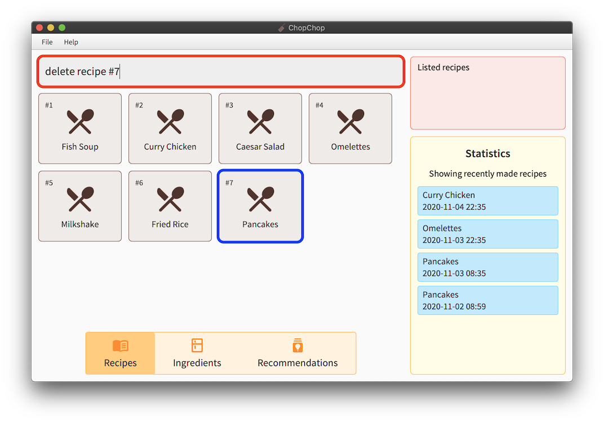
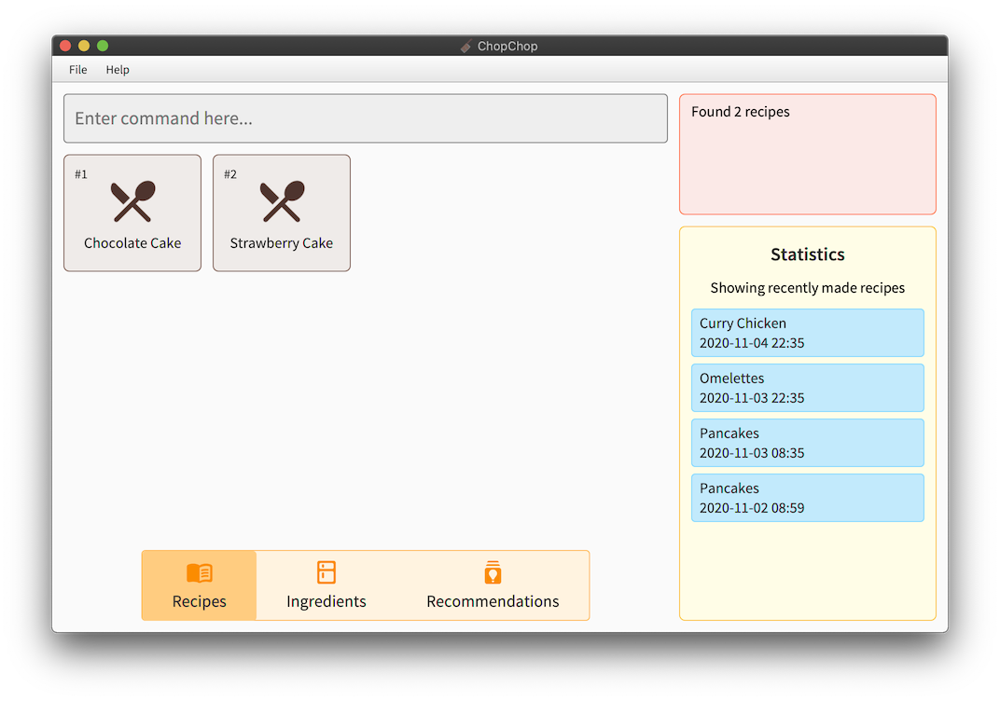

1. Table of Contents
{:toc}

---------------
## Introduction

ChopChop is a food recipe management system, which aims to make it easier for people to manage their recipes and ingredients in an easy and effective manner. It is a *desktop app*, optimised for use through typing textual commands, rather than with a point-and-click graphical user interface (GUI). For fast typists, ChopChop will be able to manage your recipes more efficiently than other applications.

However, ChopChop also features a graphical interface to display ingredients and recipes in an interactive form.

--------------
## Quick start

To start using and experimenting with ChopChop, here are the steps you can follow:

1. Ensure you have Java `11` or above installed in your Computer; it can be obtained from [AdoptOpenJDK](https://adoptopenjdk.net).

2. Download the latest `chopchop.jar` from [here](https://github.com/AY2021S1-CS2103T-T10-3/tp/releases).

3. Copy the file to the folder you want to use as the _home folder_ for your ChopChop.

4. Double-click the file to start the app. The GUI similar to the below should appear in a few seconds. The app starts with some sample data for you to experiment with.<br>

<div style="text-align: center; padding-bottom: 2em">
 <br />
Figure 1: <i>The initial state of ChopChop, including sample data</i>
</div>


5. Type the command in the command box and press Enter to execute it. e.g. typing **`help`** and pressing Enter will open the help window.<br>
   Some example commands you can try:

   * **`list recipes`** : Lists recipes.

   * **`add recipe Milkshake /ingredient Milk /qty 500ml /step Pour Milk /step Shake`** : Adds a recipe for making milkshakes, with one ingredient and two steps.

   * **`quit`** : Exits the app.

6. Refer to the [Commands](#commands) below for details of each command.

-----------
## Overview

ChopChop manages two key components — ingredients and recipes, and they will be the main pieces you will interact with in ChopChop. Common to both are names and tags, the latter of which allow you to quickly group related ingredients or recipes together, or to organise them in any way you desire.

Names for both ingredients and recipes are case insensitive, so `pAnCakes` and `Pancakes` refer to the same recipe. Note that you cannot have duplicate recipes nor ingredients in ChopChop; items are duplicates if their names are the same.

### Ingredients
An ingredient consists of a quantity with an associated unit, and an optional expiry date. Each ingredient can have multiple *sets*, where each set is a given quantity of that ingredient, exipring on a certain date.

For example, you might have `500 ml` of milk that you bought last week that expires tomorrow, while you have another `1.5 l` of milk that you bought today, expiring two weeks from now. ChopChop will track both these *sets*, and will intelligently use the earliest-expiring set when doing its accounting.

For a more in-depth look at how ChopChop handles quantities, see [this section](#quantities-and-units).

### Recipes
A recipe consists of a list of used ingredients (and their quantities), as well as a list of steps.


--------------------------------
## Navigating the User Interface

<h1>WE NEED A PROPERLY LABELLED PICTURE</h1>


<h3>insert the various parts of the GUI and talk about it.</h3>


-----------
## Commands


### Command Syntax

To succintly represent the syntax of the various commands, we adopt a simple notation in this User Guide, as shown below:

* Words starting with a slash (`/`) denote named parameters; these names are case sensitive (eg. `/STEP` is not the same as `/step`). All the text following a named parameter *belong* to it, until either the end of the input, or the next named parameter. <br />
For example, in `/param1 lorem ipsum /param2 dolor sit amet`, the parameter `param1` will have the value `lorem ipsum`, while the parameter `param2` will have the value `dolor sit amet`.

* Words in angle brackets (eg. `<name>`) denote an input that is provided by *you*, the user. <br />
For example, the **add ingredient** command is specified like this: `add ingredient <name> /qty <quantity> [/expiry <expiry_date>]`; in this case, `<name>`, `<quantity>` and `<expiry_date>` are values that you provide.

* Portions in square brackets (eg. `[/expiry <expiry_date>]`) denote optional parts of the command. In this example, not all ingredients will expire, so the expiry date is optional.

* Portions with trailing ellipses (eg. `(/step <step>)...`) denote commands accepting one or more of the given argument. In this example, a recipe can have multiple steps, so you can specify multiple `/step` arguments.

* Parentheses are used to group parts of the command together purely for clarity in this document; they must not appear in the typed input. For instance, in `(/step <step>)...`, it is simply used to denote that each step must be preceeded by the `/step` argument.

* A `<#REF>` refers to an item reference, and is used to refer to either a recipe or an ingredient. It can either be the (case-insensitive) name of the item, or it can be a number prefixed with '#', eg. `#3` to refer to the third item in the list. In the GUI, displayed items are numbered in the corner.

* In general, the order of arguments is important; for example, the order of `/step` arguments determines the order of the steps in the recipe, while a `/qty` in an **add recipe** command must only appear after an `/ingredient` argument.


### Viewing Help : **`help`**

This command shows a message with a link to this user guide; you can use this to easily access this page from the application. Note that you can also access this help dialog from the menubar at the top, under `Help` -> `Docs`.

Usage: `help`

<div style="text-align: center; padding-bottom: 2em">
 <br />
Figure 2: <i>The help dialog</i>
</div>


### Quitting ChopChop **`quit`**
This command quits ChopChop. Your recipe data is already saved whenever a command is executed, so you do not need to save it manually before quitting.

Usage: `quit`


### Listing Recipes — **`list`**`recipes`
This command shows a list of all recipes in ChopChop. This can be used to switch panes (between recipes and ingredients) without using the mouse, as well as to clear any filters that might have been applied due to previous commands (eg. `find` and `filter`).

<div markdown="span" class="alert alert-primary">
:bulb: **Tip:** For convenience, you can use either `list recipes` or `list recipe`.
</div>

Usage: `list recipes`


### Adding Recipes — **`add`**`recipe`
This command adds a recipe to ChopChop, specifying zero or more ingredients, each with an optional quantity, and zero or more steps. After a recipe is added, you will be able to see it immediately in the application.

If an ingredient is specified without a quantity, it is treated *as if* you used `/qty 1`. This works for counted ingredients (eg. eggs), but it will cause errors for other ingredients (eg. volume of milk).

Usage: `add recipe <NAME> [/ingredient <INGREDIENT_NAME> [/qty <QUANTITY>]]... (/step <STEP>)...`

Constraints:
- Recipe name should not be empty
- Ingredient names should not be empty
- Steps should not be empty

For example, suppose you wanted to add a recipe for pancakes using flour, eggs, and milk, you would type this:
```
add recipe Pancakes
/ingredient flour /qty 400g
/ingredient egg /qty 3
/ingredient milk /qty 250ml
/step Mix ingredients together
/step Bake for 30 minutes at 400 celsius
/step Pour syrup and serve
```
(note that this is displayed on separate lines for clarity, but you should type this in one go)

<div style="text-align: center; padding-bottom: 2em">
 <br />
Figure 3.1: <i>The add recipe command</i>
</div>

After pressing enter, you will see this view, showing your newly created recipe:

<div style="text-align: center; padding-bottom: 2em">
 <br />
Figure 3.2: <i>The recipe detail view</i>
</div>

If you go back to the main recipe view (either by clicking on the tab at the bottom, or by using `list recipes`, you can see the new recipe in the list:

<div style="text-align: center; padding-bottom: 2em">
 <br />
Figure 3.3: <i>The newly created recipe in the recipe list</i>
</div>


### Editing Recipes — **`edit`**`recipe`
Edits a specific recipe from ChopChop. The `edit recipe` command allows for different actions on the name, ingredients, steps and tags, as specified below.

#### Name
To edit a recipe's name, use the `/name` parameter (e.g. `/name new recipe name`).

#### Ingredients
To edit a recipe's ingredients, use the `/ingredient` parameter, with an action specified after a colon. Note that ingredient names are case-insensitive.

Possible actions include:

- Adding an ingredient with the `/ingredient:add` parameter (e.g. `/ingredient:add beef /qty 1kg`). Note that specifying a quantity is required.
- Editing an ingredient with the `/ingredient:edit` parameter (e.g.`/ingredient:edit beef /qty 3kg` ). The ingredient must exist for the command to be valid.
- Deleting an ingredient with the `/ingredient:delete` parameter (e.g. `/ingredient:delete beef`).

#### Steps
To edit a recipe's steps, use the `/step` parameter, with an action specified after a colon. Steps are referred to using their indexes (starting from 1), which specified after the action.

Possible actions include:

- Adding a step with the `/step:add` parameter (e.g. `/step:add Add in the vanilla extract and mix well`). If an index is specified, the step will be added at the given index. Otherwise, it will be added after all existing steps.
- Editing a step with the `/step:edit` parameter. An index must be specified for the command to be valid (eg. `/step:edit:4 Beat the eggs thoroughly`).
- Deleting a step with the `/step:delete` parameter (e.g. `/step:delete:4`).

#### Tags
To edit a recipe's steps, use the `/tag` parameter, with an action specified after a colon. Like ingredients, tags are case-insensitive.

Possible actions include:

- Adding a tag with the `/tag:add` parameter (e.g. `/tag:add breakfast`).
- Deleting a tag with the `/tag:delete` parameter (e.g. `/tag:delete breakfast`)

Usage `edit recipe <#REF> [/name <RECIPE_NAME>] [/ingredient:<ACTION> [<INGREDIENT_NAME> /qty <QUANTITY>]]... [/step:<ACTION>[:<INDEX>] [<STEP>]]... [/tag:<ACTION> [<TAG>]]...`

Examples:
- `edit recipe #4 /name soup` <br />
	This changes the name of the fourth recipe currently shown in the GUI's view to 'soup'.
- `edit recipe pancakes /ingredient:add syrup /qty 500ml` <br />
	This edits the recipe named 'pancakes' by adding 500ml of syrup to the recipe's ingredient list.
- `edit recipe risotto /step:edit:1 In a saucepan, warm the broth over low heat` <br />
    This edits the recipe named 'risotto' by changing the 1st step to the text above.
- `edit recipe beef curry /ingredient:delete apple /step:delete:4` <br />
    This edits the recipe named 'beef curry' to remove both the ingredient 'apple' and the 4th step.


### Deleting Recipes — **`delete`**`recipe`
This command deletes a specific recipe from ChopChop. You can either use the name or the number of the recipe to refer to it.

Usage: `delete recipe <#REF>`

Examples:
- `delete recipe #4` <br />
	This deletes the fourth recipe currently shown in the GUI's view.
- `delete recipe pancakes` <br />
	This deletes the recipe named 'pancakes'. Note that the name here is case insensitive.

To illustrate, in the scenario below, both `#4` and `pancakes` will refer to the same recipe (in this case, the Pancake recipe added in the `add recipe` guide above).

<div style="text-align: center; padding-bottom: 2em">
 <br />
Figure 4: <i>The recipe number (circled) can be used to refer to an item as well</i>
</div>


### Finding Recipes — **`find`**`recipe`
This command finds all recipes containing the given keywords in the name.

Usage: `find recipe <KEYWORD_ONE> [<KEYWORD_TWO>]...`

Constraints:
- At least one search keyword must be given

Only the recipe name is searched, and only full words are matched, case-insensitively. In the case of multiple search keywords, recipes containing any of those words will be returned.

Examples:
- `find recipe cake` will match **Chocolate Cake** and **Strawberry Cake**, but *not* **Pancakes**.
- `find recipe milk cake` will match **Milk Tea** and **Carrot Cake**.

To illustrate, suppose you want to search for recipes with names containing 'cake', you would use `find recipe cake`:
<div style="text-align: center; padding-bottom: 2em">
 <br />
Figure 5.1: <i>The starting state of the application</i>
</div>

After executing the command, note how the recipe list has changed, showing only the matching recipes, and that item number in the corners have changed as well. As explained above, the 'Pancakes' recipe was not included in this list.

<div style="text-align: center; padding-bottom: 2em">
 <br />
Figure 5.2: <i>The recipes containing 'cake'</i>
</div>

To go back to the full recipe view (resetting the search filter), you can either click the Recipes button at the bottom, or run the `list recipes` command:

<div style="text-align: center; padding-bottom: 2em">
 <br />
Figure 5.3: <i>Back to the main recipe list</i>
</div>


### Listing Ingredients — **`list`**`ingredients`
This command shows a list of all recipes in ChopChop. As with the `list recipes` command, you can use this command to switch between panes without clicking, or to reset any filters.

<div markdown="span" class="alert alert-primary">
:bulb: **Tip:** For convenience, you can use either `list ingredients` or `list ingredient`.
</div>

Usage: `list ingredients`


### Adding Ingredients — **`add`**`ingredient`
This command adds an ingredient to ChopChop, with an optional quantity and expiry date. If the quantity is not specified, ChopChop will infer a single unitless ingredient, like eggs. If the expiry date is not specified, it is assumed that the ingredient (eg. salt) does not expire.

As mentioned in the overview above, an ingredient can consist of multiple sets; the `add ingredient` command will intelligently *combine* ingredients as appropriate.

<div markdown="span" class="alert alert-primary">
:information_source: **Note:** Ingredients need to have compatible units in order to be combined; see [this section](#quantities-and-units) for how it works.
</div>

Usage: `add ingredient <NAME> [/qty <QUANTITY>] [/expiry <EXPIRY_DATE>]`

Examples:
- `add ingredient milk /qty 1l /expiry 2020-11-09` adds one litre of milk that expires on the 9th of November.
- `add ingredient egg /expiry 2020-12-25` adds one egg that expires on Christmas day.

Suppose you just finished a grocery run, and want to add the items to ChopChop. First, you have 2 cartons of milk:

<div style="text-align: center; padding-bottom: 2em">
 <br />
Figure 6.1: <i>Adding 2 litres of milk</i>
</div>

Since ChopChop did not know about 'milk' previously, a new ingredient entry is created for it:

<div style="text-align: center; padding-bottom: 2em">
 <br />
Figure 6.2: <i>The newly added milk ingredient</i>
</div>

Next, suppose you also bought 24 blueberries:

<div style="text-align: center; padding-bottom: 2em">
 <br />
Figure 6.3: <i>Adding 24 blueberries</i>
</div>

This time, since ChopChop already knew about blueberries, our previous 5 blueberries now become 29:

<div style="text-align: center; padding-bottom: 2em">
 <br />
Figure 6.4: <i>You now have 29 blueberries</i>
</div>

If you try to add an ingredient with incompatible quantities (for example, suppose you did not want to count the blueberries individually, and you only know that you bought a 400 gram box), ChopChop will display an error message, and not update the ingredient:

<div style="text-align: center; padding-bottom: 2em">
 <br />
Figure 6.5: <i>Ingredients must have compatible units to be combined</i>
</div>


### Deleting Ingredients — **`delete`**`ingredient`

Usage: `delete ingredient <#REF> [/qty <QUANTITY>]`

This command deletes a specific ingredient from ChopChop. Similar to the `add ingredient` command, this command also allows you to delete quantities of ingredients instead of the whole ingredient. In this scenario, ChopChop will intelligently remove the earliest-expiring ingredients first.

If `/qty` is not specified, then the behaviour of this command is to completely remove the ingredient from ChopChop. Worry not: if you accidentally delete something, you can always `undo` it.

<div markdown="span" class="alert alert-primary">
:information_source: **Note:** If specified, the quantity needs to have compatible units with the existing ingredient; see [this section](#quantities-and-units) for how it works.
</div>

Usage: `delete ingredient <#REF> [/qty <QUANTITY_TO_REMOVE>]`

Examples:
- `delete ingredient #4` <br />
	This deletes the fourth ingredient currently shown in the GUI's view.
- `delete ingredient milk /qty 500ml` <br />
	This removes 500ml of milk from ChopChop's inventory.

To illustrate, suppose that you poured yourself a glass of cold milk to drink, without making a recipe. To tell ChopChop that there is less milk in the fridge, you would use this command:

<div style="text-align: center; padding-bottom: 2em">
 <br />
Figure 7.1: <i>Removing 250ml of milk</i>
</div>

Notice how the amount of milk decreased from 2 litres to 1.75 litres:

<div style="text-align: center; padding-bottom: 2em">
 <br />
Figure 7.2: <i>You now only have 1.75 litres of milk left</i>
</div>


### Finding Ingredients — **`find`**`ingredient`
This command finds all ingredients containing the given keywords in the name, and it works identically to the `find recipe` command [above](#finding-recipes--findrecipe).

Constraints:
- At least one search keyword must be given

Usage: `find ingredient <KEYWORD_ONE> [<KEYWORD_TWO>]...`

For example, suppose you wanted to find all ingredients containing fish (not in the literal sense, but only in their name):

<div style="text-align: center; padding-bottom: 2em">
 <br />
Figure 8.1: <i>The complete ingredient list</i>
</div>

Now, only the matching ingredients are shown:

<div style="text-align: center; padding-bottom: 2em">
 <br />
Figure 8.2: <i>Only ingredients containing 'fish' in their name are shown</i>
</div>

Again, you can either click the Ingredients button, or use `list ingredients` to clear the search filter.


#### Undoing commands — **`undo`**
Undoes the last undoable command. Undoable commands are commands that involve changes to recipes and ingredients stored in ChopChop.

Usage: `undo`


#### Undoing commands — **`redo`**
Redoes the last redoable command. All undoable commands (as described [above](#undoing-commands--undo)) can be redone.

Usage: `redo`

-----------------------
## Quantities and Units

In order to keep track of ingredients correctly, ChopChop needs to know about their amounts. Currently, there are 3 'kinds' of units supported; volume, mass (weight), and counts. These are the supported units specifically:

- `ml` — millilitres
- `l` — litres (1000ml)
- `cup`, `cups` — metric cup (250ml)
- `tsp` — metric teaspoon (5ml)
- `tbsp` — metric tablespoon (15ml)
- `g` — gram
- `mg` — milligram (0.001g)
- `kg` — kilogram (1000g)

Additionally, quantities without a unit are assumed to be dimensionless 'counts'; for example, **3 eggs**.


### Ingredient Combining

As mentioned above, ChopChop will combine ingredients when you `add` them, provided they have compatible units. Combining works as you would expect, and is rather flexible; adding `3 cups` of milk to an existing stock of `400ml` will yield `1.15l`.

However, you cannot, for example, add `300g` of eggs to `4` eggs, as grams and counts are incompatible units.
