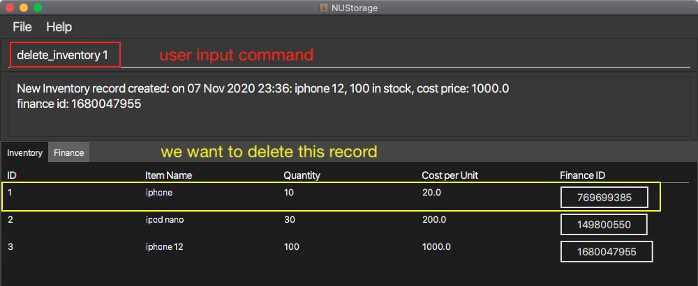
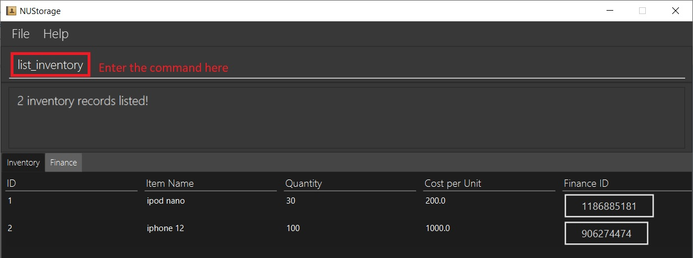
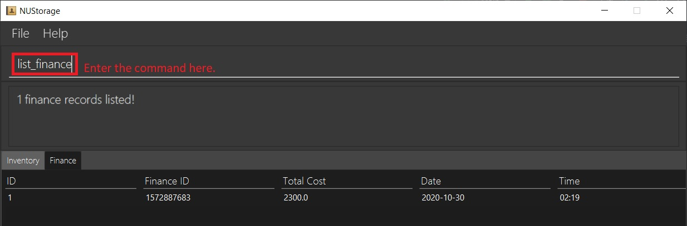

<!-- TOC adapted from
https://github.com/AY2021S1-CS2103T-W16-3/tp/pull/179/commits/aec461182c194c9ca2c67d7c407fcabb376191ff 
-->

  * Table of Contents
  {:toc}

---

## 0. Using this User-Guide
This User-Guide aims to aid users in using NUStorage to its fullest potential. In this guide, we will be guiding users through the entire process of using NUStorage, from setting it up on your system to the usage of features that NUStorage offers. 

If you are a new user, we recommend that you read this user guide from start to finish and follow the examples provided in the [Commands](#4-commands) section to gain a much better understanding of the application. If you are an experienced user, feel free to use the Table-Of-Contents to skip to the section most relevant to you.

If you see an acronym that you don't understand, kindly refer to the [glossary](#7-glossary-and-terms). If you have further questions regarding NUStorage or this User-Guide, feel free to contact us at nustorage.support@u.nus.edu. 

## 1. Introduction
Welcome to NUStorage, a desktop application that aims to help users to mange __inventory__, __finance transactions__ as well as __accounts__.

NUStorage revolutionises the way we can manage our inventory and finances by ridding us of cumbersome traditional means of management, such as books and folders. Instead, everything is now stored and displayed neatly in a fast and low-resource application!

NUStorage is optimised for store owners and managers who prefer to work with a command line interface (CLI) while still enjoying the visual benefits of a graphical user interface (GUI).

With proper usage, NUStorage can manage your inventory and finance records much faster than traditional GUI-based applications, streamlining your workflow and increasing productivity.

Interested? Read on to get [started](#2-quick-start-guide)!

---

## 2. Quick Start Guide

1. Ensure that you have `Java 11` or above installed on your device.
2. Download the latest release of `NUStorage.jar` [here](https://github.com/AY2021S1-CS2103T-T11-3/tp/releases).
3. Copy the `.jar` file to the folder you want to use as the home folder for your application.
4. Double-click on the `.jar` file to start the app. The GUI should look something like this:

    
    
5. Below is an image explaining the relevant areas of the application:

    
    
6. Type a few commands in the command box and press enter to execute. This is small calibration test to ensure that NUStorage is working as intended.
    * Here are some sample commands to type:
        * `create_inventory i/Logitech G400 q/20 c/69` to add 20 Logitech G400 gaming mouse that cost $69 to the inventory
        * `add_finance amt/120.17` to add an inbound transaction of $120.17
        * `bye` to exit programme
    * Refer to the commands list below for details of each command.

---

## 3. Features

**:information_source: Notes about the command format:** 

* Words in `UPPER_CASE` are the __parameters__ to be keyed-in by the user. 
  e.g. in `create_inventory i/ITEM`, `ITEM` is a parameter which can be used as `create_inventory i/MacBook`.
* Items in square brackets are **optional**. 
  e.g `amt/AMOUNT [at/DATE] [TIME]` can be used as the possible formats:
  * `amt/200 at/2020-04-10 18:00`
  * `amt/200 at/2020-04-10`
  * `amt/200 at/18:00`
  * `amt/200 at/2020-04-10`
  * `amt/200`
* Inputs that require date and time have specific formats. The format for the date has to be in `YYYY-MM-DD` while the format for the time has to be in `HH:mm` and both are case-sensitive. 
  e.g. `2020-01-01` will show up as `01 Jan 2020` for the date while `13:00` will show up as `13:00` for the time in the NUStorage's response box.

---

## 4. Commands

This section shows the commands that can be used with NUStorage. It is divided into three sections:

1. Inventory commands
2. Finance account commands
3. Universal commands

Accompanying the details of each command are figures that show an example of the command and the result of executing the command.

---

### 4.1. Inventory Commands

---

#### 4.1.1. Add items to inventory: `create_inventory`

Creates and stores a new inventory record into the inventory list.

__Format:__ `create_inventory i/ITEM_NAME q/QUANTITY [c/ITEM_COST] [at/DATE [TIME]]`

__Example:__ `create_inventory i/iphone q/10 c/20` to create a new inventory record of item `iphone` and quantity `10`. A finance record with the total amount (QUANTITY * ITEM_COST) will also be created.

__Result:__ item `iphone` of quantity `10` is added to the inventory.

__Result:__ corresponding finance record of total cost `200` is added to the inventory.

---

#### 4.1.2. Remove items from inventory: `delete_inventory`

Removes the specified record from the inventory list.

__Format:__ `delete_inventory INDEX`

__Example:__ `delete_inventory 1` to delete the inventory record at index `1`.

__Result:__ record at index `1` is removed from the inventory list of records.

---

#### 4.1.3. Edit record in inventory: `edit_inventory`

Edits the item name, quantity or unit cost of the specified record in the inventory list.

__Format:__ `edit_inventory INDEX [i/ITEM_NAME] [q/QUANTITY] [c/ITEM_COST]`

__Example:__ `edit_inventory 1 i/iPad q/100 c/20` to edit the inventory record at index `1`.

__Result:__ item name changed from `iphone` to `iPad`, quantity changed from `10` to `100` and unit cost from `5` to `20`.

---

#### 4.1.4. List inventory records: `list_inventory`

Displays all records in the inventory list.

__Format:__ `list_inventory`

__Example:__ `list_inventory`

__Result:__ inventory records listed.

---

### 4.2. Finance Commands

---

#### 4.2.1. Add finance records: `add_finance`

Adds and stores a new finance record into the account.

Note: Date and time are default to current location's datetime unless specified

__Format:__ `add_finance amt/AMOUNT [at/DATE] [TIME]`

__Example:__ `add_finance amt/30000 at/2020-03-03` to create a new finance record of amount `$30000` on `3rd March 2020`

__Result:__ finance record of amount `$30000` on `3rd March 2020` is added to the finance account.

---

#### 4.2.2. Delete finance records: `delete_finance`

Deletes the specified finance record from the account.

__Format:__ `delete_finance INDEX`

__Example:__ `delete_finance 1` to delete the finance record with index `1`.

__Result:__ record at index `1` is removed from the finance account records.

---

#### 4.2.3. Edit a finance record: `edit_finance`

Edits the specified record in the finance account.

__Format:__ `edit_finance INDEX amt/AMOUNT [at/DATE]`

__Example:__ `edit_finance 1 amt/120` to edit the finance record at `1`.

__Result:__ finance amount changed from `$100` to `$120` on `1st Oct 2020`.

---

#### 4.2.4. List finance records: `list_finance`

Displays all the finance records in the account.

__Format:__ `list_finance`

__Example:__ `list_finance`

__Result:__ finance account is listed.

---

#### 4.2.5. Find a specific finance record: `find_finance`

Find any records that matches the given parameters. 

__Format:__ `find_finance [id/ID] [aft/DATE] [bef/DATE] [item/YESNO]`

__Example:__ `find_finance id/10 aft/2019-10-30 bef/2020-03-23 item/yes` to find records with ID containing "10", took place between 30st Oct 2019 to 23rd Mar 2020 (inclusive), and has a corresponding item record.

__Result:__ finance records that fit the paramaters are listed

---

### 4.3. Universal Commands

---

#### 4.3.1. Switch to inventory: `goto_inventory`

Switches to the inventory tab in the programme.

__Format:__ `goto_inventory`

__Example:__ `goto_inventory`

__Result:__ Switched to Inventory tab.

---

#### 4.3.2. Switch to finance: `goto_finance`

Switches to the finance tab in the programme.

__Format:__ `goto_finance`

__Example:__ `goto_finance`

__Result:__ Switched to Finance tab.

---

#### 4.3.3. Quit the programme: `exit`

Saves data locally in a data file and exits the programme.

__Format:__ `exit`

__Example:__ `exit`

__Result:__ Programme terminates.

---

#### 4.3.4. Undo/Redo the previous command: `undo`/`redo`[coming in v2.0]`

[_This feature is planned for v2.0_]

Undo or redo the previous command.

__Format:__ `undo` or `redo`
  
__Example:__ `undo` or `redo`

__Result:__ Undo or redo the previous command.

---

## 5. Command Summary

--------|------------------
__Add inventory__ | `create_inventory i/ITEM q/QUANTITY [c/ITEM_COST]`   e.g. `create_inventory i/MacBook pro q/200 c/50`
__Delete inventory__ | `delete_inventory INDEX`   e.g. `delete_inventory 4`
__Edit inventory__ | `edit_inventory INDEX i/ITEM_NAME q/QUANTITY`  e.g. `edit_inventory 3 i/Lenovo Y50 q/10`
__List inventory__ | `list_inventory`
__Add finance__ | `add_finance amt/AMOUNT [at/DATE] [TIME]`   e.g. `add_finance amt/420.69 at/2020-04-23`
__Delete finance__ | `delete_finance INDEX`   e.g. `delete_finance 2`
__Edit finance__ | `edit_finance INDEX amt/AMOUNT [at/DATE] [TIME]`   e.g. `edit_finance 1 amt/120 at/2020-10-01`
__List finance__ | `list_finance`
__Find finance__ | `find_finance [id/ID] [aft/DATE] [bef/DATE] [item/YESNO]`   e.g. `find_finance id/10 aft/2019-10-30 bef/2020-03-23 item/yes`
__Exit programme__ | `exit`

---

## 6. FAQs

### 6.1. How do I migrate the data to another computer?

WARNING: doing so will overwrite the existing data you may have on the other device. Please make sure you make a backup before migrating data.

Steps to migrate data:

1. Locate the data files under the directory (folder) `./data`. The data files are names `inventory.json` and `financeAccount.json`.
2. Copy the files to the other device.
3. Place the two files under the directory `./data`.
4. Restart NUStorage on the other device to load the data.

### 6.2. How do I combine data from two devices?

Currently, NUStorage does not support the merging of data between different devices. NUStorage only supports moving of data from one device to another. Please see FAQ 6.1 regarding how to migrate data.

### 6.3. Can I directly modify the storage file?

Modifying the storage file is possible but NOT RECOMMENDED! Doing so may result in a complete data loss.

---

## 7. Glossary and Terms

1. `CLI`: command line interface.
2. `GUI`: graphical user interface.
3. `.jar`: The file type that NUStorage is released in. This is similar to the `.exe` files in Windows and `.app` files in MacOS.

---
