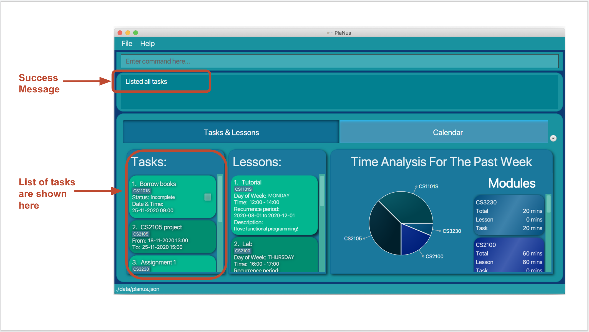

---

User Guide v1.3 
---

##Introduction - Gabriella Teh

PlaNus is a project done under NUS module CS2103T by a group of five aspiring computer science students.

PlaNus is **task managing desktop application** for students in NUS with many projects and deadlines, optimized for use via a Command Line Interface (CLI) with the benefits of Graphical User Interface (GUI). PlaNus reduces the time spent by students in task management as adding tasks and lessons is now simple and quick!

Objectives of PlaNus:
1. Provide students with a detailed breakdown of how much time they spend on their tasks and lessons in their respective modules.
2. Allow students to have a organised view of their schedule. (coming soon in v1.3B)
3. Allocate tasks and lessons to their schedule automatically. (coming soon in v1.4)

##About
This user guide provides a detailed description of all the features available in the application.

## Quick start

* [Features](#features)
  * [1. Show all commands : `help`](#1-show-all-commands--help) - Gabriella Teh
  * [2. List all tasks : `list`](#2-list-all-tasks--list) - Marcus Tan
  * [3. Add a deadline: `deadline`](#3-add-a-deadline--deadline) - Li Gangwei
  * [4. Add an event: `event`](#4-add-an-event--event) - Li Gangwei
  * [5. Add a lesson: `lesson`](#5-add-a-lesson--lesson) - Marcus Tan
  * [6. Delete a task : `delete`](#6-delete-a-task--delete) - Li Beining
  * [7. Mark a task as done: `done`](#7-mark-a-deadline-as-done--done) - Li Beining
  * [8. Find a task : `find`](#8-find-a-task-by-an-attribute--find) - Zhou Zijian
  * [9. Edit a task : `edit`](#9-edit-a-task--edit) - Gabriella Teh
  * [10. Exit the program : `exit`](#10-exit-the-program--exit) - Li Gangwei
* [FAQ](#faq) - Li Gangwei
* [Command summary](#command-summary) - Zhou Zijian

--------------------------------------------------------------------------------------------------------------------

## Features

**Notes about the command format** 

* Words in UPPER_CASE are the parameters to be supplied by the user. 
  e.g. in `add title:TITLE`, `TITLE` is a parameter which can be used as `title:homework 1`.

* Items in square brackets are optional input. e.g `desc:DESCRIPTION`  
  `[desc:DESCRIPTION]` can be used as `title:homework 1 desc:science project` or just as `title:homework 1`.

* Items with `...` after them can be used multiple times. 
  e.g. `done INDEX:TIME_TAKEN...` can be used as `done 1:20 2:120 3:50`.

* Parameters can be in any order. 
  e.g. if the command specifies `title:TITLE desc:DESCRIPTION`, `desc:DESCRIPTION title:TITLE` is also acceptable.

### 1. Show all commands : `help`

Shows the user a message with a link to the user guide.

Format: `help`

 

### 2. List all tasks : `list`

Shows the user a list of all the tasks in PlaNus.

Format: `list`

 

### 3. Add a deadline : `deadline`

Users can add a deadline to PlaNus.

Format: `deadline title:TITLE [desc:DESCRIPTION] [datetime:DATE_TIME] [tag:MODULE_CODE]`

* Adds a deadline to PlaNus, with the specified title in `title:TITLE`, with the specified description in `description:DESCRIPTION`, with a date and time in `datetime:DATE_TIME` of when this deadline should be completed before, with a tag in `tag:MODULE_CODE` indicating the module of which this deadline belongs to.
  * The added deadline will be tracked for time analysis if it has a tag.

Examples:

* `deadline title:Return book datetime:02-01-2020 18:00` 
Adds a deadline with title "Return book", and a date and time of "02-01-2020 18:00" to PlaNus.
* `deadline title:Assignment 1 desc:CS3230 Assignment 1 datetime:01-11-2020 18:00 tag:CS3230` 
Adds a deadline with title “Assignment 1”, description “CS3230 Assignment 1”, and a date and time of “01-01-2020 18:00” with tag "CS3230" to PlaNus.
 

### 4. Add an event : `event`

Users can add an event to PlaNus.

Format: `event title:TITLE date:DATE from:START_TIME to:END_TIME [desc:DESCRIPTION] [tag:MODULE_CODE]`

* Adds an event to PlaNus, with the specified title in `title:TITLE`, with the specified description in `description:DESCRIPTION`, on the date specified in `date:DATE`, starting from the time specified in `from:START_TIME` to the time specified in `to:TIME`, with a tag in `tag:MODULE_CODE` indicating the module of which this deadline belongs to.
  * The added event will be tracked for time analysis if it has a tag.

Examples:

* `event title:Career Talk date:02-01-2020 from:09:00 to:12:30` 
Adds an event with title "Career Talk", and a date "02-01-2020" with start time of "09:00" and end time of "11:30" to PlaNus.
* `event title:Consultation date:13-10-2020 from:19:00 to:20:30 desc:CS2105 consultation tag:CS2105`  and a date "13-10-2020" with start time of "19:00" and end time of "20:30" with tag "CS2105" to PlaNus.
 

### 5. Add a lesson : `lesson`

Users can add a lesson to PlaNus.

Format: `lesson title:TITLE tag:MODULE_CODE [desc:DESCRIPTION] day:DAY from:TIME to:TIME start:DATE end:DATE`

* Adds a lesson to PlaNus, with the title specified in `title:TITLE`, starting from the date specified in `start:DATE` to the date specified in `end:DATE`, on the days specified in `day:DAY` from the time specified in `from:TIME` to the time specified in `to:TIME`.
* The format of day in `day:DAY` must be as follows (case-insensitive):
  * Monday, Tuesday, ..., Sunday

Examples:

* `lesson title:CS2103T Lecture tag:CS2103T desc:Most exciting lecture in NUS! day:Mon from:12:00 to:14:00 start:01-01-2020 end:01-05-2020 ` 
   Adds a lesson to PlaNus with a title "CS2103 Lecture", under the module "CS2103T", with a description "Most exciting lecture in NUS!", on all Mondays 12:00-14:00 in the date range 01-01-2020 to 01-05-2020.

 

### 6. Delete a task : `delete`

Users can delete the specified task from PlaNus.

Format: `delete INDEX...`

* Deletes the task(s) at the specified `INDEX`.
* The index refers to the index number shown in the displayed task list.
* The index **must be a positive integer** 1, 2, 3, ...
* User can provide more than 1 index at the same time, eg. delete 1 2 3, However, if one of the index is invalid, the whole command will not be executed, and an error message will be shown.

Examples:

* `list` followed by `delete 1 2` deletes the 1st task followed by the 2nd task in the results of the `list` command.
* `find title:homework` followed by `delete 1` deletes the 1st task in the results of the `find` command.

 

### 7. Mark a deadline as done : `done`

Users can mark a specified deadline in PlaNus as done.

Format: `done INDEX:TIME_TAKEN...`

* Marks the deadline(s) at the specified `INDEX` as done and record the time taken to complete the deadline.
* The index refers to the index number shown in the displayed task list.
* The time taken refers to the time in minutes that the user took to complete the specific deadline.
* The index and time taken **must be a positive integer** 1:20, 2:30, 3:120, ...
* Take note that there are two type of task, one is event, another one is deadline, only task of deadline can be marked as done through this command, an error message will be shown if user attempts to mark the event as done.
* After user marked a deadline as done, user cannot edit the deadline or undo the done command anymore.

Examples:

* `list` followed by `done 2:30 3:60` marks the 2nd and the 3rd tasks in the results of the `list` command status to be done, and record that the user has spent 30 minutes to finish the 2nd task, and 60 minutes to finish the 3rd task.
* `find title:homework` followed by `done 1:20` marks the 1st task in the results of the `find` command status to be done and record the time taken to complete the deadline is 20 minutes.

 

### 8. Find a task by an attribute : `find`

Users can find a task by a set of attributes given below.

Format: `find ATTRIBUTE_1:SEARCH_PHRASE ATTRIBUTE_2:SEARCH_PHRASE ...`

If the user provides different attributes in the command, tasks that match all attributes will be displayed.

If the user provides multiple search phrases of the same attribute in the command, tasks that match any of the search phrases will be displayed.

Available attributes in v1.3 include:
* `title:` finds all tasks which contain the search phrase in the given title
* `desc:` finds all tasks which contain the search phrase in the given description
* `type:` finds all tasks of the given type
* `date:` finds all tasks with the given date and/or time
* `status:` finds all tasks with the given status
* `tag:` finds all tasks related with the given module tag

Examples:

* `find title:play games` will list all tasks with a title includes the phrase `play games`
* `find type:deadline` will list all deadlines
* `find title:dinner type:deadline` will list all deadlines with a title that includes `dinner`
* `find date:01-01-2020 11:00` will list all tasks with the date 01-01-2020 11:00
* `find title:dinner title:lunch type:deadline` will list all deadlines with the title includes either `dinner` or `lunch`

 

### 9. Edit a task : `edit`

Users can edit a task by a set of attributes given below.

Format: `edit INDEX ATTRIBUTE_1:NEW_VALUE ATTRIBUTE_2:NEW_VALUE ...`

* If different attributes are provided in the command, multiple attributes of the specified task will be changed simultaneously.
* If a deadline has a status of complete, it cannot be edited.
* Available attributes that the use can modify differs by the type of task the use is trying modify.
  * Available attributes for both deadline and event in v1.3 include:
    * `title` edits the title of the specified task
    * `desc` edits the description of the specified task
    * `tag` edits the tag of the specified task
  * Available attributes for **deadline only** in v1.3 include:
      * `datetime` edits the date and time of the specified deadline
  * Available attributes for **event only** in v1.3 include:
      * `date` edits the date of the specified event
      * `from` edits the start time of the specified event
      * `to` edits the end time of the specified event

Examples:

* `edit 1 title:play games` will edit the first task in the results of the `list` command, changing its title to `play games`
* `find type:deadline` followed by `edit 3 desc:This is very urgent!` will edit the first deadline of the third deadline in the results of the `find` command, changing its description to "This is very urgent!"
* `find title:homework` followed by`edit 2 desc:Homework is difficult date:01-01-2020` will edit the second task in the results of the `find` command if the task is an event, changing its date to 01-01-2020 and its description to "Homework is difficult", otherwise, PlaNus will notify the user of the incompatible error
* `edit 1 tag:CS2103T` will edit the first task in the results of the `list` command, changing its tag to "CS2103T"

 

### 10. Exit the program : `exit`

Users can exit PlaNus.

Format: `exit`

 
--------------------------------------------------------------------------------------------------------------------
 
## FAQ

**Q**: How do I start the application? 
**A**: In command prompt, go to the folder the application resides in and type: java - jar planus.jar
 
--------------------------------------------------------------------------------------------------------------------

## Command summary

| Action     | Format, Examples                                             |
| ---------- | ------------------------------------------------------------ |
| **Help**   | `help`                                                       |
| **List**   | `list`                                                       |
| **Event**  | `event title:TITLE [desc:DESCRIPTION] date:DATE from:TIME to:TIME tag:MODULE_CODE`   e.g. `event title:CS2103T Group meeting date:23-10-2020 from:20:00 to:22:00 tag:CS2103T` |
| **Deadline**  | `deadline title:TITLE [desc:DESCRIPTION] [datetime:DATETIME] tag:MODULE_CODE`   e.g. `deadline title:Assignment2 submission datetime:23-10-2020 18:00 tag:CS2103T` |
| **Lesson** | `title:TITLE tag:MODULE_CODE [desc:DESCRIPTION] day:DAY from:TIME to:TIME start:DATE end:DATE` e.g.`lesson title:CS2103T Lecture tag:CS2103T desc:Most exciting lecture in NUS! day:Mon from:12:00 to:14:00 start:01-01-2020 end:01-05-2020` |
| **Delete** | `delete INDEX...`   e.g. `delete 3`, `delete 3, 4, 5`                       |
| **Done**   | `done INDEX:TIME_TAKEN...`  e.g. `done 1:20`, `done 1:20 2:60 3:120`    |
| **Find**   | `find ATTRIBUTE_1:SEARCH_PHRASE ATTRIBUTE_2:SEARCH_PHRASE ...`   e.g.`find title:dinner type:deadline date:02-02-2020` |
| **Edit**   | `edit INDEX [title:TITLE] [date:DATE] [desc:DESCRIPTION] [type:TYPE] [tag:MODULE_CODE]` e.g. `edit 1 date:02-02-2020 12:00 tag:CS2101` |
| **Exit**   | `exit`                                                       |

## Input Format summary
All the keyword mentioned in command should follow the format stated below:

| keyword     | Format, Examples                                             |
| ---------- | ------------------------------------------------------------ |
| **date**   | `dd-MM-yyyy`    e.g. 23-10-2020                                                    |
| **datetime**   | `dd-MM-yyyy HH:mm`   e.g. 21-10-2020 10:00                                                      |
| **day**  |  `Monday/Tuesday/Wednesday/Thursday/Friday/Saturday/Sunday` |
| **from, to, time** | `HH:mm`   e.g. 18:00      |
                                                     |
