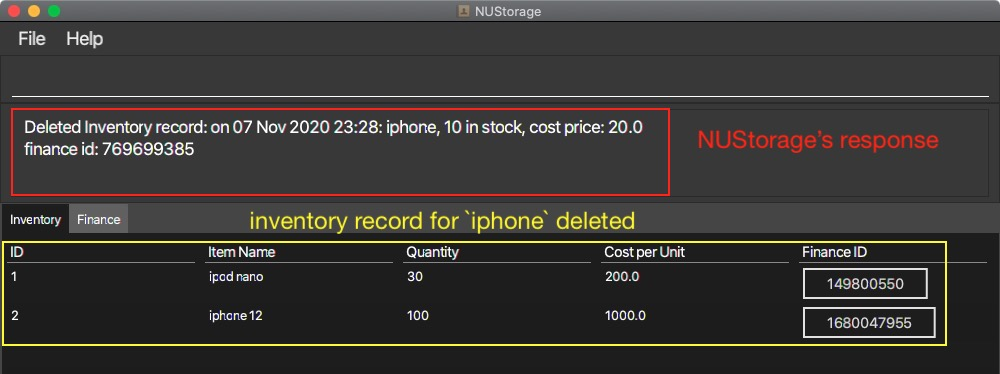
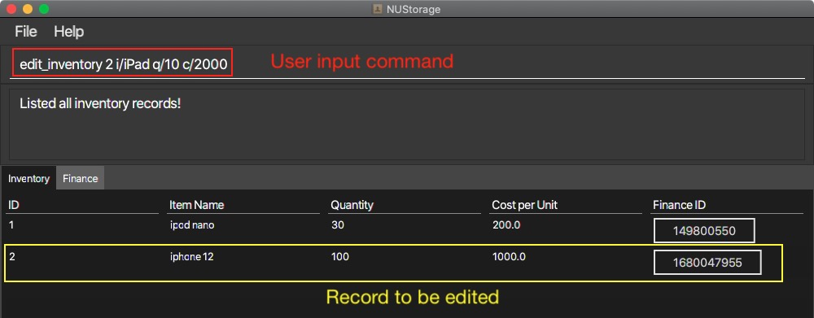
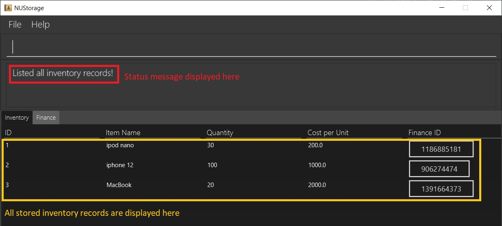
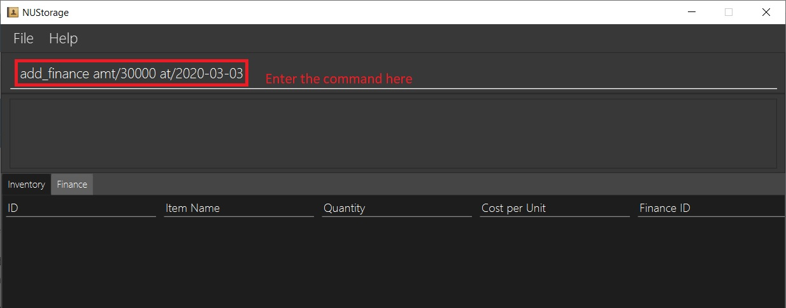
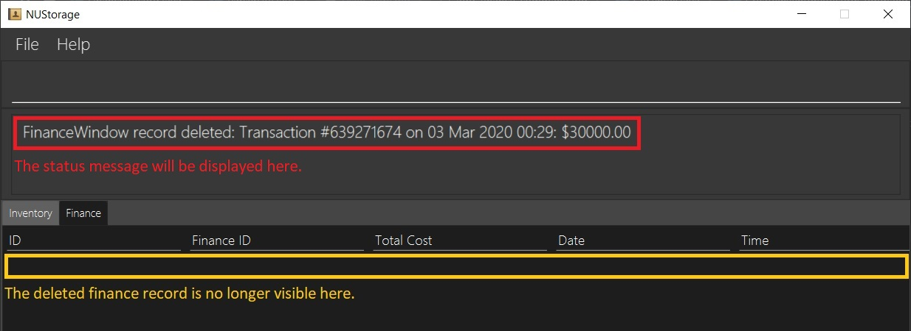

<!-- TOC adapted from
https://github.com/AY2021S1-CS2103T-W16-3/tp/pull/179/commits/aec461182c194c9ca2c67d7c407fcabb376191ff 
-->

  * Table of Contents
  {:toc}

---

## 1. Using this User-Guide

This User-Guide aims to aid users in using NUStorage to its fullest potential. In this guide, we will be guiding you through the entire process of using NUStorage, from setting it up on your system to the using the features that NUStorage offers.

If you are a new user, we recommend that you read this user guide from start to the end and follow the examples provided in the [Commands](#5-commands) section to gain a better understanding of the application. If you are an experienced user, feel free to use the Table-Of-Contents to skip to the section most relevant to you.

If you see an acronym that you don't understand, kindly refer to the [glossary](#8-glossary-and-terms). If you have further questions regarding NUStorage or this User-Guide, feel free to contact us at _nustorage.support@u.nus.edu_.

## 2. Introduction

Welcome to NUStorage, a desktop application that aims to help users to manage __inventory__, __finance transactions__ as well as __accounts__.

NUStorage revolutionises the way we can manage our inventory and finances by ridding us of cumbersome traditional means of management, such as books and folders. Instead, everything is now stored and displayed neatly in a fast and low-resource application!

NUStorage is optimised for store owners and managers who prefer to work with a command line interface (CLI) while still enjoying the visual benefits of a graphical user interface (GUI).

With proper usage, NUStorage can manage your inventory and finance records much faster than traditional GUI-based applications, streamlining your workflow and increasing productivity.

Interested? Read on to get [started](#3-quick-start-guide)!

---

## 3. Quick Start Guide

1. Ensure that you have `Java 11` or above installed on your device.
2. Download the latest release of `NUStorage.jar` [here](https://github.com/AY2021S1-CS2103T-T11-3/tp/releases).
3. Copy the `.jar` file to the folder you want to use as the home folder for your application.
4. Double-click on the `.jar` file to start the app. The GUI should look something like this:

    

5. Below is an image explaining the relevant areas of the application:

    

6. Type a few commands in the command box and press enter to execute. This is small calibration test to ensure that NUStorage is working as intended.
    * Here are some sample commands to type:
        * `create_inventory i/Logitech G400 q/20 c/69` to add 20 Logitech G400 gaming mouse that cost $69 to the inventory
        * `add_finance amt/120.17` to add an inbound transaction of $120.17
        * `bye` to exit programme
    * Refer to the [commands list](#5-commands) below for details of each command.

---

## 4. Features

**:information_source: Notes about the command format:** 

* Words in `UPPER_CASE` are the __parameters__ to be keyed-in by the user. 
  e.g. in `create_inventory i/ITEM`, `ITEM` is a parameter which can be used as `create_inventory i/MacBook`.
* Items in square brackets are **optional**. 
  e.g `amt/AMOUNT [at/DATE] [TIME]` can be used as the possible formats:
  * `amt/200 at/2020-04-10 18:00`
  * `amt/200 at/2020-04-10`
  * `amt/200 at/18:00`
  * `amt/200 at/2020-04-10`
  * `amt/200`
* Inputs that require date and time have specific formats. The format for the date has to be in `YYYY-MM-DD` while the format for the time has to be in `HH:mm` and both are case-sensitive. 
  e.g. `2020-01-01` will show up as `01 Jan 2020` for the date while `13:00` will show up as `13:00` for the time in the NUStorage's response box.

---

## 5. Commands

This section shows the commands that can be used with NUStorage. It is divided into three sections:

1. Inventory commands
2. Finance account commands
3. Universal commands

Accompanying the details of each command are figures that show an example of the command and the result of executing the command.

---

### 5.1. Inventory Commands

The following are commands related to the inventory storage.

#### 5.1.1. Add items to inventory: `create_inventory`

Creates and stores a new inventory record into the inventory list.

__Format:__ `create_inventory i/ITEM_NAME q/QUANTITY [c/ITEM_COST]`

__Example:__ `create_inventory i/iphone q/10 c/20` to create a new inventory record of item `iphone` and quantity `10`. A finance record with the total amount (QUANTITY * ITEM_COST) will also be created.

__Result:__ item `iphone` of quantity `10` is added to the inventory.

__Result:__ corresponding finance record of total cost `200` is added to the inventory.

---

#### 5.1.2. Remove items from inventory: `delete_inventory`

Removes the specified record from the inventory list.

__Format:__ `delete_inventory INDEX`

__Example:__ `delete_inventory 1` deletes the inventory record at index `1`.

__Result:__ record at index `1` is removed from the inventory list of records.

---

#### 5.1.3. Edit record in inventory: `edit_inventory`

Edits the item name, quantity or unit cost of the specified record in the inventory list.

__Format:__ `edit_inventory INDEX [i/ITEM_NAME] [q/QUANTITY] [c/ITEM_COST]`

__Example:__ `edit_inventory 2 i/iPad q/100 c/20` edits the inventory record at index `2`.

__Result:__ item name changed from `iphone` to `iPad`, quantity changed from `10` to `100` and unit cost from `5` to `20`.

---

#### 5.1.4. Edit record in inventory: `find_inventory`

Edits the item name, quantity or unit cost of the specified record in the inventory list.

__Format:__ `find_inventory KEYWORD`

__Example:__ `find_inventory ipad` finds for inventory records containing the name `ipad`.

__Result:__ listed all inventory records with the word `ipad`.

---

#### 5.1.5. List inventory records: `list_inventory`

Displays all records in the inventory list.

__Format:__ `list_inventory`

__Example:__ `list_inventory` lists all inventory records.

__Result:__ inventory records listed.

---

### 5.2. Finance Commands

The following are commands related to the finance account storage.

#### 5.2.1. Add finance records: `add_finance`

NUStorage allows you to add and save a new finance record into the account. In the [Add Inventory Record](#511-add-items-to-inventory-create_inventory) section, we have seen how a finance record is added when an inventory record is created. The finance record is used to reflect the financial information of the newly created inventory record. However, there are times when creating an inventory record is unnecessary and the user just wants to create a standalone finance record. 

This is where `add_finance` comes in handy. `add_finance` allows users to create finance records that are not attached to any inventory records. This is useful when users just want to record down an influx/outflow of funds.

Below are instructions on how to use the `add_finance` command:

__Format:__ `add_finance amt/AMOUNT [at/DATE] [TIME]` 

This creates a new finance record of amount `AMOUNT`. If `DATE` and `TIME` are specified, the finance record would reflect that `DATE` and `TIME` in the record.

**Note** If the Date and Time fields are not specified, they will default to the current location's Date and Time.

__Example:__ `add_finance amt/30000 at/2020-03-03` 

This creates a new finance record of amount `$30000` on `3rd March 2020`

Enter the example command into the command box as shown below:

__Expected Result:__ Finance record of amount `$30000` on `3rd March 2020` is added to the finance account:

---

#### 5.2.2. Delete finance records: `delete_finance`

Previously, in the [Add Finance Records](#521-add-finance-records-add_finance) section, we created a finance record. Now, lets try to delete it from NUStorage using `delete_finance`.

**NOTE** If you are reading this section without having followed the instructions from the previous section, ensure that your NUStorage application has at least one finance record stored in its system. If you are unclear on how to do so, refer to the [Adding finance records](#521-add-finance-records-add_finance) section.

Before we begin, ensure that NUStorage is currently in the "Finance" tab. To do so, click on the "Finance" button to change to the "Finance" tab. If you are already on the "Finance" tab, the "Finance" tab button should be black in color. 

This is what you should be seeing:

After you have ensured that NUStorage is in the "Finance" tab, follow the instructions below to learn how to use the `delete_finance` command:

__Format:__ `delete_finance INDEX`:

This allows us to delete the finance record with the ID of `INDEX`.

Currently, our NUStorage only contains one record, as shown below:

__Example:__ `delete_finance 1` 

This deletes the finance record with index `1`.

Enter the example command into the command box as shown below:

__Expected Result:__ record at index `1` is removed from the finance account records.

---

#### 5.2.3. Edit a finance record: `edit_finance`

Previously, in the [Delete finance records](#522-delete-finance-records-delete_finance) section, we have deleted our only finance record in our application. For this section, ensure you have at least one stand-alone (i.e not attached to any inventory records) finance record stored in the application and that you are on the finance tab.

`edit_finance` allows us to edit details of the stand-alone finance records currently stored within NUStorage. Currently, with `edit_finance`, we are able to edit a stand-alone finance record's amount and date.

If you are having trouble with adding stand-alone finance records or switching to the finance tab, refer to the section on [Adding finance records](#521-add-finance-records-add_finance) or [Deleting finance records](#522-delete-finance-records-delete_finance) respectively. 

**NOTE** [Adding inventory records](#511-add-items-to-inventory-create_inventory) will result in a linked finance record being created. These finance records cannot be edited through `edit_finance`. Instead, refer to the [Editing inventory records](#523-edit-a-finance-record-edit_finance) section for instructions on how to modify linked finance records.

Your NUStorage application should currently look something like this:

Below are instructions on how to use the `edit_finance` command:

__Format:__ `edit_finance INDEX amt/AMOUNT [at/DATE]` 

This allows us to change the amount and date details of the finance record with the `INDEX` ID.

__Example:__ `edit_finance 1 amt/120` 

This changes the amount of the finance record with the ID of `1` to `120`.

Enter the example command into the command box as shown below:

__Expected Result:__ finance amount changed from `$100` to `$120` while the date remains unchanged.

---

#### 5.2.4. Find a finance record with a specified keyword: `find_finance`

Previously, in the [Edit finance records](#523-edit-a-finance-record-edit_finance) section, we have learnt how to edit parts of our stand-alone finance records. For this section, let us first add some more stand-alone/linked finance records to populate our finance-record list. 

In the case that we have multiple records, it can get a little tedious to locate a certain finance record. In situations like these, we can use the `find_finance` command to find finance records that contains the specified parameters and display them on the record panel.

Ensure that you have at least 2 finance records, preferably with differing amounts/dates, stored in NUStorage as well as that you are in the 'Finance' tab before proceeding. If you are having trouble adding stand-alone/linked finance records or navigating to the 'Finance' panel, refer to the sections on [Adding finance records](#521-add-finance-records-add_finance), [Adding inventory records](#511-add-items-to-inventory-create_inventory) or [Deleting finance records](#522-delete-finance-records-delete_finance) respectively.

Currently, your NUStorage application should look something like this: 

Below are instructions on how to use the `find_finance` command:

__Format:__ `find_finance [id/ID] [aft/AFTDATE] [bef/BEFDATE] [item/YESNO]`: 

This allows us to find finance records with a Finance ID that contains `ID` if the `ID` field is filled, that were made after `AFTDATE` if the `AFTDATE` field is filled, but before `BEFDATE` if the `BEFDATE` field is filled, and is linked to an inventory record if the `YESNO` field is filled with the `yes` parameter or stand-alone finance records if the `YESNO` field is filled with the `no` parameter.

**NOTE** If every optional field is not filled, NUStorage will simply display every finance record stored upon entering the command.

__Example:__ `find_finance id/8 aft/2019-10-20 bef/2020-12-30 item/no` 

This allows us to find records with a Finance ID containing "8", took place between 20th Oct 2019 to 30th Dec 2020 (inclusive), and does not have a linked inventory record.

Enter the example command into the command box as shown below:

__Result:__ finance records that fit the parameters are listed. Below shows the record(s) from the image above that passes the `find_finance` criteria:

**NOTE** Do not worry if your resulting display does not match the image above. If the records you added is not exactly the same as the ones shown above, the output would likely not be the same as well. Most importantly, ensure that all the records that fit the criteria in the `find_finance` command are displayed on NUStorage.

---

#### 5.2.5. List finance records: `list_finance`

Previously, in the [Find finance records](#524-find-a-finance-record-with-a-specified-keyword-find_finance) section, we have learnt how to find certain finance records that contains our provided parameters. However, after finding certain records, chances are we would like to display all our stored finance records again. This can be achieved using the `list_finance` command.

The `list_finance` command will result in NUStorage displaying all the finance records stored within it.

Before proceeding, ensure that your application is in the "Finance" tab. If you are having trouble navigating to the "Finance" tab, please refer to the [Deleting finance records](#522-delete-finance-records-delete_finance) section.

For this section, we shall be carrying on with the example used in the [Find finance records](#524-find-a-finance-record-with-a-specified-keyword-find_finance) section.

Currently our NUStorage looks like this. If you have been following the examples throughout the [Find Commands](#52-finance-commands) section, it should look similar to this as well:

Below are instructions on how to use the `list_finance` command:

__Format:__ `list_finance`

This command results in the listing of all finance records.

__Example:__ `list_finance`

Enter the example command into the command box as shown below:

__Result:__ finance account is listed.

---

### 5.3. Universal Commands

The following are universal commands for navigating the application.

#### 5.3.1. Switch to inventory: `goto_inventory`

Switches to the inventory tab in the programme.

__Format:__ `goto_inventory`

__Example:__ `goto_inventory`

__Result:__ Switched to Inventory tab.

---

#### 5.3.2. Switch to finance: `goto_finance`

Switches to the finance tab in the programme.

__Format:__ `goto_finance`

__Example:__ `goto_finance`

__Result:__ Switched to Finance tab.

---

#### 5.3.3. Quit the programme: `exit`

Saves data locally in a data file and exits the programme.

__Format:__ `exit`

__Example:__ `exit`

__Result:__ Programme terminates.

---

#### 5.3.4. Undo/Redo the previous command: `undo`/`redo`[coming in v2.0]`

[_This feature is planned for v2.0_]

Undo or redo the previous command.

__Format:__ `undo` or `redo`
  
__Example:__ `undo` or `redo`

__Result:__ Undo or redo the previous command.

---

## 6. Commands Summary

### 6.1. Inventory Commands Summary

The following table gives a summary of the [__inventory commands__](#51-inventory-commands) for quick reference and look-ups.

|Description|Command and Example|
|---|---|
| __Add inventory__ | `create_inventory i/ITEM q/QUANTITY [c/ITEM_COST]`   e.g. `create_inventory i/MacBook pro q/200 c/50` |
| __Delete inventory__ | `delete_inventory INDEX`   e.g. `delete_inventory 4` |
| __Edit inventory__ | `edit_inventory INDEX i/ITEM_NAME q/QUANTITY`  e.g. `edit_inventory 3 i/Lenovo Y50 q/10` |
| __Find inventory__ | `find_inventory KEYWORD`   e.g. `find_inventory ipad` |
| __List inventory__ | `list_inventory` |

### 6.2. Finance Commands Summary

The following table gives a summary of the [__finance commands__](#52-finance-commands) for quick reference and look-ups.

|Description|Command and Example|
|---|---|
| __Add finance__ | `add_finance amt/AMOUNT [at/DATE] [TIME]`   e.g. `add_finance amt/420.69 at/2020-04-23` |
| __Delete finance__ | `delete_finance INDEX`   e.g. `delete_finance 2` |
| __Edit finance__ | `edit_finance INDEX amt/AMOUNT [at/DATE] [TIME]`   e.g. `edit_finance 1 amt/120 at/2020-10-01` |
| __Find finance__ | `find_finance [id/ID] [aft/DATE] [bef/DATE] [item/YESNO]`   e.g. `find_finance id/10 aft/2019-10-30 bef/2020-03-23 item/yes` |
| __List finance__ | `list_finance` |

### 6.3. Universal Commands Summary

The following table gives a summary of the [__universal commands__](#53-universal-commands) for quick reference and look-ups.

|Description|Command and Example|
|---|---|
| __Exit programme__ | `exit` |
| __Switch to inventory__ | `goto_inventory` |
| __Switch to finance__ | `goto_finance` |

---

## 7. FAQs

### 7.1. How do I migrate the data to another computer?

WARNING: doing so will overwrite the existing data you may have on the other device. Please make sure you make a backup before migrating data.

Steps to migrate data:

1. Locate the data files under the directory (folder) `./data`. The data files are names `inventory.json` and `financeAccount.json`.
2. Copy the files to the other device.
3. Place the two files under the directory `./data`.
4. Restart NUStorage on the other device to load the data.

### 7.2. How do I combine data from two devices?

Currently, NUStorage does not support the merging of data between different devices. NUStorage only supports moving of data from one device to another. Please see FAQ 6.1 regarding how to migrate data.

### 7.3. Can I directly modify the storage file?

Modifying the storage file is possible but NOT RECOMMENDED! Doing so may result in a complete data loss.

---

## 8. Glossary and Terms

1. `CLI`: command line interface.
2. `GUI`: graphical user interface.
3. `.jar`: The file type that NUStorage is released in. This is similar to the `.exe` files in Windows and `.app` files in MacOS.

---
