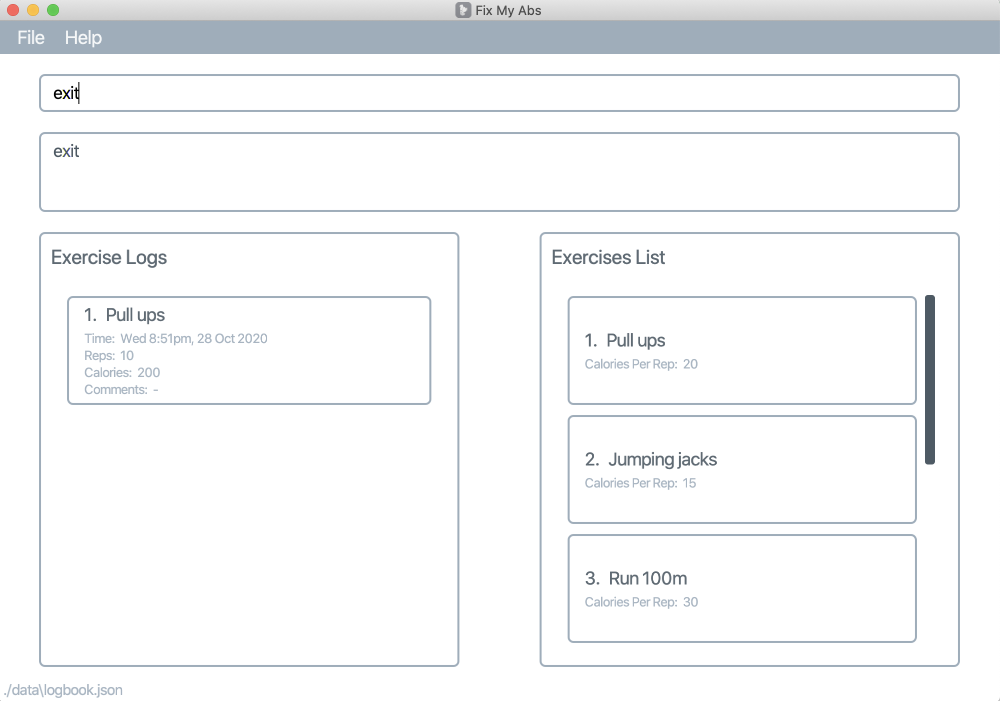

FixMyAbs is a desktop app for managing exercises, optimized for use via a Command Line Interface (CLI) while still having the benefits of a Graphical User Interface (GUI). If you are unmotivated for a workout, FixMyAbs will be your partner in helping you to change your life. 😎

- Table of Contents
  {:toc}

---

## Quick start

1. Ensure you have Java `11` or above installed in your Computer.

1. Download the latest `fixmyabs.jar`.

1. Copy the file to the folder you want to use as the home folder for your FixMyAbs.

1. Double-click the file to start the app. The GUI similar to the below should appear in a few seconds. Note how the app contains some sample data. 
   

1. Type the command in the command box and press Enter to execute it. e.g. typing **`help`** and pressing Enter will open the help window. 
   Some example commands you can try:

   - **`list`** : List the exercises

   - **`add e/situp r/10 c/this is a comment`** : Adds a sit-up exercise log of 10 reps, with a comment of "this is a comment", to the FitMyAbs record.

   - **`edit`**`4 c/no abs were hurt` : Edits the log at index 4, with a comment of no abs were hurt.

   - **`delete 3`** : Deletes the 3rd workout.

   - **`exit`** : Exits the app.

1. Refer to the [Features](#features) below for details of each command.

---

## Features

**:information_source: Notes about the command format:** 

- Words in `<>` are the parameters to be supplied by the user. 
  e.g. in `add e/<exercise>`, `exercise` is a parameter which can be used as `add e/push dow`.

- Items in square brackets are optional. 
  e.g `e/<exercise> c/[comments]` can be used as `e/situp c/my abs hurt` or as `e/situp`.

- Parameters can be in any order. 
  e.g. if the command specifies `e/<exercise> r/<rep>`, `r/<rep>`, `e/<exercise>` is also acceptable.

### Viewing help : `help`

Shows a message explaning how to access the help page.

Format: `help`

### Adding a log: `add`

Adds an exercise log.

- Exercise must be found in the list of exercise and match the exercise name exactly (case-sensitive)

Format: `add e/<exercise> r/<reps> c/<comment>`

Examples:

- `add e/situp r/1 c/my abs hurt :(`

Success:

### Listing logs : `list`

Shows a list of all logs logged by the user in the application.

Format: `list`

### Editing a log : `edit`

Edits an existing log in the application.

Format: `edit <index> r/[reps] c/[comment]]`

- Edits the existing log at the specified `<index>`. The index refers to the index number shown in the displayed log list. The index **must be a positive integer** 1, 2, 3, …​
- At least one of the optional fields must be provided.
- Existing values will be updated to the input values.

Examples:

- `edit 1 c/no abs were hurt` Edits the log at index 1, with a comment of `no abs were hurt`.
- `edit 1 r/20 c/no abs were hurt` Edits the log at index 1, with reps of `20` and a comment of `no abs were hurt`.

Success:

### Deleting a log : `delete`

Deletes the specified log.

Format: `delete <index>`

- Deletes the log at the specified `<index>`.
- The index refers to the index number shown in the list of logs.
- The index **must be a positive integer** 1, 2, 3, …​

Examples:

- `list` followed by `delete 2`deletes the 2nd log.

Success:

### Finding a log : `find`

Finds all logs that have specified word in its name.

Format: `find <word in log name>`

Success:

### Adding an exercise: `addex`

Adds an exercise.

Format: `addex e/<exercise> c/<calories per rep>`

- Calories per rep would be used to calculate the calories burnt for each log

Success:

### Exiting the program : `exit`

Exits the program.

Format: `exit`

### Saving the data

Exercise log data are saved in the hard disk automatically after any command that changes the data. There is no need to save manually.

---

## FAQ

**Q**: Why can I only track sit-ups? 
**A**: first iteration of FixMyAbs and it only supports sit-ups. In future versions, more types of exercises will be supported.

**Q**: How do I transfer my data to another Computer? 
**A**: Install the app in the other computer and overwrite the empty data file it creates with the file that contains the data of your previous FixMyAbs home folder.

---

## Command summary

| Action     | Format                                    | Examples                                  |
| ---------- | ----------------------------------------- | ----------------------------------------- |
| **Add**    | `add e/<exercise> r/<reps> c/<comments>`   | e.g. `add e/situp r/30 c/Send help`       |
| **Delete** | `delete <index>`                            |   e.g. `delete 3`                      |
| **Edit**   | `edit <index> r/[reps] c/[comment]`         |   e.g.`edit 1 r/20 c/no abs were hurt` |
| **List**   | `list`                                    |
| **Find**   | `find`                                    |   e.g.`find pushups`                   |
| **Exit**   | `exit`                                    |
