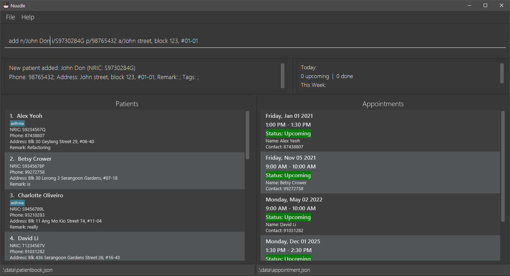
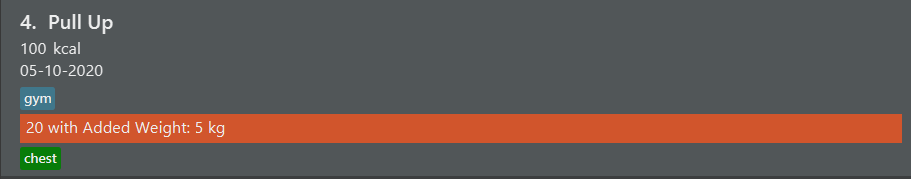
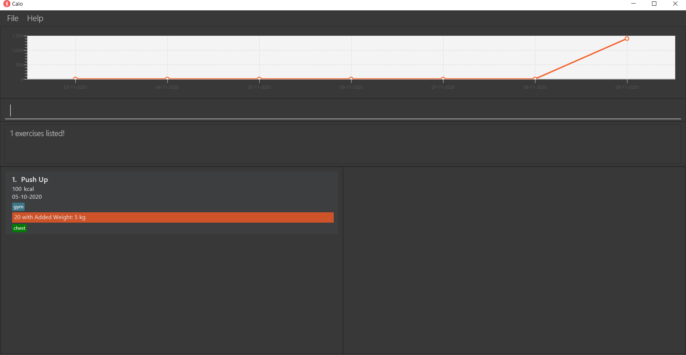
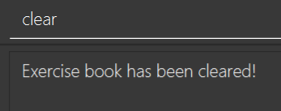

`Calo` is a desktop app that is **designed for keeping track of calories burnt throughout the day**.
It is optimized for use via a **Command Line Interface (CLI)** while still having Graphical User Interface (GUI).
If you are a skilled typer, you can carry out various tasks such as adding new exercises and checking records for
previous days much faster than the traditional GUI apps.

- [2. Quick start](#2-quick-start)
- [3. Features](#3-features)
  - [3.1. Understanding the display](#31-understanding-the-display)
  - [3.2. Add exercises : `add`](#32-add-exercises--add)
  - [3.3. Update exercises : `update`](#33-update-exercises--update)
  - [3.4. Delete : `delete`](#34-delete--delete)
  - [3.5. List: `list`](#35-list-list)
  - [3.6. Find exercises: `find`](#36-find-exercises-find)
  - [3.7. Clearing all entries : `clear`](#37-clearing-all-entries--clear)
  - [3.8. Exiting the program : `exit`](#38-exiting-the-program--exit)
  - [3.9. Save](#39-save)
  - [3.10. Archive : `archive`](#310-archive--archive)
  - [3.11. Recall : `recall`](#311-recall--recall)
  - [3.12. Add templates : `create`](#312-add-templates--create)
  - [3.13. Add an exercise using template : `addt`](#313-add-an-exercise-using-template--addt)
  - [3.14. View Help: `help`](#314-viewing-help--help)
  - [3.15 Add an goal : `goal`](#315-creates-a-goal-goal)
- [4. FAQ](#4-faq)
- [5. Command summary](#5-command-summary)

# 2. Quick start

1. Ensure you have Java `11` or above installed in your Computer.

2. Download the latest `Calo.jar` from [here](https://github.com/AY2021S1-CS2103T-W17-2/tp/releases).

3. Copy the file to the folder you want to use as the _home folder_ for your `Calo`.

4. Double-click the file to start the app. The GUI similar to the below should appear in a few seconds.
   Note how the app contains some sample data.
      
    
5. Type the command in the command box and press Enter to execute it. For the details of each command, refer to the Features below.

---

# 3. Features

 
**:information_source: Notes about the command format:  **

* Words in `UPPER_CASE` are the parameters to be supplied by the user.  
  e.g. in `add e/EXERCISE c/CALORIES`, `EXERCISE` is a parameter which can be used as `add e/Push Up c/1000`.

* Items in square brackets are optional.
  e.g `e/EXERCISE c/CALORIES [at/DATE]` can be used as `e/Push Up c/1000 at/29-09-2020` or as `e/Push Up c/1000`.

* Items with `…`​ after them can be used multiple times including zero times.
  e.g. `[t/TAG]…​` can be used as ` ` (i.e. 0 times), `t/gym`, `t/school t/house` etc.

* Parameters can be in any order.
  e.g. if the command specifies `e/EXERCISE c/CALORIES`, `c/CALORIES e/EXERCISE` is also acceptable.

## 3.1. Understanding the Display

`Calo` has a simplisitc but powerful Gui that is designed with you in mind.   
The following diagram illustrates the name of each Gui component and how they are useful for you.

.png)

## 3.2. Add exercises : `add`

Adds an exercise to the application, with date, calories burnt, muscles worked and tags as optional.
Notices how the exercise appears at the end of the list and the result bar will show the equivalent weight that you burnt.
If you have set a goal for the day, it will also tell you how much more calories to burn to achieve your goal.

Format: `add n/EXERCISE d/DESCRIPTION [at/DATE] [c/CALORIES] [m/MUSCLE] [t/TAG]...`

- The format for the DATE should be in the form of DD-MM-YYYY.
- If DATE is not provided, the default date will be the current day.
- Exercises are uniquely identified by names, descriptions, dates, and tags. Duplicate exercises cannot be added to `Calo`. You may consider including additional information in description (e.g. 2nd time) if you want to do the same exercise more than once a day.

Examples:
- `add n/running d/10 mins at/31-12-2020 c/100 m/chest m/arm t/home t/gym`

## 3.3. Update exercises : `update`

Updates an existing exercise.

Format: `update INDEX [n/EXERCISE] [d/DESCRIPTION] [at/DATE] [c/CALORIES] [m/MUSCLE]... [t/TAG]...`
- Edits the workout at the specified `INDEX`. The index refers to the index number shown in the displayed workout list. The index **must be a positive integer** 1, 2, 3, …​
- **At least one** of the optional fields must be provided.
- Existing values of the exercise will be updated to the input values.
- When editing tags/muscles, the existing tags/muscles of the exercise will be removed i.e adding of tags/muscles is not cumulative.
- You can remove all the exercise/muscle's tags by typing t/ or m/ respectively (without specifying any tags after it).
- For all other fields, supplying an empty value will result in an error message.

- `update 1 n/Push up d/30 at/09-07-2020 c/260 m/chest m/arm t/home t/gym` Updates the exercise, the description, the date, calories burnt, muscles worked, and tags of the 1st exercise to be `push up`, `30`,  `09-07-2020`, `260`, `[chest, arm]`, and `[home, gym]` respectively.
- `update 1 m/` will remove all the previous muscle tags from the 1st exercise.
- `update 1 n/` will result in an error since the name of the 1st exercise is blank.

For this command, `update 4 n/Push Up`, the exercises will be changed as follow.

### Before

### After

## 3.4. Delete : `delete`
Deletes an exercise that a user has previously added.

Format: `delete INDEX`

- Deletes an exercise at the specified `INDEX`.
- The index refers to the index number shown in the displayed workout list.
- The index must be a positive integer: 1, 2, 3, …​

Example:
- `delete 4` Deletes the second exercise in the displayed list. Result can be seen below.

### Before

### After

## 3.5. List: `list`
Lists out all the exercises that the user has keyed in.

Format: `list`

## 3.6. Find exercises: `find`
Finds exercises that match all the input fields in the Exercsie Panel.

Format: `find [n/EXERCISE] [d/DESCRIPTION] [at/DATE] [c/CALORIES] [k/KEYWORD...]`
- For name, description, date, and calories, only exercises that exactly match the inputs will be listed. These fields are case-insensitive. e.g. `Run` will match `run`.
- For keywords, exercises whose names or descriptions contain any of the keywords will be listed. Only full words will be matched e.g. `run` will not match `running`. Keyword is case-insensitive. e.g `Squats` will match `squats`.
- If both name/description and keywords are provided, only exercises that match both inputs will be listed.
- in v1.4, find command does not support muscles and tags.

Example:
- `find n/Push Up` will return the result below, when there is only one matching `Push Up`.

## 3.7. Clearing all entries : `clear`

Clears all entries from the Exercise book.

Format: `clear`

## 3.8. Exiting the program : `exit`

Exits the program.

Format: `exit`

## 3.9. Save
The application will save the data automatically to the default file path after any command that changes the data. There is no need to save the data manually.

## 3.10. Archive : `archive`
Archive the data into a different file location.

Format: `archive f/FILE_LOCATION/FILE_NAME.json`  
The format of the file location accept both Absolute and Relative Path.
The file name must ends with the extension `.json`

You should see the following response in the [Response Box](#31-understanding-the-display)

[Archive Message](images/ArchiveMessage.png)

Examples:
- `archive f/data/file_name.json`
- `archive f/C:/Users/user_name/Desktop/FILE_NAME.json`

 
:information_source: Notes about the command format:

* **Absolute Path:** 
  Path that contains root element, e.g. C:\Users\user_name\Desktop\FILE_NAME.json

* **Relative Path:**
  Path will take reference from the file that contains **Calo.jar** For example, if `Calo` is inside
  the `C:/Users/UserName/App` and the user entered `data\archived_file.json` as the destination, the archived file will be
  at `C:/Users/UserName/App/data/archived_file.json`

## 3.11. Recall : `recall`
Recalls the most recent exercise with the specified name.

Format: `recall EXERCISE`
- the name of exercise is case-insensitive. e.g. `push up` will match `PUSH UP`.
- Only exercises that are on or before the current day will be listed. Exercises with future dates will not be recalled.

Example:
- `recall Pull Up` finds the most recent exercise with the name `Pull Up`. In the following example,
there is two of such exercise on '09-11-2020' and '05-10-2020' so only the former is shown.

### Before Recall Command

### After Recall Command

## 3.12. Add templates : `create`
Adds an exercise template.

Format: `create n/NAME d/DESCRIPTION c/CALORIES [m/MUSCLES] [t/TAGS]`

Examples:  
- `create n/pushup c/100` Creates the exercise template with the name push up, description half an hour and calories 100
and will be shown in the Template Panel.

## 3.13. Add an exercise using template : `addt`
Adds an exercise using template.

Format: `addt temp/NAME d/DESCRIPTION at/DATE [c/CALORIES] [m/MUSCLES] [t/TAGS]`
- The format for the DATE should be in the form of DD-MM-YYYY.  

- The user can input calorie value, muscles or tags to overwrite the default value defined by the template. If the user inputs no calories, then the exercise will have the default value in the template.

Examples: 
- `addt temp/pushup d/half an hour at/09-06-2020` Creates the exercise using the template called pushup with the date 09-06-2020, description half an hour and default calories 100.
- `addt temp/pushup d/half an hour at/09-07-2020 c/260` Creates the exercise using the template called pushup with the date 09-07-2020, description half an hour and calories 260.

For the last example of command, this will be the result.

## 3.14. Viewing help : `help`

Shows a message that explans how to access the help page.

Format: `help`

## 3.15. Creates a goal: `goal`

Creates a goal of calories to be burnt on a particular date.
- The format for the DATE should be in the form of DD-MM-YYYY.

- The format for the CALORIES should be an integer.

- Aside from an Exercise Book the application contains a goalBook. A goalBook 
will help you create a goal of the number of calories to be burnt on a particular date.

- Adding exercises on a particular date with goal will update your goal for that day accordingly.

Format:goal `c/CALORIES at/DATE`

Examples: 

-  `goal c/69 at/09-11-2020`  Creates a goal of 69 calories to be burnt on 09-11-2020.
-  `goal c/420 at/23-12-2023` Creates a goal of 420 calories to burnt on 23-12-2023

---
## 4. FAQ

*Q*: How do I transfer my data to another Computer? 
*A*: Download `Calo` on your new computer. Transfer the `data` file from your old computer to your new folder.

*Q*: How to load my archived file? 
*A*: For now, you can delete the `testing.json` file in the `data` folder and rename the archived file of your choices to `testing.json`. In subsequent updates, we will introduce a command to load archived files via Command Line Interface.

---

## 5. Command summary

| Action     | Format, Examples                                                                                                                                                      |
| ---------- | --------------------------------------------------------------------------------------------------------------------------------------------------------------------- |
| *Add*    | `add n/EXERCISE d/DESCRIPTION [at/DATE] [c/CALORIES] [m/MUSCLES_WORKED] [t/TAG]..`   e.g., `add n/running d/10 mins at/31-12-2020 c/100 m/chest,arm t/home t/gym` |
| *Addt*     | `addt temp/EXERCISE at/DATE [c/CALORIES]`   e.g., `addt temp/pushup d/half an hour at/09-07-2020 c/260` |
| *Archive*   | `archive f/FILE_LOCATION`      e.g.,`archive data\file_name.txt`        
| *Clear* | `clear`|
| *Create*   | `create n/EXERCISE c/CALORIES`   e.g., `create n/pushup c/100`
| *Delete* | `delete INDEX`  e.g., `delete 2`     |                                                                                                                              |
| *Exit* | `exit`|
| *Find*  | `find [n/EXERCISE] [d/DESCRIPTION] [at/DATE] [c/CALORIES] [k/KEYWORD...]`  e.g., `find n/running`                                                                                                            |
| *Goal* | `goal c/CALORIES at/DATE` |
| *Help* | `help`|
| *List*   | `list`     |
| *Recall*   | `recall EXERCISE`   e.g.,`recall running` 
| *Update*   | `update INDEX [n/EXERCISE] [d/DESCRIPTION] [at/DATE] [c/CALORIES]​ [m/MUSCLES_WORKED] [t/TAG]..`  e.g., `update 1 n/Push up d/30 at/09-07-2020 c/260 m/chest,arm t/home t/gym`                                           |
 
