## Reeve - User Guide

**Table of Contents**
- [1. Introduction](#1-introduction)
  * [1.1 About Reeve](#11-about-reeve)
  * [1.2 Understanding the User Guide](#12-understanding-the-user-guide)
- [2. Quick start](#2-quick-start)
  * [2.1 Setting up Reeve](#21-setting-up-reeve)
  * [2.2 Making sense of Reeve's layout (By: Alex Chua)](#22-making-sense-of-reeves-layout-by-alex-chua)
- [3. Features](#3-features)
  * [3.1 Understanding the command format](#31-understanding-the-command-format)
  * [3.2 General features](#32-general-features)
    + [3.2.1 Viewing help: `help`](#321-viewing-help-help)
    + [3.2.2 Toggling between academic and administrative details: `toggle` (By: Hogan)](#322-toggling-between-academic-and-administrative-details-toggle-by-hogan)
    + [3.2.3 Exiting the program: `exit`](#323-exiting-the-program-exit)
  * [3.3 Features for managing student administrative details](#33-features-for-managing-student-administrative-details)
    + [3.3.1 Adding a student: `add` (By: Hogan)](#331-adding-a-student-add-by-hogan)
    + [3.3.2 Listing all students: `list`](#332-listing-all-students-list)
    + [3.3.3 Editing a student: `edit` (By: Vaishak)](#333-editing-a-student-edit-by-vaishak)
    + [3.3.4 Locating students: `find` (By: Choon Siong)](#334-locating-students-find-by-choon-siong)
    + [3.3.5 Deleting a student: `delete`](#335-deleting-a-student-delete)
    + [3.3.6 Sorting the list of students: `sort` (By: Choon Siong)](#336-sorting-the-list-of-students-sort-by-choon-siong)
    + [3.3.7 Finding students with overdue fees: `overdue` (By: Ying Gao)](#337-finding-students-with-overdue-fees-overdue-by-ying-gao)
    + [3.3.8 Managing details for a student: `detail` (By: Vaishak)](#338-managing-details-for-a-student-detail-by-vaishak)
        + [3.3.8.1 Adding a detail: `detail add`](#3381-adding-a-detail-detail-add)
        + [3.3.8.2 Editing a detail: `detail edit`](#3382-editing-a-detail-detail-edit)
        + [3.3.8.3 Deleting a detail: `detail delete`](#3383-deleting-a-detail-detail-delete)
    + [3.3.9 Viewing lesson schedule: `schedule` (By: Alex Chua)](#339-viewing-lesson-schedule-schedule-by-alex)
    + [3.3.10 Clearing all entries: `clear`](#3310-clearing-all-entries-clear)
  * [3.4 Features for managing student academic details](#34-features-for-managing-student-academic-details)
    + [3.4.1 Recording questions from a student: `question` (By: Ying Gao)](#341-recording-questions-from-a-student-question-by-ying-gao)
        + [3.4.1.1 Adding a question: `question add`](#3411-adding-a-question-question-add)
        + [3.4.1.2 Resolving a question: `question solve`](#3412-resolving-a-question-question-solve)
        + [3.4.1.3 Deleting a question: `question delete`](#3413-deleting-a-question-question-delete)
    + [3.4.2 Recording exams of a student: `exam` (By: Hogan)](#342-recording-exams-of-a-student-exam-by-hogan)
        + [3.4.2.1 Adding an exam record to a student: `exam add`](#3421-adding-an-exam-record-to-a-student-exam-add)
        + [3.4.2.2 Deleting an exam record for a student: `exam delete`](#3422-deleting-an-exam-record-for-a-student-exam-delete)
        + [3.4.2.3 Viewing exam statistics of a student: `exam stats`](#3423-viewing-exam-statistics-of-a-student-exam-stats)
    + [3.4.3 Recording attendance of a student: `attendance` (By: Vaishak)](#343-recording-attendance-of-a-student-attendance-by-vaishak)
        + [3.4.3.1 Adding an attendance record to a student: `attendance add`](#3431-adding-an-attendance-record-to-a-student-attendance-add)
        + [3.4.3.2 Deleting an attendance record for a student: `attendance delete`](#3432-deleting-an-attendance-record-for-a-student-attendance-delete)
  * [3.5 Notebook feature (By: Choon Siong)](#35-notebook-feature-by-choon-siong)
    + [3.5.1 Adding a note: `note add`](#351-adding-a-note-note-add)
    + [3.5.2 Editing a note: `note edit`](#352-editing-a-note-note-edit)
    + [3.5.3 Deleting a note: `note delete`](#353-deleting-a-note-note-delete)
- [4. Command summary](#4-command-summary)
- [5. Glossary](#5-glossary)
- [6. FAQ](#6-faq)

## 1. Introduction
**Welcome to Reeve!**

### 1.1 About Reeve
Are you looking for a one-stop application that can handle all your private tutoring needs? Then you are in luck!

**Reeve** is a desktop application for **private tutors to better manage both administrative and academic details of their students**, optimised for use via a
**Command Line Interface (CLI)** for receiving inputs while still having the benefits of a **Graphical User Interface (GUI)** for displaying information. In addition, **Reeve** comes with a customisable personal scheduler to assist you keeping track of your classes. **Reeve** also allows you to set timely reminders for yourself.

Get to experience all the above without even having to move your mouse at all!

Also, did we mention that you are able to achieve all the above **without internet access at all**?

If you are a private tutor that wants to not only manage your students' administrative details with ease but to also better meet their needs, then **Reeve** is made for you!

Let's dive into the User Guide to find out more!

### 1.2 Understanding the User Guide
The goal of this User Guide is to provide you with the information on how to utilise **Reeve** to its fullest.

For those who are unfamiliar with what a CLI is, no worries! This User Guide will ensure that you will be able to understand how to use a CLI by the end of it.

Here is a summary (Table 1) of the symbols that are used in this User Guide:

Table 1: Summary of symbols

Symbol | Meaning
:-----:|:-------
`USER_INPUT` | User input into the CLI
:information_source: | Important information
:warning: | Warnings

## 2. Quick start
This section serves to explain how to set up **Reeve** on your computer and how to make sense of the visual layout of the application.

### 2.1 Setting up Reeve
1. Ensure you have Java 11 or above installed in your Computer.

1. Download the latest .jar file from [here](https://github.com/AY2021S1-CS2103T-W15-2/tp/releases).

1. Copy the file to the folder you want to use as the _home folder_ for **Reeve**.

1. Double-click the file to start the app. The GUI similar to the below figure (Figure 1) should appear in a few seconds. Note how the app contains some sample data.

1. Type the command in the command box and press Enter to execute it. e.g. typing **`help`** and pressing Enter will open the help window. 
   Some example commands you can try:

   * **`list`** : Lists all students.

   * **`add`**`n/Alex p/93211234 s/Commonwealth Secondary School y/Primary 6 v/Blk 33 West Coast Rd #21-214
   t/1 1430-1630 f/25 d/12/12/2020` : Adds a student named `Alex` to **Reeve**.

   * **`delete`**`3` : Deletes the 3rd student shown in the current list.

   * **`clear`** : Deletes all students.

   * **`exit`** : Exits **Reeve**.

1. Refer to the [Features](#3-features) section below for details of each command.

Figure 1: <strong>Reeve</strong> GUI
 

### 2.2 Making sense of Reeve's layout (By: Alex Chua)

This section serves to help you understand the layout of **Reeve**. Please refer to the figure below (Figure 2) for help.

Figure 2: <strong>Reeve's</strong> Layout
 

1. **Menu**

    These tabs allows you to simply click on them and get what is needed.

2. **Main Panel**

    The main panel shows your list of students for easy reference. You could also view your schedule in this panel.

3. **Result Display**

    The result display is where Reeve provides responses to your commands.

4. **Notes Panel**

    The notes panel displays all your notes that you have added.

5. **Command Box**

    The command box allows you to type any commands that is accepted in Reeve.

## 3. Features

This section serves to provide you a detailed explanation of how the various features of **Reeve** work and how to use these features.

### 3.1 Understanding the command format

The following points explain how to make sense of the command format:

* Words in `UPPER_CASE` are the parameters to be supplied by the user. 
  e.g. in `add n/NAME`, `NAME` is a parameter which can be used as `add n/John Doe`.

* Items in square brackets are optional. 
  e.g `n/NAME [a/DETAIL_TEXT]` can be used as `n/John Doe a/Likes to read books` or as `n/John Doe`.

* Items with `…`​ after them can be used multiple times including zero times. 
  e.g. `[a/DETAIL_TEXT]…​` can be used as ` ` (i.e. 0 times), `a/Likes to read books`, `a/Likes sweets a/Needs help with Algebra` etc.

* Parameters can be in any order. 
  e.g. if the command specifies `n/NAME p/PHONE_NUMBER`, `p/PHONE_NUMBER n/NAME` is also acceptable.

### 3.2 General features

This section serves to provide you a detailed explanation of the general features which will help you to maximise the potential of **Reeve**.

#### 3.2.1 Viewing help: `help`

If you are unsure of any of the commands, this command will direct you to the help page.

Format: `help`

Expected outcome:

The following figure (Figure 3) shows the help window entering the command `help`.

Figure 3: Help window

#### 3.2.2 Toggling between academic and administrative details: `toggle` (By: Hogan)

Since each student contains some administrative and academic details, this command allows you to
toggle between viewing these details to allow you to focus on the type of details that you are currently interested in.
By default, the administrative details of students are shown upon starting the application.

Format: `toggle`

Example:
* By default, you should see the administrative details of your students.
    * If you have not entered the `toggle` command, you should see a screen similar to the one below (Figure 4).

    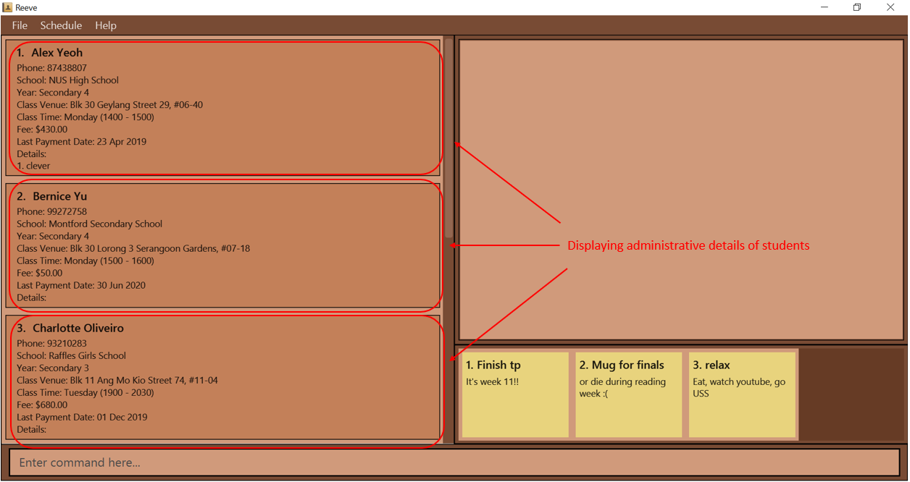
    
Figure 4: Before entering toggle command
 

    * After entering the `toggle` command, you will switch to displaying academic details of students as shown below (Figure 5).

    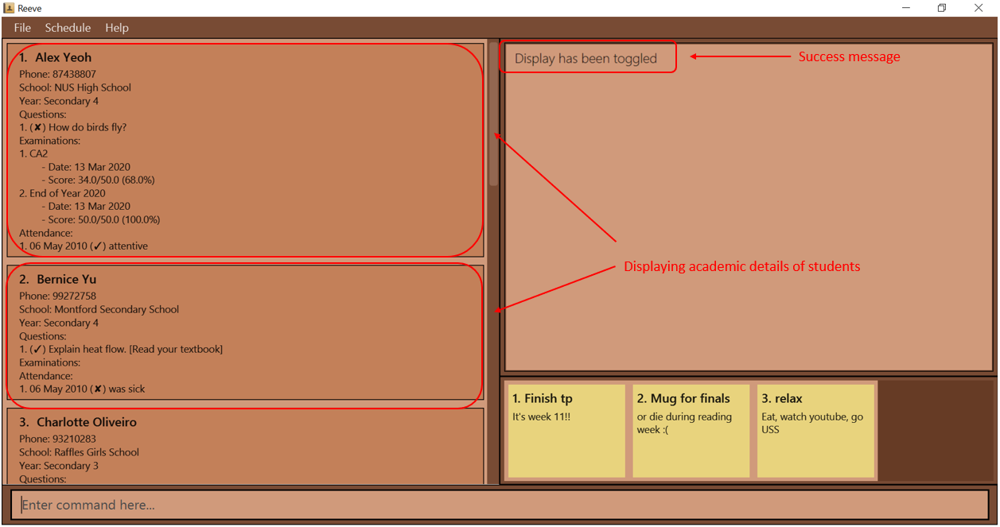
    
Figure 5: After entering toggle command
 
    
#### 3.2.3 Exiting the program: `exit`

You can exit the program with the `exit` command. Any changes you have made to **Reeve** is automatically saved to your drive, so do not have to worry about losing data.

Format: `exit`

### 3.3 Features for managing student administrative details

Reeve's student administrative features allows you to keep track of key administrative details of each of your students such as phone number, class venue, tuition fee, etc.
Thereafter, you will be able to view, edit find or delete these students.

#### 3.3.1 Adding a student: `add` (By: Hogan)

You can add a student together with his/her administrative details into **Reeve's** student list. 

Format: `add n/NAME p/PHONE s/SCHOOL y/YEAR v/CLASS_VENUE t/CLASS_TIME [f/FEE] [d/LAST_PAYMENT_DATE] [a/ADDITIONAL_DETAILS]…​`

* The format of `YEAR` is as follows:
    * `TYPE_OF_SCHOOL LEVEL` (e.g. y/primary 2 and y/p 2 are the same and both acceptable).
    * `TYPE_OF_SCHOOL` accepts Primary (Pri/P), Secondary (Sec/S) or JC (J), and is case-insensitive.
    * `LEVEL` has to be valid for the `TYPE_OF_SCHOOL` (i.e. Primary 1 - Primary 6, Secondary 1 - Secondary 5, JC 1 - JC 2)
* The format of `CLASS_TIME` is as follows:
    * `DAY_OF_WEEK START_TIME-END_TIME`
    * `DAY_OF_WEEK` is any integer from 1 to 7, where 1 refers to Monday while 7 refers to Sunday.
    * `START_TIME` and `END_TIME` follows the 24-hr clock format (e.g. 1300 refers to 1pm).
* The format of `LAST_PAYMENT_DATE` is `dd/mm/yy or dd/mm/yyyy` (e.g. both 3/2/20 and 3/2/2020 are acceptable).
* `FEE` defaults to $0.00 if not included.
* `LAST_PAYMENT_DATE` defaults to today's date if not included.

:information_source: You **cannot** add duplicates of a student. Each student is uniquely identified by his/her `NAME`, `PHONE`, `SCHOOL` and `YEAR`.

:information_source: `LAST_PAYMENT_DATE` **cannot** be a future date (i.e. cannot be later than the current date)

:information_source: The specified `END_TIME` for the `CLASS_TIME` field **should not** be before the `START_TIME` (e.g. `1300-1200` is invalid).

Examples:
* Suppose you want to add a student without any additional details.
    * You can use something like `add n/Brendan Tan p/93211234 s/Commonwealth Secondary School y/pri 6 v/Blk 33 West Coast Rd #21-214 t/5 1430-1630 f/25 d/10/10/2020`.
    * You should see a screen similar to the one shown below (Figure 6).

    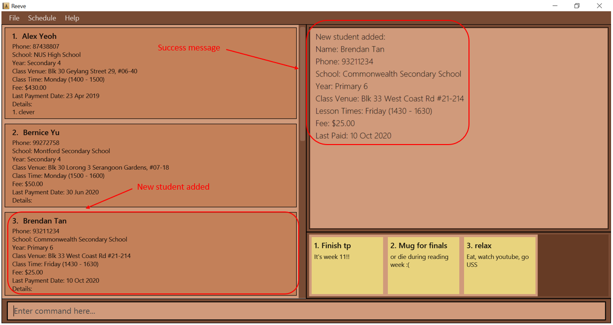
    
Figure 6: After entering add command
 

* Also, if you want to add a student with multiple additional details.
    * You can use something like `add n/John Doe p/98765432 s/Woodlands Secondary School y/s 2 v/347 Woodlands Ave 3, Singapore 730347 t/1 1200-1400 f/30 d/24/09/2020 a/Likes chocolates a/Needs help with Algebra`

#### 3.3.2 Listing all students: `list`

You can view the list of all students in **Reeve** sorted by name.

Format: `list`

:information_source: You will need to use this if you wish to view the full student list after using commands such as `find`, `overdue` and `schedule`.

#### 3.3.3 Editing a student: `edit` (By: Vaishak)

You can edit an existing student in **Reeve** if you need to update his/her particulars.

Format: `edit STUDENT_INDEX [n/NAME] [p/PHONE] [s/SCHOOL] [y/YEAR] [v/CLASS_VENUE] [t/CLASS_TIME] [f/FEE] [d/LAST_PAYMENT_DATE]`

* Edits the student at the specified `STUDENT_INDEX`. The `STUDENT_INDEX` refers to the index number shown in the displayed student list. The index **must be a positive integer** 1, 2, 3, …​
* At least one of the optional fields must be provided.
* Existing values will be updated to the input values.
* The format of `CLASS_TIME`, `YEAR` and `LAST_PAYMENT_DATE` follows that as stated in the [add command section](#331-adding-a-student-add-by-hogan).

:information_source: If using this command after `find`, the edited student may no longer satisfy the search criteria depending on the field changed.
In that case the student will be hidden from view and can be viewed again using `list` or `find`. 

E.g. `edit 1 n/Amy Choo` after `find n/Bob` will cause the student to be hidden since her name no longer contains "Bob".
You can use `list` or `find` (e.g `find n/Amy`) to display her information again.

:warning: You cannot add additional details with this command.

Examples:
*  `edit 1 n/Arthur p/98727030 s/Meridian Junior College` edits the name, phone number and school of the 1st student to be `Arthur`, `98727030` and `Meridian Junior College` respectively.

Expected outcome:
The following figure (Figure 7) shows the expected outcome after executing the above example.

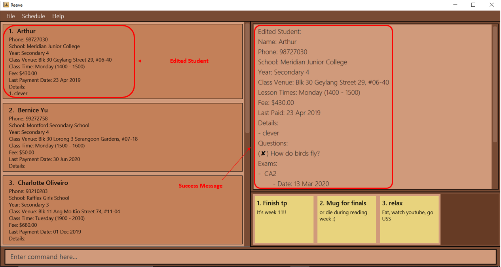

Figure 7: After entering edit command
 

#### 3.3.4 Locating students: `find` (By: Choon Siong)

You can search for students who satisfy the given search criteria.

Format: `find [n/NAME] [s/SCHOOL] [y/YEAR]`

* The search is case-insensitive. e.g `hans` will match `Hans`
* At least one of the optional fields must be provided.
* The order of the optional fields do not matter. e.g `n/Hans s/River Valley` is the same as `s/River Valley n/Hans`
* For the name criteria, only students with a name that contains **any full keyword** specified will be matched.
* For the school criteria, only students with a school that contains **all keywords** specified will be matched.
* For the year criteria, only students with the **same year** will be matched. (See below for more elaboration for format of year)
* Only students matching all criteria specified will be returned (i.e `AND` search).

Examples:
* `find n/Alex david` matches `Alex David`, `alex david` and `Alex david`.
* `find n/Alex david` does not match `Alexis Davinder`.
* `find s/yishun sec` matches `Yishun Secondary School`, `Yishun Town Secondary School` and `Yishun Sec`.
* `find s/yishun secondary` matches `Yishun Secondary School` and `Yishun Town Secondary School` but not `Yishun Sec`.
* `find n/alex s/yishun y/sec 3` searches for all students who match all of `n/alex`, `s/yishun` and `y/sec 3`.

#### 3.3.5 Deleting a student: `delete`

You can delete a specified student from **Reeve** to allow you to get rid of any unwanted student data.

Format: `delete STUDENT_INDEX`

* Deletes the student at the specified `STUDENT_INDEX`.
* `STUDENT_INDEX` refers to the index number shown in the displayed students list.

:information_source: `STUDENT_INDEX` **must be a positive integer** 1, 2, 3, …​

Examples:
* `list` followed by `delete 2` deletes the 2nd student in **Reeve**.
* `find n/Betsy` followed by `delete 1` deletes the 1st student in the results of the `find` command.

#### 3.3.6 Sorting the list of students: `sort` (By: Choon Siong)

You can sort your student list by a specified means of comparison. The means of comparison must be the student's name, class time or year.
This is useful in situations where you want to look at your student list differently for various reasons. 

Format: `sort COMPARISON_MEANS`

* The valid options for `COMPARISON_MEANS` are `name`, `classTime` or `year`.
* Only one option for the means of comparison can be specified.
* The means of comparison is case-sensitive when being specified
* means of comparison:
	* `name`: Sorts students by their name in case-insensitive alphabetical order. This is useful when you want to search through your student list easily.
	* `classTime`: Sorts students by the day of their class followed by its time. This is useful when you want to look at your student list in order of upcoming classes.
	* `year` Sorts students by their year with `Primary 1` coming first and `JC 2` last. This is useful when you want to group students by their year.

Examples:
* `sort name` to sort students by their name in alphabetical order

#### 3.3.7 Finding students with overdue fees: `overdue` (By: Ying Gao)

You can find all students whose date of last payment is more than a month ago.

Format: `overdue`

* Students tutored for free (i.e. `FEE` = $0.00) will not be displayed.
* If all students have paid their fees within the past month, no students will be displayed.

:warning: If you use `edit` to update a student's last payment date to within a month from now, the student will be hidden from the list as his payment is no longer outstanding.
You can always view his particulars again using `list` or `find`. The same also applies if you edit his fee to $0.00.

Expected outcome:

The following figure (Figure 8) shows the expected result after entering the command `overdue`.

Figure 8: After entering overdue command
 

#### 3.3.8 Managing details for a student: `detail` (By: Vaishak)

You can add, edit or delete a detail for a specified student.

General Format: `detail COMMAND_WORD STUDENT_INDEX PARAMETERS`

* The `COMMAND_WORD` field accepts either `add`, `edit` or `delete`.
* The command affects the student at the specified `STUDENT_INDEX`.
* The format of `PARAMETERS` varies with each `COMMAND_WORD` as explained below.

:information_source: `STUDENT_INDEX` **must be a positive integer** 1, 2, 3, …​

#### 3.3.8.1 Adding a detail: `detail add`

You can add a detail to a specified student in **Reeve**.

Format: `detail add STUDENT_INDEX t/DETAIL_TEXT`

* Adds the detail to the student at the specified `STUDENT_INDEX`.

Examples:
* `detail add 1 t/Smart` adds the "Smart" detail to the 1st student in **Reeve**.

Expected outcome:
The following figure (Figure 9) shows the expected outcome after executing the above example.

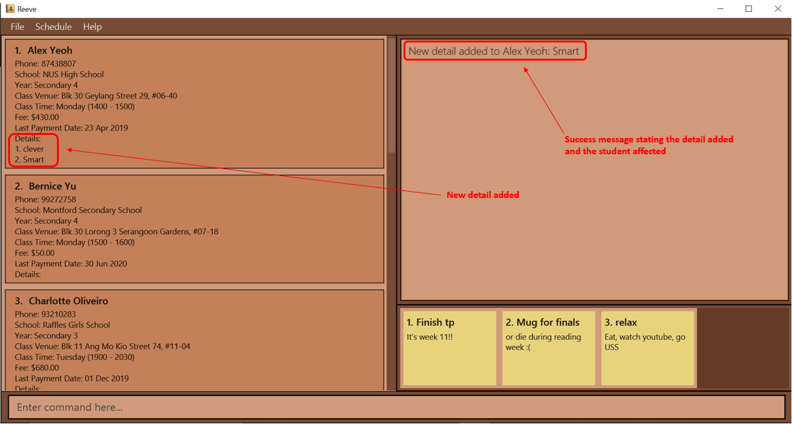

Figure 9: After entering add detail command
 

#### 3.3.8.2 Editing a detail: `detail edit`

You can edit an existing detail for a specified student in **Reeve**.

Format: `detail edit STUDENT_INDEX i/DETAIL_INDEX t/DETAIL_TEXT`

* Edits the detail at the specified `DETAIL_INDEX` for the student at the specified `STUDENT_INDEX`.
* `DETAIL_INDEX` refers to the index of the detail to edit, within the detail field of the student.
* There has to be a valid detail at the `DETAIL_INDEX` provided.

Examples:
* `detail edit 1 i/2 t/Handsome` edits the 2nd detail for the 1st student in **Reeve**, to "Handsome".

Expected outcome:
The following figure (Figure 10) shows the expected outcome after executing the above example.

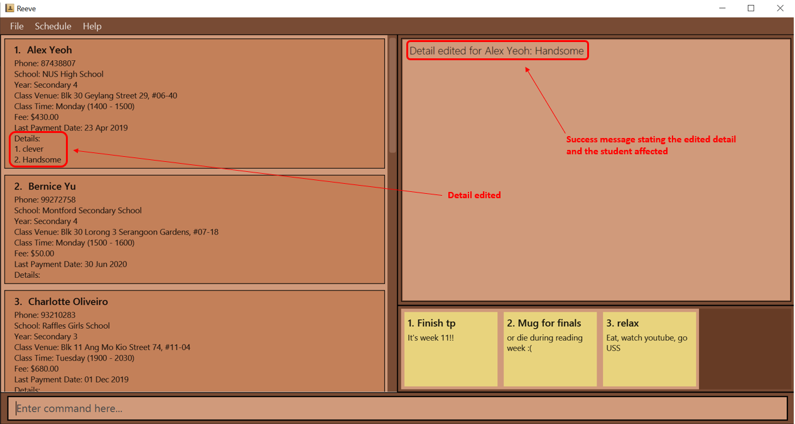

Figure 10: After entering edit detail command
 

#### 3.3.8.3 Deleting a detail: `detail delete`

You can delete an existing detail to a specified student in **Reeve**.

Format: `detail delete STUDENT_INDEX i/DETAIL_INDEX`

* Deletes the detail at the specified `DETAIL_INDEX` for the student at the specified `STUDENT_INDEX`.
* `DETAIL_INDEX` refers to the index of the detail to delete, within the detail field of the student.
* There has to be a valid detail at the `DETAIL_INDEX` provided.

Examples:
* `detail delete 1 i/1` deletes the 1st detail for the 1st student in **Reeve**.

Expected outcome:
The following figure (Figure 11) shows the expected outcome after executing the above example.

Figure 11: After entering delete detail command
 

#### 3.3.9 Viewing lesson schedule: `schedule` (By: Alex)

You can view your classes on a timetable in either a daily or weekly format.

Format: `schedule m/VIEW_MODE d/DATE_TO_VIEW`

*  Displays a timetable view of your classes with the corresponding student's name tagged to it.
* `DATE_TO_VIEW` refers to the date you wish to view the lesson schedule of.
*  The format of `DATE_TO_VIEW` is `dd/mm/yy or dd/mm/yyyy` (e.g. both 3/2/20 and 3/2/2020 are acceptable).
* `VIEW_MODE` refers to the mode where you would like the schedule to be rendered on screen.
   It accepts either `weekly` or `daily` as inputs and is case-insensitive.

Example:

Suppose you have multiple classes in the coming week of 2nd November 2020 and you want to plan for them ahead.

Instead of scrolling through your student details to find out who you have classes with,
you can simply type `schedule m/weekly d/02/11/2020` to view them in a visual interface.

To view schedule:

1.  Type `schedule m/weekly d/02/11/2020` into the command box as shown in Figure 12 . Press `Enter` to execute the command.

    
    
Figure 12: Shows the schedule command input keyed into the command box
 

2.  The schedule panel, as labelled in Figure 13, will appear with all your classes for the week of 2nd November 2020 populated.

    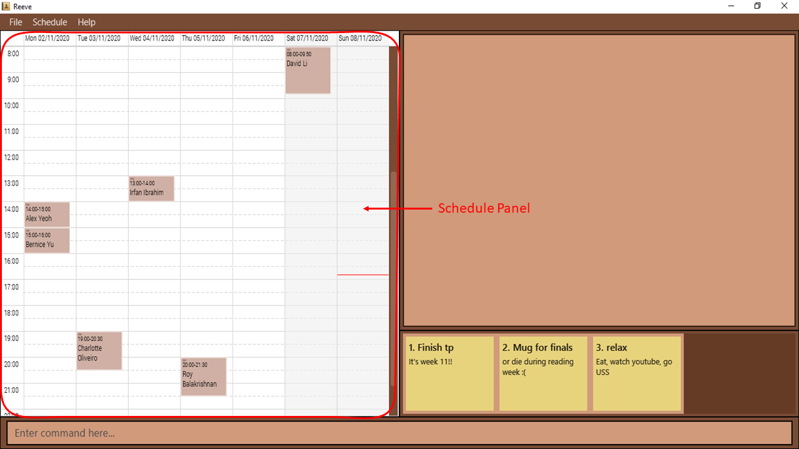
    
Figure 13: Shows the schedule panel in the weekly format
 

3.  You can easily view you classes for the week. The Date bar labelled in the Figure 14 below shows the day of the week as well as the date for your reference.
    The Time bar in Figure 14 shows the time in 24-hour clock format with 1-hour intervals. 
    The Classes labelled in Figure 14 are colored brown to match the color of Reeve for a better visual experience.
    Furthermore, the name of the student that you are tutoring during that slot will be labelled for you to identify classes easily.
    The red bar in Figure 14 indicates your current time.
    With the date, time and name of student shown in one view, you could plan your classes without a hassle.

    
    
Figure 14: Shows various component of your schedule
 

:information_source: You could also click on the **Schedule** tab in the **Menu** to open or close the schedule. 
Viewing it this way would open up your schedule of the current week in the weekly format.
You could use this as quick way to open up schedule for the current week.

:warning: A class duration of less than an hour may not be shown fully on the schedule.

#### 3.3.10 Clearing all entries: `clear`

If you ever need to clear all existing data in **Reeve**, you can do so using this command.

Format: `clear`

### 3.4 Features for Managing Student Academic Details

Reeve's student academics features allows you to keep track of key academic details of each of your students such as questions, exams and etc.
Thereafter, you will be able to view, edit or delete these details of each student.

#### 3.4.1 Recording questions from a student: `question` (By: Ying Gao)

You can add, resolve or remove questions to/from a specified student in **Reeve**.

General Format: `question COMMAND_WORD STUDENT_INDEX DETAILS`

* The `COMMAND_WORD` field accepts either `add`, `solve` or `delete`.
* The command affects the student at the specified `STUDENT_INDEX`, which is his/her position on the list.
* The format of `DETAILS` varies with each command word as explained below.

:information_source: `STUDENT_INDEX` **must be a positive integer** 1, 2, 3, …​

##### 3.4.1.1 Adding a question: `question add`

If a student asks you a difficult question, you can record it in **Reeve** and find the answer to it after the lesson.

Format: `question add STUDENT_INDEX t/QUESTION_TEXT`

* This records a new unresolved question to the student at the specified `STUDENT_INDEX`.
* The `QUESTION_TEXT` field refers to the question the student raised, and can be a full sentence.

:information_source: `QUESTION_TEXT` must not be empty.

Example:
* `question add 1 t/How do birds fly?` records "How do birds fly?" as a question from the 1st student in **Reeve**.

Expected outcome:

The following figure (Figure 15) shows the result of recording "How do I pass CS2101?" as a new question from Bernice Yu.

Figure 15: After entering add question command
 

##### 3.4.1.2 Resolving a question: `question solve`

After finding the solution to the question, you can mark the student's question as resolved.

Format: `question solve STUDENT_INDEX i/QUESTION_INDEX t/SOLUTION_TEXT`

* This resolves the question from the student at the specified `STUDENT_INDEX`
* This resolves the question at the `QUESTION_INDEX`. The `QUESTION_INDEX` refers to the position of the question in the student's list of questions.

:information_source: `QUESTION_INDEX` **must be a positive integer** 1, 2, 3, …​

:information_source: `SOLUTION_TEXT` must not be empty.

:information_source: You can only resolve unanswered questions (i.e. questions with a cross symbol next to it).

Example:
* `question solve 1 i/1 t/Read a book.` marks the 1st question of the 1st student in **Reeve** as answered.

Expected outcome:

The following figure (Figure 16) shows the result of resolving Bernice's second question.

Figure 16: After entering solve question command
 

##### 3.4.1.3 Deleting a question: `question delete`

If you do not need a student's question anymore, you can delete it.

Format: `question delete STUDENT_INDEX i/QUESTION_INDEX`

* This deletes the question at the specified `QUESTION_INDEX`.

:information_source: `QUESTION_INDEX` **must be a positive integer** 1, 2, 3, …​

Example:
* `question delete 1 i/1` deletes the 1st question of the 1st student in **Reeve**.

Expected outcome:

The following figure (Figure 17) shows the result of deleting Bernice's second question.

Figure 17: After entering delete question command
 

#### 3.4.2 Recording exams of a student: `exam` (By: Hogan)

You can add or delete an exam record to/from a specified student. You can then view the exam statistics of a student in the form of a
score percentage to exam date line graph. This helps you to keep track of your students academic progress allowing you to take note of those who are
not doing too well. 

General Format: `exam COMMAND_WORD_EXAM STUDENT_INDEX PARAMETERS`

* The `COMMAND_WORD_EXAM` field accepts either `add`, `delete` or `stats`.
* The command can affect the student at the specified `STUDENT_INDEX`.
* `STUDENT_INDEX` refers to the index number shown in the displayed students list.
* The format of `PARAMETERS` varies with each command word as explained in the following subsections.

:information_source: `STUDENT_INDEX` **must be a positive integer** 1, 2, 3, …​

##### 3.4.2.1 Adding an exam record to a student: `exam add`

You can add an exam record to a specified student in **Reeve** to keep track of your students' academic progress.

Format: `exam add STUDENT_INDEX n/EXAM_NAME d/EXAM_DATE s/EXAM_SCORE`

* Adds the given exam record to the student at the specified `STUDENT_INDEX`.
* The format of `EXAM_DATE` is `dd/mm/yy or dd/mm/yyyy` (e.g. both 3/2/20 and 3/2/2020 are acceptable).
* The format of `EXAM_SCORE` is as follows:
    * `MARKS/TOTAL_SCORE` where `MARKS` and `TOTAL_SCORE` are non-negative numbers.
    * `MARKS` has to be less than or equal to `TOTAL_SCORE` (e.g. 30/50).
    

:information_source: Scores and score percentages will be rounded off to two decimal places.

:information_source: You **cannot** add duplicates of an exam record to a student. Each exam record is uniquely identified by its `EXAM_NAME`.

Example:
* Suppose you want to add a exam record to a student to monitor his academic progress.
    * You can use `exam add 1 n/Mid Year 2020 d/08/12/2020 s/40/60` to add a new exam record to the first student in the displayed student list on the main panel
    with exam name `Mid Year 2020`, exam date `08/12/2020` and score `40/60` so that you can keep track of this particular exam record.
    * You should see a screen similar to the one below (Figure 18) after entering the above command.

    
    
Figure 18: After entering add exam command
 

##### 3.4.2.2 Deleting an exam record for a student: `exam delete`

You can delete a specific exam record from a specified student in **Reeve** to remove any unwanted exam record data.

Format: `exam delete STUDENT_INDEX i/EXAM_INDEX`

* Deletes the exam at `EXAM_INDEX` in the specified student's exam records list.
* The specified exam record is chosen based on `EXAM_INDEX`. 
* The `EXAM_INDEX` refers to the index number shown in the displayed student's exam records list.

:information_source: `EXAM_INDEX` **must be a positive integer** 1, 2, 3, …​

Example:
* Suppose you have an outdated exam record or an exam record with wrong details such as the exam date or score and you wish to remove this exam record.
    * For instance, if your current list looks similar to the figure below (Figure 19).

    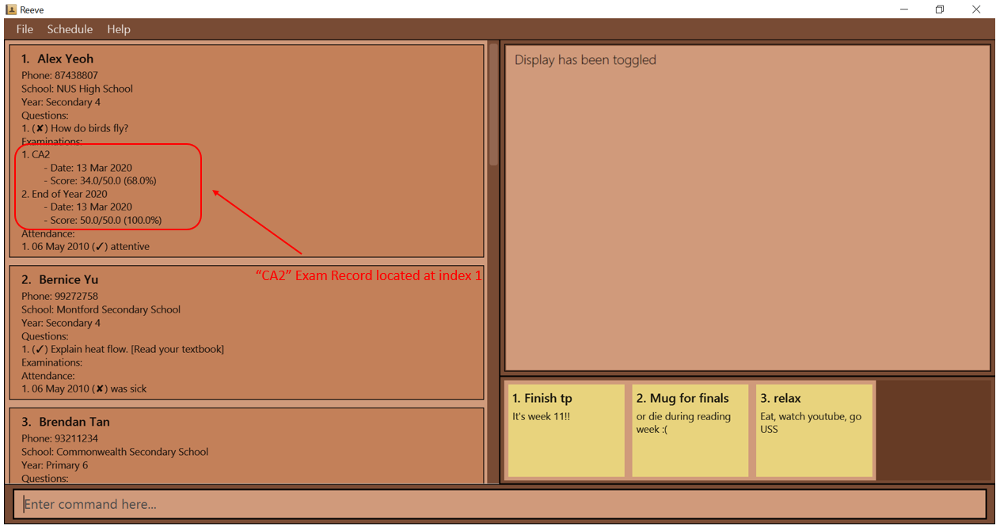
    
Figure 19: Before entering delete exam command
 

    * You can use `exam delete 1 i/1` to delete the first exam record on the first student in the displayed student list on the main panel. 
    * You should see that you have successfully deleted the first exam record of the first student as shown below (Figure 20) after entering the above command.

    
    
Figure 20: After entering delete exam command
 

##### 3.4.2.3 Viewing exam statistics of a student: `exam stats`

To gauge how one of your students are doing with their examinations, this command allows you to view a graphical
representation of all recorded examinations in the form of a exam score percentage to exam date line graph. 

Format: `exam stats STUDENT_INDEX`

* Views exam statistics of the student at the specified `INDEX`.

:information_source: Exam records are arranged in order of increasing date.

Examples:
* Suppose you are trying to view the exam statistics of a particular student to view his academic progress so far in terms of his exam scores.
    * You can use `exam stats 1` to view the exam statistics of the first student in the displayed student list on the main panel.
    * You should see a screen similar to the one below (Figure 21) when the above command is entered.

    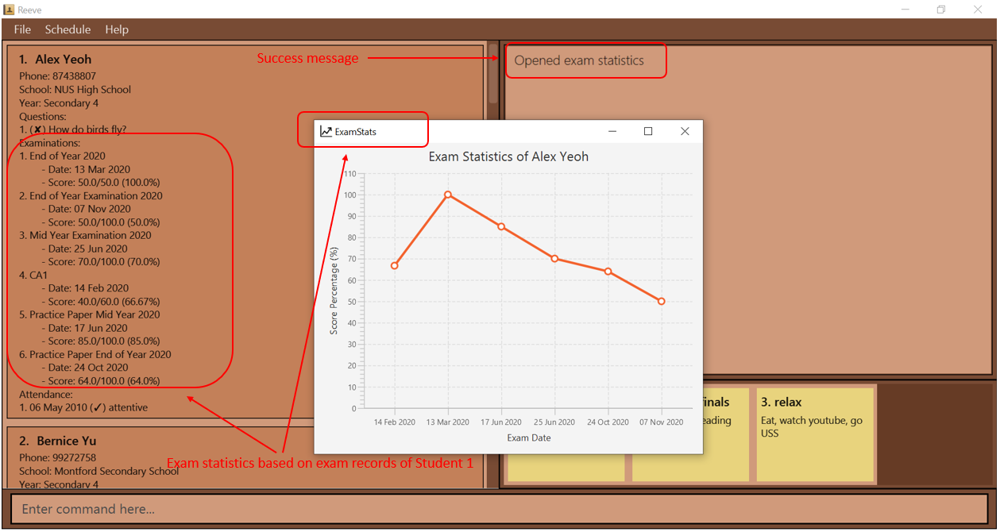
    
Figure 21: Before entering exam stats command
 

:information_source: If you are editing the exams of a student, you will have to enter the `exam stats` command again to get the updated statistics.

#### 3.4.3 Recording attendance of a student: `attendance` (By: Vaishak)

You can add or delete an attendance record to/from a specified student.

General Format: `attendance COMMAND_WORD STUDENT_INDEX PARAMETERS`

* The `COMMAND_WORD` field accepts either `add` or `delete`.
* The command affects the student at the specified `STUDENT_INDEX`.
* `STUDENT_INDEX` **must be a positive integer** 1, 2, 3, …​
* The format of `PARAMETERS` varies with each command word as explained below.

##### 3.4.3.1 Adding an attendance record to a student: `attendance add`

You can add an attendance record to a specified student in **Reeve**.

Format: `attendance add STUDENT_INDEX d/LESSON_DATE a/ATTENDANCE_STATUS [f/FEEDBACK]`

* Adds the given attendance record to the student at the specified `STUDENT_INDEX`.
* There can only be one attendance record for every `LESSON_DATE`.
* The format of `LESSON_DATE` is `dd/mm/yy or dd/mm/yyyy` (e.g. both 3/2/20 and 3/2/2020 are acceptable).
* `ATTENDANCE_STATUS` can only be either "present" or "absent".

Examples:
* `attendance add 1 d/31/10/2020 a/absent` adds to the 1st student in **Reeve** a new attendance record for a
lesson on 31 Oct 2020, where he was absent, and the tutor has no feedback for him.

Expected outcome:
The following figure (Figure 22) shows the expected outcome after executing the above example.

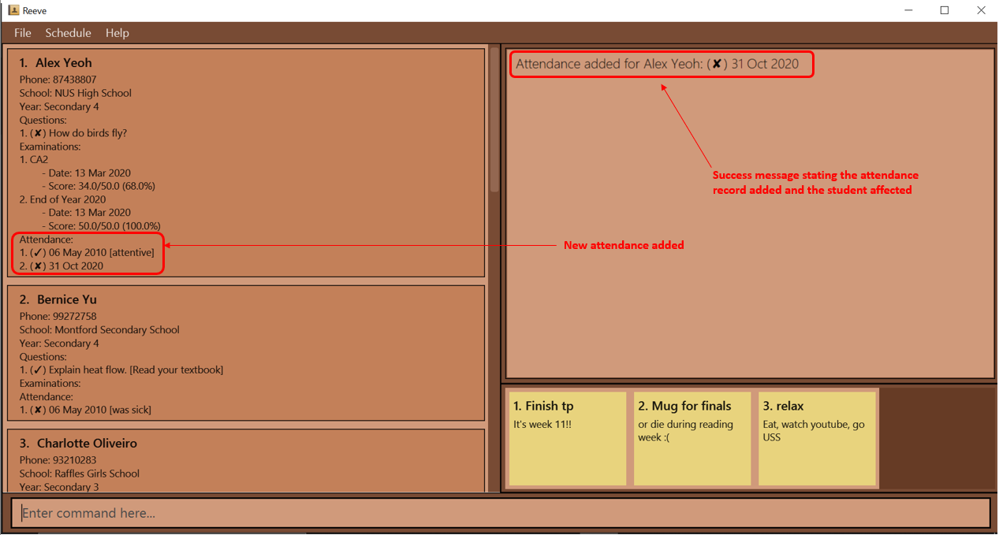

Figure 22: After entering add attendance command
 

##### 3.4.3.2 Deleting an attendance record for a student: `attendance delete`

You can delete a specific attendance record from a specified student in **Reeve**.

Format: `attendance delete STUDENT_INDEX d/ATTENDANCE_DATE`

* Deletes the attendance record with the given `ATTENDANCE_DATE` in the specified student.
* The specified student is chosen based on `STUDENT_INDEX` of **Reeve**.

Example:
* `attendance delete 1 d/06/05/2010` deletes the attendance with the date 6 Apr 2020 from the 1st student in the displayed students list in **Reeve**.

Expected outcome:
The following figure (Figure 23) shows the expected outcome after executing the above example.

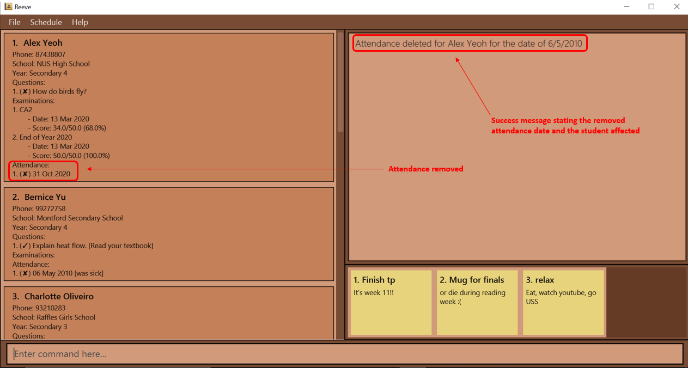

Figure 23: After entering delete attendance command
 

### 3.5 Notebook feature (By: Choon Siong)

You can store notes containing small amounts of information inside the notebook. This is useful when you want to store information or details that is not related to any student and cannot do so anywhere else in Reeve.
You should see the notes on the bottom right hand side of Reeve similar to the display shown below (Figure 24).

Figure 24: Location of notes panel
 

#### 3.5.1 Adding a note `note add`

You can add a note to the notebook for the information you want to store.

Format: `note add t/TITLE d/DESCRIPTION`

* `TITLE` is any string of up to 15 characters.
* `DESCRIPTION` is any string of up to 80 characters.

Example:
* You have just collected a stack of practice papers from your students and want to do something else before marking them but are scared you might forget. 
  
    * You can use `note add t/things to do d/mark practice papers` to add a new note with title `things to do` and description `mark practice papers` so that you can remind yourself later.
     
    * You should see a screen similar to the screen below (Figure 25) when the above command is entered.
    
    
    
Figure 25: After entering add note command
 

#### 3.5.2 Editing a note `note edit`

You can edit a note that is inside the notebook to update the information inside.

Format: `note edit NOTE_INDEX [t/TITLE] [d/DESCRIPTION]`

* Edits the note at the specified `NOTE_INDEX`

Example:
* You left a note to mark practice papers earlier and have just finished marking them. Now, before you take a break,
  you want to remind yourself to review the marking before you can give it back to your students.
    * Assuming the previous note was the first note, you can use `note edit 1 d/review marking`
       to change the note to remind yourself to review the marking.
   
#### 3.5.3 Deleting a note `note delete`

You can delete a note from the notebook when the information is no longer needed.

Format: `note delete NOTE_INDEX`

* Deletes the note at the specified `NOTE_INDEX`

Example:
* Your first note was to remind yourself to grab a cup of coffee. Now that you have bought your cup of coffee, the note is no longer needed.
    * You can use `note delete 1` to delete the note.

## 4. Command summary

This following table (Table 2) provides a summary of all the commands in **Reeve**.

Table 2: Summary of commands in **Reeve**

Action | Format, Examples
--------|------------------
**Add Student** | `add n/NAME p/PHONE s/SCHOOL y/YEAR v/CLASS_VENUE t/CLASS_TIME f/FEE d/LAST_PAYMENT_DATE [a/ADDITIONAL_DETAILS]...​`   e.g. `add n/John Doe p/98765432 s/Woodlands Secondary School y/Secondary 2 v/347 Woodlands Ave 3, Singapore 730347 t/1 1200-1400 f/30 d/24/09/2020 a/Likes chocolates a/Needs help with Algebra`
**Edit Student** | `edit STUDENT_INDEX [n/NAME] [p/PHONE] [s/SCHOOL] [y/YEAR] [v/CLASS_VENUE] [t/CLASS_TIME] [f/FEE] [d/LAST_PAYMENT_DATE]`   e.g. `edit 1 n/Arthur p/98727030 s/Meridian Junior College`
**Find Student** | `find [n/NAME] [s/SCHOOL] [y/YEAR]`  e.g. `find n/alex s/yishun`
**List Students** | `list`
**Delete Student** | `delete STUDENT_INDEX`  e.g. `delete 3`
**Sort Students** | `sort COMPARISON_MEANS`  e.g. `sort year`
**Overdue** | `overdue unpaid`
**Add Detail** | `detail add STUDENT_INDEX t/DETAIL_TEXT`  e.g. `detail add 1 t/Smart`
**Edit Detail** | `detail edit STUDENT_INDEX i/DETAIL_INDEX t/DETAIL_TEXT`  e.g. `detail edit 1 i/2 t/Handsome`
**Delete Detail** | `detail delete STUDENT_INDEX i/DETAIL_INDEX`  e.g. `detail delete 1 i/3`
**Clear** | `clear`
**Add Question** | `question add STUDENT_INDEX t/QUESTION`  e.g. `question add 1 t/How do birds fly?`
**Resolve Question** | `question solve STUDENT_INDEX i/QUESTION_INDEX t/SOLUTION`  e.g. `question solve 1 i/1 t/Read a book.`
**Delete Question** | `question delete STUDENT_INDEX i/QUESTION_INDEX`  e.g. `question delete 1 i/1`
**Add Exam** | `exam add STUDENT_INDEX n/EXAM_NAME d/EXAM_DATE s/EXAM_SCORE`  e.g. `exam add 1 n/Mid Year 2020 d/08/12/2020 s/40/60`
**Delete Exam** | `exam delete STUDENT_INDEX i/EXAM_INDEX`  e.g. `exam delete 2 i/5`
**Exam Stats** | `exam stats STUDENT_INDEX`  e.g. `exam stats 1`
**Add Attendance** | `attendance add STUDENT_INDEX d/LESSON_DATE a/ATTENDANCE_STATUS [f/FEEDBACK]`  e.g. `attendance add 2 d/08/12/2020 a/present f/attentive`
**Delete Attendance** | `attendance delete STUDENT_INDEX d/ATTENDANCE_DATE`  e.g. `attendance delete 1 d/19/04/2020`
**Schedule View** | `schedule m/VIEW_MODE d/DATE_TO_VIEW`   e.g. `schedule m/weekly d/02/11/2020`
**Toggle View** | `toggle`
**Add Note** | `note add t/TITLE d/DESCRIPTION` e.g. `note add t/things to do d/buy coffee` 
**Edit Note** | `note edit NOTE_INDEX [t/title] [d/DESCRIPTION]` e.g. `note edit 1 d/mark practice papers` 
**Delete Note** | `note delete NOTE_INDEX` e.g. `note delete 1` 
**Help** | `help`
**Exit** | `exit`

## 5. Glossary

The following table (Table 3) provides the definitions of the various terms used in this User Guide.

Table 3: Glossary of terms

Term | Definition
--------|------------------
Administrative Details | Details such as class venue, class time, tuition fee, last payment date and other details
Academic Details | Details such as questions, exam records and attendance records
Detail | Any miscellaneous information regarding a student
Exam Record | A record of an exam which includes its name, date and the student's score
Index | Position of an item in a list (1, 2 3 etc)

## 6. FAQ
This section provides the answers to Frequently Asked Questions (FAQ) by users.

1. How do I transfer my data to another Computer? 
Install the app in the other computer and overwrite the empty data file it creates with the file that contains the data of your previous **Reeve** home folder.

2. Do I have to manually save my data? 
Reeve automatically saves data in the hard disk automatically after any command that changes the data. There is no need to save manually.

3. How do I view the full details of my student? 
Type `toggle` and press `Enter`, your student's full details will be displayed.
To hide the full details of students, type `toggle` and press `Enter` again.

4. Where can I find the file that contains my student's data? 
Your student's data file can be found in the same file as the application.

5. How can I set the application window to a fix size whenever I open it? 
**Reeve** automatically save your preferred window size when you close it.
Hence, you could adjust the window size to your preferred one before closing Reeve.
**Reeve** will automatically open according to this size.

6. I forgot what are the various commands and their format, where can I find the list of commands? 
Simply enter the `help` command, and you will be directed the list of commands.

7. I accidentally deleted all my data, is there a way to recover my past data? 
Unfortunately, **Reeve** currently does not support a backup feature and is unable to recover any deleted data. The backup feature will be coming soon. 
In the meantime, we advise you to refrain from accidentally clearing all data, you could perhaps create a backup `json` from time to time. 

