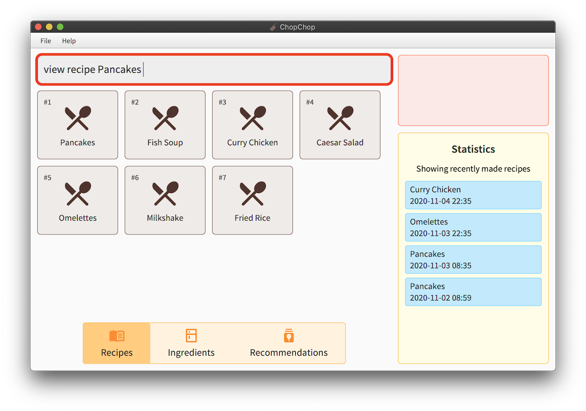
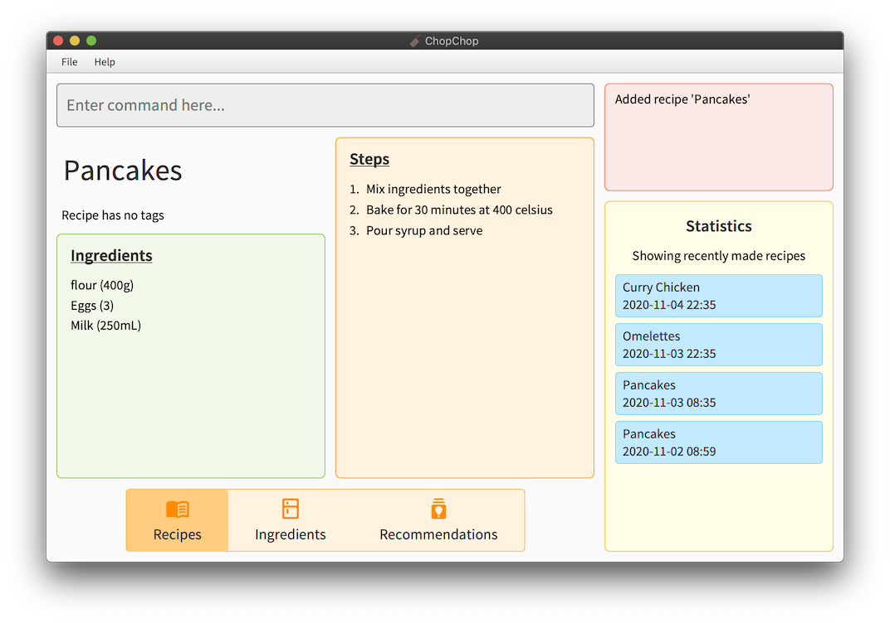
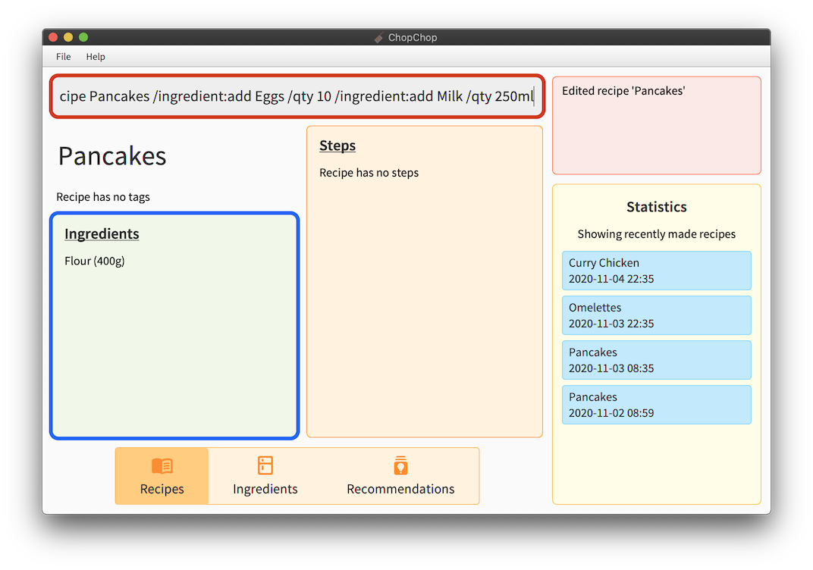
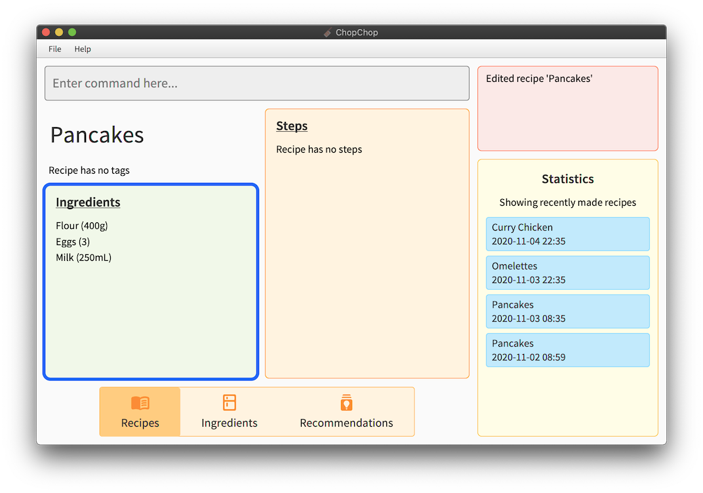
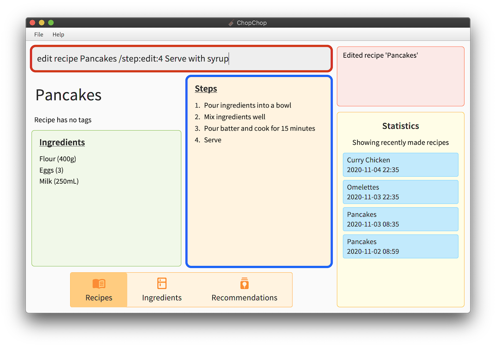
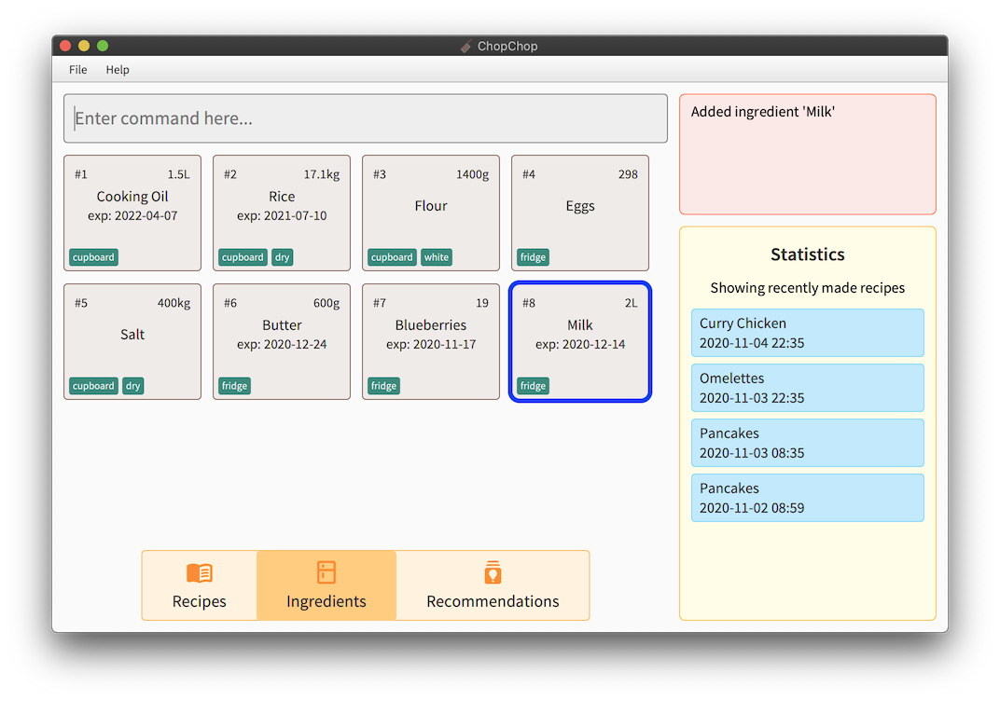
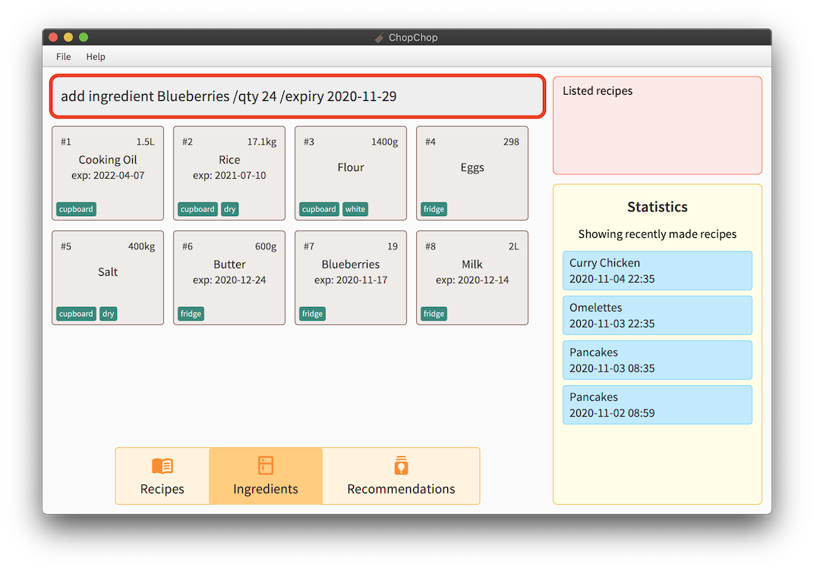
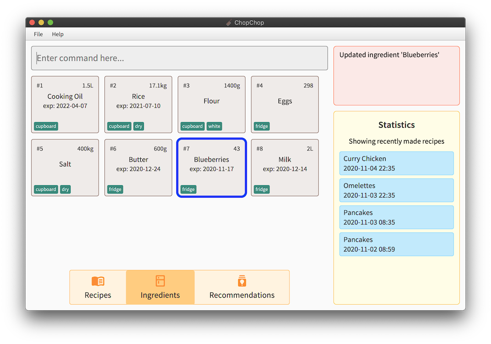

1. Table of Contents
{:toc}

---------------
## Introduction

ChopChop is a food recipe management system, which aims to make it easier for people to manage their recipes and ingredients in an easy and effective manner. It is a *desktop app*, optimised for use through typing textual commands, rather than with a point-and-click graphical user interface (GUI). For fast typists, ChopChop will be able to manage your recipes more efficiently than other applications.

However, ChopChop also features a graphical interface to display ingredients and recipes in an interactive form.

This user guide provides an in-depth guide about how to use ChopChop. Choose a topic from the Table of Contents to find answers, get step-by-step instructions.  In addition, the quick start guide provides an end-to-end setup process to get you started on the ChopChop installation process.

--------------
## Quick start

To start using and experimenting with ChopChop, here are the steps you can follow:

1. Ensure you have Java `11` or above installed in your Computer; it can be obtained from [AdoptOpenJDK](https://adoptopenjdk.net).

2. Download the latest `chopchop.jar` from [here](https://github.com/AY2021S1-CS2103T-T10-3/tp/releases).

3. Copy the file to the folder you want to use as the _home folder_ for your ChopChop.

4. Double-click the file to start the app. The GUI similar to the below should appear in a few seconds. The app starts with some sample data for you to experiment with.<br>

<div style="text-align: center; padding-bottom: 2em">
 <br />
Figure 1.1: <i>The initial state of ChopChop, including sample data</i>
</div>


5. Type the command in the command box and press Enter to execute it. e.g. typing **`help`** and pressing Enter will open the help window.<br>
   Some example commands you can try:

   * **`list recipes`** : Lists recipes.

   * **`add recipe Milkshake /ingredient Milk /qty 500ml /step Pour Milk /step Shake`** : Adds a recipe for making milkshakes, with one ingredient and two steps.

   * **`quit`** : Exits the app.

6. Refer to the [Commands](#commands) below for details of each command.

-----------
## Overview

ChopChop manages two key components — ingredients and recipes, and they will be the main pieces you will interact with in ChopChop. Common to both are names and tags, the latter of which allow you to quickly group related ingredients or recipes together, or to organise them in any way you desire.

Names for both ingredients and recipes are case insensitive, so `pAnCakes` and `Pancakes` refer to the same recipe. Note that you cannot have duplicate recipes nor ingredients in ChopChop; items are duplicates if their names are the same.

### Ingredients
An ingredient consists of a quantity with an associated unit, and an optional expiry date. Each ingredient can have multiple *sets*, where each set is a given quantity of that ingredient, expiring on a certain date.

For example, you might have `500 ml` of milk that you bought last week that expires tomorrow, while you have another `1.5 l` of milk that you bought today, expiring two weeks from now. ChopChop will track both these *sets*, and will intelligently use the earliest-expiring set when doing its accounting.

For a more in-depth look at how ChopChop handles quantities, see [this section](#quantities-and-units).

### Recipes
A recipe consists of a list of used ingredients (and their quantities), as well as a list of steps.


--------------------------------
## Navigating the User Interface

This is what ChopChop looks like:
<div style="text-align: center; padding-bottom: 2em">
 <br />
Figure 1.2: <i>The graphical user interface for ChopChop</i>
</div>

To use ChopChop you can enter commands into the command box as labelled in figure 1.2. 
Start typing anywhere in ChopChop to enter a command; commands entered would cause the state of the GUI to change, and the output will be printed into the command output.

Besides navigating the app through the the command box, our interactive graphical display allows you to view your recipes, ingredients and recipe recommendations through pressing of the buttons at the button of the GUI.
If you wish to view a recipe, you can also click on the recipe tiles.

Also, your cooking statistics will be displayed in the statistics box.
<h3>.</h3>


-----------
## Commands


### Command Syntax

To succinctly represent the syntax of the various commands, we adopt a simple notation in this User Guide, as shown below:

* Words starting with a slash (`/`) denote named parameters; these names are case sensitive (eg. `/STEP` is not the same as `/step`). All the text following a named parameter *belong* to it, until either the end of the input, or the next named parameter. <br />
For example, in `/param1 lorem ipsum /param2 dolor sit amet`, the parameter `param1` will have the value `lorem ipsum`, while the parameter `param2` will have the value `dolor sit amet`.

* Words in angle brackets (eg. `<name>`) denote an input that is provided by *you*, the user. <br />
For example, the **add ingredient** command is specified like this: `add ingredient <name> /qty <quantity> [/expiry <expiry_date>]`; in this case, `<name>`, `<quantity>` and `<expiry_date>` are values that you provide.

* Portions in square brackets (eg. `[/expiry <expiry_date>]`) denote optional parts of the command. In this example, not all ingredients will expire, so the expiry date is optional.

* Portions with trailing ellipses (eg. `(/step <step>)...`) denote commands accepting one or more of the given parameter. In this example, a recipe can have multiple steps, so you can specify multiple `/step` arguments.

* Parentheses are used to group parts of the command together purely for clarity in this document; they must not appear in the typed input. For instance, in `(/step <step>)...`, it is simply used to denote that each step must be preceeded by the `/step` parameter.

* A `<#REF>` refers to an item reference, and is used to refer to either a recipe or an ingredient. It can either be the (case-insensitive) name of the item, or it can be a number prefixed with '#', eg. `#3` to refer to the third item in the list. In the GUI, displayed items are numbered in the corner.

* In general, the order of arguments is important; for example, the order of `/step` determines the order of the steps in the recipe, while a `/qty` in an **add recipe** command must only appear after an `/ingredient`.


### Viewing Help : **`help`**

This command shows a message with a link to this user guide; you can use this to easily access this page from the application. Note that you can also access this help dialog from the menubar at the top, under `Help` -> `Docs`, or by pressing the function key `F1`.

Usage: `help`

<div style="text-align: center; padding-bottom: 2em">
 <br />
Figure 2: <i>The help dialog</i>
</div>


### Quitting ChopChop **`quit`**
This command quits ChopChop. Your recipe data is already saved whenever a command is executed, so you do not need to save it manually before quitting. Note that you can also quit ChopChop by pressing the function key `F4`.

Usage: `quit`


### Viewing Recipes — **`view`**
This command displays a specific recipe from ChopChop. You can either use the name or the number of the recipe to refer to it.

Usage: `view <#REF>`

Examples:
- `view #4` <br />
	This displays the fourth recipe currently shown in the GUI's recipe view.
- `view pancakes` <br />
	This displays the recipe named 'pancakes'. Note that the name here is case insensitive.

To illustrate, in the scenario below, both `#4` and `pancakes` will refer to the same recipe (in this case, the Pancake recipe added in the `add recipe` guide below).
<div style="text-align: center; padding-bottom: 2em">
 <br />
Figure 3.1: <i>The recipe detail view</i>
</div>

After pressing enter, you will see this view, showing the recipe you wish to view:

<div style="text-align: center; padding-bottom: 2em">
 <br />
Figure 3.2: <i>The recipe detail view</i>
</div>


### Listing Recipes — **`list`**`recipes`
This command shows a list of all recipes in ChopChop. This can be used to switch panes (between recipes and ingredients) without using the mouse, as well as to clear any filters that might have been applied due to previous commands (eg. `find` and `filter`).

<div markdown="span" class="alert alert-primary">
:bulb: **Tip:** For convenience, you can use either `list recipes` or `list recipe`.
</div>

Usage: `list recipes`


### Adding Recipes — **`add`**`recipe`
This command adds a recipe to ChopChop, specifying zero or more ingredients, each with an optional quantity, and zero or more steps. After a recipe is added, you will be able to see it immediately in the application.

If an ingredient is specified without a quantity, it is treated *as if* you used `/qty 1`. This works for counted ingredients (eg. eggs), but it will cause errors for other ingredients (eg. volume of milk).

Usage: `add recipe <NAME> [/ingredient <INGREDIENT_NAME> [/qty <QUANTITY>]]... (/step <STEP>)... [/tag <TAG>]...`

Constraints:
- Recipe name should not be empty
- Ingredient names should not be empty
- Steps should not be empty
- Tag names should not be empty

For example, suppose you wanted to add a recipe for pancakes using flour, eggs, and milk, you would type this:
```
add recipe Pancakes
/ingredient flour /qty 400g
/ingredient egg /qty 3
/ingredient milk /qty 250ml
/step Mix ingredients together
/step Bake for 30 minutes at 400 celsius
/step Pour syrup and serve
```
(note that this is displayed on separate lines for clarity, but you should type this in one go)

<div style="text-align: center; padding-bottom: 2em">
 <br />
Figure 4.1: <i>The add recipe command</i>
</div>

After pressing enter, you will see this view, showing your newly created recipe:

<div style="text-align: center; padding-bottom: 2em">
 <br />
Figure 4.2: <i>The recipe detail view</i>
</div>

If you go back to the main recipe view (either by clicking on the tab at the bottom, or by using `list recipes`, you can see the new recipe in the list:

<div style="text-align: center; padding-bottom: 2em">
 <br />
Figure 4.3: <i>The newly created recipe in the recipe list</i>
</div>


### Editing Recipes — **`edit`**`recipe`
This command edits a specific recipe in ChopChop. The `edit recipe` lets you perform different actions on the name, ingredients, steps, and tags, as specified below.

To accomodate the various different kinds of editing operations, ChopChop has special syntax for editing, known as *edit-arguments*, eg. `/step:add`. The component following the colon is the *ACTION*, which can take these values:

- For ingredients and steps, it can either be `add`, `edit`, or `delete`.
- For tags, it can be either `add` or `delete`.


<h4>Name</h4>
If you want to edit a recipe's name, use `/name`, for example `/name new recipe name`.


<h4>Ingredients</h4>
If you want to edit a recipe's ingredients, use `/ingredient` with the corresponding action (eg. `/ingredient:add`).

When adding or editing ingredients, a `/qty` *must* be specified after the ingredient (similar to an `add recipe` command). Here are some examples:

- `/ingredient:add milk /qty 500ml` <br />
  This makes the recipe require 500ml of milk; if the recipe already used milk, then an error is displayed — here, you should use `/ingredient:edit` instead.

- `/ingredient:edit beef /qty 200g` <br />
  This changes the quantity of beef used in the recipe from its previous value, to 200 grams. If the recipe did not use beef as an ingredient, an error is displayed — here, you should use `/ingredient:add` instead.

- `/ingredient:delete carrot` <br />
  This removes carrots from the recipe entirely. If the recipe did not use carrots, then an error is displayed.


<h4>Tags</h4>
If you want to edit the tags for a recipe, use `/tag` with the corresponding action, which are either `add` or `delete`. For example:

- `/tag:add vegetarian` <br />
  This adds the 'vegetarian' tag to the recipe. It is not an error if the recipe already contains this tag.

- `/tag:delete cold` <br />
  This removes the 'cold' tag from the recipe. If the recipe did not have this tag, an error is displayed.


<h4>Steps</h4>
Since steps have a fixed ordering in a recipe, editing them is slightly more involved; when editing or deleting steps, you are required to provide the step number as an additional component in the *edit-argument*, for example `/step:edit:3` edits the third step in the recipe.

When adding a step, the step number is optional; if not specified, the new step will be added at the end. If it is specified, then the new step will be inserted at the corresponding position, and the following steps will be re-numbered.

For example:

- `/step:add Bake for 80 minutes at 400 C` <br />
  This adds a new step at the end of the existing steps of the recipe.

- `/step:edit:4 Bake for 50 minutes at 250 C` <br />
  This changes the content of step number 4, so the cake does not get burnt.

- `/step:delete:1` <br />
  This deletes the first step of the recipe.


<h4>Usage</h4>

Except `/name` (which can only appear once), all of the edit operations described above can appear multiple times, in any order, in a single `edit recipe` command. Each operation is processed sequentially from left-to-right, so if two operations modify the same item, then the second one will take precedence.

(As an example, `/step:edit:3 Bake ... /step:edit:3 Fry` will cause step 3 to be 'Fry')

Usage `edit recipe <#REF> [/name <RECIPE_NAME>] [/ingredient:<ACTION> [<INGREDIENT_NAME> /qty <QUANTITY>]]... [/step:<ACTION>[:<INDEX>] [<STEP>]]... [/tag:<ACTION> [<TAG>]]...`

Examples:
- `edit recipe #4 /name soup` <br />
	This changes the name of the fourth recipe currently shown in the GUI's view to 'soup'.
- `edit recipe pancakes /ingredient:add syrup /qty 500ml` <br />
	This edits the recipe named 'pancakes' by adding 500ml of syrup to the recipe's ingredient list.
- `edit recipe risotto /step:edit:1 In a saucepan, warm the broth over low heat` <br />
    This edits the recipe named 'risotto' by changing the 1st step to the text above.
- `edit recipe beef curry /ingredient:delete apple /step:delete:4` <br />
    This edits the recipe named 'beef curry' to remove both the ingredient 'apple' as well as the 4th step.

To illustrate how to use this powerful command, let us recreate the Pancake recipe from above, but starting from a blank recipe. First, we make the empty recipe using `add recipe Pancakes`:

<div style="text-align: center; padding-bottom: 2em">
 <br />
Figure 5.1: <i>The empty recipe</i>
</div>

Now, let's add our ingredients. First, 400 grams of flour:

<div style="text-align: center; padding-bottom: 2em">
 <br />
Figure 5.2: <i>The command to add a new ingredient to the recipe</i>
</div>

<div style="text-align: center; padding-bottom: 2em">
 <br />
Figure 5.3: <i>The recipe is now updated with the ingredient</i>
</div>

Next, adding the eggs and milk in one go:

<div style="text-align: center; padding-bottom: 2em">
 <br />
Figure 5.4: <i>The edit command supports multiple operations at once</i>
</div>

Oops, that's too many eggs, so let's edit the quantity:

<div style="text-align: center; padding-bottom: 2em">
 <br />
Figure 5.5: <i>Editing an ingredient to change its quantity</i>
</div>

<div style="text-align: center; padding-bottom: 2em">
 <br />
Figure 5.6: <i>The recipe now uses only 3 eggs</i>
</div>

Now let's add the steps:

<div style="text-align: center; padding-bottom: 2em">
 <br />
Figure 5.7: <i>Adding the first step</i>
</div>

<div style="text-align: center; padding-bottom: 2em">
 <br />
Figure 5.8: <i>Adding steps 2 and 3</i>
</div>

<div style="text-align: center; padding-bottom: 2em">
 <br />
Figure 5.9: <i>The completed recipe</i>
</div>

Oh no, if we bake the pancakes (are pancakes baked?) like that, they'll get burnt, so let's fix it:

<div style="text-align: center; padding-bottom: 2em">
 <br />
Figure 5.10: <i>Editing the second step</i>
</div>

<div style="text-align: center; padding-bottom: 2em">
 <br />
Figure 5.11: <i>The actual completed recipe</i>
</div>

And now the pancake recipe is complete.


### Deleting Recipes — **`delete`**`recipe`
This command deletes a specific recipe from ChopChop. You can either use the name or the number of the recipe to refer to it.

Usage: `delete recipe <#REF>`

Examples:
- `delete recipe #4` <br />
	This deletes the fourth recipe currently shown in the GUI's view.
- `delete recipe pancakes` <br />
	This deletes the recipe named 'pancakes'. Note that the name here is case insensitive.

To illustrate, in the scenario below, both `#4` and `pancakes` will refer to the same recipe (in this case, the Pancake recipe added in the `add recipe` guide above).

<div style="text-align: center; padding-bottom: 2em">
 <br />
Figure 6: <i>The recipe number (circled) can be used to refer to an item as well</i>
</div>


### Finding Recipes — **`find`**`recipe`
This command finds all recipes containing the given keywords in the name.

Usage: `find recipe <KEYWORD_ONE> [<KEYWORD_TWO>]...`

Constraints:
- At least one search keyword must be given

Only the recipe name is searched, and only full words are matched, case-insensitively. In the case of multiple search keywords, recipes containing any of those words will be returned.

Examples:
- `find recipe cake` will match **Chocolate Cake** and **Strawberry Cake**, but *not* **Pancakes**.
- `find recipe milk cake` will match **Milk Tea** and **Carrot Cake**.

To illustrate, suppose you want to search for recipes with names containing 'cake', you would use `find recipe cake`:
<div style="text-align: center; padding-bottom: 2em">
 <br />
Figure 7.1: <i>The starting state of the application</i>
</div>

After executing the command, note how the recipe list has changed, showing only the matching recipes, and that item number in the corners have changed as well. As explained above, the 'Pancakes' recipe was not included in this list.

<div style="text-align: center; padding-bottom: 2em">
 <br />
Figure 7.2: <i>The recipes containing 'cake'</i>
</div>

To go back to the full recipe view (resetting the search filter), you can either click the Recipes button at the bottom, or run the `list recipes` command:

<div style="text-align: center; padding-bottom: 2em">
 <br />
Figure 7.3: <i>Back to the main recipe list</i>
</div>


### Filtering Recipes — **`filter`**`recipe`
This command filters all recipes and lists those containing all ingredients and tags specified in the command.

Usage: `filter recipe [</tag TAG_KEYWORDS>] [</ingredient INGREDIENT_KEYWORDS>]...` 
- Keywords do not have to be complete to match the 'tag' or 'ingredient' names.
- Multiple search terms from the same category are allowed. e.g. `/tag movie /tag family`
- Search terms can be placed in any order.
- The filtering is case-insensitive and allows spaces between keywords in a single search term. e.g. `/tag family favourite` is allowed.

Constraints:
- At least one search term must be given, and it should be either `[</tag TAG_KEYWORDS>]` or `[</ingredient INGREDIENT_KEYWORDS>]`.

Examples:
- `filter recipe /tag family reunion` will match **Spring Rolls** and **Hot Pot**, the only recipes with 'tag' **family reunion**.
- `filter recipe /tag snacks /tag sweet` will match **Chocolate Cookie** and **Gummy Bears**, the only recipes with 'tag' **snacks** and 'tag' **sweet**.
- `filter recipe /ingredient egg` will match **Egg Tart** and **Scrambled Eggs**, the only recipes using the 'ingredient' **egg**.
- `filter recipe /ingredient chicken /ingredient cheese /ingredient pineapple` will match **Chicken Quesadilla**, the only recipe containing 'ingredient' **chicken**, **cheese**, and **pineapple**.
- `filter recipe /tag local dish /ingredient chicken /ingredient white rice /tag family favourite` will match **Chicken Rice**, the only recipe that matches all criteria specified.

To illustrate, suppose you want to search for recipes with 'tags' **Christmas** and **home baked** that use the 'ingredient' **Ginger Root**, **Honey** and **Molasses**, you could use `filter recipe /tag christmas /ingredient ginger root /tag home baked /ingredient honey /ingredient molasses`:
<div style="text-align: center; padding-bottom: 2em">
 <br />
Figure 7.1: <i>The starting state of the application</i>
</div>

After executing the command, similar to the effect of **find recipe** command, the recipe list has changed, showing only the matching recipe, **gingerbread man**.

<div style="text-align: center; padding-bottom: 2em">
 <br />
Figure 7.2: <i>The recipe matching all criteria provided</i>
</div>

Again, to reset the search filter or go back to the full recipe view, you can click the Recipes button or run the `list recipes` command.


### Listing Ingredients — **`list`**`ingredients`
This command shows a list of all recipes in ChopChop. As with the `list recipes` command, you can use this command to switch between panes without clicking, or to reset any filters.

<div markdown="span" class="alert alert-primary">
:bulb: **Tip:** For convenience, you can use either `list ingredients` or `list ingredient`.
</div>

Usage: `list ingredients`


### Adding Ingredients — **`add`**`ingredient`
This command adds an ingredient to ChopChop, with an optional quantity and expiry date. If the quantity is not specified, ChopChop will infer a single unitless ingredient, like eggs. If the expiry date is not specified, it is assumed that the ingredient (eg. salt) does not expire.

As mentioned in the overview above, an ingredient can consist of multiple sets; the `add ingredient` command will intelligently *combine* ingredients as appropriate.

<div markdown="span" class="alert alert-primary">
:information_source: **Note:** Ingredients need to have compatible units in order to be combined; see [this section](#quantities-and-units) for how it works.
</div>

If the new ingredient has `/tag` options that are not present in the existing ingredient, then they are added as well.

Usage: `add ingredient <NAME> [/qty <QUANTITY>] [/expiry <EXPIRY_DATE>] [/tag <TAG>]...`

Examples:
- `add ingredient milk /qty 1l /expiry 2020-11-09` adds one litre of milk that expires on the 9th of November.
- `add ingredient egg /expiry 2020-12-25` adds one egg that expires on Christmas day.

Suppose you just finished a grocery run, and want to add the items to ChopChop. First, you have 2 cartons of milk:

<div style="text-align: center; padding-bottom: 2em">
 <br />
Figure 8.1: <i>Adding 2 litres of milk</i>
</div>

Since ChopChop did not know about 'milk' previously, a new ingredient entry is created for it:

<div style="text-align: center; padding-bottom: 2em">
 <br />
Figure 8.2: <i>The newly added milk ingredient</i>
</div>

Next, suppose you also bought 24 blueberries:

<div style="text-align: center; padding-bottom: 2em">
 <br />
Figure 8.3: <i>Adding 24 blueberries</i>
</div>

This time, since ChopChop already knew about blueberries, our previous 5 blueberries now become 29:

<div style="text-align: center; padding-bottom: 2em">
 <br />
Figure 8.4: <i>You now have 29 blueberries</i>
</div>

If you try to add an ingredient with incompatible quantities (for example, suppose you did not want to count the blueberries individually, and you only know that you bought a 400 gram box), ChopChop will display an error message, and not update the ingredient:

<div style="text-align: center; padding-bottom: 2em">
 <br />
Figure 8.5: <i>Ingredients must have compatible units to be combined</i>
</div>


### Deleting Ingredients — **`delete`**`ingredient`

Usage: `delete ingredient <#REF> [/qty <QUANTITY>]`

This command deletes a specific ingredient from ChopChop. Similar to the `add ingredient` command, this command also allows you to delete quantities of ingredients instead of the whole ingredient. In this scenario, ChopChop will intelligently remove the earliest-expiring ingredients first.

If `/qty` is not specified, then the behaviour of this command is to completely remove the ingredient from ChopChop. Worry not: if you accidentally delete something, you can always `undo` it.

<div markdown="span" class="alert alert-primary">
:information_source: **Note:** If specified, the quantity needs to have compatible units with the existing ingredient; see [this section](#quantities-and-units) for how it works.
</div>

Usage: `delete ingredient <#REF> [/qty <QUANTITY_TO_REMOVE>]`

Examples:
- `delete ingredient #4` <br />
	This deletes the fourth ingredient currently shown in the GUI's view.
- `delete ingredient milk /qty 500ml` <br />
	This removes 500ml of milk from ChopChop's inventory.

To illustrate, suppose that you poured yourself a glass of cold milk to drink, without making a recipe. To tell ChopChop that there is less milk in the fridge, you would use this command:

<div style="text-align: center; padding-bottom: 2em">
 <br />
Figure 9.1: <i>Removing 250ml of milk</i>
</div>

Notice how the amount of milk decreased from 2 litres to 1.75 litres:

<div style="text-align: center; padding-bottom: 2em">
 <br />
Figure 9.2: <i>You now only have 1.75 litres of milk left</i>
</div>


### Finding Ingredients — **`find`**`ingredient`
This command finds all ingredients containing the given keywords in the name, and it works identically to the `find recipe` command [above](#finding-recipes--findrecipe).

Constraints:
- At least one search keyword must be given

Usage: `find ingredient <KEYWORD_ONE> [<KEYWORD_TWO>]...`

For example, suppose you wanted to find all ingredients containing fish (not in the literal sense, but only in their name):

<div style="text-align: center; padding-bottom: 2em">
 <br />
Figure 10.1: <i>The complete ingredient list</i>
</div>

Now, only the matching ingredients are shown:

<div style="text-align: center; padding-bottom: 2em">
 <br />
Figure 10.2: <i>Only ingredients containing 'fish' in their name are shown</i>
</div>

Again, you can either click the Ingredients button, or use `list ingredients` to clear the search filter.


### Filtering Ingredients — **`filter`**`ingredient`
This command filters all ingredients and lists those that match all the tags and expiry dates specified in the command.

Usage: `filter ingredient [</expiry EXPIRY_DATE_KEYWORD>] [</tag TAG_KEYWORDS>]...` 
- Keywords following `/tag` do not have to be complete to match the 'tag' name.
- `/expiry EXPIRY_DATE` filters the ingredients and only lists those that expire before the date provided.
- When there are multiple `/expiry EXPIRY_DATE` in the search, only the earliest 'expiry date' will be considered.
- Except for the changes in the search fields, this feature works identically to the `filter recipe` command. [above](#filtering-recipes--filterrecipe)

Constraints:
- At least one search term must be given, and it should be either `[</expiry EXPIRY_DATE_KEYWORD>]` or `[</tag TAG_KEYWORDS>]`.

Examples:
- `filter ingredient /tag bitter taste` will match **bitter melon** and **dark chocolate**, the only ingredients with the 'tag' **bitter taste**.
- `filter ingredient /tag frequently used /tag sweet` will match **sugar**, the only ingredient with the 'tag' **frequently used** and 'tag' **sweet**.
- `filter ingredient /expiry 2020-12-01` will match **apple**, the only 'ingredient' expiring before **2020-12-01**.
- `filter ingredient /expiry 2022-12-31 /expiry 2020-10-31 /expiry 2023-01-01` will match **chocolate**, the only ingredient expiring before **2020-10-31**.
- `filter ingredient /tag powdery /expiry 2020-12-31 /expiry 2020-12-01 /tag bakery` will match **baking soda**, the only ingredient that matches all criteria specified.

To illustrate, suppose you want to search for ingredients with 'tags' **all time** and **favourite**, and expire earlier than the 'expiry date' **2020-12-31**, you could use `filter ingredient /tag all time /expiry 2020-12-31 /expiry 2021-01-01 /tag favourite`:
<div style="text-align: center; padding-bottom: 2em">
 <br />
Figure 11.1: <i>The starting state of the application</i>
</div>

After executing the command, similar to the effect of **filter recipe** command, the ingredient list has changed, showing only the matching ingredient, **apple**.

<div style="text-align: center; padding-bottom: 2em">
 <br />
Figure 11.2: <i>The ingredient matching all criteria provided</i>
</div>

Again, to reset the search filter or go back to the full ingredient view, you can click the Ingredients button or run the `list ingredients` command:


### Undoing commands — **`undo`**
Undoes the last undoable command. Undoable commands are commands that involve changes to recipes and ingredients stored in ChopChop.

Usage: `undo`


### Redoing commands — **`redo`**
Redoes the last redoable command. All undoable commands (as described [above](#undoing-commands--undo)) can be redone.

Usage: `redo`


### Listing top Recipes -- **`stats recipe top`**
Shows a list of recipes that were made the most. The list is sorted in descending order by the number of times it was made; the first recipe in the list is the recipe that was made the most number of times. The number of usages is calculated from based on current records. So, if you have just cleared your recipe usage records, 
you will see that all recipes were made 0 times.
Even after you delete a recipe is deleted, its past usages are still saved within ChopChop.

Usage: `stats recipe top`

Example:
Let's say you executed `make Singapore Sling` 2 times a day for the past 1 year. Today, you decided to delete the recipe for health reasons. If you enter `stats recipe most made`, you will still see it listed as one of the most made recipes.


### Listing Recipes recently made — **`stats recipe recent`**
Shows a list of most recently made recipes. The list is arranged in descending chronological order; the first recipe in the list was made the most recently. 
Even after the recipe is deleted, its past usages are still saved within ChopChop, and you will the recipe listed. However, if you have just cleared your recipe usage records, there will be no recipes shown. 


### Listing Recipes made in a given time frame — **`stats recipe made`**
#### 1. Listing recipes made on the specified day. 
The day starts at 00:00 hours and ends at 23:59 hours.

Usage: `stats recipe /on <DATE>` 

For example:
Let's say you executed `make Rojak` on 23:59 hours yesterday. If you enter `stats recipe /on <TODAY'S DATE>` you will not see `Rojak` listed in the statistics box. 

#### 2. Listing recipes made within the specified time period.
Shows a list of recipes made within the specified time period. It should have a start date or an end date or both.

Usage: `stats recipe [/before <DATE>] [/after <DATE>]`
<div markdown="span" class="alert alert-primary">
:warning: 
</div>

**Note:** Either `[/before <DATE>]` or `[/after <DATE>]` has to be specified.


Examples:

If you enter `stats recipe /before 2020-02-13` into the command box, all recipes made prior to 2020-02-13 will be listed in the Statistics box.

If you enter `stats recipe /after 2020-02-13` into the command box, all recipes made after 2020-02-13 will be listed in the Statistics box.

If you enter `stats recipe /before 2020-10-31 /after 2020-02-13` into the command box, all recipes made within the period of 2020-02-13 to 2020-10-31 will be listed in the Statistics box.

If you enter `stats recipe` into the command box without either `[/before <DATE>]` or `[/after <DATE>]`, no recipes will be listed as this is an invalid command.

<div markdown="span" class="alert alert-primary">
:bulb: **Tip:** If you are only interested in what was cooked for dinner, you can specify the time period to the nearest minute. For example, `stats recipe /before 2020-02-13 20:30 /after 2020-02-13 18:30` will show a list of recipes made within this 2-hour period.
</div>

### Clearing Recipe usage records -- **`stats recipe clear`**


### Listing Ingredients recently made — **`stats ingredient recent`**


### Listing Ingredients used within a given time frame — **`stats ingredient used`**

Shows a list of ingredients used within the specified time period.

The time period given can either be:
1. A specific day.
2. A period of time with a start date or an end date or both.

Usage: Similar to the previous command [above](#listing-recipes-made-within-a-certain-period--stats-recipe), the only difference is the keyword is now `stats ingredient` instead of `stats recipe`.


### Clearing Ingredient usage records -- **`stats ingredient clear`**


-----------------------
## Quantities and Units

In order to keep track of ingredients correctly, ChopChop needs to know about their amounts. Currently, there are 3 'kinds' of units supported; volume, mass (weight), and counts. These are the supported units specifically:

- `ml` — millilitres
- `l` — litres (1000ml)
- `cup`, `cups` — metric cup (250ml)
- `tsp` — metric teaspoon (5ml)
- `tbsp` — metric tablespoon (15ml)
- `g` — gram
- `mg` — milligram (0.001g)
- `kg` — kilogram (1000g)

Additionally, quantities without a unit are assumed to be dimensionless 'counts'; for example, **3 eggs**.


### Ingredient Combining

As mentioned above, ChopChop will combine ingredients when you `add` them, provided they have compatible units. Combining works as you would expect, and is rather flexible; adding `3 cups` of milk to an existing stock of `400ml` will yield `1.15l`.

However, you cannot, for example, add `300g` of eggs to `4` eggs, as grams and counts are incompatible units.
