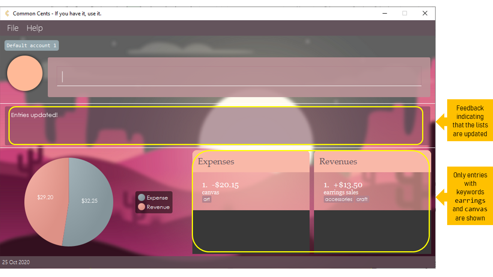

# User guide
Common Cents is your convenient at-hand expense-tracking tool, meant for anyone who runs a small-scale business. With just a few commands, Common Cents will keep track, categorise and calculate your income and expenditure for you!

* Table of Contents
{:toc}

--------------------------------------------------------------------------------------------------------------------
[comment]: <> (Copy the blocks below and edit your message)
# How to identify notations
These blocks are a few examples of notations that will be used in this document. Each block and icon 
has a different meaning so do look out for them under our features.

 

:information_source: **Note:** 

Important notes to read regarding the feature. 

[comment]: <> (This only appears in Github CSS)

:bulb: **Tip:**

Ways to better your experience with Common Cents.

:green_book: **Example:**

An example, or multiple examples to follow.

:warning: **Warning:**

Important cautions that needs to be known before using the feature.

--------------------------------------------------------------------------------------------------------------------

# Quick start

1. Ensure you have Java `11` or above installed in your Computer.

1. Download the latest `commoncents.jar`.

1. Copy the file to the folder you want to use as the _home folder_ for CommonCents.

1. Double-click the file to start the app. The GUI similar to the below should appear in a few seconds. Note how the app contains some sample expenses and revenues. 
   

1. Type the command in the command box and press Enter to execute it. e.g. typing **`help`** and pressing Enter will open the help window. 
   Some example commands you can try:

   * `add c/expense d/buy lunch a/5.20 t/food` : Adds an expense named "buy lunch" to the expense list.
   * `delete 1 c/expense` : Deletes the 1st entry in the expense list.
   * `exit` : Exits the app.

1. Refer to the [Features](#features) below for details of each command.

--------------------------------------------------------------------------------------------------------------------
# User Interface Overview
Figure shows the default user interface (UI) of Common Cents. You can find the description for each UI components in the 
table below.  

  <b>Figure</b>: Default user interface of Common Cents  

UI component | Description
--------|------------------
*Menu bar* | Displays the menu bar of Common Cents. You can use this to access the User Guide or exit the application. 
*Active account name* | Displays the account you are currently on.
*Display picture* | Displays the default display picture of the application.
*Command box* | Displays a text field for you to type the commands.
*Result display* | Displays the result of your command. If the command is invalid, an error message will be displayed to prompt and guide you to input valid correct command.
*Account summary chart* | Displays the total expenses and revenues in your current account in a pie chart.
*Chart legend* | Displays the legend for the account summary chart.
*Status bar* | Displays the current date.
*Expense list* | Displays all the expenses in your current account in a panel.
*Revenue list* | Displays all the revenues in your current account in a panel.

--------------------------------------------------------------------------------------------------------------------

# Features

**Notes about the command format:** 

* Words in UPPERCASE are the parameters to be supplied by the user. 
  e.g. in `add c/CATEGORY...`, `CATEGORY` is a parameter which can be used as `add c/REVENUE...`

* Items in square brackets are optional. 
  e.g `...a/AMOUNT [t/TAG]` can be used as `...a/50.10 t/Supplies` or as `...a/50.10`.

* Parameters can be in any order. 
  e.g. if the command specifies `c/CATEGORY d/DESCRIPTION...`, `d/DESCRIPTION c/CATEGORY...` is also acceptable.

The commands are separated into three categories: App-Level commands, Entry-Level commands and Account-Level Commands

## App-Level Commands
App-Level commands deals with interactions with the app, Common Cents, itself.

### Viewing help : `help`

Shows a message explaining how to access the help page (Figure). You can click on the `Copy URL ` button to copy
the link to clipboard and paste it in your web browser.   

**Format**: `help`

  <b>Figure</b>: Help message  

 

:heavy_check_mark: **Example:**

* `help`: Returns help prompt.

### Exiting the program : `exit`

Exits the program.

Format: `exit`
 

:heavy_check_mark: **Example:**

* `exit`: Returns exit message then quits the program.

## Entry-Level Commands
Entry-Level commands involves managing the entries which are either expenses or revenues in an account. 

### Adding an entry: `add`

Adds an entry (expense/revenue) to the tracker.

Format: `add c/CATEGORY d/DESCRIPTION a/AMOUNT [t/TAG]`

:heavy_check_mark: **Example:**

* `add c/expense d/buying supplies a/10.10 t/blogshop t/eCommerce`
* `add c/revenue d/sale of clothes a/200 t/blogshop t/eCommerce`

*(Add screenshot showing the profit message)*

 

:information_source: **Note:**

* Adds an entry to either category.
* The category refers to the classification of the entry in the entry lists.
* The category must be either 'expense' or 'revenue'.

### Deleting entries: `delete`

Removes an entry (expense/revenue) from the tracker.

Format: `delete ENTRY_INDEX c/CATEGORY`

:heavy_check_mark: **Example:**

* `delete 1 c/expense` : deletes first entry in expense category
* `delete 2 c/revenue` : deletes second entry in the revenue category

*(Add screenshot showing the profit message)*

 

:information_source: **Note:**

* Deletes the entry at the specified INDEX.
* The index refers to the index number shown in the displayed entry lists.
* The index must be a positive integer 1, 2, 3, and must be within the range of the number of entries (e.g. if there are 10 entries, the INDEX given cannot be > 10)

### Editing an entry: `edit`

Edits an entry in the tracker.

Formats:
* `edit 1 c/CATEGORY d/DESCRIPTION a/AMOUNT t/TAG`
* `edit 2 c/CATEGORY d/DESCRIPTION`
* `edit 3 c/CATEGORY a/AMOUNT`

:heavy_check_mark: **Example:**

* `edit 2 c/expense n/buy McSpicy a/8.60` changes the name and the amount of entry 2 to `eating McSpicy` and `$8.60` respectively
* `edit 2 c/revenue n/sell McNuggets` changes the name of entry 2 to `sell McNuggets`
* `edit 2 c/expense a/5.50` changes the amount of entry 2 to `$5.50`

*(Add screenshots showing the before and after the edit command)*

 

:information_source: **Note:**

* Edits an entry that matches the entry name and changes the parameters of an entry depending on which are specified
* The tags d/ and a/ have to be used to indicate which field specifies DESCRIPTION and which field specifies AMOUNT
* The index must be a positive integer 1, 2, 3, and must be within the range of the number of entries 
(e.g. if there are 10 entries, the `INDEX` given cannot be > 10)

### Locating entries by description: `find`

You can use this command to list expenses and/or revenues that have the given keyword(s) in their description. If there
is no expense or revenue found, the respective list will be empty.

**Format:** `find [c/CATEGORY] k/KEYWORDS`

:green_book: **Example:** 

* `find c/expense k/watercolours canvas` : finds all expenses with keywords `watercolours` and/or `canvas` in their 
description.
* `find c/revenue k/phone` : finds all revenues with keyword `phone` in their 
description.
* `find k/canvas earrings` : finds all expenses and revenues with keywords `canvas` and/or `earrings` in their 
description (Figure).
 

 

  <b>Figure</b>: Find command successfully executed  

 

:information_source: **Note:**

* The search is case-insensitive. e.g. `grocery` will match `grocery` and `Grocery`.
* Only the entry's description is searched.
* The search does not match partial words. e.g. `food` will match `food` and `fast food` but not `fastfood`.
* Entries matching at least one keyword will be returned (i.e. OR search). e.g. `Food` will return `Hawker food`, 
`Restaurant Food`.
* The `c/CATEGORY` is optional.

[comment]: <> (This only appears in Github CSS)

:bulb: **Tip:** When there are a lot of entries, and you want to delete something, 
you can use `find` to search for it in the list and use `delete ENTRY_INDEX` to remove it from the updated
list, with the updated `ENTRY INDEX`.

### Listing all entries: `list`

Lists all entries in the current account.

Format: `list`
 

:heavy_check_mark: **Example:**

* `list`: Returns the latest list of all entries

### Clearing all expenses or revenue: `clear`

If for whatever reason you would like to clear all entries from a particular category, 
you can use this command to do so.
 
Format: `clear`
 

:heavy_check_mark: **Example:**

* `clear c/expense`: clears all entries in expenses by setting the state to an empty one.

* `clear c/revenue`: clears all entries in revenues by setting the state to an empty one.

*(Add screenshots for before and after clear.)*

 

:information_source: **Note:**

The `clear` command will clear all entries in the stipulated category. If you would like to delete selected
entries, use the `delete` command instead.

### Calculating net profits based on expenses and revenues: `profit` 

If you wish to calculate the profits you have currently, you may use this command to do so.
 
Format: `profit`
 

:heavy_check_mark: **Example:**

* `profit`: Returns the profits by taking the difference between the expenses and revenues.

*(Add screenshot showing the profit message)*

 

:information_source: **Note:**

The `profit` function will show deficits as a negative number should expenses be greater than revenue.

### Undoing Entry-level commands: `undo`

You can use this command to return to the state of entries prior to previous command.

 
Format: `undo`
 

:green_book: **Example:**

* `undo`: Returns the state of expenses and revenues prior to the previous command. For example, if the 
[`add`](#adding-an-entry-add) command was used, using `undo` returns account to the state before the 
[`add`](#adding-an-entry-add) command was used as shown in the Figures below.

*(Add screenshots for before and after the undo, pointing to the entries)*

 

:information_source: **Note:**

Do note that the `undo` command can only undo  [`add`](#adding-an-entry-add), [`delete`](#deleting-entries-delete),
[`edit`](#editing-an-entry-edit) and [`clear`](#clearing-all-expenses-or-revenue-clear) commands at the entry-level. 
Account-level commands cannot be reverted using the `undo` command.

:warning: **Warning:**

There is no `redo` command to revert your `undo` command. Do use the `undo` command with caution!

## Account-level Commands
Account-Level commands involves managing the different accounts in the app. 

### Add new Account: `newacc`

You can create a new account to manage a different set of entries with this command. Once the account is created, 
you can check it via [`listacc`](#listing-accounts-you-have-listacc) or switch to it via [`switchacc`](#switching-accounts-switchacc). 

Format: `newacc n/NAME`

:green_book: **Example:**

* `newacc n/My Flower Shop`: adds a new account, `My Flower Shop`, with no expenses or revenues.
* `newacc n/$uper $avers`: adds a new account, `$uper $avers`, with no expenses or revenues. 

*(Insert screenshot here for the second example, pointing to the feedback)*

### Deleting an account: `deleteacc`

You can remove the account using this command. This command is useful for clearing accounts that you might not be using
anymore.

Format: `deleteacc INDEX`

:green_book: **Example:**

* `deletacc 1`: Deletes first account based on list generated by [`listacc`](#listing-accounts-you-have-listacc).

*(Insert screenshot here, pointing to the feedback)*

 

:information_source: **Note:**

Do note that Common Cents prevents you from deleting the account if you are currently on that account
or if the account is your only account left.

:bulb: **Tip:**

If you are unsure of the account index, use [`listacc`](#listing-accounts-you-have-listacc) to check the index!

:warning: **Warning:**

Deleting your account means all the data on entries in the account is lost as well. Also, deleting is an 
irreversible action and cannot be undone. Do delete your account with caution!

### Editing the name current account: `editacc`

You can edit the name of the current account you are on using this command.

Format: `editacc n/NAME`

:green_book: **Example:**

* `editacc n/Bob's Bakery`: Replaces the name of the current account, `Default Account 1` to `Bob's Bakery` as shown in the Figure below

*(Insert screenshot here, point to the feedback, and the account name)*

 

:information_source: **Note:**

Do note that you cannot edit account names other than the account you are currently on. To edit the name
of another account, you can use [`switchacc`](#switching-accounts-switchacc) to switch to the other account
and edit the name from there.

### Listing accounts you have: `listacc`

You can check the accounts you have in the app by using this command. Each account will be numbered with an index and 
displayed as their names.

Format: `listacc`

:green_book: **Example:**

* `listacc`: Shows a numbered list of the account names as a message.

*(Insert screenshot here, pointing to the feedback)*

### Switching accounts: `switchacc`

You can use this command to switch to the desired account. This is useful if you want to manage entries in the 
account or edit the name of the desired account.

Format: `switchacc INDEX`

:green_book: **Example:**

* `switchacc 1`: Switches to the first account based on list generated by [`listacc`](#listing-accounts-you-have-listacc).

:bulb: **Tip:**

If you are unsure of the account index, use [`listacc`](#listing-accounts-you-have-listacc) to check the index!

:warning: **Warning:**

Once you use the `switchacc` command, all the previous states for the [`undo`](#undoing-entry-level-commands-undo) will
be lost. This would mean that if you choose to switch back to the account, you cannot undo the previous entry-level
commands anymore. Do confirm your changes to the entries in the account before you switch account!

--------------------------------------------------------------------------------------------------------------------

# Command summary

Action | Format, Examples
--------|------------------
**Help** | `help`
**Exit** | `exit`
**Add** | `add c/CATEGORY d/DESCRIPTION a/AMOUNT [t/TAG]`
**Delete** | `delete ENTRY_INDEX c/CATEGORY`
**Edit** | `edit 1 c/CATEGORY [d/DESCRIPTION] [a/AMOUNT] [t/TAG]`
**Find** | `find k/KEYWORD [MORE_KEYWORDS]`
**List** | `list`
**Clear** | `clear c/CATEGORY`
**Profit** | `profit`
**New Account** | `newacc n/NAME`
**Delete Account** | `deleteacc INDEX`
**Edit Account** | `editacc n/NAME`
**List Account** | `listacc`
**Switch Account** | `switchacc INDEX`

<!-- **Edit** | `edit ENTRY_NUM n/EXPENSE_NAME a/MONEY_AMT` -->
<!-- **Find** | `find KEYWORD [MORE_KEYWORDS]` -->
