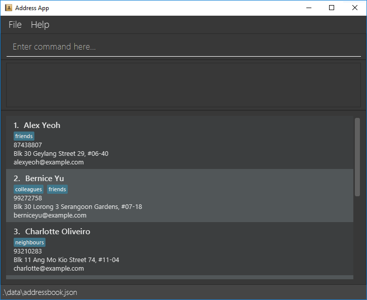

Cap 5.0 Buddy helps NUS SoC students to keep track of their module details efficiently. 
It helps them to centralize key module details, contacts and information while following their study progress through a Command Line Interface (CLI).

* Table of Contents
{:toc}

--------------------------------------------------------------------------------------------------------------------

## Quick start

1. Ensure you have Java `11` or above installed in your Computer.

1. Download the latest `cap5buddy.jar` from [here](https://github.com/AY2021S1-CS2103T-F12-3/tp/releases).

1. Copy the file to the folder you want to use as the _home folder_ Cap 5 Buddy application.

1. Double-click the file to start the app. The GUI similar to the below should appear in a few seconds. Note how the app contains some sample data. 
   

--------------------------------------------------------------------------------------------------------------------

## Features

**:information_source: Notes about the command format:** 

* Words in `UPPER_CASE` are the parameters to be supplied by the user. 
  e.g. in `addtask n/NAME`, `NAME` is a parameter which can be used as `addtask n/Week 11 quiz`.

* Items in square brackets are optional. Items without square brackets are compulsory fields.  
  e.g. `addtask n/NAME [p/PRIORITY]` can be used as `addtask n/Week 11 quiz p/highest` or as `addtask n/Week 11 quiz`
  
* Items with `...` after them can be used multiple times, including zero times.  
  e.g. `[t/TAG]...` can be used as ` ` (i.e. 0 times), `t/easy`, `t/friend t/important` etc.
  
* Argument parameters can be provided in any order.
  e.g. if the command specifies `addtask n/NAME [p/PRIORITY]`, `addtask [p/PRIORITY] n/NAME` is also acceptable.  
  
* If duplicate parameters are provided when the command format does not expect multiple occurrence of the same parameter, i.e. 
  parameters without `...` at the back in the command format (e.g. n/NAME), the application will only consider the argument of the last 
  occurring duplicate parameter. 
  e.g. in `addtask n/Week 11 quiz n/Lab assignment`, `n/Week 11 quiz` will be ignored and a task with the name `Lab assignment` will be added.

### Module Features

#### Adding a new module: `add module`

Creates and add a new module to be stored in the system.

  Format: `add module` **_`[MODULE_NAME]`_** **_`[ZOOM_LINK]`_**

   * Leaving the **_ZOOM_LINK_** part empty will create a empty module.

   Examples:
   * `add module CS2103T https:\\link` creates and add the module called CS2103T
   with the specified link into the system.
   * `add module CS2103T` creates and add the module CS2103T with no zoom link.

#### Adding a new completed module: `addcmodule`

Creates and add a new completed module to be stored in the system.

  Format: `addcmodule n/NAME mc/MODULAR_CREDITS gp/GRADE_POINT [t/TAG]...`

   * Using this command to add a completed module will automatically tag the module as completed.
   * Completed modules added this way will be used for CAP calculation purposes.

   Examples:
   * `addcmodule n/CS2103T mc/4.0 gp/5.0` creates and adds the module named CS2103T with 4 modular credits 
      and 5 grade points with a `completed` tag.
   * `addcmodule n/CS2101 mc/2.0 gp/4.5 t/year1` creates and adds the module named CS2101 with 2 modular credits 
      and 4.5 grade points with the tags `completed` and `year1`.

#### Viewing a module: `viewmodule`

Views a module stored in the system

 Format: `viewmodule` **_`n/[MODULE_NAME]`_**

  * Views information for a module named **_`[MODULE_NAME]`_**

  Examples:
   * `viewmodule n/cs2103t` views the specified module

#### Adding a zoom link for a specific lesson to a module: `addzoom`

  Adds a zoom link for a specific lesson to an existing module.

  Format: `addzoom INDEX n/LESSON_NAME z/ZOOM_LINK`
  
   * Adds a zoom link to the module at the specified `INDEX`. 
   
   * The index refers to the index number of the module shown on the displayed module list. 
   
   * The index **must be a positive integer** 1, 2, 3...
   
   * The zoom link provided must be a link that uses the NUS domain. A typical zoom link that is under the NUS domain
     would start with: `https://nus-sg.zoom.us/`. Zoom links that do not belong to the NUS domain would not be accepted.

  Example:
  `addzoom 1 n/lecture z/https://nus-sg.zoom.us/j/auya7164hg` Adds a zoom link `https://nus-sg.zoom.us/j/auya7164hg` to the first module
   in the displayed module list for the lesson `lecture`.
  

#### Deleting a module: `deletemodule`

Deletes the module at the specified position in the module list.

 Format: `delete` **_`[MODULE_POSITION]`_**

  Examples:
  * `deletemodule 1` deletes the module at position `1`

#### Editing a module : `edit zoom`

* Edits an existing module in the module list.

Format: `edit zoom` **_`[MODULE_NAME]`_** **_`[ZOOM_LINK]`_**

* Edits the zoom link of a module named **_`[MODULE_NAME]`_** to **_`[ZOOM_LINK]`_**

Examples:
* `edit zoom CS2030 https://sample.zoom.us` edits the zoom link for a module named `CS2030`
  to `https://sample.zoom.us`

#### Adding assignment to a module: `addassignment`

  Adds an assignment that takes up a percentage of the grade and has a result from 0.00 to 1.00 to an existing module.

  Format: `addassignment` **_`n/[MODULE_NAME]`_** **_`a/[ASSIGNMENT_NAME]`_**
  **_`%/[ASSIGNMENT_PERCENTAGE]`_** **_`r/[ASSIGNMENT_RESULT]`_**

  * Adds an assignment **_`[ASSIGNMENT_NAME]`_** that takes up **_`[ASSIGNMENT_PERCENTAGE]`_**
  of the grade with a result of **_`[ASSIGMENT_RESULT]`_** to a module named **_`[MODULE_NAME]`_**

  Example of usage:
  `addassignment n/CS2100 a/Quiz 1 %/5 r/0.80` adds an assignment called `Quiz 1` that takes up `5`% of the
  grade with a result of `0.80` to the module named `CS2100`

### Todo List Features

#### Adding a task: `addtask`

Adds a task to the list.

Format: `addtask` **_`[n/TASK_NAME]`_** **_`[t/TAG]`_** **_`[p/PRIORITY]`_** **_`[d/DATE]`_**

* All fields except the name of the task are optional.
* Name of the task should not be longer than 30 characters.
* You can provide more than one tag.
* Date must be in the form of YYYY-MM-DD.

Examples: 
* `addtask n/read book t/DAILY HOBBY p/low d/2020-10-10` adds the specified task.

#### Deleting a task: `deletetask`

Deletes a task from the list.

Format: `deletetask` **_`INDEX`_**

* See index from the list.
* Index must be a positive integer.

Examples:
* `deletetask 1` deletes the first task in the list.

#### Editing a task: `edittask`

Edits a task in the list.

Format: `edittask` `INDEX` **_`[n/TASK_NAME]`_** **_`[t/TAG]`_** **_`[p/PRIORITY]`_** **_`[d/DATE]`_**

* See index from the list.
* Index must be a positive integer.
* At least one field must not be empty.

Examples:
* `edittask 1 n/read chapter 5 p/HIGH` edits the first task name to `read chapter 5` and
and priority to `HIGH`.

#### Locating tasks: `findtask`

Finds all tasks that fulfil all the provided search criteria.

Format: `findtask [n/NAME_KEYWORDS] [d/DATE] [p/PRIORITY] [t/TAG_KEYWORDS]` 

 * The search is case-insensitive, e.g. `lab` will match `Lab`.
 
 * When you are providing name or tag keywords, separate distinct keywords with a whitespace, 
   e.g. `findtask n/lab quiz` will search for tasks using the 2 distinct keywords `lab` and `quiz`.
   
 * You should ensure that search arguments are not blank and at least one search parameter should be provided.
 
 * Search Parameters:
 
   * Task Name
 
     * You are allowed to provide multiple search keywords.
     
     * Tasks with their name matching at least one of the name keywords provided will be considered to have fulfilled the task name search criteria.
     
     * The order of the search keywords does not matter, e.g. `Lab Quiz` will match `Quiz Lab`.
     
     * Only full words will be matched, e.g. `lab` will match `lab assignment` but not `labs`.
     
   * Date
   
     * Your search date should be of the format: `YYYY-MM-DD`.
     
     * You should only provide one search date, i.e. `d/2020-01-01 2020-02-02` would not be accepted.
     
     * Tasks with their date matching the search date exactly are considered to have fulfilled the task date search criteria.
     
   * Priority
   
     * Your search priority should be one of the following: `highest`, `high`, `normal`, `low` (case-insensitive). 
       No other search priority will be allowed.
       
     * You should only provide one search priority, i.e. `p/highest low` is not allowed.
     
     * Tasks with their priority matching the search priority exactly are considered to have fulfilled the task priority search criteria.
     
   * Tag
 
     * You are allowed to provide multiple tag keywords.
     
     * Tasks containing tags which match at least one of the tag keywords provided will be considered to have fulfilled the task tag search criteria.
       
 * Only tasks matching all search parameters provided will be returned.      
 
 Examples:
 
  * `findtask n/lab` returns all tasks with the word `lab` in their name
 
  * `findtask d/2020-10-10 p/HIGHEST` returns all tasks with the date `2020-10-10` **and** `highest` priority
  
  * `findtask t/difficult online` returns all tasks that have the `difficult` or `online` tag 
  
  * `findtask n/lab quiz t/difficult` returns all tasks with their name containing **either** 
     the word `lab` or  `quiz` **and** has `difficult` as one of its tags

#### Marking a task as completed: `completetask`

Labels a task as COMPLETED.

Format: `completetask` **_`INDEX`_**

* See index from the list.
* Index must be a positive integer.

Examples:
* `completetask 1` label first task in the list as completed.

#### Resetting a task: `resettask`

Reset the status of a task back to NOT COMPLETED.

Format: `resettask` **_`INDEX`_**

* See index from the list.
* Index must be a positive integer.

Examples:
* `resettask 2` reset the second task in the list.

#### Sorting tasks: `sorttask`

Sorts the list based on a criterion.

Format: `sorttask` **_`[REVERSED]`_** **_`[CRITERION]`_**

* **_`[REVERSED]`_** is a signle character 'r'.
* Add **_`[REVERSED]`_** to reverse the ordering of the list.
* **_`[CRITERION]`_** is pre-defined i.e. choose from `NAME`, `PRIORITY`, `DATE`.
* **_`[CRITERION]`_** is not case-sensitive.

Examples:
* `sorrtask priority` sorts the task from lowest to highest priority.
* `sorrtask r priority` sorts the task from the highest to the lowest.

#### Archiving a task: `archivetask`

Archives a task from the list.

Format: `archivetask` **_`INDEX`_**

* See index from the list.
* Index must be a positive integer.

Examples: `archivetask 1` archive the first task.

#### Clearing the list: `cleartask`

Clears all tasks in the list.

Format: `cleartask`

### Contact List Features

#### Adding a contact: `addcontact`

Adds a new contact into the contact list if it does not already exist.

Format: `addcontact n/NAME e/EMAIL [te/TELEGRAM] [t/TAG]...`
   
 * The `TELEGRAM` field provided must start with the `@` symbol and must be a valid telegram username,
   i.e. at least 5 characters long, not including the `@` symbol and contains only alphanumeric characters or underscore
 
 * A contact can have any number of tags (including 0)

Examples:

 * `addcontact n/john e/john@gmail.com`
 * `addcontact n/amy e/amy@gmail.com te/@anytele`
 * `addcontact n/bob e/bob@gmail.com t/friend`
 
 
 #### Locating contacts: `findcontact`
 
 Finds all contacts that fulfil all the provided search criteria.
 
 Format: `findcontact [n/NAME_KEYWORDS] [t/TAG_KEYWORDS]`
 
  * The search is case-insensitive, e.g. `bob` will match `Bob`.
  
  * You are allowed to provide multiple search keywords for both the name and tag parameter.
  
  * The order of the search keywords does not matter, e.g. `Bob Abramham` will match `Abraham Bob`.
  
  * When you are providing name or tag keywords, separate distinct keywords with a whitespace, 
    e.g. `findcontact n/bob abraham` will search for contacts using the 2 distinct keywords `bob` and `abraham`.
    
  * Only full words will be matched, e.g. `Bob` will match `Bob Abraham` but not `Bobs`.
    
  * You should ensure that keywords are not be blank and at least one search parameter should be provided.
  
  * Search Parameters:
  
    * Name
  
      * Contact with a name matching at least one of the name keywords provided will be considered to have fulfilled the contact name search criteria.
      
    * Tag
  
      * Contacts containing tags which match at least one of the tag keywords provided will be considered to have fulfilled the contact tag search criteria.
        
  * Only contacts matching all search parameters provided will be returned.      
  
  Examples:
  
   * `findcontact n/john` returns all contacts with the word `john` in their name, e.g. `john` and `john doe`
  
   * `findcontact n/Bob Abraham` returns all contacts with the word `Bob` or `Abraham` in their name, e.g. `Bob Lim`, `Tommy Abraham`
   
   * `findcontact t/friend` returns all contacts with the tag `friend`
   
   * `findcontact t/friend coworker` returns all contacts that have the `friend` or `coworker` tag 
   
   * `findcontact n/john t/friend` returns all contacts with the word `john` in its name **and** has `friend` as one of its tags
 
 
 #### Listing all contacts: `listcontact`
 
 Shows a list of all contacts in the contact list.
 
 Format: `listcontact`
 
 

 
 **:information_source: Tip:** 
 
 `listcontact` is a useful command that you can use to display the original contact list.
  e.g. after using the `findcontact` or `sortcontact` commands.
 
 

 
 
 #### Editing a contact: `editcontact`
 
 Edits an existing contact in the contact list.
 
 Format: `editcontact INDEX [n/NAME] [e/EMAIL] [te/TELEGRAM] [t/TAG]...`
 
 * Edits the contact at the specified `INDEX`. The index refers to the index number of the contact shown 
   in the displayed contact list. The index **must be a positive integer** 1, 2, 3...
 
 * At least one of the contact fields must be provided
 
 * At least one of the optional fields must be provided.
 
 * Existing values will be updated to the input values.
 
 * When editing tags, the existing tags of the contact will be removed i.e adding of tags is not cumulative.
 
 * You can remove all the contact’s tags by typing `t/` without specifying any tags after it.
 
 Examples:
 
  * `editcontact 1 n/john e/john@gmail.com` Edits the name and email address of the first contact to be 
    `john` and `john@gmail.com` respectively.
    
  * `editcontact 2 n/Bob Abraham t/` Edits the name of the second contact to be `Bob Abraham` and clears all existing tags of the contact.

#### Deleting a contact: `deletecontact`

Deletes the specified contact from the contact list.

Format: `deletecontact INDEX`

 * Deletes the contact at the specified `INDEX`. 
 
 * The index refers to the index number of the contact shown on the displayed contact list. 
   
 * The index **must be a positive integer** 1, 2, 3...

Examples:

 * `listcontact` followed by `deletecontact 1` deletes the first contact in the contact list
 
 * `findcontact n/bob` followed by `deletecontact 2` deletes the second contact in the results of the `findcontact` command

#### Sorting contacts:

#### Marking contacts as important:

#### Calculating Cumulative Average Point(CAP): `calculatecap`

Calculates the user's CAP based on completed modules

 Format: `calculatecap`

  Examples:
  * `calculatecap` calculate the user's cap

### Scheduler Features

#### Adding an Event to the Scheduler: `addevent`

Creates and add a new Event with the specified information from the user input

  Format: `addevent n/[event name] d/[date]`
  
   Examples:
    * `addevent n/CS2103T exams d/12-12-2020` adds an Event called CS2103T into the Scheduler with the date 12-12-2020.

### General Features

#### Undo previous user command: `undo`

Undoes the previous user command

 Format: `undo`

  Examples:
  * `undo`

#### Redo previous user command: `redo`

Redoes the previously undone user command

 Format: `redo`

  Examples:
  * `redo`

--------------------------------------------------------------------------------------------------------------------

## FAQ

**Q**: How do you add a module into the program? 
**A**: Run the program and wait for the terminal to start up. Next, type in : “add module [CS2103T]” to add a module called CS2103T.

**Q**: How do you view the zoom links of a particular module? 
**A**: When the program has started running, enter the following in the terminal : “view [CS2103T]” to view the zoom link for the module called CS2103T.

--------------------------------------------------------------------------------------------------------------------

## Command summary

Action | Format, Examples
--------|------------------
**Add Module** | `addmodule n/MODULE_NAME l/ZOOM_LINK`  e.g. `addmodule n/CS2103T l/https://sample.zoom.us`
**Add Completed Module** | `addcmodule n/MODULE_NAME mc/MODULAR_CREDITS gp/GRADE_POINT [t/TAG]...`  e.g. `addcmodule n/CS2101 mc/2.0 gp/4.5 t/year1`
**View Module** | `viewmodule n/MODULE_NAME`  e.g. `viewmodule n/cs2101`
**Delete** | `deletemodule MODULE_POSITION `  e.g. `deletemodule 3`
**Edit** | `editmodule n/MODULE_NAME e/NEW_NAME l/NEW_LINK`  e.g. `editmodule n/CS2103T e/CS2100 l/https://sample.zoom.us`
**Add Zoom to module** | `addzoom INDEX n/LESSON_NAME z/ZOOM_LINK`   e.g. `addzoom 1 n/lecture z/https://nus-sg.zoom.us/j/uascya367yfy`
**Add Assignment** | `addassignment n/MODULE_NAME a/ASSIGNMENT_NAME %/ASSIGNMENT_PERCENTAGE r/ASSIGNMENT_RESULT`   e.g. `addassignment n/CS2100 a/Quiz 1 %/5 r/0.80`
**Calculate CAP** | `calculatecap`   e.g. `calculatecap`
**Add Event** | `addevent n/EVENT_NAME d/DATE`   e.g. `addevent n/CS2103T d/12-12-2020`
**Add Contact** | `addcontact n/NAME e/EMAIL [te/TELEGRAM] [t/TAG]...`   e.g. `addcontact n/john e/john@gmail.com te/@johndoe t/friend`
**EditContact** | `editcontact INDEX [n/NAME] [e/EMAIL] [te/TELEGRAM] [t/TAG]...`   e.g. `editcontact 1 n/amy te/@amytele`
**FindContact** | `findcontact [n/NAME_KEYWORDS] [t/TAG_KEYWORDS]`   e.g. `findcontact n/john`
**DeleteContact** | `deletcontact INDEX`   e.g. `deletecontact`
**Undo** | `undo`   e.g. `undo`
**Redo** | `redo`   e.g. `redo`
