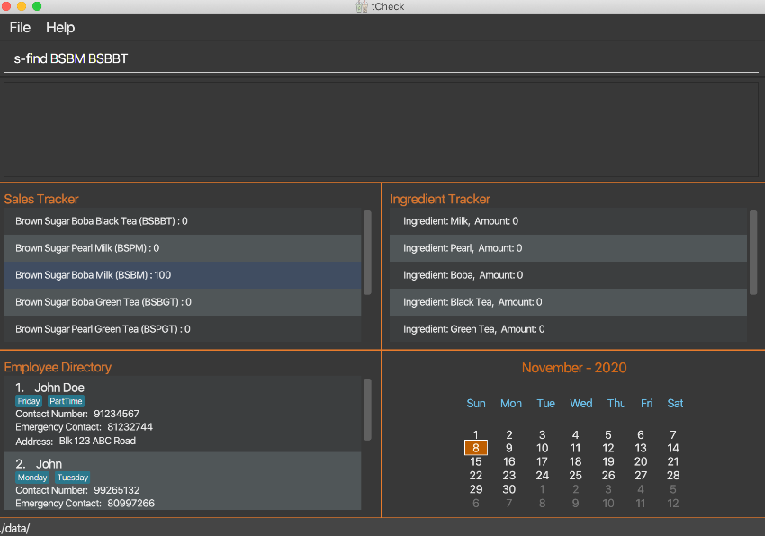
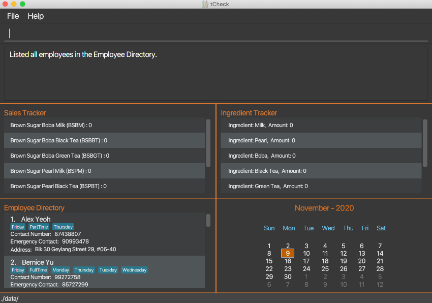

* Table of Contents
    * [Introduction](#introduction)
    * [Quick start](#quick-start)
    * [About this document](#about-this-document)
    * [Features](#features)
        * [Commands - Sales Tracking](#commands-sales-tracking) 
        * [Commands - Ingredients Tracking](#commands-ingredients-tracking)
        * [Commands - Contact details](#commands-contact-details)
        * [Commands - General](#commands-general)
    * [Command summary](#command-summary)

## Introduction 

Welcome to the User Guide of **tCheck**!
 
Are you a bubble tea store manager (from T-Sugar) looking to reduce your time spent on administrative work in store
management? Look no further, as tCheck can assist you with these tasks.

tCheck is a desktop application that offers an integrated system to efficiently manage a bubble tea shop, of 
the (imaginary) brand T-sugar, by providing sales tracking, ingredient tracking and manpower management. It is an
application optimized for the Command Line Interface (CLI); this means that you use this application by typing
commands into a _Command Box_. If you are a fast typist, then you will be able to update and retrieve the
information in tCheck more efficiently, as opposed to using other applications that requires a mouse.

This User Guide will help you get started with tCheck and learn how to use the features that tCheck provides.
You can start from the [Quick Start](#quick-start) section to learn how to obtain tCheck to begin managing
 your store more efficiently.

--------------------------------------------------------------------------------------------------------------------
## Quick start 

1. Ensure you have Java `11` or above installed in your Computer.

1. Download the latest `tCheck.jar` from [here](https://github.com/AY2021S1-CS2103T-T12-2/tp/releases).

1. Copy the file to the folder you want to use as the _home folder_ for your tCheck.

1. Double-click the file to start the app. The GUI similar to the below should appear in a few seconds. Note how the app contains some sample data. 
   

1. Type the command in the command box and press Enter to execute it. e.g. typing **`help`** and pressing Enter will open the help window. 
   Some example commands you can try:

   * **`c-list`** : Lists all employees.

   * **`c-add`**`n/John Doe p/98765432 e/81234567 t/parttime` : Adds an employee
    named `John Doe` to tCheck.

   * **`c-delete`**`3` : Deletes the 3rd employee shown in the current list.

   * **`c-clear`** : Deletes all employees.

   * **`exit`** : Exits the app.

1. Refer to the [Features](#features) below for details of each command.

--------------------------------------------------------------------------------------------------------------------

#### 3.2.2. General Symbols and Syntax 

The following table explains general symbols and syntax used in this User Guide.

| Syntax |  What it means |
|----------|-------------|
| `command` |  The grey block specifies an execuable command which can be entered in the command box |
| _italics_ | Italicised text specifies the terms related to tCheck's GUI |
|
 :information_source: 
  | An exclamation mark indicates that the following text is a note |
|
:bulb:  | An bulb indicates that the following text is a tip |

#### 3.2.3. Command Syntax and Usage

The following table explains technical terms used in this user guide.

| Technical Term | What it means |
| ---------------| --------------|
| Prefix | The first word of a command. tCheck uses this command word to decide what kinds of actions it should perform |
| Command Word | It is the input that follows behind a prefix. It is used to distinguish different kinds of parameters |
| Parameter | Values given for specific operations |

**Example:**  
`c-add n/NAME p/PHONE_NUMBER e/EMERGENCY_CONTACT a/ADDRESS [t/TAG]`

**Breakdown:** 
* Command Word - `c-add`  
* Prefixes - `n/`, `e/`, `p/`, `a/`, `t/`   
* Parameters - `NAME`, `PHONE_NUMBER`, `EMERGENCY_CONTACT`, `ADDRESS`, `TAG`

The following points explain the format of a command. 

* Words in `UPPER_CASE` are the parameters to be supplied. 
   e.g. In `c-delete INDEX`, `INDEX` is a parameter and the command can be used as `c-delete 1`.

* Items in square brackets are optional. 
   e.g. `c-add n/NAME p/PHONE_NUMBER e/EMERGENCY_CONTACT a/ADDRESS [t/TAG]` can be used as `c-add n/Betsy Crowe e/81234567 p/89007413 a/Blk 120 ABC Road t/Friday` 
    or as `c-add n/Betsy Crowe e/81234567 p/89007413 a/Blk 120 ABC Road`.

* Items with `…​` after them can be used multiple times, including zero times. 
   e.g. `[t/TAG]…​` can be used as ` ` (i.e. 0 times), `t/Friday`, `t/Friday t/PartTime`, etc.

* Parameters can be in any order. 
   e.g. If the command specifies `p/PHONE_NUMBER e/EMERGENCY_CONTACT`, `e/EMERGENCY_CONTACT p/PHONE_NUMBER` is also acceptable.
    

## About this document  
This document introduces the features of tCheck. 

The following are symbols and formatting used in this document:

:bulb: 
Tips are used to describe small features or techniques
that may come in handy when using tCheck!

:information_source: 
Notes describe certain features or behaviour that may
not be so obvious!

## Features 

**:information_source: Notes about the command format:** 

* Words in `UPPER_CASE` are the parameters to be supplied by the user. 
  e.g. in `ingredient NAME`, `NAME` is a parameter which can be used as `ingredient milk`.

* Items in square brackets are optional. 
  e.g `n/NAME [t/TAG]` can be used as `n/John Doe t/friend` or as `n/John Doe`.

* Items with `...`​ after them can be used once or multiple times. 
  e.g. `sales A/NUM B/NUM C/NUM ...` can be used as `sales BSBM/100` or `sales BSBM/100 BSBBT/120`.

* Parameters can be in any order. 
  e.g. if the command specifies `n/NAME p/PHONE_NUMBER`, `p/PHONE_NUMBER n/NAME` is also acceptable.

### 1. Commands - Sales Tracking 
The Sales Tracking features allows you to keep a record of the sales of the bubble tea drinks inside the
Sales Tracker. You are able to view data related to sales tracking in the Sales Tracker inside the _Main View_.

**:information_source: Notes about available drinks:** 

Currently, there are 6 types of drinks that can be tracked by tCheck's Sales Tracker. The drinks and their respective
 abbreviations are shown as below: 
 
* `BSBM`  : Brown Sugar Boba Milk 

* `BSBBT` : Brown Sugar Boba Black Tea 

* `BSBGT` : Brown Sugar Boba Green Tea 

* `BSPM`  : Brown Sugar Pearl Milk 

* `BSPBT` : Brown Sugar Pearl Black Tea 

* `BSPGT` : Brown Sugar Pearl Green Tea 

#### 1.1 Updating the number of drinks sold : `s-update`
Updates the number of drinks sold for each drink type as given in the user input. The previous records will
be overwritten.

Format: `s-update DRINK [MORE_DRINKS]`
* where `DRINK` is formatted as `A/NUM`
    * `A` refers to the drink's abbreviation.
    * `NUM` refers to the number of drinks sold. It should be a **non-negative unsigned integer** that is 
less than or equal to 99999999.
* The sales of at least one drink item should be recorded when using this command.

Example: 

Let's say you want to update the sales of Brown Sugar Boba Milk, `BSBM`, to 100 
and Brown Sugar Boba Black Tea, `BSBBT`, to 120 in the Sales Tracker. You can follow these instructions:

1. Type `s-update BSBM/100 BSBBT/120` into the _Command Box_.
2. Press "Enter" to execute the command.

Outcome:

1. The _Result Display_ will show a success message.
2. You can now see that tCheck has updated the sales of the two drinks in the Sales
 Tracker inside the _Main View_. 

Figure x. A screenshot showing the outcome of an `s-update` command

#### 1.2 Listing the number of drinks sold : `s-list`
Shows a list of all types of drinks sold in the Sales Tracker. The list of drinks shown is 
ordered in descending order (i.e. ranked from the most to least sales).

Format: `s-list`

Example: 

Let's say you want to see an ordered list of drink sales that have been recorded with `s-update`.
You can follow these instructions:

1. Type `s-list` into the _Command Box_.
2. Press "Enter" to execute the command.

Outcome:

1. The _Result Display_ will show a success message.
2. The Sales Tracker inside the _Main View_ will show a list of the drinks sales in descending order, where the drink
 with the most sales is on top.

Figure x. A screenshot showing the outcome of an `s-list` command

#### 1.3 Finds the number of drinks by keywords : `s-find`

Finds all drinks where their abbreviated names match the KEYWORD(s).

Format: `s-find KEYWORD [MORE_KEYWORDS]`

* The search is case-insensitive. e.g `bsbbt` will match `BSBBT`.
* Only the drink's abbreviated name is searched.
* Only full words will be matched e.g. `BSB` will not match `BSBBT`.
* Drinks matching at least one keyword will be returned.
  e.g. `BSBBT BSBM` will return `BSBBT`, `BSBM`.

Example:

Let's say you want to find BSBBT and BSBM's sales data, you can follow these instructions:

1. Type `s-find BSBBT BSBM` into the _Command Box_.
1. Press "Enter" to execute.

Outcome:
1. The _Result Display_ will show that how many drinks you find.
2. All matching drink's sales data will be listed in the _Main View_.

Before executing: 

After executing: 

 
### 2. Commands - Ingredients Tracking 

    

**:information_source: Notes about ingredients:** 

* Unit of measurement for ingredients: 
    * - Unit for solid items / jelly (Pearl, Boba and Brown Sugar) : **KG** 
    * - Unit for liquids (Milk, Black Tea and Green Tea) : **L** 

* All ingredients' levels are set to 0. 

* All ingredients which are available and thus can be set are predefined in the ingredient book. 
  
* Please note that the ingredient names are case-sensitive. 

* Here is a comprehensive list of all available ingredients : 
    * - Milk 
    * - Pearl 
    * - Boba 
    * - Black Tea 
    * - Green Tea 
    * - Brown Sugar 

#### 2.1 Setting one ingredient's level : `i-set`

Sets the level of one single ingredient predefined in the ingredient book to the specified amount.

Format: `i-set i/INGREDIENT_NAME m/AMOUNT`

* Sets the `INGREDIENT_NAME` to the specified `AMOUNT`.

Example:
* `i-set i/Milk m/15`

#### 2.2 Setting all ingredients' levels to different specified amounts : `i-set-all`

Sets all ingredients' levels to different specified amounts according to user inputs.

Format: `i-set-all M/AMOUNT_FOR_MILK P/AMOUNT_FOR_PEARL B/AMOUNT_FOR_BOBA L/AMOUNT_FOR_BLACK_TEA G/AMOUNT_FOR_GREEN_TEA S/AMOUNT_FOR_BROWN_SUGAR`

* Sets all ingredients' levels as such : Milk : `AMOUNT_FOR_MILK` L, Pearl : `AMOUNT_FOR_PEARL` KG, Boba : `AMOUNT_FOR_BOBA` KG, Black Tea : `AMOUNT_FOR_BLACK_TEA` L, Green Tea: `AMOUNT_FOR_GREEN_TEA`, Brown Sugar : `AMOUNT_FOR_BROWN_SUGAR` KG.

Example:
* `i-set-all M/20 P/20 B/20 L/50 G/80 S/50`

#### 2.3 Setting all ingredients to different levels : `i-set-default`

Sets all ingredients' levels to their pre-determined default levels for a stall.

Format: `i-set-default`

* Sets all ingredients' levels to their default levels : Milk : 50 L, Pearl : 20 KG, Boba : 20 KG, Black Tea : 50 L, Green Tea : 50 L, Brown Sugar : 20 KG.

Example:
* `i-set-default`

#### 2.4 Listing all ingredients' levels : `i-list`
Lists the ingredient's levels of all ingredient types.

Format: `i-list`

#### 2.5 Viewing a single ingredient's level : `i-view-single`
Shows the ingredient's level of a particular type of ingredient that is specified by the user’s command.

Format: `i-view-single i/INGREDIENT_NAME`

Example:
* `i-view-single i/Green Tea`
Shows the amount of green tea recorded by tCheck.

#### 2.6 Resetting all ingredients' levels to zero : `i-reset-all`
Resets all types of ingredients' levels to zero in tCheck.

Format: `i-reset-all`

#### 2.7 Listing all ingredients that user should restock : `i-restock`
Lists the ingredient's levels of all ingredient types that fall below their minimum stock levels and require the user to 
restock. 

The table below shows the minimum stock levels of different types of ingredients:

Ingredient Type | Minimum Stock Level
-------|------------------------------
**Milk** | 5 L
**Pearl** | 5 KG
**Boba** | 5 KG
**Black Tea** | 5 L
**Green Tea** | 5 L
**Brown Sugar** | 5 KG

Format: `i-restock`

### 3. Commands - Contact details 

#### 3.1 Adding an employee : `c-add`

Adds an employee to the Employee Directory.

Format: `c-add n/NAME p/PHONE_NUMBER e/EMERGENCY_CONTACT a/ADDRESS [t/TAG] ...`

* In tCheck, you may add an employee to the Employee Directory. When you add an employee, you need to provide his/her name, phone number, emergency contact, and address.
* Tag is optional. Tags names should be alphanumeric. White space, characters are not allowed to be used in tags names. 

**:information_source: Note:**  
* PHONE_NUMBER and EMERGENCY_CONTACT must be 8-digit number and start with 8 or 9. 

Example: 

Let's say you want to add an employee called John Doe to the Employee Directory. His phone number is 98765432. His emergency contact is 81234567. His address is Blk 123 ABC Road. Assume he is a part-time employee, and he only can work on Friday. So you want to indicate these two characteristics in tCheck. You can assign him two labels, "Friday" and "PartTime" so that you can use find-employees-by-tags features (refer to `c-tag-find` for more details) to find a group of employees by their tag(s).You can follow these instructions:

1. Type `c-add n/John Doe p/98765432 e/81234567 a/Blk 123 ABC Road t/Friday t/PartTime` into the _Command Box_.
1.  Press "Enter" to execute.

Outcome:
1. The _Result Display_ will show that you add a new employee.
2. All active employees will be listed in the Employee Directory inside the _Main View_.

#### 3.2 Listing all employees in the active list: `c-active-list`

Lists all employees who are active.

Format: `c-active-list`

Example: 

All employees who are currently working in the shop are active/unarchived employees. They are stored in the active (unarchived) Employee Directory.
Let's say you want to see all active (unarchived) employees in your store, you can follow these instructions:

1. Type `c-active-list` into the _Command Box_.
1. Press "Enter" to execute.

Outcome:
1. The _Result Display_ will show that all active (unarchived) employees are listed.
2. All active employees will be listed in the Employee Directory inside the _Main View_.

#### 3.3 Listing all employees who are working today: `c-today`

Shows a list of all active(unarchived) employees whose tags contain today's day (i.e. `Wednesday`, `Tuesday`, etc).

Format: `c-today`

* The search is case-insensitive. e.g `Friday` will match `friday`.

Examples:
* Assume today is `Wednesday`, after command `c-today`, all employees whose tags contain `Wednesday` will be
  listed out. 

#### 3.4 Listing all employees who are working tomorrow: `c-tomorrow`

Shows a list of all active(unarchived) employees whose tags contain tomorrow's day (i.e. `Wednesday`, `Tuesday`, etc).

Format: `c-tomorrow`

* The search is case-insensitive. e.g `Friday` will match `friday`.

Examples:
* Assume today were `Wednesday`, tomorrow would be `Thursday`, after command `c-tomorrow`, all employees whose
tags contain `Thursday` will be listed out. 
  
#### 3.5 Editing a person : `c-edit`

Edits the corresponding employee's information in the Employee Directory.

Format: `c-edit INDEX [n/NAME] [p/PHONE_NUMBER] [e/EMERGENCY_CONTACT] [a/ADDRESS] [t/TAG]`

* Edits the employee at the specified `INDEX`. The index refers to the index number shown in the displayed Employee Directory. The index must be a positive integer 1, 2, 3, ...
* At least one of the optional fields must be provided.
* Existing values will be updated to the input values.
* When editing tags, the existing tags of the employee will be removed i.e. adding of tags is not cumulative.
* You can remove all the employee's tags by typing `t/` without specifying any tags after it.

Example: 

Let's say you want to edit an employee whose index is 1 in Employee Directory. His new phone number is 91234567. His new emergency contact is 81232744. 
You can follow these instructions:

1. Type `c-edit 1 p/91234567 e/81232744` into the _Command Box_.
1. Press "Enter" to execute.

Outcome:
1. The _Result Display_ will show that you edit the employee.

2. All active employees will be listed in the _Main View_.

Before executing:

After executing:

#### 3.6 Locating employees by keywords: `c-find`

Finds all active(unarchived) employees that contain the KEYWORD(s) in their names.

Format: `c-find KEYWORD [MORE_KEYWORDS]`

* The search is case-insensitive. e.g `hans` will match `Hans`.
* The order of the keywords does not matter. e.g. `Hans Bo` will match `Bo Hans`.
* Only the name is searched.
* Only full words will be matched e.g. `Han` will not match `Hans`.
* Employees matching at least one keyword will be returned (i.e. `OR` search).
  e.g. `Hans Bo` will return `Hans Gruber`, `Bo Yang`.

Example: 

Let's say you want to find employees whose name contains "John". 
You can follow these instructions:

1. Type `c-find john` into the _Command Box_.
1. Press "Enter" to execute.

Outcome:
1. The _Result Display_ will show how many employees' matching your find command
2. Employees whose name contains "john" will be listed in the Employee Directory inside the _Main View_.

#### 3.7 Locating employees based on matching tags: `c-tag-find`

Finds all active (unarchived) employees that contain the KEYWORD(s) in their tags.

Format: `c-tag-find KEYWORD [MORE_KEYWORDS]`

* The search is case-insensitive. e.g `Friday` will match `friday`.
* The order of the keywords does not matter. e.g. `friday monday` will match `monday friday`.
* Only the tag names are searched.
* Only full words will be matched e.g. `PartTime` will not match `PartTimes`.
* Employees whose tag(s) matching at least one keyword will be listed in the `Employee Contact DeatailL` pane
 (i.e. `OR` search).  e.g. `Friday Monday` will return employees whose tags contain `Friday` or `Monday`.

Examples:
* `c-tag-find friday` returns all employees whose tags contain `friday`.
* `c-tag-find friday parttime` returns all employees whose tags contain `friday`, `parttime`. 

#### 3.8 Deleting a person : `c-delete`

Deletes the specified employee from the Employee Directory.

Format: `c-delete INDEX`

* Deletes the person at the specified `INDEX`.
* The index refers to the index number shown in the displayed Employee Directory.
* The index **must be a positive integer** 1, 2, 3, ...​

Example:
* Let's say you want to delete the employee whose index is 1. You can follow these instructions:

Step to delete the employee whoses index is 1:
1. Type `c-delete 1` into the _Command Box_.
2. Press "Enter" to execute.

Outcome:
1. The _Result Display_ will show deleted employee's information.
2. Remaining employees will be listed in the Employee Directory inside the _Main View_.

#### 3.9 Clearing all entries : `c-clear`

Clears all entries from the Employee Directory.

Format: `c-clear`

Example:

* Let's say you want to delete all employees in Employee Directory. You can follow these instructions:

1. Type `c-clear` into the _Command Box_.
2. Press "Enter" to execute.

Outcome:
1. No employees will be listed in the Employee Directory inside the _Main View_.

Before executing: 

After executing: 

#### 3.10 Archiving an employee : `c-archive`

Archives the specified employee's contact detail from the tCheck.

Format: `c-archive INDEX`

* Archives the employee at the specified `INDEX`.
* The index refers to the index number shown in the displayed `employees' contact details` panel.
* The index **must be a positive integer** 1, 2, 3, ...​

:bulb: 

**Tip:**
Command `c-list` can be used first to show a list of all active employees' contact details. 
Then, `c-archive INDEX` can be used to archive a specific employee.

Examples:
* `c-list` followed by `c-archive 2` archives the 2nd person in the employees' contact details.
* `c-find Betsy` followed by `c-archive 1` archives the 1st person in the results of the `find` command.

#### 3.11 Archiving all employees : `c-archive-all`

Archives all employees' contact details from the tCheck.

Format: `c-archive-all`

#### 3.12 Listing all archived employees : `c-archive-list`

Shows a list of all archived employees' contact details in tCheck.

Format: `c-archive-list`

#### 3.13 Unarchiving an employee : `c-unarchive`

Unarchives the specified employee's contact detail from the tCheck's archived employee list.

Format: `c-unarchive INDEX`

* Unarchives the employee at the specified `INDEX`.
* The index refers to the index number shown in the displayed `employees' contact details` panel.
* The index **must be a positive integer** 1, 2, 3, ...

:bulb: 

**Tip:**
Command `c-archive-list` can be used first to show a list of all archived employees' contact details. 
Then, `c-unarchive INDEX` can be used to unarchive a specific employee.

Examples:
* `c-archive-list` followed by `c-unarchive 2` unarchives the 2nd person in the archived employees' contact details.

### 4. Commands - General 
#### 4.1 Viewing help : `help`

Displays a brief explanation of the list of commands, and a link to the help page, which is the user guide.

Format: `help`

#### 4.2 Exiting the program : `exit`

Exits the program.

Format: `exit`

#### 4.3 Saving the data :

All tCheck data (i.e. contact details, ingredient data, sales data) are saved in the hard disk automatically after any
 command that changes the data. There is no need to save manually by entering any command.
 
 
## Command summary 

### Sales Tracking

Action | Format, Examples
-------|------------------------------
**Update**| `s-update A/NUM B/NUM C/NUM`   e.g., `s-update BSBM/100 BSBBT/120`
**List**| `s-list`
**Find**| `s-find KEYWORD [MORE_KEYWORDS]`   e.g., `s-find BSBM BSBBT`
**Rank**| `s-rank`

### Ingredients  Tracking

Action | Format, Examples
-------|------------------------------
**Set a single ingredient**  | `i-set i/INGREDIENT_NAME m/AMOUNT`   e.g., `i-set i/Milk m/20`
**Set all ingredients**  | `i-set-all M/AMOUNT_FOR_MILK P/AMOUNT_FOR_PEARL B/AMOUNT_FOR_BOBA L/AMOUNT_FOR_BLACK_TEA G/AMOUNT_FOR_GREEN_TEA S/AMOUNT_FOR_BROWN_SUGAR`   e.g., `i-set-all M/20 P/20 B/20 L/50 G/20 S/100`
**Set all ingredients to default**  | `i-set-default`   e.g., `i-set-default`
**View a single ingredient**| `i-view-single i/INGREDIENT_NAME`    e.g., `i-view-single i/Milk`
**Reset all ingredients**| `i-reset-all`
**View all ingredients that the user should restock**| `i-restock`
**List**| `i-list`

### Employees' Contact Details

Action | Format, Examples
-------|------------------------------
**Add** | `c-add n/NAME p/PHONE_NUMBER e/EMERGENCY_CONTACT a/ADDRESS [t/TAG] ...`   e.g., `c-add n/James Ho p/22224444 e/81234567 a/Blk 123 ABC Road t/Friday t/PartTime`
**List** | 1. **For all active (unarchived) employees:**  `c-active-list` 2. **For all archived employees:**  `c-archive-list`
**List avalible manpower** | 1. **For today:**  `c-today` 2. **For the next day:**  `c-tomorrow`  
**Edit** | `c-edit INDEX [n/NAME] [p/PHONE_NUMBER] [e/EMERGENCY_CONTACT] [t/TAG]`  e.g.,`c-edit 2 n/James Lee e/81234567`
**Find by name** | `c-find KEYWORD [MORE_KEYWORDS]`  e.g., `c-find James Jake`
**Find by tag(s)** | `c-tag-find KEYWORD [MORE_KEYWORDS]`  e.g., `c-tag-find Friday Monday PartTime`
**Delete** | `c-delete INDEX`  e.g., `c-delete 3`
**Clear** | `c-clear`
**Archive** |  1. **Archive \(1 employee\):**  `c-archive INDEX`  e.g., `c-archive 1`  2. **Archive \(all employees\):**  `c-archive-all`  3. **List all archived data:**  `c-archive-list` 
**Unarchive** | `c-unarchive INDEX`  e.g., `c-unarchive 1` 

### General

Action | Format, Examples
-------|------------------------------
**Help** | `help`
**Exit** | `exit`

 
