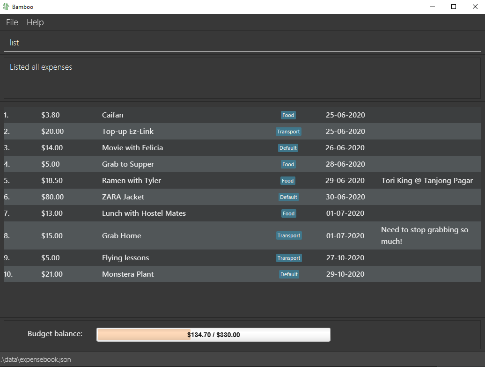
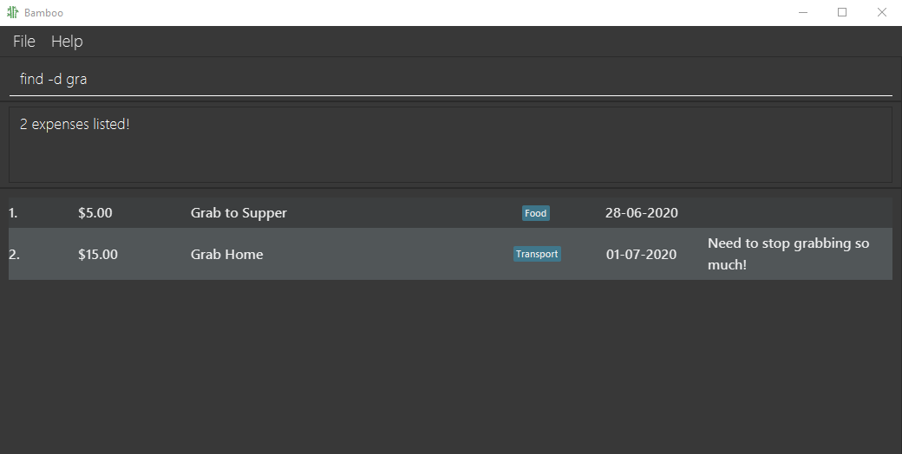

# User Guide

Bamboo (v1.3) is a **simple desktop app for managing personal finance, optimized for use via a Command Line Interface (CLI),** and targeted at college students. If you can type fast, Bamboo v1.2 can get your financial management tasks done faster than traditional GUI apps.

---

## Table of content

1. [Quick Start](#QuickStart)
2. [Features](#Features)
3. [Usage](#Usage)
4. [Command Summary](#CommandSummary)

## Quick Start 

1. Download Java Version 11
2. Download [Bamboo v1.3](https://github.com/AY2021S1-CS2103-W14-3/tp/releases/tag/v1.3).

## Features 

1. **Add**
    - Adds new expense record.
    - Command: `add`
    - [API](#add)

1. **List**
    - Displays a list of the all the user's expenses.
    - Command: `list`
    - [API](#list)

1. **Update**
    - Edits existing expense record.
    - Command: `edit`
    - [API](#edit)

1. **Delete**
    - Deletes a specified existing expense record.
    - Command: `delete`
    - [API](#delete)
    
1. **Adding Remark**
    - Adds a remark to an existing expense.
    - Command: `remark`
    - [API](#remark)

1. **Category Tagging**
    - Tags expenses by their categories.
    - Prefix: `t/`
    - [API](#tag)

1. **Add Category**
    - Adds a new category (for budgeting and expenses).
    - Command: `addCat`
    - [API](#addCat)

1. **Delete Category**
    - Deletes an existing category in the expense book.
    - Command: `deleteCat`
    - [API](#deleteCat) 

1. **Switch Category**
    - Switches an expense book into another existing category.
    - Command: `switch`
    - [API](#switch)

1. **Top up budget**
    - Increases a budget for a specific category by user-defined amount.
    - Command: `topup`
    - [API](#topup)

1. **Find**
    - Finds expenses by keywords, date, tags.
    - Command: `find`
    - [API](#find)
    
1. **Sorting**  
    - Sort by **date, description (alphabetical), amount**, with option of reverse sort.
    - Command: `sort` 
    - [API](#sort)

1. **Map Command Keyword**
    - Maps user-specified keyword to existing command.
    - Command: `alias`
    - [API](#alias)

1. **Help command**
    - Renders a help link to the commands in User Guide
    - Command: `help`
    - [API](#help)

1. **Save Load Function**
    - Automatically saves the state of the expense book after each operation.
    - Automatically loads previously saved data on app start-up.
        
1. **Notifications for budget limits &lt;pending&gt;**
1. **Track progress for long-term purchases &lt;pending&gt;**
1. **Achievement system &lt;pending&gt;**
1. **Graphs and data views &lt;pending&gt;**
1. **Customisation of workflow - shortcuts etc. &lt;pending&gt;**
1. **Simulation of future spending &lt;pending&gt;**
1. **Multiple Accounts &lt;pending&gt;**

## Usage/ API 
For the purposes of Bamboo, the terms `Tag` and `Category` are interchangeable.
### Commands
1. **Add an Expense `add`** 
    - Order of arguments is flexible.
    - If multiple fields of the same type are specified, only the last one is processed.
    - Date input (dd-MM-yyyy) is optional, defaults to system's date (usually today).
    - Tag (or category) input is optional, defaults to the "Default" category. This means that the expense is subtracted 
    from the "Default" Budget.
    - Format: `add -d <description> -$<amount_spent> [-@<date>] [t/<category>]`
    - Example: `add -d dinner -$10.50` Adds the expense to **current date's** record.
    - Example: `add -d dinner -$10.50 -@24-06-2020 t/Food` Adds the expense under **24 June 2020** and tags it under "Food" category.
      
    _**Specifying Category/Tag**_
    - Example: `add -d dinner -$10.50 -@20-08-2020 t/Food t/Basic` As stated above, only `t/Basic` is processed, 
    thus the expense is tagged with the "Basic" category, if it exists.
    - Input constraints:
      - If specified, the tag input must match one of the existing categories in the expense book. If not, the
       expense will be added to the "Default" category - the new category needs to be created first (see [addCategory](#addCat)) 
      - The expense to be added must not share the same identity fields (description, amount and date) as any expense in the expense book.
    
    

1. **List all Expenses `list`** 
    - Displays all the items in the list.
    - Displays the budget balance based on **total expenditure** against the **total sum of all budgets**.
    - Format: `list`
    - Example: `list` 

    

1. **Edit an expense `edit`** 
    - Edits the fields of existing expenses.
    - Identified by index starting from 1, based on expenses currently displayed.
    - Order of arguments is flexible except index.
    - Edited fields overwrite the previous field completely.
    - **At least 1 of the 4 fields** (description, amount, date, category) of expense must be specified.
    - Format: `edit <index> [-d <description>] [-$<amount_spent>] [-@<date>] [t/<category>]`
    - Example: `edit 1 -d lunch -$12.50`
    - Example: `edit 11 -$12.50 -dlunch -@23-06/2020 t/Food`
    - Input constraints:
      - See [add](#add)
    

    
    :bulb: **Note**: Specifying a blank tag field (e.g. `edit 1 t/`) is the same as editing the tag to the "Default" tag.

    

    
    

1. **Delete an Expense `delete`** 
    - Deletes a specified existing expense record.
    - Identified by index starting from 1, based on expenses currently displayed.
    - Format:  `delete <index>`
    - Example: `delete 11` Deletes the item at index 11 of the list.

    

1. **Add a Category `addCat`** 
    - Adds a new category to the expense book.
    - The category must not already exist in the expense book.
    - Format: `addCat t/<category>`
    - Example: `addCat t/Food`
    
    
    _"Shopping" category is added_
    
    
    _Use "Shopping" category_
    
1. **Delete a Category `deleteCat`** 
    - Deletes an existing category in expense book.
    - Category budget of the deleted category will be deleted.
    - All expenses tagged with deleted category will be reverted to "Default" category.
    - Format: `deleteCat t/<category>`
    - Example: `deleteCat t/Food`
    
    
    _Expense 9 is reverted from "Shopping" category to "Default" category_
    
1. **Top up Category Budget `topup`** 
    - Increases the budget of a **particular category** by the amount specified by the user.
    - Expenses in the same category reduce the balance of the budget.
    - Tag (or category) input is optional, defaults to the Default category.
    - Format: `topup -$<amount> [t/<category>]`
    - Example: `topup -$10` Increases the `Default` category's budget by 10 dollars.
    - Example: `topup -$20 t/Food` Adds an extra budget of 20 dollars to the Food category-budget.
    

        
    :bulb: **Note**: Each budget is associated with 1 category, and vice versa.

    

    

1. **Find Expenses `find`** 
    - Finds expenses with given keywords and/or date by user.
    - Expenses that fits the criteria will be presented as another list.
    - For Description, keywords are not case-sensitive, and partial word matching is supported.
    - Date input should be in the format dd-MM-yyyy.
    - Budget Balance shown is overall budget balance (see [list](#list))
    - Format: `find [-d <description>] [-@<date>]`
    - Example: `find -d Phone`, `find -d lunch -@ 01-07-2020`

    
    _Find by partial description keyword_
    
    
    _Find by description keyword and date_

1. **Add a Remark `remark`** 
    - Adds a remark to an existing expense.
    - Format: `remark <index> -r <remark>`
    - Example: `remark 11 -r Pepper Lunch`

    
    
1. **Sort Expenses `sort`** 
    - Sorts expenses which are current displayed.
    - **Sorting keywords** (and thus criterion) include:
        - expense amount: `amount`
        - date: `date`
        - description (alphabetical order): `description` 
    - Add a "R" behind sorting keywords to induce reversed sorting order
    - Sorting criterion are assigned priority in order of appearance.
    - A minimum of 1 sorting keyword is required  
    - Format: `sort -by <sorting keyword> [-by <sorting keyword>] [-by <sorting keyword>]`
    - Example: `sort -by date -by descriptionR` (sorts by date, then by reversed alphabetical order of the descriptions)

    |    _Single parameter sort: ascending Date order_ |    _Multiple parameter sort: in order of appearance – date, then description, then amount (see Expenses 1 and 2)_ |
    |-------------------------------------------------------|---------------------------------------------------------|
    |   _Multi-parameter sort will take the last sorting keyword if there are duplicates_|   _Sorting after using `Find`_ |
    
1. **Switch Category `switch`** 
    - Switches expense book to requested category.
    - Displays all expenses tagged under requested category.
    - Budget balance displayed below is also category-specific.
    - Requested category must exist in expense book.
    - Format: `switch t/<category>`
    - Example: `switch t/Food`
    

        
    :bulb: **Note**: Can also switch to the "Default" category view.

    

    
    _Budget balance displayed here is the budget for the "Food" category_

1. **Map Command Keyword `alias`** 
    - Maps user-specified keyword to existing command.
    - Original command keyword will still function as before.
    - Input Restrictions: 
        - The 2 commands specified cannot be the same.
        - New command cannot be a keyword that is already being used.
        - Original command must exist.
    - Format: `alias <original_command> <new_command>`
    - Example: `alias add spent`
    
    
    _Map "spent" to "add" command_
    
    
    _"spent" keyword now functions as "add"_

1. **Display Help `help`** 
    - Displays a help link to the User Guide, which comprehensively covers Bamboo's commands.
    - Format: `help`
    - Example: `help` 
    
    

### Fields
1. **description**
    - Description of expense.
    - Works only in complement with [add](#add), [edit](#edit), [find](#find), [sort](#sort)
    - Prefix: `-d`
    - Format: `-d <description>`
    - Example: `-d lunch`, `-d dinner`

1. **amount**
    - Amount of money spent in expense.
    - Works only in complement with [add](#add), [edit](#edit), [find](#find), [sort](#sort), [topup](#topup)
    - Prefix: `-$`
    - Format: `-$<amount>`
    - Example: `-$2`, `-$1.50`

1. **date**
    - Date which expense was made.
    - Works only in complement with [add](#add), [edit](#edit), [find](#find), [sort](#sort)
    - Prefix: `-@`
    - Format: `-@<dd-MM-yyyy>`
    - Example: `-@01-07-2020`, `-@02-07-2020`

1. **tag** 
    - Tags expense under a category.
    - Each tag (or category) is associated with 1 budget, and vice versa.
    - Works only in complement with [add](#add), [edit](#edit), [find](#find), [switch](#switch), [addCat](#addCat), [deleteCat](#deleteCat), [topup](#topup)
    - Format: `t/<category>`
    - Example: `edit t/Food`, `find -d Coffee t/Food`

:bulb: **Note:** Prefixes function with or without a whitespace after. (e.g. -`d dinner and -ddinner` will yield the same results)

## Command Summary 

|   Action      | Format, Examples                                                                                                                                                 |
|---------------|------------------------------------------------------------------------------------------------------------------------------------------------------------------|
|  **Add**      | `add -d <description> -$<amount_spent> [-@<date>] [t/<category>]`   e.g., `add -d dinner -$10.50`, `add -d dinner -$10.50 -@20-08-2020 t/Food`                |
|  **List**     | `list`                                                                                                                                                           |
|  **Edit**     | `edit <index> [-d <description>] [-$<amount_spent>] [-@<date>] [t/<category>]`  e.g.,`edit 1 -d lunch -$12.50`, `edit 1 -$12.50 -d lunch -@11-11/2020 t/Lunch`|
| **Delete**    | `delete <index>`  e.g., `delete 1`                                                                                                                            |
| **Topup**     | `topup -$<amount> [t/<category>]`  e.g., `topup -$200`, `topup -$30 t/Food`                                                                                   |
|  **Find**     | `find [-d <description>] [-@<date>]`   e.g., `find -d lunch`, `find -d lunch -@01-07-2020`                                                                    |
| **Remark**    | `remark <index> -r<remark>`   e.g., `remark 11 -r Pepper Lunch`                                                                                               |
| **Sort**      | `sort -by <sorting keyword> [-by <sorting keyword>] [-by <sorting keyword>]`   e.g., `sort -by date -by descriptionR`                                         |
| **Switch**    | `switch t/<category>`   e.g., `switch t/Food`                                                                                                                 |
| **AddCat**    | `addCat t/<category>`  e.g., `addCat t/Food`                                                                                                                  |
| **DeleteCat** | `deleteCat t/<category>`   e.g., `deleteCat t/Food`                                                                                                           |
| **Alias**     | `alias <original_command> <new_command>`   e.g., `alias add spent`                                                                                            |
| **Help**      | `help`                                                                                                                                                           |
