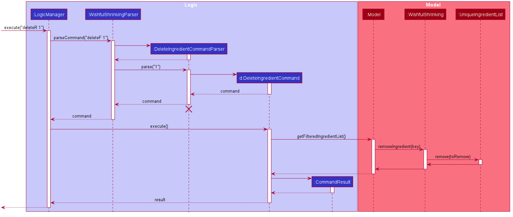

### Delete ingredient feature

#### Implementation
This feature allows users to delete the ingredients they have in the fridge.

Substitutability is used in Command and Parser:
* `DeleteIngredientCommand` extends `Command`
* `DeleteIngredientCommandParser` implements `Parser<DeleteIngredientCommand>`

Given below is an example usage scenario and how the mechanism behaves at each step.

Step 1:
User inputs the delete ingredient command to delete an ingredient from the `UniqueIngredientList`.

Step 2:
After successful parsing of user input, the `DeleteIngredientCommand#execute(Model model)` method is called.

Step 3:
The Ingredient that the user has specified by using index will be deleted from the `UniqueIngredienList`.

Step 4:
After the successful deleting of an `Ingredient`, a `CommandResult` object is instantiated and returned to `LogicManager`.

The following sequence diagram shows how eat Ingredient operation works when `execute(deleteF 1)` API call:

#### Design consideration:
##### Aspect 1: Concern while adding a new feature
* Workflow must be consistent with other deleting commands e.g. delete recipe and delete consumption.
