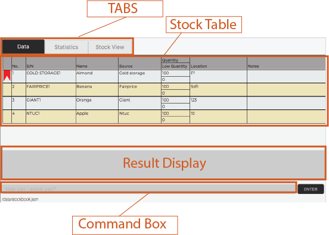

Warenager is an **inventory management application** to help warehouse managers
of small scale companies keep track of stocks in their warehouse.
It **optimizes inventory management tasks** for warehouse managers including but not
exhaustive of **updating, searching and sorting stocks** via Command Line Interface (CLI),
while still having the benefits of a Graphical User Interface (GUI).

## User interface

Example usages:
  * as an inventory manager (as opposed to physical tracking of your stocks on paper)
  * as a locator for items in inventory

### Features

**:information_source: Brief summary of features:** 

Note: Stocks possess these fields: Name, Serial Number, Source, Quantity, Location etc.  
(These stock details are presented in a drop down window.)

* **Adding** stocks: Unique serial number is generated based on the stock item and source company.
* **Deleting** stocks
* **Updating** stock fields
* **Searching** for stocks by
    * name of stock
    * serial number
    * source of stock
    * location stored in warehouse
* Adding / Deleting **optional notes** to stocks
* **Viewing** all details of a stock
* **Bookmarking** stocks: e.g. often used stocks, search bookmark<item>.
* **Print** to generate CSV file for printing of stock list.
* **Clear** to clear **all** existing data in Warenager.
* **Tab** to toggle between tabs in Warenager.
* **Listing** all stocks in Warenager.
* **Suggesting** valid command formats when an invalid command is entered.
* **Sorting** all stocks according to the field and order specified by the user.
* **Storage** into CSV and JSON files.
* Upon start up of the Warenager application, stocks are by default displayed according to the order
in `stockbook.json`.

If you are interested in using Warenager, head over to the Quick Start section of the [User Guide](https://ay2021s1-cs2103t-t15-3.github.io/tp/UserGuide.html#quick-start).
If you are interested in developing Warenager, head over to our [Developer Guide](https://ay2021s1-cs2103t-t15-3.github.io/tp/DeveloperGuide.html) for a start.

**Acknowledgements**

This project is based on the AddressBook-Level3 project created by the [SE-EDU initiative](https://se-education.org).
* Libraries used: [JavaFX](https://openjfx.io/), [Jackson](https://github.com/FasterXML/jackson), [JUnit5](https://github.com/junit-team/junit5)
