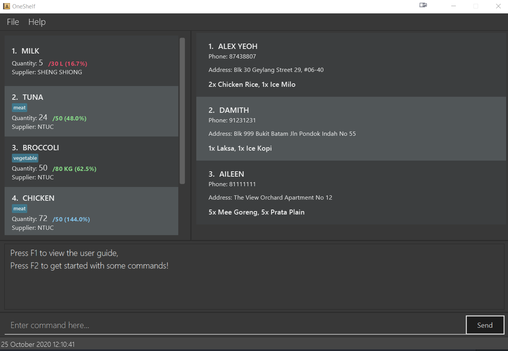

**OneShelf** is a desktop application for you to manage all of restaurant inventories,
table reservations and pending deliveries. It is easy to build and customise your inventories
by using only Command Line Interface. If you are a busy restaurant manager who prefers
to use the Command Line Interface and needs to keep track of multiple items,
 **OneShelf** is for you!

* If you are interested in using OneShelf, head over to the [_Quick Start_ section of the **User Guide**](UserGuide.html#quick-start).
* If you are interested about developing OneShelf, the [**Developer Guide**](DeveloperGuide.html) is a good place to start.

**Acknowledgements**

* Libraries used: [JavaFX](https://openjfx.io/), [Jackson](https://github.com/FasterXML/jackson), [JUnit5](https://github.com/junit-team/junit5)
* This project is based on the AddressBook-Level3 project created by the [SE-EDU initiative](https://se-education.org).
