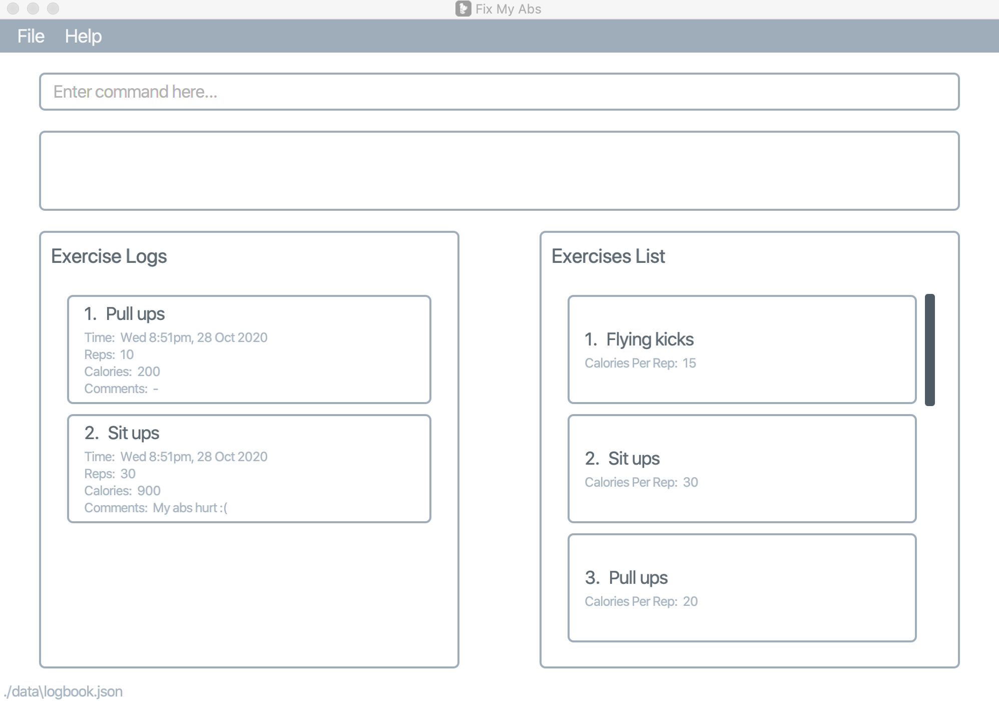

**FixMyAbs is a desktop app for managing exercises, optimized for use via a Command Line Interface (CLI) while still having the benefits of a Graphical User Interface (GUI).** While it has a GUI, most of the user
 interactions happen using a CLI (Command Line Interface).

**Acknowledgements**
* Libraries used: [JavaFX](https://openjfx.io/), [Jackson](https://github.com/FasterXML/jackson), [JUnit5](https://github.com/junit-team/junit5)
