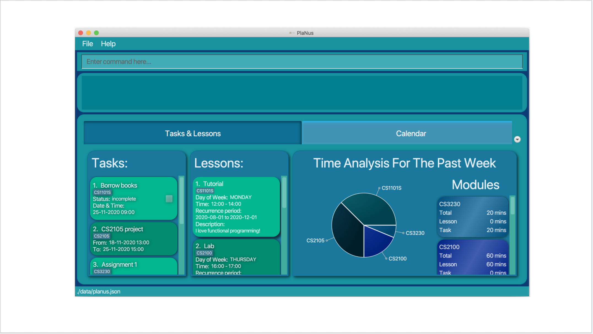

PlaNus is a desktop application for NUS students for **managing tasks, optimized for use via a Command Line
Interface (CLI)** while still having the benefits of a Graphical User Interface (GUI). If you can
type fast, PlaNus can get your tasks managed faster than traditional GUI apps.

* If you are interested in using PlaNus, head over to the [**User Guide**](UserGuide.html#introduction).
* If you are interested about developing PlaNus, the [**Developer Guide**](DeveloperGuide.html) is a good place to start.

**Acknowledgements**

* Libraries used: [JavaFX](https://openjfx.io/), [Jackson](https://github.com/FasterXML/jackson), [JUnit5](https://github.com/junit-team/junit5)
* This project is based on the AddressBook-Level3 project created by the [SE-EDU initiative](https://se-education.org).
